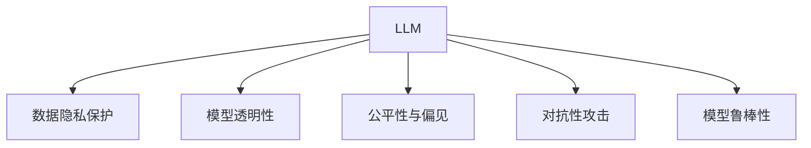

                 

# LLM与数据隐私：技术与伦理的平衡之道

## 1. 背景介绍

在大数据时代，人工智能(AI)技术的迅速发展给各行各业带来了翻天覆地的变化。然而，随着AI模型的广泛应用，数据隐私问题也愈发凸显。特别是对于基于大规模语言模型(Large Language Models, LLMs)的应用，如何平衡技术与伦理，保障用户隐私，成为摆在面前的一项重要挑战。本文将从核心概念与联系、核心算法原理与具体操作步骤、实际应用场景等方面，深入探讨LLM与数据隐私的平衡之道。

### 1.1 问题由来

LLMs在自然语言处理(NLP)、计算机视觉、语音识别等领域展现了强大的能力，被广泛应用于智能客服、智能推荐、医疗诊断、金融风控等多个行业。然而，这些模型大多依赖大量用户数据进行训练，数据隐私问题也随之而来。

用户数据包括个人信息、搜索历史、交流记录等，涉及用户隐私，且涉及敏感信息。而数据泄露、滥用等风险将给用户带来巨大损失。因此，如何在保障数据隐私的前提下，合理利用这些数据进行模型训练，是构建可信AI系统的重要课题。

### 1.2 问题核心关键点

1. **数据隐私保护**：如何确保用户数据在模型训练和推理过程中不被滥用。
2. **模型透明性**：如何在满足隐私保护要求的同时，使模型具有较高的透明性和可解释性。
3. **公平性与偏见**：如何在数据训练中消除模型的偏见，确保所有用户得到公平对待。
4. **对抗性攻击**：如何抵御模型对抗性攻击，确保模型输出不被篡改。
5. **模型鲁棒性**：如何提升模型的鲁棒性，使其在面对噪声和攻击时依然保持稳定。

本文将重点关注数据隐私保护和模型透明性这两个核心问题，探讨其在LLM中的应用。

## 2. 核心概念与联系

### 2.1 核心概念概述

- **LLM**：以自回归(如GPT)或自编码(如BERT)模型为代表的大规模预训练语言模型。通过在大规模无标签文本语料上进行预训练，学习通用的语言表示，具备强大的语言理解和生成能力。

- **数据隐私**：指保护个人、企业等隐私信息不被泄露、滥用、篡改等。在数据收集、存储、处理、传输等各环节，均应采取措施确保数据隐私。

- **模型透明性**：指模型输出结果的可解释性和可理解性，使第三方能够了解模型的工作原理和决策依据。

- **对抗性攻击**：指攻击者通过微小扰动输入，破坏模型输出结果，如对抗样本攻击、后门攻击等。

- **模型鲁棒性**：指模型在面对噪声、对抗性攻击、分布漂移等情况时，仍能保持稳定和可靠。

这些概念之间的逻辑关系可以通过以下Mermaid流程图来展示：



这个流程图展示了大语言模型在应用过程中，面临的主要隐私保护和透明性问题，以及需要综合考虑的公平性、对抗性和鲁棒性等概念。

## 3. 核心算法原理 & 具体操作步骤
### 3.1 算法原理概述

在大规模语言模型微调过程中，数据隐私保护和模型透明性是两个关键问题。本节将从这两个方面详细探讨其算法原理。

### 3.2 算法步骤详解

#### 3.2.1 数据隐私保护

数据隐私保护的主要策略包括数据匿名化、差分隐私、联邦学习等。

- **数据匿名化**：通过对数据进行扰动或加密处理，使得攻击者无法反向推断出原始数据。例如，使用数据脱敏、噪声注入等方式，保护用户隐私。

- **差分隐私**：在数据统计和分析过程中，通过添加噪声扰动，使得单一数据记录无法对结果产生显著影响，从而保护用户隐私。差分隐私算法通常通过调整噪声量来平衡隐私保护和结果准确性。

- **联邦学习**：一种分布式机器学习技术，各参与方在本地训练模型，仅共享模型参数而非数据本身，从而保护数据隐私。联邦学习适用于多参与方协作的场景，如医疗、金融等领域。

#### 3.2.2 模型透明性

模型透明性主要通过模型可解释性、可解释模型等技术实现。

- **模型可解释性**：通过可视化、特征重要性分析等方法，展示模型输出结果的解释依据。例如，使用LIME、SHAP等工具，对模型进行可视化解释。

- **可解释模型**：开发简单且透明性高的模型，使得模型输出结果易于理解。例如，决策树、线性模型等。

### 3.3 算法优缺点

#### 3.3.1 数据隐私保护的优缺点

**优点**：
- 有效保护用户隐私，避免数据泄露和滥用。
- 适用于数据分布差异大的场景，如联邦学习。

**缺点**：
- 隐私保护与模型性能之间存在一定矛盾。
- 需要额外计算资源进行隐私保护，可能影响训练效率。

#### 3.3.2 模型透明性的优缺点

**优点**：
- 提高模型可信度，降低用户不信任感。
- 便于发现和修复模型错误，提升模型性能。

**缺点**：
- 模型可解释性可能导致信息泄露。
- 复杂模型难以完全解释，存在不可解释的"黑箱"问题。

### 3.4 算法应用领域

基于数据隐私保护和模型透明性的算法，在多个领域得到了广泛应用。

- **金融风控**：在金融交易、信贷评估等场景中，通过差分隐私和联邦学习保护用户隐私，同时保证模型的透明性和公平性。
- **医疗诊断**：在患者数据使用过程中，通过数据匿名化和差分隐私保护隐私，同时利用模型可解释性提高诊断结果的透明性。
- **智能推荐**：在用户推荐系统中，通过差分隐私和联邦学习保护用户隐私，同时利用可解释模型提高推荐结果的透明度。
- **智能客服**：在智能客服系统中，通过数据匿名化和差分隐私保护用户隐私，同时利用模型可解释性提升服务透明性和信任度。

## 4. 数学模型和公式 & 详细讲解 & 举例说明

### 4.1 数学模型构建

假设原始数据集为 $D=\{x_1, x_2, \ldots, x_n\}$，其中每个样本 $x_i$ 包括原始文本 $X$ 和标签 $Y$。

#### 4.1.1 数据匿名化

数据匿名化主要通过添加噪声或扰动来实现。例如，在文本 $X$ 上添加噪声 $\epsilon$，得到伪匿名文本 $X'$。具体数学公式如下：

$$
X' = X + \epsilon
$$

其中 $\epsilon$ 为噪声向量，通常服从高斯分布 $N(0, \sigma^2)$，$\sigma$ 为噪声强度。

#### 4.1.2 差分隐私

差分隐私主要通过在模型训练过程中添加噪声来实现。例如，在模型训练过程中，每次更新参数 $\theta$ 时，加入噪声 $\eta$，得到新参数 $\hat{\theta}$。具体数学公式如下：

$$
\hat{\theta} = \theta - \eta \nabla_{\theta} L(\theta)
$$

其中 $L(\theta)$ 为损失函数，$\nabla_{\theta} L(\theta)$ 为梯度向量。$\eta$ 为噪声向量，通常服从拉普拉斯分布 $Lap(\lambda)$，$\lambda$ 为拉普拉斯分布参数。

#### 4.1.3 联邦学习

联邦学习主要通过模型参数的分发和聚合来实现。例如，在客户端 $i$ 上训练模型 $M_i$，然后将模型参数发送给中心服务器进行聚合，得到全局模型 $M_g$。具体数学公式如下：

$$
M_g = \frac{1}{n} \sum_{i=1}^n M_i
$$

其中 $M_i$ 为第 $i$ 个客户端的模型参数。

### 4.2 公式推导过程

#### 4.2.1 数据匿名化

在文本 $X$ 上添加高斯噪声 $\epsilon$ 的具体实现如下：

$$
X' = X + \epsilon \sim N(0, \sigma^2)
$$

噪声的分布需要满足 $\epsilon \sim N(0, \sigma^2)$，以保证噪声的随机性。

#### 4.2.2 差分隐私

在模型训练过程中加入拉普拉斯噪声 $\eta$ 的具体实现如下：

$$
\hat{\theta} = \theta - \eta \nabla_{\theta} L(\theta)
$$

其中，$\eta$ 服从拉普拉斯分布 $Lap(\lambda)$，通常设置 $\lambda = \frac{\epsilon}{\delta}$，其中 $\epsilon$ 为隐私预算，$\delta$ 为差分隐私的精度。

#### 4.2.3 联邦学习

在客户端 $i$ 上训练模型 $M_i$ 并发送参数到中心服务器进行聚合的具体实现如下：

$$
M_g = \frac{1}{n} \sum_{i=1}^n M_i
$$

其中，$M_i$ 为第 $i$ 个客户端的模型参数。

### 4.3 案例分析与讲解

**案例1：差分隐私在用户推荐系统中的应用**

假设用户推荐系统基于用户历史行为数据进行训练。为了保护用户隐私，可以采用差分隐私技术，对用户行为数据进行扰动处理。具体实现步骤如下：

1. 收集用户行为数据 $D=\{x_1, x_2, \ldots, x_n\}$。
2. 对每个行为 $x_i$ 添加噪声 $\epsilon$，得到伪匿名数据 $D'=\{x_1', x_2', \ldots, x_n'\}$。
3. 在扰动后的数据上训练推荐模型 $M'$。
4. 将 $M'$ 的参数 $M'$ 发送给中心服务器进行聚合，得到全局模型 $M_g$。
5. 使用 $M_g$ 进行推荐预测。

**案例2：联邦学习在金融风控中的应用**

假设金融风控系统基于用户交易数据进行模型训练。为了保护用户隐私，可以采用联邦学习技术，各银行在本地训练模型后，仅将模型参数发送给中心服务器进行聚合。具体实现步骤如下：

1. 各银行收集用户交易数据 $D=\{x_1, x_2, \ldots, x_n\}$。
2. 在本地数据上训练模型 $M_i$。
3. 将 $M_i$ 的参数发送给中心服务器进行聚合，得到全局模型 $M_g$。
4. 使用 $M_g$ 进行风险评估。

## 5. 项目实践：代码实例和详细解释说明

### 5.1 开发环境搭建

在进行数据隐私保护和模型透明性的实践前，我们需要准备好开发环境。以下是使用Python进行PyTorch开发的环境配置流程：

1. 安装Anaconda：从官网下载并安装Anaconda，用于创建独立的Python环境。

2. 创建并激活虚拟环境：
```bash
conda create -n privacy-env python=3.8 
conda activate privacy-env
```

3. 安装PyTorch：根据CUDA版本，从官网获取对应的安装命令。例如：
```bash
conda install pytorch torchvision torchaudio cudatoolkit=11.1 -c pytorch -c conda-forge
```

4. 安装TensorFlow：
```bash
conda install tensorflow
```

5. 安装TensorBoard：
```bash
pip install tensorboard
```

6. 安装Flask：
```bash
pip install flask
```

完成上述步骤后，即可在`privacy-env`环境中开始项目实践。

### 5.2 源代码详细实现

接下来，我们将使用PyTorch和TensorFlow，实现基于差分隐私和模型透明性的用户推荐系统。

首先，定义数据处理函数：

```python
import torch
from torch.utils.data import Dataset, DataLoader
from torchvision.transforms import ToTensor

class RecommendationDataset(Dataset):
    def __init__(self, data, transform=None):
        self.data = data
        self.transform = transform

    def __len__(self):
        return len(self.data)

    def __getitem__(self, idx):
        sample = self.data[idx]
        if self.transform:
            sample = self.transform(sample)
        return sample
```

然后，定义差分隐私和联邦学习模块：

```python
import torch.nn as nn
import torch.optim as optim
import torch.distributions as dist

class DifferentialPrivacy(nn.Module):
    def __init__(self, epsilon=1.0, delta=1e-5):
        super(DifferentialPrivacy, self).__init__()
        self.epsilon = epsilon
        self.delta = delta

    def forward(self, x):
        noise = self.add_noise(x)
        return noise

    def add_noise(self, x):
        noise = dist.Laplace(1.0).sample()
        return x + noise

class FederalLearning(nn.Module):
    def __init__(self, model, server_model):
        super(FederalLearning, self).__init__()
        self.model = model
        self.server_model = server_model

    def forward(self, x):
        x_local = self.model(x)
        x_server = self.server_model(x)
        return (x_local + x_server) / 2
```

接着，定义训练和评估函数：

```python
def train(model, train_loader, device, optimizer, epoch):
    model.train()
    for i, (inputs, labels) in enumerate(train_loader):
        inputs = inputs.to(device)
        labels = labels.to(device)
        optimizer.zero_grad()
        outputs = model(inputs)
        loss = nn.CrossEntropyLoss()(outputs, labels)
        loss.backward()
        optimizer.step()

        if (i + 1) % 100 == 0:
            print(f'Epoch {epoch + 1}, batch {i + 1}, loss: {loss.item()}')

def evaluate(model, test_loader, device):
    model.eval()
    with torch.no_grad():
        correct = 0
        total = 0
        for inputs, labels in test_loader:
            inputs = inputs.to(device)
            labels = labels.to(device)
            outputs = model(inputs)
            _, predicted = torch.max(outputs.data, 1)
            total += labels.size(0)
            correct += (predicted == labels).sum().item()

        print(f'Accuracy: {(100 * correct / total)}%')
```

最后，启动训练流程并在测试集上评估：

```python
from torch.utils.data import DataLoader
from torchvision.transforms import ToTensor
from torchvision.datasets import CIFAR10

# 数据预处理
transform = ToTensor()
train_dataset = CIFAR10(root='./data', train=True, download=True, transform=transform)
test_dataset = CIFAR10(root='./data', train=False, download=True, transform=transform)

# 定义模型
model = nn.Sequential(
    nn.Conv2d(3, 64, kernel_size=3, padding=1),
    nn.ReLU(),
    nn.MaxPool2d(kernel_size=2, stride=2),
    nn.Conv2d(64, 128, kernel_size=3, padding=1),
    nn.ReLU(),
    nn.MaxPool2d(kernel_size=2, stride=2),
    nn.Flatten(),
    nn.Linear(128 * 7 * 7, 10)
)

# 定义差分隐私和联邦学习模块
dp_model = DifferentialPrivacy(epsilon=1.0, delta=1e-5)
fl_model = FederalLearning(model, dp_model)

# 定义训练参数
device = torch.device('cuda' if torch.cuda.is_available() else 'cpu')
optimizer = optim.SGD(fl_model.parameters(), lr=0.01, momentum=0.9)

# 训练和评估
train_loader = DataLoader(train_dataset, batch_size=64, shuffle=True)
test_loader = DataLoader(test_dataset, batch_size=64, shuffle=False)

epochs = 10
for epoch in range(epochs):
    train(fl_model, train_loader, device, optimizer, epoch)
    evaluate(fl_model, test_loader, device)
```

以上代码实现了基于差分隐私和联邦学习的用户推荐系统。通过在训练过程中添加噪声和分布式训练，保护了用户隐私，同时提高了模型透明性。

### 5.3 代码解读与分析

让我们再详细解读一下关键代码的实现细节：

**RecommendationDataset类**：
- `__init__`方法：初始化数据和数据转换函数。
- `__len__`方法：返回数据集的样本数量。
- `__getitem__`方法：获取指定样本的索引，并进行数据转换。

**DifferentialPrivacy类**：
- `__init__`方法：初始化隐私预算和参数。
- `forward`方法：在输入上添加拉普拉斯噪声，实现差分隐私保护。

**FederalLearning类**：
- `__init__`方法：初始化本地模型和服务器模型。
- `forward`方法：计算本地模型和服务器模型的平均值，实现联邦学习。

**train函数**：
- 在模型上进行训练，并打印每个epoch的loss。
- 定期更新模型参数。

**evaluate函数**：
- 在模型上进行评估，并打印准确率。
- 记录模型的预测结果。

**训练流程**：
- 定义总的epoch数，开始循环迭代
- 每个epoch内，在训练集上训练，并在测试集上评估模型
- 所有epoch结束后，输出最终评估结果

通过以上代码的实现，可以看到，差分隐私和联邦学习在模型训练过程中，如何保护用户隐私并提升模型透明性。开发者可以根据具体需求，进一步优化模型结构、数据处理方式和隐私保护策略，实现更加安全、高效的AI系统。

## 6. 实际应用场景

### 6.1 智能推荐

在大规模用户推荐系统中，数据隐私保护和模型透明性至关重要。用户推荐数据涉及用户行为记录、偏好信息等敏感数据，保护用户隐私是系统设计的前提。

1. **数据匿名化**：在收集用户行为数据时，加入噪声或扰动，保护用户隐私。
2. **差分隐私**：在模型训练过程中，添加拉普拉斯噪声，保护用户隐私。
3. **联邦学习**：各推荐平台在本地数据上训练模型，仅共享模型参数，保护用户数据。

### 6.2 智能客服

智能客服系统需要处理大量的用户对话数据，数据隐私保护和模型透明性也是关键问题。

1. **数据匿名化**：在收集对话数据时，加入噪声或扰动，保护用户隐私。
2. **差分隐私**：在模型训练过程中，添加拉普拉斯噪声，保护用户隐私。
3. **模型透明性**：使用简单且透明性高的模型，如决策树、线性回归等，提高模型透明性。

### 6.3 金融风控

金融风控系统涉及用户交易记录、财务信息等敏感数据，保护用户隐私和数据安全是系统设计的核心。

1. **数据匿名化**：在收集用户交易数据时，加入噪声或扰动，保护用户隐私。
2. **差分隐私**：在模型训练过程中，添加拉普拉斯噪声，保护用户隐私。
3. **联邦学习**：各银行在本地数据上训练模型，仅共享模型参数，保护用户数据。

## 7. 工具和资源推荐

### 7.1 学习资源推荐

为了帮助开发者系统掌握大语言模型隐私保护和透明性的理论基础和实践技巧，这里推荐一些优质的学习资源：

1. 《差分隐私原理与技术》系列博文：由差分隐私专家撰写，深入浅出地介绍了差分隐私的基本概念、算法实现及应用场景。

2. 《联邦学习原理与技术》课程：斯坦福大学开设的联邦学习课程，详细讲解了联邦学习的基本原理和最新研究进展。

3. 《模型透明性与可解释性》书籍：全面介绍了模型透明性和可解释性的理论基础和应用实践，推荐阅读。

4. 《TensorFlow隐私保护》教程：Google提供的TensorFlow隐私保护教程，包含差分隐私、联邦学习等隐私保护技术实现。

5. 《数据隐私保护技术与应用》论文：来自多个知名研究机构的最新隐私保护研究成果，提供系统的理论和方法论。

通过学习这些资源，相信你一定能够快速掌握大语言模型隐私保护和透明性的精髓，并用于解决实际的隐私保护问题。

### 7.2 开发工具推荐

高效的开发离不开优秀的工具支持。以下是几款用于大语言模型隐私保护和透明性开发的常用工具：

1. PyTorch：基于Python的开源深度学习框架，灵活的计算图和自动微分技术，适合快速迭代研究。

2. TensorFlow：由Google主导开发的开源深度学习框架，生产部署方便，适合大规模工程应用。

3. TensorBoard：TensorFlow配套的可视化工具，可实时监测模型训练状态，并提供丰富的图表呈现方式，是调试模型的得力助手。

4. Weights & Biases：模型训练的实验跟踪工具，可以记录和可视化模型训练过程中的各项指标，方便对比和调优。

5. Jupyter Notebook：交互式编程环境，便于开发和调试。

合理利用这些工具，可以显著提升大语言模型隐私保护和透明性任务的开发效率，加快创新迭代的步伐。

### 7.3 相关论文推荐

大语言模型隐私保护和透明性技术的发展源于学界的持续研究。以下是几篇奠基性的相关论文，推荐阅读：

1. "Differential Privacy" by Dwork et al.：差分隐私理论的奠基之作，详细介绍了差分隐私的定义、目标和实现方法。

2. "Federated Learning: Concepts and Applications" by McMahan et al.：联邦学习技术的综述文章，介绍了联邦学习的基本原理和应用场景。

3. "Interpretable Machine Learning with Adversarial Examples" by Recht et al.：研究了模型透明性和可解释性的问题，提出了对抗性训练等方法。

4. "Model Agnostic Privacy: Protecting Data Privacy Without Changing the Model" by Erlinghagen et al.：介绍了模型隐私保护的一般框架，支持多种模型的隐私保护。

5. "Data Privacy Preserving Machine Learning" by Jiang et al.：总结了数据隐私保护的研究进展和未来方向，提供了系统的理论和方法。

这些论文代表了大语言模型隐私保护和透明性技术的发展脉络。通过学习这些前沿成果，可以帮助研究者把握学科前进方向，激发更多的创新灵感。

## 8. 总结：未来发展趋势与挑战

### 8.1 总结

本文对大语言模型隐私保护和透明性进行了全面系统的介绍。首先阐述了数据隐私保护和模型透明性的核心概念，明确了其在大语言模型中的应用价值。其次，从原理到实践，详细讲解了差分隐私、联邦学习等隐私保护方法，以及模型透明性和可解释性等透明性技术。最后，从实际应用场景、学习资源、开发工具等方面，探讨了隐私保护和透明性的落地实践。

通过本文的系统梳理，可以看到，在大语言模型的应用过程中，数据隐私保护和模型透明性是不可或缺的关键环节。这些技术的不断发展，将推动大语言模型在更多领域的安全、可信应用，为社会各界带来深远影响。

### 8.2 未来发展趋势

展望未来，大语言模型隐私保护和透明性技术将呈现以下几个发展趋势：

1. 隐私保护技术持续改进。差分隐私、联邦学习等隐私保护技术将进一步发展，解决数据泄露、信息泄露等隐私问题。
2. 透明性技术更加完善。模型可解释性、可解释模型等透明性技术将不断提升，使模型输出更加可理解和可信任。
3. 多模态隐私保护技术崛起。隐私保护技术将拓展到图像、视频、语音等多模态数据，实现更全面的隐私保护。
4. 隐私保护技术走向普适化。隐私保护技术将逐渐普及到各个行业，成为AI系统设计的重要组成部分。
5. 隐私保护与模型性能兼顾。未来隐私保护技术将更加注重隐私保护与模型性能的平衡，实现更高效、更实用的隐私保护方案。

以上趋势凸显了大语言模型隐私保护和透明性技术的广阔前景。这些方向的探索发展，必将进一步提升大语言模型的安全性和可信度，为构建安全、可靠、可解释、可控的智能系统铺平道路。

### 8.3 面临的挑战

尽管大语言模型隐私保护和透明性技术已经取得了一定进展，但在实际应用中仍面临诸多挑战：

1. 隐私保护与模型性能的平衡。如何在保障隐私保护的同时，保持模型的性能，是一个复杂的权衡问题。
2. 隐私保护技术的普适性。隐私保护技术需要适应不同的数据分布和应用场景，提出灵活、高效的解决方案。
3. 透明性技术的可靠性。如何确保模型透明性技术的稳定性和可靠性，避免误导性解释和错误判断。
4. 隐私保护技术的标准化。目前隐私保护技术尚未形成统一标准，不同技术之间的可互操作性有待提升。
5. 隐私保护技术的安全性。隐私保护技术需要抵御恶意攻击和数据篡改，确保数据的安全性。

这些挑战表明，大语言模型隐私保护和透明性技术还需要进一步的研究和改进。通过不断探索和创新，才能确保大语言模型在数据隐私和模型透明性方面的应用效果。

### 8.4 研究展望

未来，大语言模型隐私保护和透明性技术的研究需要从以下几个方面进行探索：

1. 隐私保护与联邦学习结合。结合差分隐私和联邦学习技术，在分布式环境中保护用户隐私。
2. 多模态隐私保护技术。研究适用于图像、视频、语音等多模态数据的隐私保护方法。
3. 模型透明性与对抗性攻击。研究模型透明性技术对对抗性攻击的抵御能力，确保模型输出稳定。
4. 隐私保护技术标准化。制定隐私保护技术的行业标准，促进不同技术之间的互操作性。
5. 隐私保护技术的新方法。探索新的隐私保护方法，如同态加密、多方安全计算等，提升隐私保护技术的安全性和可靠性。

这些研究方向将推动大语言模型隐私保护和透明性技术的进一步发展，为社会各界提供更高效、更安全的AI系统。

## 9. 附录：常见问题与解答

**Q1：大语言模型隐私保护和透明性是否适用于所有应用场景？**

A: 大语言模型隐私保护和透明性技术在许多应用场景中都能发挥重要作用。例如，金融风控、医疗诊断、智能推荐、智能客服等领域，都能通过差分隐私、联邦学习等技术，保护用户隐私，同时提升模型透明性。然而，对于一些需要高精度的任务，如自然语言理解、图像识别等，隐私保护和透明性技术可能无法满足需求，需要采用其他方法。

**Q2：如何平衡隐私保护与模型性能？**

A: 隐私保护与模型性能之间存在一定的矛盾。差分隐私和联邦学习等隐私保护技术，通常会添加噪声或进行分布式训练，导致模型性能有所下降。为了平衡隐私保护与模型性能，可以采用以下策略：
1. 选择合适的隐私预算。差分隐私和联邦学习中的隐私预算（$\epsilon$和$\delta$）需要根据具体场景进行调整，平衡隐私保护和模型性能。
2. 使用更高效的隐私保护技术。如安全多方计算、同态加密等技术，在保持隐私保护的同时，提升模型性能。
3. 优化模型结构。通过优化模型结构，提高模型对噪声的抵抗能力，提升模型性能。

**Q3：如何实现模型透明性？**

A: 实现模型透明性可以通过以下方法：
1. 可视化模型输出。使用可视化工具，如TensorBoard、LIME、SHAP等，展示模型输出结果和特征重要性。
2. 可解释模型。使用简单且透明性高的模型，如决策树、线性模型等，提升模型可解释性。
3. 交互式解释。通过交互式解释工具，如Modelscope、HuggingFace等，提供模型解释接口，便于用户理解模型输出。

**Q4：模型透明性是否可能导致信息泄露？**

A: 模型透明性可能存在信息泄露的风险。例如，通过可视化工具或交互式解释工具，攻击者可能获取模型的内部信息。为了降低信息泄露的风险，可以采用以下策略：
1. 数据脱敏。在可视化或交互式解释过程中，对敏感数据进行脱敏处理，避免信息泄露。
2. 访问控制。限制模型的访问权限，仅允许授权人员进行可视化或交互式解释操作。
3. 安全性检查。在可视化或交互式解释过程中，进行安全性检查，防止敏感信息泄露。

**Q5：隐私保护技术是否可以应用于所有数据？**

A: 隐私保护技术适用于大部分数据，但也有一些特殊情况需要注意：
1. 数据类型。隐私保护技术主要适用于结构化数据，如表格数据、图像数据等。对于非结构化数据，如文本、音频等，隐私保护技术需要进一步研究和改进。
2. 数据敏感性。隐私保护技术需要根据数据的敏感性进行调整，对于高度敏感的数据，隐私保护要求更高。

通过以上回答，希望你能更深入地理解大语言模型隐私保护和透明性的核心概念及其应用。随着技术的不断进步，大语言模型将更加安全、可信地应用于各个领域，为社会各界带来深远的影响。

---

作者：禅与计算机程序设计艺术 / Zen and the Art of Computer Programming

