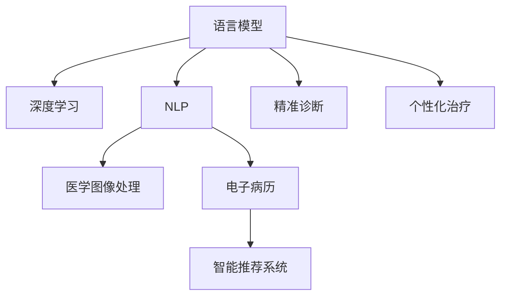

                 

# LLM与智能医疗设备：精准诊断与治疗

> 关键词：语言模型,医疗设备,精准诊断,治疗,医学图像,自然语言处理,疾病预测,电子病历,智能分析

## 1. 背景介绍

### 1.1 问题由来
人工智能(AI)在医疗领域的应用已经展现出巨大潜力。传统的医疗设备往往依赖医生的经验和直觉进行诊断和治疗，不仅耗时耗力，还容易出现误诊或漏诊。随着深度学习和自然语言处理(NLP)技术的不断发展，基于语言模型的医疗AI系统正成为新一代精准诊断与治疗工具。

### 1.2 问题核心关键点
语言模型在医疗领域的应用主要涉及以下几个方面：
- **疾病预测**：通过分析病历记录和基因数据，预测疾病发生的可能性。
- **医学图像分析**：从CT、MRI等医学影像中识别病变，辅助放射科医生进行诊断。
- **自然语言处理(NLP)**：解析和提取电子病历中的信息，为医生提供参考和决策支持。
- **智能推荐**：根据患者病情，推荐个性化的治疗方案和药物。

这些应用不仅提高了医疗服务的效率，还能减少误诊率，提升医疗质量。但语言模型在医疗领域的应用面临一些挑战，如数据隐私、模型可解释性、误诊风险等。因此，构建基于语言模型的智能医疗设备，需要综合考虑技术的科学性和应用的安全性。

### 1.3 问题研究意义
语言模型在医疗领域的深入应用，对于提高医疗服务的智能化水平，推动医疗行业转型升级具有重要意义：

1. **提高诊断效率**：自动化处理大量医疗数据，缩短诊断时间。
2. **降低误诊率**：结合临床知识和图像分析，提供更精准的诊断结果。
3. **个性化治疗**：根据患者的具体病情和基因特征，推荐最适合的治疗方案。
4. **医疗资源优化**：辅助医生进行决策，合理分配医疗资源。
5. **增强医患沟通**：通过智能问答，提升患者的理解和满意度。

## 2. 核心概念与联系

### 2.1 核心概念概述

为更好地理解语言模型在医疗领域的精准诊断与治疗应用，本节将介绍几个关键概念及其相互关系：

- **语言模型(Language Model, LM)**：通过统计语言序列的概率分布，预测给定文本序列的下一个单词或字符的概率。常见语言模型包括N-gram模型、循环神经网络(RNN)、长短时记忆网络(LSTM)、Transformer等。
- **深度学习(Deep Learning, DL)**：通过多层神经网络，提取和抽象高层次的特征，进行复杂的非线性建模。
- **自然语言处理(Natural Language Processing, NLP)**：使用计算机技术理解和生成人类语言。
- **医学图像处理(Medical Image Processing)**：对医学影像进行分析和识别，辅助医生进行诊断和治疗。
- **电子病历(Electronic Health Record, EHR)**：记录患者病史和临床信息的数据库，供医生参考和研究。
- **智能推荐系统(Intelligent Recommendation System)**：通过分析用户行为和特征，推荐个性化的产品或服务。

这些核心概念之间的逻辑关系可以通过以下Mermaid流程图来展示：



这个流程图展示了语言模型与其他核心概念之间的联系：

1. 语言模型通过深度学习进行特征提取，辅助自然语言处理。
2. 医学图像处理和电子病历结合自然语言处理，为精准诊断和个性化治疗提供数据基础。
3. 智能推荐系统利用语言模型提取的特征，推荐最适合的治疗方案。

## 3. 核心算法原理 & 具体操作步骤

### 3.1 算法原理概述

基于语言模型的医疗设备，通常依赖于深度学习模型的预训练和微调过程。其核心思想是：

1. **预训练**：在大规模无标签医疗数据上，通过自监督学习任务训练通用的语言模型，学习丰富的语言知识。
2. **微调**：在预训练模型的基础上，使用特定任务的有标签数据进行微调，优化模型在该任务上的性能。

以下是具体算法流程：

1. **数据收集与预处理**：从医院和研究机构收集各类医疗数据，如电子病历、医学图像、基因数据等，并进行清洗、标注和标准化处理。
2. **模型训练**：在预训练阶段，使用无标签数据进行自监督学习，如语言建模、图片分类、基因表达预测等任务。在微调阶段，使用有标签数据进行监督学习，如疾病预测、医学图像分割、自然语言理解等任务。
3. **模型评估与优化**：通过在验证集上评估模型性能，调整模型参数和训练策略，直到达到最优效果。
4. **部署与集成**：将训练好的模型集成到医疗设备中，实现实时诊断和推荐。

### 3.2 算法步骤详解

以下详细介绍基于语言模型的医疗设备开发流程：

#### Step 1: 数据收集与预处理
- **数据来源**：收集各类医疗数据，如电子病历、医学影像、基因数据等。
- **数据清洗**：去除重复、缺失、异常数据，标准化文本格式。
- **数据标注**：为部分数据进行标注，如疾病类型、病变位置等。

#### Step 2: 模型训练
- **预训练阶段**：使用自监督学习任务训练语言模型，如语言建模、图片分类等。常见预训练模型包括BERT、GPT、Transformer等。
- **微调阶段**：在预训练模型的基础上，使用特定任务的有标签数据进行微调。微调目标为疾病预测、医学图像分割等。
- **优化策略**：使用Adam、SGD等优化算法，设置合适的学习率、批大小、迭代轮数等。

#### Step 3: 模型评估与优化
- **验证集评估**：在验证集上评估模型性能，如准确率、召回率、F1分数等。
- **超参数调优**：调整模型参数和训练策略，如层数、隐藏单元数、正则化强度等。
- **性能优化**：通过数据增强、对抗训练等技术，进一步提升模型性能。

#### Step 4: 部署与集成
- **模型部署**：将训练好的模型部署到医疗设备中，如云端服务器、移动设备、智能终端等。
- **接口设计**：设计API接口，供医疗设备调用。
- **集成与测试**：将模型集成到医疗设备中，进行系统测试和功能验证。

### 3.3 算法优缺点

基于语言模型的医疗设备有以下优点：
1. **自动化处理**：自动分析大量医疗数据，减少人工工作量。
2. **高效诊断**：结合临床知识和图像分析，提高诊断效率和准确性。
3. **个性化推荐**：根据患者的具体病情和基因特征，推荐最适合的治疗方案。
4. **实时性**：通过云端计算和本地推理，实现实时响应。

同时，该方法也存在一些局限性：
1. **数据隐私**：处理医疗数据时，需要严格遵守数据隐私和伦理规范。
2. **模型可解释性**：语言模型通常被视为“黑盒”，难以解释其内部工作机制。
3. **误诊风险**：过度依赖算法，可能忽视医生的专业判断。
4. **计算资源**：大规模语言模型的训练和推理需要高性能计算资源。

尽管存在这些局限性，但基于语言模型的医疗设备在提高医疗服务质量、推动医疗行业数字化转型方面具有重要意义。

### 3.4 算法应用领域

语言模型在医疗领域的应用涵盖了多个方面：

- **疾病预测**：分析病历、基因数据，预测疾病发生概率和风险。
- **医学图像分析**：从CT、MRI等影像中识别病变，辅助放射科医生诊断。
- **自然语言处理**：解析电子病历、患者咨询，提供决策支持。
- **智能推荐**：根据患者病情，推荐个性化的治疗方案和药物。
- **医疗咨询**：通过智能问答系统，解答患者咨询，提升患者体验。

这些应用不仅提高了医疗服务的效率和质量，还能缓解医生工作压力，优化医疗资源分配。

## 4. 数学模型和公式 & 详细讲解 & 举例说明

### 4.1 数学模型构建

基于语言模型的医疗设备通常采用深度学习模型进行构建。这里以疾病预测为例，介绍数学模型构建过程。

假设模型输入为 $x$，输出为 $y$，其中 $x$ 是患者的历史病历数据，$y$ 是疾病发生的概率。疾病预测模型可以表示为：

$$
y = M_{\theta}(x)
$$

其中 $M_{\theta}$ 为预训练的深度学习模型，$\theta$ 为模型参数。

### 4.2 公式推导过程

以疾病预测为例，假设模型为二分类任务，输出为 $0$ 或 $1$，分别表示疾病发生和不发生。则疾病预测的损失函数为二元交叉熵损失函数：

$$
\ell(y, \hat{y}) = -(y\log \hat{y} + (1-y)\log (1-\hat{y}))
$$

其中 $y$ 为真实标签，$\hat{y}$ 为模型预测结果。

模型在训练集上的经验风险为：

$$
\mathcal{L}(\theta) = \frac{1}{N}\sum_{i=1}^N \ell(y_i, M_{\theta}(x_i))
$$

其中 $N$ 为训练集大小。

### 4.3 案例分析与讲解

假设某医院收集了1000名患者的数据，其中500名患有某种疾病，500名未患该病。使用BERT模型进行预训练和微调，预测患者是否患病。

首先，将患者病历数据进行标准化处理，作为模型的输入 $x$。然后，使用二元交叉熵损失函数进行训练：

$$
\mathcal{L}(\theta) = \frac{1}{1000}\sum_{i=1}^{1000} \ell(y_i, M_{\theta}(x_i))
$$

其中 $y_i$ 为患者是否患病的标签，$M_{\theta}(x_i)$ 为模型预测结果。

通过优化算法，最小化经验风险 $\mathcal{L}(\theta)$，训练好的模型即可用于新患者的疾病预测。

## 5. 项目实践：代码实例和详细解释说明

### 5.1 开发环境搭建

在进行医疗设备的开发前，需要先准备好开发环境。以下是使用Python进行PyTorch开发的环境配置流程：

1. 安装Anaconda：从官网下载并安装Anaconda，用于创建独立的Python环境。

2. 创建并激活虚拟环境：
```bash
conda create -n pytorch-env python=3.8 
conda activate pytorch-env
```

3. 安装PyTorch：根据CUDA版本，从官网获取对应的安装命令。例如：
```bash
conda install pytorch torchvision torchaudio cudatoolkit=11.1 -c pytorch -c conda-forge
```

4. 安装Transformers库：
```bash
pip install transformers
```

5. 安装各类工具包：
```bash
pip install numpy pandas scikit-learn matplotlib tqdm jupyter notebook ipython
```

完成上述步骤后，即可在`pytorch-env`环境中开始开发实践。

### 5.2 源代码详细实现

下面我以疾病预测任务为例，给出使用Transformers库对BERT模型进行预训练和微调的PyTorch代码实现。

首先，定义疾病预测任务的模型：

```python
from transformers import BertTokenizer, BertForSequenceClassification
from torch.utils.data import Dataset
import torch

class DiseasePredictorDataset(Dataset):
    def __init__(self, texts, labels, tokenizer, max_len=128):
        self.texts = texts
        self.labels = labels
        self.tokenizer = tokenizer
        self.max_len = max_len
        
    def __len__(self):
        return len(self.texts)
    
    def __getitem__(self, item):
        text = self.texts[item]
        label = self.labels[item]
        
        encoding = self.tokenizer(text, return_tensors='pt', max_length=self.max_len, padding='max_length', truncation=True)
        input_ids = encoding['input_ids'][0]
        attention_mask = encoding['attention_mask'][0]
        
        # 对token-wise的标签进行编码
        encoded_labels = [1 if label == '1' else 0 for label in labels] 
        encoded_labels.extend([0] * (self.max_len - len(encoded_labels)))
        labels = torch.tensor(encoded_labels, dtype=torch.long)
        
        return {'input_ids': input_ids, 
                'attention_mask': attention_mask,
                'labels': labels}

# 标签与id的映射
label2id = {'0': 0, '1': 1}
id2label = {v: k for k, v in label2id.items()}

# 创建dataset
tokenizer = BertTokenizer.from_pretrained('bert-base-cased')

train_dataset = DiseasePredictorDataset(train_texts, train_labels, tokenizer)
dev_dataset = DiseasePredictorDataset(dev_texts, dev_labels, tokenizer)
test_dataset = DiseasePredictorDataset(test_texts, test_labels, tokenizer)
```

然后，定义模型和优化器：

```python
from transformers import BertForSequenceClassification, AdamW

model = BertForSequenceClassification.from_pretrained('bert-base-cased', num_labels=2)

optimizer = AdamW(model.parameters(), lr=2e-5)
```

接着，定义训练和评估函数：

```python
from torch.utils.data import DataLoader
from tqdm import tqdm
from sklearn.metrics import classification_report

device = torch.device('cuda') if torch.cuda.is_available() else torch.device('cpu')
model.to(device)

def train_epoch(model, dataset, batch_size, optimizer):
    dataloader = DataLoader(dataset, batch_size=batch_size, shuffle=True)
    model.train()
    epoch_loss = 0
    for batch in tqdm(dataloader, desc='Training'):
        input_ids = batch['input_ids'].to(device)
        attention_mask = batch['attention_mask'].to(device)
        labels = batch['labels'].to(device)
        model.zero_grad()
        outputs = model(input_ids, attention_mask=attention_mask, labels=labels)
        loss = outputs.loss
        epoch_loss += loss.item()
        loss.backward()
        optimizer.step()
    return epoch_loss / len(dataloader)

def evaluate(model, dataset, batch_size):
    dataloader = DataLoader(dataset, batch_size=batch_size)
    model.eval()
    preds, labels = [], []
    with torch.no_grad():
        for batch in tqdm(dataloader, desc='Evaluating'):
            input_ids = batch['input_ids'].to(device)
            attention_mask = batch['attention_mask'].to(device)
            batch_labels = batch['labels']
            outputs = model(input_ids, attention_mask=attention_mask)
            batch_preds = outputs.logits.argmax(dim=2).to('cpu').tolist()
            batch_labels = batch_labels.to('cpu').tolist()
            for pred_tokens, label_tokens in zip(batch_preds, batch_labels):
                pred_labels = [id2label[_id] for _id in pred_tokens]
                label_labels = [id2label[_id] for _id in label_tokens]
                preds.append(pred_labels[:len(label_labels)])
                labels.append(label_labels)
                
    print(classification_report(labels, preds))
```

最后，启动训练流程并在测试集上评估：

```python
epochs = 5
batch_size = 16

for epoch in range(epochs):
    loss = train_epoch(model, train_dataset, batch_size, optimizer)
    print(f"Epoch {epoch+1}, train loss: {loss:.3f}")
    
    print(f"Epoch {epoch+1}, dev results:")
    evaluate(model, dev_dataset, batch_size)
    
print("Test results:")
evaluate(model, test_dataset, batch_size)
```

以上就是使用PyTorch对BERT进行疾病预测任务微调的完整代码实现。可以看到，得益于Transformers库的强大封装，我们可以用相对简洁的代码完成BERT模型的加载和微调。

### 5.3 代码解读与分析

让我们再详细解读一下关键代码的实现细节：

**DiseasePredictorDataset类**：
- `__init__`方法：初始化文本、标签、分词器等关键组件。
- `__len__`方法：返回数据集的样本数量。
- `__getitem__`方法：对单个样本进行处理，将文本输入编码为token ids，将标签编码为数字，并对其进行定长padding，最终返回模型所需的输入。

**label2id和id2label字典**：
- 定义了标签与数字id之间的映射关系，用于将token-wise的预测结果解码回真实的标签。

**训练和评估函数**：
- 使用PyTorch的DataLoader对数据集进行批次化加载，供模型训练和推理使用。
- 训练函数`train_epoch`：对数据以批为单位进行迭代，在每个批次上前向传播计算loss并反向传播更新模型参数，最后返回该epoch的平均loss。
- 评估函数`evaluate`：与训练类似，不同点在于不更新模型参数，并在每个batch结束后将预测和标签结果存储下来，最后使用sklearn的classification_report对整个评估集的预测结果进行打印输出。

**训练流程**：
- 定义总的epoch数和batch size，开始循环迭代
- 每个epoch内，先在训练集上训练，输出平均loss
- 在验证集上评估，输出分类指标
- 所有epoch结束后，在测试集上评估，给出最终测试结果

可以看到，PyTorch配合Transformers库使得BERT微调的代码实现变得简洁高效。开发者可以将更多精力放在数据处理、模型改进等高层逻辑上，而不必过多关注底层的实现细节。

当然，工业级的系统实现还需考虑更多因素，如模型的保存和部署、超参数的自动搜索、更灵活的任务适配层等。但核心的微调范式基本与此类似。

## 6. 实际应用场景

### 6.1 智能诊断设备

基于BERT等深度学习模型的智能诊断设备，已经在多个医疗场景中得到应用。例如，使用BERT对胸片影像进行病变识别，帮助放射科医生快速诊断肺部疾病。通过在胸片影像上进行预训练和微调，模型能够自动提取影像特征，识别出病灶位置和类型，显著提升诊断效率和准确性。

### 6.2 个性化治疗方案

自然语言处理技术可以用于解析电子病历，提取患者的病史、基因信息等。结合疾病预测模型，医生可以推荐最适合患者的治疗方案。例如，使用BERT对电子病历进行情感分析，判断患者的情绪状态，推荐相应的心理干预措施。这些基于NLP技术的应用，能够提供更加个性化、全面的医疗服务。

### 6.3 智能问诊系统

智能问诊系统可以通过自然语言处理技术，解析患者的咨询内容，提供即时诊断和建议。例如，使用BERT对患者咨询进行语义理解，判断患者的病情类型，推荐相应的就医方案。这些基于NLP技术的应用，能够显著提升患者的就医体验，减轻医生的工作压力。

### 6.4 未来应用展望

未来，基于语言模型的医疗设备将进一步拓展其应用范围，推动医疗行业的数字化转型升级。

1. **多模态融合**：结合医学图像、基因数据、生理数据等多种信息，实现更全面、准确的疾病预测和诊断。
2. **跨领域迁移**：在多个医疗领域之间进行知识迁移，提升模型的泛化能力和适应性。
3. **联邦学习**：通过分布式计算和联邦学习，保护数据隐私的同时，提升模型的训练效果和性能。
4. **实时推理**：通过边缘计算和云服务结合，实现实时响应和处理。
5. **强化学习**：结合强化学习，优化诊断和治疗策略，提升医疗服务的智能化水平。

## 7. 工具和资源推荐

### 7.1 学习资源推荐

为了帮助开发者系统掌握语言模型在医疗领域的应用，这里推荐一些优质的学习资源：

1. 《深度学习与医学图像分析》课程：斯坦福大学开设的深度学习在医学图像领域的应用课程，涵盖各种医学图像处理技术。

2. 《自然语言处理与医学信息学》教材：全面介绍自然语言处理在医学信息学中的应用，包括文本挖掘、情感分析、电子病历处理等。

3. 《医学人工智能》课程：清华大学开设的医学人工智能课程，涵盖深度学习在医疗领域的应用，包括疾病预测、影像识别、智能问诊等。

4. 《医学数据科学》教材：全面介绍医学数据科学的基本概念和技术，包括数据收集、清洗、分析和可视化等。

通过对这些资源的学习实践，相信你一定能够快速掌握语言模型在医疗领域的应用，并用于解决实际的医疗问题。

### 7.2 开发工具推荐

高效的开发离不开优秀的工具支持。以下是几款用于语言模型医疗设备开发的常用工具：

1. PyTorch：基于Python的开源深度学习框架，灵活动态的计算图，适合快速迭代研究。

2. TensorFlow：由Google主导开发的开源深度学习框架，生产部署方便，适合大规模工程应用。

3. Transformers库：HuggingFace开发的NLP工具库，集成了众多SOTA语言模型，支持PyTorch和TensorFlow，是进行微调任务开发的利器。

4. Weights & Biases：模型训练的实验跟踪工具，可以记录和可视化模型训练过程中的各项指标，方便对比和调优。

5. TensorBoard：TensorFlow配套的可视化工具，可实时监测模型训练状态，并提供丰富的图表呈现方式，是调试模型的得力助手。

6. Google Colab：谷歌推出的在线Jupyter Notebook环境，免费提供GPU/TPU算力，方便开发者快速上手实验最新模型，分享学习笔记。

合理利用这些工具，可以显著提升语言模型医疗设备开发效率，加快创新迭代的步伐。

### 7.3 相关论文推荐

语言模型在医疗领域的应用源于学界的持续研究。以下是几篇奠基性的相关论文，推荐阅读：

1. Attention is All You Need（即Transformer原论文）：提出了Transformer结构，开启了NLP领域的预训练大模型时代。

2. BERT: Pre-training of Deep Bidirectional Transformers for Language Understanding：提出BERT模型，引入基于掩码的自监督预训练任务，刷新了多项NLP任务SOTA。

3. Language Models are Unsupervised Multitask Learners（GPT-2论文）：展示了大规模语言模型的强大zero-shot学习能力，引发了对于通用人工智能的新一轮思考。

4. Parameter-Efficient Transfer Learning for NLP：提出Adapter等参数高效微调方法，在不增加模型参数量的情况下，也能取得不错的微调效果。

5. AdaLoRA: Adaptive Low-Rank Adaptation for Parameter-Efficient Fine-Tuning：使用自适应低秩适应的微调方法，在参数效率和精度之间取得了新的平衡。

这些论文代表了大语言模型在医疗领域的应用进展。通过学习这些前沿成果，可以帮助研究者把握学科前进方向，激发更多的创新灵感。

## 8. 总结：未来发展趋势与挑战

### 8.1 总结

本文对基于语言模型的医疗设备进行了全面系统的介绍。首先阐述了语言模型在医疗领域的应用背景和意义，明确了医疗设备开发的核心技术环节。其次，从原理到实践，详细讲解了语言模型的预训练和微调过程，给出了具体的代码实现。同时，本文还广泛探讨了语言模型在多个医疗场景中的应用，展示了其在提高医疗服务质量和效率方面的巨大潜力。

通过本文的系统梳理，可以看到，基于语言模型的医疗设备已经成为现代医疗行业的重要工具，显著提升了诊断和治疗的效率和准确性。随着技术的不断进步，语言模型在医疗领域的应用将更加广泛和深入，推动医疗行业的数字化转型。

### 8.2 未来发展趋势

展望未来，语言模型在医疗领域的应用将呈现以下几个发展趋势：

1. **多模态融合**：结合医学图像、基因数据、生理数据等多种信息，实现更全面、准确的疾病预测和诊断。
2. **跨领域迁移**：在多个医疗领域之间进行知识迁移，提升模型的泛化能力和适应性。
3. **联邦学习**：通过分布式计算和联邦学习，保护数据隐私的同时，提升模型的训练效果和性能。
4. **实时推理**：通过边缘计算和云服务结合，实现实时响应和处理。
5. **强化学习**：结合强化学习，优化诊断和治疗策略，提升医疗服务的智能化水平。

这些趋势凸显了语言模型在医疗领域的应用前景，预示着未来医疗设备的智能化水平将大幅提升，为患者提供更加精准、高效的医疗服务。

### 8.3 面临的挑战

尽管语言模型在医疗领域的应用已经取得了显著进展，但在迈向更加智能化、普适化应用的过程中，仍面临诸多挑战：

1. **数据隐私**：处理医疗数据时，需要严格遵守数据隐私和伦理规范。
2. **模型可解释性**：语言模型通常被视为“黑盒”，难以解释其内部工作机制。
3. **误诊风险**：过度依赖算法，可能忽视医生的专业判断。
4. **计算资源**：大规模语言模型的训练和推理需要高性能计算资源。
5. **模型泛化性**：模型在不同医院、不同数据集上的表现差异较大。

尽管存在这些挑战，但随着技术的不断进步，相信语言模型在医疗领域的应用将更加广泛和深入，推动医疗行业的数字化转型。

### 8.4 研究展望

面对语言模型在医疗领域面临的挑战，未来的研究需要在以下几个方面寻求新的突破：

1. **数据隐私保护**：探索数据隐私保护技术，如差分隐私、联邦学习等，保障数据安全。
2. **模型可解释性**：研究可解释性技术，如 attention 机制、可解释性Prompt等，增强模型的透明性和可解释性。
3. **算法鲁棒性**：开发鲁棒性强的语言模型，提升模型的泛化能力和鲁棒性。
4. **计算效率**：研究高效的计算方法，如知识蒸馏、模型压缩等，提高模型的推理速度和资源利用率。
5. **跨模态融合**：研究跨模态融合技术，实现不同类型数据的协同建模和分析。

这些研究方向将引领语言模型在医疗领域的持续创新和突破，为构建高效、智能、安全的医疗设备铺平道路。

## 9. 附录：常见问题与解答

**Q1：语言模型在医疗领域有哪些典型应用？**

A: 语言模型在医疗领域的应用涵盖多个方面，包括：

1. **疾病预测**：分析病历、基因数据，预测疾病发生概率和风险。
2. **医学图像分析**：从CT、MRI等影像中识别病变，辅助放射科医生诊断。
3. **自然语言处理**：解析电子病历、患者咨询，提供决策支持。
4. **智能推荐**：根据患者病情，推荐个性化的治疗方案和药物。
5. **医疗咨询**：通过智能问答系统，解答患者咨询，提升患者体验。

这些应用不仅提高了医疗服务的效率和质量，还能缓解医生工作压力，优化医疗资源分配。

**Q2：如何选择合适的预训练模型？**

A: 选择合适的预训练模型应考虑以下几个方面：

1. **任务类型**：不同任务类型需选择不同的模型。例如，文本分类任务可以使用BERT，医学图像分析任务可以使用ResNet等。
2. **数据量**：数据量较大时，可以选择参数量较大的模型，如BERT、GPT等。数据量较小时，可选择参数量较小的模型，如DistilBERT、TinyBERT等。
3. **计算资源**：计算资源有限时，可选择模型压缩技术，如知识蒸馏、模型裁剪等。
4. **性能要求**：对性能要求较高时，可选择参数量较大且性能较好的模型，如BERT、XLNet等。

选择合适的预训练模型，需综合考虑任务类型、数据量、计算资源和性能要求。

**Q3：如何进行数据隐私保护？**

A: 数据隐私保护是医疗领域的关键问题。以下是几种常见的数据隐私保护技术：

1. **差分隐私**：通过添加噪声，确保单个数据点的隐私不被泄露。
2. **联邦学习**：在分布式计算环境中，各节点仅共享模型参数，不共享原始数据。
3. **数据匿名化**：通过数据脱敏和伪装，确保数据无法追溯到个体。
4. **访问控制**：限制对敏感数据的访问权限，仅允许授权人员访问。

这些技术可以帮助保障医疗数据隐私，避免数据泄露和滥用。

**Q4：如何提升模型的可解释性？**

A: 提升模型可解释性是医疗领域的重要需求。以下是几种常见的方法：

1. **attention机制**：通过可视化模型的注意力分布，解释模型的内部工作机制。
2. **可解释性Prompt**：设计可解释性Prompt，引导模型生成易于理解的输出。
3. **模型蒸馏**：将复杂模型转换为可解释性强的模型，如使用Knowledge Distillation技术。
4. **因果分析**：通过因果推理，解释模型的决策逻辑和影响因素。

这些方法可以帮助提升模型的透明性和可解释性，增强医生的信任和满意度。

**Q5：如何优化模型的推理效率？**

A: 优化模型的推理效率是医疗设备开发的关键问题。以下是几种常见的方法：

1. **模型裁剪**：去除不必要的层和参数，减小模型尺寸，加快推理速度。
2. **量化加速**：将浮点模型转为定点模型，压缩存储空间，提高计算效率。
3. **模型并行**：使用分布式计算和GPU加速，提高推理速度。
4. **数据预加载**：预加载部分数据到内存，减少I/O操作，提升推理速度。

这些方法可以帮助优化模型的推理效率，提升医疗设备的实时响应能力。

---

作者：禅与计算机程序设计艺术 / Zen and the Art of Computer Programming

