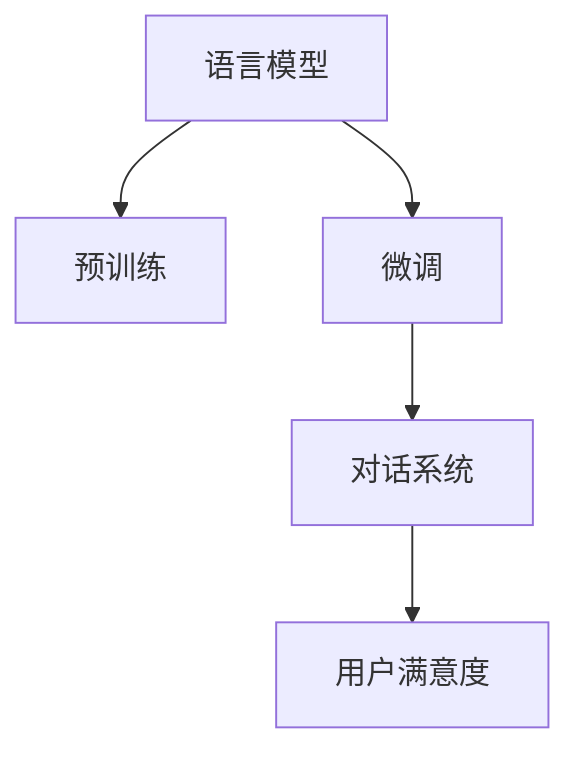

                 

# LLM与智能客服：提升用户服务体验

> 关键词：智能客服,语言模型,微调,Fine-tuning,对话系统,用户体验,自然语言处理(NLP)

## 1. 背景介绍

### 1.1 问题由来
随着人工智能技术的飞速发展，智能客服系统成为企业提升客户服务效率、降低运营成本的重要手段。传统客服模式依赖于大量人工坐席，不仅成本高昂，而且响应速度慢，无法24小时不间断服务。与此同时，用户对即时、准确、智能的客服需求日益增长，传统的客服方式已难以满足这一需求。

智能客服系统利用人工智能技术，通过自然语言处理(NLP)和大规模语言模型(LLM)，能够实现高效、精准、智能的客户服务，极大提升了客户满意度和服务质量。因此，如何利用LLM技术进行智能客服系统的开发，成为目前NLP领域的一大热门话题。

### 1.2 问题核心关键点
LLM在智能客服系统中的应用，主要集中在两个方面：

1. **预训练模型**：使用大规模语料进行预训练，学习语言知识。
2. **微调(Fine-tuning)**：在少量标注数据上，进行有监督学习，优化模型在特定任务上的性能。

基于LLM的微调方法，可以通过有限的标注数据，快速训练出高性能的智能客服系统，能够处理多轮对话，提供个性化服务，甚至能够理解复杂的用户需求和情感变化。

### 1.3 问题研究意义
智能客服系统的成功应用，不仅可以大幅提升客户服务效率，降低企业运营成本，还能提升用户满意度，增加品牌忠诚度。因此，基于LLM的智能客服技术，具有重要的研究和应用价值。

本文旨在系统介绍基于LLM的智能客服系统开发方法和技术原理，并通过案例分析，展示其在大规模部署中的实际效果。

## 2. 核心概念与联系

### 2.1 核心概念概述

为更好地理解LLM在智能客服系统中的应用，本节将介绍几个核心概念：

- **语言模型(Language Model)**：通过给定一段文本，预测下一个单词或字符的概率分布。是大规模预训练模型的基础。
- **预训练(Pre-training)**：在无标签数据上，通过自监督学习任务训练模型，学习语言知识。常见的预训练任务包括语言建模、掩码语言模型等。
- **微调(Fine-tuning)**：在预训练模型的基础上，使用下游任务的少量标注数据，通过有监督学习优化模型在特定任务上的性能。
- **对话系统(Dialogue System)**：通过多轮对话，理解用户意图并生成自然流畅的回复。
- **用户满意度(User Satisfaction)**：衡量智能客服系统的服务质量，包括回复的准确性、流畅性和个性化程度。

这些概念之间的逻辑关系可以通过以下Mermaid流程图来展示：



这个流程图展示了大语言模型在智能客服系统中的核心概念及其之间的关系：

1. 语言模型通过预训练学习语言知识。
2. 微调将通用语言模型适配到特定任务，提升其对话能力。
3. 对话系统基于微调后的模型进行多轮对话，理解用户意图。
4. 用户满意度衡量对话系统的服务质量。

## 3. 核心算法原理 & 具体操作步骤
### 3.1 算法原理概述

基于LLM的智能客服系统开发，主要分为两个阶段：预训练和微调。其核心思想是：使用大规模语料进行预训练，学习语言的通用表示，然后在少量标注数据上，通过微调优化模型在特定对话任务上的性能。

形式化地，假设预训练模型为 $M_{\theta}$，其中 $\theta$ 为预训练得到的模型参数。给定下游任务 $T$ 的标注数据集 $D=\{(x_i, y_i)\}_{i=1}^N$，微调的目标是找到新的模型参数 $\hat{\theta}$，使得：

$$
\hat{\theta}=\mathop{\arg\min}_{\theta} \mathcal{L}(M_{\theta},D)
$$

其中 $\mathcal{L}$ 为针对任务 $T$ 设计的损失函数，用于衡量模型预测输出与真实标签之间的差异。常见的损失函数包括交叉熵损失、均方误差损失等。

通过梯度下降等优化算法，微调过程不断更新模型参数 $\theta$，最小化损失函数 $\mathcal{L}$，使得模型输出逼近真实标签。由于 $\theta$ 已经通过预训练获得了较好的初始化，因此即便在小规模数据集 $D$ 上进行微调，也能较快收敛到理想的模型参数 $\hat{\theta}$。

### 3.2 算法步骤详解

基于LLM的智能客服系统开发，主要包括以下几个关键步骤：

**Step 1: 准备预训练模型和数据集**
- 选择合适的预训练语言模型 $M_{\theta}$ 作为初始化参数，如 GPT、BERT、T5等。
- 准备下游任务 $T$ 的标注数据集 $D$，划分为训练集、验证集和测试集。一般要求标注数据与预训练数据的分布不要差异过大。

**Step 2: 添加任务适配层**
- 根据任务类型，在预训练模型顶层设计合适的输出层和损失函数。
- 对于分类任务，通常在顶层添加线性分类器和交叉熵损失函数。
- 对于生成任务，通常使用语言模型的解码器输出概率分布，并以负对数似然为损失函数。

**Step 3: 设置微调超参数**
- 选择合适的优化算法及其参数，如 AdamW、SGD 等，设置学习率、批大小、迭代轮数等。
- 设置正则化技术及强度，包括权重衰减、Dropout、Early Stopping等。
- 确定冻结预训练参数的策略，如仅微调顶层，或全部参数都参与微调。

**Step 4: 执行梯度训练**
- 将训练集数据分批次输入模型，前向传播计算损失函数。
- 反向传播计算参数梯度，根据设定的优化算法和学习率更新模型参数。
- 周期性在验证集上评估模型性能，根据性能指标决定是否触发 Early Stopping。
- 重复上述步骤直到满足预设的迭代轮数或 Early Stopping 条件。

**Step 5: 测试和部署**
- 在测试集上评估微调后模型 $M_{\hat{\theta}}$ 的性能，对比微调前后的精度提升。
- 使用微调后的模型对新样本进行推理预测，集成到实际的应用系统中。
- 持续收集新的数据，定期重新微调模型，以适应数据分布的变化。

以上是基于LLM的智能客服系统开发的完整流程。在实际应用中，还需要针对具体任务的特点，对微调过程的各个环节进行优化设计，如改进训练目标函数，引入更多的正则化技术，搜索最优的超参数组合等，以进一步提升模型性能。

### 3.3 算法优缺点

基于LLM的智能客服系统开发方法，具有以下优点：

1. **高效性**：在少量标注数据上，快速训练出高性能的智能客服系统，能够实现高效的客户服务。
2. **准确性**：微调过程能够学习到任务特定的语言知识，提升回复的准确性和流畅性。
3. **灵活性**：通过微调，可以根据企业需求定制化开发智能客服系统，适应各种业务场景。
4. **可扩展性**：微调后的模型容易集成到各种应用系统中，便于企业快速部署和迭代。

同时，该方法也存在一些局限性：

1. **数据依赖**：微调效果依赖于标注数据的质量和数量，标注数据获取成本较高。
2. **泛化能力有限**：当目标任务与预训练数据的分布差异较大时，微调的性能提升有限。
3. **稳定性问题**：微调过程中，模型的表现可能受到初始化和超参数的影响。
4. **伦理问题**：微调过程中可能引入预训练模型中的偏见和有害信息，需要注意伦理道德问题。

尽管存在这些局限性，但就目前而言，基于LLM的智能客服系统开发范式仍然是最主流的方法。未来相关研究的重点在于如何进一步降低对标注数据的依赖，提高模型的泛化能力和稳定性，同时兼顾伦理道德等社会责任。

### 3.4 算法应用领域

基于LLM的智能客服系统开发，已经在多个行业得到广泛应用，例如：

- **金融行业**：利用智能客服系统进行客户咨询、投诉处理、投资理财咨询等。
- **电商行业**：通过智能客服系统提供商品推荐、订单处理、售后服务等。
- **医疗行业**：使用智能客服系统进行健康咨询、预约挂号、药品查询等。
- **旅游行业**：利用智能客服系统提供旅游产品推荐、行程安排、预订服务等。
- **政务行业**：通过智能客服系统提供政策咨询、业务办理、投诉举报等服务。

除了这些传统行业，智能客服系统还在社交媒体、在线教育、智能家居等新兴领域得到应用，为这些行业带来了新的发展机遇。

## 4. 数学模型和公式 & 详细讲解  
### 4.1 数学模型构建

基于LLM的智能客服系统开发，主要依赖于预训练语言模型和微调任务的设计。下面以BERT模型为例，构建微调任务的数学模型。

假设智能客服系统需要回答客户的问题，输入为 $x$，输出为 $y$。则微调任务的损失函数可以定义为：

$$
\mathcal{L}(M_{\theta}(x),y) = -[y\log M_{\theta}(x)+(1-y)\log(1-M_{\theta}(x))]
$$

其中 $M_{\theta}(x)$ 为模型在输入 $x$ 上的输出，$\theta$ 为模型参数。通过最小化损失函数，优化模型参数 $\theta$。

在实践中，我们通常使用基于梯度的优化算法（如SGD、Adam等）来近似求解上述最优化问题。设 $\eta$ 为学习率，$\lambda$ 为正则化系数，则参数的更新公式为：

$$
\theta \leftarrow \theta - \eta \nabla_{\theta}\mathcal{L}(\theta) - \eta\lambda\theta
$$

其中 $\nabla_{\theta}\mathcal{L}(\theta)$ 为损失函数对参数 $\theta$ 的梯度，可通过反向传播算法高效计算。

### 4.2 公式推导过程

以下我们以分类任务为例，推导交叉熵损失函数及其梯度的计算公式。

假设模型 $M_{\theta}$ 在输入 $x$ 上的输出为 $\hat{y}=M_{\theta}(x) \in [0,1]$，表示样本属于正类的概率。真实标签 $y \in \{0,1\}$。则二分类交叉熵损失函数定义为：

$$
\ell(M_{\theta}(x),y) = -[y\log \hat{y} + (1-y)\log (1-\hat{y})]
$$

将其代入损失函数定义，得：

$$
\mathcal{L}(\theta) = -\frac{1}{N}\sum_{i=1}^N [y_i\log M_{\theta}(x_i)+(1-y_i)\log(1-M_{\theta}(x_i))]
$$

根据链式法则，损失函数对参数 $\theta_k$ 的梯度为：

$$
\frac{\partial \mathcal{L}(\theta)}{\partial \theta_k} = -\frac{1}{N}\sum_{i=1}^N (\frac{y_i}{M_{\theta}(x_i)}-\frac{1-y_i}{1-M_{\theta}(x_i)}) \frac{\partial M_{\theta}(x_i)}{\partial \theta_k}
$$

其中 $\frac{\partial M_{\theta}(x_i)}{\partial \theta_k}$ 可进一步递归展开，利用自动微分技术完成计算。

在得到损失函数的梯度后，即可带入参数更新公式，完成模型的迭代优化。重复上述过程直至收敛，最终得到适应下游任务的最优模型参数 $\theta^*$。

## 5. 项目实践：代码实例和详细解释说明
### 5.1 开发环境搭建

在进行智能客服系统开发前，我们需要准备好开发环境。以下是使用Python进行PyTorch开发的环境配置流程：

1. 安装Anaconda：从官网下载并安装Anaconda，用于创建独立的Python环境。

2. 创建并激活虚拟环境：
```bash
conda create -n pytorch-env python=3.8 
conda activate pytorch-env
```

3. 安装PyTorch：根据CUDA版本，从官网获取对应的安装命令。例如：
```bash
conda install pytorch torchvision torchaudio cudatoolkit=11.1 -c pytorch -c conda-forge
```

4. 安装Transformers库：
```bash
pip install transformers
```

5. 安装各类工具包：
```bash
pip install numpy pandas scikit-learn matplotlib tqdm jupyter notebook ipython
```

完成上述步骤后，即可在`pytorch-env`环境中开始智能客服系统的开发。

### 5.2 源代码详细实现

这里我们以使用BERT模型进行智能客服系统开发的PyTorch代码实现为例。

首先，定义智能客服系统的数据处理函数：

```python
from transformers import BertTokenizer
from torch.utils.data import Dataset
import torch

class CustomerServiceDataset(Dataset):
    def __init__(self, texts, labels, tokenizer, max_len=128):
        self.texts = texts
        self.labels = labels
        self.tokenizer = tokenizer
        self.max_len = max_len
        
    def __len__(self):
        return len(self.texts)
    
    def __getitem__(self, item):
        text = self.texts[item]
        label = self.labels[item]
        
        encoding = self.tokenizer(text, return_tensors='pt', max_length=self.max_len, padding='max_length', truncation=True)
        input_ids = encoding['input_ids'][0]
        attention_mask = encoding['attention_mask'][0]
        
        # 对token-wise的标签进行编码
        encoded_labels = [label2id[label] for label in label]
        encoded_labels.extend([label2id['O']] * (self.max_len - len(encoded_labels)))
        labels = torch.tensor(encoded_labels, dtype=torch.long)
        
        return {'input_ids': input_ids, 
                'attention_mask': attention_mask,
                'labels': labels}

# 标签与id的映射
label2id = {'O': 0, 'Q': 1, 'A': 2}
id2label = {v: k for k, v in label2id.items()}

# 创建dataset
tokenizer = BertTokenizer.from_pretrained('bert-base-cased')

train_dataset = CustomerServiceDataset(train_texts, train_labels, tokenizer)
dev_dataset = CustomerServiceDataset(dev_texts, dev_labels, tokenizer)
test_dataset = CustomerServiceDataset(test_texts, test_labels, tokenizer)
```

然后，定义模型和优化器：

```python
from transformers import BertForTokenClassification, AdamW

model = BertForTokenClassification.from_pretrained('bert-base-cased', num_labels=len(label2id))

optimizer = AdamW(model.parameters(), lr=2e-5)
```

接着，定义训练和评估函数：

```python
from torch.utils.data import DataLoader
from tqdm import tqdm
from sklearn.metrics import classification_report

device = torch.device('cuda') if torch.cuda.is_available() else torch.device('cpu')
model.to(device)

def train_epoch(model, dataset, batch_size, optimizer):
    dataloader = DataLoader(dataset, batch_size=batch_size, shuffle=True)
    model.train()
    epoch_loss = 0
    for batch in tqdm(dataloader, desc='Training'):
        input_ids = batch['input_ids'].to(device)
        attention_mask = batch['attention_mask'].to(device)
        labels = batch['labels'].to(device)
        model.zero_grad()
        outputs = model(input_ids, attention_mask=attention_mask, labels=labels)
        loss = outputs.loss
        epoch_loss += loss.item()
        loss.backward()
        optimizer.step()
    return epoch_loss / len(dataloader)

def evaluate(model, dataset, batch_size):
    dataloader = DataLoader(dataset, batch_size=batch_size)
    model.eval()
    preds, labels = [], []
    with torch.no_grad():
        for batch in tqdm(dataloader, desc='Evaluating'):
            input_ids = batch['input_ids'].to(device)
            attention_mask = batch['attention_mask'].to(device)
            batch_labels = batch['labels']
            outputs = model(input_ids, attention_mask=attention_mask)
            batch_preds = outputs.logits.argmax(dim=2).to('cpu').tolist()
            batch_labels = batch_labels.to('cpu').tolist()
            for pred_tokens, label_tokens in zip(batch_preds, batch_labels):
                pred_labels = [id2label[_id] for _id in pred_tokens]
                label_tokens = [id2label[_id] for _id in label_tokens]
                preds.append(pred_labels[:len(label_tokens)])
                labels.append(label_tokens)
                
    print(classification_report(labels, preds))
```

最后，启动训练流程并在测试集上评估：

```python
epochs = 5
batch_size = 16

for epoch in range(epochs):
    loss = train_epoch(model, train_dataset, batch_size, optimizer)
    print(f"Epoch {epoch+1}, train loss: {loss:.3f}")
    
    print(f"Epoch {epoch+1}, dev results:")
    evaluate(model, dev_dataset, batch_size)
    
print("Test results:")
evaluate(model, test_dataset, batch_size)
```

以上就是使用PyTorch对BERT进行智能客服系统开发的完整代码实现。可以看到，得益于Transformers库的强大封装，我们可以用相对简洁的代码完成BERT模型的加载和微调。

### 5.3 代码解读与分析

让我们再详细解读一下关键代码的实现细节：

**CustomerServiceDataset类**：
- `__init__`方法：初始化文本、标签、分词器等关键组件。
- `__len__`方法：返回数据集的样本数量。
- `__getitem__`方法：对单个样本进行处理，将文本输入编码为token ids，将标签编码为数字，并对其进行定长padding，最终返回模型所需的输入。

**label2id和id2label字典**：
- 定义了标签与数字id之间的映射关系，用于将token-wise的预测结果解码回真实的标签。

**训练和评估函数**：
- 使用PyTorch的DataLoader对数据集进行批次化加载，供模型训练和推理使用。
- 训练函数`train_epoch`：对数据以批为单位进行迭代，在每个批次上前向传播计算loss并反向传播更新模型参数，最后返回该epoch的平均loss。
- 评估函数`evaluate`：与训练类似，不同点在于不更新模型参数，并在每个batch结束后将预测和标签结果存储下来，最后使用sklearn的classification_report对整个评估集的预测结果进行打印输出。

**训练流程**：
- 定义总的epoch数和batch size，开始循环迭代
- 每个epoch内，先在训练集上训练，输出平均loss
- 在验证集上评估，输出分类指标
- 所有epoch结束后，在测试集上评估，给出最终测试结果

可以看到，PyTorch配合Transformers库使得BERT微调的代码实现变得简洁高效。开发者可以将更多精力放在数据处理、模型改进等高层逻辑上，而不必过多关注底层的实现细节。

当然，工业级的系统实现还需考虑更多因素，如模型的保存和部署、超参数的自动搜索、更灵活的任务适配层等。但核心的微调范式基本与此类似。

## 6. 实际应用场景
### 6.1 智能客服系统

智能客服系统利用基于LLM的对话模型，可以实现在线客服的多轮对话功能，提供快速、准确、智能的客户服务。智能客服系统能够自动理解客户问题，匹配最佳答案，并进行自然流畅的回复，极大地提升了客户体验。

在技术实现上，可以收集企业内部的客服对话记录，将问题和最佳答复构建成监督数据，在此基础上对预训练对话模型进行微调。微调后的对话模型能够自动理解用户意图，匹配最合适的答案模板进行回复。对于客户提出的新问题，还可以接入检索系统实时搜索相关内容，动态组织生成回答。如此构建的智能客服系统，能大幅提升客户咨询体验和问题解决效率。

### 6.2 金融行业

在金融行业，智能客服系统可以用于客户咨询、投诉处理、投资理财咨询等。通过智能客服系统，客户可以随时随地获取所需的服务和信息，无需等待人工坐席，极大提升了金融服务的便利性和效率。

智能客服系统可以集成多种金融应用场景，如银行业务咨询、股票投资指导、信用卡申请等。通过微调优化，智能客服系统能够理解客户的金融需求，提供个性化建议和服务，帮助客户做出更好的投资决策，增加客户粘性。

### 6.3 电商行业

电商行业利用智能客服系统，可以提升客户购物体验，提供高效、准确的商品推荐和售后服务。智能客服系统能够自动回答客户关于商品、物流、退货等问题，减少客户等待时间，提升购物满意度。

在电商平台上，智能客服系统可以实时处理客户的订单查询、售后投诉等，提供个性化推荐和解决方案，提升客户满意度和转化率。通过微调优化，智能客服系统能够更好地理解客户需求，提供更加精准的推荐和服务。

### 6.4 医疗行业

在医疗行业，智能客服系统可以用于健康咨询、预约挂号、药品查询等。通过智能客服系统，患者可以轻松获取健康建议、预约服务、药品信息等，极大提升了医疗服务的便利性和效率。

智能客服系统可以集成多种医疗应用场景，如疾病咨询、医生预约、药品查询等。通过微调优化，智能客服系统能够理解患者的健康需求，提供个性化建议和服务，帮助患者更好地管理健康，提升患者满意度。

## 7. 工具和资源推荐
### 7.1 学习资源推荐

为了帮助开发者系统掌握基于LLM的智能客服系统开发方法，这里推荐一些优质的学习资源：

1. 《自然语言处理入门》系列博文：由大模型技术专家撰写，深入浅出地介绍了自然语言处理的基本概念和经典模型。

2. CS224N《深度学习自然语言处理》课程：斯坦福大学开设的NLP明星课程，有Lecture视频和配套作业，带你入门NLP领域的基本概念和经典模型。

3. 《Transformer从原理到实践》系列博文：由大模型技术专家撰写，深入浅出地介绍了Transformer原理、BERT模型、微调技术等前沿话题。

4. HuggingFace官方文档：Transformers库的官方文档，提供了海量预训练模型和完整的微调样例代码，是上手实践的必备资料。

5. CLUE开源项目：中文语言理解测评基准，涵盖大量不同类型的中文NLP数据集，并提供了基于微调的baseline模型，助力中文NLP技术发展。

通过对这些资源的学习实践，相信你一定能够快速掌握基于LLM的智能客服系统开发方法，并用于解决实际的NLP问题。
### 7.2 开发工具推荐

高效的开发离不开优秀的工具支持。以下是几款用于基于LLM的智能客服系统开发的常用工具：

1. PyTorch：基于Python的开源深度学习框架，灵活动态的计算图，适合快速迭代研究。大部分预训练语言模型都有PyTorch版本的实现。

2. TensorFlow：由Google主导开发的开源深度学习框架，生产部署方便，适合大规模工程应用。同样有丰富的预训练语言模型资源。

3. Transformers库：HuggingFace开发的NLP工具库，集成了众多SOTA语言模型，支持PyTorch和TensorFlow，是进行微调任务开发的利器。

4. Weights & Biases：模型训练的实验跟踪工具，可以记录和可视化模型训练过程中的各项指标，方便对比和调优。与主流深度学习框架无缝集成。

5. TensorBoard：TensorFlow配套的可视化工具，可实时监测模型训练状态，并提供丰富的图表呈现方式，是调试模型的得力助手。

6. Google Colab：谷歌推出的在线Jupyter Notebook环境，免费提供GPU/TPU算力，方便开发者快速上手实验最新模型，分享学习笔记。

合理利用这些工具，可以显著提升基于LLM的智能客服系统开发效率，加快创新迭代的步伐。

### 7.3 相关论文推荐

基于LLM的智能客服系统开发，涉及多领域的知识，包括自然语言处理、机器学习、软件工程等。以下是几篇奠基性的相关论文，推荐阅读：

1. Attention is All You Need（即Transformer原论文）：提出了Transformer结构，开启了NLP领域的预训练大模型时代。

2. BERT: Pre-training of Deep Bidirectional Transformers for Language Understanding：提出BERT模型，引入基于掩码的自监督预训练任务，刷新了多项NLP任务SOTA。

3. Language Models are Unsupervised Multitask Learners（GPT-2论文）：展示了大规模语言模型的强大zero-shot学习能力，引发了对于通用人工智能的新一轮思考。

4. Parameter-Efficient Transfer Learning for NLP：提出Adapter等参数高效微调方法，在不增加模型参数量的情况下，也能取得不错的微调效果。

5. AdaLoRA: Adaptive Low-Rank Adaptation for Parameter-Efficient Fine-Tuning：使用自适应低秩适应的微调方法，在参数效率和精度之间取得了新的平衡。

这些论文代表了大语言模型微调技术的发展脉络。通过学习这些前沿成果，可以帮助研究者把握学科前进方向，激发更多的创新灵感。

## 8. 总结：未来发展趋势与挑战

### 8.1 总结

本文对基于LLM的智能客服系统开发方法进行了全面系统的介绍。首先阐述了智能客服系统开发的背景和意义，明确了LLM在智能客服系统中的核心作用。其次，从原理到实践，详细讲解了基于LLM的微调方法，并通过案例分析，展示了其在大规模部署中的实际效果。

通过本文的系统梳理，可以看到，基于LLM的智能客服系统开发方法，不仅能够高效处理客户咨询，提升客户满意度，还能在金融、电商、医疗等多个行业得到广泛应用。未来，随着LLM技术的不断进步，智能客服系统的性能将进一步提升，应用场景将更加丰富多样。

### 8.2 未来发展趋势

展望未来，基于LLM的智能客服系统开发方法将呈现以下几个发展趋势：

1. **多模态融合**：智能客服系统将不仅仅局限于文本对话，而是融合图像、视频、语音等多种模态信息，提供更加丰富、立体的服务体验。

2. **持续学习**：随着数据分布的不断变化，智能客服系统需要持续学习新知识以保持性能。如何在不遗忘原有知识的同时，高效吸收新样本信息，将是重要的研究方向。

3. **个性化推荐**：智能客服系统可以通过分析用户历史行为和偏好，提供个性化的商品推荐、服务建议等，提升用户体验。

4. **跨领域迁移**：智能客服系统将在不同行业和场景中得到广泛应用，如金融客服、医疗咨询、电商客服等，具备更强的跨领域迁移能力。

5. **多语言支持**：智能客服系统将不仅仅局限于一种语言，而是支持多种语言的多语言客服，满足全球用户需求。

6. **多任务融合**：智能客服系统可以同时处理多个任务，如自动回复、情感分析、意图识别等，提供更全面、高效的服务。

以上趋势凸显了基于LLM的智能客服系统开发方法的市场潜力和技术前景。这些方向的探索发展，必将进一步提升智能客服系统的性能和应用范围，为NLP技术在垂直行业的落地应用提供新的思路和方向。

### 8.3 面临的挑战

尽管基于LLM的智能客服系统开发方法已经取得了瞩目成就，但在迈向更加智能化、普适化应用的过程中，它仍面临着诸多挑战：

1. **数据依赖**：智能客服系统的性能依赖于高质量标注数据，但标注数据的获取成本较高。如何降低数据依赖，提高模型的泛化能力，是未来需要解决的重要问题。

2. **模型鲁棒性**：智能客服系统面对复杂的客户需求，容易受到噪声干扰和误导。如何提高模型的鲁棒性和泛化能力，确保服务稳定可靠，是亟待解决的问题。

3. **计算资源**：智能客服系统的模型规模较大，需要消耗大量的计算资源。如何优化模型结构，提高计算效率，是未来需要关注的方向。

4. **用户隐私**：智能客服系统涉及用户隐私保护问题，如何在提供优质服务的同时，保障用户数据安全，是重要研究方向。

5. **伦理道德**：智能客服系统可能传播错误信息，甚至误导客户。如何在模型训练和应用过程中，遵循伦理道德原则，避免有害输出，是重要的研究课题。

6. **用户接受度**：智能客服系统需要用户的广泛接受和使用，才能发挥其价值。如何设计用户友好的界面和交互方式，提高用户接受度，是重要的工程问题。

尽管存在这些挑战，但随着LLM技术的不断进步，这些问题终将逐步得到解决。未来，基于LLM的智能客服系统将在更多的行业得到广泛应用，为人工智能技术在垂直行业的落地应用提供新的动力和方向。

### 8.4 研究展望

未来，基于LLM的智能客服系统开发方法需要在以下几个方面寻求新的突破：

1. **无监督和半监督学习**：摆脱对标注数据的依赖，利用自监督学习、主动学习等方法，最大限度利用非结构化数据，实现更加灵活高效的微调。

2. **多任务学习和联邦学习**：通过多任务学习，智能客服系统可以同时处理多个任务，提升服务效率和质量。联邦学习可以在不共享用户数据的情况下，进行模型训练和更新，保障用户隐私。

3. **因果推断和对比学习**：引入因果推断和对比学习方法，增强智能客服系统建立稳定因果关系的能力，学习更加普适、鲁棒的语言表征，从而提升模型泛化性和抗干扰能力。

4. **知识图谱和知识表示**：将符号化的先验知识，如知识图谱、逻辑规则等，与神经网络模型进行巧妙融合，引导智能客服系统学习更准确、合理的语言模型。

5. **跨模态融合**：将视觉、语音等多模态信息与文本信息进行协同建模，提升智能客服系统的感知和理解能力。

这些研究方向的探索，必将引领基于LLM的智能客服系统开发方法迈向更高的台阶，为人工智能技术在垂直行业的落地应用提供新的思路和方向。

## 9. 附录：常见问题与解答

**Q1：智能客服系统开发过程中如何处理客户多轮对话？**

A: 智能客服系统开发过程中，处理客户多轮对话的关键在于对话模型的多轮对话能力。常用的方法是使用Attention机制，通过计算注意力权重，动态更新对话上下文，使模型能够捕捉到上下文依赖关系，实现多轮对话的语境理解。

**Q2：智能客服系统如何提升回复的个性化程度？**

A: 智能客服系统提升回复个性化程度的常用方法包括：
1. 利用用户历史行为数据，进行用户画像建模，了解用户偏好。
2. 结合上下文信息，进行动态生成回复，增加回复的个性化和针对性。
3. 引入领域专家知识，如产品推荐系统、服务流程等，提升回复的精准度。

**Q3：智能客服系统如何处理客户情感变化？**

A: 智能客服系统处理客户情感变化的方法包括：
1. 引入情感分析模型，识别客户情感倾向。
2. 根据情感倾向，动态调整回复策略，如安抚、道歉、鼓励等。
3. 结合情感数据，进行模型微调，提升对情感变化的理解能力。

**Q4：智能客服系统如何处理复杂客户需求？**

A: 智能客服系统处理复杂客户需求的方法包括：
1. 引入多轮对话理解模型，理解客户多轮对话的语义。
2. 结合领域知识库，进行问题解决和方案推荐。
3. 引入知识图谱，进行复杂问题的推理和解答。

**Q5：智能客服系统如何提高模型的泛化能力？**

A: 智能客服系统提高模型泛化能力的方法包括：
1. 使用大规模数据进行预训练，学习通用语言表示。
2. 引入对抗训练和数据增强技术，提高模型的鲁棒性。
3. 结合领域知识库，进行知识迁移学习，提高模型的泛化能力。

这些方法结合使用，可以显著提升智能客服系统的泛化能力和服务质量，满足不同客户的多样化需求。

---

作者：禅与计算机程序设计艺术 / Zen and the Art of Computer Programming

