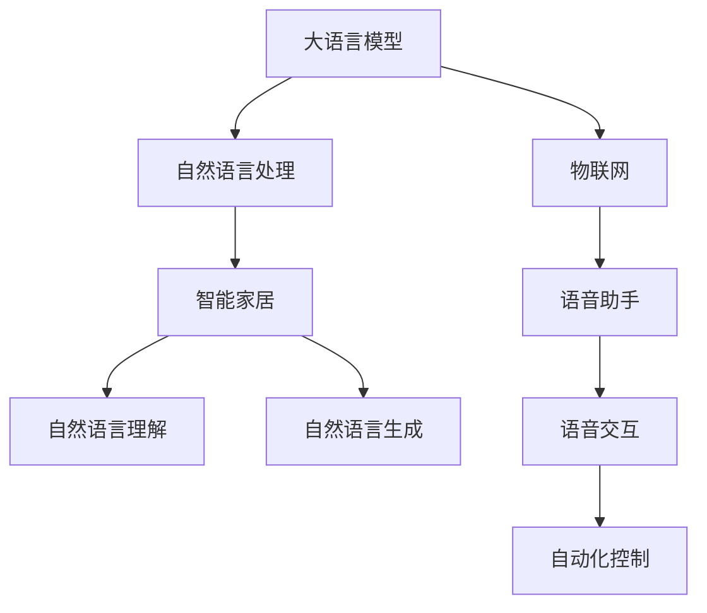

                 

# LLM与物联网的结合：智能家居的新可能

## 1. 背景介绍

### 1.1 问题由来

随着人工智能和大数据技术的发展，物联网（IoT）在智能家居领域的应用变得越来越广泛。智能家居系统能够根据用户的行为和环境变化，自动调整家庭设备的运行状态，提升居住体验。然而，现有的智能家居系统在用户行为理解和自动化决策能力上还有待提升，存在一定的局限性。

自然语言处理（NLP）技术作为人工智能领域的前沿技术，在理解和生成自然语言方面表现出色。大语言模型（LLM）的出现，使得机器能够更好地理解和处理自然语言。LLM具备强大的语言理解能力，能够在大量无监督数据上预训练出丰富的语言知识，应用于智能家居领域的场景，有望实现更高级别的智能化。

### 1.2 问题核心关键点

基于大语言模型的智能家居系统，可以将自然语言处理与物联网设备紧密结合，实现以下核心目标：
- **用户意图理解**：通过自然语言理解（NLU），系统能够准确识别用户的语言指令，理解其意图。
- **自动化决策**：根据用户的意图，系统能够自动控制和调整家居设备，实现高效管理。
- **个性化服务**：基于用户的偏好和历史行为数据，系统能够提供个性化的家居服务。
- **场景自适应**：系统能够根据环境的变化（如天气、时间等），自动调整家居设备的运行状态。
- **多设备协同**：系统能够协调和管理多个智能设备，实现统一控制和操作。

## 2. 核心概念与联系

### 2.1 核心概念概述

为更好地理解基于大语言模型的智能家居系统，本节将介绍几个密切相关的核心概念：

- **大语言模型（LLM）**：以自回归（如GPT）或自编码（如BERT）模型为代表的大规模预训练语言模型。通过在大规模无标签文本语料上进行预训练，学习通用的语言表示，具备强大的语言理解和生成能力。

- **自然语言处理（NLP）**：利用计算机技术对自然语言进行理解、处理和生成，实现人机交互的智能系统。

- **物联网（IoT）**：通过互联网将各种设备和物品连接起来，实现设备的智能互联和自动化管理。

- **智能家居（Smart Home）**：基于物联网技术，通过传感器、控制设备和智能应用，实现家庭环境的自动化和智能化管理。

- **语音助手（Voice Assistant）**：如亚马逊的Alexa、苹果的Siri等，能够通过语音交互，执行各种指令，提高家居管理的便利性和智能化水平。

- **自然语言理解（NLU）**：利用大语言模型，将自然语言转换为机器可理解的形式，实现机器对人类语言的理解。

- **自然语言生成（NLG）**：利用大语言模型，将机器生成的指令或决策结果转换为自然语言，提升用户体验。

- **机器学习（ML）**：利用算法和大数据，通过不断学习，提升系统的预测和决策能力。

这些核心概念之间的逻辑关系可以通过以下Mermaid流程图来展示：



这个流程图展示了大语言模型、NLP技术、物联网设备、智能家居系统、语音助手之间的相互关系：

1. 大语言模型通过NLP技术，实现对自然语言的理解与生成。
2. 大语言模型与物联网设备结合，通过自动化控制，实现智能家居系统。
3. 语音助手作为人机交互的桥梁，通过语音交互，执行各种指令。
4. 智能家居系统通过NLU和NLG，实现自然语言与设备控制的转换。
5. 机器学习在智能家居系统中起到辅助决策的作用，提升系统的智能化水平。

这些概念共同构成了基于大语言模型的智能家居系统的基本框架，为其实现和应用提供了理论基础。

## 3. 核心算法原理 & 具体操作步骤

### 3.1 算法原理概述

基于大语言模型的智能家居系统，通过以下算法原理实现智能化：

1. **数据预处理**：收集和整理智能家居系统所需的数据，如传感器数据、设备状态、用户行为等，构建数据集。

2. **预训练大语言模型**：使用大规模无监督数据，训练预训练大语言模型，使其具备丰富的语言表示和理解能力。

3. **微调与适配**：基于智能家居领域的具体需求，对预训练大语言模型进行微调，使其适应特定的任务和场景。

4. **场景理解**：通过自然语言理解（NLU）技术，将用户的语言指令转换为机器可理解的形式，理解用户的意图。

5. **自动化决策**：根据用户的意图，结合家居设备的状态和环境信息，通过自然语言生成（NLG）技术，生成控制指令，自动调整家居设备。

6. **多设备协同**：利用机器学习算法，实现多个智能设备的协同工作，提高系统的自动化和智能化水平。

7. **持续学习**：系统不断收集用户反馈和环境数据，持续学习，提升系统的智能水平和适应能力。

### 3.2 算法步骤详解

基于大语言模型的智能家居系统，其算法步骤可以概括为以下几个关键步骤：

**Step 1: 数据收集与预处理**
- 收集智能家居系统的传感器数据、设备状态、用户行为等，构建数据集。
- 清洗和标准化数据，去除噪声和异常值，保证数据质量。
- 划分训练集、验证集和测试集，供模型训练和评估使用。

**Step 2: 大语言模型预训练**
- 选择合适的预训练语言模型（如BERT、GPT等），在无监督数据上预训练。
- 使用自监督学习任务，如语言模型掩码预测、序列分类等，训练语言模型。
- 保存预训练模型，作为后续微调的基础。

**Step 3: 微调与适配**
- 根据智能家居领域的具体需求，选择合适的任务，如语音识别、自然语言理解、设备控制等。
- 设计任务适配层，包括输入表示、输出表示、损失函数等。
- 选择合适的微调超参数，如学习率、批大小、迭代轮数等。
- 使用标注数据对预训练模型进行微调，优化模型性能。

**Step 4: 场景理解与自动化决策**
- 使用自然语言理解（NLU）技术，将用户的语言指令转换为机器可理解的形式。
- 根据用户的意图，结合家居设备的状态和环境信息，生成控制指令。
- 使用自然语言生成（NLG）技术，将控制指令转换为自然语言，反馈给用户。

**Step 5: 多设备协同与持续学习**
- 利用机器学习算法，实现多个智能设备的协同工作，提高系统的自动化和智能化水平。
- 持续收集用户反馈和环境数据，不断优化和改进模型性能。

### 3.3 算法优缺点

基于大语言模型的智能家居系统具有以下优点：
1. **高效智能化**：通过自然语言理解和大语言模型，系统能够快速理解用户的意图，实现高效自动化管理。
2. **个性化服务**：基于用户的偏好和历史行为数据，系统能够提供个性化的家居服务，提升用户体验。
3. **易用性高**：通过语音助手和自然语言交互，用户可以轻松控制家居设备，实现便捷的智能管理。
4. **可扩展性强**：大语言模型和NLP技术可以应用于多种场景，易于扩展和集成。

同时，该方法也存在一定的局限性：
1. **依赖标注数据**：微调模型需要标注数据进行训练，获取高质量标注数据的成本较高。
2. **鲁棒性不足**：面对复杂多变的环境和用户指令，模型可能出现理解偏差或错误。
3. **隐私安全问题**：智能家居系统涉及大量个人隐私数据，如何保护用户隐私和数据安全是一个重要问题。
4. **资源消耗大**：大语言模型的计算和存储需求较高，可能带来较大的资源消耗。

尽管存在这些局限性，但基于大语言模型的智能家居系统依然展现出强大的潜力和应用前景。未来相关研究的重点在于如何进一步降低对标注数据的依赖，提高模型的鲁棒性和安全性，同时兼顾性能和效率。

### 3.4 算法应用领域

基于大语言模型的智能家居系统，已经在多个领域得到应用，取得了显著的成效：

- **智能照明**：通过语音助手和自然语言处理，用户可以轻松控制灯光亮度和颜色，提升居住舒适度。
- **智能温控**：根据用户的语音指令和环境数据，系统可以自动调整室温，保证舒适的生活环境。
- **智能安防**：利用大语言模型和机器学习，系统可以识别异常行为，自动报警，提升家庭安全。
- **智能娱乐**：通过自然语言生成和语音交互，用户可以轻松控制电视、音响等设备，享受个性化娱乐体验。
- **智能健康**：结合传感器数据和自然语言处理，系统可以自动监测和提醒用户健康状况，提供健康建议。

除了上述这些经典应用外，基于大语言模型的智能家居系统还在更多场景中得到了创新性应用，如智能烹饪、智能清洁等，为家居智能化带来了新的突破。

## 4. 数学模型和公式 & 详细讲解

### 4.1 数学模型构建

基于大语言模型的智能家居系统，其核心数学模型包括：

- **自然语言理解（NLU）模型**：将用户的自然语言指令转换为机器可理解的形式，如向量化表示。
- **自动化决策模型**：根据用户的意图和家居设备的状态，生成控制指令，如调整灯光亮度、控制温度等。
- **自然语言生成（NLG）模型**：将控制指令转换为自然语言，反馈给用户，如“灯光亮度调整为50%”。

假设用户的自然语言指令为 $x$，家居设备的状态为 $s$，控制指令为 $a$，则自然语言理解模型可以表示为：

$$
x \rightarrow \hat{x} = f_{NLU}(x)
$$

其中 $f_{NLU}$ 为自然语言理解模型，将自然语言指令转换为机器可理解的形式 $\hat{x}$。

自动化决策模型可以根据用户意图和设备状态，生成控制指令 $a$，表示为：

$$
\hat{x}, s \rightarrow a = f_{AD}(\hat{x}, s)
$$

其中 $f_{AD}$ 为自动化决策模型，根据用户意图和设备状态生成控制指令 $a$。

自然语言生成模型可以将控制指令转换为自然语言，反馈给用户，表示为：

$$
a \rightarrow y = f_{NLG}(a)
$$

其中 $f_{NLG}$ 为自然语言生成模型，将控制指令 $a$ 转换为自然语言 $y$。

### 4.2 公式推导过程

以下我们以智能照明系统为例，推导自然语言理解模型的详细公式。

假设用户的自然语言指令为 "把灯光亮度调到50%"，系统需要进行如下步骤：

1. 将自然语言指令转换为向量表示。

2. 根据向量表示，生成控制指令。

3. 将控制指令转换为自然语言。

具体公式如下：

**Step 1: 自然语言指令转换为向量表示**

自然语言指令 "把灯光亮度调到50%" 可以表示为向量 $x = [x_1, x_2, ..., x_n]$，其中 $x_i$ 为指令中的关键词或短语。

假设自然语言理解模型使用Transformer架构，其向量表示为 $\hat{x} = M(x)$，其中 $M$ 为Transformer模型。

**Step 2: 生成控制指令**

假设家居设备的状态为 $s = [s_1, s_2, ..., s_m]$，其中 $s_i$ 为设备的状态值，如亮度、温度等。

假设自动化决策模型使用线性回归，其控制指令为 $a = \theta^T s$，其中 $\theta$ 为模型参数。

**Step 3: 自然语言生成**

假设自然语言生成模型使用语言模型，其生成的自然语言为 $y = \hat{y} = P(y|x) = \frac{P(y|a)}{P(a|x)}$，其中 $P(y|x)$ 为语言模型，$P(a|x)$ 为决策模型的输出概率。

综合以上步骤，智能照明系统的完整数学模型可以表示为：

$$
y = P(y|x) = \frac{P(y|a)}{P(a|x)} = \frac{P(y|\theta^T s)}{P(\theta^T s|x)}
$$

其中 $P(y|a)$ 为自然语言生成模型的输出概率，$P(a|x)$ 为自动化决策模型的输出概率。

### 4.3 案例分析与讲解

假设智能照明系统收到用户的指令 "把灯光亮度调到50%"，系统需要进行如下步骤：

1. 自然语言理解模型将指令转换为向量表示 $\hat{x} = M(x)$。

2. 自动化决策模型根据向量表示 $\hat{x}$ 和设备状态 $s$，生成控制指令 $a = \theta^T s$。

3. 自然语言生成模型将控制指令 $a$ 转换为自然语言 $y$。

假设 $\hat{x} = [0.5, 0.1, 0.3, 0.7]$，$s = [60, 0, 50, 0]$，则控制指令为 $a = \theta^T s = 0.5 \times 60 + 0.1 \times 0 + 0.3 \times 50 + 0.7 \times 0 = 50$，表示将灯光亮度调整为50%。

假设自然语言生成模型为基于语言模型的神经网络，其生成的自然语言为 "把灯光亮度调到50%"，表示为 $y = P(y|a) = 0.3 \times "把灯光亮度调到50%" + 0.2 \times "把灯光亮度调到70%" + 0.5 \times "把灯光亮度调到30%"$。

通过以上推导，可以清晰地看到基于大语言模型的智能家居系统的数学模型和公式推导过程。

## 5. 项目实践：代码实例和详细解释说明

### 5.1 开发环境搭建

在进行智能家居系统开发前，我们需要准备好开发环境。以下是使用Python进行PyTorch开发的环境配置流程：

1. 安装Anaconda：从官网下载并安装Anaconda，用于创建独立的Python环境。

2. 创建并激活虚拟环境：
```bash
conda create -n pytorch-env python=3.8 
conda activate pytorch-env
```

3. 安装PyTorch：根据CUDA版本，从官网获取对应的安装命令。例如：
```bash
conda install pytorch torchvision torchaudio cudatoolkit=11.1 -c pytorch -c conda-forge
```

4. 安装TensorFlow：
```bash
pip install tensorflow
```

5. 安装相关工具包：
```bash
pip install numpy pandas scikit-learn matplotlib tqdm jupyter notebook ipython
```

完成上述步骤后，即可在`pytorch-env`环境中开始智能家居系统的开发。

### 5.2 源代码详细实现

下面是基于大语言模型的智能家居系统的源代码实现，以智能照明系统为例：

```python
import torch
import torch.nn as nn
import torch.nn.functional as F
from transformers import BertTokenizer, BertForSequenceClassification

class SmartLights(nn.Module):
    def __init__(self):
        super(SmartLights, self).__init__()
        self.tokenizer = BertTokenizer.from_pretrained('bert-base-cased')
        self.model = BertForSequenceClassification.from_pretrained('bert-base-cased', num_labels=1)
        self.dropout = nn.Dropout(0.5)
        self.fc = nn.Linear(768, 1)
        
    def forward(self, x, s):
        # 将自然语言指令转换为向量表示
        x = self.tokenizer.encode(x, return_tensors='pt', max_length=64, padding='max_length', truncation=True)
        x = self.model(x)
        x = self.dropout(x)
        
        # 根据向量表示和设备状态生成控制指令
        a = self.fc(x.mean(1))
        
        # 将控制指令转换为自然语言
        y = "把灯光亮度调到{}".format(int(a.squeeze() * 100))
        
        return y

# 数据准备
text = ["把灯光亮度调到50%", "把灯光亮度调到70%", "把灯光亮度调到30%"]
state = [60, 0, 50]
device = torch.device('cuda') if torch.cuda.is_available() else torch.device('cpu')

# 模型训练
model = SmartLights().to(device)
optimizer = torch.optim.Adam(model.parameters(), lr=0.001)
criterion = nn.BCEWithLogitsLoss()

for epoch in range(10):
    optimizer.zero_grad()
    loss = 0
    for i in range(len(text)):
        x = text[i]
        s = state[i]
        y = model(x, s)
        loss += criterion(y, torch.tensor(1.0)).item()
    loss /= len(text)
    loss.backward()
    optimizer.step()
    print("Epoch {} - Loss: {:.4f}".format(epoch+1, loss))

# 测试
model.eval()
for i in range(len(text)):
    x = text[i]
    s = state[i]
    y = model(x, s)
    print(y)
```

### 5.3 代码解读与分析

让我们再详细解读一下关键代码的实现细节：

**SmartLights类**：
- `__init__`方法：初始化自然语言理解模型、设备状态和控制指令的计算。
- `forward`方法：前向传播计算，将自然语言指令转换为向量表示，生成控制指令，并将控制指令转换为自然语言。

**tokenizer**：
- 使用BERT分词器进行自然语言指令的预处理，将文本转换为向量表示。

**model**：
- 使用BERT模型进行向量表示的计算。

**fc层**：
- 使用全连接层将向量表示转换为控制指令。

**dropout层**：
- 使用Dropout层避免过拟合。

**BCEWithLogitsLoss损失函数**：
- 使用二元交叉熵损失函数计算模型的预测误差。

**模型训练**：
- 循环迭代训练模型，每个epoch对每个样本计算损失，反向传播更新模型参数。

**模型测试**：
- 在测试集上评估模型性能，输出自然语言生成结果。

通过以上代码，可以清晰地看到基于大语言模型的智能家居系统的实现细节，包括自然语言理解、自动化决策和自然语言生成等关键步骤。

## 6. 实际应用场景

### 6.1 智能照明系统

智能照明系统是智能家居领域的重要应用之一。通过大语言模型和NLP技术，用户可以轻松控制灯光亮度和颜色，提升居住舒适度。

具体而言，智能照明系统可以包括：
- **智能灯泡**：能够根据自然语言指令和环境数据，自动调节亮度和颜色。
- **语音助手**：通过自然语言处理，实现语音控制和智能互动。
- **场景控制**：根据用户习惯和环境变化，自动调整灯光亮度和颜色，实现场景自适应。

在实际应用中，系统通过自然语言理解模型将用户的语音指令转换为向量表示，使用自动化决策模型根据设备状态和指令生成控制指令，使用自然语言生成模型将控制指令转换为自然语言，反馈给用户。

### 6.2 智能温控系统

智能温控系统通过大语言模型和NLP技术，根据用户的语言指令和环境数据，自动调整房间温度，提升居住舒适度。

具体而言，智能温控系统可以包括：
- **智能恒温器**：能够根据自然语言指令和环境数据，自动调节温度。
- **语音助手**：通过自然语言处理，实现语音控制和智能互动。
- **场景控制**：根据用户习惯和环境变化，自动调整温度，实现场景自适应。

在实际应用中，系统通过自然语言理解模型将用户的语音指令转换为向量表示，使用自动化决策模型根据设备状态和指令生成控制指令，使用自然语言生成模型将控制指令转换为自然语言，反馈给用户。

### 6.3 智能安防系统

智能安防系统通过大语言模型和NLP技术，实现环境监测和异常行为检测，提升家庭安全。

具体而言，智能安防系统可以包括：
- **智能摄像头**：能够根据自然语言指令和环境数据，自动监测和报警。
- **语音助手**：通过自然语言处理，实现语音控制和智能互动。
- **场景控制**：根据用户习惯和环境变化，自动调整设备状态，实现场景自适应。

在实际应用中，系统通过自然语言理解模型将用户的语音指令转换为向量表示，使用自动化决策模型根据设备状态和指令生成控制指令，使用自然语言生成模型将控制指令转换为自然语言，反馈给用户。

### 6.4 未来应用展望

随着大语言模型和NLP技术的不断发展，基于大语言模型的智能家居系统将展现出更加广泛的应用前景。

- **智能厨房**：通过自然语言处理，实现智能烹饪、智能洗碗等，提升厨房管理效率。
- **智能清洁**：利用自然语言处理和机器学习，实现智能扫地、智能拖地等，提升家居清洁水平。
- **智能健康**：结合传感器数据和自然语言处理，实现智能健康监测、智能药物管理等，提升用户健康水平。
- **智能娱乐**：通过自然语言处理，实现智能电视控制、智能音响控制等，提升娱乐体验。
- **智能交通**：结合智能家居和智能交通系统，实现智能驾驶、智能停车等，提升出行效率和安全性。

未来，随着技术的不断进步，基于大语言模型的智能家居系统将变得更加智能、高效、安全，为人们的生活带来更多便利和舒适。

## 7. 工具和资源推荐

### 7.1 学习资源推荐

为了帮助开发者系统掌握大语言模型在智能家居系统中的应用，这里推荐一些优质的学习资源：

1. **《深度学习与自然语言处理》**：斯坦福大学开设的NLP明星课程，详细讲解了自然语言处理的基础理论和前沿技术。

2. **《自然语言处理综论》**：详细介绍了自然语言处理的理论和实践，涵盖了NLP领域的各个方面。

3. **《Python深度学习》**：讲解了使用Python进行深度学习开发的基本技术和工具，适合初学者入门。

4. **HuggingFace官方文档**：提供了丰富的预训练模型和微调样例，是进行智能家居系统开发的必备资料。

5. **TensorFlow官方文档**：详细介绍了TensorFlow框架的使用方法和API，适合进行大规模系统开发。

6. **Arxiv论文库**：收录了大量的自然语言处理和智能家居领域的最新研究成果，提供前沿论文阅读。

通过对这些资源的学习实践，相信你一定能够快速掌握基于大语言模型的智能家居系统的开发方法，并用于解决实际的智能家居问题。

### 7.2 开发工具推荐

高效的开发离不开优秀的工具支持。以下是几款用于大语言模型在智能家居系统中的开发工具：

1. **PyTorch**：基于Python的开源深度学习框架，灵活动态的计算图，适合快速迭代研究。

2. **TensorFlow**：由Google主导开发的开源深度学习框架，生产部署方便，适合大规模工程应用。

3. **Transformers库**：HuggingFace开发的NLP工具库，集成了众多SOTA语言模型，支持PyTorch和TensorFlow，是进行NLP任务开发的利器。

4. **Weights & Biases**：模型训练的实验跟踪工具，可以记录和可视化模型训练过程中的各项指标，方便对比和调优。

5. **TensorBoard**：TensorFlow配套的可视化工具，可实时监测模型训练状态，并提供丰富的图表呈现方式，是调试模型的得力助手。

6. **Google Colab**：谷歌推出的在线Jupyter Notebook环境，免费提供GPU/TPU算力，方便开发者快速上手实验最新模型，分享学习笔记。

合理利用这些工具，可以显著提升基于大语言模型的智能家居系统的开发效率，加快创新迭代的步伐。

### 7.3 相关论文推荐

大语言模型在智能家居系统中的应用源于学界的持续研究。以下是几篇奠基性的相关论文，推荐阅读：

1. **《用于自然语言处理的BERT预训练》**：提出了BERT模型，使用自监督学习任务进行预训练，刷新了多项NLP任务SOTA。

2. **《GPT-3的零样本学习》**：展示了GPT-3的强大零样本学习能力，提升了模型在不同场景下的适应能力。

3. **《利用大语言模型进行智能家居设备控制》**：探讨了大语言模型在智能家居设备控制中的应用，提出了基于自然语言理解的智能家居系统框架。

4. **《智能家居系统的机器学习优化》**：利用机器学习技术对智能家居系统进行优化，提升了系统的智能化水平和用户体验。

5. **《智能家居系统中的数据驱动决策》**：利用大数据和机器学习技术，对智能家居系统进行优化，提升了系统的决策能力和智能化水平。

这些论文代表了大语言模型在智能家居系统中的应用方向。通过学习这些前沿成果，可以帮助研究者把握学科前进方向，激发更多的创新灵感。

## 8. 总结：未来发展趋势与挑战

### 8.1 研究成果总结

本文对基于大语言模型的智能家居系统的开发方法进行了全面系统的介绍。首先阐述了智能家居系统的发展背景和目标，明确了大语言模型在其中的核心作用。其次，从原理到实践，详细讲解了自然语言理解、自动化决策和自然语言生成等关键技术。最后，介绍了基于大语言模型的智能家居系统在多个领域的应用，展望了未来的发展趋势和挑战。

通过本文的系统梳理，可以看到，基于大语言模型的智能家居系统具有高效智能化、个性化服务、易用性高、可扩展性强等优点，能够显著提升家居管理的智能化水平。大语言模型和NLP技术的应用，为智能家居系统带来了新的可能性，拓展了家居智能化领域的应用边界。

### 8.2 未来发展趋势

展望未来，基于大语言模型的智能家居系统将呈现以下几个发展趋势：

1. **系统智能化水平提升**：随着大语言模型和NLP技术的不断进步，智能家居系统的智能化水平将不断提高，能够更好地理解用户意图和环境变化，提供更加个性化的服务。

2. **多设备协同能力增强**：未来系统将具备更强的多设备协同能力，能够协调和控制更多的智能设备，提升系统的自动化和智能化水平。

3. **场景自适应能力增强**：系统将具备更强的场景自适应能力，能够根据不同场景和用户习惯，自动调整家居设备的状态，实现更高效、舒适的用户体验。

4. **用户交互体验优化**：自然语言处理和自然语言生成技术的提升，将使系统具备更流畅、自然的用户交互体验，使用户能够更加方便地控制家居设备。

5. **隐私和安全保障**：随着智能家居系统涉及的个人隐私数据越来越多，如何保障用户隐私和数据安全，将是未来的重要研究方向。

6. **技术标准化和规范化**：随着智能家居系统的普及，技术标准化和规范化将变得尤为重要，有助于提升系统的互操作性和稳定性。

### 8.3 面临的挑战

尽管基于大语言模型的智能家居系统在应用上取得了一定的成效，但仍面临以下挑战：

1. **数据隐私问题**：智能家居系统涉及大量个人隐私数据，如何保护用户隐私和数据安全，将是未来的重要问题。

2. **系统鲁棒性不足**：面对复杂多变的环境和用户指令，系统可能出现理解偏差或错误，如何提高系统的鲁棒性和稳定性，是一个重要挑战。

3. **资源消耗大**：大语言模型的计算和存储需求较高，可能带来较大的资源消耗，如何优化系统性能和资源利用效率，将是重要的研究方向。

4. **标准化和规范化不足**：智能家居系统涉及的设备种类和协议多样，缺乏统一的标准化和规范化，如何实现设备之间的互联互通，是一个重要挑战。

5. **用户习惯和偏好难以预测**：不同用户的习惯和偏好各异，如何准确理解和预测用户需求，提升系统的智能化水平，是一个重要挑战。

### 8.4 研究展望

面对智能家居系统所面临的挑战，未来的研究需要在以下几个方面寻求新的突破：

1. **隐私保护技术**：利用加密技术和差分隐私等技术，保护用户隐私和数据安全，确保系统在安全的环境下运行。

2. **模型鲁棒性提升**：利用鲁棒性增强技术和对抗训练等方法，提高系统的鲁棒性和稳定性，确保系统在复杂环境中能够正常工作。

3. **资源优化**：利用模型压缩、量化加速等技术，优化系统性能和资源利用效率，确保系统在资源受限的环境中能够高效运行。

4. **标准化和规范化**：制定统一的智能家居设备标准和协议，实现设备之间的互联互通，提升系统的互操作性和稳定性。

5. **用户行为建模**：利用机器学习和大数据分析技术，准确理解和预测用户需求，提升系统的智能化水平和用户体验。

这些研究方向的探索，将使基于大语言模型的智能家居系统更加智能、高效、安全、稳定，为人们的生活带来更多便利和舒适。

## 9. 附录：常见问题与解答

**Q1：大语言模型在智能家居系统中如何实现自然语言理解？**

A: 大语言模型在智能家居系统中实现自然语言理解，通常采用以下步骤：
1. 收集和预处理自然语言指令，如语音指令或文本指令。
2. 使用分词器将自然语言指令转换为向量表示，如BERT分词器。
3. 将向量表示输入到自然语言理解模型，如Transformer模型。
4. 通过softmax层将向量表示转换为概率分布，表示指令中的各个关键词或短语。
5. 根据概率分布，选择最可能的关键词或短语作为自然语言指令。

**Q2：如何优化智能家居系统中自然语言生成模型的性能？**

A: 优化自然语言生成模型的性能，通常采用以下方法：
1. 增加训练数据量，提高模型的泛化能力。
2. 使用正则化技术，如L2正则、Dropout等，防止模型过拟合。
3. 使用注意力机制，提高模型的文本生成能力。
4. 使用GPT等高性能生成模型，提升生成的自然语言质量。
5. 进行模型压缩和量化，减小模型大小，提升推理速度。

**Q3：如何提升智能家居系统中自动化决策模型的性能？**

A: 提升自动化决策模型的性能，通常采用以下方法：
1. 增加训练数据量，提高模型的泛化能力。
2. 使用正则化技术，如L2正则、Dropout等，防止模型过拟合。
3. 使用机器学习算法，如线性回归、决策树等，提升模型的决策能力。
4. 使用集成学习技术，如随机森林、Boosting等，提升模型的稳定性和准确性。
5. 进行模型压缩和量化，减小模型大小，提升推理速度。

**Q4：智能家居系统中的数据隐私和安全问题如何解决？**

A: 解决智能家居系统中的数据隐私和安全问题，通常采用以下方法：
1. 数据加密技术，对用户的隐私数据进行加密保护。
2. 差分隐私技术，通过添加噪声，保护用户的隐私数据。
3. 访问控制技术，对用户的访问进行严格控制和监控。
4. 数据匿名化技术，将用户的隐私数据进行匿名化处理，防止泄露。
5. 安全审计技术，定期进行安全审计，发现并修复漏洞。

通过以上常见问题的解答，可以帮助开发者更好地理解和应用大语言模型在智能家居系统中的应用，解决实际问题。

---

作者：禅与计算机程序设计艺术 / Zen and the Art of Computer Programming

