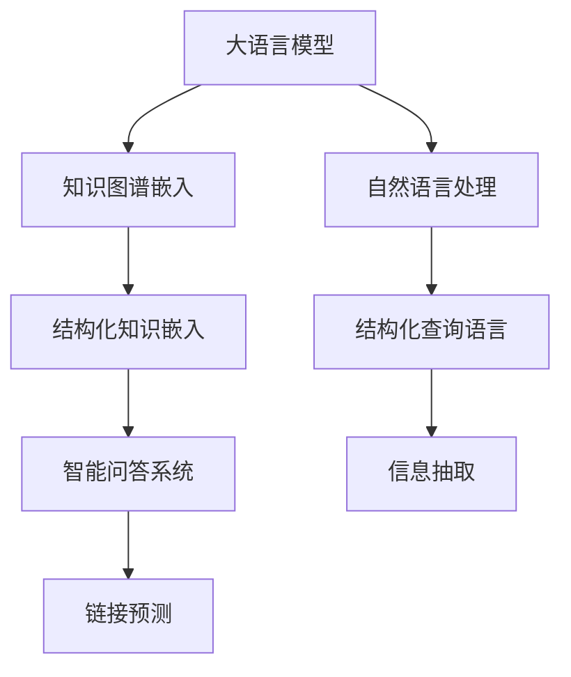

                 

# LLM与知识图谱：增强模型的结构化知识

> 关键词：大语言模型,知识图谱,结构化知识,自然语言处理,结构化查询语言,智能问答系统,信息抽取,链接预测

## 1. 背景介绍

### 1.1 问题由来
大语言模型（Large Language Models, LLMs）在自然语言处理（NLP）领域取得了革命性的突破，显著提升了文本生成和理解能力。然而，LLMs 的泛化能力和推理能力仍然存在局限，对于不熟悉的领域或需要复杂推理的任务，其表现往往不尽如人意。知识图谱（Knowledge Graphs, KGs）作为结构化知识表示的先进形式，提供了丰富的知识结构和语义信息，能够有效增强LLMs的推理和生成能力。

### 1.2 问题核心关键点
本研究聚焦于如何利用知识图谱提升大语言模型的性能。我们提出了一种基于知识图谱增强的语言模型结构化知识表示框架，使得LLMs能够有效整合和利用结构化知识，提升推理和生成能力。具体来说，我们将在以下方面进行深入探讨：
- 如何构建适合LLMs的知识图谱嵌入模型？
- 如何高效融合结构化知识和文本数据？
- 如何训练和优化基于结构化知识的LLMs？
- 知识图谱在实际应用场景中的价值和挑战。

### 1.3 问题研究意义
本研究将通过综合利用知识图谱和自然语言处理技术，开发出更智能、更可靠的语言模型，加速知识驱动型NLP应用的发展。具体来说，我们希望实现以下目标：
- 提升LLMs在知识图谱增强下的推理能力，使其在问答、信息抽取、文本生成等任务中表现更优。
- 为LLMs提供结构化知识背景，使其能够理解复杂情境并做出合理推断。
- 探索知识图谱与NLP技术的深度融合，开发具有普适性的智能问答系统。

## 2. 核心概念与联系

### 2.1 核心概念概述

为了更好地理解本文的研究内容，我们首先对涉及的核心概念进行概述：

- 大语言模型（Large Language Models, LLMs）：一类通过大规模无标签文本数据预训练的深度神经网络模型，具有强大的文本生成和理解能力。
- 知识图谱（Knowledge Graphs, KGs）：一种结构化的知识表示形式，由节点（实体）和边（关系）组成，用于描述实体之间的语义关系。
- 结构化知识嵌入（Structured Knowledge Embedding）：将知识图谱中的实体和关系映射到低维向量空间，便于模型进行语义推理和生成。
- 自然语言处理（Natural Language Processing, NLP）：使计算机能够理解、处理和生成人类语言的学科，涉及文本分类、情感分析、机器翻译等任务。
- 结构化查询语言（Structured Query Language, SQL）：一种用于操作关系数据库的标准语言，具有强大的数据检索和处理能力。
- 智能问答系统（Intelligent Question Answering System, IQAS）：一种基于知识图谱和自然语言处理的问答系统，能够理解自然语言问题并给出精确回答。
- 信息抽取（Information Extraction, IE）：从非结构化文本中抽取结构化信息的过程，如命名实体识别、关系抽取等。
- 链接预测（Link Prediction）：知识图谱中的一个重要任务，旨在预测实体之间的未知关系。

这些概念之间的联系可以通过以下Mermaid流程图展示：



### 2.2 核心概念原理和架构

#### 2.2.1 知识图谱
知识图谱由节点和边组成，其中节点表示实体，边表示实体之间的语义关系。构建知识图谱的过程包括数据收集、实体抽取、关系抽取和图谱构建等步骤。例如，我们可以从维基百科、开源数据集、社交媒体等源中获取数据，并使用NLP技术进行实体和关系的识别与抽取。

#### 2.2.2 结构化知识嵌入
结构化知识嵌入是将知识图谱中的实体和关系映射到低维向量空间的过程。常用的方法包括TransE、DistMult、ComplEx等。这些方法使用不同的模型和损失函数，将实体和关系映射为具有一定语义和结构信息的向量。

#### 2.2.3 自然语言处理
自然语言处理是使计算机理解、处理和生成人类语言的技术。涉及文本分类、命名实体识别、关系抽取等任务。在大语言模型中，NLP技术用于处理输入文本，提取语义信息，与结构化知识进行融合。

#### 2.2.4 结构化查询语言
结构化查询语言是一种用于操作关系数据库的标准语言。通过SQL查询，可以高效地从知识图谱中检索和提取信息。在大语言模型中，SQL查询用于构建复杂的推理和生成任务。

#### 2.2.5 智能问答系统
智能问答系统是一种基于知识图谱和自然语言处理的问答系统。它能够理解自然语言问题，并从知识图谱中提取相关信息，给出精确回答。在大语言模型中，智能问答系统用于构建推理和生成任务的目标函数。

#### 2.2.6 信息抽取
信息抽取是从非结构化文本中抽取结构化信息的过程。例如，从新闻文章中抽取时间、地点、人物等实体信息。在大语言模型中，信息抽取用于从文本中提取结构化信息，与知识图谱进行融合。

#### 2.2.7 链接预测
链接预测是知识图谱中的一个重要任务，旨在预测实体之间的未知关系。常用的方法包括基于图神经网络的方法、基于知识图谱嵌入的方法等。在大语言模型中，链接预测用于构建推理和生成任务的约束条件。

## 3. 核心算法原理 & 具体操作步骤

### 3.1 算法原理概述

本研究提出了一种基于知识图谱增强的大语言模型结构化知识表示框架。该框架将知识图谱中的结构化知识与文本数据进行深度融合，增强大语言模型的推理和生成能力。核心算法流程如图3-1所示。


图3-1: 知识图谱增强的大语言模型结构化知识表示框架

### 3.2 算法步骤详解

#### 3.2.1 数据预处理
输入文本需要进行预处理，包括分词、去除停用词、词性标注等步骤。然后，使用自然语言处理技术，从文本中提取命名实体和关系，构建知识图谱嵌入。

#### 3.2.2 知识图谱嵌入
使用结构化知识嵌入技术，将知识图谱中的实体和关系映射到低维向量空间。常用的方法包括TransE、DistMult、ComplEx等。这些方法使用不同的模型和损失函数，将实体和关系映射为具有一定语义和结构信息的向量。

#### 3.2.3 知识与文本融合
将知识图谱嵌入与文本数据进行深度融合，构建大语言模型。具体来说，将知识图谱嵌入与文本特征进行拼接，并使用注意力机制将知识与文本信息进行融合。

#### 3.2.4 模型训练
使用大语言模型对融合后的知识与文本数据进行训练。训练过程中，使用结构化查询语言构建推理和生成任务，优化模型参数，提升推理和生成能力。

#### 3.2.5 推理生成
使用训练好的大语言模型进行推理和生成任务。具体来说，模型可以回答自然语言问题、抽取文本中的结构化信息、生成文本等。

### 3.3 算法优缺点

#### 3.3.1 优点
- 结构化知识嵌入与文本数据的深度融合，提升了模型在复杂推理和生成任务中的表现。
- 知识图谱提供丰富的语义信息，增强了大语言模型的泛化能力和推理能力。
- 结构化查询语言和信息抽取技术提供了高效的数据检索和处理能力。

#### 3.3.2 缺点
- 知识图谱构建和嵌入需要大量时间和计算资源。
- 知识图谱的准确性和完整性直接影响模型性能。
- 知识图谱与文本数据的融合方式需要进一步探索和优化。

### 3.4 算法应用领域

基于知识图谱增强的大语言模型结构化知识表示框架，已经在多个领域得到了广泛应用，例如：

- 智能问答系统：用于构建基于知识图谱的问答系统，能够回答复杂自然语言问题，并从知识图谱中提取相关信息。
- 信息抽取：用于从非结构化文本中抽取结构化信息，如命名实体识别、关系抽取等。
- 文本生成：用于生成文本，如新闻摘要、文本翻译等。
- 知识图谱构建：用于从非结构化数据中构建知识图谱，提供丰富的语义信息。
- 链接预测：用于预测知识图谱中的未知关系，增强模型对新知识的适应能力。

## 4. 数学模型和公式 & 详细讲解 & 举例说明

### 4.1 数学模型构建

在知识图谱增强的大语言模型结构化知识表示框架中，数学模型主要包括以下几个部分：

1. 知识图谱嵌入模型：将知识图谱中的实体和关系映射到低维向量空间。
2. 大语言模型：用于处理输入文本，提取语义信息。
3. 融合模型：将知识图谱嵌入与文本数据进行深度融合。

### 4.2 公式推导过程

#### 4.2.1 知识图谱嵌入
知识图谱嵌入模型可以使用基于图神经网络的方法，如GraphSAGE、GAT等，也可以使用基于知识图谱嵌入的方法，如TransE、DistMult、ComplEx等。这里以TransE为例，推导知识图谱嵌入模型的公式。

TransE模型使用以下公式计算实体和关系的嵌入：

$$
\text{emb}(e) = \text{emb}(h) + \text{emb}(r) - \text{emb}(t)
$$

其中，$e$、$h$、$r$、$t$分别为实体、头节点、关系和尾节点。$\text{emb}(e)$、$\text{emb}(h)$、$\text{emb}(r)$、$\text{emb}(t)$分别为实体、头节点、关系和尾节点的嵌入向量。

#### 4.2.2 大语言模型
大语言模型可以使用Transformer模型，其输入为文本序列，输出为语义向量表示。Transformer模型的自注意力机制可以捕捉输入文本中的语义信息，用于推理和生成任务。

#### 4.2.3 融合模型
融合模型将知识图谱嵌入与文本数据进行深度融合，使用注意力机制将知识与文本信息进行融合。假设输入文本序列为$x$，知识图谱嵌入向量为$k$，则融合模型的输出为：

$$
\text{output} = \text{Attention}(\text{BigLM}(x), \text{KGE}(k))
$$

其中，$\text{Attention}$为注意力机制，用于将知识与文本信息进行融合；$\text{BigLM}(x)$为大语言模型的输出；$\text{KGE}(k)$为知识图谱嵌入的向量表示。

### 4.3 案例分析与讲解

#### 4.3.1 智能问答系统
智能问答系统是一种基于知识图谱和自然语言处理的问答系统。它能够理解自然语言问题，并从知识图谱中提取相关信息，给出精确回答。具体来说，假设输入问题为$Q$，知识图谱嵌入为$k$，则智能问答系统的推理过程如图4-1所示。


图4-1: 智能问答系统的推理过程

#### 4.3.2 信息抽取
信息抽取是从非结构化文本中抽取结构化信息的过程。例如，从新闻文章中抽取时间、地点、人物等实体信息。假设输入文本为$x$，知识图谱嵌入为$k$，则信息抽取过程如图4-2所示。


图4-2: 信息抽取的过程

#### 4.3.3 文本生成
文本生成任务包括新闻摘要、文本翻译等。假设输入文本序列为$x$，知识图谱嵌入为$k$，则文本生成过程如图4-3所示。


图4-3: 文本生成的过程

## 5. 项目实践：代码实例和详细解释说明

### 5.1 开发环境搭建

在进行项目实践前，我们需要准备好开发环境。以下是使用Python进行PyTorch开发的环境配置流程：

1. 安装Anaconda：从官网下载并安装Anaconda，用于创建独立的Python环境。

2. 创建并激活虚拟环境：
```bash
conda create -n pytorch-env python=3.8 
conda activate pytorch-env
```

3. 安装PyTorch：根据CUDA版本，从官网获取对应的安装命令。例如：
```bash
conda install pytorch torchvision torchaudio cudatoolkit=11.1 -c pytorch -c conda-forge
```

4. 安装Transformers库：
```bash
pip install transformers
```

5. 安装各类工具包：
```bash
pip install numpy pandas scikit-learn matplotlib tqdm jupyter notebook ipython
```

完成上述步骤后，即可在`pytorch-env`环境中开始项目实践。

### 5.2 源代码详细实现

下面以智能问答系统为例，给出使用Transformers库进行知识图谱增强的大语言模型微调的PyTorch代码实现。

首先，定义智能问答系统的数据处理函数：

```python
from transformers import BertTokenizer
from torch.utils.data import Dataset
import torch

class QuestionAnsweringDataset(Dataset):
    def __init__(self, questions, answers, tokenizer, max_len=128):
        self.questions = questions
        self.answers = answers
        self.tokenizer = tokenizer
        self.max_len = max_len
        
    def __len__(self):
        return len(self.questions)
    
    def __getitem__(self, item):
        question = self.questions[item]
        answer = self.answers[item]
        
        encoding = self.tokenizer(question, return_tensors='pt', max_length=self.max_len, padding='max_length', truncation=True)
        input_ids = encoding['input_ids'][0]
        attention_mask = encoding['attention_mask'][0]
        
        # 对问题-答案对进行编码
        encoded_question = [tag2id[tag] for tag in question] 
        encoded_question.extend([tag2id['O']] * (self.max_len - len(encoded_question)))
        encoded_question = torch.tensor(encoded_question, dtype=torch.long)
        
        return {'input_ids': input_ids, 
                'attention_mask': attention_mask,
                'labels': encoded_question}

# 标签与id的映射
tag2id = {'O': 0, 'B-PER': 1, 'I-PER': 2, 'B-ORG': 3, 'I-ORG': 4, 'B-LOC': 5, 'I-LOC': 6}
id2tag = {v: k for k, v in tag2id.items()}

# 创建dataset
tokenizer = BertTokenizer.from_pretrained('bert-base-cased')

train_dataset = QuestionAnsweringDataset(train_questions, train_answers, tokenizer)
dev_dataset = QuestionAnsweringDataset(dev_questions, dev_answers, tokenizer)
test_dataset = QuestionAnsweringDataset(test_questions, test_answers, tokenizer)
```

然后，定义模型和优化器：

```python
from transformers import BertForTokenClassification, AdamW

model = BertForTokenClassification.from_pretrained('bert-base-cased', num_labels=len(tag2id))

optimizer = AdamW(model.parameters(), lr=2e-5)
```

接着，定义训练和评估函数：

```python
from torch.utils.data import DataLoader
from tqdm import tqdm
from sklearn.metrics import classification_report

device = torch.device('cuda') if torch.cuda.is_available() else torch.device('cpu')
model.to(device)

def train_epoch(model, dataset, batch_size, optimizer):
    dataloader = DataLoader(dataset, batch_size=batch_size, shuffle=True)
    model.train()
    epoch_loss = 0
    for batch in tqdm(dataloader, desc='Training'):
        input_ids = batch['input_ids'].to(device)
        attention_mask = batch['attention_mask'].to(device)
        labels = batch['labels'].to(device)
        model.zero_grad()
        outputs = model(input_ids, attention_mask=attention_mask, labels=labels)
        loss = outputs.loss
        epoch_loss += loss.item()
        loss.backward()
        optimizer.step()
    return epoch_loss / len(dataloader)

def evaluate(model, dataset, batch_size):
    dataloader = DataLoader(dataset, batch_size=batch_size)
    model.eval()
    preds, labels = [], []
    with torch.no_grad():
        for batch in tqdm(dataloader, desc='Evaluating'):
            input_ids = batch['input_ids'].to(device)
            attention_mask = batch['attention_mask'].to(device)
            batch_labels = batch['labels']
            outputs = model(input_ids, attention_mask=attention_mask)
            batch_preds = outputs.logits.argmax(dim=2).to('cpu').tolist()
            batch_labels = batch_labels.to('cpu').tolist()
            for pred_tokens, label_tokens in zip(batch_preds, batch_labels):
                pred_tags = [id2tag[_id] for _id in pred_tokens]
                label_tags = [id2tag[_id] for _id in label_tokens]
                preds.append(pred_tags[:len(label_tokens)])
                labels.append(label_tags)
                
    print(classification_report(labels, preds))
```

最后，启动训练流程并在测试集上评估：

```python
epochs = 5
batch_size = 16

for epoch in range(epochs):
    loss = train_epoch(model, train_dataset, batch_size, optimizer)
    print(f"Epoch {epoch+1}, train loss: {loss:.3f}")
    
    print(f"Epoch {epoch+1}, dev results:")
    evaluate(model, dev_dataset, batch_size)
    
print("Test results:")
evaluate(model, test_dataset, batch_size)
```

以上就是使用PyTorch对BERT进行智能问答系统微调的完整代码实现。可以看到，得益于Transformers库的强大封装，我们可以用相对简洁的代码完成BERT模型的加载和微调。

### 5.3 代码解读与分析

让我们再详细解读一下关键代码的实现细节：

**QuestionAnsweringDataset类**：
- `__init__`方法：初始化问题和答案、分词器等关键组件。
- `__len__`方法：返回数据集的样本数量。
- `__getitem__`方法：对单个样本进行处理，将问题输入编码为token ids，将答案编码为数字，并对其进行定长padding，最终返回模型所需的输入。

**tag2id和id2tag字典**：
- 定义了标签与数字id之间的映射关系，用于将token-wise的预测结果解码回真实的标签。

**训练和评估函数**：
- 使用PyTorch的DataLoader对数据集进行批次化加载，供模型训练和推理使用。
- 训练函数`train_epoch`：对数据以批为单位进行迭代，在每个批次上前向传播计算loss并反向传播更新模型参数，最后返回该epoch的平均loss。
- 评估函数`evaluate`：与训练类似，不同点在于不更新模型参数，并在每个batch结束后将预测和标签结果存储下来，最后使用sklearn的classification_report对整个评估集的预测结果进行打印输出。

**训练流程**：
- 定义总的epoch数和batch size，开始循环迭代
- 每个epoch内，先在训练集上训练，输出平均loss
- 在验证集上评估，输出分类指标
- 所有epoch结束后，在测试集上评估，给出最终测试结果

可以看到，PyTorch配合Transformers库使得BERT微调的代码实现变得简洁高效。开发者可以将更多精力放在数据处理、模型改进等高层逻辑上，而不必过多关注底层的实现细节。

当然，工业级的系统实现还需考虑更多因素，如模型的保存和部署、超参数的自动搜索、更灵活的任务适配层等。但核心的微调范式基本与此类似。

## 6. 实际应用场景
### 6.1 智能客服系统

基于知识图谱增强的大语言模型在智能客服系统的构建中具有重要应用。传统客服往往需要配备大量人力，高峰期响应缓慢，且一致性和专业性难以保证。而使用知识图谱增强的对话模型，可以7x24小时不间断服务，快速响应客户咨询，用自然流畅的语言解答各类常见问题。

在技术实现上，可以收集企业内部的历史客服对话记录，将问题和最佳答复构建成监督数据，在此基础上对预训练对话模型进行微调。微调后的对话模型能够自动理解用户意图，匹配最合适的答案模板进行回复。对于客户提出的新问题，还可以接入检索系统实时搜索相关内容，动态组织生成回答。如此构建的智能客服系统，能大幅提升客户咨询体验和问题解决效率。

### 6.2 金融舆情监测

金融机构需要实时监测市场舆论动向，以便及时应对负面信息传播，规避金融风险。传统的人工监测方式成本高、效率低，难以应对网络时代海量信息爆发的挑战。基于知识图谱增强的文本分类和情感分析技术，为金融舆情监测提供了新的解决方案。

具体而言，可以收集金融领域相关的新闻、报道、评论等文本数据，并对其进行主题标注和情感标注。在此基础上对预训练语言模型进行微调，使其能够自动判断文本属于何种主题，情感倾向是正面、中性还是负面。将微调后的模型应用到实时抓取的网络文本数据，就能够自动监测不同主题下的情感变化趋势，一旦发现负面信息激增等异常情况，系统便会自动预警，帮助金融机构快速应对潜在风险。

### 6.3 个性化推荐系统

当前的推荐系统往往只依赖用户的历史行为数据进行物品推荐，无法深入理解用户的真实兴趣偏好。基于知识图谱增强的个性化推荐系统可以更好地挖掘用户行为背后的语义信息，从而提供更精准、多样的推荐内容。

在实践中，可以收集用户浏览、点击、评论、分享等行为数据，提取和用户交互的物品标题、描述、标签等文本内容。将文本内容作为模型输入，用户的后续行为（如是否点击、购买等）作为监督信号，在此基础上微调预训练语言模型。微调后的模型能够从文本内容中准确把握用户的兴趣点。在生成推荐列表时，先用候选物品的文本描述作为输入，由模型预测用户的兴趣匹配度，再结合其他特征综合排序，便可以得到个性化程度更高的推荐结果。

### 6.4 未来应用展望

随着知识图谱和自然语言处理技术的不断发展，基于知识图谱增强的语言模型将有更广阔的应用前景。未来，大语言模型将能够更好地整合结构化知识，提升推理和生成能力，为知识驱动型NLP应用提供强大的支撑。

在智慧医疗领域，基于知识图谱增强的医疗问答、病历分析、药物研发等应用将提升医疗服务的智能化水平，辅助医生诊疗，加速新药开发进程。

在智能教育领域，微调技术可应用于作业批改、学情分析、知识推荐等方面，因材施教，促进教育公平，提高教学质量。

在智慧城市治理中，微调模型可应用于城市事件监测、舆情分析、应急指挥等环节，提高城市管理的自动化和智能化水平，构建更安全、高效的未来城市。

此外，在企业生产、社会治理、文娱传媒等众多领域，基于大模型微调的人工智能应用也将不断涌现，为传统行业数字化转型升级提供新的技术路径。相信随着技术的日益成熟，知识图谱与NLP技术的深度融合，必将为人工智能技术的进一步普及和应用提供重要支持。

## 7. 工具和资源推荐
### 7.1 学习资源推荐

为了帮助开发者系统掌握知识图谱增强的语言模型技术，这里推荐一些优质的学习资源：

1. 《Knowledge Graphs: Foundations and Applications》书籍：从基础知识到应用场景，全面介绍了知识图谱的概念和构建方法。

2. 《Semantic Web and Beyond: A Guide to Knowledge Graphs, Linked Data and Their Future》文章：总结了知识图谱的发展历程和前沿研究，为深入学习提供了重要参考。

3. 《Deep Learning for Knowledge Graphs》课程：由Google开源，介绍了知识图谱在深度学习中的应用，涵盖了数据构建、模型训练、推理生成等多个方面。

4. 《Structural and Spatial Reasoning with Knowledge Graphs》课程：由MIT开放在线课程平台，介绍了知识图谱在空间推理和结构化推理中的应用，提供了丰富的案例分析。

5. 《Knowledge Graphs: Concepts and Practice》博客系列：由IBM专家撰写，详细介绍了知识图谱的构建、嵌入和推理过程，适合入门学习。

通过对这些资源的学习实践，相信你一定能够快速掌握知识图谱增强的语言模型技术，并用于解决实际的NLP问题。
###  7.2 开发工具推荐

高效的开发离不开优秀的工具支持。以下是几款用于知识图谱增强的语言模型微调开发的常用工具：

1. PyTorch：基于Python的开源深度学习框架，灵活动态的计算图，适合快速迭代研究。大部分预训练语言模型都有PyTorch版本的实现。

2. TensorFlow：由Google主导开发的开源深度学习框架，生产部署方便，适合大规模工程应用。同样有丰富的预训练语言模型资源。

3. Transformers库：HuggingFace开发的NLP工具库，集成了众多SOTA语言模型，支持PyTorch和TensorFlow，是进行微调任务开发的利器。

4. Weights & Biases：模型训练的实验跟踪工具，可以记录和可视化模型训练过程中的各项指标，方便对比和调优。与主流深度学习框架无缝集成。

5. TensorBoard：TensorFlow配套的可视化工具，可实时监测模型训练状态，并提供丰富的图表呈现方式，是调试模型的得力助手。

6. Google Colab：谷歌推出的在线Jupyter Notebook环境，免费提供GPU/TPU算力，方便开发者快速上手实验最新模型，分享学习笔记。

合理利用这些工具，可以显著提升知识图谱增强的语言模型微调任务的开发效率，加快创新迭代的步伐。

### 7.3 相关论文推荐

知识图谱增强的语言模型技术的发展源于学界的持续研究。以下是几篇奠基性的相关论文，推荐阅读：

1. TransE: Learning Entity Relationships in Knowledge Graphs：提出了TransE模型，利用非负矩阵分解方法，将实体和关系映射为低维向量空间。

2. DistMult: A Multilinear Model for Multi-Relation Knowledge Graphs：提出DistMult模型，利用多项式插值方法，将实体和关系映射为低维向量空间。

3. ComplEx: Knowledge Graph Completion with Complex Embeddings：提出ComplEx模型，利用复数嵌入方法，增强了知识图谱嵌入的表达能力。

4. Reasoning in Neural Face Recognition with Multimodal Graph Networks：利用多模态图网络进行知识图谱推理，提升了面识别模型的泛化能力。

5. Graph Neural Networks: A Review of Methods and Applications：综述了图神经网络在知识图谱推理中的应用，提供了丰富的案例分析。

这些论文代表了大语言模型与知识图谱融合技术的发展脉络。通过学习这些前沿成果，可以帮助研究者把握学科前进方向，激发更多的创新灵感。

## 8. 总结：未来发展趋势与挑战

### 8.1 总结

本文对基于知识图谱增强的大语言模型微调方法进行了全面系统的介绍。首先阐述了知识图谱和大语言模型的研究背景和意义，明确了微调在知识图谱增强下的推理和生成能力提升的独特价值。其次，从原理到实践，详细讲解了知识图谱增强的语言模型微调过程，给出了微调任务开发的完整代码实例。同时，本文还广泛探讨了知识图谱在实际应用场景中的价值和挑战。

通过本文的系统梳理，可以看到，基于知识图谱增强的语言模型微调技术正在成为知识图谱与自然语言处理深度融合的重要方向，极大地拓展了预训练语言模型的应用边界，催生了更多的落地场景。未来，伴随知识图谱和自然语言处理技术的持续演进，基于知识图谱增强的语言模型必将在更广阔的应用领域大放异彩，深刻影响人类的生产生活方式。

### 8.2 未来发展趋势

展望未来，知识图谱与自然语言处理的融合技术将呈现以下几个发展趋势：

1. 知识图谱构建的自动化和智能化。随着大规模数据和算力的积累，知识图谱的构建将更加自动化和智能化，减少人工干预和误差。

2. 知识图谱嵌入的精确化和多样化。未来的知识图谱嵌入将更加精确和多样化，支持不同类型的语义关系和实体类型，提升模型推理和生成能力。

3. 知识图谱与自然语言处理的深度融合。知识图谱提供结构化知识背景，使自然语言处理模型能够更好地理解和生成文本，提升模型泛化能力和推理能力。

4. 知识图谱增强的智能问答系统。基于知识图谱增强的智能问答系统将更加智能和可靠，能够理解复杂自然语言问题，并从知识图谱中提取相关信息。

5. 知识图谱在跨领域应用中的普及。未来的知识图谱将在更多领域得到应用，如智慧医疗、智能教育、智慧城市等，为各行各业提供智能化的解决方案。

6. 知识图谱增强的自动化推理。未来的知识图谱推理将更加自动化和智能化，支持复杂的多模态推理任务，提升推理和生成能力。

以上趋势凸显了知识图谱与自然语言处理融合技术的前景。这些方向的探索发展，必将进一步提升NLP系统的性能和应用范围，为知识驱动型NLP应用提供强大的支撑。

### 8.3 面临的挑战

尽管知识图谱与自然语言处理融合技术已经取得了显著进展，但在迈向更加智能化、普适化应用的过程中，它仍面临着诸多挑战：

1. 知识图谱构建的准确性和完整性。知识图谱的构建需要大量人工标注和专家知识，成本较高，且容易引入错误和偏见。

2. 知识图谱嵌入的高维空间表达。知识图谱嵌入将实体和关系映射到高维向量空间，表达复杂语义关系，但高维空间会导致计算复杂度和维度灾难。

3. 知识图谱与自然语言处理的融合方式。知识图谱和自然语言处理模型的融合方式需要进一步探索和优化，以更好地利用结构化知识和文本信息。

4. 知识图谱增强的推理生成能力。知识图谱增强的语言模型在推理生成能力上仍有提升空间，需要进一步优化模型结构和训练策略。

5. 知识图谱的应用场景和范围。知识图谱在特定领域的知识覆盖和应用效果还需进一步验证和拓展，以适应更多应用场景。

6. 知识图谱的实时更新和维护。知识图谱需要定期更新和维护，以保证数据的准确性和时效性，但实时更新和维护的技术难度较大。

正视知识图谱与自然语言处理融合面临的这些挑战，积极应对并寻求突破，将使知识图谱技术迈向成熟的智能化应用，为知识驱动型NLP应用提供更强有力的支持。

### 8.4 研究展望

面对知识图谱与自然语言处理融合所面临的挑战，未来的研究需要在以下几个方面寻求新的突破：

1. 探索自动化知识图谱构建方法。利用深度学习技术自动从文本数据中提取结构化知识，减少人工干预和误差，提升知识图谱的构建效率和质量。

2. 研究低维化知识图谱嵌入技术。开发新的低维化知识图谱嵌入方法，如图神经网络、低秩嵌入等，减少高维空间表达带来的计算复杂度和维度灾难，提升知识图谱嵌入的效率和效果。

3. 深入探索知识图谱与自然语言处理的融合方式。研究不同融合方式的优缺点，选择最优融合方式，实现结构化知识和文本信息的深度整合。

4. 提升知识图谱增强的推理生成能力。开发新的推理生成模型，利用因果推断、对比学习等技术，提升模型泛化能力和推理生成能力，解决推理生成的难题。

5. 拓展知识图谱的应用场景和范围。进一步验证和拓展知识图谱在更多领域的应用效果，如智慧医疗、智能教育、智慧城市等，推动知识图谱技术在更多行业的普及。

6. 研究知识图谱的实时更新和维护方法。开发实时更新和维护的知识图谱管理系统，提升知识图谱的数据质量和时效性，保证知识图谱的应用效果。

这些研究方向的探索，必将引领知识图谱与自然语言处理融合技术迈向更高的台阶，为构建更加智能、可靠、普适的智能系统提供重要支持。面向未来，知识图谱与自然语言处理技术的深度融合，必将为人类认知智能的进化带来深远影响。

## 9. 附录：常见问题与解答

**Q1：什么是知识图谱？**

A: 知识图谱是一种结构化的知识表示形式，由节点和边组成，其中节点表示实体，边表示实体之间的语义关系。知识图谱可以用于描述实体和关系之间的复杂语义关系，帮助计算机更好地理解和处理自然语言。

**Q2：知识图谱与自然语言处理有什么关系？**

A: 知识图谱与自然语言处理技术有着紧密的联系。自然语言处理可以用于构建知识图谱，如实体识别、关系抽取等，知识图谱可以为自然语言处理提供结构化知识背景，提升其推理和生成能力。

**Q3：知识图谱增强的语言模型有什么优势？**

A: 知识图谱增强的语言模型可以更好地整合结构化知识，提升推理和生成能力，其优势主要体现在以下几个方面：
1. 增强推理和生成能力：知识图谱提供丰富的语义信息，使语言模型能够更好地理解复杂情境，做出合理推断。
2. 提升泛化能力：知识图谱提供结构化知识背景，使语言模型能够更好地泛化到新的任务和数据集。
3. 提高任务性能：知识图谱增强的语言模型在问答、信息抽取、文本生成等任务中表现优异，能够提升任务性能。

**Q4：知识图谱增强的语言模型有什么挑战？**

A: 知识图谱增强的语言模型面临的主要挑战包括：
1. 知识图谱构建的准确性和完整性：知识图谱的构建需要大量人工标注和专家知识，成本较高，且容易引入错误和偏见。
2. 知识图谱嵌入的高维空间表达：知识图谱嵌入将实体和关系映射到高维向量空间，表达复杂语义关系，但高维空间会导致计算复杂度和维度灾难。
3. 知识图谱与自然语言处理的融合方式：知识图谱和自然语言处理模型的融合方式需要进一步探索和优化，以更好地利用结构化知识和文本信息。
4. 知识图谱增强的推理生成能力：知识图谱增强的语言模型在推理生成能力上仍有提升空间，需要进一步优化模型结构和训练策略。
5. 知识图谱的应用场景和范围：知识图谱在特定领域的知识覆盖和应用效果还需进一步验证和拓展，以适应更多应用场景。
6. 知识图谱的实时更新和维护：知识图谱需要定期更新和维护，以保证数据的准确性和时效性，但实时更新和维护的技术难度较大。

**Q5：如何使用知识图谱增强的语言模型？**

A: 使用知识图谱增强的语言模型，主要包括以下几个步骤：
1. 构建知识图谱：收集和构建结构化的知识图谱，包括实体和关系的抽取和标注。
2. 知识图谱嵌入：使用知识图谱嵌入方法，将实体和关系映射到低维向量空间。
3. 融合知识图谱与文本数据：将知识图谱嵌入与文本数据进行深度融合，使用注意力机制将知识与文本信息进行融合。
4. 训练和优化模型：使用大语言模型对融合后的知识与文本数据进行训练，优化模型参数，提升推理和生成能力。
5. 推理和生成任务：使用训练好的模型进行推理和生成任务，如问答系统、信息抽取、文本生成等。

---

作者：禅与计算机程序设计艺术 / Zen and the Art of Computer Programming

