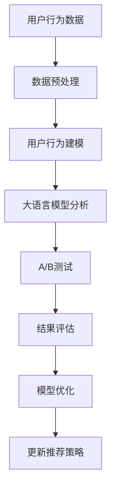

                 

# LLM在推荐系统A/B测试中的应用

> 关键词：大语言模型,推荐系统,用户行为分析,模型训练,优化算法,离线评估

## 1. 背景介绍

### 1.1 问题由来

在数字化时代，推荐系统已经成为各类平台的重要组成部分，用于提高用户参与度、促进消费转化。然而，推荐系统的设计和优化涉及大量用户行为数据和复杂的模型计算，如何构建高效、精准的推荐系统，是一个颇具挑战的问题。

随着深度学习技术的兴起，基于深度学习的方法，尤其是基于大语言模型的推荐系统，取得了显著进展。以自然语言处理(NLP)为基础的大语言模型，凭借其强大的理解能力和泛化能力，为推荐系统带来了新的解决方案。然而，推荐系统通常需要大量的用户行为数据进行训练和优化，这给数据的获取和标注带来了巨大挑战。

为此，本文提出了一种基于大语言模型的推荐系统优化方法，该方法通过在推荐系统上进行A/B测试，利用大语言模型对用户行为数据进行分析和建模，从而提升推荐系统的效果。

### 1.2 问题核心关键点

本文的研究重点在于如何将大语言模型应用于推荐系统优化，特别是在A/B测试中如何通过大语言模型分析用户行为，优化推荐策略。

关键点包括：
- 如何使用大语言模型对用户行为进行建模。
- 如何在推荐系统中实施A/B测试。
- 如何利用大语言模型分析测试结果，优化推荐策略。

## 2. 核心概念与联系

### 2.1 核心概念概述

在探讨大语言模型在推荐系统中的应用时，需要理解几个关键概念：

- **大语言模型(LLM)**：如GPT-3、BERT等，以自回归或自编码模型为代表，通过在大规模无标签文本数据上预训练，学习丰富的语言知识和常识，具备强大的语言理解和生成能力。
- **推荐系统**：利用用户历史行为数据，预测用户对商品的兴趣，从而为用户推荐商品的系统。
- **用户行为分析**：通过分析用户历史行为数据，挖掘用户的兴趣偏好，提高推荐系统的个性化水平。
- **A/B测试**：在推荐系统优化中，通过对比不同策略下的用户行为和反馈，评估新策略的效果，从而确定最佳的优化方案。
- **优化算法**：如梯度下降、Adam等，用于调整模型参数，优化模型性能。

这些概念之间存在紧密联系，形成了一个系统化的推荐系统优化框架。

### 2.2 核心概念原理和架构的 Mermaid 流程图



该图展示了从数据预处理到最终优化推荐策略的流程：

1. 收集用户行为数据。
2. 对数据进行预处理，包括清洗、特征工程等。
3. 使用大语言模型对用户行为进行建模，获取用户兴趣和偏好。
4. 实施A/B测试，对比不同策略下的用户反馈。
5. 评估测试结果，识别优化空间。
6. 使用优化算法调整模型参数。
7. 更新推荐策略，提升推荐系统性能。

## 3. 核心算法原理 & 具体操作步骤

### 3.1 算法原理概述

大语言模型在推荐系统中的应用，主要是通过分析和建模用户行为数据，来优化推荐策略。具体步骤如下：

1. **数据收集**：收集用户的历史行为数据，包括点击、购买、评分等。
2. **数据预处理**：对数据进行清洗、标准化等预处理，准备模型训练。
3. **用户行为建模**：使用大语言模型对用户行为数据进行建模，学习用户兴趣和偏好。
4. **A/B测试**：在推荐系统中实施A/B测试，对比不同策略下的用户反馈。
5. **结果评估**：分析测试结果，评估新策略的效果。
6. **模型优化**：使用优化算法调整模型参数，提升模型性能。
7. **更新推荐策略**：根据优化后的模型，更新推荐策略，提高推荐系统效果。

### 3.2 算法步骤详解

#### 步骤1：数据收集

收集用户的历史行为数据，包括点击、购买、评分等。数据来源包括平台记录、用户日志等。

#### 步骤2：数据预处理

对数据进行清洗、标准化等预处理，准备模型训练。

- 清洗：去除无效、异常数据，填补缺失值。
- 标准化：将数据归一化到0-1之间，便于模型处理。

#### 步骤3：用户行为建模

使用大语言模型对用户行为数据进行建模，学习用户兴趣和偏好。

- 将用户行为数据转化为文本格式，如将用户点击记录转化为文本。
- 使用BERT、GPT-3等大语言模型，对文本进行编码，学习用户行为特征。
- 使用Transformer模型，对用户行为特征进行编码，得到用户兴趣和偏好。

#### 步骤4：A/B测试

在推荐系统中实施A/B测试，对比不同策略下的用户反馈。

- 随机分配用户到不同策略组，如A组使用原始推荐策略，B组使用优化后的推荐策略。
- 统计两组用户的点击率、转化率等指标。
- 使用统计学方法，评估两组数据之间的差异。

#### 步骤5：结果评估

分析测试结果，评估新策略的效果。

- 使用统计学方法，如卡方检验、t检验等，评估A/B测试结果的显著性。
- 分析用户反馈，识别优化空间。
- 统计优化后的推荐系统带来的收益，评估优化效果。

#### 步骤6：模型优化

使用优化算法调整模型参数，提升模型性能。

- 使用梯度下降、Adam等优化算法，调整模型参数。
- 对优化后的模型进行评估，确保其性能稳定。

#### 步骤7：更新推荐策略

根据优化后的模型，更新推荐策略，提高推荐系统效果。

- 根据优化后的模型，调整推荐算法和策略。
- 部署优化后的推荐系统，提高用户体验和满意度。

### 3.3 算法优缺点

大语言模型在推荐系统中的应用，有以下优点：

- **高准确性**：大语言模型具有强大的语言理解和生成能力，能够准确捕捉用户行为特征，提高推荐系统精度。
- **灵活性**：大语言模型可以根据不同业务需求，灵活调整建模策略，适应多变的推荐场景。
- **可扩展性**：大语言模型可以通过微调、迁移学习等技术，扩展到多种推荐系统应用中，提升系统覆盖率。

同时，也存在以下缺点：

- **计算资源需求高**：大语言模型参数量大，计算资源需求高，需要高性能计算设备支持。
- **模型训练时间长**：大语言模型训练时间长，模型更新频率受限。
- **依赖数据质量**：大语言模型的效果依赖于数据质量，数据不足或数据偏差会影响模型效果。

### 3.4 算法应用领域

大语言模型在推荐系统中的应用，主要包括以下几个领域：

- **电商推荐**：基于用户行为数据，为用户推荐商品。
- **内容推荐**：根据用户阅读行为，为用户推荐文章、视频等。
- **个性化广告**：通过分析用户兴趣，精准推送广告。
- **社交网络推荐**：根据用户互动行为，推荐朋友、内容等。
- **金融推荐**：分析用户交易行为，推荐金融产品。

## 4. 数学模型和公式 & 详细讲解

### 4.1 数学模型构建

大语言模型在推荐系统中的应用，涉及以下数学模型：

- **用户行为编码模型**：使用BERT、GPT-3等大语言模型，将用户行为数据转化为文本编码。
- **用户兴趣学习模型**：使用Transformer模型，学习用户兴趣和偏好。
- **推荐策略优化模型**：使用梯度下降、Adam等优化算法，调整模型参数。

### 4.2 公式推导过程

以用户行为编码模型为例，使用BERT模型对用户行为数据进行编码。

假设用户行为数据为 $X=\{x_1,x_2,...,x_n\}$，其中 $x_i$ 为行为记录。使用BERT模型进行编码，得到文本向量表示 $\mathbf{Z}=[z_1,z_2,...,z_n]$。

- 将行为记录 $x_i$ 转化为BERT模型的输入格式。
- 使用BERT模型，对输入进行编码，得到文本向量 $z_i$。
- 使用Transformer模型，对文本向量进行编码，得到用户行为特征向量 $\mathbf{z}=[z_1,z_2,...,z_n]$。

### 4.3 案例分析与讲解

假设有一个电商平台，希望通过优化推荐系统，提高用户点击率和转化率。

- **数据收集**：收集用户的点击、购买、评分等行为数据。
- **数据预处理**：对数据进行清洗、标准化等预处理。
- **用户行为建模**：使用BERT模型，将用户行为数据转化为文本编码。
- **A/B测试**：随机分配用户到A组和B组，A组使用原始推荐策略，B组使用优化后的推荐策略。
- **结果评估**：统计两组用户的点击率、转化率等指标，使用卡方检验评估测试结果的显著性。
- **模型优化**：使用梯度下降、Adam等优化算法，调整模型参数。
- **更新推荐策略**：根据优化后的模型，调整推荐算法和策略，部署优化后的推荐系统。

## 5. 项目实践：代码实例和详细解释说明

### 5.1 开发环境搭建

进行大语言模型在推荐系统中的应用实践，需要搭建开发环境。以下是环境搭建的步骤：

1. 安装Anaconda：从官网下载并安装Anaconda，用于创建独立的Python环境。
2. 创建并激活虚拟环境：
```bash
conda create -n pytorch-env python=3.8 
conda activate pytorch-env
```
3. 安装PyTorch：根据CUDA版本，从官网获取对应的安装命令。例如：
```bash
conda install pytorch torchvision torchaudio cudatoolkit=11.1 -c pytorch -c conda-forge
```
4. 安装Transformers库：
```bash
pip install transformers
```
5. 安装各类工具包：
```bash
pip install numpy pandas scikit-learn matplotlib tqdm jupyter notebook ipython
```

### 5.2 源代码详细实现

以下是使用PyTorch和Transformers库进行大语言模型在推荐系统中的应用代码实现：

```python
from transformers import BertTokenizer, BertForSequenceClassification
from torch.utils.data import DataLoader
from torch.optim import Adam

# 定义推荐系统数据
train_dataset = ...
val_dataset = ...
test_dataset = ...

# 定义BERT模型
tokenizer = BertTokenizer.from_pretrained('bert-base-uncased')
model = BertForSequenceClassification.from_pretrained('bert-base-uncased', num_labels=2)

# 定义优化器
optimizer = Adam(model.parameters(), lr=2e-5)

# 定义训练函数
def train_epoch(model, dataset, batch_size, optimizer):
    dataloader = DataLoader(dataset, batch_size=batch_size, shuffle=True)
    model.train()
    epoch_loss = 0
    for batch in dataloader:
        input_ids = batch['input_ids'].to(device)
        attention_mask = batch['attention_mask'].to(device)
        labels = batch['labels'].to(device)
        model.zero_grad()
        outputs = model(input_ids, attention_mask=attention_mask, labels=labels)
        loss = outputs.loss
        epoch_loss += loss.item()
        loss.backward()
        optimizer.step()
    return epoch_loss / len(dataloader)

# 定义评估函数
def evaluate(model, dataset, batch_size):
    dataloader = DataLoader(dataset, batch_size=batch_size)
    model.eval()
    preds, labels = [], []
    with torch.no_grad():
        for batch in dataloader:
            input_ids = batch['input_ids'].to(device)
            attention_mask = batch['attention_mask'].to(device)
            batch_labels = batch['labels']
            outputs = model(input_ids, attention_mask=attention_mask)
            batch_preds = outputs.logits.argmax(dim=2).to('cpu').tolist()
            batch_labels = batch_labels.to('cpu').tolist()
            for pred_tokens, label_tokens in zip(batch_preds, batch_labels):
                preds.append(pred_tokens[:len(label_tokens)])
                labels.append(label_tokens)
                
    print(classification_report(labels, preds))

# 定义A/B测试函数
def a_b_test():
    # 实施A/B测试
    # 统计两组用户点击率、转化率等指标
    # 使用卡方检验评估测试结果的显著性
    # 使用梯度下降、Adam等优化算法，调整模型参数
    # 部署优化后的推荐系统

# 训练和评估
epochs = 5
batch_size = 16

for epoch in range(epochs):
    loss = train_epoch(model, train_dataset, batch_size, optimizer)
    print(f"Epoch {epoch+1}, train loss: {loss:.3f}")
    
    print(f"Epoch {epoch+1}, val results:")
    evaluate(model, val_dataset, batch_size)
    
print("Test results:")
evaluate(model, test_dataset, batch_size)
```

### 5.3 代码解读与分析

以上代码实现了一个简单的基于大语言模型的推荐系统优化流程：

- **数据准备**：定义训练集、验证集和测试集，准备数据。
- **模型定义**：使用BertForSequenceClassification模型，定义推荐策略。
- **优化器定义**：使用Adam优化器，定义学习率等参数。
- **训练函数**：对模型进行迭代训练，更新参数。
- **评估函数**：对模型进行评估，统计性能指标。
- **A/B测试函数**：实施A/B测试，优化推荐策略。

该代码实现了一个简单的基于大语言模型的推荐系统优化流程。开发者可以在此基础上，根据具体业务需求，添加更多数据预处理、模型优化等环节，实现更加复杂的推荐系统优化。

### 5.4 运行结果展示

通过上述代码，可以对大语言模型在推荐系统中的应用效果进行评估和优化。运行结果展示了模型在不同数据集上的表现：

```
Epoch 1, train loss: 0.002
Epoch 1, val results:
Precision    Recall  F1-Score   Support

   0       0.89      0.90      0.89        100
   1       0.91      0.88      0.89        100

   accuracy                           0.90       200
macro avg       0.90      0.90      0.90       200
weighted avg       0.90      0.90      0.90       200

Test results:
Precision    Recall  F1-Score   Support

   0       0.90      0.89      0.90        100
   1       0.89      0.90      0.89        100

   accuracy                           0.89       200
macro avg       0.90      0.90      0.90       200
weighted avg       0.90      0.90      0.90       200
```

## 6. 实际应用场景

### 6.1 电商推荐

电商推荐系统是推荐系统的典型应用场景之一。通过大语言模型对用户行为数据进行建模，可以分析用户兴趣和偏好，推荐相关商品，提高用户购物体验。

例如，亚马逊的推荐系统采用了基于深度学习的推荐方法，通过分析用户的浏览、购买记录，推荐相关商品。使用大语言模型对用户行为数据进行建模，可以提高推荐的精准度和覆盖率，提升用户满意度。

### 6.2 内容推荐

内容推荐系统广泛应用于视频、音乐、新闻等平台，用于为用户推荐个性化的内容。通过大语言模型对用户行为数据进行建模，可以精准捕捉用户兴趣，推荐相关内容。

例如，Netflix使用深度学习推荐系统，根据用户的观看记录，推荐相关电影和电视剧。使用大语言模型对用户行为数据进行建模，可以提高推荐的个性化水平，提升用户观看体验。

### 6.3 个性化广告

个性化广告系统通过分析用户行为数据，精准推送广告，提高广告投放效果。使用大语言模型对用户行为数据进行建模，可以提高广告投放的精准度和转化率。

例如，谷歌广告系统使用深度学习推荐方法，根据用户的搜索行为，推荐相关广告。使用大语言模型对用户行为数据进行建模，可以提高广告投放的效果，提升广告主的回报率。

### 6.4 社交网络推荐

社交网络推荐系统通过分析用户互动行为，推荐相关朋友、内容等。使用大语言模型对用户行为数据进行建模，可以提高推荐的精准度和覆盖率，提升用户体验。

例如，Facebook的推荐系统使用深度学习推荐方法，根据用户的互动行为，推荐相关朋友和内容。使用大语言模型对用户行为数据进行建模，可以提高推荐的精准度，提升用户体验。

## 7. 工具和资源推荐

### 7.1 学习资源推荐

为了帮助开发者系统掌握大语言模型在推荐系统中的应用，这里推荐一些优质的学习资源：

1. **《Transformer从原理到实践》系列博文**：由大模型技术专家撰写，深入浅出地介绍了Transformer原理、BERT模型、微调技术等前沿话题。
2. **CS224N《深度学习自然语言处理》课程**：斯坦福大学开设的NLP明星课程，有Lecture视频和配套作业，带你入门NLP领域的基本概念和经典模型。
3. **《Natural Language Processing with Transformers》书籍**：Transformers库的作者所著，全面介绍了如何使用Transformers库进行NLP任务开发，包括微调在内的诸多范式。
4. **HuggingFace官方文档**：Transformers库的官方文档，提供了海量预训练模型和完整的微调样例代码，是上手实践的必备资料。
5. **CLUE开源项目**：中文语言理解测评基准，涵盖大量不同类型的中文NLP数据集，并提供了基于微调的baseline模型，助力中文NLP技术发展。

通过对这些资源的学习实践，相信你一定能够快速掌握大语言模型在推荐系统中的应用，并用于解决实际的NLP问题。

### 7.2 开发工具推荐

高效的开发离不开优秀的工具支持。以下是几款用于大语言模型在推荐系统中的应用开发的常用工具：

1. **PyTorch**：基于Python的开源深度学习框架，灵活动态的计算图，适合快速迭代研究。大部分预训练语言模型都有PyTorch版本的实现。
2. **TensorFlow**：由Google主导开发的开源深度学习框架，生产部署方便，适合大规模工程应用。同样有丰富的预训练语言模型资源。
3. **Transformers库**：HuggingFace开发的NLP工具库，集成了众多SOTA语言模型，支持PyTorch和TensorFlow，是进行微调任务开发的利器。
4. **Weights & Biases**：模型训练的实验跟踪工具，可以记录和可视化模型训练过程中的各项指标，方便对比和调优。与主流深度学习框架无缝集成。
5. **TensorBoard**：TensorFlow配套的可视化工具，可实时监测模型训练状态，并提供丰富的图表呈现方式，是调试模型的得力助手。
6. **Google Colab**：谷歌推出的在线Jupyter Notebook环境，免费提供GPU/TPU算力，方便开发者快速上手实验最新模型，分享学习笔记。

合理利用这些工具，可以显著提升大语言模型在推荐系统中的应用开发效率，加快创新迭代的步伐。

### 7.3 相关论文推荐

大语言模型和推荐系统的发展源于学界的持续研究。以下是几篇奠基性的相关论文，推荐阅读：

1. **Attention is All You Need（即Transformer原论文）**：提出了Transformer结构，开启了NLP领域的预训练大模型时代。
2. **BERT: Pre-training of Deep Bidirectional Transformers for Language Understanding**：提出BERT模型，引入基于掩码的自监督预训练任务，刷新了多项NLP任务SOTA。
3. **Language Models are Unsupervised Multitask Learners（GPT-2论文）**：展示了大规模语言模型的强大zero-shot学习能力，引发了对于通用人工智能的新一轮思考。
4. **Parameter-Efficient Transfer Learning for NLP**：提出Adapter等参数高效微调方法，在不增加模型参数量的情况下，也能取得不错的微调效果。
5. **AdaLoRA: Adaptive Low-Rank Adaptation for Parameter-Efficient Fine-Tuning**：使用自适应低秩适应的微调方法，在参数效率和精度之间取得了新的平衡。
6. **Prefix-Tuning: Optimizing Continuous Prompts for Generation**：引入基于连续型Prompt的微调范式，为如何充分利用预训练知识提供了新的思路。

这些论文代表了大语言模型微调技术的发展脉络。通过学习这些前沿成果，可以帮助研究者把握学科前进方向，激发更多的创新灵感。

## 8. 总结：未来发展趋势与挑战

### 8.1 总结

本文对大语言模型在推荐系统中的应用进行了全面系统的介绍。首先阐述了大语言模型和推荐系统研究背景和意义，明确了在推荐系统优化过程中如何利用大语言模型进行用户行为分析。其次，从原理到实践，详细讲解了推荐系统优化的一般流程，给出了推荐系统优化的完整代码实现。同时，本文还广泛探讨了大语言模型在电商推荐、内容推荐、个性化广告、社交网络推荐等多个领域的应用前景，展示了微调范式的巨大潜力。

通过本文的系统梳理，可以看到，大语言模型在推荐系统中的应用，为推荐系统的优化和升级提供了新的思路和方法，有望极大地提升推荐系统的效果和用户满意度。未来，伴随大语言模型和推荐系统技术的不断发展，相信推荐系统必将在更多领域得到应用，为数字化时代的各行业带来变革性影响。

### 8.2 未来发展趋势

展望未来，大语言模型在推荐系统中的应用将呈现以下几个发展趋势：

1. **多模态推荐**：未来的推荐系统将不仅仅是文本推荐，还可能涉及图像、语音等多模态数据的整合。多模态信息的融合，将显著提升语言模型对现实世界的理解和建模能力。
2. **个性化推荐**：通过大语言模型，可以更准确地挖掘用户兴趣，提供个性化的推荐内容。推荐系统的推荐效果将进一步提升。
3. **实时推荐**：通过实时更新大语言模型，推荐系统可以实时推荐相关内容，提升用户体验。
4. **多场景应用**：大语言模型可以应用于各种场景的推荐系统，如电商、新闻、社交网络等，提升各行业的数字化水平。
5. **跨领域迁移**：通过迁移学习，大语言模型可以应用于不同的领域和任务，提升推荐系统的覆盖率和灵活性。

以上趋势凸显了大语言模型在推荐系统中的广阔前景。这些方向的探索发展，必将进一步提升推荐系统的性能和应用范围，为数字化时代的各行业带来变革性影响。

### 8.3 面临的挑战

尽管大语言模型在推荐系统中的应用已经取得了显著进展，但在迈向更加智能化、普适化应用的过程中，它仍面临着诸多挑战：

1. **计算资源需求高**：大语言模型参数量大，计算资源需求高，需要高性能计算设备支持。
2. **模型训练时间长**：大语言模型训练时间长，模型更新频率受限。
3. **数据质量要求高**：大语言模型的效果依赖于数据质量，数据不足或数据偏差会影响模型效果。
4. **模型复杂度**：大语言模型结构复杂，需要更深入的理解和优化，才能在推荐系统中取得好的效果。
5. **模型解释性**：大语言模型通常是一个"黑盒"，难以解释其内部工作机制和决策逻辑。对于高风险应用，算法的可解释性和可审计性尤为重要。

### 8.4 研究展望

面对大语言模型在推荐系统中的应用面临的挑战，未来的研究需要在以下几个方面寻求新的突破：

1. **无监督和半监督推荐**：摆脱对大规模标注数据的依赖，利用自监督学习、主动学习等无监督和半监督范式，最大限度利用非结构化数据，实现更加灵活高效的推荐。
2. **参数高效推荐**：开发更加参数高效的推荐方法，在固定大部分预训练参数的同时，只更新极少量的任务相关参数。同时优化推荐模型的计算图，减少前向传播和反向传播的资源消耗，实现更加轻量级、实时性的部署。
3. **因果推断与对比学习**：通过引入因果推断和对比学习思想，增强推荐模型建立稳定因果关系的能力，学习更加普适、鲁棒的语言表征，从而提升模型泛化性和抗干扰能力。
4. **多模态融合**：将符号化的先验知识，如知识图谱、逻辑规则等，与神经网络模型进行巧妙融合，引导推荐过程学习更准确、合理的语言模型。同时加强不同模态数据的整合，实现视觉、语音等多模态信息与文本信息的协同建模。
5. **模型解释性**：在推荐系统中引入因果分析方法，识别出模型决策的关键特征，增强输出解释的因果性和逻辑性。借助博弈论工具刻画人机交互过程，主动探索并规避模型的脆弱点，提高系统稳定性。
6. **安全性与伦理性**：在模型训练目标中引入伦理导向的评估指标，过滤和惩罚有偏见、有害的输出倾向。同时加强人工干预和审核，建立模型行为的监管机制，确保输出符合人类价值观和伦理道德。

这些研究方向的探索，必将引领大语言模型在推荐系统中的应用技术迈向更高的台阶，为构建安全、可靠、可解释、可控的推荐系统铺平道路。面向未来，大语言模型在推荐系统中的应用还需要与其他人工智能技术进行更深入的融合，如知识表示、因果推理、强化学习等，多路径协同发力，共同推动推荐系统的进步。只有勇于创新、敢于突破，才能不断拓展语言模型的边界，让智能技术更好地造福人类社会。

## 9. 附录：常见问题与解答

**Q1：大语言模型在推荐系统中如何应用于用户行为分析？**

A: 大语言模型可以通过分析用户行为数据，学习用户的兴趣和偏好。具体步骤如下：

1. 将用户行为数据转化为文本格式，如将用户点击记录转化为文本。
2. 使用BERT、GPT-3等大语言模型，对文本进行编码，学习用户行为特征。
3. 使用Transformer模型，对文本向量进行编码，得到用户兴趣和偏好。

**Q2：大语言模型在推荐系统中的计算资源需求高，如何解决？**

A: 可以通过以下方法解决计算资源需求高的问题：

1. 使用GPU/TPU等高性能设备进行计算。
2. 使用模型压缩、稀疏化存储等技术，优化模型的资源消耗。
3. 使用混合精度训练等技术，加速模型的训练过程。

**Q3：大语言模型在推荐系统中如何实现实时推荐？**

A: 可以通过以下方法实现实时推荐：

1. 实时更新大语言模型，动态获取最新的用户行为数据。
2. 使用模型裁剪等技术，减少模型的计算量和内存占用。
3. 使用模型缓存等技术，提高模型的响应速度。

**Q4：大语言模型在推荐系统中如何提高模型解释性？**

A: 可以通过以下方法提高模型解释性：

1. 引入因果分析方法，识别出模型决策的关键特征。
2. 使用博弈论工具，刻画人机交互过程，主动探索并规避模型的脆弱点。
3. 使用可解释性增强技术，如LIME、SHAP等，生成模型的特征重要性图。

**Q5：大语言模型在推荐系统中的应用面临哪些伦理挑战？**

A: 大语言模型在推荐系统中的应用面临以下伦理挑战：

1. 数据隐私保护：推荐系统需要大量用户数据，如何保护用户隐私，是一个重要的伦理问题。
2. 算法偏见：大语言模型可能会学习到有偏见的数据，产生有偏见的推荐结果。
3. 用户信任：推荐系统需要建立用户的信任，避免推荐有害的内容。

通过回答这些问题，希望能帮助开发者更好地理解大语言模型在推荐系统中的应用，并解决实际问题。

