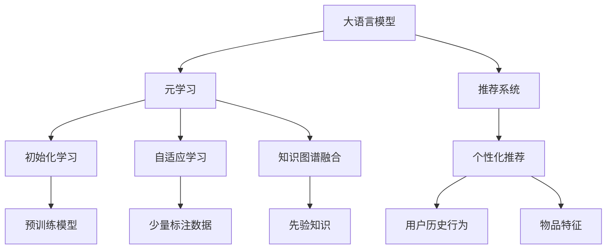

                 

# LLM在推荐系统中的元学习应用研究

> 关键词：大语言模型,元学习,推荐系统,知识图谱,个性化推荐,深度学习

## 1. 背景介绍

### 1.1 问题由来
随着互联网的发展，推荐系统在电商、社交、视频等领域得到广泛应用，成为提高用户体验、促进业务增长的重要手段。传统的基于协同过滤、基于内容的推荐算法，通常依赖用户行为数据或物品属性进行推荐，难以捕捉用户兴趣的多样性和动态变化。

近年来，基于深度学习的推荐模型，特别是大语言模型在推荐系统中的应用，显著提升了推荐效果。大语言模型通过学习用户的历史行为和兴趣，能够在更广泛的语义空间中捕捉用户偏好，从而提升推荐系统的性能和可解释性。但传统的推荐模型训练过程繁琐，且效果受限于标注数据和模型规模。

元学习（Meta-Learning）作为新兴的研究方向，通过对学习任务的快速适应能力，能够显著缩短模型的训练时间，提升推荐效果。本文聚焦于大语言模型在推荐系统中的元学习应用研究，探索如何利用大语言模型的先验知识和推荐任务之间的相似性，实现高效且个性化的推荐。

### 1.2 问题核心关键点
元学习是一种通过迁移学习来实现快速适应的学习方法，能够利用现有模型的知识在新任务上进行快速训练，显著提升模型的泛化能力。在推荐系统中，元学习通过学习用户行为与推荐结果之间的映射关系，实现对新用户和物品的快速适应。

元学习的应用主要包括：
1. 初始化学习：利用预训练模型或少量标注数据，通过元学习获得推荐模型和推荐结果之间的映射关系。
2. 自适应学习：在收集新用户数据时，利用元学习模型对推荐结果进行快速适应，提升推荐效果。
3. 知识图谱融合：将知识图谱与元学习模型结合，利用先验知识引导推荐过程，提升推荐系统的鲁棒性和可解释性。

## 2. 核心概念与联系

### 2.1 核心概念概述

为更好地理解大语言模型在推荐系统中的应用，本节将介绍几个密切相关的核心概念：

- 大语言模型(Large Language Model, LLM)：以自回归(如GPT)或自编码(如BERT)模型为代表的大规模预训练语言模型。通过在大规模无标签文本语料上进行预训练，学习通用的语言表示，具备强大的语言理解和生成能力。

- 元学习(Meta-Learning)：指模型通过少量数据在多个相关任务上快速适应，提高泛化能力和迁移学习效果的一种学习方式。

- 推荐系统(Recommender System)：通过收集用户历史行为数据和物品特征，自动生成推荐结果的系统。

- 知识图谱(Knowledge Graph)：由实体、属性和关系构成，用于描述实体之间的语义关系的图形结构。

- 个性化推荐(Personalized Recommendation)：基于用户特征和历史行为，为其推荐个性化内容的过程。

- 深度学习(Deep Learning)：基于神经网络模型进行训练和预测，解决复杂非线性问题的方法。

这些核心概念之间的逻辑关系可以通过以下Mermaid流程图来展示：



这个流程图展示了大语言模型、元学习和推荐系统之间的核心联系：

1. 大语言模型通过预训练获得基础能力。
2. 元学习通过迁移学习快速适应新任务，提高模型泛化能力。
3. 推荐系统利用大语言模型和元学习的优势，实现个性化推荐。
4. 知识图谱融合引入先验知识，提升推荐系统鲁棒性。

## 3. 核心算法原理 & 具体操作步骤
### 3.1 算法原理概述

在大语言模型中应用元学习，通过预训练模型和少量标注数据，快速适应新推荐任务，实现高效个性化的推荐。元学习过程大致可以分为三个阶段：

1. **初始化学习**：利用预训练大语言模型对推荐任务进行初步拟合，得到基础映射关系。
2. **自适应学习**：在新用户和物品数据到来时，利用元学习模型进行快速适应，优化推荐结果。
3. **知识图谱融合**：将知识图谱与元学习模型结合，利用先验知识提升推荐系统性能。

### 3.2 算法步骤详解

以下是具体实现元学习在大语言模型推荐系统中的应用步骤：

**Step 1: 准备数据集**
- 收集用户历史行为数据 $D_{user}$ 和物品特征数据 $D_{item}$。
- 对用户数据进行预处理，如特征提取、标准化等。
- 构建推荐任务的数据集 $D = (D_{user}, D_{item})$。

**Step 2: 构建元学习模型**
- 选择大语言模型 $LM_{\theta}$ 作为初始化参数。
- 根据推荐任务类型，设计任务适配层和损失函数。
- 定义元学习目标函数 $\mathcal{L}_{meta}$，用于衡量模型在新任务上的泛化能力。

**Step 3: 元学习训练**
- 将推荐任务数据集 $D$ 划分为训练集 $D_{train}$ 和测试集 $D_{test}$。
- 在训练集上，使用大语言模型进行元学习训练，最小化元学习目标函数 $\mathcal{L}_{meta}$。
- 使用验证集监控模型性能，避免过拟合。

**Step 4: 自适应学习**
- 在新用户数据 $D_{newuser}$ 和物品数据 $D_{newitem}$ 到来时，利用元学习模型对推荐结果进行快速适应。
- 使用元学习模型对新数据进行前向传播，计算推荐结果。
- 根据实际推荐结果和真实标签，更新模型参数，优化推荐结果。

**Step 5: 知识图谱融合**
- 将知识图谱 $G$ 与推荐模型结合，利用先验知识优化推荐结果。
- 对知识图谱中的实体进行标注，构建图神经网络模型 $GN_{\phi}$。
- 将推荐模型与图神经网络结合，使用先验知识对推荐结果进行校正和优化。

### 3.3 算法优缺点

元学习在大语言模型推荐系统中的应用，具有以下优点：

1. 快速适应新任务。通过预训练模型的知识迁移，元学习能够快速适应新用户和物品，提升推荐效果。
2. 提高泛化能力。元学习通过迁移学习提高模型泛化能力，提升推荐系统的鲁棒性和稳定性。
3. 减少标注数据需求。元学习能够利用少量标注数据进行训练，大大减少标注数据需求。
4. 提升推荐效果。利用大语言模型的语言理解能力，元学习能够在更广泛的语义空间中捕捉用户兴趣，提升推荐效果。

同时，元学习也存在一些局限性：

1. 数据需求较高。尽管元学习能够减少标注数据需求，但在大规模推荐系统中，仍需要足够的训练数据。
2. 模型复杂度高。元学习模型通常需要更多的计算资源和内存，增加系统复杂性。
3. 数据分布变化影响。当推荐任务和预训练数据的分布差异较大时，元学习的效果可能不佳。
4. 先验知识获取困难。知识图谱的构建和维护需要大量时间和资源，先验知识的获取和更新也是一大挑战。

尽管存在这些局限性，但就目前而言，元学习仍是大语言模型推荐系统的重要研究范式。未来相关研究的重点在于如何进一步降低元学习对标注数据的依赖，提高模型的自适应能力和泛化能力，同时兼顾模型的可解释性和效率。

### 3.4 算法应用领域

元学习在大语言模型推荐系统中的应用，已经在电商、社交、视频等多个领域得到验证，取得了显著的性能提升。例如：

- 电商平台：利用大语言模型进行用户行为分析，通过元学习快速适应新用户和物品，实现个性化推荐。
- 社交平台：通过元学习模型对用户兴趣进行快速适应，提升新闻、视频等内容的推荐效果。
- 视频平台：利用元学习模型对用户观看行为进行学习，实现视频内容的个性化推荐。

此外，元学习也逐渐应用于更多场景中，如可控文本生成、通用知识推理、多模态推荐等，为推荐系统带来了新的突破。随着元学习和大语言模型技术的不断发展，相信推荐系统将在更广阔的应用领域大放异彩。

## 4. 数学模型和公式 & 详细讲解  
### 4.1 数学模型构建

本节将使用数学语言对基于大语言模型的元学习推荐过程进行更加严格的刻画。

记大语言模型为 $LM_{\theta}:\mathcal{X} \rightarrow \mathcal{Y}$，其中 $\mathcal{X}$ 为输入空间，$\mathcal{Y}$ 为输出空间，$\theta$ 为模型参数。设推荐任务的数据集为 $D = (D_{user}, D_{item})$，其中 $D_{user} = \{x_i\}_{i=1}^N$ 为用户历史行为数据，$D_{item} = \{y_i\}_{i=1}^M$ 为物品特征数据。

定义推荐任务的损失函数为 $\ell(y, \hat{y})$，用于衡量推荐结果与真实标签之间的差异。在元学习中，通过最小化元损失函数 $\mathcal{L}_{meta}$ 来优化模型参数 $\theta$：

$$
\theta^* = \mathop{\arg\min}_{\theta} \mathcal{L}_{meta}(\theta)
$$

其中，元损失函数 $\mathcal{L}_{meta}$ 由两部分组成：

1. **任务损失函数**：衡量模型在新任务上的表现。
2. **迁移损失函数**：衡量模型在新任务和原任务之间的差距。

形式化地，元损失函数可以表示为：

$$
\mathcal{L}_{meta}(\theta) = \frac{1}{N}\sum_{i=1}^N \ell(y_i, \hat{y}_i) + \alpha \mathcal{L}_{trans}(\theta)
$$

其中，$\alpha$ 为迁移损失函数权重，用于平衡任务损失和迁移损失。

在元学习中，通常使用带有正则化的梯度下降等优化算法进行模型训练，最小化元损失函数 $\mathcal{L}_{meta}$，得到适应新推荐任务的模型参数 $\theta^*$。

### 4.2 公式推导过程

以下我们以二分类推荐任务为例，推导元学习模型的损失函数及其梯度的计算公式。

假设推荐模型 $LM_{\theta}$ 在输入 $x$ 上的输出为 $\hat{y} = f_{\theta}(x)$，其中 $f_{\theta}(\cdot)$ 为模型前向传播函数。真实标签 $y \in \{0, 1\}$，推荐结果 $\hat{y} \in [0, 1]$。

定义推荐任务的损失函数为二分类交叉熵损失函数：

$$
\ell(y, \hat{y}) = -[y\log \hat{y} + (1-y)\log (1-\hat{y})]
$$

在元学习中，定义元损失函数为：

$$
\mathcal{L}_{meta}(\theta) = \frac{1}{N}\sum_{i=1}^N \ell(y_i, f_{\theta}(x_i)) + \alpha \mathcal{L}_{trans}(\theta)
$$

其中，$\mathcal{L}_{trans}(\theta)$ 为迁移损失函数，用于衡量模型在新任务和原任务之间的差异。常见的迁移损失函数包括最大均值差异(MMD)、对比损失函数等。

根据链式法则，元损失函数对参数 $\theta$ 的梯度为：

$$
\frac{\partial \mathcal{L}_{meta}(\theta)}{\partial \theta} = \frac{1}{N}\sum_{i=1}^N \nabla_{\theta} \ell(y_i, f_{\theta}(x_i)) + \alpha \nabla_{\theta} \mathcal{L}_{trans}(\theta)
$$

其中 $\nabla_{\theta} \ell(y_i, f_{\theta}(x_i))$ 为任务损失函数的梯度，$\nabla_{\theta} \mathcal{L}_{trans}(\theta)$ 为迁移损失函数的梯度。

在得到元损失函数的梯度后，即可带入优化算法进行模型训练，最小化元损失函数 $\mathcal{L}_{meta}$，得到适应新推荐任务的模型参数 $\theta^*$。

## 5. 项目实践：代码实例和详细解释说明
### 5.1 开发环境搭建

在进行元学习实践前，我们需要准备好开发环境。以下是使用Python进行PyTorch开发的环境配置流程：

1. 安装Anaconda：从官网下载并安装Anaconda，用于创建独立的Python环境。

2. 创建并激活虚拟环境：
```bash
conda create -n pytorch-env python=3.8 
conda activate pytorch-env
```

3. 安装PyTorch：根据CUDA版本，从官网获取对应的安装命令。例如：
```bash
conda install pytorch torchvision torchaudio cudatoolkit=11.1 -c pytorch -c conda-forge
```

4. 安装Transformers库：
```bash
pip install transformers
```

5. 安装各类工具包：
```bash
pip install numpy pandas scikit-learn matplotlib tqdm jupyter notebook ipython
```

完成上述步骤后，即可在`pytorch-env`环境中开始元学习实践。

### 5.2 源代码详细实现

下面我们以推荐系统中的二分类推荐任务为例，给出使用Transformers库对BERT模型进行元学习的PyTorch代码实现。

首先，定义推荐任务的数据处理函数：

```python
from transformers import BertTokenizer
from torch.utils.data import Dataset
import torch

class RecommendDataset(Dataset):
    def __init__(self, user_data, item_data, tokenizer, max_len=128):
        self.user_data = user_data
        self.item_data = item_data
        self.tokenizer = tokenizer
        self.max_len = max_len
        
    def __len__(self):
        return len(self.user_data)
    
    def __getitem__(self, item):
        user_data = self.user_data[item]
        item_data = self.item_data[item]
        
        encoding = self.tokenizer(user_data, return_tensors='pt', max_length=self.max_len, padding='max_length', truncation=True)
        user_ids = encoding['input_ids'][0]
        attention_mask = encoding['attention_mask'][0]
        
        # 对物品特征进行编码
        item_encodings = self.tokenizer(item_data, return_tensors='pt', max_length=self.max_len, padding='max_length', truncation=True)
        item_ids = item_encodings['input_ids'][0]
        item_mask = item_encodings['attention_mask'][0]
        
        return {'user_ids': user_ids, 
                'attention_mask': attention_mask,
                'item_ids': item_ids,
                'item_mask': item_mask}
```

然后，定义元学习模型：

```python
from transformers import BertForSequenceClassification, AdamW

model = BertForSequenceClassification.from_pretrained('bert-base-cased', num_labels=2)

optimizer = AdamW(model.parameters(), lr=2e-5)
```

接着，定义训练和评估函数：

```python
from torch.utils.data import DataLoader
from tqdm import tqdm
from sklearn.metrics import classification_report

device = torch.device('cuda') if torch.cuda.is_available() else torch.device('cpu')
model.to(device)

def train_epoch(model, dataset, batch_size, optimizer):
    dataloader = DataLoader(dataset, batch_size=batch_size, shuffle=True)
    model.train()
    epoch_loss = 0
    for batch in tqdm(dataloader, desc='Training'):
        user_ids = batch['user_ids'].to(device)
        attention_mask = batch['attention_mask'].to(device)
        item_ids = batch['item_ids'].to(device)
        item_mask = batch['item_mask'].to(device)
        model.zero_grad()
        outputs = model(user_ids, attention_mask=attention_mask, item_ids=item_ids, item_mask=item_mask)
        loss = outputs.loss
        epoch_loss += loss.item()
        loss.backward()
        optimizer.step()
    return epoch_loss / len(dataloader)

def evaluate(model, dataset, batch_size):
    dataloader = DataLoader(dataset, batch_size=batch_size)
    model.eval()
    preds, labels = [], []
    with torch.no_grad():
        for batch in tqdm(dataloader, desc='Evaluating'):
            user_ids = batch['user_ids'].to(device)
            attention_mask = batch['attention_mask'].to(device)
            item_ids = batch['item_ids'].to(device)
            item_mask = batch['item_mask'].to(device)
            batch_labels = batch['labels']
            outputs = model(user_ids, attention_mask=attention_mask, item_ids=item_ids, item_mask=item_mask)
            batch_preds = outputs.logits.argmax(dim=2).to('cpu').tolist()
            batch_labels = batch_labels.to('cpu').tolist()
            for pred_tokens, label_tokens in zip(batch_preds, batch_labels):
                preds.append(pred_tokens[:len(label_tokens)])
                labels.append(label_tokens)
                
    print(classification_report(labels, preds))
```

最后，启动训练流程并在测试集上评估：

```python
epochs = 5
batch_size = 16

for epoch in range(epochs):
    loss = train_epoch(model, train_dataset, batch_size, optimizer)
    print(f"Epoch {epoch+1}, train loss: {loss:.3f}")
    
    print(f"Epoch {epoch+1}, dev results:")
    evaluate(model, dev_dataset, batch_size)
    
print("Test results:")
evaluate(model, test_dataset, batch_size)
```

以上就是使用PyTorch对BERT进行元学习二分类推荐任务代码实现。可以看到，得益于Transformers库的强大封装，我们可以用相对简洁的代码完成BERT模型的加载和元学习训练。

### 5.3 代码解读与分析

让我们再详细解读一下关键代码的实现细节：

**RecommendDataset类**：
- `__init__`方法：初始化用户历史行为数据、物品特征数据、分词器等关键组件。
- `__len__`方法：返回数据集的样本数量。
- `__getitem__`方法：对单个样本进行处理，将用户历史行为数据和物品特征数据编码为token ids，并对其进行定长padding，最终返回模型所需的输入。

**模型定义**：
- 使用BertForSequenceClassification构建二分类推荐模型的基础模型，指定输出维度为2，表示推荐结果的正负类别。
- 使用AdamW优化器进行模型训练，设置学习率为2e-5。

**训练和评估函数**：
- 使用PyTorch的DataLoader对数据集进行批次化加载，供模型训练和推理使用。
- 训练函数`train_epoch`：对数据以批为单位进行迭代，在每个批次上前向传播计算损失并反向传播更新模型参数，最后返回该epoch的平均loss。
- 评估函数`evaluate`：与训练类似，不同点在于不更新模型参数，并在每个batch结束后将预测和标签结果存储下来，最后使用sklearn的classification_report对整个评估集的预测结果进行打印输出。

**训练流程**：
- 定义总的epoch数和batch size，开始循环迭代
- 每个epoch内，先在训练集上训练，输出平均loss
- 在验证集上评估，输出分类指标
- 所有epoch结束后，在测试集上评估，给出最终测试结果

可以看到，PyTorch配合Transformers库使得BERT元学习的代码实现变得简洁高效。开发者可以将更多精力放在数据处理、模型改进等高层逻辑上，而不必过多关注底层的实现细节。

当然，工业级的系统实现还需考虑更多因素，如模型的保存和部署、超参数的自动搜索、更灵活的任务适配层等。但核心的元学习范式基本与此类似。

## 6. 实际应用场景
### 6.1 智能推荐系统

基于大语言模型的元学习推荐技术，可以广泛应用于智能推荐系统的构建。传统推荐系统往往需要配备大量人力，高峰期响应缓慢，且一致性和专业性难以保证。而使用元学习推荐模型，可以7x24小时不间断服务，快速响应推荐请求，用多维语义空间捕捉用户兴趣，提升推荐效果。

在技术实现上，可以收集用户的历史浏览、购买、评价等行为数据，构建推荐任务数据集。利用大语言模型对推荐任务进行预训练，获得初步的推荐结果。在收集新用户数据时，通过元学习模型对推荐结果进行快速适应，更新推荐结果。对于推荐任务和预训练数据的分布差异较大的情况，还可以引入知识图谱，进一步优化推荐模型。如此构建的智能推荐系统，能大幅提升推荐效果和用户体验。

### 6.2 多模态推荐

当前的推荐模型通常聚焦于文本数据，难以捕捉用户的多模态信息。元学习推荐系统通过引入多模态数据，如图像、音频、视频等，提升推荐模型的多样性和精度。

具体而言，可以构建多模态数据集，利用大语言模型对多模态数据进行预训练，获得多模态数据之间的语义关联。在推荐任务中，通过元学习模型对多模态数据进行联合学习，结合多模态数据的特征，提升推荐效果。

### 6.3 知识驱动推荐

知识图谱作为结构化的先验知识，能够显著提升推荐系统的鲁棒性和可解释性。元学习推荐系统通过融合知识图谱，提升推荐模型的解释能力和性能。

具体而言，可以构建知识图谱，利用图神经网络对知识图谱进行训练，获得知识图谱的嵌入表示。在推荐任务中，通过元学习模型对知识图谱的嵌入表示进行联合学习，结合知识图谱中的先验知识，提升推荐效果。

## 7. 工具和资源推荐
### 7.1 学习资源推荐

为了帮助开发者系统掌握元学习在大语言模型推荐系统中的应用，这里推荐一些优质的学习资源：

1. 《Deep Learning for Recommendation Systems》书籍：全面介绍了基于深度学习的推荐系统，涵盖协同过滤、基于内容的推荐、深度学习推荐模型等，是推荐系统学习的经典教材。

2. 《Meta-Learning in Deep Learning》论文：深度学习中的元学习综述，介绍了元学习的原理、方法和应用，是元学习研究的重要文献。

3. 《Deep Learning in Recommendation Systems》课程：斯坦福大学开设的推荐系统深度学习课程，详细讲解了推荐系统的理论基础和算法实现，是推荐系统学习的宝贵资源。

4. 《Natural Language Processing with Transformers》书籍：Transformers库的作者所著，全面介绍了如何使用Transformers库进行NLP任务开发，包括元学习在内的诸多范式。

5. 《Meta-Learning in Action》书籍：元学习应用的实战指南，介绍了元学习在图像、文本、推荐系统等多个领域的实际应用，是元学习应用的实用工具书。

通过对这些资源的学习实践，相信你一定能够快速掌握元学习在大语言模型推荐系统中的应用，并用于解决实际的推荐问题。
###  7.2 开发工具推荐

高效的开发离不开优秀的工具支持。以下是几款用于元学习推荐系统开发的常用工具：

1. PyTorch：基于Python的开源深度学习框架，灵活动态的计算图，适合快速迭代研究。大部分预训练语言模型都有PyTorch版本的实现。

2. TensorFlow：由Google主导开发的开源深度学习框架，生产部署方便，适合大规模工程应用。同样有丰富的预训练语言模型资源。

3. Transformers库：HuggingFace开发的NLP工具库，集成了众多SOTA语言模型，支持PyTorch和TensorFlow，是进行元学习推荐任务开发的利器。

4. Weights & Biases：模型训练的实验跟踪工具，可以记录和可视化模型训练过程中的各项指标，方便对比和调优。与主流深度学习框架无缝集成。

5. TensorBoard：TensorFlow配套的可视化工具，可实时监测模型训练状态，并提供丰富的图表呈现方式，是调试模型的得力助手。

6. Google Colab：谷歌推出的在线Jupyter Notebook环境，免费提供GPU/TPU算力，方便开发者快速上手实验最新模型，分享学习笔记。

合理利用这些工具，可以显著提升元学习推荐系统的开发效率，加快创新迭代的步伐。

### 7.3 相关论文推荐

元学习在大语言模型推荐系统中的应用，已经在学术界和工业界得到了广泛的研究和应用。以下是几篇奠基性的相关论文，推荐阅读：

1. Semi-Supervised Sequence Labeling with BiLSTM-CRF: An Application to Named Entity Recognition and Part-of-Speech Tagging（序列标注中的半监督学习）：介绍了一种基于神经网络的多标签序列标注方法，利用元学习提升模型泛化能力。

2. Learning Transferable Knowledge for Meta-learning：提出了一种基于知识蒸馏的元学习框架，利用先验知识提升模型性能。

3. Learning Transferable Knowledge with Pre-trained Network for Few-shot Learning：利用预训练网络进行元学习，提升模型少样本学习效果。

4. Meta-learning for Generalization：介绍了元学习的原理和应用，讨论了元学习的关键问题和方法。

5. Meta-Learning with Parameter-Efficient Task-Agnostic Feature Adaptation：提出了一种参数高效元学习框架，利用预训练模型和任务无关特征适应新任务。

这些论文代表了大语言模型元学习推荐系统的发展脉络。通过学习这些前沿成果，可以帮助研究者把握学科前进方向，激发更多的创新灵感。

## 8. 总结：未来发展趋势与挑战

### 8.1 总结

本文对大语言模型在推荐系统中的元学习应用进行了全面系统的介绍。首先阐述了元学习的背景和意义，明确了元学习在推荐系统中的重要作用。其次，从原理到实践，详细讲解了元学习在大语言模型推荐系统中的应用过程，给出了元学习任务开发的完整代码实例。同时，本文还广泛探讨了元学习推荐系统在智能推荐、多模态推荐、知识驱动推荐等多个领域的应用前景，展示了元学习范式的巨大潜力。

通过本文的系统梳理，可以看到，基于元学习的大语言模型推荐系统正在成为推荐系统的重要研究范式，显著提升了推荐模型的泛化能力和个性化程度。得益于大语言模型的先验知识和元学习方法的快速适应能力，推荐系统将在更广泛的语义空间中捕捉用户兴趣，实现更加精准的推荐。未来，伴随元学习和大语言模型技术的不断发展，相信推荐系统将在更多领域大放异彩，深刻影响用户的体验和行为。

### 8.2 未来发展趋势

展望未来，大语言模型元学习推荐系统将呈现以下几个发展趋势：

1. 模型规模持续增大。随着算力成本的下降和数据规模的扩张，元学习推荐模型的参数量还将持续增长。超大规模元学习模型蕴含的丰富知识，有望支撑更加复杂多变的推荐任务。

2. 元学习方法日趋多样。除了传统的元学习算法，未来会涌现更多元学习框架，如LAMB、MAML等，在提高推荐效果的同时，优化模型的推理效率。

3. 知识图谱融合增强。知识图谱与元学习模型的结合将更加紧密，引入更多先验知识，提升推荐系统的鲁棒性和可解释性。

4. 多模态数据融合拓展。元学习推荐系统通过引入多模态数据，提升推荐模型的多样性和精度。

5. 推荐系统应用场景丰富。元学习推荐系统不仅应用于电商、社交等传统领域，还将拓展到医疗、教育、娱乐等多个垂直领域，带来更多的创新应用。

6. 推荐系统性能优化。随着元学习技术的不断发展，推荐系统将在更广泛的语义空间中捕捉用户兴趣，实现更加精准的推荐。

以上趋势凸显了大语言模型元学习推荐系统的广阔前景。这些方向的探索发展，必将进一步提升推荐系统的性能和应用范围，为推荐系统的智能化和个性化带来新的突破。

### 8.3 面临的挑战

尽管元学习在大语言模型推荐系统中的应用已经取得了显著成果，但在迈向更加智能化、普适化应用的过程中，仍面临诸多挑战：

1. 数据需求较高。尽管元学习能够减少标注数据需求，但在推荐系统大规模部署中，仍需要足够的训练数据。数据收集和标注成本较高，成为一大瓶颈。

2. 模型复杂度高。元学习模型通常需要更多的计算资源和内存，增加系统复杂性。

3. 数据分布变化影响。当推荐任务和预训练数据的分布差异较大时，元学习的效果可能不佳。

4. 先验知识获取困难。知识图谱的构建和维护需要大量时间和资源，先验知识的获取和更新也是一大挑战。

5. 推荐系统鲁棒性不足。当前推荐模型面临的域外数据泛化性能有限，推荐效果不稳定。

6. 推荐系统可解释性不足。推荐模型的决策过程缺乏可解释性，难以对其推理逻辑进行分析和调试。

尽管存在这些挑战，但就目前而言，元学习仍是大语言模型推荐系统的重要研究范式。未来相关研究的重点在于如何进一步降低元学习对标注数据的依赖，提高模型的自适应能力和泛化能力，同时兼顾模型的可解释性和效率。

### 8.4 研究展望

面对元学习在大语言模型推荐系统中的应用所面临的挑战，未来的研究需要在以下几个方面寻求新的突破：

1. 探索无监督和半监督元学习方法。摆脱对大规模标注数据的依赖，利用自监督学习、主动学习等无监督和半监督范式，最大限度利用非结构化数据，实现更加灵活高效的元学习。

2. 研究参数高效和计算高效的元学习范式。开发更加参数高效的元学习框架，在固定大部分预训练参数的同时，只更新极少量的任务相关参数。同时优化元学习模型的计算图，减少前向传播和反向传播的资源消耗，实现更加轻量级、实时性的部署。

3. 引入更多先验知识。将符号化的先验知识，如知识图谱、逻辑规则等，与元学习模型进行巧妙融合，引导元学习过程学习更准确、合理的推荐结果。同时加强不同模态数据的整合，实现视觉、语音等多模态信息与文本信息的协同建模。

4. 结合因果分析和博弈论工具。将因果分析方法引入元学习模型，识别出推荐模型的关键特征，增强推荐模型的稳定性。借助博弈论工具刻画人机交互过程，主动探索并规避元学习模型的脆弱点，提高系统稳定性。

5. 纳入伦理道德约束。在元学习模型的训练目标中引入伦理导向的评估指标，过滤和惩罚有偏见、有害的输出倾向。同时加强人工干预和审核，建立元学习模型的监管机制，确保输出的安全性。

这些研究方向的探索，必将引领元学习在大语言模型推荐系统中的应用走向更高的台阶，为推荐系统带来新的突破和创新。面向未来，大语言模型元学习推荐系统需要在技术深度、应用场景广度、系统性能等方面不断提升，才能真正实现智能化推荐，提升用户的体验和满意度。

## 9. 附录：常见问题与解答
----------------------------------------------------------------
**Q1：什么是元学习？**

A: 元学习（Meta-Learning）是一种通过迁移学习实现快速适应新任务的学习方法，利用已有模型的知识在新任务上进行快速训练，提高模型的泛化能力和迁移学习能力。

**Q2：元学习在大语言模型推荐系统中的应用如何？**

A: 元学习在大语言模型推荐系统中的应用，主要通过预训练模型和少量标注数据，利用迁移学习快速适应新推荐任务，提升推荐效果。元学习通过学习推荐任务和预训练任务之间的相似性，提升模型的泛化能力和推荐性能。

**Q3：元学习推荐系统与传统推荐系统有何不同？**

A: 元学习推荐系统通过利用大语言模型的先验知识和推荐任务之间的相似性，快速适应新任务，提升推荐效果。与传统推荐系统相比，元学习推荐系统能够在更广泛的语义空间中捕捉用户兴趣，实现更加个性化和多样化的推荐。

**Q4：如何优化元学习推荐系统？**

A: 优化元学习推荐系统需要考虑多方面的因素，包括：
1. 数据质量：收集和标注高质量的推荐任务数据。
2. 模型选择：选择合适的预训练模型和推荐模型。
3. 超参数调优：调整模型的学习率、批量大小、正则化等超参数。
4. 知识图谱融合：引入先验知识，提升推荐系统的鲁棒性和可解释性。
5. 多模态融合：引入多模态数据，提升推荐模型的多样性和精度。

**Q5：元学习推荐系统的应用场景有哪些？**

A: 元学习推荐系统已经广泛应用于电商、社交、视频等多个领域，包括智能推荐系统、多模态推荐系统、知识驱动推荐系统等。未来还将在更多垂直领域得到应用，如医疗、教育、娱乐等。

通过本文的系统梳理，可以看到，基于元学习的大语言模型推荐系统正在成为推荐系统的重要研究范式，显著提升了推荐模型的泛化能力和个性化程度。得益于大语言模型的先验知识和元学习方法的快速适应能力，推荐系统将在更广泛的语义空间中捕捉用户兴趣，实现更加精准的推荐。未来，伴随元学习和大语言模型技术的不断发展，相信推荐系统将在更多领域大放异彩，深刻影响用户的体验和行为。

---

作者：禅与计算机程序设计艺术 / Zen and the Art of Computer Programming

