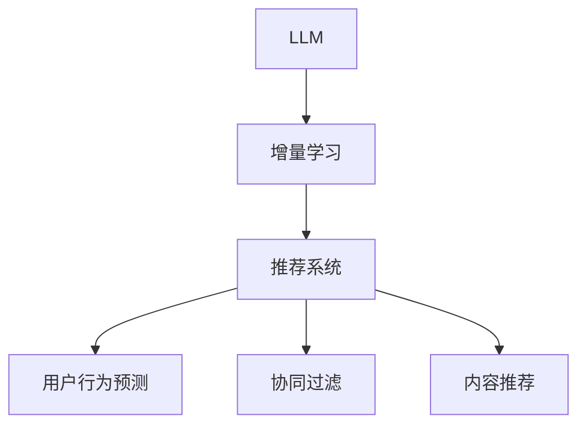

                 

# LLM在推荐系统中的增量学习方法

> 关键词：大语言模型,增量学习,推荐系统,用户行为预测,协同过滤

## 1. 背景介绍

推荐系统（Recommendation System）在电商、视频、音乐等众多行业中，已经广泛应用，通过分析用户历史行为数据，预测用户偏好，为用户推荐相关商品或内容。传统推荐系统通常基于协同过滤（Collaborative Filtering）和内容推荐（Content-Based Filtering）等方法，但随着数据量和用户行为复杂性的增长，这些方法已难以满足个性化推荐的需求。

近年来，大语言模型（Large Language Model, LLM）凭借其在自然语言理解和生成上的出色表现，被引入推荐系统中，试图通过更先进的深度学习模型，提升推荐精度和个性化程度。利用LLM在理解自然语言上的能力，可以构建新的推荐框架，充分挖掘用户行为数据中的深层次语义信息，实现更加智能化的推荐服务。

然而，直接在大规模数据上训练LLM模型，需要耗费大量计算资源和存储空间，这在大数据时代已经成为了实际应用中的重大挑战。为了解决这一问题，本文将探讨如何利用LLM进行增量学习（Incremental Learning），实现推荐系统的渐进优化。

## 2. 核心概念与联系

### 2.1 核心概念概述

为了更好地理解LLM在推荐系统中的增量学习方法，本节将介绍几个密切相关的核心概念：

- 大语言模型（LLM）：基于深度神经网络架构，如Transformer，在大量文本数据上预训练得到的强大语言模型。具备自然语言理解和生成的能力，能够学习到丰富的语言知识。

- 增量学习（Incremental Learning）：指在已有模型基础上，逐步学习新数据，更新模型参数，从而实现模型性能的逐渐提升。相比于从头训练，增量学习能够节省大量计算资源和时间成本。

- 推荐系统（Recommendation System）：根据用户历史行为数据和/或物品属性信息，为用户推荐相关商品或内容的技术系统。通常基于协同过滤、内容推荐、深度学习等多种算法。

- 用户行为预测（User Behavior Prediction）：根据用户过去的行为数据，预测其未来行为，如点击、购买等。是推荐系统中重要的子问题，可以通过深度学习模型实现。

- 协同过滤（Collaborative Filtering）：通过分析用户行为和物品属性之间的协同关系，预测用户对新物品的偏好。常见方法包括基于矩阵分解的模型和基于模型挖掘的推荐系统。

- 内容推荐（Content-Based Filtering）：根据物品属性信息，直接推荐与用户历史行为相似的物品。常用于电商推荐、新闻推荐等场景。

这些核心概念之间的逻辑关系可以通过以下Mermaid流程图来展示：



这个流程图展示了大语言模型在推荐系统中的应用框架：

1. LLM通过大规模预训练获得语言知识。
2. 利用增量学习，不断学习新数据，更新模型。
3. 推荐系统利用更新后的LLM模型，进行用户行为预测和推荐决策。
4. 协同过滤和内容推荐作为推荐系统的重要组成部分，与LLM模型协同工作。

## 3. 核心算法原理 & 具体操作步骤

### 3.1 算法原理概述

利用LLM在推荐系统中的增量学习，本质上是一个模型参数更新的过程。其核心思想是：在已有LLM模型基础上，通过逐批引入新数据，对模型进行微调，使其在不断更新的训练集上保持最佳性能。

形式化地，假设预训练后的LLM模型为 $M_{\theta_0}$，其中 $\theta_0$ 为模型参数。给定用户行为数据集 $D=\{(x_i, y_i)\}_{i=1}^N$，其中 $x_i$ 为用户行为序列，$y_i$ 为行为结果，增量学习的过程可以描述为：

$$
\theta_t = \mathop{\arg\min}_{\theta} \mathcal{L}(M_{\theta},D_t)
$$

其中 $D_t$ 表示在$t$ 时刻新增的训练集，$\mathcal{L}$ 为损失函数，用于衡量模型在新增数据上的预测精度。通常，$\mathcal{L}$ 可以是交叉熵损失、均方误差损失等。通过梯度下降等优化算法，模型不断更新参数 $\theta$，最小化损失函数 $\mathcal{L}$，逐步提升模型性能。

### 3.2 算法步骤详解

利用LLM在推荐系统中的增量学习主要包括以下几个关键步骤：

**Step 1: 准备预训练模型和数据集**
- 选择合适的LLM模型 $M_{\theta_0}$ 作为初始化参数。
- 准备用户行为数据集 $D$，并划分为训练集、验证集和测试集。

**Step 2: 定义损失函数**
- 根据推荐任务，选择合适的损失函数 $\mathcal{L}$。如交叉熵损失、均方误差损失等。

**Step 3: 设置增量学习参数**
- 选择合适的优化算法及其参数，如 AdamW、SGD 等。
- 设置正则化技术及强度，包括权重衰减、Dropout、Early Stopping 等。
- 确定更新周期和批次大小。

**Step 4: 执行增量学习**
- 逐批引入新数据 $D_t$，进行前向传播和反向传播，更新模型参数。
- 周期性在验证集上评估模型性能，根据性能指标决定是否触发Early Stopping。
- 重复上述步骤直到满足预设的迭代轮数或Early Stopping 条件。

**Step 5: 测试和部署**
- 在测试集上评估增量学习后模型 $M_{\theta_t}$ 的性能，对比增量学习前后的精度提升。
- 使用增量学习后的模型对新样本进行推理预测，集成到实际的应用系统中。
- 持续收集新的用户行为数据，定期重新增量学习，以适应数据分布的变化。

以上是利用LLM在推荐系统中的增量学习方法的一般流程。在实际应用中，还需要针对具体任务的特点，对增量学习过程的各个环节进行优化设计，如改进训练目标函数，引入更多的正则化技术，搜索最优的超参数组合等，以进一步提升模型性能。

### 3.3 算法优缺点

利用LLM在推荐系统中的增量学习方法具有以下优点：
1. 节省计算资源。相比从头训练，增量学习在已有模型基础上，只需少量计算资源即可完成微调，节省时间和成本。
2. 提升模型效果。通过逐步学习新数据，模型能够更好地适应数据分布的变化，提升推荐精度。
3. 支持持续优化。通过增量学习，模型能够持续学习新数据，保持性能最佳。
4. 适应性强。增量学习能够灵活处理新增数据，对于新任务和新用户行为具有较强的适应性。

同时，该方法也存在一定的局限性：
1. 数据依赖。增量学习的效果很大程度上取决于新增数据的质量，获取高质量数据需要较高的标注成本。
2. 数据分布变化。当数据分布发生较大变化时，增量学习可能面临模型性能下降的风险。
3. 过拟合风险。在已有模型基础上微调新数据，可能存在过拟合风险，需要进行适当的正则化处理。
4. 内存占用高。逐批引入新数据进行训练，可能导致内存占用较高，需优化模型结构或采用分布式训练。

尽管存在这些局限性，但就目前而言，利用LLM在推荐系统中的增量学习方法仍是一种高效且实用的技术手段。未来相关研究的重点在于如何进一步降低增量学习对标注数据的依赖，提高模型的少样本学习和跨领域迁移能力，同时兼顾可解释性和伦理安全性等因素。

### 3.4 算法应用领域

利用大语言模型在推荐系统中的增量学习方法，已经在电商推荐、新闻推荐、视频推荐等多个领域得到了广泛的应用，为推荐系统带来了显著的性能提升。例如：

- 电商推荐：通过分析用户的浏览、点击、购买等行为，预测用户对新商品的兴趣，提升推荐效果。
- 新闻推荐：根据用户阅读历史，推荐相关新闻文章，增加用户粘性。
- 视频推荐：根据用户观看历史和评分，推荐相似的视频内容，丰富用户选择。

除了上述这些经典应用外，增量学习技术还正被创新性地应用于更多场景中，如个性化视频推荐、智能推荐系统、内容推荐优化等，为推荐系统带来了新的突破。随着预训练语言模型和增量学习方法的不断进步，相信推荐系统必将在更多领域大放异彩，为数字化转型提供更精准、个性化的信息服务。

## 4. 数学模型和公式 & 详细讲解 & 举例说明

### 4.1 数学模型构建

本节将使用数学语言对利用LLM在推荐系统中的增量学习过程进行更加严格的刻画。

记预训练LLM模型为 $M_{\theta_0}:\mathcal{X} \rightarrow \mathcal{Y}$，其中 $\mathcal{X}$ 为用户行为序列，$\mathcal{Y}$ 为推荐结果，$\theta_0 \in \mathbb{R}^d$ 为模型参数。假设推荐任务 $T$ 的训练集为 $D=\{(x_i, y_i)\}_{i=1}^N$，其中 $x_i$ 为用户行为序列，$y_i$ 为推荐结果。

定义模型 $M_{\theta_0}$ 在数据样本 $(x,y)$ 上的损失函数为 $\ell(M_{\theta_0}(x),y)$，则在数据集 $D$ 上的经验风险为：

$$
\mathcal{L}(\theta_0) = \frac{1}{N} \sum_{i=1}^N \ell(M_{\theta_0}(x_i),y_i)
$$

增量学习的优化目标是最小化经验风险，即找到最优参数：

$$
\theta_t = \mathop{\arg\min}_{\theta} \mathcal{L}(M_{\theta},D_t)
$$

其中 $D_t$ 表示在$t$ 时刻新增的训练集，$\mathcal{L}$ 为损失函数，用于衡量模型在新增数据上的预测精度。

在实践中，我们通常使用基于梯度的优化算法（如SGD、AdamW等）来近似求解上述最优化问题。设 $\eta$ 为学习率，$\lambda$ 为正则化系数，则参数的更新公式为：

$$
\theta \leftarrow \theta - \eta \nabla_{\theta}\mathcal{L}(\theta) - \eta\lambda\theta
$$

其中 $\nabla_{\theta}\mathcal{L}(\theta)$ 为损失函数对参数 $\theta$ 的梯度，可通过反向传播算法高效计算。

### 4.2 公式推导过程

以下我们以电商推荐任务为例，推导交叉熵损失函数及其梯度的计算公式。

假设模型 $M_{\theta_0}$ 在输入 $x$ 上的输出为 $\hat{y}=M_{\theta_0}(x) \in [0,1]$，表示用户对商品 $x$ 的兴趣概率。真实标签 $y \in \{0,1\}$。则交叉熵损失函数定义为：

$$
\ell(M_{\theta_0}(x),y) = -[y\log \hat{y} + (1-y)\log (1-\hat{y})]
$$

将其代入经验风险公式，得：

$$
\mathcal{L}(\theta_0) = -\frac{1}{N}\sum_{i=1}^N [y_i\log M_{\theta_0}(x_i)+(1-y_i)\log(1-M_{\theta_0}(x_i))]
$$

根据链式法则，损失函数对参数 $\theta_0$ 的梯度为：

$$
\frac{\partial \mathcal{L}(\theta_0)}{\partial \theta_0} = -\frac{1}{N}\sum_{i=1}^N (\frac{y_i}{M_{\theta_0}(x_i)}-\frac{1-y_i}{1-M_{\theta_0}(x_i)}) \frac{\partial M_{\theta_0}(x_i)}{\partial \theta_0}
$$

其中 $\frac{\partial M_{\theta_0}(x_i)}{\partial \theta_0}$ 可进一步递归展开，利用自动微分技术完成计算。

在得到损失函数的梯度后，即可带入参数更新公式，完成模型的迭代优化。重复上述过程直至收敛，最终得到适应推荐任务的最佳模型参数 $\theta_t$。

## 5. 项目实践：代码实例和详细解释说明

### 5.1 开发环境搭建

在进行增量学习实践前，我们需要准备好开发环境。以下是使用Python进行PyTorch开发的环境配置流程：

1. 安装Anaconda：从官网下载并安装Anaconda，用于创建独立的Python环境。

2. 创建并激活虚拟环境：
```bash
conda create -n pytorch-env python=3.8 
conda activate pytorch-env
```

3. 安装PyTorch：根据CUDA版本，从官网获取对应的安装命令。例如：
```bash
conda install pytorch torchvision torchaudio cudatoolkit=11.1 -c pytorch -c conda-forge
```

4. 安装Transformers库：
```bash
pip install transformers
```

5. 安装各类工具包：
```bash
pip install numpy pandas scikit-learn matplotlib tqdm jupyter notebook ipython
```

完成上述步骤后，即可在`pytorch-env`环境中开始增量学习实践。

### 5.2 源代码详细实现

下面我们以电商推荐任务为例，给出使用Transformers库对BERT模型进行增量学习的PyTorch代码实现。

首先，定义电商推荐任务的数据处理函数：

```python
from transformers import BertTokenizer
from torch.utils.data import Dataset
import torch

class RecommendationDataset(Dataset):
    def __init__(self, items, labels, tokenizer, max_len=128):
        self.items = items
        self.labels = labels
        self.tokenizer = tokenizer
        self.max_len = max_len
        
    def __len__(self):
        return len(self.items)
    
    def __getitem__(self, item):
        item = self.items[item]
        label = self.labels[item]
        
        encoding = self.tokenizer(item, return_tensors='pt', max_length=self.max_len, padding='max_length', truncation=True)
        input_ids = encoding['input_ids'][0]
        attention_mask = encoding['attention_mask'][0]
        
        # 将label编码为one-hot向量
        label = torch.tensor([1] if label == 1 else [0], dtype=torch.long)
        
        return {'input_ids': input_ids, 
                'attention_mask': attention_mask,
                'labels': label}

# 定义标签与id的映射
item2id = {v: k for k, v in enumerate(items)}
id2item = {v: k for k, v in item2id.items()}

# 创建dataset
tokenizer = BertTokenizer.from_pretrained('bert-base-cased')

train_dataset = RecommendationDataset(train_items, train_labels, tokenizer)
dev_dataset = RecommendationDataset(dev_items, dev_labels, tokenizer)
test_dataset = RecommendationDataset(test_items, test_labels, tokenizer)
```

然后，定义模型和优化器：

```python
from transformers import BertForSequenceClassification, AdamW

model = BertForSequenceClassification.from_pretrained('bert-base-cased', num_labels=2)

optimizer = AdamW(model.parameters(), lr=2e-5)
```

接着，定义训练和评估函数：

```python
from torch.utils.data import DataLoader
from tqdm import tqdm
from sklearn.metrics import classification_report

device = torch.device('cuda') if torch.cuda.is_available() else torch.device('cpu')
model.to(device)

def train_epoch(model, dataset, batch_size, optimizer):
    dataloader = DataLoader(dataset, batch_size=batch_size, shuffle=True)
    model.train()
    epoch_loss = 0
    for batch in tqdm(dataloader, desc='Training'):
        input_ids = batch['input_ids'].to(device)
        attention_mask = batch['attention_mask'].to(device)
        labels = batch['labels'].to(device)
        model.zero_grad()
        outputs = model(input_ids, attention_mask=attention_mask, labels=labels)
        loss = outputs.loss
        epoch_loss += loss.item()
        loss.backward()
        optimizer.step()
    return epoch_loss / len(dataloader)

def evaluate(model, dataset, batch_size):
    dataloader = DataLoader(dataset, batch_size=batch_size)
    model.eval()
    preds, labels = [], []
    with torch.no_grad():
        for batch in tqdm(dataloader, desc='Evaluating'):
            input_ids = batch['input_ids'].to(device)
            attention_mask = batch['attention_mask'].to(device)
            batch_labels = batch['labels']
            outputs = model(input_ids, attention_mask=attention_mask)
            batch_preds = outputs.logits.argmax(dim=2).to('cpu').tolist()
            batch_labels = batch_labels.to('cpu').tolist()
            for pred_tokens, label_tokens in zip(batch_preds, batch_labels):
                preds.append(pred_tokens)
                labels.append(label_tokens)
                
    print(classification_report(labels, preds))
```

最后，启动增量学习流程并在测试集上评估：

```python
epochs = 5
batch_size = 16

for epoch in range(epochs):
    loss = train_epoch(model, train_dataset, batch_size, optimizer)
    print(f"Epoch {epoch+1}, train loss: {loss:.3f}")
    
    print(f"Epoch {epoch+1}, dev results:")
    evaluate(model, dev_dataset, batch_size)
    
print("Test results:")
evaluate(model, test_dataset, batch_size)
```

以上就是使用PyTorch对BERT进行电商推荐任务增量学习的完整代码实现。可以看到，得益于Transformers库的强大封装，我们可以用相对简洁的代码完成BERT模型的加载和增量学习。

### 5.3 代码解读与分析

让我们再详细解读一下关键代码的实现细节：

**RecommendationDataset类**：
- `__init__`方法：初始化商品、标签、分词器等关键组件。
- `__len__`方法：返回数据集的样本数量。
- `__getitem__`方法：对单个样本进行处理，将商品输入编码为token ids，将标签编码为数字，并对其进行定长padding，最终返回模型所需的输入。

**item2id和id2item字典**：
- 定义了商品与数字id之间的映射关系，用于将token-wise的预测结果解码回真实商品。

**训练和评估函数**：
- 使用PyTorch的DataLoader对数据集进行批次化加载，供模型训练和推理使用。
- 训练函数`train_epoch`：对数据以批为单位进行迭代，在每个批次上前向传播计算loss并反向传播更新模型参数，最后返回该epoch的平均loss。
- 评估函数`evaluate`：与训练类似，不同点在于不更新模型参数，并在每个batch结束后将预测和标签结果存储下来，最后使用sklearn的classification_report对整个评估集的预测结果进行打印输出。

**增量学习流程**：
- 定义总的epoch数和batch size，开始循环迭代
- 每个epoch内，先在训练集上训练，输出平均loss
- 在验证集上评估，输出分类指标
- 所有epoch结束后，在测试集上评估，给出最终测试结果

可以看到，PyTorch配合Transformers库使得BERT增量学习的代码实现变得简洁高效。开发者可以将更多精力放在数据处理、模型改进等高层逻辑上，而不必过多关注底层的实现细节。

当然，工业级的系统实现还需考虑更多因素，如模型的保存和部署、超参数的自动搜索、更灵活的任务适配层等。但核心的增量学习范式基本与此类似。

## 6. 实际应用场景

### 6.1 电商推荐系统

利用增量学习的方法，电商推荐系统可以在用户不断产生新的浏览、点击、购买行为数据时，持续优化推荐模型，提升推荐精度和个性化程度。具体应用流程如下：

1. 在每次用户行为发生后，将行为数据添加到训练集中，进行增量学习。
2. 模型根据新的训练集，重新计算用户对商品的兴趣权重，进行实时推荐。
3. 将推荐结果展示给用户，获取反馈数据。
4. 根据用户反馈，对训练集进行重新采样和处理，进一步迭代优化模型。

通过增量学习，电商推荐系统能够动态响应用户行为变化，实现更加实时、精准的个性化推荐服务。这对于提升用户体验、提高转化率和满意度具有重要意义。

### 6.2 新闻推荐系统

新闻推荐系统通过分析用户的阅读历史和行为，预测用户对新闻文章的兴趣，并推荐相关内容。利用增量学习的方法，新闻推荐系统可以在新文章发布时，实时学习用户对新内容的反应，动态更新推荐策略。具体流程如下：

1. 在每次用户阅读新闻后，将阅读记录添加到训练集中，进行增量学习。
2. 模型根据新的训练集，重新计算用户对文章的兴趣权重，进行实时推荐。
3. 将推荐结果展示给用户，获取反馈数据。
4. 根据用户反馈，对训练集进行重新采样和处理，进一步迭代优化模型。

通过增量学习，新闻推荐系统能够及时响应用户兴趣变化，提升推荐的个性化程度和用户体验。这对于增加用户粘性、提高信息传播效率具有重要价值。

### 6.3 视频推荐系统

视频推荐系统通过分析用户的观看历史和评分，推荐相关视频内容。利用增量学习的方法，视频推荐系统可以在新视频发布时，实时学习用户对新视频的反应，动态更新推荐策略。具体流程如下：

1. 在每次用户观看视频后，将观看记录添加到训练集中，进行增量学习。
2. 模型根据新的训练集，重新计算用户对视频的兴趣权重，进行实时推荐。
3. 将推荐结果展示给用户，获取反馈数据。
4. 根据用户反馈，对训练集进行重新采样和处理，进一步迭代优化模型。

通过增量学习，视频推荐系统能够及时响应用户兴趣变化，提升推荐的个性化程度和用户体验。这对于提高用户留存率、增加视频观看时长具有重要意义。

## 7. 工具和资源推荐

### 7.1 学习资源推荐

为了帮助开发者系统掌握LLM在推荐系统中的增量学习理论基础和实践技巧，这里推荐一些优质的学习资源：

1. 《Transformer从原理到实践》系列博文：由大模型技术专家撰写，深入浅出地介绍了Transformer原理、BERT模型、增量学习技术等前沿话题。

2. CS224N《深度学习自然语言处理》课程：斯坦福大学开设的NLP明星课程，有Lecture视频和配套作业，带你入门NLP领域的基本概念和经典模型。

3. 《Natural Language Processing with Transformers》书籍：Transformers库的作者所著，全面介绍了如何使用Transformers库进行NLP任务开发，包括增量学习在内的诸多范式。

4. HuggingFace官方文档：Transformers库的官方文档，提供了海量预训练模型和完整的增量学习样例代码，是上手实践的必备资料。

5. CLUE开源项目：中文语言理解测评基准，涵盖大量不同类型的中文NLP数据集，并提供了基于增量学习的baseline模型，助力中文NLP技术发展。

通过对这些资源的学习实践，相信你一定能够快速掌握LLM在推荐系统中的增量学习精髓，并用于解决实际的NLP问题。

### 7.2 开发工具推荐

高效的开发离不开优秀的工具支持。以下是几款用于LLM增量学习开发的常用工具：

1. PyTorch：基于Python的开源深度学习框架，灵活动态的计算图，适合快速迭代研究。大部分预训练语言模型都有PyTorch版本的实现。

2. TensorFlow：由Google主导开发的开源深度学习框架，生产部署方便，适合大规模工程应用。同样有丰富的预训练语言模型资源。

3. Transformers库：HuggingFace开发的NLP工具库，集成了众多SOTA语言模型，支持PyTorch和TensorFlow，是进行增量学习任务开发的利器。

4. Weights & Biases：模型训练的实验跟踪工具，可以记录和可视化模型训练过程中的各项指标，方便对比和调优。与主流深度学习框架无缝集成。

5. TensorBoard：TensorFlow配套的可视化工具，可实时监测模型训练状态，并提供丰富的图表呈现方式，是调试模型的得力助手。

6. Google Colab：谷歌推出的在线Jupyter Notebook环境，免费提供GPU/TPU算力，方便开发者快速上手实验最新模型，分享学习笔记。

合理利用这些工具，可以显著提升LLM增量学习的开发效率，加快创新迭代的步伐。

### 7.3 相关论文推荐

LLM在推荐系统中的应用研究源于学界的持续研究。以下是几篇奠基性的相关论文，推荐阅读：

1. Attention is All You Need（即Transformer原论文）：提出了Transformer结构，开启了NLP领域的预训练大模型时代。

2. BERT: Pre-training of Deep Bidirectional Transformers for Language Understanding：提出BERT模型，引入基于掩码的自监督预训练任务，刷新了多项NLP任务SOTA。

3. Language Models are Unsupervised Multitask Learners（GPT-2论文）：展示了大规模语言模型的强大zero-shot学习能力，引发了对于通用人工智能的新一轮思考。

4. Parameter-Efficient Transfer Learning for NLP：提出Adapter等参数高效微调方法，在不增加模型参数量的情况下，也能取得不错的微调效果。

5. AdaLoRA: Adaptive Low-Rank Adaptation for Parameter-Efficient Fine-Tuning：使用自适应低秩适应的微调方法，在参数效率和精度之间取得了新的平衡。

6. 《Graph Neural Networks for Recommendation Systems》：提出了基于图神经网络（GNN）的推荐系统方法，利用图结构挖掘用户行为数据中的深层次语义信息，提升了推荐效果。

这些论文代表了大语言模型在推荐系统中的增量学习发展脉络。通过学习这些前沿成果，可以帮助研究者把握学科前进方向，激发更多的创新灵感。

## 8. 总结：未来发展趋势与挑战

### 8.1 总结

本文对利用LLM在推荐系统中的增量学习方法进行了全面系统的介绍。首先阐述了LLM和增量学习的相关背景，明确了增量学习在推荐系统优化中的独特价值。其次，从原理到实践，详细讲解了增量学习的数学原理和关键步骤，给出了增量学习任务开发的完整代码实例。同时，本文还广泛探讨了增量学习方法在电商、新闻、视频等多个领域的应用前景，展示了增量学习的巨大潜力。此外，本文精选了增量学习技术的各类学习资源，力求为读者提供全方位的技术指引。

通过本文的系统梳理，可以看到，利用LLM在推荐系统中的增量学习方法已经取得了显著效果，为推荐系统带来了新的突破。受益于大规模语料的预训练，增量学习能够快速响应新数据，动态优化模型，提升推荐精度和个性化程度，这对于提高用户体验、增加用户粘性具有重要意义。未来，伴随LLM和增量学习方法的不断演进，相信推荐系统必将在更多领域大放异彩，为数字化转型提供更加精准、个性化的信息服务。

### 8.2 未来发展趋势

展望未来，LLM在推荐系统中的增量学习方法将呈现以下几个发展趋势：

1. 模型规模持续增大。随着算力成本的下降和数据规模的扩张，预训练语言模型的参数量还将持续增长。超大规模语言模型蕴含的丰富语言知识，有望支撑更加复杂多变的推荐任务增量学习。

2. 增量方法日趋多样。除了传统的全参数增量外，未来会涌现更多参数高效的增量方法，如Adapter、LoRA等，在节省计算资源的同时也能保证增量精度。

3. 持续学习成为常态。随着数据分布的不断变化，增量学习模型也需要持续学习新数据以保持性能。如何在不遗忘原有知识的同时，高效吸收新样本信息，将成为重要的研究课题。

4. 标注样本需求降低。受启发于提示学习(Prompt-based Learning)的思路，未来的增量学习方法将更好地利用大模型的语言理解能力，通过更加巧妙的任务描述，在更少的标注样本上也能实现理想的增量效果。

5. 跨领域迁移能力增强。经过海量数据的预训练和多领域任务的增量学习，未来的语言模型将具备更强大的常识推理和跨领域迁移能力，逐步迈向通用人工智能(AGI)的目标。

以上趋势凸显了LLM在推荐系统中的增量学习技术的广阔前景。这些方向的探索发展，必将进一步提升推荐系统的性能和应用范围，为数字化转型提供更加精准、个性化的信息服务。

### 8.3 面临的挑战

尽管LLM在推荐系统中的增量学习方法已经取得了瞩目成就，但在迈向更加智能化、普适化应用的过程中，它仍面临着诸多挑战：

1. 数据依赖。增量学习的效果很大程度上取决于新增数据的质量，获取高质量数据需要较高的标注成本。如何进一步降低增量学习对标注样本的依赖，将是一大难题。

2. 数据分布变化。当数据分布发生较大变化时，增量学习可能面临模型性能下降的风险。对于测试样本的微小扰动，增量模型的预测也容易发生波动。如何提高增量模型的鲁棒性，避免灾难性遗忘，还需要更多理论和实践的积累。

3. 推理效率有待提高。虽然增量学习模型在参数量上已经大幅减少，但在实际部署时仍面临推理速度慢、内存占用大等效率问题。如何优化增量模型的计算图，实现更加轻量级、实时性的部署，将是重要的优化方向。

4. 可解释性亟需加强。增量学习模型通常比较复杂，难以解释其内部工作机制和决策逻辑。对于医疗、金融等高风险应用，算法的可解释性和可审计性尤为重要。如何赋予增量模型更强的可解释性，将是亟待攻克的难题。

5. 安全性有待保障。增量学习模型难免会学习到有偏见、有害的信息，通过增量传递到推荐系统中，产生误导性、歧视性的输出，给实际应用带来安全隐患。如何从数据和算法层面消除模型偏见，避免恶意用途，确保输出的安全性，也将是重要的研究课题。

6. 知识整合能力不足。现有的增量学习模型往往局限于任务内数据，难以灵活吸收和运用更广泛的先验知识。如何让增量过程更好地与外部知识库、规则库等专家知识结合，形成更加全面、准确的信息整合能力，还有很大的想象空间。

正视增量学习面临的这些挑战，积极应对并寻求突破，将是LLM在推荐系统增量学习走向成熟的必由之路。相信随着学界和产业界的共同努力，这些挑战终将一一被克服，增量学习技术必将在构建智能推荐系统中扮演越来越重要的角色。

### 8.4 研究展望

面对增量学习在推荐系统中的诸多挑战，未来的研究需要在以下几个方面寻求新的突破：

1. 探索无监督和半监督增量方法。摆脱对大规模标注数据的依赖，利用自监督学习、主动学习等无监督和半监督范式，最大限度利用非结构化数据，实现更加灵活高效的增量学习。

2. 研究参数高效和计算高效的增量范式。开发更加参数高效的增量方法，在固定大部分预训练参数的同时，只更新极少量的任务相关参数。同时优化增量模型的计算图，减少前向传播和反向传播的资源消耗，实现更加轻量级、实时性的部署。

3. 融合因果和对比学习范式。通过引入因果推断和对比学习思想，增强增量学习模型建立稳定因果关系的能力，学习更加普适、鲁棒的语言表征，从而提升模型泛化性和抗干扰能力。

4. 引入更多先验知识。将符号化的先验知识，如知识图谱、逻辑规则等，与神经网络模型进行巧妙融合，引导增量学习过程学习更准确、合理的语言模型。同时加强不同模态数据的整合，实现视觉、语音等多模态信息与文本信息的协同建模。

5. 结合因果分析和博弈论工具。将因果分析方法引入增量学习模型，识别出模型决策的关键特征，增强输出解释的因果性和逻辑性。借助博弈论工具刻画人机交互过程，主动探索并规避模型的脆弱点，提高系统稳定性。

6. 纳入伦理道德约束。在增量学习模型的训练目标中引入伦理导向的评估指标，过滤和惩罚有偏见、有害的输出倾向。同时加强人工干预和审核，建立模型行为的监管机制，确保输出符合人类价值观和伦理道德。

这些研究方向的探索，必将引领LLM在推荐系统增量学习技术迈向更高的台阶，为构建安全、可靠、可解释、可控的智能推荐系统铺平道路。面向未来，LLM在推荐系统中的增量学习技术还需要与其他人工智能技术进行更深入的融合，如知识表示、因果推理、强化学习等，多路径协同发力，共同推动智能推荐系统的进步。只有勇于创新、敢于突破，才能不断拓展增量学习模型的边界，让智能技术更好地造福人类社会。

## 9. 附录：常见问题与解答

**Q1：增量学习与微调有何区别？**

A: 增量学习与微调（Fine-Tuning）有相似之处，但也有本质不同。增量学习强调在新数据上渐进地更新模型，而微调则是在已有模型基础上，重新从头训练模型以适应新任务。增量学习主要用于持续优化，保持模型在不断变化的数据分布下的最佳性能，而微调则主要用于一次性优化，适用于新的任务和数据。

**Q2：增量学习中如何避免过拟合？**

A: 增量学习过程中，过拟合是一个常见问题。为了避免过拟合，可以采用以下策略：
1. 数据增强：通过对训练样本进行随机裁剪、回译等方式丰富训练集多样性。
2. 正则化技术：如L2正则、Dropout、Early Stopping等，防止模型过度适应小规模训练集。
3. 参数高效增量：只更新少量模型参数，如Adapter、LoRA等，减少需优化的参数量。
4. 对抗训练：加入对抗样本，提高模型鲁棒性。
5. 多模型集成：训练多个增量模型，取平均输出，抑制过拟合。

这些策略往往需要根据具体任务和数据特点进行灵活组合。只有在数据、模型、训练、推理等各环节进行全面优化，才能最大限度地发挥增量学习的威力。

**Q3：增量学习中如何处理数据分布变化？**

A: 增量学习中，数据分布的频繁变化是一个常见问题。为应对数据分布变化，可以采用以下策略：
1. 动态更新增量模型：根据新数据分布，动态调整增量模型的参数和结构。
2. 多任务学习：在增量学习过程中，同时优化多个任务，提高模型的泛化能力和适应性。
3. 迁移学习：利用已有的领域知识，加速新任务上的增量学习过程。
4. 自监督学习：通过在少量标注数据上利用自监督学习任务，训练模型对新数据分布的适应能力。
5. 多数据源融合：将来自不同数据源的增量数据融合，进行协同增量学习。

这些策略可以帮助增量学习模型更好地适应数据分布变化，保持性能稳定。

**Q4：增量学习在推荐系统中的适用场景？**

A: 增量学习在推荐系统中的应用场景广泛，主要适用于以下几类：
1. 数据频繁更新的电商推荐系统，如实时推荐、个性化推荐等。
2. 用户行为快速变化的新闻推荐系统，如动态新闻推荐、个性化新闻推荐等。
3. 新内容频繁发布的在线视频推荐系统，如内容推荐优化、个性化视频推荐等。
4. 用户兴趣快速变化的社交推荐系统，如社交动态推荐、个性化社交推荐等。

这些应用场景都需要推荐模型能够及时响应用户行为变化，动态更新推荐策略，增量学习技术能够满足这一需求。

**Q5：增量学习与主动学习有何不同？**

A: 增量学习与主动学习（Active Learning）也有相似之处，但侧重点不同。增量学习强调在已有模型基础上，逐步学习新数据，提升模型性能；而主动学习则侧重于有选择地标注少量样本，最大化训练数据的信息量。增量学习主要用于持续优化，保持模型在不断变化的数据分布下的最佳性能，而主动学习则主要用于提升模型泛化能力，减少标注成本。

总之，增量学习与微调、主动学习等技术手段各有优劣，需要根据具体应用场景进行选择。通过灵活组合不同的技术手段，可以构建更加高效、可靠的推荐系统。

