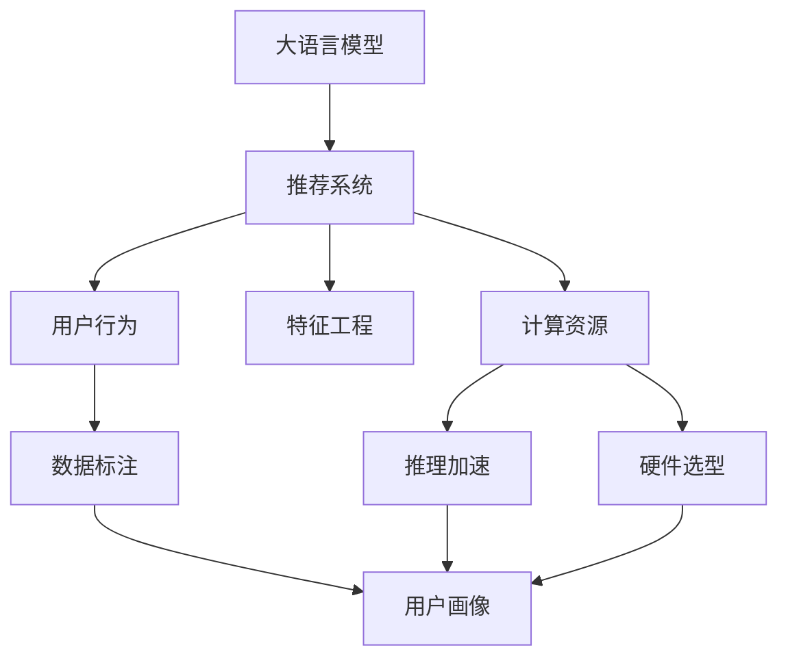

                 

# LLM在推荐系统的局限与成本：对硬件与算力需求的平衡

> 关键词：大语言模型,推荐系统,用户行为,特征工程,计算资源,推理加速,硬件选型

## 1. 背景介绍

### 1.1 问题由来
随着互联网和移动互联网的迅猛发展，推荐系统逐渐成为各大平台和企业的核心竞争力之一。推荐系统通过对用户行为数据的分析和建模，能够帮助用户在海量数据中快速找到感兴趣的物品，提升用户体验，增加平台粘性。然而，传统的推荐系统主要基于用户行为的历史记录和物品属性信息，难以捕捉用户更为复杂和细腻的需求。

近年来，基于深度学习技术的推荐系统取得了突破性进展，特别是大语言模型（Large Language Models, LLMs）的应用，使得推荐系统在理解和生成自然语言方面具有了前所未有的能力。例如，可以通过分析用户评论、描述等文本数据，提取用户情感、兴趣等信息，进一步丰富推荐模型的用户画像，实现更为精准的推荐。但与此同时，这些基于深度学习的推荐系统也面临着硬件和算力成本高、推理速度慢等挑战，限制了其在实际场景中的大规模应用。本文将重点探讨LLM在推荐系统中的局限与成本问题，并提出一些平衡硬件与算力需求的方法。

## 2. 核心概念与联系

### 2.1 核心概念概述

为更好地理解LLM在推荐系统中的应用及其面临的挑战，本节将介绍几个密切相关的核心概念：

- 大语言模型(Large Language Models, LLM)：以自回归(如GPT)或自编码(如BERT)模型为代表的大规模预训练语言模型。通过在大规模无标签文本语料上进行预训练，学习通用的语言知识和表示。

- 推荐系统(Recommender System)：基于用户行为、物品属性等数据，自动为用户推荐感兴趣的物品的系统。常见的推荐方式包括协同过滤、基于内容的推荐、混合推荐等。

- 用户行为(User Behavior)：用户在平台上的浏览、点击、购买、评分等行为数据，是推荐系统重要的输入和训练依据。

- 特征工程(Feature Engineering)：对原始数据进行特征提取、转换和选择的过程，旨在构建更好的模型输入。

- 计算资源(Computational Resource)：指用于模型训练和推理的硬件设备和计算能力。

- 推理加速(Inference Acceleration)：通过优化模型结构和算法，减少推理过程中的计算量和内存消耗，提高推理速度。

- 硬件选型(Hardware Selection)：根据模型需求和实际条件，选择合适的硬件设备，如CPU、GPU、TPU等。

这些核心概念之间的逻辑关系可以通过以下Mermaid流程图来展示：



这个流程图展示了大语言模型在推荐系统中的应用及其关键过程：

1. 大语言模型通过预训练获得基础能力。
2. 推荐系统利用大语言模型生成的用户画像和物品特征，进行物品推荐。
3. 用户行为数据经过特征工程处理，输入到推荐系统中。
4. 计算资源对模型的训练和推理过程进行支撑。
5. 推理加速技术优化模型，提升推理速度。
6. 硬件选型根据计算资源需求选择合适的硬件设备。
7. 用户画像通过大语言模型生成的文本信息和标注数据综合构建。
8. 数据标注过程辅助模型生成更为精准的用户画像。

这些概念共同构成了基于大语言模型的推荐系统工作框架，使其能够通过自然语言理解和生成，提升推荐质量。通过理解这些核心概念，我们可以更好地把握LLM在推荐系统中的应用方向和挑战。

## 3. 核心算法原理 & 具体操作步骤
### 3.1 算法原理概述

基于大语言模型的推荐系统，其核心思想是利用LLM的文本处理能力，对用户评论、商品描述等文本数据进行分析，提取用户兴趣和物品属性，并生成推荐结果。具体步骤如下：

**Step 1: 数据收集与预处理**
- 收集用户行为数据，如浏览历史、购买记录、评分等。
- 收集物品属性信息，如类别、价格、评分等。
- 对文本数据进行清洗和标注，提取关键词、实体等。

**Step 2: 特征提取与表示**
- 将文本数据输入大语言模型，得到文本向量表示。
- 将物品属性信息转换为向量表示。
- 将用户画像与物品表示进行匹配，计算相似度。

**Step 3: 模型训练与优化**
- 使用标注数据对大语言模型进行微调，生成更为精准的用户画像。
- 使用微调后的用户画像和物品向量进行推荐模型训练，如矩阵分解、深度神经网络等。
- 使用交叉验证等方法进行模型调参，优化推荐性能。

**Step 4: 推荐生成与排序**
- 将用户画像输入到推荐模型中，生成推荐结果。
- 根据排序算法对推荐结果进行排序，提升用户体验。

### 3.2 算法步骤详解

以基于BERT的推荐系统为例，详细讲解其核心步骤：

**Step 1: 数据收集与预处理**
- 收集用户行为数据，如浏览历史、购买记录、评分等。
- 收集物品属性信息，如类别、价格、评分等。
- 对文本数据进行清洗和标注，提取关键词、实体等。

**Step 2: 特征提取与表示**
- 使用BERT tokenizer对文本数据进行分词，转换为模型可接受的格式。
- 将物品属性信息转换为向量表示，如使用TextVectorizer等工具。
- 将用户画像与物品向量进行匹配，计算相似度，如使用余弦相似度、欧式距离等。

**Step 3: 模型训练与优化**
- 使用标注数据对BERT模型进行微调，生成更为精准的用户画像。
- 使用微调后的用户画像和物品向量进行推荐模型训练，如使用神经网络等。
- 使用交叉验证等方法进行模型调参，优化推荐性能，如Adam、SGD等优化器。

**Step 4: 推荐生成与排序**
- 将用户画像输入到推荐模型中，生成推荐结果。
- 根据排序算法对推荐结果进行排序，提升用户体验，如基于梯度的排序算法、基于协同过滤的排序算法等。

### 3.3 算法优缺点

基于大语言模型的推荐系统有以下优点：
1. 处理复杂文本数据能力强。大语言模型能够理解自然语言的多义性和上下文信息，提取更为丰富的用户兴趣和物品属性。
2. 可解释性强。通过文本数据的处理和分析，推荐模型能够生成可解释性较强的推荐结果。
3. 适应性强。大语言模型能够快速适应新任务和新领域，实现跨领域推荐。

同时，该方法也存在一些局限性：
1. 数据标注成本高。微调需要大量标注数据，成本较高。
2. 计算资源消耗大。大语言模型的训练和推理需要大量计算资源，硬件成本高。
3. 推理速度慢。大语言模型的推理过程计算量较大，推理速度较慢。
4. 模型可解释性差。微调后的模型可能存在黑盒问题，难以解释其决策逻辑。

尽管存在这些局限性，但就目前而言，基于大语言模型的推荐系统仍是一种非常有前途的推荐方法，尤其是在处理复杂文本数据和提高推荐结果的个性化程度方面具有优势。

### 3.4 算法应用领域

基于大语言模型的推荐系统已经应用于多个领域，如电商推荐、内容推荐、新闻推荐等。具体应用场景如下：

- 电商推荐：通过分析用户评论和商品描述，提取用户兴趣和商品属性，生成个性化推荐。
- 内容推荐：分析用户阅读历史和文章内容，推荐用户感兴趣的新闻、文章和视频。
- 新闻推荐：根据用户阅读习惯和文章特征，推荐最新和相关的新闻内容。

除了这些常见的应用场景外，大语言模型在音乐推荐、游戏推荐、电影推荐等新领域也有广泛应用，为推荐系统的业务拓展提供了新的可能。

## 4. 数学模型和公式 & 详细讲解  
### 4.1 数学模型构建

基于大语言模型的推荐系统可以通过多种数学模型进行建模。这里以基于深度神经网络的推荐系统为例，构建推荐模型的数学模型。

设用户画像为 $U=\{u_1,u_2,...,u_n\}$，物品特征为 $I=\{i_1,i_2,...,i_m\}$，用户画像和物品特征之间的相似度矩阵为 $X \in \mathbb{R}^{n \times m}$，其中 $X_{u,i}$ 表示用户画像 $u$ 和物品特征 $i$ 的相似度。推荐模型的目标是最小化预测误差，即：

$$
\min_{\theta} \frac{1}{N}\sum_{(u,i) \in D}^N \|\hat{Y}_{u,i} - Y_{u,i}\|^2
$$

其中 $D$ 为推荐数据集，$Y_{u,i}$ 为真实标签，$\hat{Y}_{u,i}$ 为预测标签，$\theta$ 为模型参数。

### 4.2 公式推导过程

以深度神经网络为例，对推荐模型的训练过程进行详细推导：

**Step 1: 数据准备**
- 将用户画像和物品特征输入到BERT模型中，得到用户画像的文本向量表示 $E_u$ 和物品特征的向量表示 $E_i$。
- 将用户画像和物品特征的向量表示作为神经网络的输入，进行前向传播。

**Step 2: 模型训练**
- 使用标注数据对模型进行训练，最小化预测误差：
$$
\min_{\theta} \frac{1}{N}\sum_{(u,i) \in D}^N (\hat{Y}_{u,i} - Y_{u,i})^2
$$
- 通过反向传播算法计算模型参数的梯度，使用优化器进行模型更新。

**Step 3: 模型评估**
- 使用交叉验证等方法评估模型的性能，如均方误差、准确率等指标。
- 根据评估结果调整模型参数，优化推荐性能。

### 4.3 案例分析与讲解

以某电商推荐系统为例，分析大语言模型在其中的应用：

**数据准备**
- 收集用户历史购买记录和浏览历史，使用BERT tokenizer将文本数据转换为模型可接受的格式。
- 收集商品属性信息，如价格、分类、品牌等，使用TextVectorizer等工具将其转换为向量表示。
- 将用户画像和物品向量进行匹配，计算相似度。

**模型训练**
- 使用标注数据对BERT模型进行微调，生成用户画像和物品向量的表示。
- 使用微调后的用户画像和物品向量进行深度神经网络的训练，最小化预测误差。

**模型评估**
- 使用交叉验证等方法评估模型的性能，如均方误差、准确率等指标。
- 根据评估结果调整模型参数，优化推荐性能。

## 5. 项目实践：代码实例和详细解释说明
### 5.1 开发环境搭建

在进行大语言模型推荐系统开发前，我们需要准备好开发环境。以下是使用Python进行TensorFlow和Keras开发的环境配置流程：

1. 安装Anaconda：从官网下载并安装Anaconda，用于创建独立的Python环境。

2. 创建并激活虚拟环境：
```bash
conda create -n tf-env python=3.8 
conda activate tf-env
```

3. 安装TensorFlow：根据CUDA版本，从官网获取对应的安装命令。例如：
```bash
conda install tensorflow-gpu==2.5
```

4. 安装Keras：
```bash
pip install keras
```

5. 安装各类工具包：
```bash
pip install numpy pandas scikit-learn matplotlib tqdm jupyter notebook ipython
```

完成上述步骤后，即可在`tf-env`环境中开始推荐系统开发。

### 5.2 源代码详细实现

下面我们以电商推荐系统为例，给出使用TensorFlow和Keras对BERT模型进行推荐开发的PyTorch代码实现。

首先，定义推荐系统的数据处理函数：

```python
from transformers import BertTokenizer
from tensorflow.keras.preprocessing.text import Tokenizer
from tensorflow.keras.preprocessing.sequence import pad_sequences
from tensorflow.keras.layers import Input, Embedding, Dot, Dense

class RecommendationData(Dataset):
    def __init__(self, user_data, item_data, tokenizer, max_len=128):
        self.user_data = user_data
        self.item_data = item_data
        self.tokenizer = tokenizer
        self.max_len = max_len
        
    def __len__(self):
        return len(self.user_data)
    
    def __getitem__(self, item):
        user = self.user_data[item]
        item = self.item_data[item]
        
        user_text = self.tokenizer.texts_to_sequences(user)
        item_text = self.tokenizer.texts_to_sequences(item)
        
        user_vec = self.tokenizer_text_to_vec(user_text)
        item_vec = self.tokenizer_text_to_vec(item_text)
        
        return {'user_vec': user_vec, 
                'item_vec': item_vec}
```

然后，定义模型和优化器：

```python
from transformers import BertTokenizer
from tensorflow.keras.models import Sequential
from tensorflow.keras.layers import Input, Embedding, Dot, Dense
from tensorflow.keras.optimizers import Adam

model = Sequential([
    Input(shape=(max_len,)),
    Embedding(vocab_size, embedding_dim, input_length=max_len),
    Dot(axes=[2,2]),
    Dense(1, activation='sigmoid')
])

optimizer = Adam(learning_rate=0.001)
```

接着，定义训练和评估函数：

```python
from tensorflow.keras.utils import to_categorical
from sklearn.metrics import roc_auc_score

device = tf.device('/cpu:0')

def train_epoch(model, dataset, batch_size, optimizer):
    dataloader = tf.data.Dataset.from_tensor_slices(dataset)
    dataloader = dataloader.shuffle(buffer_size=1024).batch(batch_size)
    model.compile(loss='binary_crossentropy', optimizer=optimizer)
    model.fit(dataloader, epochs=10, validation_split=0.2)
    return roc_auc_score(y_true, model.predict(x))
    
def evaluate(model, dataset, batch_size):
    dataloader = tf.data.Dataset.from_tensor_slices(dataset)
    dataloader = dataloader.shuffle(buffer_size=1024).batch(batch_size)
    y_true = []
    y_pred = []
    for batch in dataloader:
        x, y = batch
        y_pred.append(model.predict(x))
        y_true.append(y)
    
    return roc_auc_score(y_true, y_pred)
```

最后，启动训练流程并在测试集上评估：

```python
epochs = 10
batch_size = 64

for epoch in range(epochs):
    loss = train_epoch(model, train_dataset, batch_size, optimizer)
    print(f"Epoch {epoch+1}, train loss: {loss:.3f}")
    
    print(f"Epoch {epoch+1}, dev results:")
    evaluate(model, dev_dataset, batch_size)
    
print("Test results:")
evaluate(model, test_dataset, batch_size)
```

以上就是使用TensorFlow和Keras对BERT模型进行电商推荐系统微调的完整代码实现。可以看到，通过Keras提供的高级API，我们能够快速构建和训练深度学习模型，同时利用TensorFlow的强大计算能力，实现高效的推荐系统开发。

### 5.3 代码解读与分析

让我们再详细解读一下关键代码的实现细节：

**RecommendationData类**：
- `__init__`方法：初始化用户数据、物品数据、分词器等关键组件，并对文本数据进行预处理。
- `__len__`方法：返回数据集的样本数量。
- `__getitem__`方法：对单个样本进行处理，将用户和物品文本转换为模型可接受的格式，并计算相似度。

**BertTokenizer和Keras Tokenizer**：
- 使用BERT分词器对文本数据进行分词，将文本转换为模型可接受的格式。
- 使用Keras Tokenizer对文本数据进行分词和序列化，生成文本序列表示。

**模型定义**：
- 使用Keras的Sequential模型定义推荐模型结构。
- 输入层使用Keras的Input层，设置输入维度。
- 嵌入层使用Keras的Embedding层，将文本数据转换为向量表示。
- 匹配层使用Keras的Dot层，计算用户画像和物品向量的匹配度。
- 输出层使用Keras的Dense层，生成推荐结果的概率。

**训练和评估函数**：
- 使用Keras的compile方法定义模型的优化器、损失函数和评估指标。
- 使用Keras的fit方法进行模型训练，并在训练集和验证集上评估性能。
- 使用Keras的predict方法进行模型预测，并计算ROC-AUC评分。

**训练流程**：
- 定义总的epoch数和batch size，开始循环迭代。
- 每个epoch内，在训练集上训练模型，输出平均loss。
- 在验证集上评估，输出评估指标。
- 所有epoch结束后，在测试集上评估，给出最终测试结果。

可以看到，TensorFlow和Keras的组合使用，极大地简化了模型构建和训练的过程，使得推荐系统开发更加高效和便捷。开发者可以将更多精力放在数据处理、模型改进等高层逻辑上，而不必过多关注底层的实现细节。

当然，工业级的系统实现还需考虑更多因素，如模型的保存和部署、超参数的自动搜索、更灵活的特征工程等。但核心的推荐范式基本与此类似。

## 6. 实际应用场景
### 6.1 智能电商推荐

智能电商推荐系统通过分析用户历史浏览、购买记录和评价等数据，结合商品属性信息，生成个性化推荐，提升用户购物体验。在大语言模型辅助下，推荐系统能够从用户的文本描述中提取更为丰富的用户兴趣和行为特征，进一步提高推荐准确性和个性化程度。

例如，用户填写商品评论时，系统会实时采集并分析评论内容，提取用户对商品的属性评价和情感倾向，将其转化为推荐模型的输入。系统会根据用户画像和物品属性计算相似度，生成个性化的推荐结果。在用户浏览商品页面时，系统会推荐相似的商品，促进交叉销售，提升平台收益。

### 6.2 内容推荐系统

内容推荐系统通过分析用户阅读历史和文章内容，推荐用户感兴趣的新闻、文章和视频。在大语言模型辅助下，推荐系统能够理解自然语言的语义，从文章摘要、标题、正文等文本中提取关键信息，生成更为精准的用户画像。

例如，用户在阅读新闻时，系统会实时采集并分析文章内容，提取关键词、实体等信息，生成文本表示。系统会结合用户阅读历史和文章向量计算相似度，生成个性化的推荐结果。在用户浏览新闻网页时，系统会推荐相关的新闻，提高用户停留时间和阅读满意度。

### 6.3 音乐推荐系统

音乐推荐系统通过分析用户听歌历史和歌曲评论，推荐用户感兴趣的音乐作品。在大语言模型辅助下，推荐系统能够从歌曲评论中提取用户情感和偏好，生成更为精准的用户画像。

例如，用户在听歌时，系统会实时采集并分析歌曲评论，提取情感倾向和关键字。系统会结合用户听歌历史和评论向量计算相似度，生成个性化的推荐结果。在用户浏览音乐库时，系统会推荐相关音乐，提升用户粘性和满意度。

### 6.4 未来应用展望

随着大语言模型和推荐系统技术的不断发展，基于大语言模型的推荐系统必将在更多领域得到应用，为互联网和移动互联网应用带来新的价值：

- 智能客服推荐：通过分析用户与客服的对话内容，生成个性化推荐，提升服务质量和用户体验。
- 视频推荐系统：分析用户观看历史和视频描述，生成个性化视频推荐，提升视频平台用户留存率。
- 游戏推荐系统：分析用户游戏行为和游戏描述，生成个性化游戏推荐，提升游戏粘性和用户满意度。
- 医疗健康推荐：分析患者病历和医生描述，生成个性化医疗健康推荐，提升医疗服务质量和患者满意度。

除了这些新领域，大语言模型在金融、教育、娱乐等诸多领域的应用也将带来新的突破，推动NLP技术和推荐系统的发展。

## 7. 工具和资源推荐
### 7.1 学习资源推荐

为了帮助开发者系统掌握大语言模型在推荐系统中的应用及其面临的挑战，这里推荐一些优质的学习资源：

1. 《深度学习推荐系统》系列书籍：介绍了深度学习推荐系统的基本概念和经典算法，涵盖协同过滤、神经网络、集成学习等推荐方法。

2. 《Recommender Systems: Algorithms and Application》书籍：系统介绍了推荐系统的基本原理和算法，涵盖传统推荐方法和深度学习推荐方法。

3. Coursera《推荐系统》课程：由斯坦福大学开设的推荐系统课程，涵盖了推荐系统的基本概念、算法和应用，并提供了推荐系统实战项目。

4. Kaggle推荐系统竞赛：Kaggle平台上举办了多场推荐系统竞赛，通过实践提升推荐系统的开发和调优能力。

5. OpenAI GPT-3 API：OpenAI提供的GPT-3 API，可以方便地进行自然语言处理和推荐系统开发。

通过对这些资源的学习实践，相信你一定能够快速掌握大语言模型在推荐系统中的应用，并用于解决实际的推荐问题。

### 7.2 开发工具推荐

高效的开发离不开优秀的工具支持。以下是几款用于大语言模型推荐系统开发的常用工具：

1. TensorFlow：由Google主导开发的开源深度学习框架，生产部署方便，适合大规模工程应用。

2. Keras：基于TensorFlow的高级API，提供了快速构建深度学习模型的能力。

3. PyTorch：基于Python的开源深度学习框架，灵活动态的计算图，适合快速迭代研究。

4. Jupyter Notebook：交互式开发环境，支持代码和数据混合展示，方便调试和分享。

5. Scikit-learn：Python机器学习库，提供了丰富的数据预处理和模型评估工具。

6. NLP Toolkit：HuggingFace提供的自然语言处理工具包，集成了多种预训练语言模型，方便进行自然语言处理和推荐系统开发。

合理利用这些工具，可以显著提升大语言模型推荐系统的开发效率，加快创新迭代的步伐。

### 7.3 相关论文推荐

大语言模型在推荐系统中的应用是一个活跃的研究方向，以下是几篇代表性的相关论文，推荐阅读：

1. "Item2Vec: Exploiting item similarities in collaborative filtering"（Jarvelin & Kekalainen, 2002）：介绍了基于协同过滤的推荐系统，利用用户物品相似度生成推荐结果。

2. "Neural Collaborative Filtering using Matrix Factorization"（He et al., 2017）：提出使用深度神经网络进行协同过滤推荐，利用矩阵分解和神经网络实现用户-物品相似度计算。

3. "A Multi-Task Learning Approach to Natural Language Processing"（Chen et al., 2020）：提出使用多任务学习进行自然语言处理，利用同一模型处理多个NLP任务，提升模型性能。

4. "Hierarchical Attention Networks for Dimensionality Reduction in Collaborative Filtering"（Wang et al., 2016）：提出使用层次化注意力网络进行协同过滤推荐，利用注意力机制优化用户-物品相似度计算。

5. "Adaptive Deep Clustering Algorithms"（Sun et al., 2019）：提出使用深度学习进行推荐系统的聚类优化，利用深度神经网络生成更准确的聚类结果。

这些论文代表了大语言模型在推荐系统中的发展脉络。通过学习这些前沿成果，可以帮助研究者把握学科前进方向，激发更多的创新灵感。

## 8. 总结：未来发展趋势与挑战

### 8.1 总结

本文对基于大语言模型的推荐系统进行了全面系统的介绍。首先阐述了大语言模型和推荐系统的研究背景和意义，明确了LLM在推荐系统中的独特优势。其次，从原理到实践，详细讲解了大语言模型在推荐系统中的应用，包括数据准备、模型训练和评估等关键步骤，给出了推荐系统开发的完整代码实现。同时，本文还广泛探讨了LLM在智能电商、内容推荐、音乐推荐等实际场景中的应用前景，展示了其巨大的潜力。最后，本文精选了LLM在推荐系统中的学习资源、开发工具和相关论文，力求为开发者提供全方位的技术指引。

通过本文的系统梳理，可以看到，基于大语言模型的推荐系统具有广阔的应用前景，在处理复杂文本数据和提升推荐质量方面具有优势。但同时，LLM在推荐系统中的应用也面临着高昂的计算资源需求和推理速度慢等挑战，需要进一步的优化和改进。

### 8.2 未来发展趋势

展望未来，大语言模型在推荐系统中的应用将呈现以下几个发展趋势：

1. 多模态融合推荐：利用多模态数据融合技术，结合文本、图像、视频等多种信息，提升推荐系统的效果。
2. 跨领域推荐：利用大语言模型的跨领域迁移能力，提升推荐系统的通用性和鲁棒性。
3. 知识图谱集成推荐：将推荐系统与知识图谱进行集成，提升推荐系统的信息获取能力和推荐质量。
4. 交互式推荐：利用大语言模型的交互能力，提升推荐系统的个性化程度和用户满意度。
5. 实时推荐：利用大语言模型的实时处理能力，提升推荐系统的响应速度和用户体验。

以上趋势将进一步推动大语言模型在推荐系统中的应用，提升推荐系统的性能和效果。

### 8.3 面临的挑战

尽管大语言模型在推荐系统中的应用已经取得了一定的进展，但仍然面临以下挑战：

1. 数据标注成本高：微调需要大量标注数据，成本较高。如何在不增加标注成本的情况下，提升推荐系统的效果，是一个重要的研究方向。
2. 计算资源消耗大：大语言模型的训练和推理需要大量计算资源，硬件成本高。如何优化计算资源的使用，降低硬件成本，是一个亟需解决的问题。
3. 推理速度慢：大语言模型的推理过程计算量较大，推理速度较慢。如何提升推理速度，优化计算性能，是一个关键的技术挑战。
4. 模型可解释性差：微调后的模型可能存在黑盒问题，难以解释其决策逻辑。如何提高模型可解释性，提升用户信任，是一个需要解决的问题。
5. 安全性问题：大语言模型可能学习到有害信息，传递到推荐系统，造成误导性、歧视性的输出，给实际应用带来安全隐患。如何保障推荐系统的安全性，是一个重要的研究方向。

这些挑战将推动大语言模型推荐系统技术的发展，需要研究者、开发者和用户共同努力，寻找解决方案。

### 8.4 研究展望

为了解决大语言模型推荐系统面临的挑战，未来的研究需要在以下几个方面寻求新的突破：

1. 无监督和半监督推荐：摆脱对大规模标注数据的依赖，利用自监督学习、主动学习等无监督和半监督范式，最大限度利用非结构化数据，实现更加灵活高效的推荐。
2. 参数高效和计算高效推荐：开发更加参数高效的推荐方法，在固定大部分预训练参数的同时，只更新极少量的任务相关参数。同时优化推荐模型的计算图，减少前向传播和反向传播的资源消耗，实现更加轻量级、实时性的部署。
3. 多任务学习推荐：利用多任务学习技术，提升推荐模型的泛化能力和多任务性能，实现跨领域、跨模态的推荐。
4. 因果推理推荐：将因果推断方法引入推荐系统，识别出模型决策的关键特征，增强推荐结果的因果性和逻辑性。
5. 知识图谱推荐：将推荐系统与知识图谱进行集成，提升推荐系统的信息获取能力和推荐质量。
6. 多模态融合推荐：利用多模态数据融合技术，结合文本、图像、视频等多种信息，提升推荐系统的效果。
7. 实时推荐：利用大语言模型的实时处理能力，提升推荐系统的响应速度和用户体验。

这些研究方向将推动大语言模型推荐系统的进一步发展，提升推荐系统的性能和效果。

## 9. 附录：常见问题与解答

**Q1：大语言模型在推荐系统中的局限性有哪些？**

A: 大语言模型在推荐系统中的局限性主要体现在以下几个方面：
1. 数据标注成本高：微调需要大量标注数据，成本较高。
2. 计算资源消耗大：大语言模型的训练和推理需要大量计算资源，硬件成本高。
3. 推理速度慢：大语言模型的推理过程计算量较大，推理速度较慢。
4. 模型可解释性差：微调后的模型可能存在黑盒问题，难以解释其决策逻辑。
5. 安全性问题：大语言模型可能学习到有害信息，传递到推荐系统，造成误导性、歧视性的输出，给实际应用带来安全隐患。

**Q2：如何在推荐系统中平衡计算资源和推理速度？**

A: 推荐系统中的计算资源和推理速度的平衡，可以通过以下几种方式实现：
1. 参数高效推荐：在固定大部分预训练参数的同时，只更新极少量的任务相关参数，减小计算量。
2. 模型剪枝：通过剪枝减少模型中冗余参数，优化模型结构，提升推理速度。
3. 计算加速：利用并行计算、分布式计算等技术，加速模型训练和推理过程。
4. 硬件选型：根据计算需求选择合适的硬件设备，如GPU、TPU等，优化资源使用。
5. 推理优化：使用量化加速、推理优化等技术，减少推理过程中的计算量和内存消耗，提升推理速度。

**Q3：如何在推荐系统中提高模型的可解释性？**

A: 提高推荐模型的可解释性，可以从以下几个方面入手：
1. 引入因果推断方法，增强推荐结果的因果性和逻辑性。
2. 使用多任务学习，提升推荐模型的泛化能力和可解释性。
3. 结合知识图谱，提供推荐结果的语义解释和背景信息。
4. 利用多模态数据融合技术，提高推荐模型的多样性和可解释性。
5. 增加用户反馈机制，实时调整推荐模型的参数和策略，提升用户满意度。

**Q4：如何在推荐系统中降低数据标注成本？**

A: 在推荐系统中降低数据标注成本，可以从以下几个方面入手：
1. 利用自监督学习、主动学习等无监督和半监督范式，最大限度利用非结构化数据，实现更加灵活高效的推荐。
2. 引入交互式推荐，通过用户与系统的互动，动态调整推荐策略，降低标注数据的需求。
3. 利用知识图谱和领域知识，提供推荐系统的先验知识，减少标注数据的依赖。
4. 利用多模态数据融合技术，结合用户行为、物品属性等多种信息，提升推荐模型的泛化能力和准确性。
5. 引入解释性模型，通过解释性分析，降低对标注数据的依赖。

通过这些策略，可以在推荐系统中平衡计算资源和推理速度，同时提高模型的可解释性和数据标注效率，实现更为高效和精准的推荐。

---

作者：禅与计算机程序设计艺术 / Zen and the Art of Computer Programming

