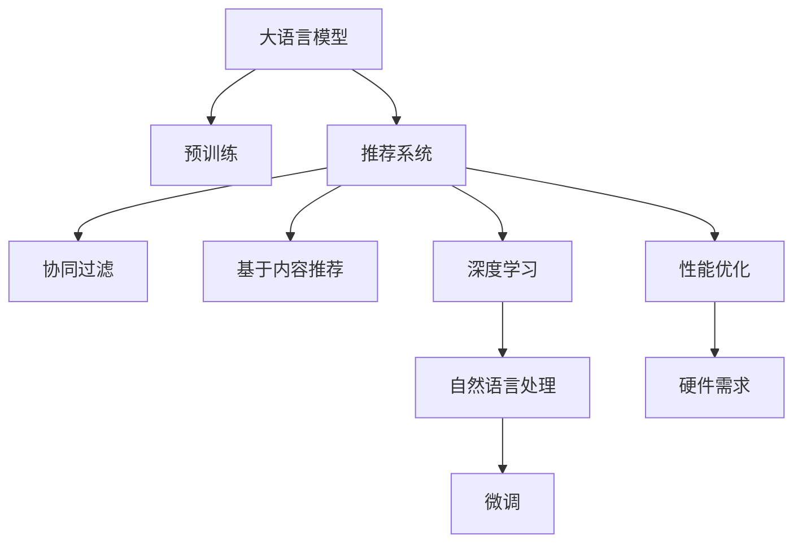

                 

# LLM在推荐系统的局限与成本：对硬件需求的探讨

## 1. 背景介绍

在数字时代，推荐系统已成为各互联网公司争夺用户的重要工具。其通过用户行为数据，预测用户的喜好，从而为用户提供个性化的信息推荐。这些推荐系统普遍采用协同过滤、基于内容的推荐、深度学习模型等技术。而随着大语言模型(Large Language Model, LLM)的出现，推荐系统正逐渐引入这些先进的AI技术，希望借此提升推荐精度和用户体验。

然而，尽管大语言模型在NLP任务上取得了显著成就，但在推荐系统中的应用仍面临诸多挑战。其中，硬件资源的需求和成本是制约其推广的重要因素之一。本文将详细探讨LLM在推荐系统中的局限性，及其对硬件需求的考量，并提出一些可能的解决策略。

## 2. 核心概念与联系

### 2.1 核心概念概述

- **大语言模型(LLM)**：指通过海量的无标签文本数据进行预训练，学习到语言通用表征的模型。例如，GPT-3、BERT等。
- **推荐系统**：通过用户行为数据，预测用户偏好，提供个性化推荐。包括协同过滤、内容推荐、深度学习等方法。
- **深度学习模型**：利用神经网络结构，自动从数据中提取特征，并用于预测和分类。
- **硬件需求**：在推荐系统中使用大语言模型，需要满足高性能计算、大内存存储、高速网络传输等硬件需求。

### 2.2 核心概念原理和架构的 Mermaid 流程图



该流程图展示了大语言模型在推荐系统中的关键路径，以及与硬件需求的关系。

## 3. 核心算法原理 & 具体操作步骤

### 3.1 算法原理概述

在大语言模型应用于推荐系统时，其核心原理是通过预训练获得的语言模型，捕捉用户的语言描述，将其转化为向量表示，再通过相似度匹配或其他机制，找到与用户兴趣匹配的物品，进行推荐。

其总体流程为：

1. **数据收集与预处理**：收集用户行为数据，包括浏览记录、点击行为等。对数据进行清洗和格式化处理。
2. **用户画像构建**：将用户描述或行为转化为词向量，构建用户画像。
3. **模型微调**：在大语言模型的基础上进行微调，使其能够理解和处理用户描述，生成推荐。
4. **推荐生成**：根据用户画像和物品描述，计算相似度，生成推荐列表。

### 3.2 算法步骤详解

#### 3.2.1 数据收集与预处理

数据收集阶段，需要从多个渠道获取用户的行为数据。例如，用户的点击、收藏、评分等。

```python
# 数据收集
def collect_user_data(user_id):
    click_data = get_click_data(user_id)
    rating_data = get_rating_data(user_id)
    return click_data, rating_data
```

数据预处理阶段，需要对收集到的数据进行清洗、去重和格式化处理，以生成统一的向量表示。

```python
# 数据预处理
def preprocess_data(user_data):
    # 清洗数据，去重，格式转换
    return preprocessed_data
```

#### 3.2.2 用户画像构建

用户画像的构建是将用户行为数据转化为词向量表示的过程。

```python
# 构建用户画像
def build_user_profile(user_data):
    # 用户描述
    user_profile = {}
    user_profile['user_id'] = user_data['user_id']
    user_profile['user_desc'] = preprocessed_data['user_desc']
    
    # 用户行为
    user_profile['click_data'] = click_data
    user_profile['rating_data'] = rating_data
    
    return user_profile
```

#### 3.2.3 模型微调

模型微调是将预训练的大语言模型，通过下游任务的标注数据进行微调，使其能够处理推荐任务。

```python
# 加载预训练模型
model = load_pretrained_model()

# 微调模型
def fine_tune_model(user_profile):
    # 构建输入
    input_text = build_input_text(user_profile)
    # 进行微调
    fine_tuned_model = model(input_text)
    return fine_tuned_model
```

#### 3.2.4 推荐生成

推荐生成的过程是计算用户画像和物品描述的相似度，生成推荐列表。

```python
# 推荐生成
def generate_recommendations(user_profile, items):
    # 计算相似度
    similarity_scores = compute_similarity(user_profile, items)
    # 排序生成推荐列表
    recommendations = sorted(similarity_scores, key=lambda x: x[1], reverse=True)
    
    return recommendations
```

### 3.3 算法优缺点

#### 3.3.1 优点

1. **丰富语义理解**：LLM能够理解复杂的用户描述，提供更为准确的推荐。
2. **动态更新**：LLM能够不断学习新的语言知识和用户行为，实时更新推荐模型。
3. **泛化能力强**：LLM具有强大的泛化能力，能够适应不同领域的推荐任务。

#### 3.3.2 缺点

1. **高计算成本**：LLM参数量大，计算复杂度高，需要高性能计算硬件。
2. **高存储需求**：LLM需要存储大量预训练参数和微调模型参数，对存储设备要求高。
3. **难以解释**：LLM的决策过程难以解释，缺乏透明性。
4. **易过拟合**：在标注数据不足的情况下，LLM容易过拟合，导致推荐精度下降。

### 3.4 算法应用领域

目前，LLM在推荐系统中的应用主要集中在以下领域：

- **个性化推荐**：利用用户描述生成个性化推荐。
- **情感分析**：分析用户对物品的情感倾向，提供更为精准的推荐。
- **多模态推荐**：结合文本、图片、音频等多种数据模态，提供更为丰富的推荐内容。
- **跨领域推荐**：将不同领域的数据进行融合，提升推荐的多样性和丰富度。

## 4. 数学模型和公式 & 详细讲解

### 4.1 数学模型构建

假设有一个用户$u$和物品集合$V$，记用户画像表示为$\mathbf{u}$，物品描述表示为$\mathbf{v}$。模型的目标是最小化推荐损失函数$\mathcal{L}$，以提高推荐精度。

模型微调的目标是最小化损失函数：

$$
\min_{\theta} \mathcal{L}(f_\theta(\mathbf{u}), f_\theta(\mathbf{v}))
$$

其中$f_\theta(\cdot)$为模型预测函数。

### 4.2 公式推导过程

假设用户画像$\mathbf{u}$和物品描述$\mathbf{v}$均为$D$维向量，推荐函数为$f_\theta(\cdot) = \theta^T \cdot \cdot$，其中$\theta$为模型参数。

推荐损失函数定义为：

$$
\mathcal{L} = \frac{1}{N} \sum_{i=1}^N (y_i - f_\theta(\mathbf{u}_i))^2
$$

其中$y_i$为物品$i$的真实评分，$\mathbf{u}_i$为用户$i$的画像向量。

微调模型时，通过梯度下降算法更新参数：

$$
\theta \leftarrow \theta - \eta \nabla_{\theta}\mathcal{L}
$$

其中$\eta$为学习率。

### 4.3 案例分析与讲解

假设一个用户对某物品的评分$y=4$，其用户画像表示为$\mathbf{u}$，物品描述表示为$\mathbf{v}$，模型参数表示为$\theta$。

首先，计算推荐函数$f_\theta(\mathbf{v})$：

$$
f_\theta(\mathbf{v}) = \theta^T \cdot \mathbf{v}
$$

然后，计算推荐损失$\mathcal{L}$：

$$
\mathcal{L} = \frac{1}{N} \sum_{i=1}^N (y_i - \theta^T \cdot \mathbf{v})^2
$$

通过梯度下降算法，更新参数$\theta$：

$$
\theta \leftarrow \theta - \eta \nabla_{\theta}\mathcal{L}
$$

通过上述过程，不断迭代更新模型参数，直至推荐精度达到预设值。

## 5. 项目实践：代码实例和详细解释说明

### 5.1 开发环境搭建

为了进行LLM在推荐系统中的应用开发，需要搭建高性能的计算环境。以下是一个典型的Python开发环境搭建流程：

1. **安装Python**：安装最新版本的Python，如3.8或更高版本。
2. **安装Pip**：安装Pip，用于管理Python依赖包。
3. **安装TensorFlow或PyTorch**：选择合适版本的TensorFlow或PyTorch，用于深度学习模型的实现。
4. **安装LLM模型库**：安装HuggingFace、TensorFlow-Hub等库，方便加载预训练模型。
5. **配置GPU环境**：确保开发环境中有可用的GPU资源，并配置好CUDA环境。

### 5.2 源代码详细实现

以下是一个简单的代码示例，展示如何使用预训练的BERT模型进行推荐系统开发：

```python
# 加载BERT预训练模型
from transformers import BertForSequenceClassification
model = BertForSequenceClassification.from_pretrained('bert-base-uncased')

# 定义微调函数
def fine_tune_model(user_profile, item_profile):
    # 构建输入
    input_text = build_input_text(user_profile)
    # 进行微调
    fine_tuned_model = model(input_text)
    return fine_tuned_model

# 定义推荐生成函数
def generate_recommendations(user_profile, items):
    # 计算相似度
    similarity_scores = compute_similarity(user_profile, items)
    # 排序生成推荐列表
    recommendations = sorted(similarity_scores, key=lambda x: x[1], reverse=True)
    
    return recommendations
```

### 5.3 代码解读与分析

- **预训练模型加载**：使用HuggingFace提供的BERT预训练模型，加载到Python环境。
- **微调函数定义**：定义微调函数，将用户画像和物品描述转化为模型输入，调用预训练模型进行微调。
- **推荐生成函数定义**：定义推荐生成函数，计算用户画像和物品描述的相似度，生成推荐列表。

### 5.4 运行结果展示

运行微调函数和推荐生成函数后，将得到推荐列表，如：

```python
recommendations = generate_recommendations(user_profile, items)
print(recommendations)
```

## 6. 实际应用场景

### 6.1 推荐系统场景

在实际的推荐系统中，LLM可以应用于各种场景，如电商、视频、音乐等。以下是一些典型的应用案例：

- **电商平台推荐**：根据用户浏览记录和物品描述，生成个性化的商品推荐。
- **视频平台推荐**：根据用户观看记录和视频描述，生成个性化的视频推荐。
- **音乐平台推荐**：根据用户听歌记录和歌曲描述，生成个性化的音乐推荐。

### 6.2 未来应用展望

随着硬件技术的进步，LLM在推荐系统中的应用前景广阔。未来可能的应用场景包括：

- **多模态推荐**：结合文本、图片、音频等多种数据模态，提供更为丰富的推荐内容。
- **跨领域推荐**：将不同领域的数据进行融合，提升推荐的多样性和丰富度。
- **实时推荐**：结合实时数据流，动态更新推荐模型，提供实时推荐服务。

## 7. 工具和资源推荐

### 7.1 学习资源推荐

- **《深度学习与推荐系统》**：介绍深度学习在推荐系统中的应用，涵盖协同过滤、基于内容的推荐、深度学习等方法。
- **《自然语言处理综论》**：介绍自然语言处理的基本概念和经典模型，包括大语言模型。
- **《TensorFlow官方文档》**：介绍TensorFlow的开发环境和使用方法，适合深度学习应用的开发。
- **《HuggingFace官方文档》**：介绍HuggingFace预训练模型的加载和使用，适合自然语言处理应用的开发。

### 7.2 开发工具推荐

- **Jupyter Notebook**：用于开发和实验，支持Python代码的交互式执行和可视化展示。
- **TensorBoard**：用于模型训练和实验的可视化工具，支持实时监控训练状态。
- **JupyterLab**：用于开发和实验的集成开发环境，支持代码和实验的统一管理。

### 7.3 相关论文推荐

- **《A Survey on Deep Learning for Recommender Systems》**：综述深度学习在推荐系统中的应用，涵盖协同过滤、基于内容的推荐、深度学习等方法。
- **《Semantic Representations from Conversations》**：介绍如何利用对话数据构建用户画像，提高推荐精度。
- **《Transformers for Recommender Systems》**：介绍如何使用Transformer结构构建推荐系统，提升推荐精度和效率。

## 8. 总结：未来发展趋势与挑战

### 8.1 研究成果总结

大语言模型在推荐系统中的应用，通过其强大的语言处理能力和泛化能力，显著提升了推荐精度和用户体验。然而，其高计算成本和存储需求，限制了其在实际系统中的推广。未来，如何降低硬件需求，提高推荐系统性能，将是重要的研究方向。

### 8.2 未来发展趋势

未来，LLM在推荐系统中的应用将呈现以下几个趋势：

- **模型轻量化**：通过模型压缩、剪枝等技术，减少模型参数量，降低硬件需求。
- **硬件加速**：引入GPU、TPU等高性能计算硬件，提升计算效率。
- **多模态融合**：结合文本、图片、音频等多种数据模态，提供更为丰富的推荐内容。
- **实时推荐**：结合实时数据流，动态更新推荐模型，提供实时推荐服务。

### 8.3 面临的挑战

尽管LLM在推荐系统中的应用前景广阔，但仍面临以下挑战：

- **高计算成本**：LLM参数量大，计算复杂度高，需要高性能计算硬件。
- **高存储需求**：LLM需要存储大量预训练参数和微调模型参数，对存储设备要求高。
- **难以解释**：LLM的决策过程难以解释，缺乏透明性。
- **易过拟合**：在标注数据不足的情况下，LLM容易过拟合，导致推荐精度下降。

### 8.4 研究展望

未来，需要在以下方面进行深入研究：

- **模型压缩与剪枝**：通过模型压缩、剪枝等技术，减少模型参数量，降低硬件需求。
- **硬件加速技术**：引入GPU、TPU等高性能计算硬件，提升计算效率。
- **多模态融合技术**：结合文本、图片、音频等多种数据模态，提供更为丰富的推荐内容。
- **实时推荐技术**：结合实时数据流，动态更新推荐模型，提供实时推荐服务。

## 9. 附录：常见问题与解答

### Q1: 大语言模型在推荐系统中的优势是什么？

**A1:** 大语言模型能够理解复杂的用户描述，提供更为准确的推荐。其具有强大的泛化能力，能够适应不同领域的推荐任务。

### Q2: 如何降低大语言模型的计算成本？

**A2:** 可以使用模型压缩、剪枝等技术，减少模型参数量。引入GPU、TPU等高性能计算硬件，提升计算效率。

### Q3: 大语言模型在推荐系统中面临哪些挑战？

**A3:** 大语言模型的高计算成本和存储需求是其面临的主要挑战。同时，其决策过程难以解释，缺乏透明性。在标注数据不足的情况下，容易过拟合。

### Q4: 大语言模型在推荐系统中的典型应用有哪些？

**A4:** 大语言模型可以应用于电商平台、视频平台、音乐平台等多个场景。通过用户描述生成个性化的推荐。

### Q5: 大语言模型在推荐系统中的应用前景如何？

**A5:** 大语言模型在推荐系统中的应用前景广阔。其强大的语言处理能力和泛化能力，将显著提升推荐精度和用户体验。未来，将结合实时数据流，动态更新推荐模型，提供实时推荐服务。

---

作者：禅与计算机程序设计艺术 / Zen and the Art of Computer Programming

