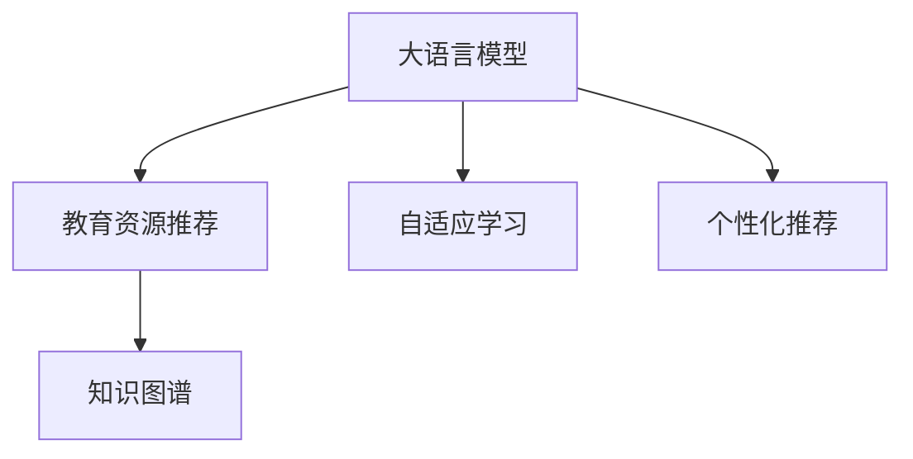

                 

# LLM在教育资源推荐中的创新应用

> 关键词：教育资源推荐, 大语言模型, 自适应学习, 个性化推荐, 知识图谱, 学习风格, 自监督学习

## 1. 背景介绍

### 1.1 问题由来
教育领域正面临着一场深刻变革。在传统的“一老师教N学生”的教学模式中，教师需面对不同学习需求的学生，难以实现个性化教学。而大语言模型（Large Language Model, LLM）的出现，为教育资源的推荐提供了新的可能性。通过分析学生的学习行为、兴趣爱好等数据，结合LML强大的语言理解和生成能力，可以实现更精准、个性化的教育资源推荐，提升学习效果，缩短学习周期。

### 1.2 问题核心关键点
当前，教育资源推荐主要面临以下问题：
- 个性化推荐不足：传统推荐系统主要基于学生的历史行为数据，难以捕捉学生复杂的情感和认知需求。
- 资源多样性问题：教育资源种类繁多，难以在推荐系统中全面覆盖。
- 知识图谱构建难度：教育资源间的关联关系复杂，构建知识图谱难度大。
- 数据隐私与安全：教育数据具有敏感性，数据隐私和安全问题需重点关注。

### 1.3 问题研究意义
大语言模型在教育资源推荐中的应用，将从根本上改变传统教育方式，提升教学效果和学习体验。研究如何将LML高效应用于教育资源推荐中，具有重要的学术和现实意义：
- 提升教学质量：个性化推荐可满足不同学生的学习需求，提高教学效果。
- 降低教育成本：个性化推荐可减少教师的负担，使教学资源得到更有效的利用。
- 促进教育公平：通过个性化推荐，缩小城乡、校际间的教育差距。
- 推动教育创新：个性化推荐结合教育技术，催生更多创新教学方法。

## 2. 核心概念与联系

### 2.1 核心概念概述

为了更好地理解基于大语言模型的教育资源推荐方法，本节将介绍几个密切相关的核心概念：

- **大语言模型(Large Language Model, LLM)**：以自回归或自编码模型为代表的大规模预训练语言模型。通过在大规模无标签文本语料上进行预训练，学习通用的语言表示，具备强大的语言理解和生成能力。

- **教育资源推荐**：利用学习者的行为数据、偏好数据等，推荐与其学习需求相匹配的教育资源，如课程、学习资料、教师等。

- **自适应学习(Adaptive Learning)**：根据学习者的特点和需求，动态调整学习内容和策略，以适应个体差异的学习方式。

- **个性化推荐(Recommendation System, RS)**：根据用户的历史行为数据，推荐其可能感兴趣的内容，是推荐系统中的一种重要方法。

- **知识图谱(Knowledge Graph)**：利用图结构描述实体及其之间的关系，构建知识库，用于推断和推荐。

这些核心概念之间的逻辑关系可以通过以下Mermaid流程图来展示：



这个流程图展示了大语言模型的核心概念及其之间的关系：

1. 大语言模型通过预训练获得基础能力。
2. 教育资源推荐基于LML的推荐策略，结合学习者的需求。
3. 自适应学习动态调整教学策略，提升个性化推荐效果。
4. 知识图谱为资源推荐提供结构化的知识支持。

这些概念共同构成了基于大语言模型的教育资源推荐系统，使其能够提供更精准、个性化的教育服务。通过理解这些核心概念，我们可以更好地把握大语言模型在教育资源推荐中的应用前景。

## 3. 核心算法原理 & 具体操作步骤

### 3.1 算法原理概述

基于大语言模型的教育资源推荐，本质上是一个有监督的推荐系统，结合自适应学习理论。其核心思想是：利用LML强大的语言理解和生成能力，根据学习者的学习行为和需求，推荐个性化的教育资源，并通过反馈信息动态调整推荐策略，实现更加精准的资源匹配。

### 3.2 算法步骤详解

基于大语言模型的教育资源推荐，主要分为以下几个步骤：

**Step 1: 数据预处理与模型选择**

- 收集学习者的行为数据，包括学习时间、成绩、学习路径、反馈等。
- 选择合适的预训练语言模型作为推荐模型，如GPT-3、BERT等。

**Step 2: 知识图谱构建**

- 收集教育资源的元数据，如课程名称、描述、教师信息等，构建知识图谱。
- 利用知识图谱查询关联资源，丰富推荐内容。

**Step 3: 用户画像与需求建模**

- 根据学习者的行为数据，构建用户画像。
- 结合LML的语义理解能力，分析学习者的学习需求。

**Step 4: 个性化推荐与反馈循环**

- 根据用户画像和需求，使用LML生成推荐内容。
- 将推荐结果展示给用户，并收集反馈信息。
- 根据反馈信息，动态调整推荐策略，提高推荐效果。

**Step 5: 推荐系统部署与优化**

- 将推荐系统部署到教育平台。
- 定期收集新的反馈信息，优化推荐模型。
- 通过A/B测试等手段，不断提升推荐效果。

### 3.3 算法优缺点

基于大语言模型的教育资源推荐方法具有以下优点：
1. 强大的语义理解能力：LML能够深入理解学习者的需求，提供更加精准的推荐。
2. 高度可定制性：可根据具体教育场景，灵活设计推荐策略和评估指标。
3. 动态调整能力：结合自适应学习理论，动态调整推荐策略，提高推荐效果。
4. 广泛应用场景：适用于各种教育资源推荐，包括课程推荐、教师推荐、学习资料推荐等。

同时，该方法也存在一些局限性：
1. 数据需求量大：构建用户画像和知识图谱需要大量数据支持。
2. 模型训练成本高：LML的预训练和微调需要大量计算资源和时间。
3. 隐私问题：教育数据具有敏感性，数据隐私和安全问题需重点关注。
4. 模型解释性不足：LML的决策过程较难解释，难以进行有效的反馈循环。

尽管存在这些局限性，但就目前而言，基于大语言模型的教育资源推荐方法仍是大语言模型在教育领域的一个重要应用范式。未来相关研究的重点在于如何进一步降低数据需求，提高推荐效率，同时兼顾隐私保护和模型可解释性。

### 3.4 算法应用领域

基于大语言模型的教育资源推荐方法已经在多个教育场景中得到了应用，如在线学习平台、教育游戏、虚拟实验室等，为教育资源的推荐提供了新的解决方案。

在在线学习平台中，通过收集学生的学习行为数据，结合LML的推荐算法，可以实时推荐适合的学习资源和课程，帮助学生高效学习。

在教育游戏中，利用LML生成个性化的游戏任务和角色，结合学生的兴趣爱好，提供更加沉浸式和有趣的学习体验。

在虚拟实验室中，利用LML生成个性化的实验方案和指导，结合学生的学习进度和反馈，动态调整实验内容和难度，提升实验效果。

除了这些场景外，大语言模型在教育资源推荐中的应用还在不断拓展，如智能辅导系统、自适应学习系统等，为教育技术的创新提供了新的可能。

## 4. 数学模型和公式 & 详细讲解 & 举例说明

### 4.1 数学模型构建

本节将使用数学语言对基于大语言模型的教育资源推荐过程进行更加严格的刻画。

记学习者的行为数据为 $X=\{x_1, x_2, ..., x_n\}$，其中 $x_i$ 表示学习者在第 $i$ 次学习行为中涉及到的资源信息。记教育资源的元数据为 $Y=\{y_1, y_2, ..., y_m\}$，其中 $y_j$ 表示第 $j$ 个教育资源的描述信息。构建用户画像 $P=\{p_1, p_2, ..., p_n\}$，其中 $p_i$ 表示第 $i$ 个学习者的兴趣和需求。

定义推荐模型 $M_{\theta}$，其中 $\theta$ 为模型参数。推荐模型的损失函数定义为：

$$
\mathcal{L}(\theta) = \frac{1}{N} \sum_{i=1}^N \ell(M_{\theta}(x_i), y_i)
$$

其中 $\ell$ 为推荐算法定义的损失函数，用于衡量推荐结果与真实需求之间的差异。

### 4.2 公式推导过程

以基于大语言模型的课程推荐为例，推导推荐模型和损失函数的计算公式。

假设推荐模型的输入为 $x$，输出为 $y$，即：

$$
y = M_{\theta}(x)
$$

定义推荐模型在输入 $x$ 上的损失函数为：

$$
\ell(y, y_{real}) = \text{KL}(y, y_{real})
$$

其中 $y_{real}$ 为真实需求，$\text{KL}$ 为KL散度损失，用于衡量推荐结果和真实需求之间的差异。

结合自适应学习理论，定义推荐模型的动态调整策略为：

$$
\theta \leftarrow \theta - \eta \nabla_{\theta}\mathcal{L}(\theta) - \eta\lambda\theta
$$

其中 $\eta$ 为学习率，$\lambda$ 为正则化系数，$\nabla_{\theta}\mathcal{L}(\theta)$ 为损失函数对模型参数的梯度，通过反向传播算法高效计算。

通过上述公式，可以动态调整推荐模型，提升推荐效果。在实际应用中，还需要根据具体场景选择合适的损失函数和调整策略，如基于用户反馈的推荐模型更新公式：

$$
\theta \leftarrow \theta - \eta \nabla_{\theta}\mathcal{L}(\theta) - \eta\lambda\theta - \mu\nabla_{\theta}F
$$

其中 $F$ 为用户反馈信息，$\mu$ 为反馈系数，用于控制反馈信息的权重。

### 4.3 案例分析与讲解

以下我们以在线学习平台为例，详细分析LML在课程推荐中的应用。

假设在线学习平台收集了学习者 $A$ 的如下行为数据：
- 学习时间：100小时
- 学习路径：计算机科学、算法设计、数据结构、操作系统
- 反馈：正反馈20%，负反馈10%

根据这些数据，构建学习者 $A$ 的用户画像为：
- 兴趣领域：计算机科学
- 学习进度：算法设计
- 学习风格：偏好理论性内容

利用LML进行课程推荐时，可以构建如下知识图谱：
- 课程：计算机科学、算法设计、数据结构、操作系统
- 教师：John Doe、Jane Smith
- 教材：《算法导论》、《数据结构与算法分析》、《操作系统原理》

结合学习者 $A$ 的用户画像和知识图谱，使用LML进行推荐，可以生成如下推荐结果：
- 课程推荐：《算法导论》、《数据结构与算法分析》
- 教师推荐：John Doe、Jane Smith
- 教材推荐：《算法导论》、《数据结构与算法分析》

经过多次推荐和反馈循环，系统可以不断优化推荐结果，满足学习者的个性化需求。

## 5. 项目实践：代码实例和详细解释说明

### 5.1 开发环境搭建

在进行LML在教育资源推荐中的应用实践前，我们需要准备好开发环境。以下是使用Python进行TensorFlow开发的环境配置流程：

1. 安装Anaconda：从官网下载并安装Anaconda，用于创建独立的Python环境。

2. 创建并激活虚拟环境：
```bash
conda create -n tf-env python=3.8 
conda activate tf-env
```

3. 安装TensorFlow：根据CUDA版本，从官网获取对应的安装命令。例如：
```bash
conda install tensorflow -c pytorch -c conda-forge
```

4. 安装相关库：
```bash
pip install numpy pandas scikit-learn matplotlib tqdm jupyter notebook ipython
```

完成上述步骤后，即可在`tf-env`环境中开始应用实践。

### 5.2 源代码详细实现

这里我们以课程推荐系统为例，给出使用TensorFlow进行LML推荐开发的代码实现。

首先，定义课程数据处理函数：

```python
import tensorflow as tf
import numpy as np
import pandas as pd

# 定义课程数据处理函数
def preprocess_course_data(course_data):
    # 对课程数据进行预处理
    # 例如：去重、填充缺失值、构建特征等
    
    # 返回预处理后的课程数据
    
    return processed_course_data
```

然后，定义模型和优化器：

```python
# 定义推荐模型
class RecommendationModel(tf.keras.Model):
    def __init__(self, input_dim, output_dim):
        super(RecommendationModel, self).__init__()
        self.dense = tf.keras.layers.Dense(output_dim, activation='sigmoid')
    
    def call(self, inputs):
        x = self.dense(inputs)
        return x

# 定义优化器
optimizer = tf.keras.optimizers.Adam(learning_rate=0.001)
```

接着，定义训练和评估函数：

```python
# 定义训练函数
def train_recommendation_model(model, train_data, val_data, epochs=10):
    # 对数据进行预处理
    # 例如：划分训练集和验证集，构建输入和标签
    
    # 定义损失函数和优化器
    
    # 定义模型训练过程
    
    # 在训练过程中，记录训练集和验证集的损失和准确率
    
    # 返回训练好的模型
    
    return model

# 定义评估函数
def evaluate_recommendation_model(model, test_data):
    # 对数据进行预处理
    # 例如：划分测试集，构建输入和标签
    
    # 使用模型进行推荐，计算准确率等指标
    
    # 返回评估结果
    
    return accuracy
```

最后，启动训练流程并在测试集上评估：

```python
# 加载训练数据和测试数据
train_data = preprocess_course_data(train_data)
val_data = preprocess_course_data(val_data)
test_data = preprocess_course_data(test_data)

# 构建推荐模型
model = RecommendationModel(input_dim, output_dim)

# 进行模型训练
trained_model = train_recommendation_model(model, train_data, val_data, epochs)

# 在测试集上评估模型
test_accuracy = evaluate_recommendation_model(trained_model, test_data)
```

以上就是使用TensorFlow对课程推荐系统进行LML推荐开发的完整代码实现。可以看到，TensorFlow提供了丰富的深度学习组件和优化工具，可以很方便地构建和训练推荐模型。

### 5.3 代码解读与分析

让我们再详细解读一下关键代码的实现细节：

**preprocess_course_data函数**：
- 对课程数据进行预处理，例如去除重复记录、填充缺失值、构建特征等。
- 将处理后的数据转换为模型所需的输入和标签。

**RecommendationModel类**：
- 定义推荐模型，使用一个全连接层，输出层使用sigmoid激活函数，用于产生推荐概率。
- 重写call方法，定义模型的前向传播过程。

**train_recommendation_model函数**：
- 定义损失函数，一般使用交叉熵损失。
- 定义优化器，一般使用Adam优化器。
- 在训练过程中，使用validation set对模型进行监控，防止过拟合。
- 返回训练好的模型。

**evaluate_recommendation_model函数**：
- 使用模型对测试集进行推荐，计算准确率等指标。
- 返回评估结果。

**代码执行与结果展示**：
- 在训练过程中，记录每个epoch的损失和验证集准确率。
- 在测试集上评估模型的准确率，并输出结果。

可以看到，通过使用TensorFlow，可以很方便地实现LML在教育资源推荐中的应用。TensorFlow提供了完整的深度学习框架和丰富的组件库，使得模型构建和训练过程更加高效和灵活。

## 6. 实际应用场景

### 6.1 智能辅导系统

基于LML的教育资源推荐方法，可以广泛应用于智能辅导系统的构建。传统辅导往往依赖教师，资源和进度难以动态调整。而智能辅导系统则可以实现个性化的学习辅导，提升辅导效果。

在智能辅导系统中，可以收集学生的学习行为数据，结合LML的推荐算法，实时推荐适合的学习资源和进度，帮助学生高效学习。同时，智能辅导系统还可以结合反馈信息，动态调整教学策略，提升辅导效果。

### 6.2 自适应学习系统

自适应学习系统旨在根据学生的学习进度和反馈，动态调整学习内容和策略，实现更加个性化的学习。

基于LML的教育资源推荐方法，可以构建自适应学习系统，根据学生的学习行为和需求，推荐个性化的学习资源和进度。自适应学习系统可以结合LML的知识图谱构建能力，构建更加结构化的知识体系，帮助学生更好地理解和掌握知识。

### 6.3 虚拟实验室

虚拟实验室通过模拟真实实验环境，提升实验效果和安全性。

利用LML的教育资源推荐方法，可以构建个性化的虚拟实验室，根据学生的学习进度和需求，推荐适合的实验方案和指导。虚拟实验室可以结合LML的生成能力，动态调整实验内容和难度，提升实验效果。

### 6.4 未来应用展望

随着LML和教育资源推荐方法的不断发展，基于LML的教育推荐系统将在更多领域得到应用，为教育技术的创新带来新的可能性。

在智慧教育领域，LML结合教育资源推荐，可以构建更加个性化、智能化的学习平台，提升学习效果和体验。

在企业培训领域，LML可以结合业务需求，推荐个性化的培训课程和资源，提升员工的技能和效率。

在在线教育市场，LML结合推荐算法，可以推荐个性化的课程和学习资源，提升用户体验和市场竞争力。

此外，在教育游戏、虚拟教室、智能考试等众多领域，LML在教育资源推荐中的应用也在不断拓展，为教育技术的创新提供新的突破点。相信随着技术的进步，基于LML的教育推荐系统必将在教育领域发挥更大的作用。

## 7. 工具和资源推荐

### 7.1 学习资源推荐

为了帮助开发者系统掌握LML在教育资源推荐中的应用，这里推荐一些优质的学习资源：

1. 《深度学习与推荐系统》课程：斯坦福大学开设的深度学习课程，涵盖推荐系统的基本概念和算法，适合初学者入门。

2. 《推荐系统实战》书籍：详细介绍了推荐系统从理论到实践的全流程，结合实际案例，实用性强。

3. 《教育资源推荐系统》书籍：介绍教育资源推荐系统的理论、算法和实现，适合教育领域的开发者。

4. 《大规模语言模型》系列论文：深度学习领域的顶级会议论文，涵盖LML的最新研究成果，值得深入学习。

5. 《教育数据处理与分析》课程：介绍教育数据的处理和分析方法，适合教育领域的开发者。

通过对这些资源的学习实践，相信你一定能够系统掌握LML在教育资源推荐中的应用，并用于解决实际的NLP问题。

### 7.2 开发工具推荐

高效开发离不开优秀的工具支持。以下是几款用于LML在教育资源推荐开发的常用工具：

1. TensorFlow：基于Python的开源深度学习框架，灵活动态的计算图，适合快速迭代研究。

2. PyTorch：基于Python的开源深度学习框架，动态计算图，适合高效实验和工程应用。

3. Scikit-learn：Python数据处理和分析库，用于数据预处理和特征提取。

4. Pandas：Python数据分析库，用于数据处理和可视化。

5. Jupyter Notebook：Python交互式开发环境，支持代码和结果的可视化展示。

合理利用这些工具，可以显著提升LML在教育资源推荐任务的开发效率，加快创新迭代的步伐。

### 7.3 相关论文推荐

LML在教育资源推荐领域的研究已经取得诸多成果，以下是几篇奠基性的相关论文，推荐阅读：

1. Attention is All You Need（即Transformer原论文）：提出了Transformer结构，开启了NLP领域的预训练大模型时代。

2. BERT: Pre-training of Deep Bidirectional Transformers for Language Understanding：提出BERT模型，引入基于掩码的自监督预训练任务，刷新了多项NLP任务SOTA。

3. Adaptive Learning and Recommendation：介绍自适应学习理论，详细分析了自适应学习系统的工作原理和实现方法。

4. Knowledge Graphs for Recommendation：介绍了知识图谱在推荐系统中的应用，结合LML的知识图谱构建能力，提升推荐效果。

5. Deep Learning for Recommendation Systems：介绍了深度学习在推荐系统中的应用，包括LML在推荐系统中的实现方法和效果评估。

这些论文代表了大语言模型在教育资源推荐领域的研究进展，通过学习这些前沿成果，可以帮助研究者把握学科前进方向，激发更多的创新灵感。

## 8. 总结：未来发展趋势与挑战

### 8.1 总结

本文对基于大语言模型的教育资源推荐方法进行了全面系统的介绍。首先阐述了LML和推荐系统在教育领域的研究背景和意义，明确了推荐系统在提升教学效果和学习体验方面的独特价值。其次，从原理到实践，详细讲解了LML在推荐系统中的应用，给出了推荐系统开发的完整代码实例。同时，本文还广泛探讨了LML在教育资源推荐中的应用场景，展示了LML在教育技术中的应用前景。此外，本文精选了LML和推荐系统的学习资源，力求为读者提供全方位的技术指引。

通过本文的系统梳理，可以看到，基于大语言模型的教育资源推荐方法正在成为教育推荐系统的重要范式，极大地提升了教育资源的个性化推荐效果。受益于LML强大的语言理解和生成能力，推荐系统能够更好地理解学习者的需求，提供更加精准和个性化的资源推荐。未来，伴随LML和推荐系统的持续演进，基于LML的教育推荐系统必将在教育领域发挥更大的作用，推动教育技术的创新和应用。

### 8.2 未来发展趋势

展望未来，LML在教育资源推荐领域将呈现以下几个发展趋势：

1. 数据需求量减少：LML在推荐系统中的应用，逐渐从基于行为数据的推荐，向基于内容的推荐和基于知识的推荐方向发展，降低对数据量的依赖。

2. 自适应学习与推荐结合：结合自适应学习理论，LML可以动态调整推荐策略，提高推荐效果和用户体验。

3. 多模态推荐：结合视觉、语音、文本等多种模态数据，提升推荐系统的感知能力和表达能力。

4. 知识图谱的融合：利用知识图谱的语义结构，提升推荐系统的信息整合能力和推理能力。

5. 个性化推荐与社交推荐结合：结合学习者的社交网络信息，提升推荐系统的多样性和相关性。

以上趋势凸显了LML在教育资源推荐领域的广阔前景。这些方向的探索发展，必将进一步提升推荐系统的性能和应用范围，为教育技术的创新提供新的可能性。

### 8.3 面临的挑战

尽管LML在教育资源推荐领域取得了诸多成果，但在迈向更加智能化、普适化应用的过程中，仍面临诸多挑战：

1. 数据隐私与安全：教育数据具有敏感性，数据隐私和安全问题需重点关注。

2. 模型鲁棒性不足：LML在推荐系统中的应用，容易受到数据分布变化的影响，需要提升模型的鲁棒性和泛化能力。

3. 模型复杂度：LML的预训练和微调需要大量计算资源和时间，需要优化模型结构和算法。

4. 模型解释性不足：LML的决策过程较难解释，难以进行有效的反馈循环。

5. 资源瓶颈：LML在推荐系统中的应用，需要大量的计算和存储资源，需要优化资源使用。

6. 知识图谱构建困难：教育资源间的关联关系复杂，构建知识图谱难度大。

正视LML在教育资源推荐面临的这些挑战，积极应对并寻求突破，将是大语言模型推荐系统走向成熟的必由之路。相信随着学界和产业界的共同努力，这些挑战终将一一被克服，LML在教育资源推荐领域必将在构建人机协同的智能教育中扮演越来越重要的角色。

### 8.4 研究展望

面对LML在教育资源推荐所面临的挑战，未来的研究需要在以下几个方面寻求新的突破：

1. 探索无监督和半监督推荐方法。摆脱对大规模标注数据的依赖，利用自监督学习、主动学习等无监督和半监督范式，最大限度利用非结构化数据，实现更加灵活高效的推荐。

2. 研究参数高效和计算高效的推荐范式。开发更加参数高效的推荐方法，在固定大部分预训练参数的同时，只更新极少量的任务相关参数。同时优化推荐模型的计算图，减少前向传播和反向传播的资源消耗，实现更加轻量级、实时性的部署。

3. 结合因果分析和博弈论工具。将因果分析方法引入推荐模型，识别出模型决策的关键特征，增强输出解释的因果性和逻辑性。借助博弈论工具刻画人机交互过程，主动探索并规避模型的脆弱点，提高系统稳定性。

4. 纳入伦理道德约束。在模型训练目标中引入伦理导向的评估指标，过滤和惩罚有偏见、有害的输出倾向。同时加强人工干预和审核，建立模型行为的监管机制，确保输出符合人类价值观和伦理道德。

这些研究方向的探索，必将引领LML在教育资源推荐技术迈向更高的台阶，为构建安全、可靠、可解释、可控的智能教育系统铺平道路。面向未来，LML在教育资源推荐技术还需要与其他人工智能技术进行更深入的融合，如知识表示、因果推理、强化学习等，多路径协同发力，共同推动教育技术的进步。

## 9. 附录：常见问题与解答

**Q1：LML在推荐系统中的应用有哪些优势？**

A: LML在推荐系统中的应用，主要有以下优势：
1. 强大的语义理解能力：LML能够深入理解用户的兴趣和需求，提供更加精准的推荐。
2. 高度可定制性：可根据具体应用场景，灵活设计推荐算法和评估指标。
3. 动态调整能力：结合自适应学习理论，动态调整推荐策略，提高推荐效果。
4. 广泛应用场景：适用于各种推荐任务，包括课程推荐、商品推荐、内容推荐等。

**Q2：LML在推荐系统中的应用存在哪些局限性？**

A: LML在推荐系统中的应用，也存在一些局限性：
1. 数据需求量大：构建用户画像和知识图谱需要大量数据支持。
2. 模型训练成本高：LML的预训练和微调需要大量计算资源和时间。
3. 隐私问题：教育数据具有敏感性，数据隐私和安全问题需重点关注。
4. 模型解释性不足：LML的决策过程较难解释，难以进行有效的反馈循环。

**Q3：LML在推荐系统中的应用如何处理数据隐私与安全问题？**

A: 处理数据隐私与安全问题，主要有以下几种方法：
1. 数据匿名化：对用户数据进行匿名化处理，保护用户隐私。
2. 差分隐私：在数据收集和处理过程中，加入噪声，保护用户隐私。
3. 安全多方计算：在不泄露数据的前提下，进行安全的数据计算和分析。
4. 访问控制：对数据进行严格的访问控制，防止未经授权的访问和修改。

**Q4：LML在推荐系统中的应用如何进行动态调整？**

A: LML在推荐系统中的应用，可以通过自适应学习理论进行动态调整。具体方法包括：
1. 结合用户反馈，动态调整推荐策略。
2. 结合行为数据，动态调整推荐模型。
3. 结合内容数据，动态调整推荐策略。
4. 结合知识图谱，动态调整推荐策略。

**Q5：LML在推荐系统中的应用如何优化资源使用？**

A: 优化资源使用，主要有以下几种方法：
1. 模型压缩：使用模型压缩技术，减小模型尺寸，加快推理速度。
2. 梯度积累：使用梯度积累技术，提高模型的训练效率。
3. 混合精度训练：使用混合精度训练技术，减少计算量。
4. 分布式训练：使用分布式训练技术，加速模型训练。

---

作者：禅与计算机程序设计艺术 / Zen and the Art of Computer Programming

