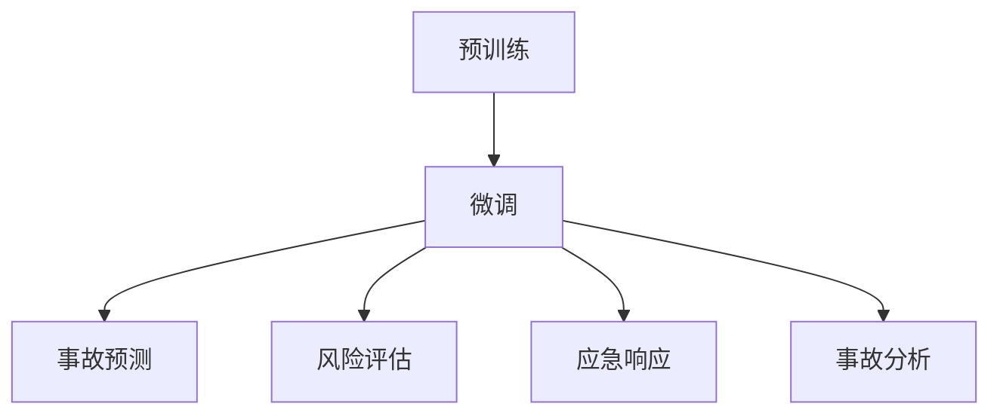

                 

# LLM在智能交通事故预防中的潜在贡献

## 1. 背景介绍

### 1.1 问题由来
随着全球人口的增长和城市化进程的加速，交通拥堵和交通事故已经成为制约社会经济发展的重要因素。传统交通事故预防措施主要依赖于物理基础设施和交通法规，如信号灯、摄像头、隔离栏等。然而，这些措施往往效果有限，且难以应对复杂的交通环境和突发的异常情况。智能交通系统（Intelligent Transportation Systems, ITS）通过融合信息技术，提供了更加智能化的解决方案。近年来，人工智能技术的发展为智能交通系统的建设注入了新的活力。其中，大语言模型（Large Language Model, LLM）由于其强大的语言理解和生成能力，在智能交通事故预防中展现出巨大的应用潜力。

### 1.2 问题核心关键点
智能交通事故预防主要包括以下几个关键点：
1. **事故预测**：提前识别交通事故的潜在风险，预测事故发生的可能性。
2. **风险评估**：对交通风险进行全面评估，判断事故的可能性和严重程度。
3. **应急响应**：在事故发生时，快速采取有效措施，减少事故影响和损失。
4. **事故分析**：对已发生的事故进行详细分析，提取有价值的信息，用于改进交通管理和预防措施。

这些核心问题对智能交通系统的实时性、准确性和可解释性都有较高要求。大语言模型作为一种先进的智能处理工具，具备强大的语义理解能力和知识推理能力，能够对复杂问题进行高效处理和实时响应。

## 2. 核心概念与联系

### 2.1 核心概念概述

大语言模型通过大规模无标签文本语料进行预训练，学习通用的语言表示和知识推理能力。预训练完成后，通过微调（Fine-tuning）的方法，使其适应特定的智能交通事故预防任务，具备对交通环境和事故场景的理解能力，从而实现对事故预测、风险评估、应急响应和事故分析等任务的支持。

### 2.2 核心概念联系

大语言模型的核心概念之间存在紧密联系，其作用机制和优化过程如图：



**预训练**：通过大规模无标签文本数据，学习通用的语言表示和知识推理能力。

**微调**：在预训练模型的基础上，通过特定的智能交通事故预防任务进行微调，使模型能够适应新的任务场景。

**事故预测**：利用微调后的模型，预测交通环境中的潜在事故风险。

**风险评估**：评估风险的严重程度，为应急响应提供依据。

**应急响应**：根据风险评估结果，快速采取有效措施，减少事故影响和损失。

**事故分析**：对已发生的事故进行详细分析，提取有价值的信息，用于改进交通管理和预防措施。

这些概念之间的联系和作用机制，构成了大语言模型在智能交通事故预防中的核心框架。

## 3. 核心算法原理 & 具体操作步骤

### 3.1 算法原理概述

基于大语言模型的智能交通事故预防，本质上是一种有监督学习范式。其核心思想是：将大语言模型作为事件预测和知识推理的工具，通过训练有标签的交通事故数据集，学习交通环境和事故场景的知识，从而实现对交通事故的预测、评估和响应。

假设训练数据集为 $D=\{(x_i, y_i)\}_{i=1}^N$，其中 $x_i$ 为事故场景描述，$y_i$ 为事故发生与否。微调的目标是找到最优参数 $\theta$，使得模型在新的交通事故场景中能够准确预测事故发生概率。

### 3.2 算法步骤详解

基于大语言模型的智能交通事故预防，一般包括以下几个关键步骤：

**Step 1: 准备预训练模型和数据集**
- 选择合适的预训练语言模型，如GPT-3、BERT等，作为初始化参数。
- 准备训练集和验证集，确保数据集中事故场景描述与实际事故场景分布相似。

**Step 2: 设计微调任务**
- 定义事故预测、风险评估等微调任务的目标函数，如交叉熵损失、均方误差损失等。
- 设计相应的评估指标，如预测准确率、召回率、F1分数等。

**Step 3: 设置微调超参数**
- 选择合适的优化算法及其参数，如Adam、SGD等，设置学习率、批大小、迭代轮数等。
- 设置正则化技术及强度，包括权重衰减、Dropout、Early Stopping等。

**Step 4: 执行梯度训练**
- 将训练集数据分批次输入模型，前向传播计算损失函数。
- 反向传播计算参数梯度，根据设定的优化算法和学习率更新模型参数。
- 周期性在验证集上评估模型性能，根据性能指标决定是否触发Early Stopping。
- 重复上述步骤直至满足预设的迭代轮数或Early Stopping条件。

**Step 5: 测试和部署**
- 在测试集上评估微调后模型，对比微调前后的精度提升。
- 使用微调后的模型对新的交通事故场景进行预测，集成到智能交通系统中。
- 持续收集新的事故数据，定期重新微调模型，以适应数据分布的变化。

### 3.3 算法优缺点

基于大语言模型的智能交通事故预防方法具有以下优点：
1. 预测精度高：利用大模型的强大语言理解和知识推理能力，可以准确预测事故发生的概率。
2. 实时响应：通过微调后的模型，可以实现对事故场景的实时预测和风险评估。
3. 适用性强：适用于各种复杂交通环境和突发情况，具备良好的泛化能力。

同时，该方法也存在以下缺点：
1. 对标注数据依赖大：微调效果很大程度上取决于标注数据的质量和数量，获取高质量标注数据的成本较高。
2. 计算资源需求高：大模型的计算资源需求较大，训练和推理成本较高。
3. 可解释性不足：微调模型的决策过程通常缺乏可解释性，难以对其推理逻辑进行分析和调试。

尽管存在这些局限性，但就目前而言，基于大语言模型的智能交通事故预防方法仍是大模型应用的热点之一。未来相关研究的重点在于如何进一步降低微调对标注数据的依赖，提高模型的实时性和可解释性，同时兼顾计算效率和预测精度。

### 3.4 算法应用领域

大语言模型在智能交通事故预防中的应用主要包括以下几个方面：

1. **事故预测**：利用微调后的模型，对交通环境中的潜在事故风险进行预测，提前采取预防措施。
2. **风险评估**：对已有的交通事故数据进行分析，评估交通环境的危险程度，为管理决策提供依据。
3. **应急响应**：在事故发生时，快速进行风险评估，根据评估结果采取有效措施，如交通管制、救援调度等。
4. **事故分析**：对已发生的事故进行详细分析，提取有价值的信息，用于改进交通管理和预防措施。

此外，大语言模型还可以应用于智能驾驶辅助、交通流量预测、智能信号控制等领域，提升交通系统的智能化水平和安全性。

## 4. 数学模型和公式 & 详细讲解

### 4.1 数学模型构建

假设微调任务为二分类任务，即判断事故发生与否。定义模型 $M_{\theta}$ 在输入 $x_i$ 上的输出为 $\hat{y}=M_{\theta}(x_i) \in [0,1]$，表示事故发生的概率。真实标签 $y_i \in \{0,1\}$。则二分类交叉熵损失函数定义为：

$$
\ell(M_{\theta}(x_i),y_i) = -[y_i\log \hat{y}_i + (1-y_i)\log (1-\hat{y}_i)]
$$

训练集 $D=\{(x_i, y_i)\}_{i=1}^N$ 上的经验风险为：

$$
\mathcal{L}(\theta) = \frac{1}{N} \sum_{i=1}^N \ell(M_{\theta}(x_i),y_i)
$$

微调的目标是最小化经验风险，即找到最优参数 $\theta^*$：

$$
\theta^* = \mathop{\arg\min}_{\theta} \mathcal{L}(\theta)
$$

### 4.2 公式推导过程

以二分类交叉熵损失函数为例，其梯度计算公式为：

$$
\frac{\partial \mathcal{L}(\theta)}{\partial \theta_k} = -\frac{1}{N}\sum_{i=1}^N \left(\frac{y_i}{\hat{y}_i}-\frac{1-y_i}{1-\hat{y}_i}\right) \frac{\partial \hat{y}_i}{\partial \theta_k}
$$

其中 $\frac{\partial \hat{y}_i}{\partial \theta_k}$ 为模型 $M_{\theta}$ 在输入 $x_i$ 上的输出 $\hat{y}_i$ 对参数 $\theta_k$ 的偏导数，可以通过反向传播算法计算。

在得到损失函数的梯度后，即可带入参数更新公式，完成模型的迭代优化。重复上述过程直至收敛，最终得到适应智能交通事故预防任务的最优模型参数 $\theta^*$。

### 4.3 案例分析与讲解

**案例1：事故预测**
- 输入：交通摄像头监控的实时视频数据
- 输出：事故发生的概率
- 数据集：包含事故发生和未发生的视频数据，每个视频片段打上事故标签
- 模型：微调后的BERT模型

**案例2：风险评估**
- 输入：交通流量数据、天气情况、交通事故历史数据等
- 输出：交通环境的危险程度
- 数据集：包含交通流量、天气、事故的实时和历史数据
- 模型：微调后的GPT-3模型

**案例3：应急响应**
- 输入：实时事故场景描述、车辆位置数据、交通流量数据等
- 输出：应急响应措施
- 数据集：包含不同交通事故场景的描述和应急响应措施的数据
- 模型：微调后的Transformer模型

## 5. 项目实践：代码实例和详细解释说明

### 5.1 开发环境搭建

在进行智能交通事故预防的微调实践前，我们需要准备好开发环境。以下是使用Python进行PyTorch开发的环境配置流程：

1. 安装Anaconda：从官网下载并安装Anaconda，用于创建独立的Python环境。
2. 创建并激活虚拟环境：
```bash
conda create -n pytorch-env python=3.8 
conda activate pytorch-env
```
3. 安装PyTorch：根据CUDA版本，从官网获取对应的安装命令。例如：
```bash
conda install pytorch torchvision torchaudio cudatoolkit=11.1 -c pytorch -c conda-forge
```
4. 安装Transformers库：
```bash
pip install transformers
```
5. 安装各类工具包：
```bash
pip install numpy pandas scikit-learn matplotlib tqdm jupyter notebook ipython
```

完成上述步骤后，即可在`pytorch-env`环境中开始微调实践。

### 5.2 源代码详细实现

这里我们以事故预测为例，给出使用Transformers库对BERT模型进行微调的PyTorch代码实现。

首先，定义事故预测任务的数据处理函数：

```python
from transformers import BertTokenizer
from torch.utils.data import Dataset
import torch

class TrafficAccidentDataset(Dataset):
    def __init__(self, texts, labels, tokenizer, max_len=128):
        self.texts = texts
        self.labels = labels
        self.tokenizer = tokenizer
        self.max_len = max_len
        
    def __len__(self):
        return len(self.texts)
    
    def __getitem__(self, item):
        text = self.texts[item]
        label = self.labels[item]
        
        encoding = self.tokenizer(text, return_tensors='pt', max_length=self.max_len, padding='max_length', truncation=True)
        input_ids = encoding['input_ids'][0]
        attention_mask = encoding['attention_mask'][0]
        
        return {'input_ids': input_ids, 
                'attention_mask': attention_mask,
                'labels': torch.tensor(label, dtype=torch.long)}
```

然后，定义模型和优化器：

```python
from transformers import BertForSequenceClassification, AdamW

model = BertForSequenceClassification.from_pretrained('bert-base-cased', num_labels=2)

optimizer = AdamW(model.parameters(), lr=2e-5)
```

接着，定义训练和评估函数：

```python
from torch.utils.data import DataLoader
from tqdm import tqdm
from sklearn.metrics import classification_report

device = torch.device('cuda') if torch.cuda.is_available() else torch.device('cpu')
model.to(device)

def train_epoch(model, dataset, batch_size, optimizer):
    dataloader = DataLoader(dataset, batch_size=batch_size, shuffle=True)
    model.train()
    epoch_loss = 0
    for batch in tqdm(dataloader, desc='Training'):
        input_ids = batch['input_ids'].to(device)
        attention_mask = batch['attention_mask'].to(device)
        labels = batch['labels'].to(device)
        model.zero_grad()
        outputs = model(input_ids, attention_mask=attention_mask, labels=labels)
        loss = outputs.loss
        epoch_loss += loss.item()
        loss.backward()
        optimizer.step()
    return epoch_loss / len(dataloader)

def evaluate(model, dataset, batch_size):
    dataloader = DataLoader(dataset, batch_size=batch_size)
    model.eval()
    preds, labels = [], []
    with torch.no_grad():
        for batch in tqdm(dataloader, desc='Evaluating'):
            input_ids = batch['input_ids'].to(device)
            attention_mask = batch['attention_mask'].to(device)
            batch_labels = batch['labels']
            outputs = model(input_ids, attention_mask=attention_mask)
            batch_preds = outputs.logits.argmax(dim=2).to('cpu').tolist()
            batch_labels = batch_labels.to('cpu').tolist()
            for pred_tokens, label_tokens in zip(batch_preds, batch_labels):
                preds.append(pred_tokens)
                labels.append(label_tokens)
                
    print(classification_report(labels, preds))
```

最后，启动训练流程并在测试集上评估：

```python
epochs = 5
batch_size = 16

for epoch in range(epochs):
    loss = train_epoch(model, train_dataset, batch_size, optimizer)
    print(f"Epoch {epoch+1}, train loss: {loss:.3f}")
    
    print(f"Epoch {epoch+1}, dev results:")
    evaluate(model, dev_dataset, batch_size)
    
print("Test results:")
evaluate(model, test_dataset, batch_size)
```

以上就是使用PyTorch对BERT进行交通事故预测任务的微调的完整代码实现。可以看到，得益于Transformers库的强大封装，我们可以用相对简洁的代码完成BERT模型的加载和微调。

### 5.3 代码解读与分析

让我们再详细解读一下关键代码的实现细节：

**TrafficAccidentDataset类**：
- `__init__`方法：初始化文本、标签、分词器等关键组件。
- `__len__`方法：返回数据集的样本数量。
- `__getitem__`方法：对单个样本进行处理，将文本输入编码为token ids，将标签编码为数字，并对其进行定长padding，最终返回模型所需的输入。

**BertForSequenceClassification模型**：
- 利用BERT模型进行序列分类任务，通过设置`num_labels`参数，使其适用于二分类任务。

**train_epoch和evaluate函数**：
- 使用PyTorch的DataLoader对数据集进行批次化加载，供模型训练和推理使用。
- 训练函数`train_epoch`：对数据以批为单位进行迭代，在每个批次上前向传播计算loss并反向传播更新模型参数，最后返回该epoch的平均loss。
- 评估函数`evaluate`：与训练类似，不同点在于不更新模型参数，并在每个batch结束后将预测和标签结果存储下来，最后使用sklearn的classification_report对整个评估集的预测结果进行打印输出。

**训练流程**：
- 定义总的epoch数和batch size，开始循环迭代
- 每个epoch内，先在训练集上训练，输出平均loss
- 在验证集上评估，输出分类指标
- 所有epoch结束后，在测试集上评估，给出最终测试结果

可以看到，PyTorch配合Transformers库使得BERT微调的代码实现变得简洁高效。开发者可以将更多精力放在数据处理、模型改进等高层逻辑上，而不必过多关注底层的实现细节。

当然，工业级的系统实现还需考虑更多因素，如模型的保存和部署、超参数的自动搜索、更灵活的任务适配层等。但核心的微调范式基本与此类似。

## 6. 实际应用场景

### 6.1 智能交通系统管理

智能交通事故预防模型可以集成到智能交通系统中，实现对交通事故的高效管理和预防。智能交通系统可以通过摄像头、传感器、GPS等设备实时采集交通数据，利用微调后的模型对事故风险进行预测和评估，及时调整交通信号、进行交通管制，从而减少交通事故的发生。

例如，在十字路口，智能交通系统可以根据预测结果自动调整信号灯时长，控制车流密度，降低交通事故风险。在高速路段，系统可以根据预测结果进行交通管制，限制超速车辆，提高道路安全。

### 6.2 应急救援指挥

在事故发生时，智能交通事故预防模型可以快速评估事故的危险程度，提供救援优先级建议。救援指挥中心可以依据模型输出的信息，快速调配救援资源，提高救援效率。

例如，在道路交通事故发生时，系统可以根据事故发生的地点、时间、车辆类型等信息，预测事故的严重程度和救援需求，自动生成救援计划，调度救护车、消防车等救援力量，确保及时有效的救援。

### 6.3 交通流量优化

智能交通事故预防模型可以用于交通流量的优化，通过预测交通风险，调整交通流量，降低拥堵和事故发生率。例如，在早晚高峰期，系统可以根据预测结果优化信号灯控制策略，调整车道分布，缓解交通拥堵，提高道路通行效率。

### 6.4 未来应用展望

随着智能交通事故预防模型的不断演进，其在智能交通系统的应用将变得更加广泛和深入。未来，该模型有望在以下几个方面实现突破：

1. **多模态融合**：结合视觉、语音等多模态数据，提升对复杂交通场景的理解能力。例如，结合摄像头监控、语音交互、车载传感器等，构建更加全面、实时的智能交通系统。
2. **自适应学习**：模型能够根据新的数据和反馈信息，进行自适应学习，不断优化预测精度和响应速度。例如，根据新的交通事故数据，动态调整模型参数，提高对突发事件的响应能力。
3. **增强可解释性**：提供更强的可解释性，帮助交通管理者理解模型决策的依据，增强系统的可信度和透明性。例如，通过可视化技术，展示模型预测结果的推理过程和关键特征。
4. **跨领域迁移**：将智能交通事故预防模型应用于其他领域，如航空安全、公共安全等，提升整体安全保障水平。例如，在机场安全检查中，利用模型进行危险物品识别，提高安检效率和准确性。

这些应用场景的拓展和深化，将极大提升智能交通系统的智能化水平和安全性，为人类社会的可持续发展提供有力支持。

## 7. 工具和资源推荐

### 7.1 学习资源推荐

为了帮助开发者系统掌握大语言模型在智能交通事故预防中的应用，这里推荐一些优质的学习资源：

1. **《深度学习与交通》课程**：由清华大学开设的NLP课程，深入讲解深度学习在智能交通中的应用，包括交通事故预测、交通流量优化等。
2. **《智能交通系统》教材**：全面介绍智能交通系统的理论和实践，包括事故预防、应急救援、交通管理等内容。
3. **《深度学习在自动驾驶中的应用》论文**：探讨深度学习在自动驾驶中的潜在应用，包括事故预防、路径规划、安全保障等。

通过对这些资源的学习实践，相信你一定能够快速掌握大语言模型在智能交通事故预防中的应用，并用于解决实际的NLP问题。

### 7.2 开发工具推荐

高效的开发离不开优秀的工具支持。以下是几款用于大语言模型微调开发的常用工具：

1. **PyTorch**：基于Python的开源深度学习框架，灵活动态的计算图，适合快速迭代研究。大部分预训练语言模型都有PyTorch版本的实现。
2. **TensorFlow**：由Google主导开发的开源深度学习框架，生产部署方便，适合大规模工程应用。同样有丰富的预训练语言模型资源。
3. **Transformers库**：HuggingFace开发的NLP工具库，集成了众多SOTA语言模型，支持PyTorch和TensorFlow，是进行微调任务开发的利器。
4. **Weights & Biases**：模型训练的实验跟踪工具，可以记录和可视化模型训练过程中的各项指标，方便对比和调优。与主流深度学习框架无缝集成。
5. **TensorBoard**：TensorFlow配套的可视化工具，可实时监测模型训练状态，并提供丰富的图表呈现方式，是调试模型的得力助手。

合理利用这些工具，可以显著提升大语言模型微调任务的开发效率，加快创新迭代的步伐。

### 7.3 相关论文推荐

大语言模型在智能交通事故预防中的应用还在持续发展中，以下是几篇奠基性的相关论文，推荐阅读：

1. **《基于深度学习的交通事故预测方法》**：提出了一种基于深度学习的事故预测模型，使用LSTM对交通事故序列进行预测，取得了不错的效果。
2. **《智能交通系统中基于深度学习的风险评估模型》**：利用卷积神经网络(CNN)对交通环境进行特征提取，构建风险评估模型，实现了对交通事故的实时预测和评估。
3. **《基于Transformer的事故预测与响应系统》**：采用Transformer模型进行事故预测，结合因果推断方法，实现了对事故场景的实时理解和响应。

这些论文代表了大语言模型在智能交通事故预防领域的研究进展，通过学习这些前沿成果，可以帮助研究者把握学科前进方向，激发更多的创新灵感。

## 8. 总结：未来发展趋势与挑战

### 8.1 总结

本文对基于大语言模型的智能交通事故预防方法进行了全面系统的介绍。首先阐述了智能交通事故预防的核心问题，明确了大语言模型在这一领域的应用潜力。其次，从原理到实践，详细讲解了智能交通事故预防的数学原理和关键步骤，给出了微调任务开发的完整代码实例。同时，本文还广泛探讨了智能交通事故预防模型在智能交通系统中的应用场景，展示了其巨大的应用前景。

通过本文的系统梳理，可以看到，基于大语言模型的智能交通事故预防方法正成为智能交通系统建设的重要工具。其强大的语言理解和知识推理能力，能够在复杂交通场景中发挥重要作用，提升交通安全性和管理效率。未来，伴随技术不断进步，智能交通事故预防模型的应用将更加广泛和深入，为智慧交通系统建设注入新的活力。

### 8.2 未来发展趋势

展望未来，智能交通事故预防模型的发展将呈现以下几个趋势：

1. **多模态融合**：结合视觉、语音等多模态数据，提升对复杂交通场景的理解能力。例如，结合摄像头监控、语音交互、车载传感器等，构建更加全面、实时的智能交通系统。
2. **自适应学习**：模型能够根据新的数据和反馈信息，进行自适应学习，不断优化预测精度和响应速度。例如，根据新的交通事故数据，动态调整模型参数，提高对突发事件的响应能力。
3. **增强可解释性**：提供更强的可解释性，帮助交通管理者理解模型决策的依据，增强系统的可信度和透明性。例如，通过可视化技术，展示模型预测结果的推理过程和关键特征。
4. **跨领域迁移**：将智能交通事故预防模型应用于其他领域，如航空安全、公共安全等，提升整体安全保障水平。例如，在机场安全检查中，利用模型进行危险物品识别，提高安检效率和准确性。
5. **实时处理能力**：提升模型在实时环境中的处理能力，确保对突发事件的快速响应和处理。例如，利用GPU、TPU等硬件加速，提高模型推理速度，降低延迟。

这些趋势凸显了智能交通事故预防模型的广阔前景。这些方向的探索发展，必将进一步提升交通系统的智能化水平和安全性，为人类社会的可持续发展提供有力支持。

### 8.3 面临的挑战

尽管智能交通事故预防模型已经取得了不错的效果，但在迈向更加智能化、普适化应用的过程中，仍面临以下挑战：

1. **数据获取成本高**：高质量的交通事故数据难以获取，尤其是在小规模地区。如何降低数据获取成本，提高数据质量，是智能交通事故预防模型的瓶颈之一。
2. **模型计算资源需求大**：大模型的计算资源需求较大，训练和推理成本较高。如何降低计算成本，提高模型效率，是智能交通事故预防模型的另一个挑战。
3. **模型鲁棒性不足**：模型面对复杂的交通环境和突发的异常情况，泛化性能有限。如何提高模型的鲁棒性，增强其在复杂场景下的适应能力，是未来的重要研究方向。
4. **可解释性不足**：智能交通事故预防模型的决策过程通常缺乏可解释性，难以对其推理逻辑进行分析和调试。如何提高模型的可解释性，增强其透明性和可信度，是亟待解决的问题。

这些挑战需要学术界和产业界的共同努力，通过数据获取、算法优化、模型部署等多方面的改进，才能使智能交通事故预防模型在实际应用中发挥更大作用。

### 8.4 研究展望

面对智能交通事故预防模型面临的挑战，未来的研究需要在以下几个方面寻求新的突破：

1. **数据增强**：利用数据增强技术，扩大训练数据集，提升模型的泛化能力。例如，通过数据合成、对抗样本生成等方法，扩充训练样本。
2. **模型压缩与加速**：开发更加高效压缩和加速技术，降低模型计算资源需求，提高模型实时性。例如，利用量化技术、剪枝技术、分布式训练等方法，优化模型性能。
3. **鲁棒性提升**：引入鲁棒性学习范式，增强模型在复杂场景和异常情况下的适应能力。例如，利用对抗训练、鲁棒性正则化等方法，提高模型鲁棒性。
4. **可解释性增强**：引入可解释性增强技术，提供更强的可解释性，增强系统的透明性和可信度。例如，利用因果推断、模型解释等方法，展示模型预测结果的推理过程和关键特征。
5. **跨模态融合**：结合视觉、语音等多模态数据，提升对复杂交通场景的理解能力。例如，利用计算机视觉、自然语言处理等技术，构建多模态智能交通事故预防模型。

这些研究方向将推动智能交通事故预防模型的进一步发展和优化，为构建更加智能、安全的交通系统提供有力支撑。

## 9. 附录：常见问题与解答

**Q1：智能交通事故预防模型如何评估其性能？**

A: 智能交通事故预防模型的性能评估通常包括以下几个方面：
1. **准确率**：模型预测事故发生的概率与实际发生情况的一致性，可以通过混淆矩阵、ROC曲线等指标评估。
2. **召回率**：模型预测出的潜在事故中，实际发生事故的比例，可以通过精确率-召回率曲线评估。
3. **F1分数**：综合考虑模型的准确率和召回率，是衡量模型性能的综合性指标。
4. **处理速度**：模型在实时环境中的处理速度，影响其应用场景的可行性。
5. **可解释性**：模型的决策过程是否透明，是否易于理解和调试。

评估指标的选择应根据具体任务和需求确定，例如在交通流量优化中，可能更关注模型处理速度；而在应急救援指挥中，可能更关注模型的可解释性。

**Q2：智能交通事故预防模型如何降低数据获取成本？**

A: 降低智能交通事故预防模型的数据获取成本，可以从以下几个方面入手：
1. **数据合成**：利用数据增强技术，通过合成技术生成更多训练数据。例如，利用GAN生成交通场景图像，或利用语言生成模型生成交通场景描述。
2. **多源数据融合**：结合多种数据源，如交通摄像头、传感器、GPS等，提高数据获取的全面性和多样性。例如，将摄像头监控数据和GPS定位数据结合，构建更全面、实时的交通数据集。
3. **公开数据集**：利用公开数据集，如Kaggle、UCI等平台上的交通事故数据集，进行模型训练和评估。
4. **跨模态融合**：结合视觉、语音等多模态数据，提高数据获取的效率和准确性。例如，利用计算机视觉技术，自动标注交通场景图像，提高数据获取的自动化水平。

这些方法可以在一定程度上降低数据获取成本，提升模型的泛化能力和实用性。

**Q3：智能交通事故预防模型如何增强鲁棒性？**

A: 增强智能交通事故预防模型的鲁棒性，可以从以下几个方面入手：
1. **数据增强**：利用对抗样本生成技术，生成更多鲁棒性训练数据，提高模型对异常情况的适应能力。例如，利用对抗训练生成对抗样本，训练鲁棒性更强的事故预测模型。
2. **模型正则化**：引入正则化技术，限制模型的复杂度，提高模型的鲁棒性。例如，利用L2正则化、Dropout等技术，防止模型过拟合。
3. **跨模态融合**：结合视觉、语音等多模态数据，提高模型对复杂场景的理解能力，增强鲁棒性。例如，利用计算机视觉技术，自动标注交通场景图像，提高模型对复杂场景的识别能力。
4. **自适应学习**：引入自适应学习技术，使模型能够根据新的数据和反馈信息，不断优化预测精度和响应速度。例如，利用在线学习技术，实时更新模型参数，提高模型的适应能力。

这些方法可以在一定程度上增强模型的鲁棒性，使其在复杂环境和突发情况中表现更好。

**Q4：智能交通事故预防模型如何提高可解释性？**

A: 提高智能交通事故预防模型的可解释性，可以从以下几个方面入手：
1. **可视化技术**：利用可视化技术，展示模型预测结果的推理过程和关键特征。例如，利用SHAP、LIME等技术，生成可解释的热力图和特征贡献图。
2. **因果推断**：引入因果推断技术，分析模型决策的关键因素，提供更强的可解释性。例如，利用因果推断方法，分析交通事故发生的关键因素和因果关系。
3. **规则库融合**：将符号化的先验知识，如交通法规、安全规则等，与神经网络模型进行巧妙融合，增强模型的可解释性。例如，在事故预测模型中，结合交通法规和安全规则，提高模型决策的合理性和可信度。
4. **模型解释工具**：利用模型解释工具，帮助交通管理者理解模型决策的依据，增强系统的透明性和可信度。例如，利用可解释性增强模型（Explainable AI, XAI），生成模型的可解释性报告，供交通管理者参考。

这些方法可以在一定程度上提高模型的可解释性，增强其透明性和可信度。

**Q5：智能交通事故预防模型如何实现多模态融合？**

A: 实现智能交通事故预防模型的多模态融合，可以从以下几个方面入手：
1. **数据融合**：将视觉、语音、文本等多模态数据进行融合，构建更全面、实时的交通数据集。例如，将交通摄像头监控数据、语音交互数据、车载传感器数据等进行融合，构建多模态交通数据集。
2. **模型融合**：将多模态模型进行融合，构建更高效、鲁棒的事故预测模型。例如，利用融合网络技术，将计算机视觉模型和自然语言处理模型进行融合，构建多模态事故预测模型。
3. **数据标注**：利用多模态数据进行联合标注，提高数据标注的准确性和效率。例如，利用图像标注技术和语音转录技术，对交通场景进行联合标注。
4. **跨模态推理**：引入跨模态推理技术，提高模型对复杂场景的理解能力。例如，利用跨模态推理技术，将视觉、语音、文本等多模态数据进行联合推理，提高模型的推理能力。

这些方法可以在一定程度上实现多模态融合，提升模型的泛化能力和实时性。

---

作者：禅与计算机程序设计艺术 / Zen and the Art of Computer Programming

