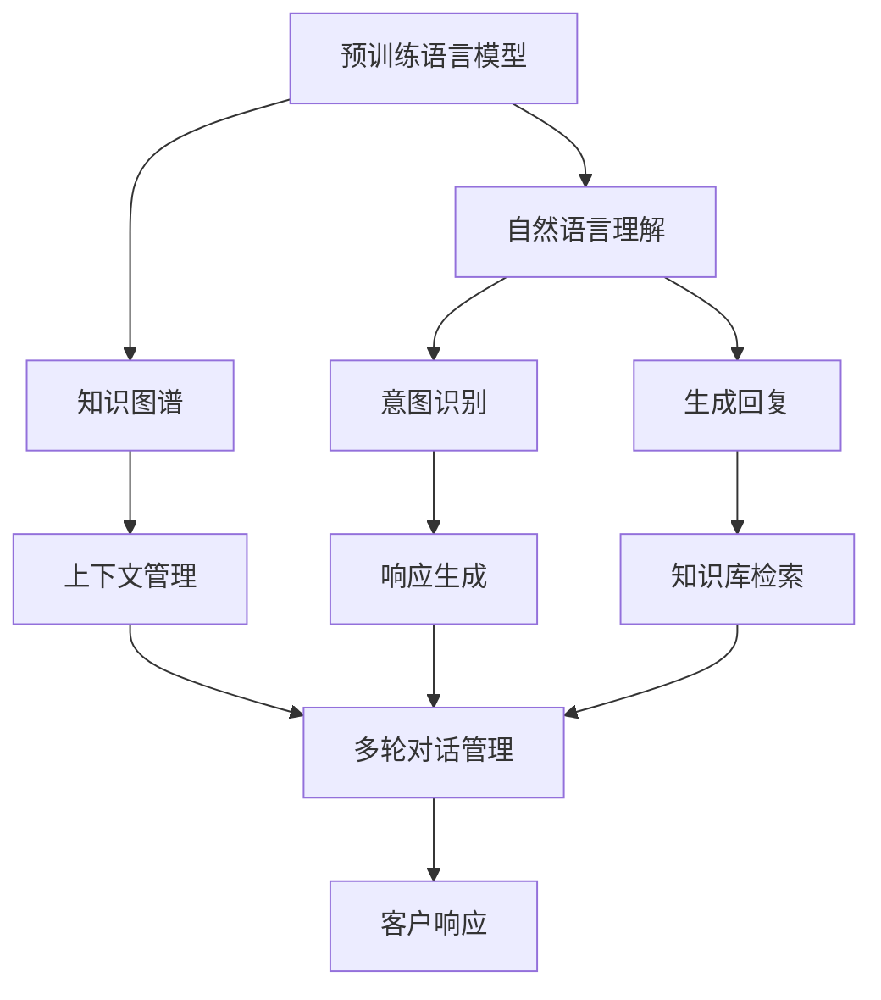

                 

## 1. 背景介绍

### 1.1 问题由来

智能客户服务系统（Customer Service System, CCS）是企业提升服务质量、降低运营成本、增强客户满意度的关键手段。随着信息技术的飞速发展，CCS已经从传统的电话客服、邮件支持，扩展到智能聊天机器人、在线客服咨询等多个维度。然而，传统的客服模式仍存在诸多局限，如响应速度慢、人工成本高、服务质量不稳定等问题。

近年来，自然语言处理（Natural Language Processing, NLP）技术在智能客户服务中的应用逐渐兴起。以深度学习、自然语言理解、自然语言生成（Natural Language Generation, NLG）等为核心的NLP技术，为CCS系统注入了强大的智能因素。其中，基于大规模语言模型（Large Language Model, LLM）的智能客户服务系统，由于其高度的自然语言理解和生成能力，展现了广阔的应用前景。

### 1.2 问题核心关键点

基于LLM的智能客户服务系统，通过自然语言理解和生成技术，能够实现对客户询问的自动理解、智能回答和个性化推荐等功能。具体而言，该系统的核心关键点包括：

1. **语言理解**：能够对客户输入的自然语言进行准确的语义理解，识别出其中的关键信息。
2. **知识存储**：拥有丰富的知识库和规则库，用于回答客户疑问和指导服务操作。
3. **生成回复**：能够根据理解到的语义和知识库，生成自然流畅的回复文本。
4. **实时互动**：能够实时响应用户查询，提供即时的服务支持。

### 1.3 问题研究意义

LLM在智能客户服务系统中的应用，具有以下几方面的重要意义：

1. **提升服务效率**：自动化的智能客服系统能够24小时在线响应客户，极大地提升了服务效率和客户满意度。
2. **降低运营成本**：智能客服系统可以替代部分人工客服岗位，大幅降低了企业的运营成本。
3. **增强服务质量**：智能客服系统具备强大的知识库和推理能力，能够提供准确、一致的服务。
4. **推动业务创新**：基于智能客服系统的数据分析和用户行为研究，可以为业务创新提供数据支持。

## 2. 核心概念与联系

### 2.1 核心概念概述

为了更好地理解基于LLM的智能客户服务系统，我们首先概述一些关键概念：

1. **大规模语言模型**：指通过预训练在大规模文本数据上学习到的语言模型。常见的预训练模型包括GPT、BERT等。这些模型具备强大的语言理解和生成能力，能够处理自然语言数据。
2. **自然语言处理**：涉及计算机如何处理和理解人类语言的技术。包括语言理解、语言生成、信息检索、机器翻译等多个子领域。
3. **知识图谱**：一种结构化的知识表示方法，用于描述实体之间的关系。可以用于回答复杂的查询，提供更加个性化的服务。
4. **对话管理**：对话系统的核心技术之一，负责对话流程的管理和控制。包括对话状态的跟踪、上下文的管理、意图识别等功能。
5. **情感分析**：从文本中提取和分析情感信息，用于提升客户服务的个性化和情感化。
6. **多轮对话**：在智能客户服务系统中，系统能够通过多轮对话获取更多信息，提供更加精准的服务。

这些概念之间具有紧密的联系，共同构成了智能客户服务系统的核心技术体系。

### 2.2 核心概念原理和架构的 Mermaid 流程图



该流程图展示了基于LLM的智能客户服务系统的主要组件和技术路径：

1. 预训练语言模型接收客户输入的文本，经过自然语言理解，生成用户意图。
2. 意图识别系统根据用户意图，选择相应的知识库进行检索。
3. 上下文管理系统记录对话历史，支持多轮对话。
4. 对话管理子系统控制对话流程，生成合适的回复。
5. 知识库检索系统从知识图谱中获取相关信息，丰富回复内容。
6. 最终，系统将生成的回复返回给客户。

## 3. 核心算法原理 & 具体操作步骤

### 3.1 算法原理概述

基于LLM的智能客户服务系统主要包含两个核心算法：自然语言理解和生成。

自然语言理解算法接收客户输入的文本，通过预训练的语言模型，将其转换为系统可以处理的结构化表示。常用的方法包括编码器-解码器结构、自编码器、注意力机制等。

自然语言生成算法将结构化表示转换为自然语言回复。常用的方法包括基于模板的生成、基于序列到序列的生成（Seq2Seq）、基于Transformer的生成等。

### 3.2 算法步骤详解

基于LLM的智能客户服务系统主要包括以下几个关键步骤：

1. **数据准备**：收集客户历史查询记录和人工标注的答案，构建训练集和验证集。
2. **模型选择**：选择合适的预训练语言模型作为初始模型。
3. **微调训练**：在训练集上进行微调训练，优化模型参数。
4. **部署上线**：将微调后的模型部署到智能客户服务系统中，提供实时服务。
5. **评估优化**：在验证集上评估模型性能，根据评估结果进行模型优化和改进。

### 3.3 算法优缺点

基于LLM的智能客户服务系统的优点包括：

1. **高效响应**：预训练模型能够快速理解客户输入，提供即时的回复。
2. **全面覆盖**：预训练模型经过大规模数据训练，可以覆盖多种常见问题和复杂场景。
3. **个性化服务**：通过用户对话历史和上下文信息，提供个性化的服务建议。
4. **易用性高**：系统可以自然语言交互，降低了客户使用门槛。

缺点包括：

1. **依赖预训练数据**：模型效果依赖于预训练数据的质量和规模。
2. **初始成本高**：预训练模型和微调过程需要大量计算资源和时间。
3. **需要人工干预**：当模型无法处理复杂问题时，仍需人工介入。
4. **数据隐私问题**：客户对话数据涉及个人隐私，需要合理的存储和保护措施。

### 3.4 算法应用领域

基于LLM的智能客户服务系统在多个领域具有广泛的应用前景：

1. **电商客服**：为用户提供产品咨询、订单处理、售后服务等支持。
2. **金融客服**：提供账户查询、理财咨询、风险预警等服务。
3. **医疗客服**：提供医疗咨询、健康管理、预约挂号等服务。
4. **教育客服**：提供课程咨询、学习支持、学业辅导等服务。
5. **公共服务**：提供政策咨询、办事指引、投诉处理等服务。

## 4. 数学模型和公式 & 详细讲解 & 举例说明

### 4.1 数学模型构建

我们以生成回复任务为例，构建基于LLM的智能客户服务系统的数学模型。假设预训练模型为 $M_{\theta}$，输入文本为 $x$，输出回复为 $y$，则生成回复的数学模型为：

$$
y = M_{\theta}(x)
$$

其中 $\theta$ 为预训练模型的参数。在训练过程中，我们希望最小化预测回复与真实回复之间的差异，即：

$$
\min_{\theta} \mathcal{L}(M_{\theta}, D)
$$

其中 $D$ 为训练数据集，$\mathcal{L}$ 为损失函数。常用的损失函数包括交叉熵损失、均方误差损失等。

### 4.2 公式推导过程

以交叉熵损失函数为例，其计算公式如下：

$$
\mathcal{L}(M_{\theta}, D) = -\frac{1}{N}\sum_{i=1}^N \sum_{j=1}^C y_{ij} \log \hat{y}_{ij}
$$

其中 $N$ 为样本数量，$C$ 为类别数量，$y_{ij}$ 为真实标签，$\hat{y}_{ij}$ 为模型预测的概率分布。

在模型训练过程中，我们通过反向传播算法计算梯度，并使用优化算法（如AdamW、SGD等）更新模型参数 $\theta$，使得损失函数 $\mathcal{L}$ 最小化。具体步骤如下：

1. 前向传播：将输入 $x_i$ 输入模型，计算得到输出 $\hat{y}_i$。
2. 计算损失：根据真实标签 $y_i$ 和预测概率分布 $\hat{y}_i$，计算交叉熵损失。
3. 反向传播：计算损失函数对模型参数的梯度，并更新模型参数。
4. 重复上述步骤直至收敛。

### 4.3 案例分析与讲解

以电商客服为例，假设客户输入的查询为“请问这款产品的保修期是多长时间？”，预训练模型生成的回答为“该产品的保修期为2年，具体以购买协议为准”。其数学模型和公式推导过程如下：

1. **数据准备**：收集客户历史查询记录和人工标注的答案，构建训练集和验证集。
2. **模型选择**：选择BERT或GPT等预训练模型。
3. **微调训练**：在训练集上进行微调训练，优化模型参数。
4. **生成回复**：将客户输入的查询输入模型，生成自然语言回复。

## 5. 项目实践：代码实例和详细解释说明

### 5.1 开发环境搭建

在进行智能客户服务系统的开发前，我们需要准备好开发环境。以下是使用Python进行PyTorch开发的环境配置流程：

1. 安装Anaconda：从官网下载并安装Anaconda，用于创建独立的Python环境。

2. 创建并激活虚拟环境：
```bash
conda create -n pytorch-env python=3.8 
conda activate pytorch-env
```

3. 安装PyTorch：根据CUDA版本，从官网获取对应的安装命令。例如：
```bash
conda install pytorch torchvision torchaudio cudatoolkit=11.1 -c pytorch -c conda-forge
```

4. 安装Transformers库：
```bash
pip install transformers
```

5. 安装各类工具包：
```bash
pip install numpy pandas scikit-learn matplotlib tqdm jupyter notebook ipython
```

完成上述步骤后，即可在`pytorch-env`环境中开始微调实践。

### 5.2 源代码详细实现

下面我们以生成回复任务为例，给出使用Transformers库对BERT模型进行微调的PyTorch代码实现。

首先，定义模型和优化器：

```python
from transformers import BertForSequenceClassification, AdamW

model = BertForSequenceClassification.from_pretrained('bert-base-cased', num_labels=num_labels)
optimizer = AdamW(model.parameters(), lr=2e-5)
```

接着，定义训练和评估函数：

```python
from torch.utils.data import DataLoader
from tqdm import tqdm
from sklearn.metrics import classification_report

device = torch.device('cuda') if torch.cuda.is_available() else torch.device('cpu')
model.to(device)

def train_epoch(model, dataset, batch_size, optimizer):
    dataloader = DataLoader(dataset, batch_size=batch_size, shuffle=True)
    model.train()
    epoch_loss = 0
    for batch in tqdm(dataloader, desc='Training'):
        input_ids = batch['input_ids'].to(device)
        attention_mask = batch['attention_mask'].to(device)
        labels = batch['labels'].to(device)
        model.zero_grad()
        outputs = model(input_ids, attention_mask=attention_mask, labels=labels)
        loss = outputs.loss
        epoch_loss += loss.item()
        loss.backward()
        optimizer.step()
    return epoch_loss / len(dataloader)

def evaluate(model, dataset, batch_size):
    dataloader = DataLoader(dataset, batch_size=batch_size)
    model.eval()
    preds, labels = [], []
    with torch.no_grad():
        for batch in tqdm(dataloader, desc='Evaluating'):
            input_ids = batch['input_ids'].to(device)
            attention_mask = batch['attention_mask'].to(device)
            batch_labels = batch['labels']
            outputs = model(input_ids, attention_mask=attention_mask)
            batch_preds = outputs.logits.argmax(dim=2).to('cpu').tolist()
            batch_labels = batch_labels.to('cpu').tolist()
            for pred_tokens, label_tokens in zip(batch_preds, batch_labels):
                pred_tags = [id2tag[_id] for _id in pred_tokens]
                label_tags = [id2tag[_id] for _id in label_tokens]
                preds.append(pred_tags[:len(label_tokens)])
                labels.append(label_tags)
                
    print(classification_report(labels, preds))
```

最后，启动训练流程并在测试集上评估：

```python
epochs = 5
batch_size = 16

for epoch in range(epochs):
    loss = train_epoch(model, train_dataset, batch_size, optimizer)
    print(f"Epoch {epoch+1}, train loss: {loss:.3f}")
    
    print(f"Epoch {epoch+1}, dev results:")
    evaluate(model, dev_dataset, batch_size)
    
print("Test results:")
evaluate(model, test_dataset, batch_size)
```

以上就是使用PyTorch对BERT进行生成回复任务微调的完整代码实现。可以看到，得益于Transformers库的强大封装，我们可以用相对简洁的代码完成BERT模型的加载和微调。

### 5.3 代码解读与分析

让我们再详细解读一下关键代码的实现细节：

**BertForSequenceClassification类**：
- `__init__`方法：初始化模型结构和标签数量。
- `from_pretrained`方法：从预训练模型库加载模型。
- `to`方法：将模型迁移到指定的设备。

**AdamW优化器**：
- 自动学习率调度，适应不同的数据集大小。
- 具有自适应学习率调整和动量调整的能力，提高了收敛速度和稳定性。

**train_epoch函数**：
- 使用PyTorch的DataLoader对数据集进行批次化加载，供模型训练和推理使用。
- 在每个epoch内，对数据集进行多轮训练，更新模型参数。

**evaluate函数**：
- 在验证集上评估模型性能，输出分类指标。
- 使用sklearn的classification_report对预测结果进行详细分析。

**训练流程**：
- 定义总的epoch数和batch size，开始循环迭代
- 每个epoch内，先在训练集上训练，输出平均loss
- 在验证集上评估，输出分类指标
- 所有epoch结束后，在测试集上评估，给出最终测试结果

可以看到，PyTorch配合Transformers库使得BERT微调的代码实现变得简洁高效。开发者可以将更多精力放在数据处理、模型改进等高层逻辑上，而不必过多关注底层的实现细节。

当然，工业级的系统实现还需考虑更多因素，如模型的保存和部署、超参数的自动搜索、更灵活的任务适配层等。但核心的微调范式基本与此类似。

## 6. 实际应用场景

### 6.1 智能客服系统

基于大语言模型微调的对话技术，可以广泛应用于智能客服系统的构建。传统客服往往需要配备大量人力，高峰期响应缓慢，且一致性和专业性难以保证。而使用微调后的对话模型，可以7x24小时不间断服务，快速响应客户咨询，用自然流畅的语言解答各类常见问题。

在技术实现上，可以收集企业内部的历史客服对话记录，将问题和最佳答复构建成监督数据，在此基础上对预训练对话模型进行微调。微调后的对话模型能够自动理解用户意图，匹配最合适的答案模板进行回复。对于客户提出的新问题，还可以接入检索系统实时搜索相关内容，动态组织生成回答。如此构建的智能客服系统，能大幅提升客户咨询体验和问题解决效率。

### 6.2 金融舆情监测

金融机构需要实时监测市场舆论动向，以便及时应对负面信息传播，规避金融风险。传统的人工监测方式成本高、效率低，难以应对网络时代海量信息爆发的挑战。基于大语言模型微调的文本分类和情感分析技术，为金融舆情监测提供了新的解决方案。

具体而言，可以收集金融领域相关的新闻、报道、评论等文本数据，并对其进行主题标注和情感标注。在此基础上对预训练语言模型进行微调，使其能够自动判断文本属于何种主题，情感倾向是正面、中性还是负面。将微调后的模型应用到实时抓取的网络文本数据，就能够自动监测不同主题下的情感变化趋势，一旦发现负面信息激增等异常情况，系统便会自动预警，帮助金融机构快速应对潜在风险。

### 6.3 个性化推荐系统

当前的推荐系统往往只依赖用户的历史行为数据进行物品推荐，无法深入理解用户的真实兴趣偏好。基于大语言模型微调技术，个性化推荐系统可以更好地挖掘用户行为背后的语义信息，从而提供更精准、多样的推荐内容。

在实践中，可以收集用户浏览、点击、评论、分享等行为数据，提取和用户交互的物品标题、描述、标签等文本内容。将文本内容作为模型输入，用户的后续行为（如是否点击、购买等）作为监督信号，在此基础上微调预训练语言模型。微调后的模型能够从文本内容中准确把握用户的兴趣点。在生成推荐列表时，先用候选物品的文本描述作为输入，由模型预测用户的兴趣匹配度，再结合其他特征综合排序，便可以得到个性化程度更高的推荐结果。

### 6.4 未来应用展望

随着大语言模型和微调方法的不断发展，基于微调范式将在更多领域得到应用，为传统行业带来变革性影响。

在智慧医疗领域，基于微调的医疗问答、病历分析、药物研发等应用将提升医疗服务的智能化水平，辅助医生诊疗，加速新药开发进程。

在智能教育领域，微调技术可应用于作业批改、学情分析、知识推荐等方面，因材施教，促进教育公平，提高教学质量。

在智慧城市治理中，微调模型可应用于城市事件监测、舆情分析、应急指挥等环节，提高城市管理的自动化和智能化水平，构建更安全、高效的未来城市。

此外，在企业生产、社会治理、文娱传媒等众多领域，基于大模型微调的人工智能应用也将不断涌现，为经济社会发展注入新的动力。相信随着预训练语言模型和微调方法的持续演进，未来大语言模型微调必将在构建人机协同的智能时代中扮演越来越重要的角色。

## 7. 工具和资源推荐

### 7.1 学习资源推荐

为了帮助开发者系统掌握大语言模型微调的理论基础和实践技巧，这里推荐一些优质的学习资源：

1. 《Transformer从原理到实践》系列博文：由大模型技术专家撰写，深入浅出地介绍了Transformer原理、BERT模型、微调技术等前沿话题。

2. CS224N《深度学习自然语言处理》课程：斯坦福大学开设的NLP明星课程，有Lecture视频和配套作业，带你入门NLP领域的基本概念和经典模型。

3. 《Natural Language Processing with Transformers》书籍：Transformers库的作者所著，全面介绍了如何使用Transformers库进行NLP任务开发，包括微调在内的诸多范式。

4. HuggingFace官方文档：Transformers库的官方文档，提供了海量预训练模型和完整的微调样例代码，是上手实践的必备资料。

5. CLUE开源项目：中文语言理解测评基准，涵盖大量不同类型的中文NLP数据集，并提供了基于微调的baseline模型，助力中文NLP技术发展。

通过对这些资源的学习实践，相信你一定能够快速掌握大语言模型微调的精髓，并用于解决实际的NLP问题。

### 7.2 开发工具推荐

高效的开发离不开优秀的工具支持。以下是几款用于大语言模型微调开发的常用工具：

1. PyTorch：基于Python的开源深度学习框架，灵活动态的计算图，适合快速迭代研究。大部分预训练语言模型都有PyTorch版本的实现。

2. TensorFlow：由Google主导开发的开源深度学习框架，生产部署方便，适合大规模工程应用。同样有丰富的预训练语言模型资源。

3. Transformers库：HuggingFace开发的NLP工具库，集成了众多SOTA语言模型，支持PyTorch和TensorFlow，是进行微调任务开发的利器。

4. Weights & Biases：模型训练的实验跟踪工具，可以记录和可视化模型训练过程中的各项指标，方便对比和调优。与主流深度学习框架无缝集成。

5. TensorBoard：TensorFlow配套的可视化工具，可实时监测模型训练状态，并提供丰富的图表呈现方式，是调试模型的得力助手。

6. Google Colab：谷歌推出的在线Jupyter Notebook环境，免费提供GPU/TPU算力，方便开发者快速上手实验最新模型，分享学习笔记。

合理利用这些工具，可以显著提升大语言模型微调任务的开发效率，加快创新迭代的步伐。

### 7.3 相关论文推荐

大语言模型和微调技术的发展源于学界的持续研究。以下是几篇奠基性的相关论文，推荐阅读：

1. Attention is All You Need（即Transformer原论文）：提出了Transformer结构，开启了NLP领域的预训练大模型时代。

2. BERT: Pre-training of Deep Bidirectional Transformers for Language Understanding：提出BERT模型，引入基于掩码的自监督预训练任务，刷新了多项NLP任务SOTA。

3. Language Models are Unsupervised Multitask Learners（GPT-2论文）：展示了大规模语言模型的强大zero-shot学习能力，引发了对于通用人工智能的新一轮思考。

4. Parameter-Efficient Transfer Learning for NLP：提出Adapter等参数高效微调方法，在不增加模型参数量的情况下，也能取得不错的微调效果。

5. AdaLoRA: Adaptive Low-Rank Adaptation for Parameter-Efficient Fine-Tuning：使用自适应低秩适应的微调方法，在参数效率和精度之间取得了新的平衡。

这些论文代表了大语言模型微调技术的发展脉络。通过学习这些前沿成果，可以帮助研究者把握学科前进方向，激发更多的创新灵感。

## 8. 总结：未来发展趋势与挑战

### 8.1 总结

本文对基于大语言模型的智能客户服务系统进行了全面系统的介绍。首先阐述了智能客户服务系统的背景和需求，明确了LLM在智能客户服务系统中的应用价值。其次，从原理到实践，详细讲解了LLM在智能客户服务系统中的核心算法和具体操作步骤，给出了微调任务开发的完整代码实例。同时，本文还广泛探讨了LLM在智能客户服务系统的实际应用场景，展示了其广阔的应用前景。此外，本文精选了微调技术的各类学习资源，力求为读者提供全方位的技术指引。

通过本文的系统梳理，可以看到，基于大语言模型的智能客户服务系统具有强大的自然语言处理能力，能够高效、全面、个性化地支持客户服务。在未来，随着技术的不断进步，智能客户服务系统将变得更加智能、灵活和可靠，极大地提升企业的服务质量和效率。

### 8.2 未来发展趋势

展望未来，智能客户服务系统的发展将呈现以下几个趋势：

1. **智能化程度提升**：随着预训练模型的参数量和计算能力的提升，智能客户服务系统的智能化程度将进一步提升，能够处理更加复杂和多样化的用户需求。
2. **多模态融合**：未来的智能客户服务系统将不仅仅是文本交互，还将整合语音、图像、视频等多模态信息，提供更加全面、直观的用户体验。
3. **个性化推荐**：智能客户服务系统将与个性化推荐系统深度融合，通过用户行为和偏好分析，提供更加精准、个性化的服务。
4. **实时数据分析**：系统将具备强大的实时数据分析能力，能够动态调整服务策略，提升服务效率和质量。
5. **智能对话管理**：对话管理子系统将更加智能化，能够自动识别对话主题、情绪、意图，动态调整服务策略，提供更加自然、流畅的对话体验。

以上趋势凸显了智能客户服务系统的广阔前景。这些方向的探索发展，必将进一步提升智能客户服务系统的性能和用户体验，成为企业提升服务质量、降低运营成本的重要手段。

### 8.3 面临的挑战

尽管智能客户服务系统取得了显著进展，但在实现普及应用的过程中，仍面临诸多挑战：

1. **数据隐私问题**：智能客户服务系统需要大量用户数据，涉及用户隐私保护。如何在数据利用和隐私保护之间找到平衡，是亟需解决的问题。
2. **模型鲁棒性不足**：智能客户服务系统在处理各种复杂场景时，仍存在鲁棒性不足的问题。如何提高模型的泛化能力，避免因数据偏差导致的异常情况，是未来研究的重要方向。
3. **技术复杂度高**：智能客户服务系统的开发和部署需要较高的技术门槛，涉及自然语言处理、机器学习、系统架构等多个领域，技术复杂度较高。
4. **多语言支持不足**：当前的智能客户服务系统主要针对英语等主流语言，对多语言支持的普及还存在挑战。如何扩展系统功能，支持多种语言和方言，是未来的重要课题。
5. **跨平台兼容性差**：智能客户服务系统需要在不同的平台和设备上运行，如何确保跨平台兼容性，优化系统性能，是未来的关键问题。

正视智能客户服务系统面临的这些挑战，积极应对并寻求突破，将是大语言模型微调技术迈向成熟的重要保障。相信随着学界和产业界的共同努力，这些挑战终将一一被克服，智能客户服务系统必将在构建人机协同的智能时代中扮演越来越重要的角色。

### 8.4 研究展望

未来，智能客户服务系统的研究将从以下几个方向进行突破：

1. **无监督和半监督微调方法**：探索不依赖大规模标注数据的微调方法，利用自监督学习、主动学习等技术，最大限度利用非结构化数据，实现更加灵活高效的微调。
2. **多轮对话管理**：研究更加智能化、鲁棒化的对话管理策略，提高系统处理多轮对话、复杂场景的能力。
3. **知识图谱与推理**：引入知识图谱和多模态信息，增强系统的知识表示和推理能力，提供更加全面、准确的服务。
4. **情感分析和个性化服务**：通过情感分析技术，提升系统的情感识别和响应能力，提供更加个性化、人性化的服务。
5. **实时数据分析和决策支持**：研究实时数据分析和决策支持技术，通过数据挖掘和机器学习，提供更加精准、智能的服务建议。

这些研究方向的探索，将进一步推动智能客户服务系统的智能化水平，提升用户体验，推动企业的数字化转型。相信在技术不断进步的推动下，智能客户服务系统必将迎来更加广阔的发展前景。

## 9. 附录：常见问题与解答

**Q1：智能客户服务系统的主要应用场景有哪些？**

A: 智能客户服务系统的主要应用场景包括但不限于：

1. **电商客服**：为用户提供产品咨询、订单处理、售后服务等支持。
2. **金融客服**：提供账户查询、理财咨询、风险预警等服务。
3. **医疗客服**：提供医疗咨询、健康管理、预约挂号等服务。
4. **教育客服**：提供课程咨询、学习支持、学业辅导等服务。
5. **公共服务**：提供政策咨询、办事指引、投诉处理等服务。

**Q2：智能客户服务系统如何处理多轮对话？**

A: 智能客户服务系统处理多轮对话主要通过以下步骤：

1. **意图识别**：对客户的输入文本进行意图识别，判断其当前需求。
2. **对话状态管理**：记录对话历史，维护对话状态，确保上下文信息的连续性。
3. **上下文信息融合**：结合上下文信息和当前输入，更新对话状态。
4. **回复生成**：根据对话状态，生成自然流畅的回复。

多轮对话处理的关键在于对话状态的维护和上下文信息的利用，确保系统能够理解客户需求，提供连续、准确的服务。

**Q3：智能客户服务系统在实际应用中需要注意哪些问题？**

A: 智能客户服务系统在实际应用中需要注意以下问题：

1. **数据隐私保护**：确保用户数据的安全存储和传输，防止数据泄露。
2. **模型鲁棒性**：提高系统在面对噪声、干扰等异常情况时的鲁棒性，避免因数据偏差导致的异常响应。
3. **跨平台兼容性**：确保系统在各种设备、操作系统和语言环境下的稳定运行。
4. **用户界面友好**：提升系统的交互界面友好性，降低用户使用门槛。
5. **性能优化**：优化系统响应速度和资源消耗，提升用户体验。

这些问题的解决将有助于智能客户服务系统在实际应用中的可靠性和可用性。

**Q4：智能客户服务系统如何进行情感分析？**

A: 智能客户服务系统进行情感分析主要通过以下步骤：

1. **数据准备**：收集情感标注的数据集，如电影评论、社交媒体帖子等。
2. **模型训练**：使用情感标注数据训练情感分析模型，如基于深度学习的模型（如LSTM、BERT等）。
3. **情感识别**：对客户输入的文本进行情感分类，识别其中的情感倾向。
4. **情感响应**：根据情感分类结果，生成合适的情感响应，如安慰、表扬、道歉等。

情感分析是智能客户服务系统提升服务体验和情感化水平的重要手段，通过情感分析，系统能够更好地理解客户情感，提供更加贴心、个性化的服务。

**Q5：智能客户服务系统如何进行个性化推荐？**

A: 智能客户服务系统进行个性化推荐主要通过以下步骤：

1. **数据收集**：收集用户的历史行为数据，如浏览记录、点击行为等。
2. **特征提取**：提取用户行为特征，如浏览时间、点击位置等。
3. **模型训练**：使用用户行为数据训练推荐模型，如基于深度学习的推荐模型（如Seq2Seq、BERT等）。
4. **推荐生成**：根据用户行为特征和当前需求，生成个性化的推荐内容。

个性化推荐是智能客户服务系统提升用户体验的重要手段，通过个性化推荐，系统能够更好地满足用户需求，提供更加精准的服务。

---

作者：禅与计算机程序设计艺术 / Zen and the Art of Computer Programming

