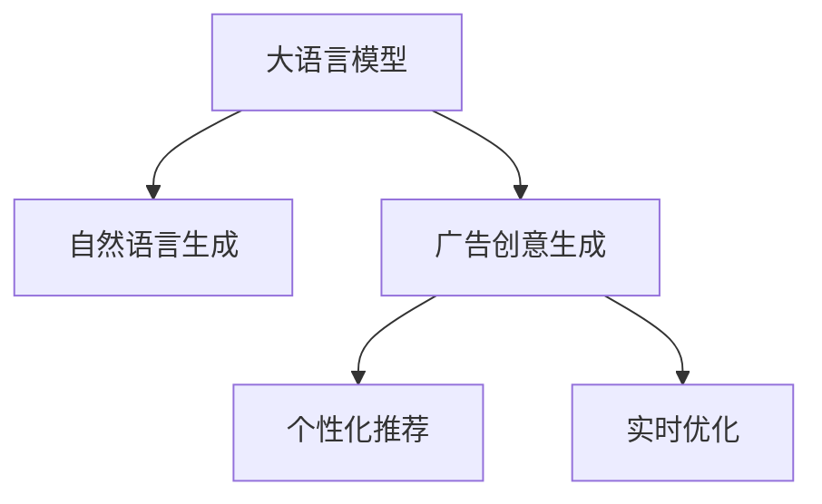

                 

# LLM在智能广告创意生成中的应用探索

> 关键词：大语言模型(LLM), 广告创意生成, 自然语言处理(NLP), 自然语言生成(NLG), 数据驱动创新

## 1. 背景介绍

### 1.1 问题由来
广告创意生成是现代市场营销中至关重要的环节，其目的是在有限的预算内最大化地吸引潜在客户。传统的广告创意生成主要依赖人工创意，不仅效率低下，且成本高昂。然而，随着人工智能和大语言模型技术的发展，通过深度学习和自然语言生成(NLG)技术，可以自动化生成高质量的广告创意。

近年来，大语言模型(Large Language Model, LLM)在自然语言处理(NLP)领域取得了突破性进展。诸如GPT-3、BERT等模型通过在大量文本数据上进行预训练，能够生成自然流畅、内容丰富的文本。广告创意生成作为一项具有创新性的应用，借助大语言模型可以大幅提升工作效率和质量。

### 1.2 问题核心关键点
大语言模型在广告创意生成中的应用，主要通过以下核心技术实现：
1. **自然语言生成**：将目标广告创意以自然语言形式表达，通过语言模型进行生成。
2. **广告风格学习**：从已有广告数据中学习广告创意的风格和元素，如用词、句式、视觉符号等。
3. **用户行为分析**：基于用户的历史行为数据，优化广告创意的针对性和个性化。
4. **实时优化**：在广告投放过程中，利用实时数据分析调整创意内容，提高广告效果。

通过大语言模型的这些能力，可以在短时间内生成大量的广告创意，并通过优化机制不断提升广告的效果和转化率。

### 1.3 问题研究意义
大语言模型在广告创意生成中的应用，具有以下重要意义：
1. **提升效率**：大模型能够自动生成广告创意，减少了人工创意的开发周期和成本。
2. **提高质量**：通过学习大量广告数据，生成的广告创意更加符合用户需求和市场趋势。
3. **个性化推荐**：基于用户行为数据，生成具有高度针对性的广告，提升广告效果。
4. **实时优化**：通过实时数据分析，持续优化广告创意，保持广告策略的时效性和灵活性。

这些优势使得大语言模型在广告创意生成中的应用前景广阔，成为广告技术创新的重要方向。

## 2. 核心概念与联系

### 2.1 核心概念概述

为更好地理解基于大语言模型的广告创意生成，本节将介绍几个密切相关的核心概念：

- **大语言模型(Large Language Model, LLM)**：如GPT-3、BERT等预训练语言模型。通过在海量文本数据上进行预训练，学习到丰富的语言知识和表达能力。
- **自然语言生成(Natural Language Generation, NLG)**：指通过机器生成自然语言文本的技术，常用于智能客服、内容创作等领域。
- **广告创意生成**：在限定广告预算和内容格式下，生成具有吸引力和转化力的广告文本或视觉内容。
- **数据驱动创新**：利用大数据分析和技术，驱动产品创新和业务优化，提高市场竞争力。
- **个性化推荐**：根据用户的历史行为和偏好，推荐最符合其需求的内容或产品。
- **实时优化**：在广告投放过程中，根据实时数据分析调整广告内容，以提升广告效果。

这些核心概念之间的逻辑关系可以通过以下Mermaid流程图来展示：



这个流程图展示了大语言模型的核心概念及其之间的关系：

1. 大语言模型通过预训练获得基础能力。
2. 自然语言生成技术实现广告创意的自动化生成。
3. 广告创意生成过程中引入个性化推荐和实时优化，以提升广告效果和用户体验。

## 3. 核心算法原理 & 具体操作步骤
### 3.1 算法原理概述

基于大语言模型的广告创意生成，本质上是一个自然语言生成任务。其核心思想是：将大语言模型视为一个强大的自然语言生成器，通过学习和优化，生成符合广告主题和目标受众的创意文本。

假设广告主题为 $\text{ad\_topic}$，目标受众为 $\text{target\_audience}$。目标广告创意为 $\text{ad\_content}$。形式化地，假设模型为 $M_{\theta}$，其中 $\theta$ 为模型参数。广告创意生成的优化目标为最小化语言模型在目标受众上的预测误差：

$$
\theta^* = \mathop{\arg\min}_{\theta} \mathcal{L}(M_{\theta}, \text{target\_audience})
$$

其中 $\mathcal{L}$ 为针对目标受众的损失函数，通常使用交叉熵损失或BCE损失。

### 3.2 算法步骤详解

基于大语言模型在广告创意生成中的应用，一般包括以下几个关键步骤：

**Step 1: 准备预训练模型和数据集**
- 选择合适的预训练语言模型 $M_{\theta}$ 作为初始化参数，如 GPT-3、BERT 等。
- 准备广告创意生成的标注数据集 $D=\{(ad\_topic, ad\_content)\}_{i=1}^N$，每个广告创意由广告主题和创意文本构成。

**Step 2: 添加任务适配层**
- 根据广告创意生成的任务类型，在预训练模型顶层设计合适的输出层和损失函数。
- 对于文本生成任务，通常使用语言模型的解码器输出概率分布，并以负对数似然为损失函数。

**Step 3: 设置微调超参数**
- 选择合适的优化算法及其参数，如 Adam、SGD 等，设置学习率、批大小、迭代轮数等。
- 设置正则化技术及强度，包括权重衰减、Dropout、Early Stopping 等。
- 确定冻结预训练参数的策略，如仅微调顶层，或全部参数都参与微调。

**Step 4: 执行梯度训练**
- 将训练集数据分批次输入模型，前向传播计算损失函数。
- 反向传播计算参数梯度，根据设定的优化算法和学习率更新模型参数。
- 周期性在验证集上评估模型性能，根据性能指标决定是否触发 Early Stopping。
- 重复上述步骤直到满足预设的迭代轮数或 Early Stopping 条件。

**Step 5: 测试和部署**
- 在测试集上评估微调后模型 $M_{\hat{\theta}}$ 的性能，对比微调前后的创意生成效果。
- 使用微调后的模型对新广告主题生成创意，集成到实际的广告投放系统中。
- 持续收集广告效果数据，定期重新微调模型，以适应数据分布的变化。

以上是基于大语言模型在广告创意生成中的一般流程。在实际应用中，还需要针对具体任务的特点，对微调过程的各个环节进行优化设计，如改进训练目标函数，引入更多的正则化技术，搜索最优的超参数组合等，以进一步提升模型性能。

### 3.3 算法优缺点

基于大语言模型的广告创意生成方法具有以下优点：
1. 高效生成创意。大模型能够快速生成大量高质量的广告创意，提升广告创意的产出效率。
2. 创意多样性。通过微调，大模型可以学习到丰富的广告创意元素，生成内容丰富多样的广告。
3. 个性化推荐。基于用户行为数据，生成具有高度针对性的广告创意，提升广告效果。
4. 实时优化。利用实时数据分析，动态调整广告创意，保持广告策略的时效性和灵活性。

同时，该方法也存在一定的局限性：
1. 依赖标注数据。微调的效果很大程度上取决于标注数据的质量和数量，获取高质量标注数据的成本较高。
2. 迁移能力有限。当目标广告创意与预训练数据的分布差异较大时，微调的性能提升有限。
3. 创意质量不稳定。由于广告创意生成的随机性，有时生成的创意质量不稳定，可能无法满足具体广告需求。
4. 可解释性不足。广告创意生成的过程通常缺乏可解释性，难以对其推理逻辑进行分析和调试。

尽管存在这些局限性，但就目前而言，基于大语言模型的广告创意生成方法仍是最主流范式。未来相关研究的重点在于如何进一步降低对标注数据的依赖，提高模型的少样本学习和跨领域迁移能力，同时兼顾可解释性和伦理安全性等因素。

### 3.4 算法应用领域

大语言模型在广告创意生成中的应用，已经在多个领域得到验证和推广，例如：

- 品牌推广：通过大模型生成具有品牌特色的广告创意，提升品牌知名度和影响力。
- 社交媒体营销：生成针对不同社交媒体平台风格的广告内容，最大化广告转化率。
- 电商平台：为电商平台生成各类商品广告，提升电商销量和用户体验。
- 广告联盟：在广告联盟网络中，生成符合联盟要求的广告创意，提升联盟收益。

除了上述这些经典应用外，大语言模型还被创新性地应用于广告创意生成的新场景中，如AR/VR广告、动态广告等，为广告创意生成带来了新的突破。

## 4. 数学模型和公式 & 详细讲解 & 举例说明

### 4.1 数学模型构建

假设广告主题为 $\text{ad\_topic}$，目标受众为 $\text{target\_audience}$，目标广告创意为 $\text{ad\_content}$。广告创意生成的优化目标为最小化语言模型在目标受众上的预测误差：

$$
\theta^* = \mathop{\arg\min}_{\theta} \mathcal{L}(M_{\theta}, \text{target\_audience})
$$

其中 $\mathcal{L}$ 为针对目标受众的损失函数，通常使用交叉熵损失或BCE损失：

$$
\mathcal{L}(M_{\theta}, \text{target\_audience}) = -\sum_{i=1}^N \log(M_{\theta}(\text{ad\_topic}_i|\text{target\_audience}_i))
$$

目标受众 $\text{target\_audience}$ 可以是用户的兴趣标签、地理位置、行为数据等。广告创意 $\text{ad\_content}$ 可以是文本描述、图片、视频等。

### 4.2 公式推导过程

以生成文本广告创意为例，推导其数学模型和优化目标。假设广告主题为 $\text{ad\_topic}$，目标受众为 $\text{target\_audience}$，目标广告创意为 $\text{ad\_content}$。目标受众 $\text{target\_audience}$ 为向量形式，即 $\text{target\_audience} = [t_1, t_2, \cdots, t_n]$，其中 $t_i$ 为受众的兴趣标签或行为特征。

形式化地，假设广告创意生成模型为 $M_{\theta}$，其中 $\theta$ 为模型参数。则目标广告创意 $\text{ad\_content}$ 可以表示为：

$$
\text{ad\_content} = M_{\theta}(\text{ad\_topic}, \text{target\_audience})
$$

目标广告创意生成的损失函数为交叉熵损失：

$$
\mathcal{L}(M_{\theta}, \text{target\_audience}) = -\sum_{i=1}^N \log(M_{\theta}(\text{ad\_topic}_i|\text{target\_audience}_i))
$$

其中 $N$ 为广告创意数量，$\text{ad\_topic}_i$ 和 $\text{target\_audience}_i$ 分别表示第 $i$ 个广告的主题和受众。

### 4.3 案例分析与讲解

以生成电影广告创意为例，假设某电影公司希望生成一部新电影的广告创意。首先，收集该电影的目标受众数据，如年龄、性别、兴趣爱好等。然后，将电影主题和受众数据输入到预训练的BERT模型中，通过微调生成广告创意文本。

假设电影主题为 "The Matrix"，目标受众为 "18-25岁、男性、科幻爱好者"。广告创意生成的目标函数为交叉熵损失：

$$
\mathcal{L}(M_{\theta}, \text{target\_audience}) = -\log(M_{\theta}(\text{The Matrix} | 18-25岁, 男性, 科幻爱好者))
$$

其中 $\text{The Matrix}$ 为电影标题，"18-25岁, 男性, 科幻爱好者" 为受众标签。

通过优化上述目标函数，模型将生成符合目标受众喜好的广告创意文本，如 "Netflix官方推荐，The Matrix 震撼上映，未来在握，科幻狂潮席卷而来！".

## 5. 项目实践：代码实例和详细解释说明

### 5.1 开发环境搭建

在进行广告创意生成实践前，我们需要准备好开发环境。以下是使用Python进行PyTorch开发的环境配置流程：

1. 安装Anaconda：从官网下载并安装Anaconda，用于创建独立的Python环境。

2. 创建并激活虚拟环境：
```bash
conda create -n pytorch-env python=3.8 
conda activate pytorch-env
```

3. 安装PyTorch：根据CUDA版本，从官网获取对应的安装命令。例如：
```bash
conda install pytorch torchvision torchaudio cudatoolkit=11.1 -c pytorch -c conda-forge
```

4. 安装Transformers库：
```bash
pip install transformers
```

5. 安装各类工具包：
```bash
pip install numpy pandas scikit-learn matplotlib tqdm jupyter notebook ipython
```

完成上述步骤后，即可在`pytorch-env`环境中开始广告创意生成实践。

### 5.2 源代码详细实现

下面我们以电影广告创意生成为例，给出使用Transformers库对BERT模型进行广告创意生成的PyTorch代码实现。

首先，定义广告创意生成的数据处理函数：

```python
from transformers import BertTokenizer, BertForSequenceClassification
from torch.utils.data import Dataset, DataLoader
import torch

class AdDataset(Dataset):
    def __init__(self, texts, labels, tokenizer, max_len=128):
        self.texts = texts
        self.labels = labels
        self.tokenizer = tokenizer
        self.max_len = max_len
        
    def __len__(self):
        return len(self.texts)
    
    def __getitem__(self, item):
        text = self.texts[item]
        label = self.labels[item]
        
        encoding = self.tokenizer(text, return_tensors='pt', max_length=self.max_len, padding='max_length', truncation=True)
        input_ids = encoding['input_ids'][0]
        attention_mask = encoding['attention_mask'][0]
        
        # 对标签进行编码
        label = label2id[label] # 将标签编码成数字
        label = torch.tensor(label, dtype=torch.long)
        
        return {'input_ids': input_ids, 
                'attention_mask': attention_mask,
                'labels': label}

# 标签与id的映射
label2id = {'The Matrix': 0, '阿凡达': 1, '漫威电影': 2}
id2label = {v: k for k, v in label2id.items()}
```

然后，定义模型和优化器：

```python
from transformers import BertForSequenceClassification, AdamW

model = BertForSequenceClassification.from_pretrained('bert-base-cased', num_labels=len(label2id))

optimizer = AdamW(model.parameters(), lr=2e-5)
```

接着，定义训练和评估函数：

```python
from tqdm import tqdm

device = torch.device('cuda') if torch.cuda.is_available() else torch.device('cpu')
model.to(device)

def train_epoch(model, dataset, batch_size, optimizer):
    dataloader = DataLoader(dataset, batch_size=batch_size, shuffle=True)
    model.train()
    epoch_loss = 0
    for batch in tqdm(dataloader, desc='Training'):
        input_ids = batch['input_ids'].to(device)
        attention_mask = batch['attention_mask'].to(device)
        labels = batch['labels'].to(device)
        model.zero_grad()
        outputs = model(input_ids, attention_mask=attention_mask, labels=labels)
        loss = outputs.loss
        epoch_loss += loss.item()
        loss.backward()
        optimizer.step()
    return epoch_loss / len(dataloader)

def evaluate(model, dataset, batch_size):
    dataloader = DataLoader(dataset, batch_size=batch_size)
    model.eval()
    preds, labels = [], []
    with torch.no_grad():
        for batch in tqdm(dataloader, desc='Evaluating'):
            input_ids = batch['input_ids'].to(device)
            attention_mask = batch['attention_mask'].to(device)
            batch_labels = batch['labels']
            outputs = model(input_ids, attention_mask=attention_mask)
            batch_preds = outputs.logits.argmax(dim=2).to('cpu').tolist()
            batch_labels = batch_labels.to('cpu').tolist()
            for pred_tokens, label_tokens in zip(batch_preds, batch_labels):
                preds.append(pred_tokens[:len(label_tokens)])
                labels.append(label_tokens)
                
    print(classification_report(labels, preds))
```

最后，启动训练流程并在测试集上评估：

```python
epochs = 5
batch_size = 16

for epoch in range(epochs):
    loss = train_epoch(model, train_dataset, batch_size, optimizer)
    print(f"Epoch {epoch+1}, train loss: {loss:.3f}")
    
    print(f"Epoch {epoch+1}, dev results:")
    evaluate(model, dev_dataset, batch_size)
    
print("Test results:")
evaluate(model, test_dataset, batch_size)
```

以上就是使用PyTorch对BERT进行电影广告创意生成的完整代码实现。可以看到，得益于Transformers库的强大封装，我们可以用相对简洁的代码完成BERT模型的加载和微调。

### 5.3 代码解读与分析

让我们再详细解读一下关键代码的实现细节：

**AdDataset类**：
- `__init__`方法：初始化广告创意、标签、分词器等关键组件。
- `__len__`方法：返回数据集的样本数量。
- `__getitem__`方法：对单个样本进行处理，将广告创意输入编码为token ids，将标签编码为数字，并对其进行定长padding，最终返回模型所需的输入。

**label2id和id2label字典**：
- 定义了广告标签与数字id之间的映射关系，用于将标签进行编码。

**训练和评估函数**：
- 使用PyTorch的DataLoader对数据集进行批次化加载，供模型训练和推理使用。
- 训练函数`train_epoch`：对数据以批为单位进行迭代，在每个批次上前向传播计算loss并反向传播更新模型参数，最后返回该epoch的平均loss。
- 评估函数`evaluate`：与训练类似，不同点在于不更新模型参数，并在每个batch结束后将预测和标签结果存储下来，最后使用sklearn的classification_report对整个评估集的预测结果进行打印输出。

**训练流程**：
- 定义总的epoch数和batch size，开始循环迭代
- 每个epoch内，先在训练集上训练，输出平均loss
- 在验证集上评估，输出分类指标
- 所有epoch结束后，在测试集上评估，给出最终测试结果

可以看到，PyTorch配合Transformers库使得BERT微调的代码实现变得简洁高效。开发者可以将更多精力放在数据处理、模型改进等高层逻辑上，而不必过多关注底层的实现细节。

当然，工业级的系统实现还需考虑更多因素，如模型的保存和部署、超参数的自动搜索、更灵活的任务适配层等。但核心的微调范式基本与此类似。

## 6. 实际应用场景
### 6.1 智能广告平台

基于大语言模型在广告创意生成中的应用，可以构建智能广告平台，实现广告创意的自动生成和优化。该平台主要包含以下几个模块：

1. **广告创意生成模块**：利用大语言模型自动生成广告创意，满足不同广告投放需求。
2. **广告效果评估模块**：通过实时数据分析，评估广告投放效果，提供广告优化建议。
3. **用户行为分析模块**：基于用户的历史行为数据，优化广告创意的针对性和个性化。
4. **广告策略优化模块**：根据广告效果和实时数据，动态调整广告策略，提高广告效果。

智能广告平台可以大幅提升广告创意生成的效率和效果，降低广告投放的成本。

### 6.2 社交媒体广告

社交媒体广告是广告行业的重要组成部分，利用大语言模型生成具有吸引力和转化力的社交媒体广告，可以显著提升广告效果。具体而言：

1. **内容创作模块**：利用大语言模型生成符合社交媒体平台风格的广告内容。
2. **定向投放模块**：根据目标受众的兴趣和行为数据，定向投放广告，提高广告转化率。
3. **效果监测模块**：实时监测广告效果，根据反馈动态调整广告创意，提升广告效果。

通过大语言模型在社交媒体广告中的应用，可以实现广告创意的自动生成和优化，提高广告投放的效果和ROI。

### 6.3 电商广告

电商广告是电商平台获取流量的重要手段，利用大语言模型生成个性化电商广告，可以提升电商销量和用户体验。具体而言：

1. **商品描述生成模块**：利用大语言模型生成商品描述，吸引用户点击和购买。
2. **广告策略优化模块**：根据用户的行为数据，动态调整广告创意，提高广告转化率。
3. **广告效果评估模块**：实时监测广告效果，根据反馈动态调整广告策略，提高广告效果。

通过大语言模型在电商广告中的应用，可以实现广告创意的自动生成和优化，提高广告投放的效果和ROI。

### 6.4 未来应用展望

随着大语言模型和广告创意生成技术的不断发展，基于微调范式将在更多领域得到应用，为广告技术带来新的突破：

1. **AR/VR广告**：通过大语言模型生成具有沉浸式体验的AR/VR广告，提升用户互动体验。
2. **动态广告**：根据实时数据分析，动态调整广告创意，实现个性化的动态广告生成。
3. **跨平台广告**：利用大语言模型生成适合不同平台的广告创意，实现跨平台的广告投放。
4. **互动广告**：利用大语言模型生成互动性强的广告，提高用户参与度和广告效果。

这些应用方向将进一步拓展大语言模型在广告创意生成中的潜力，为广告创意生成带来新的突破和创新。

## 7. 工具和资源推荐
### 7.1 学习资源推荐

为了帮助开发者系统掌握大语言模型在广告创意生成中的理论基础和实践技巧，这里推荐一些优质的学习资源：

1. 《Transformer从原理到实践》系列博文：由大模型技术专家撰写，深入浅出地介绍了Transformer原理、BERT模型、广告创意生成等前沿话题。

2. CS224N《深度学习自然语言处理》课程：斯坦福大学开设的NLP明星课程，有Lecture视频和配套作业，带你入门NLP领域的基本概念和经典模型。

3. 《Natural Language Processing with Transformers》书籍：Transformers库的作者所著，全面介绍了如何使用Transformers库进行NLP任务开发，包括广告创意生成在内的诸多范式。

4. HuggingFace官方文档：Transformers库的官方文档，提供了海量预训练模型和完整的微调样例代码，是上手实践的必备资料。

5. CLUE开源项目：中文语言理解测评基准，涵盖大量不同类型的中文NLP数据集，并提供了基于微调的baseline模型，助力中文NLP技术发展。

通过对这些资源的学习实践，相信你一定能够快速掌握大语言模型在广告创意生成中的精髓，并用于解决实际的广告创意问题。
###  7.2 开发工具推荐

高效的开发离不开优秀的工具支持。以下是几款用于大语言模型在广告创意生成中开发的常用工具：

1. PyTorch：基于Python的开源深度学习框架，灵活动态的计算图，适合快速迭代研究。大部分预训练语言模型都有PyTorch版本的实现。

2. TensorFlow：由Google主导开发的开源深度学习框架，生产部署方便，适合大规模工程应用。同样有丰富的预训练语言模型资源。

3. Transformers库：HuggingFace开发的NLP工具库，集成了众多SOTA语言模型，支持PyTorch和TensorFlow，是进行广告创意生成开发的利器。

4. Weights & Biases：模型训练的实验跟踪工具，可以记录和可视化模型训练过程中的各项指标，方便对比和调优。与主流深度学习框架无缝集成。

5. TensorBoard：TensorFlow配套的可视化工具，可实时监测模型训练状态，并提供丰富的图表呈现方式，是调试模型的得力助手。

6. Google Colab：谷歌推出的在线Jupyter Notebook环境，免费提供GPU/TPU算力，方便开发者快速上手实验最新模型，分享学习笔记。

合理利用这些工具，可以显著提升大语言模型在广告创意生成中的开发效率，加快创新迭代的步伐。

### 7.3 相关论文推荐

大语言模型和广告创意生成技术的发展源于学界的持续研究。以下是几篇奠基性的相关论文，推荐阅读：

1. Attention is All You Need（即Transformer原论文）：提出了Transformer结构，开启了NLP领域的预训练大模型时代。

2. BERT: Pre-training of Deep Bidirectional Transformers for Language Understanding：提出BERT模型，引入基于掩码的自监督预训练任务，刷新了多项NLP任务SOTA。

3. Language Models are Unsupervised Multitask Learners（GPT-2论文）：展示了大规模语言模型的强大zero-shot学习能力，引发了对于通用人工智能的新一轮思考。

4. Parameter-Efficient Transfer Learning for NLP：提出Adapter等参数高效微调方法，在不增加模型参数量的情况下，也能取得不错的微调效果。

5. Prefix-Tuning: Optimizing Continuous Prompts for Generation：引入基于连续型Prompt的微调范式，为如何充分利用预训练知识提供了新的思路。

6. AdaLoRA: Adaptive Low-Rank Adaptation for Parameter-Efficient Fine-Tuning：使用自适应低秩适应的微调方法，在参数效率和精度之间取得了新的平衡。

这些论文代表了大语言模型在广告创意生成中的发展脉络。通过学习这些前沿成果，可以帮助研究者把握学科前进方向，激发更多的创新灵感。

## 8. 总结：未来发展趋势与挑战

### 8.1 总结

本文对基于大语言模型的广告创意生成方法进行了全面系统的介绍。首先阐述了大语言模型和广告创意生成的研究背景和意义，明确了广告创意生成在广告技术中的重要地位。其次，从原理到实践，详细讲解了广告创意生成的数学原理和关键步骤，给出了广告创意生成任务的完整代码实例。同时，本文还广泛探讨了广告创意生成在智能广告平台、社交媒体广告、电商广告等多个领域的应用前景，展示了广告创意生成方法的广阔潜力。

通过本文的系统梳理，可以看到，基于大语言模型的广告创意生成方法正在成为广告技术创新的重要方向，极大地拓展了广告创意生成的应用边界，提升了广告创意的质量和效率。未来，伴随大语言模型和广告创意生成技术的不断演进，广告创意生成方法必将在广告技术领域发挥更大的作用，带来更深远的影响。

### 8.2 未来发展趋势

展望未来，基于大语言模型的广告创意生成技术将呈现以下几个发展趋势：

1. **自动化程度提升**：通过进一步优化微调模型，提升广告创意的自动化程度，实现更加智能的广告创意生成。
2. **个性化推荐增强**：基于用户行为数据，生成高度个性化的广告创意，提升广告效果。
3. **实时优化优化**：利用实时数据分析，动态调整广告创意，保持广告策略的时效性和灵活性。
4. **跨平台兼容性提升**：开发适合不同平台风格的广告创意生成模型，实现跨平台的广告投放。
5. **互动性增强**：生成具有互动性的广告创意，提高用户参与度和广告效果。
6. **跨模态融合**：结合图像、视频等多模态信息，生成具有视觉、听觉等多感官体验的广告创意。

这些趋势凸显了大语言模型在广告创意生成中的广阔前景。这些方向的探索发展，必将进一步提升广告创意生成的效率和效果，为广告技术带来新的突破。

### 8.3 面临的挑战

尽管大语言模型在广告创意生成中的应用取得了显著成果，但在迈向更加智能化、普适化应用的过程中，仍面临诸多挑战：

1. **数据质量和数量**：高质量、大规模的数据集是广告创意生成的关键，但数据的收集和标注成本较高，且数据分布可能不均衡。如何获取高质量的数据集，降低数据标注成本，是未来的重要研究方向。
2. **创意质量控制**：广告创意的生成往往依赖于大量的训练数据，生成的创意质量可能不稳定，无法满足特定广告需求。如何控制创意质量，提升广告创意的多样性和可靠性，将是关键问题。
3. **广告效果评估**：广告效果的评估依赖于实时数据分析，但数据采集和处理成本较高，且广告效果评估的指标体系不完善。如何构建科学的广告效果评估体系，是提升广告创意生成效果的重要方向。
4. **用户体验优化**：广告创意的生成需要考虑用户体验，避免生成不当内容。如何优化广告创意，确保其符合用户价值观和行为规范，是广告创意生成技术需要解决的难点。
5. **隐私保护**：广告创意生成需要获取用户数据，涉及用户隐私保护问题。如何在保证广告效果的同时，确保用户隐私安全，是广告创意生成技术的伦理挑战。

这些挑战凸显了大语言模型在广告创意生成中的复杂性和多样性。未来，需要多学科的协同攻关，才能克服这些技术难题，推动广告创意生成技术的进一步发展。

### 8.4 研究展望

面对大语言模型在广告创意生成中的挑战，未来的研究需要在以下几个方面寻求新的突破：

1. **无监督学习和半监督学习**：探索无监督学习和半监督学习的方法，利用少量标注数据进行广告创意生成，降低数据成本。
2. **创意生成模型的可解释性**：研究广告创意生成模型的可解释性，提高模型的透明度和可理解性，提升广告创意的质量。
3. **跨领域迁移学习**：研究跨领域迁移学习的方法，将广告创意生成技术应用于不同领域，提升广告创意的多样性和泛化能力。
4. **广告创意生成的实时性**：研究广告创意生成模型的实时性，提高广告创意生成的效率和响应速度。
5. **用户行为数据的建模**：研究用户行为数据的建模方法，构建更加全面、准确的用户画像，提升广告创意生成的个性化推荐能力。
6. **广告创意生成的安全性**：研究广告创意生成的安全性问题，确保广告创意生成的内容合法合规，避免不当内容生成。

这些研究方向的探索，必将引领大语言模型在广告创意生成技术迈向更高的台阶，为广告创意生成带来新的突破和创新。面向未来，广告创意生成技术需要与数据科学、行为心理学等多学科融合，共同推动技术创新和产业发展。

## 9. 附录：常见问题与解答

**Q1：广告创意生成的质量如何保证？**

A: 广告创意生成的质量主要取决于两个方面：
1. 数据质量：需要高质量、大规模的广告数据进行训练，以提升模型的泛化能力和鲁棒性。
2. 模型优化：通过选择合适的优化算法、正则化技术等，优化广告创意生成模型，提升创意的多样性和准确性。
此外，可以通过A/B测试等方法，对比不同广告创意的效果，筛选出最优的创意。

**Q2：如何平衡广告创意的个性化和通用性？**

A: 广告创意的个性化和通用性是广告创意生成的关键问题。可以通过以下方法平衡二者：
1. 数据分层：将广告数据按照不同用户群体进行分层，生成适合不同群体的广告创意。
2. 动态调整：根据实时数据动态调整广告创意，兼顾个性化和通用性。
3. 多任务学习：结合多种广告创意生成任务，学习到更具泛化能力的创意生成模型。

**Q3：广告创意生成的技术瓶颈有哪些？**

A: 广告创意生成的技术瓶颈主要包括以下几点：
1. 数据成本：高质量、大规模的数据集获取和标注成本较高，影响广告创意生成效率。
2. 创意质量控制：广告创意生成依赖于大量训练数据，生成的创意质量可能不稳定，无法满足特定广告需求。
3. 广告效果评估：广告效果的评估依赖于实时数据分析，数据采集和处理成本较高，且广告效果评估的指标体系不完善。
4. 用户体验优化：广告创意的生成需要考虑用户体验，避免生成不当内容。

**Q4：广告创意生成的流程有哪些步骤？**

A: 广告创意生成的主要流程包括以下几个步骤：
1. 数据准备：收集和处理广告数据，构建广告创意生成的训练集和测试集。
2. 模型训练：选择合适的预训练语言模型，进行微调，生成广告创意。
3. 创意优化：基于用户行为数据和实时数据分析，优化广告创意，提升广告效果。
4. 效果评估：实时监测广告效果，根据反馈调整广告创意。

**Q5：广告创意生成的应用场景有哪些？**

A: 广告创意生成的应用场景非常广泛，以下是几个典型的应用场景：
1. 智能广告平台：实现广告创意的自动生成和优化。
2. 社交媒体广告：生成具有吸引力和转化力的社交媒体广告。
3. 电商广告：生成个性化电商广告，提升电商销量和用户体验。
4. 跨平台广告：生成适合不同平台的广告创意，实现跨平台的广告投放。
5. 动态广告：根据实时数据分析，动态调整广告创意，实现个性化的动态广告生成。

通过对这些问题的解答，可以看到，大语言模型在广告创意生成中的技术细节和应用场景非常丰富，需要多学科的协同攻关，才能克服技术难题，推动广告创意生成技术的进一步发展。

