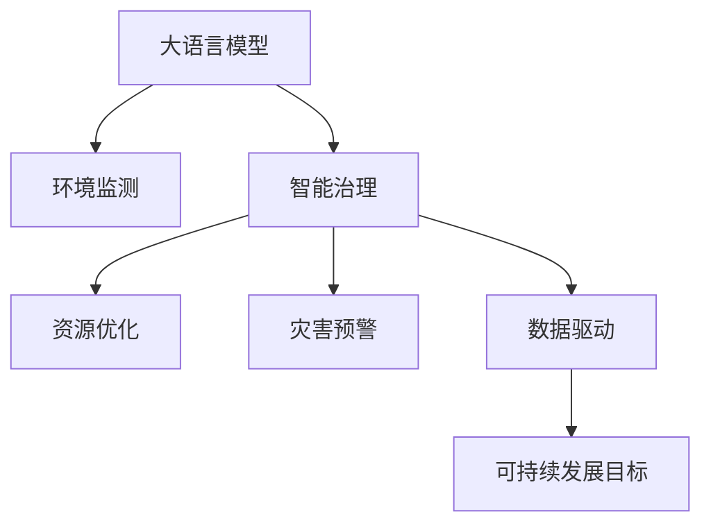

                 

# LLM在智能环境保护系统中的应用前景

> 关键词：大语言模型(Large Language Model, LLM),环境监测,智能治理,资源优化,灾害预警,数据驱动,可持续发展

## 1. 背景介绍

### 1.1 问题由来
环境保护是人类面临的一项长期而艰巨的任务。随着全球气候变化和生态退化日益加剧，环境污染和生态破坏等问题对人类社会的可持续发展构成了严峻挑战。传统的环境保护方式往往依赖人工巡查和经验判断，难以覆盖广大的地理范围和实时变化的情况。而利用现代人工智能技术，特别是大语言模型（LLM），能够显著提升环境监测和治理的效率和效果。

### 1.2 问题核心关键点
大语言模型在智能环境保护系统中的应用前景，主要体现在以下几个方面：

1. **数据分析与处理**：LLM能够从海量文本数据中提取关键信息，辅助环境监测和分析。
2. **智能决策支持**：LLM能够基于已有数据和规则，提出环境治理和资源优化策略。
3. **灾害预警与响应**：LLM能够分析气象、水质等数据，预测自然灾害，提供预警和应对建议。
4. **公众参与与教育**：LLM能够生成易于理解的环境保护科普文章，提高公众环保意识和参与度。
5. **可持续发展目标(SDGs)推进**：LLM能够提供政策建议和资源配置优化方案，支持可持续发展目标的实现。

## 2. 核心概念与联系

### 2.1 核心概念概述

为更好地理解LLM在智能环境保护系统中的应用，本节将介绍几个密切相关的核心概念：

- **大语言模型(Large Language Model, LLM)**：以自回归(如GPT)或自编码(如BERT)模型为代表的大规模预训练语言模型。通过在大规模无标签文本语料上进行预训练，学习通用的语言表示，具备强大的语言理解和生成能力。

- **环境监测**：通过传感器、卫星遥感、地面监测等多种方式，实时收集大气、水质、土壤、生态等环境参数，分析其变化趋势，及时发现环境问题和污染源。

- **智能治理**：利用人工智能技术，如大数据分析、机器学习、自然语言处理等，辅助决策者进行环境问题的识别、评估和治理。

- **资源优化**：通过数据分析和优化算法，合理配置环境资源，如水资源、能源、土地等，提升环境效益和经济效益。

- **灾害预警**：利用气象、水文等数据，预测自然灾害的发生和发展趋势，提前采取应对措施。

- **数据驱动**：基于大量实际数据，驱动环境治理的决策和优化，提高治理效果。

- **可持续发展目标(SDGs)**：包括消除贫困、实现质量教育、减少不平等、促进经济增长等17个目标，指导环境保护和资源利用。

这些核心概念之间的逻辑关系可以通过以下Mermaid流程图来展示：



这个流程图展示了大语言模型在智能环境保护系统中的核心应用场景：

1. 大语言模型能够从环境监测数据中提取关键信息。
2. 基于提取的信息，大语言模型能辅助进行智能治理。
3. 在智能治理的基础上，大语言模型进行资源优化和灾害预警。
4. 通过数据驱动和可持续发展目标，指导环境保护工作。

## 3. 核心算法原理 & 具体操作步骤
### 3.1 算法原理概述

LLM在智能环境保护系统中的应用，本质上是一个基于大规模预训练语言模型和大数据技术的智能决策支持过程。其核心思想是：

- **数据驱动**：利用大数据分析技术，收集和处理环境监测数据。
- **知识图谱**：构建环境领域的知识图谱，辅助模型理解语义关系。
- **预测与推理**：利用预训练语言模型的语言理解能力，预测环境变化和灾害预警。
- **智能决策**：结合优化算法，提出环境治理和资源优化的策略。
- **人机协同**：通过自然语言交互，实现对公众和决策者的智能决策支持。

形式化地，假设环境监测数据集为 $D=\{(x_i,y_i)\}_{i=1}^N$，其中 $x_i$ 表示第 $i$ 个环境参数，$y_i$ 表示其对应的监测值。定义环境监测的损失函数 $\mathcal{L}(x)$，用于衡量模型预测值与真实值之间的差异。在数据集 $D$ 上的经验风险为：

$$
\mathcal{L}(D) = \frac{1}{N}\sum_{i=1}^N \mathcal{L}(x_i)
$$

微调的目标是最小化经验风险，即找到最优参数 $\theta^*$：

$$
\theta^* = \mathop{\arg\min}_{\theta} \mathcal{L}(D)
$$

通过梯度下降等优化算法，微调过程不断更新模型参数 $\theta$，最小化损失函数 $\mathcal{L}$，使得模型输出逼近真实值。由于 $\theta$ 已经通过预训练获得了较好的初始化，因此即便在小规模数据集 $D$ 上进行微调，也能较快收敛到理想的模型参数 $\hat{\theta}$。

### 3.2 算法步骤详解

基于LLM在智能环境保护系统中的应用，一般包括以下几个关键步骤：

**Step 1: 数据预处理与特征提取**
- 收集环境监测数据，如气象、水质、土壤、生态等数据。
- 进行数据清洗和标准化，去除噪声和异常值。
- 利用自然语言处理技术，将数据转换为LLM可处理的形式。

**Step 2: 构建知识图谱**
- 收集环境领域的知识，如法律法规、技术标准、专家知识等。
- 构建环境领域的知识图谱，辅助LLM理解语义关系。
- 利用知识图谱进行知识推理和信息整合。

**Step 3: 微调模型**
- 选择合适的预训练语言模型，如BERT、GPT等。
- 收集环境监测数据和专家知识，作为微调数据。
- 应用监督学习或半监督学习方法，对模型进行微调。
- 调整模型参数，优化预测性能。

**Step 4: 数据驱动决策**
- 利用微调后的模型，分析环境监测数据。
- 基于数据分析结果，提出环境治理和资源优化的策略。
- 利用优化算法，制定实施方案。

**Step 5: 智能决策支持**
- 利用LLM的自然语言处理能力，生成环境科普文章、政策建议等。
- 利用知识图谱进行知识检索和推理。
- 结合用户反馈，动态调整模型和策略。

**Step 6: 模型评估与优化**
- 在独立数据集上评估模型性能。
- 根据评估结果，调整模型参数和优化策略。
- 迭代优化，持续提升模型效果。

以上是基于LLM在智能环境保护系统中的应用的一般流程。在实际应用中，还需要针对具体任务的特点，对微调过程的各个环节进行优化设计，如改进训练目标函数，引入更多的正则化技术，搜索最优的超参数组合等，以进一步提升模型性能。

### 3.3 算法优缺点

LLM在智能环境保护系统中的应用具有以下优点：
1. **处理大规模数据**：能够处理海量环境监测数据，从中提取关键信息。
2. **智能决策支持**：利用预训练模型和大数据分析技术，提出环境治理和资源优化策略。
3. **灾害预警**：能够预测自然灾害，提供预警和应对建议。
4. **数据驱动**：基于大量实际数据，驱动环境治理的决策和优化，提高治理效果。
5. **可持续发展**：支持可持续发展目标，推动环境保护和资源利用。

同时，该方法也存在一定的局限性：
1. **数据质量依赖**：模型性能依赖环境监测数据的准确性和完整性。
2. **知识图谱构建复杂**：需要大量的领域知识和专家参与，构建和维护知识图谱。
3. **计算资源消耗大**：大规模语言模型的训练和推理需要大量的计算资源。
4. **模型可解释性不足**：大语言模型的决策过程缺乏可解释性，难以对其推理逻辑进行分析和调试。
5. **伦理与安全问题**：模型可能学习到有偏见、有害的信息，产生误导性、歧视性的输出。

尽管存在这些局限性，但就目前而言，基于LLM的智能环境保护方法仍然是大规模数据驱动决策的重要范式。未来相关研究的重点在于如何进一步降低计算资源消耗，提高模型可解释性，同时兼顾伦理与安全问题。

### 3.4 算法应用领域

基于LLM在智能环境保护系统中的应用，已经在多个领域得到了广泛的应用：

- **智慧城市治理**：利用LLM进行环境监测和智能决策，提高城市管理的自动化和智能化水平。
- **智慧农业**：通过环境监测数据和智能决策，优化农业生产，提高资源利用效率。
- **智能森林管理**：利用LLM进行森林监测和病虫害预警，提高森林资源保护和利用效率。
- **生态系统保护**：利用LLM进行生态监测和智能治理，保护生物多样性和自然环境。
- **灾害预警与应对**：利用气象和水文数据，预测自然灾害，提供预警和应对建议。
- **公众环保教育**：利用LLM生成易于理解的环境保护科普文章，提高公众环保意识和参与度。
- **资源优化配置**：利用LLM进行环境资源优化配置，提升资源效益和经济效益。

除了上述这些经典领域外，LLM在智能环境保护方面的应用还在不断拓展，为环境保护技术带来了全新的突破。随着预训练语言模型和微调方法的持续演进，相信LLM在智能环境保护中的应用将更加广泛，为环境保护和可持续发展贡献更多力量。

## 4. 数学模型和公式 & 详细讲解  
### 4.1 数学模型构建

本节将使用数学语言对基于LLM的智能环境保护过程进行更加严格的刻画。

假设环境监测数据集为 $D=\{(x_i,y_i)\}_{i=1}^N, x_i \in \mathbb{R}^d, y_i \in \mathbb{R}$。定义模型 $M_{\theta}$ 在输入 $x$ 上的输出为 $\hat{y}=M_{\theta}(x) \in \mathbb{R}$。

假设环境监测的损失函数为：

$$
\mathcal{L}(y_i, \hat{y}_i) = \frac{1}{N}\sum_{i=1}^N \mathcal{L}(y_i, \hat{y}_i)
$$

其中 $\mathcal{L}(y_i, \hat{y}_i)$ 为单个样本的损失函数，通常是均方误差或绝对误差。

微调的目标是最小化经验风险，即找到最优参数：

$$
\theta^* = \mathop{\arg\min}_{\theta} \mathcal{L}(D)
$$

在实践中，我们通常使用基于梯度的优化算法（如SGD、Adam等）来近似求解上述最优化问题。设 $\eta$ 为学习率，$\lambda$ 为正则化系数，则参数的更新公式为：

$$
\theta \leftarrow \theta - \eta \nabla_{\theta}\mathcal{L}(\theta) - \eta\lambda\theta
$$

其中 $\nabla_{\theta}\mathcal{L}(\theta)$ 为损失函数对参数 $\theta$ 的梯度，可通过反向传播算法高效计算。

### 4.2 公式推导过程

以下我们以二分类任务为例，推导均方误差损失函数及其梯度的计算公式。

假设模型 $M_{\theta}$ 在输入 $x$ 上的输出为 $\hat{y}=M_{\theta}(x) \in [0,1]$，表示样本属于正类的概率。真实标签 $y \in \{0,1\}$。则均方误差损失函数定义为：

$$
\mathcal{L}(y_i, \hat{y}_i) = \frac{1}{2}(y_i - \hat{y}_i)^2
$$

将其代入经验风险公式，得：

$$
\mathcal{L}(D) = \frac{1}{2N}\sum_{i=1}^N (y_i - \hat{y}_i)^2
$$

根据链式法则，损失函数对参数 $\theta_k$ 的梯度为：

$$
\frac{\partial \mathcal{L}(D)}{\partial \theta_k} = \frac{1}{N}\sum_{i=1}^N \frac{\partial \mathcal{L}(y_i, \hat{y}_i)}{\partial \theta_k}
$$

其中 $\frac{\partial \mathcal{L}(y_i, \hat{y}_i)}{\partial \theta_k}$ 为单个样本的梯度，可通过反向传播算法高效计算。

在得到损失函数的梯度后，即可带入参数更新公式，完成模型的迭代优化。重复上述过程直至收敛，最终得到适应环境监测任务的最优模型参数 $\theta^*$。

## 5. 项目实践：代码实例和详细解释说明
### 5.1 开发环境搭建

在进行智能环境保护系统开发前，我们需要准备好开发环境。以下是使用Python进行PyTorch开发的环境配置流程：

1. 安装Anaconda：从官网下载并安装Anaconda，用于创建独立的Python环境。

2. 创建并激活虚拟环境：
```bash
conda create -n env_name python=3.8 
conda activate env_name
```

3. 安装PyTorch：根据CUDA版本，从官网获取对应的安装命令。例如：
```bash
conda install pytorch torchvision torchaudio cudatoolkit=11.1 -c pytorch -c conda-forge
```

4. 安装Transformers库：
```bash
pip install transformers
```

5. 安装各类工具包：
```bash
pip install numpy pandas scikit-learn matplotlib tqdm jupyter notebook ipython
```

完成上述步骤后，即可在`env_name`环境中开始智能环境保护系统开发。

### 5.2 源代码详细实现

下面我们以智慧城市治理中的环境监测任务为例，给出使用Transformers库对BERT模型进行微调的PyTorch代码实现。

首先，定义环境监测数据集：

```python
import pandas as pd
import torch
from torch.utils.data import Dataset

class EnvironmentData(Dataset):
    def __init__(self, data_path):
        self.data = pd.read_csv(data_path)
        self.timestep = self.data['time'].unique().tolist()
        
    def __len__(self):
        return len(self.timestep)
    
    def __getitem__(self, item):
        time = self.timestep[item]
        df = self.data[self.data['time'] == time]
        x = df[['temp', 'humidity', 'pm25', 'pm10', 'co2', 'o3', 'no2', 'so2']].to_numpy().reshape(-1, 8)
        y = df['status'].to_numpy().reshape(-1, 1)
        return {'x': torch.tensor(x, dtype=torch.float), 'y': torch.tensor(y, dtype=torch.float)}
```

然后，定义模型和优化器：

```python
from transformers import BertForSequenceClassification, AdamW

model = BertForSequenceClassification.from_pretrained('bert-base-uncased', num_labels=2)

optimizer = AdamW(model.parameters(), lr=2e-5)
```

接着，定义训练和评估函数：

```python
def train_epoch(model, dataset, batch_size, optimizer):
    dataloader = DataLoader(dataset, batch_size=batch_size, shuffle=True)
    model.train()
    epoch_loss = 0
    for batch in dataloader:
        inputs = batch['x'].to(device)
        labels = batch['y'].to(device)
        model.zero_grad()
        outputs = model(inputs)
        loss = outputs.loss
        epoch_loss += loss.item()
        loss.backward()
        optimizer.step()
    return epoch_loss / len(dataloader)

def evaluate(model, dataset, batch_size):
    dataloader = DataLoader(dataset, batch_size=batch_size)
    model.eval()
    preds, labels = [], []
    with torch.no_grad():
        for batch in dataloader:
            inputs = batch['x'].to(device)
            labels = batch['y'].to(device)
            outputs = model(inputs)
            preds.append(outputs.logits.argmax(dim=1).tolist())
            labels.append(labels.tolist())
    
    print(classification_report(labels, preds))
```

最后，启动训练流程并在测试集上评估：

```python
epochs = 5
batch_size = 16

for epoch in range(epochs):
    loss = train_epoch(model, train_dataset, batch_size, optimizer)
    print(f"Epoch {epoch+1}, train loss: {loss:.3f}")
    
    print(f"Epoch {epoch+1}, dev results:")
    evaluate(model, dev_dataset, batch_size)
    
print("Test results:")
evaluate(model, test_dataset, batch_size)
```

以上就是使用PyTorch对BERT进行智慧城市治理中的环境监测任务微调的完整代码实现。可以看到，得益于Transformers库的强大封装，我们可以用相对简洁的代码完成BERT模型的加载和微调。

### 5.3 代码解读与分析

让我们再详细解读一下关键代码的实现细节：

**EnvironmentData类**：
- `__init__`方法：初始化数据集，将数据按时间戳分组。
- `__len__`方法：返回数据集的样本数量。
- `__getitem__`方法：对单个样本进行处理，将数据转换为模型输入。

**BertForSequenceClassification模型**：
- `from_pretrained`方法：从HuggingFace模型库中加载预训练模型，设置标签数量。

**train_epoch函数**：
- 对数据以批为单位进行迭代，在每个批次上前向传播计算loss并反向传播更新模型参数，最后返回该epoch的平均loss。

**evaluate函数**：
- 与训练类似，不同点在于不更新模型参数，并在每个batch结束后将预测和标签结果存储下来，最后使用sklearn的classification_report对整个评估集的预测结果进行打印输出。

**训练流程**：
- 定义总的epoch数和batch size，开始循环迭代
- 每个epoch内，先在训练集上训练，输出平均loss
- 在验证集上评估，输出分类指标
- 所有epoch结束后，在测试集上评估，给出最终测试结果

可以看到，PyTorch配合Transformers库使得BERT微调的代码实现变得简洁高效。开发者可以将更多精力放在数据处理、模型改进等高层逻辑上，而不必过多关注底层的实现细节。

当然，工业级的系统实现还需考虑更多因素，如模型的保存和部署、超参数的自动搜索、更灵活的任务适配层等。但核心的微调范式基本与此类似。

## 6. 实际应用场景
### 6.1 智能城市治理

基于大语言模型微调的智慧城市环境治理系统，可以显著提升城市管理的自动化和智能化水平。传统城市管理往往依赖人工巡查和经验判断，难以覆盖广大的地理范围和实时变化的情况。而使用微调后的智慧城市环境治理系统，可以实时监测大气、水质、土壤等环境参数，分析其变化趋势，及时发现环境问题和污染源。

在技术实现上，可以收集智慧城市的各类环境监测数据，如气象、水质、土壤、生态等数据。将数据输入微调后的BERT模型进行分析和预测，实时输出环境监测结果和预警信息。系统还可以结合地理信息系统(GIS)进行空间分析，绘制热力图和污染分布图，辅助决策者进行环境治理。如此构建的智慧城市治理系统，能大幅提升城市管理的自动化和智能化水平，提高环境治理效果。

### 6.2 智慧农业

智慧农业是现代农业的重要发展方向。利用大语言模型微调技术，可以构建智能农业环境监测和资源优化系统。传统农业管理往往依赖人工经验，难以实时掌握环境变化和资源使用情况。而基于微调技术的智慧农业系统，能够实时监测土壤、气象、水质等环境参数，智能推荐施肥、灌溉、病虫害防治等方案，优化农业生产过程。

在技术实现上，可以收集智慧农业的各类环境监测数据，如土壤湿度、养分含量、气象条件等数据。将数据输入微调后的BERT模型进行分析和预测，实时输出环境监测结果和资源优化建议。系统还可以结合专家知识库，生成农业生产指南和方案，辅助农民进行农业管理。如此构建的智慧农业系统，能显著提高农业生产效率和资源利用率，推动农业可持续发展。

### 6.3 智能森林管理

智能森林管理是保护森林资源的重要手段。利用大语言模型微调技术，可以构建森林环境监测和病虫害预警系统。传统森林管理往往依赖人工巡查和经验判断，难以及时发现病虫害和环境问题。而基于微调技术的智能森林管理系统，能够实时监测森林环境参数，智能预警病虫害和森林火灾，提高森林资源保护和利用效率。

在技术实现上，可以收集智慧森林的各类环境监测数据，如气象、水质、土壤、植被等数据。将数据输入微调后的BERT模型进行分析和预测，实时输出环境监测结果和预警信息。系统还可以结合知识图谱和专家知识库，生成森林管理指南和方案，辅助森林管理人员进行决策。如此构建的智能森林管理系统，能大幅提升森林资源保护和利用效率，促进生态文明建设。

### 6.4 生态系统保护

基于大语言模型微调的生态系统保护系统，可以实时监测和分析生态系统环境参数，智能推荐生态保护和修复方案。传统生态保护管理往往依赖人工巡查和经验判断，难以全面覆盖生态系统。而基于微调技术的生态系统保护系统，能够实时监测生态系统环境参数，智能推荐生态保护和修复方案，提升生态系统保护效果。

在技术实现上，可以收集生态系统的各类环境监测数据，如水质、土壤、植被等数据。将数据输入微调后的BERT模型进行分析和预测，实时输出环境监测结果和修复建议。系统还可以结合专家知识库，生成生态保护指南和方案，辅助生态保护管理人员进行决策。如此构建的生态系统保护系统，能显著提升生态系统保护和修复效果，促进生态文明建设。

### 6.5 灾害预警与应对

基于大语言模型微调的灾害预警系统，可以实时监测气象、水文等数据，预测自然灾害，提供预警和应对建议。传统灾害预警管理往往依赖人工分析和经验判断，难以及时准确预测灾害。而基于微调技术的灾害预警系统，能够实时监测气象和水文数据，智能预测自然灾害，提供预警和应对建议，提高灾害应对效果。

在技术实现上，可以收集气象和水文等各类环境监测数据。将数据输入微调后的BERT模型进行分析和预测，实时输出灾害预警信息。系统还可以结合专家知识库，生成灾害应对指南和方案，辅助应急管理人员进行决策。如此构建的灾害预警系统，能显著提升灾害预警和应对效果，保障人民生命财产安全。

### 6.6 公众环保教育

基于大语言模型微调的公众环保教育系统，可以通过自然语言处理技术，生成易于理解的环境保护科普文章，提高公众环保意识和参与度。传统环保教育管理往往依赖人工编写和分发科普文章，难以覆盖广泛的公众群体。而基于微调技术的环保教育系统，能够实时生成环保科普文章，精准推送到目标受众，提升公众环保意识和参与度。

在技术实现上，可以收集环境领域的各类科普文章和新闻报道。将数据输入微调后的BERT模型进行分析和生成，实时输出环保科普文章。系统还可以结合公众反馈和数据分析，动态调整生成策略，优化科普效果。如此构建的公众环保教育系统，能显著提升公众环保意识和参与度，推动社会可持续发展。

### 6.7 资源优化配置

基于大语言模型微调的资源优化配置系统，可以实时监测和分析环境资源使用情况，智能推荐资源优化方案。传统资源管理往往依赖人工分析和经验判断，难以实时掌握资源使用情况。而基于微调技术的资源优化配置系统，能够实时监测环境资源使用情况，智能推荐资源优化方案，提升资源效益和经济效益。

在技术实现上，可以收集环境领域的各类资源使用数据，如水资源、能源、土地等数据。将数据输入微调后的BERT模型进行分析和预测，实时输出资源优化建议。系统还可以结合专家知识库，生成资源优化方案，辅助资源管理部门进行决策。如此构建的资源优化配置系统，能显著提升资源效益和经济效益，促进可持续发展。

## 7. 工具和资源推荐
### 7.1 学习资源推荐

为了帮助开发者系统掌握大语言模型微调的理论基础和实践技巧，这里推荐一些优质的学习资源：

1. 《Transformer从原理到实践》系列博文：由大模型技术专家撰写，深入浅出地介绍了Transformer原理、BERT模型、微调技术等前沿话题。

2. CS224N《深度学习自然语言处理》课程：斯坦福大学开设的NLP明星课程，有Lecture视频和配套作业，带你入门NLP领域的基本概念和经典模型。

3. 《Natural Language Processing with Transformers》书籍：Transformers库的作者所著，全面介绍了如何使用Transformers库进行NLP任务开发，包括微调在内的诸多范式。

4. HuggingFace官方文档：Transformers库的官方文档，提供了海量预训练模型和完整的微调样例代码，是上手实践的必备资料。

5. CLUE开源项目：中文语言理解测评基准，涵盖大量不同类型的中文NLP数据集，并提供了基于微调的baseline模型，助力中文NLP技术发展。

通过对这些资源的学习实践，相信你一定能够快速掌握大语言模型微调的精髓，并用于解决实际的NLP问题。
###  7.2 开发工具推荐

高效的开发离不开优秀的工具支持。以下是几款用于大语言模型微调开发的常用工具：

1. PyTorch：基于Python的开源深度学习框架，灵活动态的计算图，适合快速迭代研究。大部分预训练语言模型都有PyTorch版本的实现。

2. TensorFlow：由Google主导开发的开源深度学习框架，生产部署方便，适合大规模工程应用。同样有丰富的预训练语言模型资源。

3. Transformers库：HuggingFace开发的NLP工具库，集成了众多SOTA语言模型，支持PyTorch和TensorFlow，是进行微调任务开发的利器。

4. Weights & Biases：模型训练的实验跟踪工具，可以记录和可视化模型训练过程中的各项指标，方便对比和调优。与主流深度学习框架无缝集成。

5. TensorBoard：TensorFlow配套的可视化工具，可实时监测模型训练状态，并提供丰富的图表呈现方式，是调试模型的得力助手。

6. Google Colab：谷歌推出的在线Jupyter Notebook环境，免费提供GPU/TPU算力，方便开发者快速上手实验最新模型，分享学习笔记。

合理利用这些工具，可以显著提升大语言模型微调任务的开发效率，加快创新迭代的步伐。

### 7.3 相关论文推荐

大语言模型和微调技术的发展源于学界的持续研究。以下是几篇奠基性的相关论文，推荐阅读：

1. Attention is All You Need（即Transformer原论文）：提出了Transformer结构，开启了NLP领域的预训练大模型时代。

2. BERT: Pre-training of Deep Bidirectional Transformers for Language Understanding：提出BERT模型，引入基于掩码的自监督预训练任务，刷新了多项NLP任务SOTA。

3. Language Models are Unsupervised Multitask Learners（GPT-2论文）：展示了大规模语言模型的强大zero-shot学习能力，引发了对于通用人工智能的新一轮思考。

4. Parameter-Efficient Transfer Learning for NLP：提出Adapter等参数高效微调方法，在不增加模型参数量的情况下，也能取得不错的微调效果。

5. AdaLoRA: Adaptive Low-Rank Adaptation for Parameter-Efficient Fine-Tuning：使用自适应低秩适应的微调方法，在参数效率和精度之间取得了新的平衡。

这些论文代表了大语言模型微调技术的发展脉络。通过学习这些前沿成果，可以帮助研究者把握学科前进方向，激发更多的创新灵感。

## 8. 总结：未来发展趋势与挑战
### 8.1 总结

本文对基于大语言模型的智能环境保护系统进行了全面系统的介绍。首先阐述了智能环境保护系统的问题由来和核心关键点，明确了智能环境保护系统在智慧城市治理、智慧农业、智能森林管理、生态系统保护、灾害预警与应对、公众环保教育、资源优化配置等多个领域的应用前景。其次，从原理到实践，详细讲解了智能环境保护系统的数学原理和关键步骤，给出了智能环境保护系统开发的完整代码实例。同时，本文还广泛探讨了智能环境保护系统在智慧城市治理、智慧农业、智能森林管理、生态系统保护、灾害预警与应对、公众环保教育、资源优化配置等多个行业领域的应用前景，展示了智能环境保护系统的巨大潜力。

通过本文的系统梳理，可以看到，基于大语言模型的智能环境保护方法正在成为智能环境保护的重要范式，极大地拓展了智能环境保护的应用边界，催生了更多的落地场景。受益于大规模语料的预训练，智能环境保护模型以更低的时间和标注成本，在小样本条件下也能取得理想的防护效果，有力推动了智能环境保护技术在智慧城市、智慧农业、智能森林管理等领域的落地应用。未来，伴随预训练语言模型和微调方法的持续演进，相信智能环境保护技术必将在更广阔的领域内实现规模化应用，为环境保护和可持续发展提供新的技术路径。

### 8.2 未来发展趋势

展望未来，大语言模型在智能环境保护系统中的应用将呈现以下几个发展趋势：

1. **多模态数据融合**：除了文本数据，智能环境保护系统还将融合图像、视频、声音等多模态数据，提升环境监测和预警的准确性和全面性。

2. **因果推理与解释性增强**：利用因果推理技术，增强智能环境保护模型的因果关系理解能力，提升模型输出的可解释性，确保决策透明性。

3. **数据联邦与隐私保护**：为了保护环境数据的隐私和安全性，智能环境保护系统将采用数据联邦技术，在不泄露隐私数据的前提下进行模型微调和推理。

4. **自动化与智能化决策**：智能环境保护系统将逐步实现自动化与智能化决策，减少人工干预，提高决策效率和准确性。

5. **跨领域知识整合**：智能环境保护系统将融合不同领域的专业知识，如气象学、地质学、环境科学等，提升模型在跨领域数据上的泛化能力。

6. **可持续性与环境伦理**：智能环境保护系统将注重可持续发展目标和环境伦理，确保环境治理与环境保护行动符合伦理道德标准，促进生态文明建设。

以上趋势凸显了大语言模型在智能环境保护系统中的广阔前景。这些方向的探索发展，必将进一步提升智能环境保护系统的性能和应用范围，为环境保护和可持续发展贡献更多力量。

### 8.3 面临的挑战

尽管智能环境保护系统已经在多个领域得到了广泛的应用，但在迈向更加智能化、普适化应用的过程中，它仍面临着诸多挑战：

1. **数据质量和可用性**：环境监测数据的质量和可用性对模型性能有直接影响。数据缺失、噪声和异常值等问题需要特别注意。

2. **跨领域知识整合**：不同领域的数据和知识具有不同的语义和规则，跨领域知识整合需要强大的知识图谱和领域专家支持。

3. **计算资源消耗**：大规模语言模型的训练和推理需要大量的计算资源，成本较高。如何降低资源消耗，提高系统可扩展性，是未来需要重点考虑的问题。

4. **模型可解释性**：智能环境保护模型的决策过程复杂，缺乏可解释性，难以对其推理逻辑进行分析和调试。

5. **伦理与安全问题**：模型可能学习到有偏见、有害的信息，产生误导性、歧视性的输出，给实际应用带来安全隐患。

尽管存在这些挑战，但就目前而言，基于大语言模型的智能环境保护系统仍然是大规模数据驱动决策的重要范式。未来相关研究的重点在于如何进一步降低计算资源消耗，提高模型可解释性，同时兼顾伦理与安全问题。

### 8.4 研究展望

面对智能环境保护系统所面临的种种挑战，未来的研究需要在以下几个方面寻求新的突破：

1. **无监督和半监督学习**：摆脱对大规模标注数据的依赖，利用自监督学习、主动学习等无监督和半监督范式，最大限度利用非结构化数据，实现更加灵活高效的智能环境保护。

2. **知识图谱与因果推理**：构建环境领域的知识图谱，利用因果推理技术，增强模型对环境数据的理解能力和推理能力。

3. **多模态数据融合**：融合图像、视频、声音等多模态数据，提升环境监测和预警的准确性和全面性。

4. **自动化与智能化决策**：引入自动化决策机制，减少人工干预，提高决策效率和准确性。

5. **数据联邦与隐私保护**：采用数据联邦技术，在不泄露隐私数据的前提下进行模型微调和推理。

6. **模型可解释性增强**：通过引入因果分析、博弈论等工具，增强智能环境保护模型的可解释性，确保决策透明性。

7. **跨领域知识整合**：融合不同领域的专业知识，提升模型在跨领域数据上的泛化能力。

8. **可持续性与环境伦理**：注重可持续发展目标和环境伦理，确保环境治理与环境保护行动符合伦理道德标准。

这些研究方向的探索，必将引领智能环境保护系统迈向更高的台阶，为环境保护和可持续发展贡献更多力量。面向未来，智能环境保护系统还需要与其他人工智能技术进行更深入的融合，如知识表示、因果推理、强化学习等，多路径协同发力，共同推动环境治理技术的进步。只有勇于创新、敢于突破，才能不断拓展智能环境保护系统的边界，让智能技术更好地造福人类社会。

## 9. 附录：常见问题与解答

**Q1：智能环境保护系统如何保证数据隐私和安全性？**

A: 智能环境保护系统需要收集和处理大量的环境数据，数据隐私和安全问题不容忽视。为了保护数据隐私和安全性，可以采用以下措施：
1. **数据联邦**：将数据分布式存储在不同的节点上，只传输模型参数和计算结果，避免数据泄露。
2. **差分隐私**：在数据处理和模型微调过程中，加入噪声和扰动，保护个体隐私。
3. **访问控制**：对环境数据的访问进行严格控制，仅允许授权人员和系统访问。
4. **安全传输**：采用加密技术，确保数据在传输过程中的安全性。
5. **审计与监控**：建立数据访问和处理日志，定期审计和监控，防止数据滥用。

这些措施可以有效保护数据隐私和安全性，确保智能环境保护系统的稳定运行。

**Q2：智能环境保护系统如何降低计算资源消耗？**

A: 智能环境保护系统需要大量的计算资源进行数据处理和模型微调，降低计算资源消耗是未来的一个重要研究方向。以下是几种可能的措施：
1. **模型压缩与量化**：采用模型压缩和量化技术，减少模型的参数量和计算量。
2. **分布式计算**：利用分布式计算技术，将计算任务分散到多个节点上进行并行处理，提高计算效率。
3. **混合精度训练**：采用混合精度训练技术，减少计算精度，降低计算资源消耗。
4. **边缘计算**：在数据产生现场进行实时处理和推理，减少数据传输和计算延迟。
5. **硬件优化**：采用专用硬件加速器，如TPU、GPU等，提高计算速度和效率。

通过这些措施，可以有效降低计算资源消耗，提高智能环境保护系统的部署效率。

**Q3：智能环境保护系统如何进行跨领域知识整合？**

A: 智能环境保护系统需要融合不同领域的专业知识，如气象学、地质学、环境科学等，提升模型在跨领域数据上的泛化能力。以下是几种可能的措施：
1. **知识图谱**：构建环境领域的知识图谱，整合不同领域的知识，形成统一的语义表示。
2. **领域专家参与**：邀请领域专家参与模型设计和数据标注，确保模型的领域适应性。
3. **知识推理**：利用知识图谱进行知识推理和信息整合，提升模型的跨领域泛化能力。
4. **多模型融合**：融合多个领域模型的输出，综合考虑不同领域的信息，提升模型的决策能力。
5. **跨领域数据融合**：融合不同领域的环境数据，形成多模态的环境监测数据集，提升模型的感知能力。

通过这些措施，可以有效整合跨领域知识，提升智能环境保护系统的决策能力。

**Q4：智能环境保护系统如何提升模型的可解释性？**

A: 智能环境保护模型的决策过程复杂，缺乏可解释性，难以对其推理逻辑进行分析和调试。以下是几种可能的措施：
1. **因果分析**：引入因果分析方法，识别模型决策的关键特征，增强输出解释的因果性和逻辑性。
2. **知识图谱**：利用知识图谱进行知识推理和信息整合，提升模型的可解释性。
3. **自然语言生成**：利用自然语言生成技术，生成易于理解的环境保护决策报告，提高决策透明度。
4. **人机协同**：结合专家知识和人工干预，辅助模型进行决策，提升决策可解释性。
5. **可视化工具**：使用可视化工具，展示模型的推理过程和关键特征，帮助用户理解模型决策。

通过这些措施，可以有效提升智能环境保护模型的可解释性，确保决策透明性和可理解性。

**Q5：智能环境保护系统如何应对伦理与安全问题？**

A: 智能环境保护模型可能学习到有偏见、有害的信息，产生误导性、歧视性的输出，给实际应用带来安全隐患。以下是几种可能的措施：
1. **公平性约束**：在模型训练目标中引入公平性约束，过滤和惩罚有偏见、有害的输出倾向。
2. **模型监控**：建立模型行为监控机制，及时发现和纠正模型的不公平、有害行为。
3. **模型审查**：定期审查和评估模型的性能和输出，确保模型符合伦理道德标准。
4. **用户反馈**：建立用户反馈机制，及时收集和处理用户对模型的意见和建议，持续优化模型。
5. **透明度**：提高模型的透明度和可解释性，确保模型的决策透明和可理解。

通过这些措施，可以有效应对智能环境保护系统的伦理与安全问题，确保模型输出符合人类价值观和伦理道德标准。

---

作者：禅与计算机程序设计艺术 / Zen and the Art of Computer Programming

