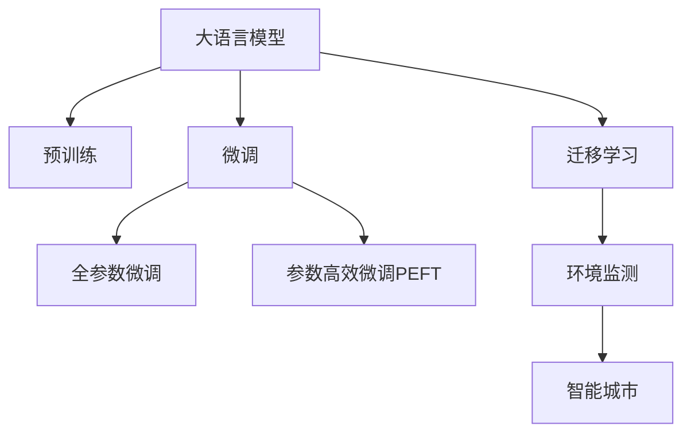

                 

# LLM在智能空气质量预测中的潜在作用

> 关键词：
1. 大语言模型(Large Language Model, LLM)
2. 空气质量预测
3. 智能城市
4. 环境监测
5. 预测模型
6. 环境科学
7. 数据分析

## 1. 背景介绍

### 1.1 问题由来
近年来，随着工业化和城市化进程的加快，空气污染问题变得越来越严重。全球每年因空气质量差导致的健康问题和经济损失巨大。因此，及时准确的空气质量预测对于环境保护、公共卫生管理和社会经济发展都具有重要意义。

传统的空气质量预测依赖于复杂的环境监测设备和大规模的气象数据，预测精度和实时性都受到限制。然而，随着人工智能技术的发展，特别是大语言模型(Large Language Model, LLM)在处理自然语言信息上的卓越能力，为空气质量预测带来了新的可能性。

### 1.2 问题核心关键点
大语言模型在处理非结构化数据（如文本、图像、音频等）上表现出色，具备强大的自然语言理解和生成能力。通过学习大量文本数据，可以提取出环境相关词汇和描述，为空气质量预测提供丰富的语义信息。

空气质量预测的核心在于建立准确的模型，能够基于历史和实时数据，预测未来的空气质量指数(Air Quality Index, AQI)。大语言模型可以自动学习文本中的气象、污染源、地理位置等信息，并通过上下文理解能力，将这些信息转化为有意义的模型输入。

### 1.3 问题研究意义
智能空气质量预测是环境监测、智慧城市建设的重要组成部分。通过大语言模型在环境领域的初步应用，可以大幅提升空气质量预测的精度和实时性，支持城市管理部门和公众做出更科学的决策。

此外，大语言模型还可以用于解释气象数据和模型预测结果，增强其可解释性和可信度，促进公众理解和参与环境保护。最终，智能空气质量预测将推动环境保护意识的提升和实践，促进可持续发展。

## 2. 核心概念与联系

### 2.1 核心概念概述

在探讨大语言模型在空气质量预测中的应用之前，我们先来理解一些关键概念：

1. **大语言模型(Large Language Model, LLM)**：以自回归(如GPT)或自编码(如BERT)模型为代表的大规模预训练语言模型。通过在海量文本数据上进行预训练，学习通用的语言表示，具备强大的语言理解和生成能力。

2. **预训练(Pre-training)**：指在大规模无标签文本语料上，通过自监督学习任务训练通用语言模型的过程。常见的预训练任务包括言语建模、遮挡语言模型等。

3. **微调(Fine-tuning)**：指在预训练模型的基础上，使用下游任务的少量标注数据，通过有监督学习优化模型在特定任务上的性能。通常只需要调整顶层分类器或解码器，并以较小的学习率更新全部或部分的模型参数。

4. **迁移学习(Transfer Learning)**：指将一个领域学习到的知识，迁移应用到另一个不同但相关的领域的学习范式。大模型的预训练-微调过程即是一种典型的迁移学习方式。

5. **智能城市(Smart City)**：结合现代信息技术，通过大数据、物联网、人工智能等技术手段，实现城市治理、公共服务、环境监测等方面的智能化、高效化和可持续化。

6. **环境监测(Environmental Monitoring)**：通过对各种环境因素的实时监测，获取环境数据，用于预测和评估环境质量，如大气污染、水体污染、噪音污染等。

这些核心概念之间的逻辑关系可以通过以下Mermaid流程图来展示：



这个流程图展示了大语言模型的核心概念及其之间的关系：

1. 大语言模型通过预训练获得基础能力。
2. 微调是对预训练模型进行任务特定的优化，可以分为全参数微调和参数高效微调（PEFT）。
3. 迁移学习是连接预训练模型与环境监测任务的桥梁，可以通过微调或迁移学习来实现。
4. 环境监测是智能城市管理的重要组成部分，用于获取实时环境数据。
5. 智能城市是现代信息技术在城市治理中的应用，通过大数据、物联网、人工智能等技术手段，实现城市智能化管理。

## 3. 核心算法原理 & 具体操作步骤

### 3.1 算法原理概述

基于大语言模型的空气质量预测，本质上是一个有监督的细粒度迁移学习过程。其核心思想是：将大语言模型视作一个强大的"环境信息提取器"，通过在环境监测数据的文本描述上，进行有监督地微调，使得模型输出能够匹配环境质量指标，从而获得针对空气质量预测任务的优化模型。

形式化地，假设预训练模型为 $M_{\theta}$，其中 $\theta$ 为预训练得到的模型参数。给定空气质量预测任务 $T$ 的标注数据集 $D=\{(x_i, y_i)\}_{i=1}^N$，其中 $x_i$ 是环境监测数据的文本描述，$y_i$ 是相应的空气质量指数(AQI)。微调的目标是找到新的模型参数 $\hat{\theta}$，使得：

$$
\hat{\theta}=\mathop{\arg\min}_{\theta} \mathcal{L}(M_{\theta},D)
$$

其中 $\mathcal{L}$ 为针对空气质量预测任务设计的损失函数，用于衡量模型预测输出与真实标签之间的差异。常见的损失函数包括交叉熵损失、均方误差损失等。

通过梯度下降等优化算法，微调过程不断更新模型参数 $\theta$，最小化损失函数 $\mathcal{L}$，使得模型输出逼近真实标签。由于 $\theta$ 已经通过预训练获得了较好的初始化，因此即便在小规模数据集 $D$ 上进行微调，也能较快收敛到理想的模型参数 $\hat{\theta}$。

### 3.2 算法步骤详解

基于大语言模型的空气质量预测一般包括以下几个关键步骤：

**Step 1: 准备预训练模型和数据集**
- 选择合适的预训练语言模型 $M_{\theta}$ 作为初始化参数，如 BERT、GPT 等。
- 准备空气质量预测任务的标注数据集 $D$，划分为训练集、验证集和测试集。一般要求标注数据与预训练数据的分布不要差异过大。

**Step 2: 添加任务适配层**
- 根据任务类型，在预训练模型顶层设计合适的输出层和损失函数。
- 对于空气质量预测任务，通常在顶层添加线性分类器和交叉熵损失函数。

**Step 3: 设置微调超参数**
- 选择合适的优化算法及其参数，如 AdamW、SGD 等，设置学习率、批大小、迭代轮数等。
- 设置正则化技术及强度，包括权重衰减、Dropout、Early Stopping 等。
- 确定冻结预训练参数的策略，如仅微调顶层，或全部参数都参与微调。

**Step 4: 执行梯度训练**
- 将训练集数据分批次输入模型，前向传播计算损失函数。
- 反向传播计算参数梯度，根据设定的优化算法和学习率更新模型参数。
- 周期性在验证集上评估模型性能，根据性能指标决定是否触发 Early Stopping。
- 重复上述步骤直到满足预设的迭代轮数或 Early Stopping 条件。

**Step 5: 测试和部署**
- 在测试集上评估微调后模型 $M_{\hat{\theta}}$ 的性能，对比微调前后的精度提升。
- 使用微调后的模型对实时空气质量数据进行预测，集成到智能城市管理系统中。
- 持续收集新的环境数据，定期重新微调模型，以适应数据分布的变化。

以上是基于大语言模型微调过程的一般流程。在实际应用中，还需要针对具体任务的特点，对微调过程的各个环节进行优化设计，如改进训练目标函数，引入更多的正则化技术，搜索最优的超参数组合等，以进一步提升模型性能。

### 3.3 算法优缺点

基于大语言模型的空气质量预测具有以下优点：
1. 高效适应环境数据：大语言模型能够快速适应环境监测数据的多样性和复杂性，捕捉到其中隐含的语言信息，从而提升预测精度。
2. 模型泛化能力强：大语言模型具备良好的泛化能力，可以处理多种环境因素，如气象条件、污染源、地理位置等，适应不同的环境和场景。
3. 灵活性强：通过调整任务适配层和损失函数，可以适应不同的空气质量预测任务，如PM2.5、PM10、臭氧等。
4. 数据需求低：相比于传统预测模型，大语言模型对标注数据的依赖较小，可以在数据稀缺的情况下进行有效预测。

同时，该方法也存在一定的局限性：
1. 数据质量要求高：大语言模型对环境监测数据的描述质量和完整性要求较高，数据质量问题可能影响模型预测效果。
2. 训练成本高：大规模预训练和微调过程需要强大的计算资源，训练成本较高。
3. 模型解释性不足：大语言模型作为"黑盒"系统，难以解释其内部工作机制和决策逻辑，模型输出的可解释性不足。
4. 依赖先验知识：模型预测依赖于环境数据的文本描述，对于缺乏详细描述的数据，预测效果可能较差。

尽管存在这些局限性，但就目前而言，基于大语言模型的空气质量预测方法仍然是大规模环境数据分析的理想选择。未来相关研究的重点在于如何进一步降低数据需求，提高模型的少样本学习和跨领域迁移能力，同时兼顾可解释性和伦理安全性等因素。

### 3.4 算法应用领域

大语言模型在空气质量预测中的应用广泛，涵盖了环境监测、智能城市管理、公共健康等多个领域，具体如下：

**1. 环境监测**
大语言模型可以通过对历史和实时环境监测数据的文本描述进行微调，预测未来的空气质量指数。这可以支持环境监测部门对环境质量的实时监控和预警。

**2. 智能城市管理**
智能城市管理系统可以集成大语言模型，用于分析和预测空气质量变化趋势，提供环境监测报告，辅助城市管理者制定环境保护政策和应急响应措施。

**3. 公共健康**
通过大语言模型对空气质量数据进行预测和分析，可以为公众提供实时空气质量信息，帮助人们做出健康决策，如减少户外活动时间，选择适宜的出行方式等。

**4. 交通管理**
空气质量预测可以为交通管理部门提供实时交通出行建议，如建议公众在空气质量较差时减少使用私家车，选择公共交通工具，从而降低交通污染排放。

## 4. 数学模型和公式 & 详细讲解 & 举例说明

### 4.1 数学模型构建

假设大语言模型为 $M_{\theta}$，其中 $\theta$ 为预训练得到的模型参数。空气质量预测任务的数据集为 $D=\{(x_i, y_i)\}_{i=1}^N$，其中 $x_i$ 是环境监测数据的文本描述，$y_i$ 是相应的空气质量指数(AQI)。

定义模型 $M_{\theta}$ 在数据样本 $(x,y)$ 上的损失函数为 $\ell(M_{\theta}(x),y)$，则在数据集 $D$ 上的经验风险为：

$$
\mathcal{L}(\theta) = \frac{1}{N} \sum_{i=1}^N \ell(M_{\theta}(x_i),y_i)
$$

微调的优化目标是最小化经验风险，即找到最优参数：

$$
\theta^* = \mathop{\arg\min}_{\theta} \mathcal{L}(\theta)
$$

在实践中，我们通常使用基于梯度的优化算法（如SGD、Adam等）来近似求解上述最优化问题。设 $\eta$ 为学习率，$\lambda$ 为正则化系数，则参数的更新公式为：

$$
\theta \leftarrow \theta - \eta \nabla_{\theta}\mathcal{L}(\theta) - \eta\lambda\theta
$$

其中 $\nabla_{\theta}\mathcal{L}(\theta)$ 为损失函数对参数 $\theta$ 的梯度，可通过反向传播算法高效计算。

### 4.2 公式推导过程

以下我们以空气质量预测任务为例，推导交叉熵损失函数及其梯度的计算公式。

假设模型 $M_{\theta}$ 在输入 $x$ 上的输出为 $\hat{y}=M_{\theta}(x) \in [0,1]$，表示模型预测的空气质量指数(AQI)。真实标签 $y \in [0,1]$。则二分类交叉熵损失函数定义为：

$$
\ell(M_{\theta}(x),y) = -[y\log \hat{y} + (1-y)\log (1-\hat{y})]
$$

将其代入经验风险公式，得：

$$
\mathcal{L}(\theta) = -\frac{1}{N}\sum_{i=1}^N [y_i\log M_{\theta}(x_i)+(1-y_i)\log(1-M_{\theta}(x_i))]
$$

根据链式法则，损失函数对参数 $\theta_k$ 的梯度为：

$$
\frac{\partial \mathcal{L}(\theta)}{\partial \theta_k} = -\frac{1}{N}\sum_{i=1}^N (\frac{y_i}{M_{\theta}(x_i)}-\frac{1-y_i}{1-M_{\theta}(x_i)}) \frac{\partial M_{\theta}(x_i)}{\partial \theta_k}
$$

其中 $\frac{\partial M_{\theta}(x_i)}{\partial \theta_k}$ 可进一步递归展开，利用自动微分技术完成计算。

在得到损失函数的梯度后，即可带入参数更新公式，完成模型的迭代优化。重复上述过程直至收敛，最终得到适应空气质量预测任务的最优模型参数 $\theta^*$。

## 5. 项目实践：代码实例和详细解释说明

### 5.1 开发环境搭建

在进行空气质量预测实践前，我们需要准备好开发环境。以下是使用Python进行PyTorch开发的环境配置流程：

1. 安装Anaconda：从官网下载并安装Anaconda，用于创建独立的Python环境。

2. 创建并激活虚拟环境：
```bash
conda create -n pytorch-env python=3.8 
conda activate pytorch-env
```

3. 安装PyTorch：根据CUDA版本，从官网获取对应的安装命令。例如：
```bash
conda install pytorch torchvision torchaudio cudatoolkit=11.1 -c pytorch -c conda-forge
```

4. 安装Transformers库：
```bash
pip install transformers
```

5. 安装各类工具包：
```bash
pip install numpy pandas scikit-learn matplotlib tqdm jupyter notebook ipython
```

完成上述步骤后，即可在`pytorch-env`环境中开始空气质量预测实践。

### 5.2 源代码详细实现

下面我们以PM2.5预测任务为例，给出使用Transformers库对BERT模型进行微调的PyTorch代码实现。

首先，定义PM2.5预测任务的数据处理函数：

```python
from transformers import BertTokenizer
from torch.utils.data import Dataset
import torch

class PM25Dataset(Dataset):
    def __init__(self, texts, tags, tokenizer, max_len=128):
        self.texts = texts
        self.tags = tags
        self.tokenizer = tokenizer
        self.max_len = max_len
        
    def __len__(self):
        return len(self.texts)
    
    def __getitem__(self, item):
        text = self.texts[item]
        tag = self.tags[item]
        
        encoding = self.tokenizer(text, return_tensors='pt', max_length=self.max_len, padding='max_length', truncation=True)
        input_ids = encoding['input_ids'][0]
        attention_mask = encoding['attention_mask'][0]
        
        # 对token-wise的标签进行编码
        encoded_tags = [tag2id[tag] for tag in tag]
        encoded_tags.extend([tag2id['O']] * (self.max_len - len(encoded_tags)))
        labels = torch.tensor(encoded_tags, dtype=torch.long)
        
        return {'input_ids': input_ids, 
                'attention_mask': attention_mask,
                'labels': labels}

# 标签与id的映射
tag2id = {'O': 0, 'P2.5-HIGH': 1, 'P2.5-MODERATE': 2, 'P2.5-LOW': 3}
id2tag = {v: k for k, v in tag2id.items()}

# 创建dataset
tokenizer = BertTokenizer.from_pretrained('bert-base-cased')

train_dataset = PM25Dataset(train_texts, train_tags, tokenizer)
dev_dataset = PM25Dataset(dev_texts, dev_tags, tokenizer)
test_dataset = PM25Dataset(test_texts, test_tags, tokenizer)
```

然后，定义模型和优化器：

```python
from transformers import BertForTokenClassification, AdamW

model = BertForTokenClassification.from_pretrained('bert-base-cased', num_labels=len(tag2id))

optimizer = AdamW(model.parameters(), lr=2e-5)
```

接着，定义训练和评估函数：

```python
from torch.utils.data import DataLoader
from tqdm import tqdm
from sklearn.metrics import classification_report

device = torch.device('cuda') if torch.cuda.is_available() else torch.device('cpu')
model.to(device)

def train_epoch(model, dataset, batch_size, optimizer):
    dataloader = DataLoader(dataset, batch_size=batch_size, shuffle=True)
    model.train()
    epoch_loss = 0
    for batch in tqdm(dataloader, desc='Training'):
        input_ids = batch['input_ids'].to(device)
        attention_mask = batch['attention_mask'].to(device)
        labels = batch['labels'].to(device)
        model.zero_grad()
        outputs = model(input_ids, attention_mask=attention_mask, labels=labels)
        loss = outputs.loss
        epoch_loss += loss.item()
        loss.backward()
        optimizer.step()
    return epoch_loss / len(dataloader)

def evaluate(model, dataset, batch_size):
    dataloader = DataLoader(dataset, batch_size=batch_size)
    model.eval()
    preds, labels = [], []
    with torch.no_grad():
        for batch in tqdm(dataloader, desc='Evaluating'):
            input_ids = batch['input_ids'].to(device)
            attention_mask = batch['attention_mask'].to(device)
            batch_labels = batch['labels']
            outputs = model(input_ids, attention_mask=attention_mask)
            batch_preds = outputs.logits.argmax(dim=2).to('cpu').tolist()
            batch_labels = batch_labels.to('cpu').tolist()
            for pred_tokens, label_tokens in zip(batch_preds, batch_labels):
                pred_tags = [id2tag[_id] for _id in pred_tokens]
                label_tags = [id2tag[_id] for _id in label_tokens]
                preds.append(pred_tags[:len(label_tokens)])
                labels.append(label_tags)
                
    print(classification_report(labels, preds))
```

最后，启动训练流程并在测试集上评估：

```python
epochs = 5
batch_size = 16

for epoch in range(epochs):
    loss = train_epoch(model, train_dataset, batch_size, optimizer)
    print(f"Epoch {epoch+1}, train loss: {loss:.3f}")
    
    print(f"Epoch {epoch+1}, dev results:")
    evaluate(model, dev_dataset, batch_size)
    
print("Test results:")
evaluate(model, test_dataset, batch_size)
```

以上就是使用PyTorch对BERT进行PM2.5预测任务微调的完整代码实现。可以看到，得益于Transformers库的强大封装，我们可以用相对简洁的代码完成BERT模型的加载和微调。

### 5.3 代码解读与分析

让我们再详细解读一下关键代码的实现细节：

**PM25Dataset类**：
- `__init__`方法：初始化文本、标签、分词器等关键组件。
- `__len__`方法：返回数据集的样本数量。
- `__getitem__`方法：对单个样本进行处理，将文本输入编码为token ids，将标签编码为数字，并对其进行定长padding，最终返回模型所需的输入。

**tag2id和id2tag字典**：
- 定义了标签与数字id之间的映射关系，用于将token-wise的预测结果解码回真实的标签。

**训练和评估函数**：
- 使用PyTorch的DataLoader对数据集进行批次化加载，供模型训练和推理使用。
- 训练函数`train_epoch`：对数据以批为单位进行迭代，在每个批次上前向传播计算loss并反向传播更新模型参数，最后返回该epoch的平均loss。
- 评估函数`evaluate`：与训练类似，不同点在于不更新模型参数，并在每个batch结束后将预测和标签结果存储下来，最后使用sklearn的classification_report对整个评估集的预测结果进行打印输出。

**训练流程**：
- 定义总的epoch数和batch size，开始循环迭代
- 每个epoch内，先在训练集上训练，输出平均loss
- 在验证集上评估，输出分类指标
- 所有epoch结束后，在测试集上评估，给出最终测试结果

可以看到，PyTorch配合Transformers库使得BERT微调的代码实现变得简洁高效。开发者可以将更多精力放在数据处理、模型改进等高层逻辑上，而不必过多关注底层的实现细节。

当然，工业级的系统实现还需考虑更多因素，如模型的保存和部署、超参数的自动搜索、更灵活的任务适配层等。但核心的微调范式基本与此类似。

## 6. 实际应用场景
### 6.1 智能空气质量监测系统

基于大语言模型微调的空气质量预测系统，可以广泛应用于智能空气质量监测系统的构建。传统空气质量监测系统依赖于大量的环境监测设备和数据，投资和维护成本较高。而使用微调后的预测模型，可以实时预测空气质量指数，降低对设备的依赖，提升监测系统的智能化和自动化水平。

在技术实现上，可以收集城市中的历史和实时环境监测数据，包括PM2.5、PM10、臭氧等指标，并对其进行文本描述。将文本描述作为模型输入，训练模型预测未来的空气质量指数。微调后的模型可以集成到实时监测系统中，用于实时预警和应急响应。

### 6.2 健康风险评估

空气质量预测模型还可以用于健康风险评估。空气质量指数AQI与人们的健康风险有密切关系。通过预测未来的AQI，可以为公众提供健康建议，如减少户外活动时间，选择适宜的出行方式，从而降低健康风险。

具体而言，可以在智能手机应用中集成空气质量预测模型，实时显示当前和未来几小时的空气质量指数，并提供相应的健康建议。这可以极大地提升公众的健康意识和防护能力。

### 6.3 能源管理

在能源管理领域，空气质量预测模型可以用于优化能源使用策略。例如，在空气质量较差的时段，可以调整工厂的生产计划，减少污染物排放；在空气质量较好的时段，可以提高能耗使用效率，节约能源成本。

具体而言，可以在工业管理系统中集成空气质量预测模型，实时监测和预测空气质量，根据预测结果优化能源使用策略，从而提升能源利用效率，降低环境污染。

### 6.4 未来应用展望

随着大语言模型和微调方法的不断发展，基于微调范式将在更多领域得到应用，为环境保护和可持续发展带来新的机遇。

在智慧城市治理中，空气质量预测模型可以用于实时监测和预警，支持城市管理者制定更科学的环境政策和管理措施。

在智慧健康领域，空气质量预测模型可以为公众提供健康建议，提升公众健康防护意识，降低健康风险。

在智慧能源管理中，空气质量预测模型可以优化能源使用策略，提高能源利用效率，减少环境污染。

此外，在智慧农业、智慧交通、智慧旅游等多个领域，空气质量预测模型都可以发挥重要作用，推动智慧城市的全面发展。

## 7. 工具和资源推荐
### 7.1 学习资源推荐

为了帮助开发者系统掌握大语言模型在环境领域的应用，这里推荐一些优质的学习资源：

1. 《Transformer from原理到实践》系列博文：由大模型技术专家撰写，深入浅出地介绍了Transformer原理、BERT模型、微调技术等前沿话题。

2. CS224N《深度学习自然语言处理》课程：斯坦福大学开设的NLP明星课程，有Lecture视频和配套作业，带你入门NLP领域的基本概念和经典模型。

3. 《Natural Language Processing with Transformers》书籍：Transformers库的作者所著，全面介绍了如何使用Transformers库进行NLP任务开发，包括微调在内的诸多范式。

4. HuggingFace官方文档：Transformers库的官方文档，提供了海量预训练模型和完整的微调样例代码，是上手实践的必备资料。

5. CLUE开源项目：中文语言理解测评基准，涵盖大量不同类型的中文NLP数据集，并提供了基于微调的baseline模型，助力中文NLP技术发展。

通过对这些资源的学习实践，相信你一定能够快速掌握大语言模型在环境领域的应用，并用于解决实际的环境问题。
### 7.2 开发工具推荐

高效的开发离不开优秀的工具支持。以下是几款用于大语言模型微调开发的常用工具：

1. PyTorch：基于Python的开源深度学习框架，灵活动态的计算图，适合快速迭代研究。大部分预训练语言模型都有PyTorch版本的实现。

2. TensorFlow：由Google主导开发的开源深度学习框架，生产部署方便，适合大规模工程应用。同样有丰富的预训练语言模型资源。

3. Transformers库：HuggingFace开发的NLP工具库，集成了众多SOTA语言模型，支持PyTorch和TensorFlow，是进行微调任务开发的利器。

4. Weights & Biases：模型训练的实验跟踪工具，可以记录和可视化模型训练过程中的各项指标，方便对比和调优。与主流深度学习框架无缝集成。

5. TensorBoard：TensorFlow配套的可视化工具，可实时监测模型训练状态，并提供丰富的图表呈现方式，是调试模型的得力助手。

6. Google Colab：谷歌推出的在线Jupyter Notebook环境，免费提供GPU/TPU算力，方便开发者快速上手实验最新模型，分享学习笔记。

合理利用这些工具，可以显著提升大语言模型微调任务的开发效率，加快创新迭代的步伐。

### 7.3 相关论文推荐

大语言模型和微调技术的发展源于学界的持续研究。以下是几篇奠基性的相关论文，推荐阅读：

1. Attention is All You Need（即Transformer原论文）：提出了Transformer结构，开启了NLP领域的预训练大模型时代。

2. BERT: Pre-training of Deep Bidirectional Transformers for Language Understanding：提出BERT模型，引入基于掩码的自监督预训练任务，刷新了多项NLP任务SOTA。

3. Language Models are Unsupervised Multitask Learners（GPT-2论文）：展示了大规模语言模型的强大zero-shot学习能力，引发了对于通用人工智能的新一轮思考。

4. Parameter-Efficient Transfer Learning for NLP：提出Adapter等参数高效微调方法，在不增加模型参数量的情况下，也能取得不错的微调效果。

5. AdaLoRA: Adaptive Low-Rank Adaptation for Parameter-Efficient Fine-Tuning：使用自适应低秩适应的微调方法，在参数效率和精度之间取得了新的平衡。

这些论文代表了大语言模型微调技术的发展脉络。通过学习这些前沿成果，可以帮助研究者把握学科前进方向，激发更多的创新灵感。

## 8. 总结：未来发展趋势与挑战

### 8.1 总结

本文对基于大语言模型的空气质量预测方法进行了全面系统的介绍。首先阐述了大语言模型和微调技术的研究背景和意义，明确了微调在拓展预训练模型应用、提升空气质量预测性能方面的独特价值。其次，从原理到实践，详细讲解了监督微调的数学原理和关键步骤，给出了空气质量预测任务开发的完整代码实例。同时，本文还广泛探讨了微调方法在智能城市、健康风险评估、能源管理等多个领域的应用前景，展示了微调范式的巨大潜力。

通过本文的系统梳理，可以看到，基于大语言模型的空气质量预测方法正在成为环境监测和智慧城市建设的重要工具，极大地提升了环境保护和城市管理的智能化水平。未来，伴随预训练语言模型和微调方法的持续演进，基于微调范式将在更多领域得到应用，为环境保护和可持续发展带来新的机遇。

### 8.2 未来发展趋势

展望未来，大语言模型在空气质量预测中的应用将呈现以下几个发展趋势：

1. 模型规模持续增大。随着算力成本的下降和数据规模的扩张，预训练语言模型的参数量还将持续增长。超大规模语言模型蕴含的丰富语言知识，有望支撑更加复杂多变的空气质量预测任务。

2. 微调方法日趋多样。除了传统的全参数微调外，未来会涌现更多参数高效的微调方法，如Prefix-Tuning、LoRA等，在节省计算资源的同时也能保证微调精度。

3. 持续学习成为常态。随着数据分布的不断变化，微调模型也需要持续学习新知识以保持性能。如何在不遗忘原有知识的同时，高效吸收新样本信息，将成为重要的研究课题。

4. 标注样本需求降低。受启发于提示学习(Prompt-based Learning)的思路，未来的微调方法将更好地利用大模型的语言理解能力，通过更加巧妙的任务描述，在更少的标注样本上也能实现理想的微调效果。

5. 多模态微调崛起。当前的微调主要聚焦于纯文本数据，未来会进一步拓展到图像、视频、语音等多模态数据微调。多模态信息的融合，将显著提升语言模型对现实世界的理解和建模能力。

6. 模型通用性增强。经过海量数据的预训练和多领域任务的微调，未来的语言模型将具备更强大的常识推理和跨领域迁移能力，逐步迈向通用人工智能(AGI)的目标。

以上趋势凸显了大语言模型在环境领域的广阔前景。这些方向的探索发展，必将进一步提升空气质量预测的精度和实时性，支持环境保护和智慧城市建设的全面发展。

### 8.3 面临的挑战

尽管大语言模型在空气质量预测上已经取得了瞩目成就，但在迈向更加智能化、普适化应用的过程中，它仍面临诸多挑战：

1. 数据质量瓶颈。虽然微调对标注数据的依赖较小，但对于复杂环境监测数据的描述质量和完整性要求较高，数据质量问题可能影响模型预测效果。

2. 训练成本高。大规模预训练和微调过程需要强大的计算资源，训练成本较高。

3. 模型解释性不足。大语言模型作为"黑盒"系统，难以解释其内部工作机制和决策逻辑，模型输出的可解释性不足。

4. 依赖先验知识。模型预测依赖于环境数据的文本描述，对于缺乏详细描述的数据，预测效果可能较差。

尽管存在这些挑战，但就目前而言，基于大语言模型的空气质量预测方法仍然是大规模环境数据分析的理想选择。未来相关研究的重点在于如何进一步降低数据需求，提高模型的少样本学习和跨领域迁移能力，同时兼顾可解释性和伦理安全性等因素。

### 8.4 研究展望

面对大语言模型在空气质量预测所面临的挑战，未来的研究需要在以下几个方面寻求新的突破：

1. 探索无监督和半监督微调方法。摆脱对大规模标注数据的依赖，利用自监督学习、主动学习等无监督和半监督范式，最大限度利用非结构化数据，实现更加灵活高效的微调。

2. 研究参数高效和计算高效的微调范式。开发更加参数高效的微调方法，在固定大部分预训练参数的同时，只更新极少量的任务相关参数。同时优化微调模型的计算图，减少前向传播和反向传播的资源消耗，实现更加轻量级、实时性的部署。

3. 融合因果和对比学习范式。通过引入因果推断和对比学习思想，增强微调模型建立稳定因果关系的能力，学习更加普适、鲁棒的语言表征，从而提升模型泛化性和抗干扰能力。

4. 引入更多先验知识。将符号化的先验知识，如知识图谱、逻辑规则等，与神经网络模型进行巧妙融合，引导微调过程学习更准确、合理的语言模型。同时加强不同模态数据的整合，实现视觉、语音等多模态信息与文本信息的协同建模。

5. 结合因果分析和博弈论工具。将因果分析方法引入微调模型，识别出模型决策的关键特征，增强输出解释的因果性和逻辑性。借助博弈论工具刻画人机交互过程，主动探索并规避模型的脆弱点，提高系统稳定性。

6. 纳入伦理道德约束。在模型训练目标中引入伦理导向的评估指标，过滤和惩罚有偏见、有害的输出倾向。同时加强人工干预和审核，建立模型行为的监管机制，确保输出符合人类价值观和伦理道德。

这些研究方向的探索，必将引领大语言模型在环境领域的进一步应用，推动智能空气质量预测技术的进步，为环境保护和智慧城市建设注入新的动力。

