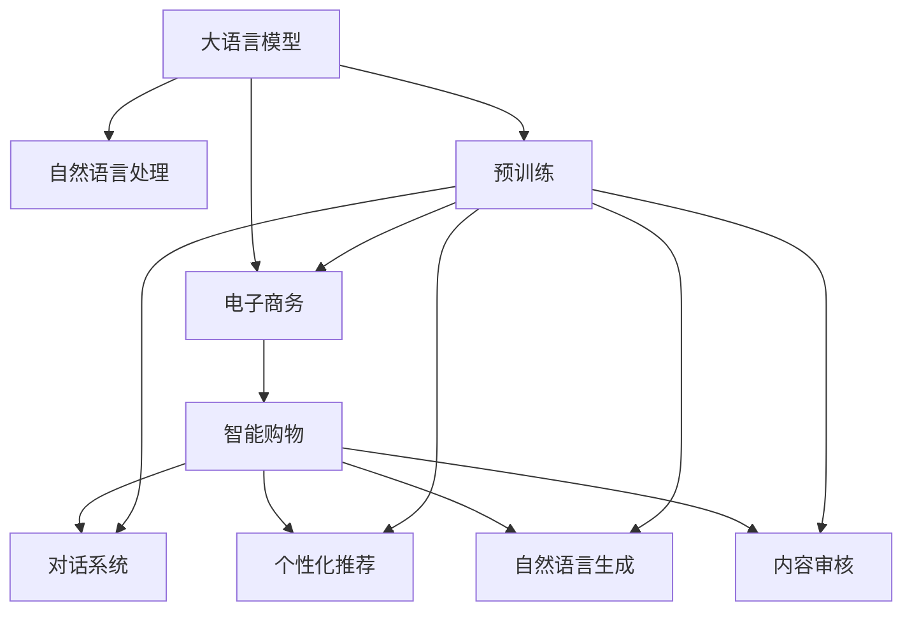

                 

# LLM在电子商务中的应用：智能购物体验

> 关键词：大语言模型,自然语言处理,电子商务,智能购物,对话系统,个性化推荐,自然语言生成,客户服务

## 1. 背景介绍

### 1.1 问题由来

在当今数字化转型的大背景下，电子商务成为连接消费者和商家、拓展市场的重要桥梁。然而，尽管电子商务市场规模庞大，用户和商家都面临着信息不对称、匹配效率低、体验差等痛点。尤其是面对海量商品和复杂查询，消费者和商家都希望获得更智能、更个性化的购物体验。

大语言模型（Large Language Models, LLMs）以其强大的自然语言处理（Natural Language Processing, NLP）能力，在多个领域展现出显著的应用潜力。在电子商务领域，大语言模型通过预训练和微调，能够生成自然流畅的对话内容，理解用户意图，推荐个性化商品，辅助客户服务，从而提升整个购物体验。

### 1.2 问题核心关键点

大语言模型在电子商务中的应用，主要集中在以下几个核心领域：

1. **智能对话系统**：利用大语言模型生成自然流畅的对话内容，实现自动客服、智能导航等功能，提高用户购物的便捷性和体验感。
2. **个性化推荐**：通过大语言模型理解用户偏好和需求，生成更加个性化、精准的商品推荐，提升用户满意度和转化率。
3. **客户服务**：利用大语言模型解答用户疑问，提供专业建议，提升客户服务质量和效率。
4. **自然语言生成**：生成高质量的产品描述、广告文案等，提升商品的吸引力和销售转化率。
5. **内容审核**：通过大语言模型检测违规和不当内容，保护消费者权益，维护平台秩序。

这些应用方向不仅能够显著提升电子商务平台的用户体验，还能够提高商家运营效率，促进行业整体的智能化转型。

## 2. 核心概念与联系

### 2.1 核心概念概述

为了更好地理解大语言模型在电子商务中的应用，本节将介绍几个密切相关的核心概念：

- **大语言模型（LLMs）**：以Transformer架构为代表的大规模预训练语言模型，通过在大规模无标签文本数据上进行预训练，学习到丰富的语言知识，具备强大的自然语言理解和生成能力。
- **自然语言处理（NLP）**：涉及语言模型、词法分析、句法分析、语义理解等技术，旨在使计算机能够理解、处理和生成自然语言。
- **电子商务（e-commerce）**：通过互联网进行商品交易的商业模式，涵盖零售、批发、拍卖等多种形式。
- **智能购物（Smart Shopping）**：利用人工智能技术提升购物过程的智能化水平，包括智能推荐、个性化服务、智能客服等功能。
- **对话系统（Chatbot）**：基于自然语言处理技术，能够模拟人类对话过程的系统，广泛应用于客户服务和智能导航。
- **个性化推荐（Recommendation System）**：根据用户行为数据和偏好，推荐个性化商品和服务，提升用户体验和转化率。
- **自然语言生成（NLG）**：利用大语言模型生成自然流畅的文本内容，用于商品描述、广告文案、用户反馈等。
- **内容审核（Content Moderation）**：利用大语言模型检测和过滤违规内容，保护用户权益和平台秩序。

这些核心概念之间的逻辑关系可以通过以下Mermaid流程图来展示：



这个流程图展示了大语言模型与电子商务及智能购物紧密相关的核心概念及其相互关系：

1. 大语言模型通过预训练获得基础能力。
2. 在电子商务和智能购物中，利用这些基础能力，大语言模型可以生成对话、推荐商品、生成文本、审核内容。
3. 对话系统、个性化推荐、自然语言生成、内容审核等功能，共同构建了智能购物生态。

## 3. 核心算法原理 & 具体操作步骤
### 3.1 算法原理概述

大语言模型在电子商务中的应用，核心在于其强大的自然语言处理能力。通过预训练和微调，大语言模型可以理解用户的查询和反馈，生成个性化的推荐和响应，从而提升购物体验。

具体而言，大语言模型在电子商务中的应用流程如下：

1. **预训练阶段**：在大规模无标签文本数据上进行预训练，学习到语言的基础知识。
2. **微调阶段**：在电子商务相关的标注数据上进行微调，使模型能够理解用户意图和行为，生成个性化推荐和对话内容。
3. **应用阶段**：在实际的电子商务平台中，利用微调后的模型进行智能客服、个性化推荐、自然语言生成、内容审核等。

### 3.2 算法步骤详解

下面以智能对话系统为例，详细讲解大语言模型在电子商务中的应用步骤：

**Step 1: 数据准备**
- 收集电子商务平台的客户查询数据、聊天记录、客服对话记录等，并进行标注处理。
- 将标注数据划分为训练集、验证集和测试集，通常需要几百万到几千万条数据。

**Step 2: 模型选择与预训练**
- 选择合适的预训练语言模型，如GPT、BERT、T5等。
- 对选择的预训练模型进行预训练，一般使用自监督学习任务，如语言建模、掩码语言建模等。

**Step 3: 微调任务适配**
- 设计对话任务的适配层，定义模型输入输出格式。
- 选择合适的优化器、学习率和训练轮数。
- 冻结部分预训练层，只微调顶层，减少过拟合风险。

**Step 4: 模型训练**
- 将训练集数据分批次输入模型，前向传播计算损失函数。
- 反向传播计算参数梯度，根据设定的优化算法和学习率更新模型参数。
- 周期性在验证集上评估模型性能，根据性能指标决定是否触发Early Stopping。
- 重复上述步骤直至满足预设的迭代轮数或Early Stopping条件。

**Step 5: 模型评估与部署**
- 在测试集上评估微调后模型，对比微调前后的性能。
- 使用微调后的模型对新数据进行推理预测，集成到实际的应用系统中。
- 持续收集新的数据，定期重新微调模型，以适应数据分布的变化。

### 3.3 算法优缺点

大语言模型在电子商务中的应用，具有以下优点：

1. **高效性**：大语言模型通过微调可以快速适应特定任务，提高处理效率。
2. **可扩展性**：大语言模型具有强大的自然语言处理能力，可以应用于多个子任务，如对话系统、推荐系统、内容审核等。
3. **灵活性**：大语言模型可以根据实际需求进行调整和优化，适应不同业务场景。
4. **个性化推荐**：基于用户行为数据和偏好，生成个性化推荐，提升用户满意度和转化率。
5. **自然语言处理**：生成自然流畅的对话内容、商品描述、广告文案等，提升用户体验。

同时，该方法也存在以下缺点：

1. **数据依赖**：微调效果依赖于标注数据的质量和数量，标注成本较高。
2. **泛化能力**：如果微调数据与实际应用场景差异较大，模型泛化能力可能受限。
3. **可解释性**：大语言模型的决策过程缺乏可解释性，难以对其推理逻辑进行分析和调试。
4. **资源消耗**：大规模语言模型对算力、内存等资源消耗较大，需要高性能硬件支持。

尽管存在这些局限性，但大语言模型在电子商务领域的应用前景依然广阔，其高效、灵活、个性化的特性有望显著提升用户购物体验和商家运营效率。

### 3.4 算法应用领域

大语言模型在电子商务中的应用领域广泛，涵盖智能客服、个性化推荐、内容审核等多个子任务。

1. **智能客服**：利用大语言模型生成自然流畅的对话内容，实现自动客服、智能导航等功能，提高用户购物的便捷性和体验感。
2. **个性化推荐**：通过大语言模型理解用户偏好和需求，生成更加个性化、精准的商品推荐，提升用户满意度和转化率。
3. **客户服务**：利用大语言模型解答用户疑问，提供专业建议，提升客户服务质量和效率。
4. **自然语言生成**：生成高质量的产品描述、广告文案等，提升商品的吸引力和销售转化率。
5. **内容审核**：通过大语言模型检测违规和不当内容，保护消费者权益，维护平台秩序。

这些应用方向不仅能够显著提升电子商务平台的用户体验，还能够提高商家运营效率，促进行业整体的智能化转型。

## 4. 数学模型和公式 & 详细讲解 & 举例说明
### 4.1 数学模型构建

在本节中，我们将使用数学语言对大语言模型在电子商务中的应用过程进行更加严格的刻画。

记大语言模型为 $M_{\theta}$，其中 $\theta$ 为模型参数。假设对话任务的训练集为 $D=\{(x_i,y_i)\}_{i=1}^N, x_i \in \mathcal{X}, y_i \in \mathcal{Y}$，其中 $\mathcal{X}$ 为输入空间（如用户查询），$\mathcal{Y}$ 为输出空间（如客服回复）。

定义模型 $M_{\theta}$ 在输入 $x$ 上的输出为 $\hat{y}=M_{\theta}(x)$，表示模型预测的回复。假设真实的回复为 $y$，则对话任务的损失函数为：

$$
\ell(M_{\theta}(x),y) = \mathbb{E}[\text{CE}(\hat{y},y)]
$$

其中，$\text{CE}(\hat{y},y)$ 为交叉熵损失函数，用于衡量模型输出与真实回复之间的差异。整个对话任务的损失函数可以表示为：

$$
\mathcal{L}(\theta) = \frac{1}{N} \sum_{i=1}^N \ell(M_{\theta}(x_i),y_i)
$$

在得到损失函数后，即可通过梯度下降等优化算法，最小化损失函数，更新模型参数 $\theta$。

### 4.2 公式推导过程

下面以对话任务为例，推导大语言模型在电子商务中的微调过程。

假设模型 $M_{\theta}$ 在输入 $x$ 上的输出为 $\hat{y}=M_{\theta}(x)$，表示模型预测的回复。假设真实的回复为 $y$，则对话任务的损失函数为：

$$
\ell(M_{\theta}(x),y) = -\log P(y|\hat{y})
$$

其中，$P(y|\hat{y})$ 为模型在预测输出 $\hat{y}$ 下的回复 $y$ 的概率分布。将损失函数对 $\theta$ 求导，得：

$$
\frac{\partial \mathcal{L}(\theta)}{\partial \theta} = -\frac{1}{N} \sum_{i=1}^N \frac{\partial \log P(y|\hat{y})}{\partial \theta}
$$

利用链式法则，得到：

$$
\frac{\partial \log P(y|\hat{y})}{\partial \theta} = \frac{\partial \log \frac{P(y|\hat{y})}{P(\hat{y})}{\partial \hat{y}} \frac{\partial P(\hat{y})}{\partial \theta}
$$

其中，$P(\hat{y})$ 为模型在预测输出 $\hat{y}$ 下的概率分布，$\frac{\partial P(\hat{y})}{\partial \theta}$ 为模型在预测输出 $\hat{y}$ 下的概率分布对 $\theta$ 的梯度。

将上述公式代入优化算法，即可完成大语言模型在电子商务中的微调过程。

### 4.3 案例分析与讲解

以智能客服系统为例，分析大语言模型在电子商务中的应用效果。

假设一个电商平台使用微调后的对话系统进行客服。当用户查询“退货政策”时，系统自动回复“退货政策请见平台规则”。当用户继续提问“怎么申请退货”时，系统能够根据上下文信息，生成合理的回复，如“申请退货需要提供订单号和相关证明，具体流程见平台规则”。

通过大语言模型的微调，智能客服系统能够自然流畅地处理用户查询，提供准确的回复，提升用户满意度和转化率。同时，系统能够积累大量的对话数据，进一步优化模型，提高响应速度和准确率。

## 5. 项目实践：代码实例和详细解释说明
### 5.1 开发环境搭建

在进行智能客服系统开发前，我们需要准备好开发环境。以下是使用Python进行PyTorch开发的环境配置流程：

1. 安装Anaconda：从官网下载并安装Anaconda，用于创建独立的Python环境。

2. 创建并激活虚拟环境：
```bash
conda create -n pytorch-env python=3.8 
conda activate pytorch-env
```

3. 安装PyTorch：根据CUDA版本，从官网获取对应的安装命令。例如：
```bash
conda install pytorch torchvision torchaudio cudatoolkit=11.1 -c pytorch -c conda-forge
```

4. 安装TensorFlow：由Google主导开发的开源深度学习框架，生产部署方便，适合大规模工程应用。同样有丰富的预训练语言模型资源。

5. 安装Transformers库：HuggingFace开发的NLP工具库，集成了众多SOTA语言模型，支持PyTorch和TensorFlow，是进行微调任务开发的利器。

6. 安装各类工具包：
```bash
pip install numpy pandas scikit-learn matplotlib tqdm jupyter notebook ipython
```

完成上述步骤后，即可在`pytorch-env`环境中开始微调实践。

### 5.2 源代码详细实现

下面我们以智能客服系统为例，给出使用Transformers库对GPT模型进行微调的PyTorch代码实现。

首先，定义智能客服系统的数据处理函数：

```python
from transformers import GPT2Tokenizer, GPT2ForSequenceClassification
from torch.utils.data import Dataset, DataLoader
import torch

class CustomerServiceDataset(Dataset):
    def __init__(self, queries, responses, tokenizer):
        self.queries = queries
        self.responses = responses
        self.tokenizer = tokenizer
        
    def __len__(self):
        return len(self.queries)
    
    def __getitem__(self, item):
        query = self.queries[item]
        response = self.responses[item]
        
        encoding = self.tokenizer(query, return_tensors='pt', max_length=512, padding='max_length', truncation=True)
        input_ids = encoding['input_ids'][0]
        attention_mask = encoding['attention_mask'][0]
        
        return {'input_ids': input_ids, 
                'attention_mask': attention_mask,
                'targets': torch.tensor(self.responses[item], dtype=torch.long)}
```

然后，定义模型和优化器：

```python
from transformers import GPT2Tokenizer, GPT2ForSequenceClassification, AdamW

model = GPT2ForSequenceClassification.from_pretrained('gpt2', num_labels=2) # 二分类任务
tokenizer = GPT2Tokenizer.from_pretrained('gpt2')
optimizer = AdamW(model.parameters(), lr=1e-5)
```

接着，定义训练和评估函数：

```python
from torch.utils.data import DataLoader
from tqdm import tqdm
from sklearn.metrics import accuracy_score

device = torch.device('cuda') if torch.cuda.is_available() else torch.device('cpu')
model.to(device)

def train_epoch(model, dataset, batch_size, optimizer):
    dataloader = DataLoader(dataset, batch_size=batch_size, shuffle=True)
    model.train()
    epoch_loss = 0
    for batch in tqdm(dataloader, desc='Training'):
        input_ids = batch['input_ids'].to(device)
        attention_mask = batch['attention_mask'].to(device)
        targets = batch['targets'].to(device)
        model.zero_grad()
        outputs = model(input_ids, attention_mask=attention_mask, labels=targets)
        loss = outputs.loss
        epoch_loss += loss.item()
        loss.backward()
        optimizer.step()
    return epoch_loss / len(dataloader)

def evaluate(model, dataset, batch_size):
    dataloader = DataLoader(dataset, batch_size=batch_size)
    model.eval()
    preds, labels = [], []
    with torch.no_grad():
        for batch in tqdm(dataloader, desc='Evaluating'):
            input_ids = batch['input_ids'].to(device)
            attention_mask = batch['attention_mask'].to(device)
            targets = batch['targets']
            outputs = model(input_ids, attention_mask=attention_mask)
            batch_preds = outputs.logits.argmax(dim=2).to('cpu').tolist()
            batch_labels = targets.to('cpu').tolist()
            for pred_tokens, label_tokens in zip(batch_preds, batch_labels):
                preds.append(pred_tokens[:len(label_tokens)])
                labels.append(label_tokens)
                
    print(accuracy_score(labels, preds))
```

最后，启动训练流程并在测试集上评估：

```python
epochs = 5
batch_size = 16

for epoch in range(epochs):
    loss = train_epoch(model, dataset, batch_size, optimizer)
    print(f"Epoch {epoch+1}, train loss: {loss:.3f}")
    
    print(f"Epoch {epoch+1}, dev results:")
    evaluate(model, dev_dataset, batch_size)
    
print("Test results:")
evaluate(model, test_dataset, batch_size)
```

以上就是使用PyTorch对GPT模型进行智能客服系统微调的完整代码实现。可以看到，得益于Transformers库的强大封装，我们可以用相对简洁的代码完成GPT模型的加载和微调。

### 5.3 代码解读与分析

让我们再详细解读一下关键代码的实现细节：

**CustomerServiceDataset类**：
- `__init__`方法：初始化查询、回复和分词器等关键组件。
- `__len__`方法：返回数据集的样本数量。
- `__getitem__`方法：对单个样本进行处理，将查询输入编码为token ids，将回复编码为数字，并对其进行定长padding，最终返回模型所需的输入。

**模型和优化器定义**：
- 使用GPT-2作为预训练语言模型，进行二分类任务微调。
- 定义优化器，学习率为1e-5。

**训练和评估函数**：
- 使用PyTorch的DataLoader对数据集进行批次化加载，供模型训练和推理使用。
- 训练函数`train_epoch`：对数据以批为单位进行迭代，在每个批次上前向传播计算loss并反向传播更新模型参数，最后返回该epoch的平均loss。
- 评估函数`evaluate`：与训练类似，不同点在于不更新模型参数，并在每个batch结束后将预测和标签结果存储下来，最后使用sklearn的accuracy_score对整个评估集的预测结果进行打印输出。

**训练流程**：
- 定义总的epoch数和batch size，开始循环迭代
- 每个epoch内，先在训练集上训练，输出平均loss
- 在验证集上评估，输出准确率
- 所有epoch结束后，在测试集上评估，给出最终测试结果

可以看到，PyTorch配合Transformers库使得GPT微调的代码实现变得简洁高效。开发者可以将更多精力放在数据处理、模型改进等高层逻辑上，而不必过多关注底层的实现细节。

当然，工业级的系统实现还需考虑更多因素，如模型的保存和部署、超参数的自动搜索、更灵活的任务适配层等。但核心的微调范式基本与此类似。

## 6. 实际应用场景
### 6.1 智能客服系统

智能客服系统是电子商务平台的重要组成部分，通过利用大语言模型进行微调，可以实现自动客服、智能导航等功能，显著提升用户购物体验。

以智能客服系统为例，系统通过自然语言处理技术，理解用户的查询意图，提供相应的回复和建议。对于复杂查询，系统还可以接入知识图谱和专家系统，实现更精准、更个性化的服务。例如，用户查询“如何退货”，系统自动回复“申请退货需要提供订单号和相关证明，具体流程见平台规则”。

智能客服系统不仅能够显著提升用户满意度，还能大幅降低人力成本，提高商家运营效率。在未来，随着大语言模型的进一步发展，智能客服系统将更加智能化、人性化，成为电商平台上不可或缺的重要工具。

### 6.2 个性化推荐

个性化推荐是电子商务平台的重要功能，通过利用大语言模型进行微调，可以生成更加精准、个性化的商品推荐，提升用户满意度和转化率。

以个性化推荐为例，系统通过分析用户的历史浏览、点击、购买行为，生成其兴趣偏好。然后，利用大语言模型预测用户可能感兴趣的商品，进行推荐展示。例如，用户经常浏览运动鞋类商品，系统会推荐运动鞋相关的配件或搭配，提升用户的购物体验和转化率。

个性化推荐不仅能够提升用户满意度，还能增加商家的销售额，提高平台的市场竞争力。在未来，随着大语言模型的进一步发展，个性化推荐将更加智能化、精准化，成为电商平台上不可或缺的重要功能。

### 6.3 自然语言生成

自然语言生成技术在电子商务平台上有着广泛应用，通过利用大语言模型进行微调，可以生成高质量的商品描述、广告文案等，提升商品的吸引力和销售转化率。

以商品描述为例，系统通过分析商品的属性、功能、特点等，生成自然流畅的商品描述，吸引用户点击购买。例如，智能推荐系统生成商品描述：“这款手机不仅拥有顶级处理器和超大屏幕，还支持5G网络，拍照效果出色，价格实惠，值得入手”。

自然语言生成技术不仅能够提升商品的吸引力和销售转化率，还能显著降低商家在文案创作上的成本，提高运营效率。在未来，随着大语言模型的进一步发展，自然语言生成将更加智能化、精准化，成为电商平台上不可或缺的重要功能。

### 6.4 内容审核

内容审核是电子商务平台的重要功能，通过利用大语言模型进行微调，可以检测和过滤违规和不当内容，保护消费者权益，维护平台秩序。

以内容审核为例，系统通过分析商品描述、用户评论等文本内容，检测是否包含广告、假冒伪劣信息等。例如，系统会检测商品描述是否包含虚假宣传，用户评论是否包含恶意评价等。系统检测到违规内容后，自动进行标记或删除，确保平台内容的健康和秩序。

内容审核不仅能够保护消费者权益，还能提升平台的用户体验和信任度，促进行业的健康发展。在未来，随着大语言模型的进一步发展，内容审核将更加智能化、精准化，成为电商平台上不可或缺的重要功能。

## 7. 工具和资源推荐
### 7.1 学习资源推荐

为了帮助开发者系统掌握大语言模型在电子商务中的应用理论基础和实践技巧，这里推荐一些优质的学习资源：

1. 《自然语言处理入门》系列博文：由大语言模型技术专家撰写，深入浅出地介绍了自然语言处理的基本概念和前沿技术。

2. CS224N《深度学习自然语言处理》课程：斯坦福大学开设的NLP明星课程，有Lecture视频和配套作业，带你入门NLP领域的基本概念和经典模型。

3. 《Transformer从原理到实践》系列博文：由大语言模型技术专家撰写，深入浅出地介绍了Transformer原理、BERT模型、微调技术等前沿话题。

4. 《深度学习自然语言处理》书籍：Transformers库的作者所著，全面介绍了如何使用Transformers库进行NLP任务开发，包括微调在内的诸多范式。

5. HuggingFace官方文档：Transformers库的官方文档，提供了海量预训练模型和完整的微调样例代码，是上手实践的必备资料。

通过对这些资源的学习实践，相信你一定能够快速掌握大语言模型在电子商务中的应用精髓，并用于解决实际的NLP问题。
### 7.2 开发工具推荐

高效的开发离不开优秀的工具支持。以下是几款用于大语言模型在电子商务中应用的常用工具：

1. PyTorch：基于Python的开源深度学习框架，灵活动态的计算图，适合快速迭代研究。大部分预训练语言模型都有PyTorch版本的实现。

2. TensorFlow：由Google主导开发的开源深度学习框架，生产部署方便，适合大规模工程应用。同样有丰富的预训练语言模型资源。

3. Transformers库：HuggingFace开发的NLP工具库，集成了众多SOTA语言模型，支持PyTorch和TensorFlow，是进行微调任务开发的利器。

4. Weights & Biases：模型训练的实验跟踪工具，可以记录和可视化模型训练过程中的各项指标，方便对比和调优。与主流深度学习框架无缝集成。

5. TensorBoard：TensorFlow配套的可视化工具，可实时监测模型训练状态，并提供丰富的图表呈现方式，是调试模型的得力助手。

6. Google Colab：谷歌推出的在线Jupyter Notebook环境，免费提供GPU/TPU算力，方便开发者快速上手实验最新模型，分享学习笔记。

合理利用这些工具，可以显著提升大语言模型在电子商务中的应用效率，加快创新迭代的步伐。

### 7.3 相关论文推荐

大语言模型在电子商务中的应用源于学界的持续研究。以下是几篇奠基性的相关论文，推荐阅读：

1. Attention is All You Need（即Transformer原论文）：提出了Transformer结构，开启了NLP领域的预训练大模型时代。

2. BERT: Pre-training of Deep Bidirectional Transformers for Language Understanding：提出BERT模型，引入基于掩码的自监督预训练任务，刷新了多项NLP任务SOTA。

3. Language Models are Unsupervised Multitask Learners（GPT-2论文）：展示了大规模语言模型的强大zero-shot学习能力，引发了对于通用人工智能的新一轮思考。

4. Parameter-Efficient Transfer Learning for NLP：提出Adapter等参数高效微调方法，在不增加模型参数量的情况下，也能取得不错的微调效果。

5. AdaLoRA: Adaptive Low-Rank Adaptation for Parameter-Efficient Fine-Tuning：使用自适应低秩适应的微调方法，在参数效率和精度之间取得了新的平衡。

这些论文代表了大语言模型在电子商务中的应用研究进展，通过学习这些前沿成果，可以帮助研究者把握学科前进方向，激发更多的创新灵感。

## 8. 总结：未来发展趋势与挑战
### 8.1 总结

本文对大语言模型在电子商务中的应用进行了全面系统的介绍。首先阐述了大语言模型在电子商务中的应用背景和核心关键点，明确了智能客服、个性化推荐、自然语言生成、内容审核等方向的应用前景。其次，从原理到实践，详细讲解了大语言模型在电子商务中的应用步骤和关键算法，给出了智能客服系统微调的完整代码实现。同时，本文还探讨了大语言模型在电子商务中的应用效果和未来发展趋势，展示了其高效、灵活、个性化的特性。

通过本文的系统梳理，可以看到，大语言模型在电子商务领域的应用前景广阔，其高效、灵活、个性化的特性有望显著提升用户购物体验和商家运营效率。

### 8.2 未来发展趋势

展望未来，大语言模型在电子商务中的应用将呈现以下几个发展趋势：

1. **智能化水平提升**：大语言模型的自然语言处理能力将进一步提升，智能客服、个性化推荐、自然语言生成等功能将更加智能化、人性化。

2. **多模态融合**：未来的电子商务平台将不仅仅是文本信息，还将融合图像、视频、语音等多模态数据，提升用户体验和运营效率。

3. **个性化推荐深化**：通过更加精确的用户行为分析和商品属性理解，生成更加精准、个性化的推荐，提升用户满意度和转化率。

4. **内容审核强化**：利用大语言模型检测和过滤违规内容，保护消费者权益，维护平台秩序。

5. **智能客服普及**：智能客服系统将更加普及，覆盖更多行业和应用场景，成为电商平台上不可或缺的重要工具。

6. **实时性提升**：通过实时采集和处理用户查询，提供即时的智能回复，提升用户体验。

以上趋势凸显了大语言模型在电子商务领域的应用前景。这些方向的探索发展，必将进一步提升电子商务平台的用户体验和商家运营效率，促进行业整体的智能化转型。

### 8.3 面临的挑战

尽管大语言模型在电子商务中的应用前景广阔，但在迈向更加智能化、普适化应用的过程中，它仍面临着诸多挑战：

1. **标注数据依赖**：微调效果依赖于标注数据的质量和数量，标注成本较高。如何进一步降低微调对标注样本的依赖，将是一大难题。

2. **泛化能力不足**：微调数据与实际应用场景差异较大时，模型泛化能力可能受限。如何提高微调模型的泛化能力，将是一个重要课题。

3. **计算资源消耗**：大语言模型的计算资源消耗较大，需要高性能硬件支持。如何优化模型结构，提升推理速度，优化资源占用，将是重要的优化方向。

4. **可解释性不足**：大语言模型的决策过程缺乏可解释性，难以对其推理逻辑进行分析和调试。如何赋予大语言模型更强的可解释性，将是亟待攻克的难题。

5. **安全性有待保障**：大语言模型可能学习到有偏见、有害的信息，通过微调传递到下游任务，产生误导性、歧视性的输出。如何从数据和算法层面消除模型偏见，确保输出安全性，也将是重要的研究课题。

6. **知识整合能力不足**：现有的大语言模型难以灵活吸收和运用更广泛的先验知识。如何让大语言模型更好地与外部知识库、规则库等专家知识结合，形成更加全面、准确的信息整合能力，还有很大的想象空间。

正视大语言模型在电子商务应用中面临的这些挑战，积极应对并寻求突破，将是大语言模型实现普及和落地的关键。相信随着学界和产业界的共同努力，这些挑战终将一一被克服，大语言模型在电子商务中的应用前景将更加广阔。

### 8.4 研究展望

未来，大语言模型在电子商务领域的研究将进一步深入，涉及以下几个方向：

1. **跨模态智能客服**：结合图像、语音等多模态信息，提升智能客服系统的智能化水平。

2. **跨领域推荐系统**：将大语言模型应用于不同领域和场景的个性化推荐，提升用户满意度和转化率。

3. **多语言支持**：实现对多语言的支持，满足全球用户的需求和市场。

4. **隐私保护**：在大语言模型的应用中，注重用户隐私保护，确保用户数据的安全和隐私。

5. **跨领域知识融合**：将大语言模型与知识图谱、专家系统等知识库结合，提升系统的知识整合能力和决策质量。

6. **实时化处理**：实现实时采集和处理用户查询，提供即时的智能回复，提升用户体验。

这些研究方向将进一步推动大语言模型在电子商务领域的应用发展，为构建更加智能、高效、个性化的电子商务平台提供技术支持。

## 9. 附录：常见问题与解答
### Q1：大语言模型在电子商务中的应用是否适用于所有电子商务平台？

A: 大语言模型在电子商务中的应用，主要适用于具备一定规模和活跃用户量、需要处理大量用户查询和反馈的平台。对于小型电商平台，可以考虑使用传统的客服系统或简单的自动化回复功能。

### Q2：大语言模型在电子商务中的应用是否会面临数据隐私问题？

A: 大语言模型在电子商务中的应用，特别是涉及用户个人信息时，确实会面临数据隐私问题。建议采用数据脱敏、匿名化处理等手段，确保用户数据的安全性和隐私性。同时，在模型训练和应用中，遵守相关法律法规和行业标准，如GDPR、CCPA等。

### Q3：大语言模型在电子商务中的应用是否会存在偏见问题？

A: 大语言模型在电子商务中的应用，确实可能学习到某些偏见或歧视性内容。建议在设计模型和训练数据时，注重多样性和代表性，避免对某些群体或领域的歧视。同时，在使用模型时，进行定期的监督和审核，确保模型的公正性和可靠性。

### Q4：大语言模型在电子商务中的应用是否需要频繁更新和维护？

A: 大语言模型在电子商务中的应用，确实需要频繁更新和维护，以适应不断变化的用户需求和市场环境。建议建立持续学习和模型迭代机制，及时更新模型参数和知识库，确保模型的实时性和有效性。

### Q5：大语言模型在电子商务中的应用是否会存在计算资源消耗过高的问题？

A: 大语言模型在电子商务中的应用，确实会消耗较高的计算资源，特别是大规模语言模型。建议采用分布式训练、模型压缩等技术，优化计算图和推理过程，提升计算效率。同时，选择合适的硬件设备，如GPU、TPU等，支持大规模模型的训练和推理。

通过本文的系统梳理，可以看到，大语言模型在电子商务领域的应用前景广阔，其高效、灵活、个性化的特性有望显著提升用户购物体验和商家运营效率。然而，面对数据依赖、泛化能力、计算资源消耗、可解释性不足等挑战，研究人员和开发者需持续探索和优化，才能实现大语言模型在电子商务领域的全面普及和应用。相信随着技术的发展和应用的深化，大语言模型将进一步推动电子商务平台的智能化转型，带来更加便捷、高效、个性化的购物体验。

