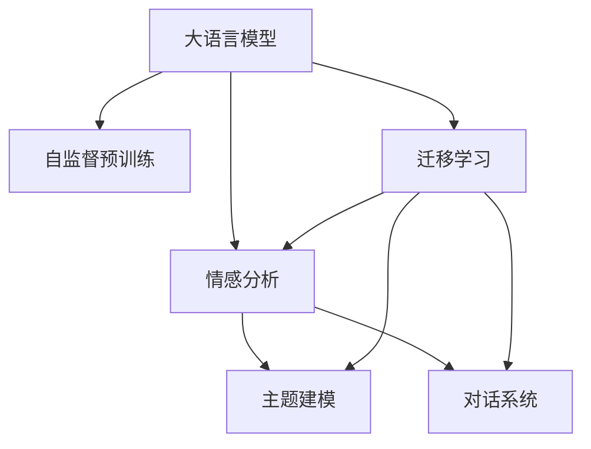

                 

# LLM在社交媒体分析中的应用：洞察用户行为

> 关键词：社交媒体分析, 大语言模型, 用户行为, 情感分析, 主题建模, 对话系统, 数据挖掘

## 1. 背景介绍

### 1.1 问题由来
随着社交媒体平台在全球范围内的广泛应用，用户在这些平台上的行为数据日益成为企业关注的重要资源。这些数据包含了大量的用户情感、兴趣、意见等信息，能够为市场营销、用户增长、产品优化等方面提供有力的支持。

社交媒体分析（Social Media Analytics），是指通过自然语言处理技术，对用户生成内容（User-Generated Content, UGC）进行挖掘和分析，以了解用户行为和情感变化，从而帮助企业制定更加精准的营销策略和优化决策。在技术上，社交媒体分析依赖于自然语言处理（Natural Language Processing, NLP）、情感分析（Sentiment Analysis）、主题建模（Topic Modeling）等方法，而这些技术通常需要结合大规模预训练语言模型（Large Language Models, LLMs），才能应对海量数据和高复杂度的分析需求。

大语言模型（如BERT、GPT-3等）基于大规模无标签文本数据进行自监督预训练，能够学习到丰富的语言知识和语义表示，在各种NLP任务中表现出卓越的性能。近年来，越来越多的企业在社交媒体分析中引入大语言模型，以提升分析的深度和广度，进一步挖掘数据背后的用户行为和情感信息。

### 1.2 问题核心关键点
大语言模型在社交媒体分析中的应用主要集中在以下几个方面：

1. **情感分析（Sentiment Analysis）**：判断用户内容中的情感倾向，如正面、中性或负面情感，从而评估用户对品牌或产品的态度。
2. **主题建模（Topic Modeling）**：从大量文本中识别和提取主要主题，了解用户关注的焦点和热点话题。
3. **对话系统（Dialog Systems）**：利用大语言模型建立与用户的智能对话，解答用户问题，收集更多用户反馈。
4. **数据挖掘（Data Mining）**：利用大语言模型进行实体识别、关系抽取等数据挖掘任务，从用户内容中提取有价值的信息。

通过结合这些技术，大语言模型能够帮助企业全面理解用户行为，洞察用户需求，优化产品和营销策略，提升用户体验。

## 2. 核心概念与联系

### 2.1 核心概念概述

为更好地理解大语言模型在社交媒体分析中的应用，本节将介绍几个密切相关的核心概念：

- **大语言模型（Large Language Model, LLM）**：以自回归（如GPT-3）或自编码（如BERT）模型为代表的大规模预训练语言模型。通过在大规模无标签文本语料上进行预训练，学习通用的语言表示，具备强大的语言理解和生成能力。

- **自监督预训练（Self-Supervised Pretraining）**：指在大规模无标签文本数据上，通过设计如掩码语言模型（Masked Language Modeling, MLM）、下一句预测（Next Sentence Prediction, NSP）等自监督任务训练模型，学习语言的通用表示。

- **迁移学习（Transfer Learning）**：指将一个领域学习到的知识，迁移应用到另一个不同但相关的领域的学习范式。大语言模型的预训练过程即是一种典型的迁移学习方式。

- **情感分析（Sentiment Analysis）**：通过分析用户文本中的情感倾向，评估用户对某品牌、产品或服务的正面、负面或中性情感。

- **主题建模（Topic Modeling）**：通过算法识别文本数据中的主题分布，提取用户关注的热点话题和趋势。

- **对话系统（Dialog Systems）**：利用自然语言理解和生成技术，建立能够理解用户意图并做出适当回应的智能对话系统。

这些核心概念之间的逻辑关系可以通过以下Mermaid流程图来展示：



这个流程图展示了大语言模型的核心概念及其之间的关系：

1. 大语言模型通过自监督预训练获得基础能力。
2. 迁移学习是连接预训练模型与社交媒体分析任务的桥梁，可以通过微调或特定任务的训练来实现。
3. 情感分析、主题建模、对话系统等应用都是在大语言模型的基础上，通过微调或特定任务训练得到的。

这些概念共同构成了大语言模型在社交媒体分析中的应用框架，使其能够更好地理解用户情感和行为，优化产品策略，提升用户体验。

## 3. 核心算法原理 & 具体操作步骤

### 3.1 算法原理概述

基于大语言模型在社交媒体分析中的应用，通常包括以下几个关键步骤：

1. **数据预处理**：收集和清洗社交媒体数据，去除噪声和无用信息，提取有用的用户生成内容（UGC）。
2. **特征提取**：将用户内容转换为机器可理解的向量表示，通常使用词嵌入（Word Embedding）或预训练语言模型的隐层表示。
3. **情感分析**：使用大语言模型进行情感分类，判断用户对品牌或产品的情感倾向。
4. **主题建模**：利用大语言模型进行主题识别，提取用户关注的焦点和热点话题。
5. **对话系统**：构建基于大语言模型的对话系统，解答用户问题，收集更多用户反馈。
6. **数据挖掘**：利用大语言模型进行实体识别、关系抽取等数据挖掘任务，从用户内容中提取有价值的信息。

### 3.2 算法步骤详解

**Step 1: 数据预处理**

社交媒体数据往往包含大量噪声和无用信息，如广告、机器人评论等。数据预处理的目标是去除这些噪声，保留有用的用户生成内容（UGC）。常见的预处理方法包括：

- **去重与去噪**：通过匹配用户ID、时间戳等方式去除重复和无效数据。
- **文本清洗**：去除标点符号、特殊字符、停用词等无用信息。
- **分词与词性标注**：将文本分词并标注词性，便于后续处理。
- **情感过滤**：去除明显恶意或垃圾内容。

**Step 2: 特征提取**

用户生成的文本数据需要转换为机器可理解的向量表示。常见的特征提取方法包括：

- **词嵌入（Word Embedding）**：使用Word2Vec、GloVe等算法将单词转换为向量表示。
- **预训练语言模型的隐层表示**：使用BERT、GPT等模型对文本进行预训练，得到隐层表示作为特征。
- **TF-IDF**：计算文本中每个单词的词频和逆文档频率，生成文本的向量表示。

**Step 3: 情感分析**

情感分析的目标是判断用户内容中的情感倾向，通常使用二分类或多分类模型进行预测。常见的情感分析方法包括：

- **基于规则的情感分析**：使用情感词典和规则进行情感分类。
- **基于机器学习的情感分析**：使用分类器如SVM、随机森林等对文本进行情感分类。
- **基于大语言模型的情感分析**：使用大语言模型进行情感分类，如使用BERT、GPT等进行情感分类。

**Step 4: 主题建模**

主题建模的目标是识别文本中的主要主题，通常使用主题模型如LDA（Latent Dirichlet Allocation）、LDA-BOW（LDA with Bag-of-Words）等进行建模。常见的预训练主题模型包括：

- **基于大语言模型的LDA**：使用大语言模型对文本进行编码，再利用LDA进行主题建模。
- **基于预训练模型的LDA-BOW**：使用预训练模型对文本进行编码，再利用LDA-BOW进行主题建模。

**Step 5: 对话系统**

对话系统的目标是建立能够理解用户意图并做出适当回应的智能对话系统。常见的构建方法包括：

- **基于规则的对话系统**：使用规则和模板进行对话生成。
- **基于机器学习的对话系统**：使用生成式模型如RNN、Transformer等进行对话生成。
- **基于大语言模型的对话系统**：使用大语言模型进行对话生成，如使用GPT等进行对话生成。

**Step 6: 数据挖掘**

数据挖掘的目标是从用户内容中提取有价值的信息。常见的数据挖掘任务包括：

- **实体识别（Named Entity Recognition, NER）**：识别文本中的实体，如人名、地名、机构名等。
- **关系抽取（Relation Extraction）**：提取文本中的实体关系，如A和B是朋友、A是B的股东等。
- **情感分析（Sentiment Analysis）**：判断用户对品牌或产品的情感倾向。

### 3.3 算法优缺点

基于大语言模型在社交媒体分析中的应用，具有以下优点：

1. **强大语言理解能力**：大语言模型能够学习到丰富的语言知识，能够理解复杂的自然语言文本。
2. **高效特征提取**：大语言模型的隐层表示可以作为高效的特征提取方式，提升分类、聚类等任务的性能。
3. **灵活应用场景**：大语言模型可以应用于情感分析、主题建模、对话系统等多个应用场景，灵活性高。
4. **提升用户体验**：通过分析用户情感和行为，优化产品策略，提升用户体验。

同时，该方法也存在一些局限性：

1. **标注数据需求高**：情感分析、主题建模等任务通常需要大量标注数据进行训练，标注成本较高。
2. **模型复杂度高**：大语言模型参数量较大，需要高性能计算资源进行训练和推理。
3. **解释性不足**：大语言模型通常是黑盒模型，难以解释其内部工作机制和决策逻辑。
4. **偏见与歧视**：预训练模型可能带有数据中的偏见和歧视，通过微调传递到下游任务，产生误导性、歧视性的输出。

尽管存在这些局限性，但就目前而言，大语言模型在社交媒体分析中的应用仍是最为主流范式。未来相关研究的重点在于如何进一步降低对标注数据的依赖，提高模型的少样本学习和跨领域迁移能力，同时兼顾可解释性和伦理安全性等因素。

### 3.4 算法应用领域

基于大语言模型在社交媒体分析中的应用，已经在多个领域得到了广泛的应用，例如：

- **市场营销**：通过分析用户情感和反馈，优化广告投放策略，提升品牌形象。
- **客户服务**：构建基于大语言模型的客户服务系统，解答用户问题，收集更多用户反馈。
- **用户增长**：分析用户行为数据，挖掘用户需求，优化产品功能，提升用户留存率。
- **内容推荐**：通过分析用户兴趣和行为，推荐相关内容，提升用户满意度。
- **舆情监测**：利用大语言模型进行舆情分析，及时发现和处理负面信息，维护品牌声誉。

除了上述这些经典应用外，大语言模型还创新性地应用于社交媒体数据分析，如情感分析、主题建模、对话系统、数据挖掘等，为社交媒体分析带来了全新的突破。随着预训练模型和应用方法的不断进步，相信社交媒体分析技术将在更广阔的应用领域大放异彩。

## 4. 数学模型和公式 & 详细讲解  
### 4.1 数学模型构建

本节将使用数学语言对基于大语言模型在社交媒体分析中的应用进行更加严格的刻画。

假设社交媒体数据集为 $D=\{(x_i,y_i)\}_{i=1}^N$，其中 $x_i$ 为文本数据，$y_i$ 为标签，可以是情感分类、主题、实体等。定义模型 $M_{\theta}$ 在输入 $x$ 上的预测为 $\hat{y}=M_{\theta}(x)$，则情感分析的损失函数为：

$$
\mathcal{L}(\theta) = -\frac{1}{N}\sum_{i=1}^N \log P(y_i|\hat{y}_i)
$$

其中 $P(y_i|\hat{y}_i)$ 为模型在输入 $x_i$ 上的预测概率分布。

### 4.2 公式推导过程

以情感分析为例，使用大语言模型进行二分类情感预测。假设模型输出为 $\hat{y}=[p_1,p_2]^T$，其中 $p_1$ 和 $p_2$ 分别为正类和负类的预测概率。情感分析的目标是最小化预测错误率，即：

$$
\mathcal{L}(\theta) = -\frac{1}{N}\sum_{i=1}^N [y_i \log p_{1_i} + (1-y_i) \log p_{2_i}]
$$

其中 $y_i \in \{0,1\}$，$p_{1_i}$ 和 $p_{2_i}$ 分别为输入 $x_i$ 对应 $y_i$ 的预测概率。

在得到损失函数后，即可使用梯度下降等优化算法进行模型训练。常见的优化算法包括Adam、SGD等，其公式为：

$$
\theta \leftarrow \theta - \eta \nabla_{\theta}\mathcal{L}(\theta)
$$

其中 $\eta$ 为学习率，$\nabla_{\theta}\mathcal{L}(\theta)$ 为损失函数对模型参数 $\theta$ 的梯度，可以通过自动微分技术高效计算。

### 4.3 案例分析与讲解

以Facebook的情感分析系统为例，该系统使用BERT模型进行情感分类。系统首先对用户评论进行预处理，去除噪声和无用信息，然后进行分词和词性标注。接着，将评论输入BERT模型进行编码，得到隐层表示。最后，使用情感分类器对隐层表示进行分类，输出情感标签。系统通过不断迭代训练，提升情感分类的准确率，及时分析用户反馈，优化产品策略。

## 5. 项目实践：代码实例和详细解释说明

### 5.1 开发环境搭建

在进行社交媒体分析项目开发前，我们需要准备好开发环境。以下是使用Python进行PyTorch开发的环境配置流程：

1. 安装Anaconda：从官网下载并安装Anaconda，用于创建独立的Python环境。

2. 创建并激活虚拟环境：
```bash
conda create -n pytorch-env python=3.8 
conda activate pytorch-env
```

3. 安装PyTorch：根据CUDA版本，从官网获取对应的安装命令。例如：
```bash
conda install pytorch torchvision torchaudio cudatoolkit=11.1 -c pytorch -c conda-forge
```

4. 安装Transformers库：
```bash
pip install transformers
```

5. 安装各类工具包：
```bash
pip install numpy pandas scikit-learn matplotlib tqdm jupyter notebook ipython
```

完成上述步骤后，即可在`pytorch-env`环境中开始社交媒体分析项目开发。

### 5.2 源代码详细实现

这里我们以Facebook的情感分析系统为例，给出使用Transformers库对BERT模型进行情感分析的PyTorch代码实现。

首先，定义情感分析任务的数据处理函数：

```python
from transformers import BertTokenizer
from torch.utils.data import Dataset
import torch

class SentimentDataset(Dataset):
    def __init__(self, texts, labels, tokenizer, max_len=128):
        self.texts = texts
        self.labels = labels
        self.tokenizer = tokenizer
        self.max_len = max_len
        
    def __len__(self):
        return len(self.texts)
    
    def __getitem__(self, item):
        text = self.texts[item]
        label = self.labels[item]
        
        encoding = self.tokenizer(text, return_tensors='pt', max_length=self.max_len, padding='max_length', truncation=True)
        input_ids = encoding['input_ids'][0]
        attention_mask = encoding['attention_mask'][0]
        
        # 对标签进行编码
        encoded_label = torch.tensor(label, dtype=torch.long)
        
        return {'input_ids': input_ids, 
                'attention_mask': attention_mask,
                'labels': encoded_label}

# 标签与id的映射
label2id = {'positive': 1, 'negative': 0}
id2label = {v: k for k, v in label2id.items()}

# 创建dataset
tokenizer = BertTokenizer.from_pretrained('bert-base-uncased')

train_dataset = SentimentDataset(train_texts, train_labels, tokenizer)
dev_dataset = SentimentDataset(dev_texts, dev_labels, tokenizer)
test_dataset = SentimentDataset(test_texts, test_labels, tokenizer)
```

然后，定义模型和优化器：

```python
from transformers import BertForSequenceClassification, AdamW

model = BertForSequenceClassification.from_pretrained('bert-base-uncased', num_labels=len(label2id))

optimizer = AdamW(model.parameters(), lr=2e-5)
```

接着，定义训练和评估函数：

```python
from torch.utils.data import DataLoader
from tqdm import tqdm
from sklearn.metrics import classification_report

device = torch.device('cuda') if torch.cuda.is_available() else torch.device('cpu')
model.to(device)

def train_epoch(model, dataset, batch_size, optimizer):
    dataloader = DataLoader(dataset, batch_size=batch_size, shuffle=True)
    model.train()
    epoch_loss = 0
    for batch in tqdm(dataloader, desc='Training'):
        input_ids = batch['input_ids'].to(device)
        attention_mask = batch['attention_mask'].to(device)
        labels = batch['labels'].to(device)
        model.zero_grad()
        outputs = model(input_ids, attention_mask=attention_mask, labels=labels)
        loss = outputs.loss
        epoch_loss += loss.item()
        loss.backward()
        optimizer.step()
    return epoch_loss / len(dataloader)

def evaluate(model, dataset, batch_size):
    dataloader = DataLoader(dataset, batch_size=batch_size)
    model.eval()
    preds, labels = [], []
    with torch.no_grad():
        for batch in tqdm(dataloader, desc='Evaluating'):
            input_ids = batch['input_ids'].to(device)
            attention_mask = batch['attention_mask'].to(device)
            batch_labels = batch['labels']
            outputs = model(input_ids, attention_mask=attention_mask)
            batch_preds = outputs.logits.argmax(dim=1).to('cpu').tolist()
            batch_labels = batch_labels.to('cpu').tolist()
            for pred, label in zip(batch_preds, batch_labels):
                preds.append(pred)
                labels.append(label)
                
    print(classification_report(labels, preds))
```

最后，启动训练流程并在测试集上评估：

```python
epochs = 5
batch_size = 16

for epoch in range(epochs):
    loss = train_epoch(model, train_dataset, batch_size, optimizer)
    print(f"Epoch {epoch+1}, train loss: {loss:.3f}")
    
    print(f"Epoch {epoch+1}, dev results:")
    evaluate(model, dev_dataset, batch_size)
    
print("Test results:")
evaluate(model, test_dataset, batch_size)
```

以上就是使用PyTorch对BERT进行情感分析的完整代码实现。可以看到，得益于Transformers库的强大封装，我们可以用相对简洁的代码完成BERT模型的加载和情感分析任务的开发。

### 5.3 代码解读与分析

让我们再详细解读一下关键代码的实现细节：

**SentimentDataset类**：
- `__init__`方法：初始化文本、标签、分词器等关键组件。
- `__len__`方法：返回数据集的样本数量。
- `__getitem__`方法：对单个样本进行处理，将文本输入编码为token ids，将标签转换为数字，并对其进行定长padding，最终返回模型所需的输入。

**label2id和id2label字典**：
- 定义了标签与数字id之间的映射关系，用于将预测结果解码回真实的标签。

**训练和评估函数**：
- 使用PyTorch的DataLoader对数据集进行批次化加载，供模型训练和推理使用。
- 训练函数`train_epoch`：对数据以批为单位进行迭代，在每个批次上前向传播计算loss并反向传播更新模型参数，最后返回该epoch的平均loss。
- 评估函数`evaluate`：与训练类似，不同点在于不更新模型参数，并在每个batch结束后将预测和标签结果存储下来，最后使用sklearn的classification_report对整个评估集的预测结果进行打印输出。

**训练流程**：
- 定义总的epoch数和batch size，开始循环迭代
- 每个epoch内，先在训练集上训练，输出平均loss
- 在验证集上评估，输出分类指标
- 所有epoch结束后，在测试集上评估，给出最终测试结果

可以看到，PyTorch配合Transformers库使得BERT情感分析的代码实现变得简洁高效。开发者可以将更多精力放在数据处理、模型改进等高层逻辑上，而不必过多关注底层的实现细节。

当然，工业级的系统实现还需考虑更多因素，如模型的保存和部署、超参数的自动搜索、更灵活的任务适配层等。但核心的微调范式基本与此类似。

## 6. 实际应用场景
### 6.1 智能客服系统

基于大语言模型的情感分析技术，可以广泛应用于智能客服系统的构建。传统客服往往需要配备大量人力，高峰期响应缓慢，且一致性和专业性难以保证。而使用情感分析技术，可以自动理解用户情感，快速响应客户咨询，用自然流畅的语言解答各类常见问题。

在技术实现上，可以收集企业内部的历史客服对话记录，将问题和最佳答复构建成监督数据，在此基础上对大语言模型进行情感分析训练。训练后的情感分析模型能够自动理解用户情感，匹配最合适的答复模板进行回复。对于客户提出的新问题，还可以接入检索系统实时搜索相关内容，动态组织生成回答。如此构建的智能客服系统，能大幅提升客户咨询体验和问题解决效率。

### 6.2 舆情监测系统

舆情监测系统是社交媒体分析的一个重要应用领域。通过情感分析技术，舆情监测系统能够实时监测网络舆情，及时发现和处理负面信息，维护品牌声誉。

在技术实现上，可以收集网络上的新闻、评论、社交媒体帖子等文本数据，使用情感分析技术对数据进行情感分类。系统通过实时分析舆情数据，及时发现舆情变化趋势，一旦发现负面信息激增等异常情况，系统便会自动预警，帮助企业及时应对潜在风险。

### 6.3 广告投放优化

社交媒体平台上的广告投放需要精准的定向投放策略，以提升广告效果。通过情感分析技术，可以分析用户对广告内容的情感倾向，优化广告投放策略。

在技术实现上，可以收集用户对广告的评论和反馈数据，使用情感分析技术对数据进行情感分类。系统通过分析用户情感倾向，识别出受欢迎和接受度高的广告内容，从而优化广告投放策略，提升广告效果。

### 6.4 用户行为分析

用户行为分析是社交媒体分析的重要应用之一。通过情感分析技术，可以分析用户对产品或服务的情感倾向，优化产品策略，提升用户体验。

在技术实现上，可以收集用户对产品或服务的评论和反馈数据，使用情感分析技术对数据进行情感分类。系统通过分析用户情感倾向，识别出用户关注的热点问题和痛点，从而优化产品策略，提升用户体验。

### 6.5 舆情预测

舆情预测是社交媒体分析的一个重要应用领域。通过情感分析技术，可以预测未来舆情变化趋势，帮助企业提前做好应对准备。

在技术实现上，可以使用时间序列预测模型，结合情感分析技术，预测未来舆情变化趋势。系统通过实时分析舆情数据，预测未来舆情变化，帮助企业提前做好应对准备。

## 7. 工具和资源推荐
### 7.1 学习资源推荐

为了帮助开发者系统掌握大语言模型在社交媒体分析中的应用，这里推荐一些优质的学习资源：

1. 《Transformer从原理到实践》系列博文：由大模型技术专家撰写，深入浅出地介绍了Transformer原理、BERT模型、情感分析等前沿话题。

2. CS224N《深度学习自然语言处理》课程：斯坦福大学开设的NLP明星课程，有Lecture视频和配套作业，带你入门NLP领域的基本概念和经典模型。

3. 《Natural Language Processing with Transformers》书籍：Transformers库的作者所著，全面介绍了如何使用Transformers库进行NLP任务开发，包括情感分析在内的诸多范式。

4. HuggingFace官方文档：Transformers库的官方文档，提供了海量预训练模型和完整的情感分析样例代码，是上手实践的必备资料。

5. CLUE开源项目：中文语言理解测评基准，涵盖大量不同类型的中文NLP数据集，并提供了基于情感分析的baseline模型，助力中文NLP技术发展。

通过对这些资源的学习实践，相信你一定能够快速掌握大语言模型在社交媒体分析中的应用，并用于解决实际的NLP问题。
###  7.2 开发工具推荐

高效的开发离不开优秀的工具支持。以下是几款用于大语言模型情感分析开发的常用工具：

1. PyTorch：基于Python的开源深度学习框架，灵活动态的计算图，适合快速迭代研究。大部分预训练语言模型都有PyTorch版本的实现。

2. TensorFlow：由Google主导开发的开源深度学习框架，生产部署方便，适合大规模工程应用。同样有丰富的预训练语言模型资源。

3. Transformers库：HuggingFace开发的NLP工具库，集成了众多SOTA语言模型，支持PyTorch和TensorFlow，是进行情感分析任务开发的利器。

4. Weights & Biases：模型训练的实验跟踪工具，可以记录和可视化模型训练过程中的各项指标，方便对比和调优。与主流深度学习框架无缝集成。

5. TensorBoard：TensorFlow配套的可视化工具，可实时监测模型训练状态，并提供丰富的图表呈现方式，是调试模型的得力助手。

6. Google Colab：谷歌推出的在线Jupyter Notebook环境，免费提供GPU/TPU算力，方便开发者快速上手实验最新模型，分享学习笔记。

合理利用这些工具，可以显著提升大语言模型情感分析任务的开发效率，加快创新迭代的步伐。

### 7.3 相关论文推荐

大语言模型在社交媒体情感分析中的应用，源于学界的持续研究。以下是几篇奠基性的相关论文，推荐阅读：

1. Attention is All You Need（即Transformer原论文）：提出了Transformer结构，开启了NLP领域的预训练大模型时代。

2. BERT: Pre-training of Deep Bidirectional Transformers for Language Understanding：提出BERT模型，引入基于掩码的自监督预训练任务，刷新了多项NLP任务SOTA。

3. Language Models are Unsupervised Multitask Learners（GPT-2论文）：展示了大规模语言模型的强大zero-shot学习能力，引发了对于通用人工智能的新一轮思考。

4. Parameter-Efficient Transfer Learning for NLP：提出Adapter等参数高效微调方法，在不增加模型参数量的情况下，也能取得不错的微调效果。

5. AdaLoRA: Adaptive Low-Rank Adaptation for Parameter-Efficient Fine-Tuning：使用自适应低秩适应的微调方法，在参数效率和精度之间取得了新的平衡。

6. Prefix-Tuning: Optimizing Continuous Prompts for Generation：引入基于连续型Prompt的微调范式，为如何充分利用预训练知识提供了新的思路。

这些论文代表了大语言模型情感分析技术的发展脉络。通过学习这些前沿成果，可以帮助研究者把握学科前进方向，激发更多的创新灵感。

## 8. 总结：未来发展趋势与挑战

### 8.1 总结

本文对基于大语言模型的社交媒体情感分析方法进行了全面系统的介绍。首先阐述了大语言模型和情感分析的研究背景和意义，明确了情感分析在社交媒体分析中的重要价值。其次，从原理到实践，详细讲解了情感分析的数学原理和关键步骤，给出了情感分析任务开发的完整代码实例。同时，本文还广泛探讨了情感分析技术在智能客服、舆情监测、广告投放、用户行为分析等多个行业领域的应用前景，展示了情感分析范式的巨大潜力。此外，本文精选了情感分析技术的各类学习资源，力求为读者提供全方位的技术指引。

通过本文的系统梳理，可以看到，基于大语言模型的情感分析方法正在成为社交媒体分析的重要范式，极大地拓展了预训练语言模型的应用边界，催生了更多的落地场景。受益于大规模语料的预训练，情感分析模型在情感分类、舆情监测、广告投放等任务上取得了优异的性能，有力推动了社交媒体分析技术的发展。未来，伴随预训练语言模型和情感分析方法的持续演进，相信社交媒体分析技术将在更广阔的应用领域大放异彩。

### 8.2 未来发展趋势

展望未来，大语言模型情感分析技术将呈现以下几个发展趋势：

1. 模型规模持续增大。随着算力成本的下降和数据规模的扩张，预训练语言模型的参数量还将持续增长。超大规模语言模型蕴含的丰富语言知识，有望支撑更加复杂多变的情感分析任务。

2. 情感分析方法日趋多样。除了传统的二分类情感分析外，未来会涌现更多多分类情感分析、零样本情感分析等方法，提升情感分析的泛化能力和精度。

3. 持续学习成为常态。随着数据分布的不断变化，情感分析模型也需要持续学习新知识以保持性能。如何在不遗忘原有知识的同时，高效吸收新样本信息，将成为重要的研究课题。

4. 标注样本需求降低。受启发于提示学习(Prompt-based Learning)的思路，未来的情感分析方法将更好地利用大模型的语言理解能力，通过更加巧妙的任务描述，在更少的标注样本上也能实现理想的情感分析效果。

5. 多模态情感分析崛起。当前的情感分析主要聚焦于文本数据，未来会进一步拓展到图像、视频、语音等多模态数据情感分析。多模态信息的融合，将显著提升情感分析模型的泛化性和鲁棒性。

6. 模型通用性增强。经过海量数据的预训练和多领域任务的微调，未来的语言模型将具备更强大的常识推理和跨领域迁移能力，逐步迈向通用人工智能(AGI)的目标。

以上趋势凸显了大语言模型情感分析技术的广阔前景。这些方向的探索发展，必将进一步提升情感分析模型的性能和应用范围，为社交媒体分析带来新的突破。

### 8.3 面临的挑战

尽管大语言模型情感分析技术已经取得了瞩目成就，但在迈向更加智能化、普适化应用的过程中，它仍面临着诸多挑战：

1. 标注成本瓶颈。情感分析任务通常需要大量标注数据进行训练，标注成本较高。如何进一步降低对标注数据的依赖，将是一大难题。

2. 模型鲁棒性不足。情感分析模型面对域外数据时，泛化性能往往大打折扣。对于测试样本的微小扰动，情感分析模型的预测也容易发生波动。如何提高情感分析模型的鲁棒性，避免灾难性遗忘，还需要更多理论和实践的积累。

3. 推理效率有待提高。大规模语言模型虽然精度高，但在实际部署时往往面临推理速度慢、内存占用大等效率问题。如何在保证性能的同时，简化模型结构，提升推理速度，优化资源占用，将是重要的优化方向。

4. 解释性不足。当前情感分析模型通常是黑盒模型，难以解释其内部工作机制和决策逻辑。对于金融、医疗等高风险应用，算法的可解释性和可审计性尤为重要。如何赋予情感分析模型更强的可解释性，将是亟待攻克的难题。

5. 安全性有待保障。情感分析模型可能学习到有偏见、有害的信息，通过微调传递到下游任务，产生误导性、歧视性的输出。如何从数据和算法层面消除模型偏见，避免恶意用途，确保输出的安全性，也将是重要的研究课题。

6. 知识整合能力不足。现有的情感分析模型往往局限于文本数据，难以灵活吸收和运用更广泛的先验知识。如何让情感分析过程更好地与外部知识库、规则库等专家知识结合，形成更加全面、准确的信息整合能力，还有很大的想象空间。

正视情感分析面临的这些挑战，积极应对并寻求突破，将是大语言模型情感分析走向成熟的必由之路。相信随着学界和产业界的共同努力，这些挑战终将一一被克服，大语言模型情感分析必将在构建人机协同的智能时代中扮演越来越重要的角色。

### 8.4 研究展望

面向未来，大语言模型情感分析技术需要在以下几个方面寻求新的突破：

1. 探索无监督和半监督情感分析方法。摆脱对大规模标注数据的依赖，利用自监督学习、主动学习等无监督和半监督范式，最大限度利用非结构化数据，实现更加灵活高效的情感分析。

2. 研究参数高效和计算高效的情感分析范式。开发更加参数高效的情感分析方法，在固定大部分预训练参数的同时，只更新极少量的任务相关参数。同时优化情感分析模型的计算图，减少前向传播和反向传播的资源消耗，实现更加轻量级、实时性的部署。

3. 引入因果和对比学习范式。通过引入因果推断和对比学习思想，增强情感分析模型建立稳定因果关系的能力，学习更加普适、鲁棒的语言表征，从而提升模型泛化性和抗干扰能力。

4. 引入更多先验知识。将符号化的先验知识，如知识图谱、逻辑规则等，与神经网络模型进行巧妙融合，引导情感分析过程学习更准确、合理的语言模型。同时加强不同模态数据的整合，实现视觉、语音等多模态信息与文本信息的协同建模。

5. 结合因果分析和博弈论工具。将因果分析方法引入情感分析模型，识别出模型决策的关键特征，增强输出解释的因果性和逻辑性。借助博弈论工具刻画人机交互过程，主动探索并规避模型的脆弱点，提高系统稳定性。

6. 纳入伦理道德约束。在模型训练目标中引入伦理导向的评估指标，过滤和惩罚有偏见、有害的输出倾向。同时加强人工干预和审核，建立模型行为的监管机制，确保输出符合人类价值观和伦理道德。

这些研究方向的探索，必将引领大语言模型情感分析技术迈向更高的台阶，为构建安全、可靠、可解释、可控的智能系统铺平道路。面向未来，大语言模型情感分析技术还需要与其他人工智能技术进行更深入的融合，如知识表示、因果推理、强化学习等，多路径协同发力，共同推动自然语言理解和智能交互系统的进步。只有勇于创新、敢于突破，才能不断拓展语言模型的边界，让智能技术更好地造福人类社会。

## 9. 附录：常见问题与解答

**Q1：大语言模型情感分析是否适用于所有社交媒体平台？**

A: 大语言模型情感分析在大多数社交媒体平台上都能取得不错的效果，特别是对于文本数据为主的平台。但对于图片、视频为主的平台，需要结合图像识别、视频分析等技术进行情感分析。此外，不同平台的用户行为和情感表达方式可能存在差异，需要针对性地进行模型适配。

**Q2：如何缓解情感分析中的标注数据需求？**

A: 标注数据需求高是情感分析的一大瓶颈，可以考虑以下方法缓解：

- 数据增强：通过回译、近义替换等方式扩充训练集。
- 弱监督学习：利用半监督、弱监督学习方法，从已有标签数据中提取更多信息。
- 自监督学习：使用自监督学习方法，如掩码语言模型（MLM）、下一句预测（NSP）等，提升模型泛化能力。
- 迁移学习：利用预训练模型的知识，进行少样本情感分析，降低标注数据需求。

这些方法可以结合使用，最大限度降低标注数据需求，提升情感分析模型的泛化能力。

**Q3：情感分析中的多模态融合如何实现？**

A: 多模态融合是情感分析的一个重要方向，可以通过以下方法实现：

- 数据预处理：对不同模态的数据进行统一的预处理，如文本清洗、图像裁剪等。
- 特征提取：对不同模态的数据进行特征提取，如文本的词嵌入、图像的卷积特征等。
- 模型融合：使用不同的模型对不同模态的数据进行处理，再通过融合得到综合的情感分类结果。

常用的融合方法包括：

- 特征级融合：直接对不同模态的特征进行线性组合或加权平均。
- 模型级融合：使用不同的模型对不同模态的数据进行处理，再通过集成学习方法进行融合。
- 混合级融合：同时使用特征级和模型级融合，综合考虑不同模态的信息。

多模态融合能够充分利用不同模态的数据信息，提升情感分析模型的性能和泛化能力。

**Q4：情感分析中的对抗样本攻击如何防御？**

A: 对抗样本攻击是情感分析模型面临的一个重要挑战，可以通过以下方法进行防御：

- 数据增强：通过在训练集中引入对抗样本，提高模型的鲁棒性。
- 模型鲁棒化：使用鲁棒性较高的模型架构，如Dropout、L2正则等，减少对抗样本的影响。
- 对抗训练：使用对抗训练方法，生成对抗样本进行模型训练，提升模型的鲁棒性。
- 异常检测：对输入数据进行异常检测，排除对抗样本的干扰。

这些方法可以结合使用，提高情感分析模型的鲁棒性和安全性。

**Q5：情感分析中的多任务学习如何实现？**

A: 多任务学习是将多个相关任务联合训练，提高模型泛化能力的一种方法。在情感分析中，可以通过以下方法实现：

- 数据共享：共享不同任务之间的数据，提高模型对不同任务的适应能力。
- 特征共享：共享不同任务之间的特征，提高模型对不同特征的利用率。
- 模型共享：共享不同任务的模型结构，提高模型对不同任务的处理能力。

常用的多任务学习框架包括：

- 独立学习：不同任务独立训练，最后通过线性融合或集成学习方法进行融合。
- 联合学习：不同任务共享模型参数，提高模型对不同任务的适应能力。
- 主任务学习：在多个任务中选择一个主任务，其他任务作为辅助任务，通过共享模型参数进行联合训练。

多任务学习能够充分利用不同任务之间的关联性，提高情感分析模型的性能和泛化能力。

**Q6：情感分析中的多语言支持如何实现？**

A: 情感分析的多语言支持是当前的一个热门研究方向，可以通过以下方法实现：

- 多语言预训练：在预训练阶段使用多语言数据进行训练，提高模型的多语言泛化能力。
- 跨语言迁移：利用预训练模型的知识，进行少样本多语言情感分析，降低标注数据需求。
- 多语言模型：使用多语言模型进行情感分类，如使用BART、M-BART等进行多语言情感分析。

常用的多语言模型框架包括：

- 编码器-解码器架构：使用编码器对输入文本进行编码，解码器进行情感分类。
- Transformer架构：使用Transformer结构进行多语言情感分类。

多语言支持能够充分利用不同语言的数据信息，提升情感分析模型的性能和泛化能力。

---

作者：禅与计算机程序设计艺术 / Zen and the Art of Computer Programming

