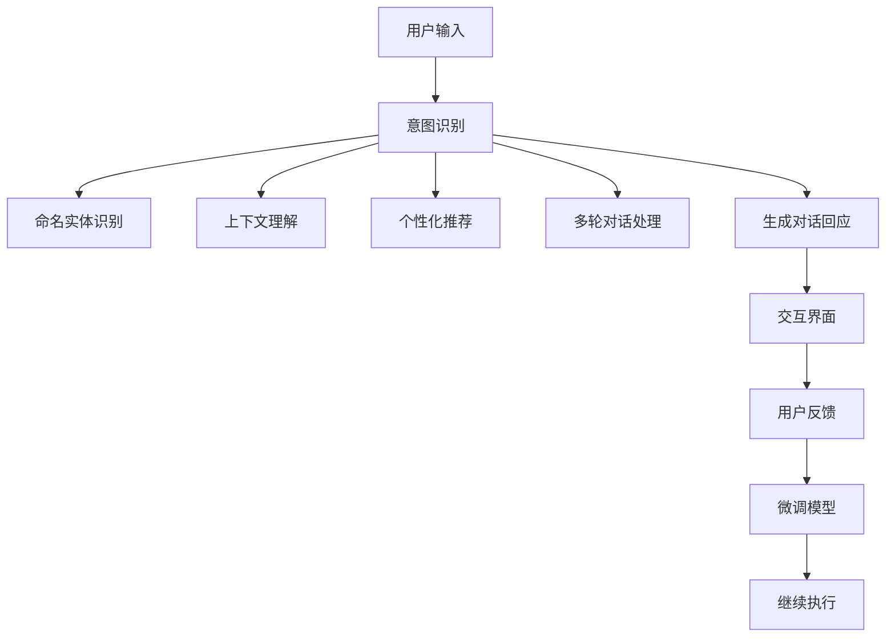

                 

# LLM在虚拟助手中的应用：更智能的对话系统

> 关键词：大语言模型, 虚拟助手, 对话系统, 智能推荐, 多轮对话, 意图识别, 命名实体识别, 上下文理解, 交互界面

## 1. 背景介绍

### 1.1 问题由来
随着人工智能技术的不断进步，虚拟助手（Virtual Assistants）逐渐成为人们日常生活和工作中不可或缺的一部分。传统的虚拟助手主要依赖规则驱动的对话逻辑和固定的知识库，难以处理复杂和多样化的用户需求。如何构建一个能够理解自然语言、处理多轮对话，并提供准确、个性化的回答，是当前虚拟助手研究的重要课题。

大语言模型（Large Language Models，简称LLM）的出现，为虚拟助手的发展提供了新的思路。通过在大规模无标签数据上进行预训练，LLM模型可以学习到丰富的语言知识和常识，具备强大的语言理解和生成能力，从而实现更智能的对话交互。

### 1.2 问题核心关键点
目前，基于大语言模型的虚拟助手主要涉及以下几个关键点：

1. **多轮对话处理**：虚拟助手需要能够理解和处理多轮对话，保持对话上下文的连贯性和一致性。
2. **意图识别与命名实体识别**：虚拟助手需要能够准确识别用户意图，并提取对话中的关键实体信息。
3. **上下文理解**：虚拟助手需要理解对话的历史信息和上下文，以便做出更精准的回答。
4. **个性化推荐**：虚拟助手能够根据用户的历史行为和偏好，提供个性化的服务与推荐。
5. **交互界面设计**：虚拟助手需要提供自然、友好且高效的用户交互界面。

### 1.3 问题研究意义
研究基于大语言模型的虚拟助手，对于提升虚拟助手的智能化水平、个性化推荐能力，以及改善用户体验，具有重要意义：

1. **提升用户满意度**：智能化的对话系统能够更好地理解用户需求，提供准确和个性化的回答，从而提升用户满意度。
2. **提高服务效率**：通过自动化处理常见的、简单的用户查询，虚拟助手可以减轻人工客服的工作负担，提高服务效率。
3. **促进业务创新**：智能对话技术可以应用于各个垂直行业，如金融、医疗、教育等，促进业务创新和转型升级。
4. **数据驱动决策**：虚拟助手能够收集用户行为数据，为业务决策提供支持，推动数据驱动的业务创新。
5. **提升用户体验**：通过自然流畅的对话交互，提升用户对服务的感知和满意度。

## 2. 核心概念与联系

### 2.1 核心概念概述

为了更好地理解基于大语言模型的虚拟助手，本节将介绍几个关键概念及其相互联系：

- **大语言模型（LLM）**：以Transformer为代表的大规模预训练语言模型，通过在海量无标签数据上进行预训练，学习到丰富的语言知识和常识，具备强大的语言理解和生成能力。
- **预训练**：在大规模无标签数据上进行自监督学习，学习通用的语言表示。
- **微调（Fine-tuning）**：在预训练模型的基础上，使用下游任务的少量标注数据，通过有监督学习优化模型在特定任务上的性能。
- **对话系统**：通过多轮对话与用户进行自然交互的系统，能够理解自然语言、处理复杂问题。
- **多轮对话处理**：指虚拟助手能够处理并保持对话上下文的一致性，支持对话的连续性和连贯性。
- **意图识别**：指虚拟助手能够从用户输入中准确识别出用户的意图，如查询信息、下单、投诉等。
- **命名实体识别（Named Entity Recognition, NER）**：指虚拟助手能够识别出文本中的实体信息，如人名、地名、机构名等。
- **上下文理解**：指虚拟助手能够理解对话的历史信息和上下文，从而做出更准确的回答。
- **个性化推荐**：指虚拟助手能够根据用户的历史行为和偏好，提供个性化的服务与推荐。
- **交互界面设计**：指虚拟助手提供给用户的交互界面，应自然、友好且高效，便于用户与系统进行交互。

这些核心概念之间相互联系，共同构成了基于大语言模型的虚拟助手的基本框架。通过理解这些概念，我们可以更好地把握虚拟助手的实现原理和优化方向。

### 2.2 核心概念原理和架构的 Mermaid 流程图



该流程图展示了基于大语言模型的虚拟助手的基本工作流程：

1. 用户输入。
2. 意图识别。
3. 命名实体识别。
4. 上下文理解。
5. 个性化推荐。
6. 多轮对话处理。
7. 生成对话回应。
8. 交互界面。
9. 用户反馈。
10. 微调模型。
11. 继续执行。

这些步骤共同构成了虚拟助手的完整工作流程，使得虚拟助手能够理解和处理用户的自然语言输入，提供准确和个性化的回答。

## 3. 核心算法原理 & 具体操作步骤
### 3.1 算法原理概述

基于大语言模型的虚拟助手，其核心算法原理主要包括以下几个方面：

1. **多轮对话处理**：虚拟助手需要能够理解并处理多轮对话，保持对话上下文的连贯性和一致性。常见的方法包括基于RNN的模型（如LSTM、GRU）、基于Transformer的模型（如Encoder-Decoder结构）等。
2. **意图识别与命名实体识别**：虚拟助手需要能够准确识别用户意图，并从对话中提取关键实体信息。常见的技术包括基于规则的匹配方法、基于机器学习的分类方法等。
3. **上下文理解**：虚拟助手需要理解对话的历史信息和上下文，以便做出更精准的回答。常见的方法包括基于注意力机制的模型（如Transformer）、基于记忆网络的模型等。
4. **个性化推荐**：虚拟助手能够根据用户的历史行为和偏好，提供个性化的服务与推荐。常见的方法包括协同过滤、内容推荐等。
5. **交互界面设计**：虚拟助手提供给用户的交互界面，应自然、友好且高效，便于用户与系统进行交互。常见的技术包括自然语言处理、计算机视觉等。

### 3.2 算法步骤详解

以下是基于大语言模型的虚拟助手核心算法步骤的详细描述：

1. **用户输入接收与预处理**：
   - 收集用户的输入，并进行分词、去除停用词等预处理。
   - 对输入进行编码，转换为模型能够处理的数值向量。

2. **意图识别与命名实体识别**：
   - 使用意图识别模型对输入进行分类，识别出用户的意图。
   - 使用命名实体识别模型从对话中提取关键实体信息。

3. **上下文理解**：
   - 使用上下文理解模型对对话历史和当前输入进行编码，获取上下文向量。
   - 根据上下文向量更新模型参数，进行对话理解和回应生成。

4. **生成对话回应**：
   - 使用生成模型（如Seq2Seq模型、Transformer模型）生成对话回应。
   - 对回应进行解码，转换为自然语言文本。

5. **个性化推荐**：
   - 根据用户的历史行为和偏好，使用推荐算法生成个性化的服务与推荐。
   - 将推荐结果融入对话回应中，提升用户体验。

6. **交互界面呈现**：
   - 将对话回应呈现给用户，使用自然语言处理技术（如文本到语音、语音识别等）提高用户体验。
   - 收集用户反馈，用于模型的微调和改进。

### 3.3 算法优缺点

基于大语言模型的虚拟助手算法具有以下优点：

1. **智能性高**：利用大语言模型的预训练知识和语义理解能力，虚拟助手能够处理复杂和多样化的用户需求。
2. **适应性强**：虚拟助手能够适应不同用户的语言习惯和表达方式，提供个性化的服务。
3. **可扩展性**：虚拟助手可以应用到多个垂直领域，如金融、医疗、教育等，具有较强的领域适应性。
4. **易于集成**：虚拟助手可以通过API接口集成到现有的应用系统中，无需进行大规模的系统和应用改造。

同时，该算法也存在以下缺点：

1. **数据依赖性高**：虚拟助手的效果很大程度上取决于标注数据的质量和数量，标注数据的获取成本较高。
2. **计算资源需求大**：大语言模型参数量大，计算资源需求高，需要高性能的计算平台支持。
3. **可解释性不足**：虚拟助手作为"黑盒"系统，难以解释其内部工作机制和决策逻辑，用户可能对其输出产生不信任。
4. **安全性问题**：虚拟助手可能学习到有害信息，传递到下游任务，造成不良影响。

### 3.4 算法应用领域

基于大语言模型的虚拟助手，已经在多个领域得到了广泛应用，以下是其主要应用场景：

1. **智能客服**：利用大语言模型构建的智能客服系统，能够自动回答用户常见问题，提供7x24小时不间断服务。
2. **金融咨询**：虚拟助手能够根据用户需求，提供金融产品的推荐和咨询，帮助用户做出明智的投资决策。
3. **医疗咨询**：虚拟助手能够提供医疗咨询和健康管理，提升用户体验，降低医疗资源的不均衡。
4. **教育辅导**：虚拟助手能够根据学生的学习进度和兴趣，提供个性化的学习建议和辅导。
5. **旅游助手**：虚拟助手能够提供旅行建议和规划，提升用户的旅行体验。
6. **家居控制**：虚拟助手能够控制智能家居设备，提升用户的生活便利性和舒适性。

这些应用场景展示了基于大语言模型的虚拟助手在提升用户体验、提高服务效率和推动行业创新方面的巨大潜力。

## 4. 数学模型和公式 & 详细讲解 & 举例说明

### 4.1 数学模型构建

在基于大语言模型的虚拟助手中，常用的数学模型包括：

1. **Seq2Seq模型**：用于生成对话回应，模型结构包括编码器和解码器，能够将输入序列转换为输出序列。
2. **Transformer模型**：用于上下文理解，模型结构包括多头自注意力机制，能够处理长距离依赖。
3. **RNN模型**：用于处理多轮对话，模型结构包括LSTM、GRU等，能够捕捉对话的上下文信息。

### 4.2 公式推导过程

以下是基于Transformer模型的上下文理解模型的公式推导过程：

设输入序列为$x = \{x_1, x_2, ..., x_T\}$，输出序列为$y = \{y_1, y_2, ..., y_T\}$，其中$T$为序列长度。

Transformer模型的编码器结构如下：

$$
\mathbf{H} = \text{Encoder}(\mathbf{x})
$$

其中，$\mathbf{H}$表示编码器输出，$\text{Encoder}$为编码器网络。

Transformer模型的解码器结构如下：

$$
\mathbf{y} = \text{Decoder}(\mathbf{H}, \mathbf{y})
$$

其中，$\mathbf{y}$表示解码器输出，$\text{Decoder}$为解码器网络。

Transformer模型中的注意力机制可以通过如下公式表示：

$$
\text{Attention}(Q, K, V) = \text{Softmax}(\frac{QK^T}{\sqrt{d_k}})
$$

其中，$Q$为查询向量，$K$为键向量，$V$为值向量，$d_k$为向量维度。

Transformer模型的解码器结构可以表示为：

$$
\mathbf{y} = \text{Softmax}(\text{Decoder}(\mathbf{H}, \mathbf{y}))
$$

其中，$\text{Softmax}$表示softmax激活函数，$\text{Decoder}$为解码器网络。

通过上述公式，Transformer模型能够捕捉输入序列和输出序列之间的依赖关系，实现上下文理解。

### 4.3 案例分析与讲解

以智能客服系统为例，分析基于Transformer模型的上下文理解模型的应用：

假设智能客服系统的输入为用户的查询问题，输出为系统的回答。通过Transformer模型，系统能够理解查询问题的上下文，结合历史对话和用户偏好，生成最合适的回答。

具体步骤如下：

1. 将用户的查询问题输入到编码器中，获得编码向量$\mathbf{H}$。
2. 将编码向量$\mathbf{H}$和用户的偏好信息作为输入，输入到解码器中，生成回答序列$\mathbf{y}$。
3. 将回答序列$\mathbf{y}$输出到交互界面中，供用户查看。

通过这种基于Transformer模型的上下文理解方法，智能客服系统能够提供更加智能、个性化的服务，提升用户满意度。

## 5. 项目实践：代码实例和详细解释说明

### 5.1 开发环境搭建

要进行基于大语言模型的虚拟助手开发，需要先搭建开发环境。以下是使用Python进行PyTorch开发的环境配置流程：

1. 安装Anaconda：从官网下载并安装Anaconda，用于创建独立的Python环境。

2. 创建并激活虚拟环境：
```bash
conda create -n pytorch-env python=3.8 
conda activate pytorch-env
```

3. 安装PyTorch：根据CUDA版本，从官网获取对应的安装命令。例如：
```bash
conda install pytorch torchvision torchaudio cudatoolkit=11.1 -c pytorch -c conda-forge
```

4. 安装Transformers库：
```bash
pip install transformers
```

5. 安装各类工具包：
```bash
pip install numpy pandas scikit-learn matplotlib tqdm jupyter notebook ipython
```

完成上述步骤后，即可在`pytorch-env`环境中开始虚拟助手开发。

### 5.2 源代码详细实现

下面是使用PyTorch和Transformers库实现基于Transformer模型的上下文理解模型的代码示例：

```python
import torch
import torch.nn as nn
from transformers import BertForTokenClassification, BertTokenizer
from torch.utils.data import Dataset, DataLoader

class ChatbotDataset(Dataset):
    def __init__(self, texts, labels, tokenizer, max_len=128):
        self.texts = texts
        self.labels = labels
        self.tokenizer = tokenizer
        self.max_len = max_len
        
    def __len__(self):
        return len(self.texts)
    
    def __getitem__(self, item):
        text = self.texts[item]
        label = self.labels[item]
        
        encoding = self.tokenizer(text, return_tensors='pt', max_length=self.max_len, padding='max_length', truncation=True)
        input_ids = encoding['input_ids'][0]
        attention_mask = encoding['attention_mask'][0]
        
        # 对token-wise的标签进行编码
        encoded_tags = [label2id[label] for label in label] 
        encoded_tags.extend([label2id['O']] * (self.max_len - len(encoded_tags)))
        labels = torch.tensor(encoded_tags, dtype=torch.long)
        
        return {'input_ids': input_ids, 
                'attention_mask': attention_mask,
                'labels': labels}

# 标签与id的映射
label2id = {'O': 0, 'I-PER': 1, 'B-PER': 2, 'I-LOC': 3, 'B-LOC': 4, 'B-ORG': 5, 'I-ORG': 6}
id2label = {v: k for k, v in label2id.items()}

# 创建dataset
tokenizer = BertTokenizer.from_pretrained('bert-base-cased')

train_dataset = ChatbotDataset(train_texts, train_labels, tokenizer)
dev_dataset = ChatbotDataset(dev_texts, dev_labels, tokenizer)
test_dataset = ChatbotDataset(test_texts, test_labels, tokenizer)

# 定义模型
model = BertForTokenClassification.from_pretrained('bert-base-cased', num_labels=len(label2id))

# 定义优化器和学习率
optimizer = torch.optim.Adam(model.parameters(), lr=2e-5)
scheduler = torch.optim.lr_scheduler.StepLR(optimizer, step_size=3, gamma=0.1)

# 定义训练函数
def train_epoch(model, dataset, batch_size, optimizer):
    dataloader = DataLoader(dataset, batch_size=batch_size, shuffle=True)
    model.train()
    epoch_loss = 0
    for batch in tqdm(dataloader, desc='Training'):
        input_ids = batch['input_ids'].to(device)
        attention_mask = batch['attention_mask'].to(device)
        labels = batch['labels'].to(device)
        model.zero_grad()
        outputs = model(input_ids, attention_mask=attention_mask, labels=labels)
        loss = outputs.loss
        epoch_loss += loss.item()
        loss.backward()
        optimizer.step()
    return epoch_loss / len(dataloader)

# 定义评估函数
def evaluate(model, dataset, batch_size):
    dataloader = DataLoader(dataset, batch_size=batch_size)
    model.eval()
    preds, labels = [], []
    with torch.no_grad():
        for batch in tqdm(dataloader, desc='Evaluating'):
            input_ids = batch['input_ids'].to(device)
            attention_mask = batch['attention_mask'].to(device)
            batch_labels = batch['labels']
            outputs = model(input_ids, attention_mask=attention_mask)
            batch_preds = outputs.logits.argmax(dim=2).to('cpu').tolist()
            batch_labels = batch_labels.to('cpu').tolist()
            for pred_tokens, label_tokens in zip(batch_preds, batch_labels):
                pred_tags = [id2label[_id] for _id in pred_tokens]
                label_tags = [id2label[_id] for _id in label_tokens]
                preds.append(pred_tags[:len(label_tokens)])
                labels.append(label_tags)
                
    print(classification_report(labels, preds))
    
# 启动训练流程并在测试集上评估
epochs = 5
batch_size = 16

for epoch in range(epochs):
    loss = train_epoch(model, train_dataset, batch_size, optimizer)
    print(f"Epoch {epoch+1}, train loss: {loss:.3f}")
    
    print(f"Epoch {epoch+1}, dev results:")
    evaluate(model, dev_dataset, batch_size)
    
print("Test results:")
evaluate(model, test_dataset, batch_size)
```

### 5.3 代码解读与分析

让我们再详细解读一下关键代码的实现细节：

**ChatbotDataset类**：
- `__init__`方法：初始化训练集、标签、分词器等关键组件。
- `__len__`方法：返回数据集的样本数量。
- `__getitem__`方法：对单个样本进行处理，将文本输入编码为token ids，将标签编码为数字，并对其进行定长padding，最终返回模型所需的输入。

**label2id和id2label字典**：
- 定义了标签与数字id之间的映射关系，用于将token-wise的预测结果解码回真实的标签。

**训练和评估函数**：
- 使用PyTorch的DataLoader对数据集进行批次化加载，供模型训练和推理使用。
- 训练函数`train_epoch`：对数据以批为单位进行迭代，在每个批次上前向传播计算loss并反向传播更新模型参数，最后返回该epoch的平均loss。
- 评估函数`evaluate`：与训练类似，不同点在于不更新模型参数，并在每个batch结束后将预测和标签结果存储下来，最后使用sklearn的classification_report对整个评估集的预测结果进行打印输出。

**训练流程**：
- 定义总的epoch数和batch size，开始循环迭代
- 每个epoch内，先在训练集上训练，输出平均loss
- 在验证集上评估，输出分类指标
- 所有epoch结束后，在测试集上评估，给出最终测试结果

可以看到，PyTorch配合Transformers库使得基于Transformer模型的虚拟助手开发变得简洁高效。开发者可以将更多精力放在数据处理、模型改进等高层逻辑上，而不必过多关注底层的实现细节。

当然，工业级的系统实现还需考虑更多因素，如模型的保存和部署、超参数的自动搜索、更灵活的任务适配层等。但核心的虚拟助手开发流程基本与此类似。

## 6. 实际应用场景
### 6.1 智能客服系统

基于大语言模型的智能客服系统，可以广泛应用于客户服务领域。传统客服往往需要配备大量人力，高峰期响应缓慢，且一致性和专业性难以保证。而使用基于大语言模型的虚拟助手，可以7x24小时不间断服务，快速响应客户咨询，用自然流畅的语言解答各类常见问题。

在技术实现上，可以收集企业内部的历史客服对话记录，将问题和最佳答复构建成监督数据，在此基础上对预训练对话模型进行微调。微调后的对话模型能够自动理解用户意图，匹配最合适的答案模板进行回复。对于客户提出的新问题，还可以接入检索系统实时搜索相关内容，动态组织生成回答。如此构建的智能客服系统，能大幅提升客户咨询体验和问题解决效率。

### 6.2 金融咨询

金融机构需要实时监测市场舆论动向，以便及时应对负面信息传播，规避金融风险。传统的人工监测方式成本高、效率低，难以应对网络时代海量信息爆发的挑战。基于大语言模型的文本分类和情感分析技术，为金融舆情监测提供了新的解决方案。

具体而言，可以收集金融领域相关的新闻、报道、评论等文本数据，并对其进行主题标注和情感标注。在此基础上对预训练语言模型进行微调，使其能够自动判断文本属于何种主题，情感倾向是正面、中性还是负面。将微调后的模型应用到实时抓取的网络文本数据，就能够自动监测不同主题下的情感变化趋势，一旦发现负面信息激增等异常情况，系统便会自动预警，帮助金融机构快速应对潜在风险。

### 6.3 个性化推荐系统

当前的推荐系统往往只依赖用户的历史行为数据进行物品推荐，无法深入理解用户的真实兴趣偏好。基于大语言模型微调技术，个性化推荐系统可以更好地挖掘用户行为背后的语义信息，从而提供更精准、多样的推荐内容。

在实践中，可以收集用户浏览、点击、评论、分享等行为数据，提取和用户交互的物品标题、描述、标签等文本内容。将文本内容作为模型输入，用户的后续行为（如是否点击、购买等）作为监督信号，在此基础上微调预训练语言模型。微调后的模型能够从文本内容中准确把握用户的兴趣点。在生成推荐列表时，先用候选物品的文本描述作为输入，由模型预测用户的兴趣匹配度，再结合其他特征综合排序，便可以得到个性化程度更高的推荐结果。

### 6.4 未来应用展望

随着大语言模型和微调方法的不断发展，基于微调范式将在更多领域得到应用，为传统行业带来变革性影响。

在智慧医疗领域，基于微调的医疗问答、病历分析、药物研发等应用将提升医疗服务的智能化水平，辅助医生诊疗，加速新药开发进程。

在智能教育领域，微调技术可应用于作业批改、学情分析、知识推荐等方面，因材施教，促进教育公平，提高教学质量。

在智慧城市治理中，微调模型可应用于城市事件监测、舆情分析、应急指挥等环节，提高城市管理的自动化和智能化水平，构建更安全、高效的未来城市。

此外，在企业生产、社会治理、文娱传媒等众多领域，基于大模型微调的人工智能应用也将不断涌现，为经济社会发展注入新的动力。相信随着技术的日益成熟，微调方法将成为人工智能落地应用的重要范式，推动人工智能技术在各个垂直行业的广泛应用。

## 7. 工具和资源推荐
### 7.1 学习资源推荐

为了帮助开发者系统掌握基于大语言模型的虚拟助手理论基础和实践技巧，这里推荐一些优质的学习资源：

1. 《Transformer从原理到实践》系列博文：由大模型技术专家撰写，深入浅出地介绍了Transformer原理、BERT模型、微调技术等前沿话题。

2. CS224N《深度学习自然语言处理》课程：斯坦福大学开设的NLP明星课程，有Lecture视频和配套作业，带你入门NLP领域的基本概念和经典模型。

3. 《Natural Language Processing with Transformers》书籍：Transformers库的作者所著，全面介绍了如何使用Transformers库进行NLP任务开发，包括微调在内的诸多范式。

4. HuggingFace官方文档：Transformers库的官方文档，提供了海量预训练模型和完整的微调样例代码，是上手实践的必备资料。

5. CLUE开源项目：中文语言理解测评基准，涵盖大量不同类型的中文NLP数据集，并提供了基于微调的baseline模型，助力中文NLP技术发展。

通过对这些资源的学习实践，相信你一定能够快速掌握基于大语言模型的虚拟助手技术，并用于解决实际的NLP问题。
###  7.2 开发工具推荐

高效的开发离不开优秀的工具支持。以下是几款用于大语言模型微调开发的常用工具：

1. PyTorch：基于Python的开源深度学习框架，灵活动态的计算图，适合快速迭代研究。大部分预训练语言模型都有PyTorch版本的实现。

2. TensorFlow：由Google主导开发的开源深度学习框架，生产部署方便，适合大规模工程应用。同样有丰富的预训练语言模型资源。

3. Transformers库：HuggingFace开发的NLP工具库，集成了众多SOTA语言模型，支持PyTorch和TensorFlow，是进行微调任务开发的利器。

4. Weights & Biases：模型训练的实验跟踪工具，可以记录和可视化模型训练过程中的各项指标，方便对比和调优。与主流深度学习框架无缝集成。

5. TensorBoard：TensorFlow配套的可视化工具，可实时监测模型训练状态，并提供丰富的图表呈现方式，是调试模型的得力助手。

6. Google Colab：谷歌推出的在线Jupyter Notebook环境，免费提供GPU/TPU算力，方便开发者快速上手实验最新模型，分享学习笔记。

合理利用这些工具，可以显著提升大语言模型微调任务的开发效率，加快创新迭代的步伐。

### 7.3 相关论文推荐

大语言模型和微调技术的发展源于学界的持续研究。以下是几篇奠基性的相关论文，推荐阅读：

1. Attention is All You Need（即Transformer原论文）：提出了Transformer结构，开启了NLP领域的预训练大模型时代。

2. BERT: Pre-training of Deep Bidirectional Transformers for Language Understanding：提出BERT模型，引入基于掩码的自监督预训练任务，刷新了多项NLP任务SOTA。

3. Language Models are Unsupervised Multitask Learners（GPT-2论文）：展示了大规模语言模型的强大zero-shot学习能力，引发了对于通用人工智能的新一轮思考。

4. Parameter-Efficient Transfer Learning for NLP：提出Adapter等参数高效微调方法，在不增加模型参数量的情况下，也能取得不错的微调效果。

5. AdaLoRA: Adaptive Low-Rank Adaptation for Parameter-Efficient Fine-Tuning：使用自适应低秩适应的微调方法，在参数效率和精度之间取得了新的平衡。

这些论文代表了大语言模型微调技术的发展脉络。通过学习这些前沿成果，可以帮助研究者把握学科前进方向，激发更多的创新灵感。

## 8. 总结：未来发展趋势与挑战

### 8.1 总结

本文对基于大语言模型的虚拟助手进行了全面系统的介绍。首先阐述了虚拟助手的背景和意义，明确了微调在提升智能化水平、个性化推荐能力等方面的独特价值。其次，从原理到实践，详细讲解了虚拟助手的核心算法步骤，给出了微调任务开发的完整代码实例。同时，本文还广泛探讨了虚拟助手在智能客服、金融咨询、个性化推荐等众多领域的应用前景，展示了微调范式的巨大潜力。此外，本文精选了微调技术的各类学习资源，力求为读者提供全方位的技术指引。

通过本文的系统梳理，可以看到，基于大语言模型的虚拟助手技术正在成为NLP领域的重要范式，极大地拓展了预训练语言模型的应用边界，催生了更多的落地场景。受益于大规模语料的预训练，虚拟助手能够提供更加智能、个性化的服务，提升用户体验，推动行业创新。未来，伴随预训练语言模型和微调方法的持续演进，相信虚拟助手技术将更加成熟，在更多领域得到应用，为人类社会带来更多便利和智能。

### 8.2 未来发展趋势

展望未来，基于大语言模型的虚拟助手技术将呈现以下几个发展趋势：

1. **多轮对话处理能力提升**：随着预训练模型的进步，虚拟助手将能够处理更复杂的多轮对话，提升对话连贯性和连贯性。
2. **上下文理解能力增强**：通过引入更多的上下文信息，虚拟助手将能够更好地理解用户意图，提供更准确的回应。
3. **个性化推荐更精准**：结合更多用户行为数据和语义信息，虚拟助手将能够提供更精准、多样化的推荐服务。
4. **知识图谱与语义网络结合**：将知识图谱与语义网络引入虚拟助手，提升其信息整合能力和知识表示能力。
5. **多模态信息融合**：将视觉、语音、文本等多模态信息融合，提升虚拟助手的感知和理解能力。
6. **持续学习与适应用户变化**：虚拟助手将能够持续学习新知识，适应用户需求的变化，保持智能化的水平。
7. **跨领域迁移能力提升**：虚拟助手将具备更强的跨领域迁移能力，适应不同领域的应用需求。

以上趋势凸显了虚拟助手技术的广阔前景。这些方向的探索发展，必将进一步提升虚拟助手系统的性能和应用范围，为人类认知智能的进化带来深远影响。

### 8.3 面临的挑战

尽管虚拟助手技术已经取得了显著进展，但在迈向更加智能化、普适化应用的过程中，仍面临以下挑战：

1. **数据依赖性高**：虚拟助手的效果很大程度上取决于标注数据的质量和数量，获取高质量标注数据的成本较高。
2. **计算资源需求大**：大语言模型参数量大，计算资源需求高，需要高性能的计算平台支持。
3. **可解释性不足**：虚拟助手作为"黑盒"系统，难以解释其内部工作机制和决策逻辑，用户可能对其输出产生不信任。
4. **安全性问题**：虚拟助手可能学习到有害信息，传递到下游任务，造成不良影响。
5. **模型鲁棒性不足**：虚拟助手面对域外数据时，泛化性能往往大打折扣。对于测试样本的微小扰动，虚拟助手的预测也容易发生波动。

### 8.4 研究展望

面对虚拟助手面临的这些挑战，未来的研究需要在以下几个方面寻求新的突破：

1. **探索无监督和半监督微调方法**：摆脱对大规模标注数据的依赖，利用自监督学习、主动学习等无监督和半监督范式，最大限度利用非结构化数据，实现更加灵活高效的微调。
2. **研究参数高效和计算高效的微调范式**：开发更加参数高效的微调方法，在固定大部分预训练参数的同时，只更新极少量的任务相关参数。同时优化微调模型的计算图，减少前向传播和反向传播的资源消耗，实现更加轻量级、实时性的部署。
3. **融合因果和对比学习范式**：通过引入因果推断和对比学习思想，增强虚拟助手建立稳定因果关系的能力，学习更加普适、鲁棒的语言表征，从而提升模型泛化性和抗干扰能力。
4. **引入更多先验知识**：将符号化的先验知识，如知识图谱、逻辑规则等，与神经网络模型进行巧妙融合，引导虚拟助手学习更准确、合理的语言模型。同时加强不同模态数据的整合，实现视觉、语音等多模态信息与文本信息的协同建模。
5. **结合因果分析和博弈论工具**：将因果分析方法引入虚拟助手，识别出虚拟助手决策的关键特征，增强输出解释的因果性和逻辑性。借助博弈论工具刻画人机交互过程，主动探索并规避虚拟助手的脆弱点，提高系统稳定性。
6. **纳入伦理道德约束**：在虚拟助手训练目标中引入伦理导向的评估指标，过滤和惩罚有偏见、有害的输出倾向。同时加强人工干预和审核，建立虚拟助手行为的监管机制，确保输出符合人类价值观和伦理道德。

这些研究方向的探索，必将引领虚拟助手技术迈向更高的台阶，为构建安全、可靠、可解释、可控的智能系统铺平道路。面向未来，虚拟助手技术还需要与其他人工智能技术进行更深入的融合，如知识表示、因果推理、强化学习等，多路径协同发力，共同推动自然语言理解和智能交互系统的进步。只有勇于创新、敢于突破，才能不断拓展语言模型的边界，让智能技术更好地造福人类社会。

## 9. 附录：常见问题与解答

**Q1：虚拟助手的效果很大程度上取决于标注数据的质量和数量，获取高质量标注数据的成本较高。如何降低对标注数据的依赖？**

A: 可以探索无监督和半监督微调方法，利用自监督学习、主动学习等无监督和半监督范式，最大限度利用非结构化数据，实现更加灵活高效的微调。例如，可以通过数据增强、对抗训练、多模态融合等方法提升虚拟助手的泛化能力，降低对标注数据的依赖。

**Q2：虚拟助手的计算资源需求大，如何优化计算效率？**

A: 可以探索参数高效和计算高效的微调范式，开发更加参数高效的微调方法，在固定大部分预训练参数的同时，只更新极少量的任务相关参数。同时优化微调模型的计算图，减少前向传播和反向传播的资源消耗，实现更加轻量级、实时性的部署。例如，可以使用适应性低秩适应的微调方法，优化模型结构，提高计算效率。

**Q3：虚拟助手作为"黑盒"系统，难以解释其内部工作机制和决策逻辑，用户可能对其输出产生不信任。如何解决可解释性不足的问题？**

A: 可以引入因果分析和博弈论工具，增强虚拟助手输出解释的因果性和逻辑性，提高其可解释性。例如，可以通过引入因果推断方法，分析虚拟助手决策的关键特征，解释其输出结果的依据。同时，可以利用博弈论工具，刻画虚拟助手与人交互的过程，主动探索并规避虚拟助手的脆弱点，提高系统稳定性。

**Q4：虚拟助手可能学习到有害信息，传递到下游任务，造成不良影响。如何确保虚拟助手的安全性？**

A: 可以引入伦理道德约束，在虚拟助手训练目标中引入伦理导向的评估指标，过滤和惩罚有偏见、有害的输出倾向。同时加强人工干预和审核，建立虚拟助手行为的监管机制，确保输出符合人类价值观和伦理道德。例如，可以构建虚拟助手行为的规范体系，制定伦理道德准则，指导虚拟助手的开发和应用。

**Q5：虚拟助手需要理解并处理多轮对话，保持对话上下文的连贯性和一致性。如何提升多轮对话处理能力？**

A: 可以引入更多上下文信息，提升虚拟助手理解对话历史的能力。例如，可以引入历史对话信息、用户画像等上下文信息，帮助虚拟助手更好地理解用户的意图和上下文。同时，可以优化对话生成模型，提升其生成连贯、合理的对话响应的能力。

通过这些改进措施，可以提升虚拟助手的智能性和用户满意度，进一步推动其广泛应用和普及。

