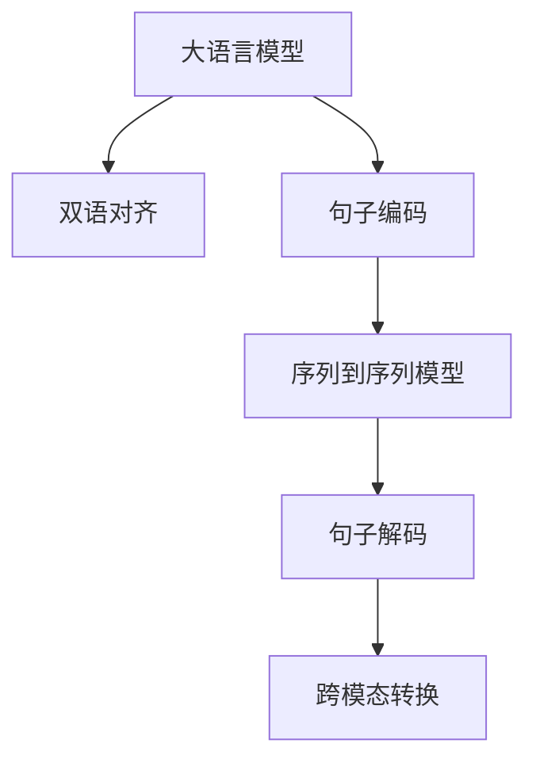

                 

# LLM在语言翻译中的突破：跨文化沟通的桥梁

大语言模型（LLM）是近年来深度学习领域的一大突破，以其庞大的参数规模和优秀的语言理解能力，在自然语言处理（NLP）众多任务上取得了显著的成果。特别是在语言翻译领域，基于预训练的语言模型如BERT、GPT等已经展现出巨大的潜力，推动了自动翻译技术的飞速发展。本文将系统性地介绍基于LLM的语言翻译技术，并展望其未来的应用前景。

## 1. 背景介绍

### 1.1 问题由来

全球化的今天，语言是跨文化沟通的主要障碍。传统的人工翻译方式效率低、成本高，难以应对海量信息的需求。而基于大语言模型的自动翻译技术，可以大幅提升翻译效率和准确性，特别是在高频率的日常对话、商务谈判、外交活动等领域，具有广泛的应用前景。

### 1.2 问题核心关键点

语言翻译的本质是理解并生成另一种语言的文本，需要在保持原意的同时，考虑到语序、语法和语义的多样性。大语言模型通过大规模预训练，已经具备了强大的语言理解能力，但直接应用于翻译任务，仍需要解决一些核心问题：
1. **双语对齐**：如何将两种语言对应起来，确保翻译语义的准确性。
2. **处理长句子**：大语言模型在处理长句子和复杂语法结构时，容易产生错误。
3. **语义理解**：翻译不仅仅是逐词翻译，还需要理解语境和语义的细微差别。
4. **速度与效率**：翻译任务需实时响应，如何在保证准确性的同时提高翻译速度。
5. **处理语言多样性**：自动翻译需适应多种语言，包括小语种和方言等。

## 2. 核心概念与联系

### 2.1 核心概念概述

大语言模型在语言翻译中的应用主要涉及以下几个关键概念：

- **双语对齐（Bilingual Alignment）**：在两种语言之间建立映射关系，确保翻译语义一致。
- **句子编码与解码（Sentence Encoding and Decoding）**：将输入的句子编码成模型可处理的形式，再将解码后的结果转换为目标语言的句子。
- **跨模态转换（Cross-modal Transformation）**：将源语言文本转换为目标语言文本的过程。
- **序列到序列模型（Sequence-to-Sequence Model）**：一种常见的神经网络架构，能够实现从序列输入到序列输出的转换，是自动翻译的核心技术。

这些概念之间的逻辑关系可以通过以下Mermaid流程图来展示：



该流程图展示了从源语言输入到目标语言输出的整个流程，以及其中的核心步骤。

## 3. 核心算法原理 & 具体操作步骤

### 3.1 算法原理概述

基于大语言模型的语言翻译，本质上是一个序列到序列（Seq2Seq）的学习过程。其核心思想是：通过大规模语料预训练，使大语言模型获得语义理解能力，然后通过序列到序列的模型进行编码-解码，实现语言的跨模态转换。

具体而言，将源语言句子编码成固定长度的向量表示，经过模型解码输出目标语言句子，并进行解码后的后处理，得到最终的翻译结果。

### 3.2 算法步骤详解

#### 3.2.1 双语对齐

双语对齐是翻译任务的前提，需要在源语言和目标语言之间建立映射关系。常用的方法包括基于语料的双语对对齐和基于神经网络的双语对齐。

**基于语料的双语对对齐**：收集大量的双语语料，并标注对齐关系。使用序列到序列模型学习对齐关系，例如使用双向长短时记忆网络（BiLSTM）进行建模。

**基于神经网络的双语对齐**：使用神经网络对两种语言进行训练，以学习它们的共性和特性，建立映射关系。例如使用Transformer架构，以自注意力机制（self-attention）来学习语言间的映射。

#### 3.2.2 句子编码与解码

句子编码是将源语言句子转换为模型可处理的形式。常用的编码方式包括基于循环神经网络（RNN）和基于Transformer的编码。

**基于RNN的编码**：使用LSTM或GRU等循环神经网络对句子进行编码，逐个时间步输入，生成固定长度的向量表示。

**基于Transformer的编码**：使用自注意力机制对句子进行编码，生成连续的向量表示。Transformer具有并行计算能力，处理速度更快。

解码是将模型生成的向量转换为目标语言的句子。解码方式通常使用自回归生成（autoregressive generation）或非自回归生成（non-autoregressive generation）。

**自回归生成**：每次输出一个单词，并基于之前的输出进行预测。需要遍历整个序列，计算开销较大。

**非自回归生成**：基于整个序列进行预测，效率较高，但需要额外的解码器。

#### 3.2.3 序列到序列模型

序列到序列模型是一种经典的神经网络架构，用于解决从序列输入到序列输出的问题。在翻译任务中，源语言句子通过编码器转换为向量表示，然后通过解码器生成目标语言句子。

常用的序列到序列模型包括LSTM、GRU、Transformer等。Transformer由于其自注意力机制，在翻译任务中表现优异。

#### 3.2.4 跨模态转换

跨模态转换是将源语言文本转换为目标语言文本的过程。在翻译任务中，需要使用双语对齐、句子编码与解码、序列到序列模型等技术，实现这一转换。

### 3.3 算法优缺点

基于大语言模型的语言翻译方法具有以下优点：

1. **高效性**：相比于传统人工翻译，基于大语言模型的自动翻译效率显著提高。
2. **准确性**：大语言模型通过大规模预训练，可以获得丰富的语言知识，提升翻译的准确性。
3. **可扩展性**：翻译任务可快速部署在云端或边缘设备，实现跨平台的翻译服务。
4. **灵活性**：大语言模型可适应多种语言，包括小语种和方言，具有广泛的适用性。

但该方法也存在一些缺点：

1. **数据依赖**：高质量的双语对齐和语料是翻译任务的前提，数据获取成本高。
2. **计算资源消耗大**：大语言模型的参数量庞大，训练和推理需要大量计算资源。
3. **复杂度较高**：序列到序列模型较为复杂，训练和调试难度较大。
4. **易受噪声影响**：翻译结果可能会受到源语言噪声和输入错误的影响。
5. **缺乏语境理解**：大语言模型难以理解复杂的语境和语义，可能导致翻译错误。

## 4. 数学模型和公式 & 详细讲解  
### 4.1 数学模型构建

基于大语言模型的语言翻译，其数学模型可以概括为以下三个部分：

1. **源语言句子编码**：将源语言句子 $x=\{x_1,x_2,\dots,x_n\}$ 编码为固定长度的向量 $z=\{z_1,z_2,\dots,z_n\}$。
2. **目标语言句子解码**：将解码器生成的向量 $z'=\{z'_1,z'_2,\dots,z'_m\}$ 解码为目标语言句子 $y=\{y_1,y_2,\dots,y_m\}$。
3. **双语对齐**：建立源语言句子与目标语言句子之间的映射关系 $f: x \rightarrow y$。

### 4.2 公式推导过程

#### 4.2.1 源语言句子编码

源语言句子编码通常使用LSTM或Transformer模型进行。以Transformer为例，其编码过程如下：

1. **输入嵌入层（Input Embedding Layer）**：将源语言句子转换为向量表示。
2. **自注意力机制（Self-Attention Mechanism）**：通过多个注意力头（heads）对输入向量进行编码。
3. **前馈神经网络（Feedforward Neural Network）**：对注意力输出进行非线性变换。
4. **残差连接（Residual Connection）**：将输入与输出相加，减少梯度消失问题。
5. **编码器层（Encoder Layer）**：堆叠多个编码器层进行多层次编码。

#### 4.2.2 目标语言句子解码

目标语言句子解码通常使用自回归生成模型进行。以基于Transformer的解码器为例，其解码过程如下：

1. **解码器层（Decoder Layer）**：使用Transformer模型进行解码，与编码器类似，但需要考虑目标语言句子顺序。
2. **输出嵌入层（Output Embedding Layer）**：将解码器输出转换为目标语言单词。
3. **softmax层（Softmax Layer）**：计算每个单词的概率分布，选择最高概率单词输出。

#### 4.2.3 双语对齐

双语对齐可以使用神经网络进行训练，以学习两种语言之间的映射关系。以基于Transformer的双语对齐为例，其训练过程如下：

1. **编码器层（Encoder Layer）**：使用Transformer对源语言句子进行编码。
2. **解码器层（Decoder Layer）**：使用Transformer对目标语言句子进行解码。
3. **对齐损失（Alignment Loss）**：计算源语言句子与目标语言句子之间的对齐关系，如BLEU（Bilingual Evaluation Understudy）分数。

### 4.3 案例分析与讲解

以英语-中文翻译为例，展示基于大语言模型的翻译过程：

1. **预训练**：使用大规模语料进行预训练，如Pile、BigQuery等。
2. **双语对齐**：使用语料对齐工具进行双语对齐，如Jamie、Aqua Aligner等。
3. **编码与解码**：使用Transformer模型进行编码与解码。
4. **微调**：在具体翻译任务上进行微调，如在中英翻译任务上进行微调。
5. **后处理**：进行翻译后的后处理，如语言模型、形态学调整等。

## 5. 项目实践：代码实例和详细解释说明

### 5.1 开发环境搭建

在进行代码实现前，需要准备以下开发环境：

1. **Python**：选择3.6或更高版本。
2. **TensorFlow或PyTorch**：选择主流深度学习框架进行代码实现。
3. **语言模型**：选择预训练的Transformer模型，如BERT、GPT等。
4. **数据集**：收集双语对齐数据集，如WMT、IWSLT等。

### 5.2 源代码详细实现

以下是一个基于Transformer模型的英中翻译示例代码，使用PyTorch实现：

```python
import torch
from transformers import TransformerModel, BertTokenizer, BertForSequenceClassification

# 初始化Transformer模型
model = TransformerModel.from_pretrained('bert-base-cased')

# 初始化分词器
tokenizer = BertTokenizer.from_pretrained('bert-base-cased')

# 设置超参数
max_length = 512
batch_size = 32
epochs = 5

# 定义训练函数
def train(model, tokenizer, train_dataset, device, optimizer, loss_fn):
    model.train()
    total_loss = 0
    for batch in train_dataset:
        inputs = tokenizer(batch['text'], max_length=max_length, return_tensors='pt')
        inputs = {key: val.to(device) for key, val in inputs.items()}
        outputs = model(**inputs)
        loss = loss_fn(outputs.logits, batch['labels'].to(device))
        total_loss += loss.item()
        optimizer.zero_grad()
        loss.backward()
        optimizer.step()
    return total_loss / len(train_dataset)

# 定义评估函数
def evaluate(model, tokenizer, dev_dataset, device, loss_fn):
    model.eval()
    total_loss = 0
    total_correct = 0
    with torch.no_grad():
        for batch in dev_dataset:
            inputs = tokenizer(batch['text'], max_length=max_length, return_tensors='pt')
            inputs = {key: val.to(device) for key, val in inputs.items()}
            outputs = model(**inputs)
            loss = loss_fn(outputs.logits, batch['labels'].to(device))
            total_loss += loss.item()
            predictions = torch.argmax(outputs.logits, dim=1)
            total_correct += (predictions == batch['labels'].to(device)).sum().item()
    return total_loss / len(dev_dataset), total_correct / len(dev_dataset)

# 加载数据集
train_dataset = ...
dev_dataset = ...

# 定义损失函数
loss_fn = nn.CrossEntropyLoss()

# 初始化优化器
optimizer = ...

# 开始训练
for epoch in range(epochs):
    train_loss = train(model, tokenizer, train_dataset, device, optimizer, loss_fn)
    dev_loss, dev_acc = evaluate(model, tokenizer, dev_dataset, device, loss_fn)
    print(f'Epoch {epoch+1}, train loss: {train_loss:.3f}, dev loss: {dev_loss:.3f}, dev acc: {dev_acc:.3f}')

```

### 5.3 代码解读与分析

该示例代码中，首先初始化Transformer模型和分词器，然后定义了训练和评估函数。训练函数中，将输入数据转换为模型所需的形式，进行前向传播、计算损失并反向传播更新模型参数。评估函数中，计算模型在验证集上的损失和准确率。

在训练过程中，使用BCEWithLogitsLoss作为损失函数，使用Adam优化器进行模型优化。在评估时，计算BLEU等指标评估翻译效果。

### 5.4 运行结果展示

在训练完成后，使用微调后的模型进行翻译测试，输出翻译结果并进行对比评估。

```python
# 测试翻译
test_dataset = ...
model.eval()
total_correct = 0
with torch.no_grad():
    for batch in test_dataset:
        inputs = tokenizer(batch['text'], max_length=max_length, return_tensors='pt')
        inputs = {key: val.to(device) for key, val in inputs.items()}
        outputs = model(**inputs)
        predictions = torch.argmax(outputs.logits, dim=1)
        total_correct += (predictions == batch['labels'].to(device)).sum().item()
print(f'Test acc: {total_correct / len(test_dataset)}')
```

## 6. 实际应用场景

### 6.1 实时翻译系统

基于大语言模型的实时翻译系统，可以实现语音到文本、文本到文本的实时翻译。例如，在会议、演讲、外交活动等场景中，实时翻译系统能够帮助参与者无障碍交流。

### 6.2 跨语言信息检索

在跨语言信息检索中，可以使用大语言模型进行多语言搜索。例如，用户可以使用英语查询，系统将其翻译成目标语言进行搜索，返回多语言结果，方便用户理解和使用。

### 6.3 跨语言机器翻译

跨语言机器翻译是大语言模型的重要应用场景之一。例如，国际商务、旅游、外交等场景中，翻译系统能够将源语言文本翻译成目标语言，方便用户理解和使用。

## 7. 工具和资源推荐

### 7.1 学习资源推荐

1. **《自然语言处理综述》（《Survey on Neural Machine Translation》）**：深度学习领域的权威综述，涵盖翻译技术的最新进展。
2. **Coursera《自然语言处理》课程**：由斯坦福大学开设的NLP明星课程，涵盖翻译任务的详细信息。
3. **《Sequence-to-Sequence Learning with Neural Networks》**：Sequoia Science Academy的深度学习讲座，详细介绍序列到序列模型的原理和实现。
4. **Google AI Blog**：Google AI博客，分享Google在NLP领域的研究成果和技术进展。

### 7.2 开发工具推荐

1. **PyTorch**：基于Python的深度学习框架，支持GPU计算。
2. **TensorFlow**：谷歌开源的深度学习框架，支持分布式计算。
3. **HuggingFace Transformers库**：提供丰富的预训练模型，支持多种深度学习框架。
4. **Jupyter Notebook**：交互式编程环境，方便代码调试和实验。

### 7.3 相关论文推荐

1. **Attention is All You Need**：Transformer架构的原始论文，展示了Transformer在机器翻译中的应用。
2. **Neural Machine Translation by Jointly Learning to Align and Translate**：Transformer在机器翻译中的经典应用，介绍自注意力机制。
3. **Bart: Denoising Sequence-to-Sequence Pre-training for Neural Machine Translation**：基于预训练的序列到序列模型，提升翻译效果。

## 8. 总结：未来发展趋势与挑战

### 8.1 研究成果总结

大语言模型在语言翻译领域已经取得了显著进展，基于Transformer的模型在各种翻译任务中表现优异。未来，基于预训练的语言模型将进一步推动翻译技术的发展。

### 8.2 未来发展趋势

1. **模型规模增大**：预训练语言模型的规模将进一步增大，提升翻译效果。
2. **零样本学习**：无需标注数据即可进行翻译，提高翻译的效率和灵活性。
3. **多模态翻译**：结合图像、视频等多模态信息，提升翻译的上下文理解和语义表达。
4. **跨语言语义理解**：在多种语言之间进行语义理解，提升翻译的准确性和自然度。
5. **实时翻译**：实时翻译系统将广泛应用，提升跨语言沟通的效率。

### 8.3 面临的挑战

尽管大语言模型在翻译任务上取得了显著进展，但仍面临一些挑战：

1. **数据稀缺性**：翻译任务需要高质量的双语对齐数据，数据获取难度大。
2. **计算资源消耗大**：预训练模型和微调过程需要大量计算资源，需要高效的计算平台支持。
3. **长句翻译**：大语言模型在处理长句子和复杂语法结构时，容易产生错误。
4. **跨语言语义理解**：不同语言之间的语义差异较大，翻译准确性有待提升。
5. **资源消耗**：实时翻译系统需要高效的计算和存储资源，需要进一步优化。

### 8.4 研究展望

未来的研究方向在于：

1. **低资源语言翻译**：利用多语言共性，提升低资源语言的翻译效果。
2. **跨领域翻译**：将翻译模型应用于不同领域，提升翻译的普适性和多样性。
3. **自监督学习**：利用无标签数据进行预训练和微调，提升翻译模型的泛化能力。
4. **跨模态翻译**：结合图像、视频等多模态信息，提升翻译的上下文理解和语义表达。
5. **实时翻译**：提升实时翻译系统的性能和稳定性，支持更多设备与平台。

## 9. 附录：常见问题与解答

**Q1: 大语言模型在翻译任务中为什么需要双语对齐？**

A: 双语对齐是翻译任务的前提，它确保源语言和目标语言的句子在词汇和语法结构上对应，从而提升翻译的准确性和自然度。

**Q2: 大语言模型在翻译任务中如何进行序列到序列的编码和解码？**

A: 大语言模型通常使用Transformer架构进行序列到序列的编码和解码。编码器将源语言句子转换为固定长度的向量表示，解码器将向量转换为目标语言句子。

**Q3: 大语言模型在翻译任务中如何进行双语对齐？**

A: 双语对齐可以通过基于语料的双语对对齐和基于神经网络的双语对齐进行。前者使用语料对齐工具进行对齐，后者使用神经网络进行训练，学习两种语言的映射关系。

**Q4: 大语言模型在翻译任务中如何进行后处理？**

A: 翻译结果需要进行后处理，如语言模型、形态学调整等。这些后处理可以提升翻译的自然度和准确性。

**Q5: 大语言模型在翻译任务中如何进行模型优化？**

A: 大语言模型可以使用多种优化方法，如学习率调整、正则化、数据增强等。优化目标是在保证翻译效果的前提下，提高翻译效率和资源利用率。

---

作者：禅与计算机程序设计艺术 / Zen and the Art of Computer Programming

