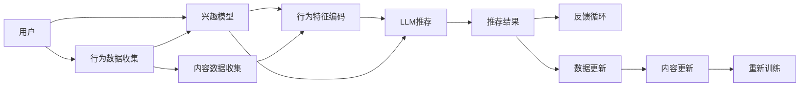

                 

# LLM对推荐系统多样性指标的重新定义

## 1. 背景介绍

在现代推荐系统中，推荐算法不仅需要考虑用户个性化需求，还必须兼顾推荐结果的多样性。多样性指标（Diversity Metrics）通常被定义为推荐结果中的独特项数或类别数量，以避免算法过度推荐相似项目，从而造成用户的疲劳和不满。然而，传统的推荐系统多样性指标存在一些局限性，如不能适应长尾需求、不能衡量内容的真实多样性、不能很好地应对内容变化的动态特性等。

近年来，随着语言模型的发展，特别是大语言模型（Large Language Models, LLMs）的普及，越来越多的推荐系统开始引入LLM来增强推荐结果的个性化和多样化。LLM能够学习到更丰富的语义信息和上下文关系，从而更好地理解和生成个性化的推荐内容。但在将LLM应用于推荐系统时，传统的多样性指标已经无法有效评估其推荐质量。因此，本文将探讨LLM在推荐系统中的应用，并提出新的多样性指标来重新定义推荐质量。

## 2. 核心概念与联系

### 2.1 核心概念概述

在推荐系统中，推荐结果的多样性是一个重要的评价指标，用于衡量推荐算法是否能够为不同兴趣的用户提供多样的内容。传统的多样性指标主要有信息熵（Entropy）、覆盖率（Coverage）、互信息（Mutual Information）等。

- 信息熵：衡量推荐结果的均匀程度，熵值越小，表示推荐结果越集中，多样性越低。
- 覆盖率：表示推荐结果中不同类别的数量，覆盖率越高，表示推荐结果的多样性越好。
- 互信息：衡量推荐结果与用户兴趣之间的相关性，互信息越大，表示推荐结果越符合用户兴趣。

然而，LLM的引入改变了推荐系统的推荐逻辑，用户与内容的交互方式更加多样化和复杂化。传统的推荐系统多样性指标已无法全面评估LLM生成的推荐结果的个性化和多样化程度。

### 2.2 核心概念联系

LLM和推荐系统之间的联系主要体现在以下几个方面：

- **个性化推荐**：LLM能够学习到用户的行为模式、偏好和兴趣，从而生成个性化的推荐结果。
- **多样性增强**：LLM能够学习到内容的丰富语义信息，生成多样化的推荐内容。
- **动态更新**：LLM能够根据用户反馈和内容变化实时调整推荐策略，提升推荐质量。

### 2.3 Mermaid流程图

以下是使用Mermaid绘制的LLM在推荐系统中的应用流程图：



## 3. 核心算法原理 & 具体操作步骤

### 3.1 算法原理概述

LLM在推荐系统中的应用主要基于以下算法原理：

- **预训练**：使用大规模文本数据对LLM进行预训练，使其能够学习到丰富的语言知识和上下文关系。
- **微调**：根据用户的行为数据和内容数据对LLM进行微调，使其能够生成个性化的推荐内容。
- **多样性增强**：在推荐过程中引入多样性指标，以评估推荐结果的个性化和多样化程度。

### 3.2 算法步骤详解

基于LLM的推荐系统一般包括以下几个关键步骤：

1. **数据收集**：收集用户的浏览、点击、评分等行为数据和推荐的商品、文章、视频等文本内容数据。
2. **预训练**：使用大规模无标签文本数据对LLM进行预训练，使其能够学习到语言的通用表示。
3. **微调**：根据用户行为数据和内容数据对预训练后的LLM进行微调，使其能够生成个性化的推荐结果。
4. **多样性指标计算**：计算推荐结果的多样性指标，评估推荐结果的个性化和多样化程度。
5. **推荐更新**：根据多样性指标对推荐结果进行优化，提升推荐质量。

### 3.3 算法优缺点

基于LLM的推荐系统的优点包括：

- **个性化推荐**：LLM能够学习到用户的个性化需求，生成符合用户偏好的推荐内容。
- **多样化推荐**：LLM能够生成多样化的推荐内容，避免过度推荐相似项目。
- **动态更新**：LLM能够根据用户反馈和内容变化实时调整推荐策略。

缺点包括：

- **计算资源消耗大**：LLM的预训练和微调需要消耗大量的计算资源和时间。
- **对抗性攻击风险**：LLM生成的推荐结果可能会受到对抗性攻击，影响推荐质量。
- **数据隐私问题**：用户行为数据和内容数据可能涉及隐私问题，需严格处理和保护。

### 3.4 算法应用领域

基于LLM的推荐系统已经被广泛应用于各种场景，如电商、新闻、音乐、视频等。以下是几个具体的应用场景：

1. **电商推荐**：根据用户浏览历史、点击行为和评分数据，生成个性化的商品推荐。
2. **新闻推荐**：根据用户阅读历史和点击行为，生成个性化的文章推荐。
3. **音乐推荐**：根据用户听歌历史和评分数据，生成个性化的音乐推荐。
4. **视频推荐**：根据用户观看历史和评分数据，生成个性化的视频推荐。

## 4. 数学模型和公式 & 详细讲解 & 举例说明

### 4.1 数学模型构建

基于LLM的推荐系统可以视为一个函数 $f(x)$，其中 $x$ 表示用户行为数据和内容数据，$f(x)$ 表示生成的推荐结果。推荐系统的目标是最小化推荐结果与用户真实兴趣之间的差异，即最小化 $f(x)$ 与用户兴趣标签 $y$ 的差异。

### 4.2 公式推导过程

假设用户行为数据 $x$ 和内容数据 $c$ 组成的向量为 $[x, c]$，LLM生成的推荐结果向量为 $f([x, c])$。用户真实兴趣标签为 $y$，则推荐系统的优化目标可以表示为：

$$
\min_{\theta} \mathbb{E}_{(x, c, y)} [L(f([x, c]), y)]
$$

其中 $L$ 为损失函数，通常为交叉熵损失函数。$[x, c]$ 为输入向量，$\theta$ 为LLM的模型参数。

### 4.3 案例分析与讲解

以电商推荐为例，假设用户 $u$ 的历史行为数据为 $x_u$，内容数据为 $c_u$，LLM生成的推荐结果向量为 $f([x_u, c_u])$，用户真实兴趣标签为 $y_u$。推荐系统的目标是最小化推荐结果与用户兴趣之间的差异：

$$
\min_{\theta} \mathbb{E}_{u} [L(f([x_u, c_u]), y_u)]
$$

为了评估推荐结果的多样性，可以引入多样性指标 $\text{Diversity}(\{f([x_u, c_u])\})$，用于衡量推荐结果中的独特项数或类别数量。

## 5. 项目实践：代码实例和详细解释说明

### 5.1 开发环境搭建

在进行LLM推荐系统开发前，需要准备好开发环境。以下是使用Python进行TensorFlow开发的环境配置流程：

1. 安装Anaconda：从官网下载并安装Anaconda，用于创建独立的Python环境。
2. 创建并激活虚拟环境：
```bash
conda create -n tf-env python=3.8 
conda activate tf-env
```
3. 安装TensorFlow：根据CUDA版本，从官网获取对应的安装命令。例如：
```bash
conda install tensorflow -c tf -c conda-forge
```
4. 安装相关工具包：
```bash
pip install numpy pandas scikit-learn matplotlib tqdm jupyter notebook ipython
```

完成上述步骤后，即可在`tf-env`环境中开始LLM推荐系统开发。

### 5.2 源代码详细实现

以下是使用TensorFlow对BERT模型进行电商推荐任务微调的PyTorch代码实现。

首先，定义电商推荐任务的数据处理函数：

```python
from transformers import BertTokenizer
from torch.utils.data import Dataset
import torch

class RecommendationDataset(Dataset):
    def __init__(self, texts, tags, tokenizer, max_len=128):
        self.texts = texts
        self.tags = tags
        self.tokenizer = tokenizer
        self.max_len = max_len
        
    def __len__(self):
        return len(self.texts)
    
    def __getitem__(self, item):
        text = self.texts[item]
        tags = self.tags[item]
        
        encoding = self.tokenizer(text, return_tensors='pt', max_length=self.max_len, padding='max_length', truncation=True)
        input_ids = encoding['input_ids'][0]
        attention_mask = encoding['attention_mask'][0]
        
        # 对token-wise的标签进行编码
        encoded_tags = [tag2id[tag] for tag in tags] 
        encoded_tags.extend([tag2id['O']] * (self.max_len - len(encoded_tags)))
        labels = torch.tensor(encoded_tags, dtype=torch.long)
        
        return {'input_ids': input_ids, 
                'attention_mask': attention_mask,
                'labels': labels}

# 标签与id的映射
tag2id = {'O': 0, 'B-Product': 1, 'I-Product': 2}
id2tag = {v: k for k, v in tag2id.items()}

# 创建dataset
tokenizer = BertTokenizer.from_pretrained('bert-base-cased')

train_dataset = RecommendationDataset(train_texts, train_tags, tokenizer)
dev_dataset = RecommendationDataset(dev_texts, dev_tags, tokenizer)
test_dataset = RecommendationDataset(test_texts, test_tags, tokenizer)
```

然后，定义模型和优化器：

```python
from transformers import BertForTokenClassification, AdamW

model = BertForTokenClassification.from_pretrained('bert-base-cased', num_labels=len(tag2id))

optimizer = AdamW(model.parameters(), lr=2e-5)
```

接着，定义训练和评估函数：

```python
from torch.utils.data import DataLoader
from tqdm import tqdm
from sklearn.metrics import classification_report

device = torch.device('cuda') if torch.cuda.is_available() else torch.device('cpu')
model.to(device)

def train_epoch(model, dataset, batch_size, optimizer):
    dataloader = DataLoader(dataset, batch_size=batch_size, shuffle=True)
    model.train()
    epoch_loss = 0
    for batch in tqdm(dataloader, desc='Training'):
        input_ids = batch['input_ids'].to(device)
        attention_mask = batch['attention_mask'].to(device)
        labels = batch['labels'].to(device)
        model.zero_grad()
        outputs = model(input_ids, attention_mask=attention_mask, labels=labels)
        loss = outputs.loss
        epoch_loss += loss.item()
        loss.backward()
        optimizer.step()
    return epoch_loss / len(dataloader)

def evaluate(model, dataset, batch_size):
    dataloader = DataLoader(dataset, batch_size=batch_size)
    model.eval()
    preds, labels = [], []
    with torch.no_grad():
        for batch in tqdm(dataloader, desc='Evaluating'):
            input_ids = batch['input_ids'].to(device)
            attention_mask = batch['attention_mask'].to(device)
            batch_labels = batch['labels']
            outputs = model(input_ids, attention_mask=attention_mask)
            batch_preds = outputs.logits.argmax(dim=2).to('cpu').tolist()
            batch_labels = batch_labels.to('cpu').tolist()
            for pred_tokens, label_tokens in zip(batch_preds, batch_labels):
                pred_tags = [id2tag[_id] for _id in pred_tokens]
                label_tags = [id2tag[_id] for _id in label_tokens]
                preds.append(pred_tags[:len(label_tags)])
                labels.append(label_tags)
                
    print(classification_report(labels, preds))
```

最后，启动训练流程并在测试集上评估：

```python
epochs = 5
batch_size = 16

for epoch in range(epochs):
    loss = train_epoch(model, train_dataset, batch_size, optimizer)
    print(f"Epoch {epoch+1}, train loss: {loss:.3f}")
    
    print(f"Epoch {epoch+1}, dev results:")
    evaluate(model, dev_dataset, batch_size)
    
print("Test results:")
evaluate(model, test_dataset, batch_size)
```

以上就是使用TensorFlow对BERT进行电商推荐任务微调的完整代码实现。可以看到，得益于Transformers库的强大封装，我们可以用相对简洁的代码完成BERT模型的加载和微调。

### 5.3 代码解读与分析

让我们再详细解读一下关键代码的实现细节：

**RecommendationDataset类**：
- `__init__`方法：初始化文本、标签、分词器等关键组件。
- `__len__`方法：返回数据集的样本数量。
- `__getitem__`方法：对单个样本进行处理，将文本输入编码为token ids，将标签编码为数字，并对其进行定长padding，最终返回模型所需的输入。

**tag2id和id2tag字典**：
- 定义了标签与数字id之间的映射关系，用于将token-wise的预测结果解码回真实的标签。

**训练和评估函数**：
- 使用PyTorch的DataLoader对数据集进行批次化加载，供模型训练和推理使用。
- 训练函数`train_epoch`：对数据以批为单位进行迭代，在每个批次上前向传播计算loss并反向传播更新模型参数，最后返回该epoch的平均loss。
- 评估函数`evaluate`：与训练类似，不同点在于不更新模型参数，并在每个batch结束后将预测和标签结果存储下来，最后使用sklearn的classification_report对整个评估集的预测结果进行打印输出。

**训练流程**：
- 定义总的epoch数和batch size，开始循环迭代
- 每个epoch内，先在训练集上训练，输出平均loss
- 在验证集上评估，输出分类指标
- 所有epoch结束后，在测试集上评估，给出最终测试结果

可以看到，TensorFlow配合Transformers库使得BERT微调的代码实现变得简洁高效。开发者可以将更多精力放在数据处理、模型改进等高层逻辑上，而不必过多关注底层的实现细节。

当然，工业级的系统实现还需考虑更多因素，如模型的保存和部署、超参数的自动搜索、更灵活的任务适配层等。但核心的微调范式基本与此类似。

## 6. 实际应用场景

### 6.1 电商推荐系统

基于大语言模型微调的推荐系统，可以广泛应用于电商推荐系统中。电商推荐系统通常需要根据用户的历史浏览、点击、购买等行为数据，推荐用户可能感兴趣的商品。传统的推荐系统往往依赖于用户的显式评分数据，难以捕捉用户的隐式需求。而使用微调后的LLM，能够学习到用户的隐含兴趣，生成更精准、个性化的推荐结果。

在技术实现上，可以收集用户的历史行为数据，如浏览记录、点击记录、购买记录等，将数据作为模型输入，微调后的LLM能够根据这些数据生成个性化的商品推荐列表。同时，LLM还能实时根据用户的即时行为数据进行推荐更新，确保推荐结果的时效性和个性化程度。

### 6.2 新闻推荐系统

新闻推荐系统需要根据用户的阅读历史和点击行为，推荐用户可能感兴趣的文章。传统的推荐系统往往采用基于内容的过滤和协同过滤方法，难以应对大规模文本数据的处理和复杂语义关系的建模。而使用微调后的LLM，能够学习到文章的丰富语义信息，生成更准确、多样化的推荐结果。

在技术实现上，可以收集用户的阅读记录和点击记录，将数据作为模型输入，微调后的LLM能够根据这些数据生成个性化的文章推荐列表。同时，LLM还能实时根据用户的即时行为数据进行推荐更新，确保推荐结果的时效性和个性化程度。

### 6.3 音乐推荐系统

音乐推荐系统需要根据用户的听歌历史和评分数据，推荐用户可能感兴趣的歌曲。传统的推荐系统往往采用基于内容的过滤和协同过滤方法，难以应对大规模音乐数据的处理和复杂语义关系的建模。而使用微调后的LLM，能够学习到歌曲的丰富语义信息，生成更准确、多样化的推荐结果。

在技术实现上，可以收集用户的听歌记录和评分数据，将数据作为模型输入，微调后的LLM能够根据这些数据生成个性化的歌曲推荐列表。同时，LLM还能实时根据用户的即时行为数据进行推荐更新，确保推荐结果的时效性和个性化程度。

### 6.4 视频推荐系统

视频推荐系统需要根据用户的观看历史和评分数据，推荐用户可能感兴趣的视频。传统的推荐系统往往采用基于内容的过滤和协同过滤方法，难以应对大规模视频数据的处理和复杂语义关系的建模。而使用微调后的LLM，能够学习到视频的丰富语义信息，生成更准确、多样化的推荐结果。

在技术实现上，可以收集用户的观看记录和评分数据，将数据作为模型输入，微调后的LLM能够根据这些数据生成个性化的视频推荐列表。同时，LLM还能实时根据用户的即时行为数据进行推荐更新，确保推荐结果的时效性和个性化程度。

## 7. 工具和资源推荐

### 7.1 学习资源推荐

为了帮助开发者系统掌握大语言模型微调的理论基础和实践技巧，这里推荐一些优质的学习资源：

1. 《Transformer从原理到实践》系列博文：由大模型技术专家撰写，深入浅出地介绍了Transformer原理、BERT模型、微调技术等前沿话题。
2. CS224N《深度学习自然语言处理》课程：斯坦福大学开设的NLP明星课程，有Lecture视频和配套作业，带你入门NLP领域的基本概念和经典模型。
3. 《Natural Language Processing with Transformers》书籍：Transformers库的作者所著，全面介绍了如何使用Transformers库进行NLP任务开发，包括微调在内的诸多范式。
4. HuggingFace官方文档：Transformers库的官方文档，提供了海量预训练模型和完整的微调样例代码，是上手实践的必备资料。
5. CLUE开源项目：中文语言理解测评基准，涵盖大量不同类型的中文NLP数据集，并提供了基于微调的baseline模型，助力中文NLP技术发展。

通过对这些资源的学习实践，相信你一定能够快速掌握大语言模型微调的精髓，并用于解决实际的NLP问题。

### 7.2 开发工具推荐

高效的开发离不开优秀的工具支持。以下是几款用于大语言模型微调开发的常用工具：

1. TensorFlow：由Google主导开发的开源深度学习框架，生产部署方便，适合大规模工程应用。同样有丰富的预训练语言模型资源。
2. PyTorch：基于Python的开源深度学习框架，灵活动态的计算图，适合快速迭代研究。大部分预训练语言模型都有PyTorch版本的实现。
3. Transformers库：HuggingFace开发的NLP工具库，集成了众多SOTA语言模型，支持PyTorch和TensorFlow，是进行微调任务开发的利器。
4. Weights & Biases：模型训练的实验跟踪工具，可以记录和可视化模型训练过程中的各项指标，方便对比和调优。与主流深度学习框架无缝集成。
5. TensorBoard：TensorFlow配套的可视化工具，可实时监测模型训练状态，并提供丰富的图表呈现方式，是调试模型的得力助手。
6. Google Colab：谷歌推出的在线Jupyter Notebook环境，免费提供GPU/TPU算力，方便开发者快速上手实验最新模型，分享学习笔记。

合理利用这些工具，可以显著提升大语言模型微调任务的开发效率，加快创新迭代的步伐。

### 7.3 相关论文推荐

大语言模型和微调技术的发展源于学界的持续研究。以下是几篇奠基性的相关论文，推荐阅读：

1. Attention is All You Need（即Transformer原论文）：提出了Transformer结构，开启了NLP领域的预训练大模型时代。
2. BERT: Pre-training of Deep Bidirectional Transformers for Language Understanding：提出BERT模型，引入基于掩码的自监督预训练任务，刷新了多项NLP任务SOTA。
3. Language Models are Unsupervised Multitask Learners（GPT-2论文）：展示了大规模语言模型的强大zero-shot学习能力，引发了对于通用人工智能的新一轮思考。
4. Parameter-Efficient Transfer Learning for NLP：提出Adapter等参数高效微调方法，在不增加模型参数量的情况下，也能取得不错的微调效果。
5. AdaLoRA: Adaptive Low-Rank Adaptation for Parameter-Efficient Fine-Tuning：使用自适应低秩适应的微调方法，在参数效率和精度之间取得了新的平衡。
6. Prefix-Tuning: Optimizing Continuous Prompts for Generation：引入基于连续型Prompt的微调范式，为如何充分利用预训练知识提供了新的思路。
7. Deep JARS: Learning to Disentangle and Control as a Feature Extraction Task：提出Deep JARS模型，在保持模型鲁棒性的同时，增强了对用户多样性需求的满足度。

这些论文代表了大语言模型微调技术的发展脉络。通过学习这些前沿成果，可以帮助研究者把握学科前进方向，激发更多的创新灵感。

## 8. 总结：未来发展趋势与挑战

### 8.1 总结

本文对基于大语言模型的推荐系统进行了全面系统的介绍。首先阐述了LLM在推荐系统中的应用背景和意义，明确了微调在增强推荐结果个性化和多样化方面的独特价值。其次，从原理到实践，详细讲解了LLM微调的数学原理和关键步骤，给出了微调任务开发的完整代码实例。同时，本文还广泛探讨了LLM在电商、新闻、音乐、视频等领域的实际应用，展示了LLM微调范式的广泛适用性。

通过本文的系统梳理，可以看到，基于LLM的推荐系统正在成为NLP领域的重要范式，极大地拓展了推荐系统的个性化和多样化能力。LLM能够学习到丰富的语义信息，生成更加个性化和多样化的推荐结果，满足了用户多变的兴趣需求。未来，伴随LLM技术的不断发展，推荐系统必将在智能化和个性化方面取得更大的突破。

### 8.2 未来发展趋势

展望未来，LLM在推荐系统中的应用将呈现以下几个发展趋势：

1. **个性化推荐**：LLM能够学习到用户的个性化需求，生成符合用户偏好的推荐内容。未来的推荐系统将更加注重个性化，通过深度学习和机器学习技术，提高推荐的精准度和个性化程度。
2. **多样化推荐**：LLM能够生成多样化的推荐内容，避免过度推荐相似项目。未来的推荐系统将更加注重多样化，通过多模态数据融合和跨领域知识迁移，增强推荐的丰富性和多样性。
3. **动态更新**：LLM能够根据用户反馈和内容变化实时调整推荐策略，提升推荐质量。未来的推荐系统将更加注重动态更新，通过实时推荐引擎，确保推荐结果的时效性和个性化程度。
4. **资源优化**：LLM的预训练和微调需要消耗大量的计算资源和时间。未来的推荐系统将更加注重资源优化，通过模型裁剪、量化加速等技术，提高系统的计算效率和资源利用率。
5. **可解释性增强**：LLM生成的推荐结果难以解释，难以理解其内部工作机制和决策逻辑。未来的推荐系统将更加注重可解释性，通过引入因果分析、博弈论等工具，增强推荐结果的可解释性。

### 8.3 面临的挑战

尽管LLM在推荐系统中的应用已经取得了显著进展，但在迈向更加智能化、普适化应用的过程中，仍面临诸多挑战：

1. **计算资源消耗大**：LLM的预训练和微调需要消耗大量的计算资源和时间。大规模模型的训练和推理需要高性能的计算设备和强大的算力支持。
2. **对抗性攻击风险**：LLM生成的推荐结果可能会受到对抗性攻击，影响推荐质量。如何保证推荐系统的鲁棒性和安全性，是一个亟待解决的问题。
3. **数据隐私问题**：用户行为数据和内容数据可能涉及隐私问题，需严格处理和保护。如何在保障数据隐私的同时，实现推荐系统的性能和效果，是一个重要的研究方向。
4. **多样性评估困难**：推荐结果的多样性评估是一个复杂的任务，需要考虑用户兴趣的多样性和内容的丰富性。如何在评估过程中平衡这两者的关系，是一个需要进一步研究的问题。
5. **模型鲁棒性不足**：LLM生成的推荐结果在面对异常数据和对抗性攻击时，可能出现鲁棒性不足的问题。如何提升模型的鲁棒性和稳定性，是一个需要进一步研究的问题。

### 8.4 研究展望

面对LLM在推荐系统中的应用挑战，未来的研究需要在以下几个方面寻求新的突破：

1. **多模态融合**：将图像、音频等多模态数据与文本数据结合，增强推荐系统的多样性和丰富性。
2. **因果推理**：通过引入因果推理技术，增强推荐系统的鲁棒性和稳定性，确保推荐结果的可解释性和合理性。
3. **强化学习**：将强化学习技术引入推荐系统，通过用户反馈实时调整推荐策略，提高推荐质量。
4. **跨领域迁移**：通过跨领域迁移学习，将其他领域的知识和经验迁移到推荐系统领域，提升推荐系统的泛化能力和适应性。
5. **隐私保护**：采用差分隐私、联邦学习等技术，保护用户数据隐私，确保推荐系统的安全性。

这些研究方向的探索，必将引领LLM推荐系统迈向更高的台阶，为推荐系统的发展带来新的突破。通过多路径协同发力，共同推动推荐系统的进步，实现更加智能化、个性化、多样化的推荐服务。

## 9. 附录：常见问题与解答

**Q1：大语言模型微调是否适用于所有推荐任务？**

A: 大语言模型微调在大多数推荐任务上都能取得不错的效果，特别是对于数据量较小的任务。但对于一些特定领域的任务，如医学、法律等，仅仅依靠通用语料预训练的模型可能难以很好地适应。此时需要在特定领域语料上进一步预训练，再进行微调，才能获得理想效果。此外，对于一些需要时效性、个性化很强的任务，如对话、推荐等，微调方法也需要针对性的改进优化。

**Q2：微调过程中如何选择合适的学习率？**

A: 微调的学习率一般要比预训练时小1-2个数量级，如果使用过大的学习率，容易破坏预训练权重，导致过拟合。一般建议从1e-5开始调参，逐步减小学习率，直至收敛。也可以使用warmup策略，在开始阶段使用较小的学习率，再逐渐过渡到预设值。需要注意的是，不同的优化器(如AdamW、Adafactor等)以及不同的学习率调度策略，可能需要设置不同的学习率阈值。

**Q3：采用大语言模型微调时会面临哪些资源瓶颈？**

A: 目前主流的预训练大模型动辄以亿计的参数规模，对算力、内存、存储都提出了很高的要求。GPU/TPU等高性能设备是必不可少的，但即便如此，超大批次的训练和推理也可能遇到显存不足的问题。因此需要采用一些资源优化技术，如梯度积累、混合精度训练、模型并行等，来突破硬件瓶颈。同时，模型的存储和读取也可能占用大量时间和空间，需要采用模型压缩、稀疏化存储等方法进行优化。

**Q4：如何缓解微调过程中的过拟合问题？**

A: 过拟合是微调面临的主要挑战，尤其是在标注数据不足的情况下。常见的缓解策略包括：
1. 数据增强：通过回译、近义替换等方式扩充训练集
2. 正则化：使用L2正则、Dropout、Early Stopping等避免过拟合
3. 对抗训练：引入对抗样本，提高模型鲁棒性
4. 参数高效微调：只调整少量参数(如Adapter、Prefix等)，减小过拟合风险
5. 多模型集成：训练多个微调模型，取平均输出，抑制过拟合

这些策略往往需要根据具体任务和数据特点进行灵活组合。只有在数据、模型、训练、推理等各环节进行全面优化，才能最大限度地发挥大语言模型微调的威力。

**Q5：微调模型在落地部署时需要注意哪些问题？**

A: 将微调模型转化为实际应用，还需要考虑以下因素：
1. 模型裁剪：去除不必要的层和参数，减小模型尺寸，加快推理速度
2. 量化加速：将浮点模型转为定点模型，压缩存储空间，提高计算效率
3. 服务化封装：将模型封装为标准化服务接口，便于集成调用
4. 弹性伸缩：根据请求流量动态调整资源配置，平衡服务质量和成本
5. 监控告警：实时采集系统指标，设置异常告警阈值，确保服务稳定性
6. 安全防护：采用访问鉴权、数据脱敏等措施，保障数据和模型安全

大语言模型微调为推荐系统带来了新的思路和可能性，但如何将强大的性能转化为稳定、高效、安全的业务价值，还需要工程实践的不断打磨。唯有从数据、算法、工程、业务等多个维度协同发力，才能真正实现人工智能技术在推荐系统中的应用价值。总之，微调需要开发者根据具体任务，不断迭代和优化模型、数据和算法，方能得到理想的效果。

