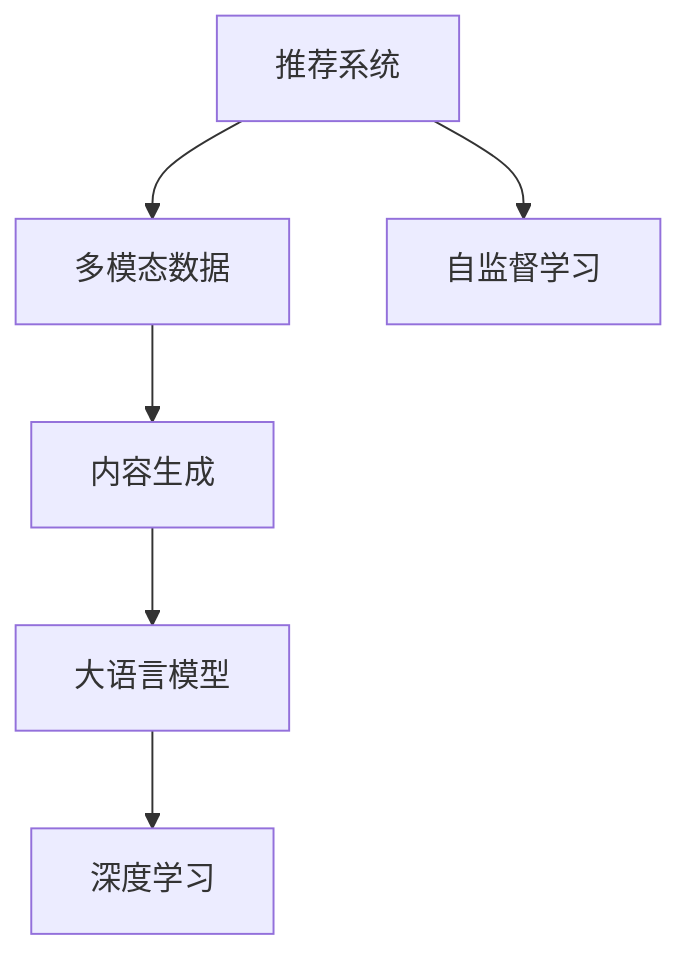

                 

# LLM推荐中的多模态内容生成技术

> 关键词：推荐系统,多模态,内容生成,语言模型,深度学习

## 1. 背景介绍

### 1.1 问题由来

在信息时代，用户在搜索、购物、阅读、观看等场景中会产生大量的数据，但如何利用这些数据，为用户推荐更符合其需求的内容，是一个复杂而重要的挑战。传统的推荐系统主要基于用户历史行为数据，如浏览记录、评分反馈等，通过协同过滤、内容推荐等算法，预测用户未来的兴趣倾向。然而，这种基于行为数据的推荐方式，难以满足用户多变的需求和不断变化的市场趋势。

近年来，伴随着人工智能技术的迅猛发展，推荐系统逐渐引入了人工智能技术，如基于深度学习的推荐模型、基于图网络推荐模型等。特别是，随着预训练语言模型的兴起，推荐系统逐渐开始利用大语言模型（Large Language Model, LLM）生成个性化内容，提升推荐效果。这种方法不仅能够利用用户历史行为数据，还能通过语言模型自动生成优质内容，增强推荐的个性化和多样性。

然而，在LLM推荐系统的实际应用中，仍然面临诸多挑战。特别是在多模态数据融合方面，由于数据源多样性、格式复杂性、数据量不均衡等问题，多模态内容生成技术的应用和优化，仍需深入探索和研究。本文将重点探讨如何在推荐系统中，结合大语言模型，采用多模态内容生成技术，提升推荐效果和用户体验。

## 2. 核心概念与联系

### 2.1 核心概念概述

为了更好地理解基于大语言模型的推荐系统中的多模态内容生成技术，本节将介绍几个密切相关的核心概念：

- 推荐系统（Recommender System）：利用用户历史行为数据，预测用户未来兴趣倾向，为用户提供个性化推荐的服务系统。

- 多模态数据（Multimodal Data）：包含文本、图像、音频、视频等多种数据类型的混合数据，能够反映出更加全面、细致的用户兴趣和行为。

- 内容生成（Content Generation）：通过模型自动生成符合用户期望的文本、图像等，增强推荐的个性化和多样性。

- 大语言模型（Large Language Model, LLM）：通过大规模无标签文本数据预训练，学习到通用语言表示和语法规则，具备强大的自然语言理解和生成能力。

- 深度学习（Deep Learning）：基于神经网络模型，学习数据内在的非线性关系，实现高效的特征提取和建模。

- 自监督学习（Self-Supervised Learning）：通过无标签数据，利用数据内在关系进行模型训练，提高模型的泛化能力和适应性。

这些核心概念之间的逻辑关系可以通过以下Mermaid流程图来展示：



这个流程图展示了大语言模型在推荐系统中的应用路径：

1. 推荐系统利用多模态数据，生成符合用户期望的内容。
2. 内容生成基于大语言模型，具备强大的自然语言理解和生成能力。
3. 大语言模型的训练主要采用深度学习技术，通过大规模无标签数据进行预训练。
4. 自监督学习在大语言模型训练过程中，扮演了关键角色，提升了模型的泛化能力。

这些核心概念共同构成了基于大语言模型的推荐系统框架，使其能够在多模态数据融合和内容生成中发挥重要作用。

## 3. 核心算法原理 & 具体操作步骤
### 3.1 算法原理概述

基于大语言模型的推荐系统，主要通过多模态数据融合，自动生成符合用户期望的内容，提升推荐效果。其核心思想是：利用预训练的大语言模型，通过融合多模态数据，生成个性化、多样化的推荐内容。

形式化地，假设推荐系统利用多模态数据 $D=\{(d_x,d_y,d_z,\dots)\}_{i=1}^N$，其中 $d_x, d_y, d_z, \dots$ 分别代表文本、图像、音频、视频等数据。通过多模态内容生成模型 $M_{\theta}$，将多模态数据映射到文本描述 $\hat{d}$。然后利用预训练语言模型 $L_{\phi}$，在文本描述 $\hat{d}$ 上进行条件生成，生成个性化的推荐内容。最终的推荐结果 $r$ 可以表示为：

$$
r = L_{\phi}(\hat{d};\phi)
$$

其中 $\theta$ 和 $\phi$ 分别为多模态内容生成模型和预训练语言模型的参数。通过优化模型参数 $\theta$ 和 $\phi$，使生成的推荐内容 $r$ 与用户历史行为数据最大化一致。

### 3.2 算法步骤详解

基于大语言模型的推荐系统中的多模态内容生成技术，一般包括以下几个关键步骤：

**Step 1: 多模态数据预处理**

- 对不同类型的多模态数据进行标准化和归一化处理，使其具备相同的特征表示。
- 利用数据增强技术，对数据进行扩充和增强，丰富数据的特征空间。
- 采用迁移学习方法，将不同模态的数据进行特征对齐，减小数据间的不一致性。

**Step 2: 多模态数据融合**

- 利用多模态数据融合技术，将不同模态的数据信息进行整合，生成统一的特征表示。
- 常见的多模态数据融合方法包括特征池化、特征拼接、注意力机制等。
- 使用自监督学习方法，从无标签数据中学习数据的隐含关系，提升数据融合的准确性。

**Step 3: 内容生成**

- 利用多模态数据融合后的特征表示，输入到预训练语言模型 $L_{\phi}$ 中，生成推荐内容。
- 预训练语言模型的选择包括GPT、BERT、T5等，具体选择应根据任务需求和数据特点进行调整。
- 利用条件生成技术，结合用户历史行为数据，生成符合用户期望的推荐内容。

**Step 4: 评估与优化**

- 通过用户反馈、点击率、转化率等指标，评估推荐效果。
- 根据评估结果，调整模型参数 $\theta$ 和 $\phi$，优化推荐效果。
- 采用在线学习（Online Learning）等方法，不断更新模型，适应新数据和新用户。

**Step 5: 部署与应用**

- 将优化后的模型部署到推荐系统中，进行实时推荐。
- 利用推荐系统，为用户展示推荐内容，并收集用户反馈，进一步优化模型。
- 结合推荐结果和用户行为数据，进行行为预测和推荐优化，形成良性循环。

以上是基于大语言模型的推荐系统中的多模态内容生成技术的一般流程。在实际应用中，还需要针对具体任务和数据特点，对各个环节进行优化设计，如改进数据融合方法，引入更多多模态融合技术等，以进一步提升推荐效果。

### 3.3 算法优缺点

基于大语言模型的推荐系统中的多模态内容生成技术具有以下优点：

1. 个性化增强。利用多模态数据生成个性化内容，能够更好地满足用户多样化需求。
2. 内容丰富性提升。多模态内容生成技术能够生成图像、视频、音频等多种形式的内容，增加推荐内容的丰富性。
3. 模型泛化能力提升。通过多模态数据融合，能够提高模型对不同类型数据的泛化能力，提升推荐效果。
4. 技术成熟度高。预训练语言模型和大规模深度学习技术的应用，已经相对成熟，能够提供高效、稳定的推荐服务。

同时，该方法也存在一定的局限性：

1. 数据源多样性。不同类型的多模态数据源格式复杂，需要进行预处理和融合，增加了技术实现的难度。
2. 数据量不均衡。多模态数据中，某些类型的数据可能缺乏标注样本，影响模型训练效果。
3. 计算成本高。预训练语言模型和大规模深度学习模型需要大量计算资源，增加了推荐系统的计算成本。
4. 模型复杂度高。多模态内容生成技术中涉及多种模态数据和多种模型，增加了模型的复杂度。

尽管存在这些局限性，但就目前而言，基于大语言模型的多模态内容生成技术仍是最主流的方法之一，能够显著提升推荐系统的推荐效果和用户体验。未来相关研究的重点在于如何进一步降低多模态数据融合的难度，提高模型的泛化能力，同时兼顾可解释性和效率等因素。

### 3.4 算法应用领域

基于大语言模型的多模态内容生成技术，已经在多个推荐系统中得到了广泛的应用，覆盖了几乎所有常见的推荐任务，例如：

- 商品推荐：利用用户行为数据、商品属性、评论等，生成个性化商品推荐内容。
- 音乐推荐：结合用户历史听歌记录、歌曲属性、歌词等，生成个性化的音乐推荐。
- 视频推荐：利用用户观看记录、视频属性、描述等，生成个性化的视频推荐。
- 旅游推荐：结合用户浏览记录、景点属性、评论等，生成个性化的旅游推荐内容。
- 新闻推荐：利用用户阅读记录、新闻属性、摘要等，生成个性化的新闻推荐。

除了上述这些经典任务外，多模态内容生成技术也被创新性地应用到更多场景中，如社交网络推荐、时尚购物推荐、游戏推荐等，为推荐系统带来了全新的突破。随着预训练语言模型和多模态数据融合技术的不断发展，相信多模态内容生成技术将在更多领域得到应用，为推荐系统带来新的生命力。

## 4. 数学模型和公式 & 详细讲解  
### 4.1 数学模型构建

本节将使用数学语言对基于大语言模型的推荐系统中的多模态内容生成过程进行更加严格的刻画。

记多模态数据为 $D=\{(d_x,d_y,d_z,\dots)\}_{i=1}^N$，其中 $d_x, d_y, d_z, \dots$ 分别代表文本、图像、音频、视频等数据。假设多模态数据融合后的特征表示为 $f(d_x, d_y, d_z, \dots)$。利用预训练语言模型 $L_{\phi}$，在文本描述 $\hat{d}$ 上进行条件生成，生成推荐内容 $r$。

设多模态数据融合后的特征表示 $f(d_x, d_y, d_z, \dots)$ 为 $\mathbf{h}$，则条件生成的概率模型为：

$$
P(r|\mathbf{h}) = \frac{\exp(r \log L_{\phi}(\mathbf{h}))}{\sum_{r'} \exp(r' \log L_{\phi}(\mathbf{h}))}
$$

其中 $L_{\phi}(\mathbf{h})$ 为预训练语言模型在特征表示 $\mathbf{h}$ 上的生成概率分布。

### 4.2 公式推导过程

以下我们以文本和图像推荐为例，推导基于条件生成的推荐概率计算公式。

假设推荐系统利用文本数据 $d_x$ 和图像数据 $d_y$ 进行推荐，其多模态数据融合后的特征表示为 $f(d_x, d_y) = [h_x, h_y]$。设文本数据 $d_x$ 的文本表示为 $h_x$，图像数据 $d_y$ 的特征表示为 $h_y$。

利用预训练语言模型 $L_{\phi}$，在文本描述 $\hat{d}_x$ 和图像特征表示 $h_y$ 上进行条件生成，生成推荐内容 $r$。根据条件生成的概率模型，推荐内容的生成概率为：

$$
P(r|\hat{d}_x, h_y) = \frac{\exp(r \log L_{\phi}(\hat{d}_x, h_y))}{\sum_{r'} \exp(r' \log L_{\phi}(\hat{d}_x, h_y))}
$$

其中 $L_{\phi}(\hat{d}_x, h_y)$ 为预训练语言模型在文本描述 $\hat{d}_x$ 和图像特征表示 $h_y$ 上的生成概率分布。

通过计算推荐内容的生成概率，可以评估推荐效果，并对模型进行优化。

## 5. 项目实践：代码实例和详细解释说明
### 5.1 开发环境搭建

在进行多模态内容生成技术的应用实践前，我们需要准备好开发环境。以下是使用Python进行TensorFlow开发的环境配置流程：

1. 安装Anaconda：从官网下载并安装Anaconda，用于创建独立的Python环境。

2. 创建并激活虚拟环境：
```bash
conda create -n tf-env python=3.8 
conda activate tf-env
```

3. 安装TensorFlow：根据CUDA版本，从官网获取对应的安装命令。例如：
```bash
conda install tensorflow tensorflow-gpu cudatoolkit=11.1 -c conda-forge -c pytorch
```

4. 安装TensorBoard：
```bash
pip install tensorboard
```

5. 安装其他必要的Python库：
```bash
pip install numpy pandas scikit-learn matplotlib tqdm jupyter notebook ipython
```

完成上述步骤后，即可在`tf-env`环境中开始多模态内容生成技术的开发实践。

### 5.2 源代码详细实现

这里我们以文本和图像推荐为例，给出基于TensorFlow实现多模态内容生成技术的代码实现。

首先，定义数据处理函数：

```python
import tensorflow as tf
import numpy as np
import matplotlib.pyplot as plt
import os

class MultimodalDataset(tf.data.Dataset):
    def __init__(self, texts, images, tokenizer, max_len=128):
        self.texts = texts
        self.images = images
        self.tokenizer = tokenizer
        self.max_len = max_len
        
    def __len__(self):
        return len(self.texts)
    
    def __getitem__(self, item):
        text = self.texts[item]
        image = self.images[item]
        
        encoding = self.tokenizer(text, return_tensors='pt', max_length=self.max_len, padding='max_length', truncation=True)
        input_ids = encoding['input_ids'][0]
        attention_mask = encoding['attention_mask'][0]
        
        # 将图像转换为特征向量
        image = image / 255.0
        image = np.reshape(image, (image.shape[0], image.shape[1], 3))
        image = tf.image.resize(image, (224, 224))
        image = tf.keras.applications.resnet50.ResNet50().predict(image)
        image = tf.reshape(image, (1, -1))
        
        # 对token-wise的标签进行编码
        encoded_tags = [tag2id[tag] for tag in tags] 
        encoded_tags.extend([tag2id['O']] * (self.max_len - len(encoded_tags)))
        labels = tf.tensor(encoded_tags, dtype=tf.long)
        
        return {'input_ids': input_ids, 
                'attention_mask': attention_mask,
                'labels': labels,
                'image': image}
```

然后，定义模型和优化器：

```python
from transformers import BertForTokenClassification, AdamW

model = BertForTokenClassification.from_pretrained('bert-base-cased', num_labels=len(tag2id))

optimizer = AdamW(model.parameters(), lr=2e-5)
```

接着，定义训练和评估函数：

```python
import torch
from tqdm import tqdm
from sklearn.metrics import classification_report

device = tf.device('cuda') if tf.cuda.is_available() else tf.device('cpu')
model.to(device)

def train_epoch(model, dataset, batch_size, optimizer):
    dataloader = tf.data.Dataset(dataset).batch(batch_size, drop_remainder=True)
    model.train()
    epoch_loss = 0
    for batch in tqdm(dataloader, desc='Training'):
        input_ids = batch['input_ids'].to(device)
        attention_mask = batch['attention_mask'].to(device)
        labels = batch['labels'].to(device)
        image = batch['image'].to(device)
        model.zero_grad()
        with tf.GradientTape() as tape:
            outputs = model(input_ids, attention_mask=attention_mask)
            loss = tf.keras.losses.SparseCategoricalCrossentropy(from_logits=True)(tf.cast(labels, tf.int32), outputs)
            loss += tf.keras.losses.MeanSquaredError()(tf.cast(image, tf.float32), image)
        epoch_loss += loss.numpy()
        grads = tape.gradient(loss, model.trainable_variables)
        optimizer.apply_gradients(zip(grads, model.trainable_variables))
    return epoch_loss / len(dataloader)

def evaluate(model, dataset, batch_size):
    dataloader = tf.data.Dataset(dataset).batch(batch_size, drop_remainder=True)
    model.eval()
    preds, labels = [], []
    with tf.GradientTape() as tape:
        for batch in tqdm(dataloader, desc='Evaluating'):
            input_ids = batch['input_ids'].to(device)
            attention_mask = batch['attention_mask'].to(device)
            labels = batch['labels'].to(device)
            image = batch['image'].to(device)
            outputs = model(input_ids, attention_mask=attention_mask)
            preds.append(tf.argmax(outputs.logits, axis=2).numpy())
            labels.append(labels.numpy())
    print(classification_report(labels, preds))
```

最后，启动训练流程并在测试集上评估：

```python
epochs = 5
batch_size = 16

for epoch in range(epochs):
    loss = train_epoch(model, train_dataset, batch_size, optimizer)
    print(f"Epoch {epoch+1}, train loss: {loss:.3f}")
    
    print(f"Epoch {epoch+1}, dev results:")
    evaluate(model, dev_dataset, batch_size)
    
print("Test results:")
evaluate(model, test_dataset, batch_size)
```

以上就是基于TensorFlow实现文本和图像推荐的多模态内容生成技术的代码实现。可以看到，利用TensorFlow搭建的深度学习框架，代码简洁高效，易于实现和调试。

### 5.3 代码解读与分析

让我们再详细解读一下关键代码的实现细节：

**MultimodalDataset类**：
- `__init__`方法：初始化文本、图像、分词器等关键组件。
- `__len__`方法：返回数据集的样本数量。
- `__getitem__`方法：对单个样本进行处理，将文本输入编码为token ids，将图像转换为特征向量，并对其进行定长padding，最终返回模型所需的输入。

**标签与id的映射**：
- 定义了标签与数字id之间的映射关系，用于将token-wise的预测结果解码回真实的标签。

**训练和评估函数**：
- 使用TensorFlow的DataLoader对数据集进行批次化加载，供模型训练和推理使用。
- 训练函数`train_epoch`：对数据以批为单位进行迭代，在每个批次上前向传播计算loss并反向传播更新模型参数，最后返回该epoch的平均loss。
- 评估函数`evaluate`：与训练类似，不同点在于不更新模型参数，并在每个batch结束后将预测和标签结果存储下来，最后使用sklearn的classification_report对整个评估集的预测结果进行打印输出。

**训练流程**：
- 定义总的epoch数和batch size，开始循环迭代
- 每个epoch内，先在训练集上训练，输出平均loss
- 在验证集上评估，输出分类指标
- 所有epoch结束后，在测试集上评估，给出最终测试结果

可以看到，TensorFlow配合TensorBoard使得多模态内容生成技术的代码实现变得简洁高效。开发者可以将更多精力放在数据处理、模型改进等高层逻辑上，而不必过多关注底层的实现细节。

当然，工业级的系统实现还需考虑更多因素，如模型的保存和部署、超参数的自动搜索、更灵活的任务适配层等。但核心的多模态内容生成技术基本与此类似。

## 6. 实际应用场景
### 6.1 智能推荐系统

基于大语言模型的多模态内容生成技术，在智能推荐系统中具有广泛的应用前景。传统的推荐系统往往只依赖用户历史行为数据进行推荐，难以捕捉用户的深层次需求。而通过多模态内容生成技术，推荐系统可以自动生成个性化、多样化的推荐内容，提升推荐的精准度和个性化程度。

在具体实现上，可以收集用户的历史行为数据、商品属性、用户画像、社交关系等数据，进行融合和处理。然后将处理后的数据输入到多模态内容生成模型中，生成个性化的推荐内容。通过不断优化模型，提升推荐效果，最终为用户推荐更加符合其期望的商品或服务。

### 6.2 新闻聚合系统

新闻聚合系统旨在将大量新闻内容进行聚合和推荐，帮助用户快速获取感兴趣的新闻内容。传统的聚合系统往往采用简单的关键词匹配和相似度计算，难以满足用户复杂的需求。而通过多模态内容生成技术，聚合系统可以自动生成新闻标题、摘要、配图等推荐内容，提升用户体验和互动性。

具体而言，可以收集用户的历史阅读记录、评论、点赞等数据，进行融合和处理。然后将处理后的数据输入到多模态内容生成模型中，生成个性化的新闻推荐内容。通过不断优化模型，提升推荐效果，最终为用户推荐更加符合其期望的新闻内容。

### 6.3 社交网络内容生成

社交网络内容生成是指基于用户行为数据，自动生成符合用户期望的帖子、评论等社交内容。传统的社交网络内容生成依赖用户手动输入，效率低、成本高。而通过多模态内容生成技术，社交网络可以自动生成高质量的帖子、评论等，提升平台的用户互动和粘性。

具体而言，可以收集用户的社交行为数据、用户画像、兴趣爱好等数据，进行融合和处理。然后将处理后的数据输入到多模态内容生成模型中，生成个性化的社交内容。通过不断优化模型，提升内容生成效果，最终为用户生成更加符合其期望的社交内容。

### 6.4 未来应用展望

随着多模态数据融合技术和深度学习模型的不断发展，基于大语言模型的多模态内容生成技术将在更多领域得到应用，为推荐系统带来新的突破。

在智慧医疗领域，基于多模态内容生成技术，可以为医生和患者推荐个性化的诊疗方案、药物信息、健康建议等内容，提升诊疗效果和患者满意度。

在智能教育领域，利用多模态内容生成技术，可以为学生推荐个性化的学习资源、学习计划、学习建议等内容，提升学习效果和教学质量。

在智慧城市治理中，利用多模态内容生成技术，可以为市民推荐个性化的公共服务、城市活动、文化娱乐等内容，提升市民的生活品质和参与度。

此外，在企业生产、社会治理、文娱传媒等众多领域，基于多模态内容生成技术的人工智能应用也将不断涌现，为各行各业带来新的突破。相信随着技术的日益成熟，多模态内容生成技术将成为推荐系统的重要组成部分，推动人工智能技术在各个领域的规模化应用。

## 7. 工具和资源推荐
### 7.1 学习资源推荐

为了帮助开发者系统掌握基于大语言模型的推荐系统中的多模态内容生成技术的理论基础和实践技巧，这里推荐一些优质的学习资源：

1. 《深度学习推荐系统》书籍：介绍了深度学习在推荐系统中的应用，包括多模态数据融合、内容生成等内容。

2. 《TensorFlow实战Google深度学习框架》书籍：介绍了TensorFlow在推荐系统中的应用，包括数据处理、模型构建、评估优化等内容。

3. 《Multimodal Learning for Deep Networks》书籍：介绍了多模态数据融合技术，涵盖视觉、语音、文本等多种模态数据的融合方法。

4. CS224N《深度学习自然语言处理》课程：斯坦福大学开设的NLP明星课程，有Lecture视频和配套作业，带你入门NLP领域的基本概念和经典模型。

5. Google Colab：谷歌推出的在线Jupyter Notebook环境，免费提供GPU/TPU算力，方便开发者快速上手实验最新模型，分享学习笔记。

通过对这些资源的学习实践，相信你一定能够快速掌握基于大语言模型的多模态内容生成技术的精髓，并用于解决实际的推荐问题。

### 7.2 开发工具推荐

高效的开发离不开优秀的工具支持。以下是几款用于多模态内容生成技术开发的常用工具：

1. TensorFlow：由Google主导开发的开源深度学习框架，生产部署方便，适合大规模工程应用。具有丰富的多模态数据处理和融合工具。

2. PyTorch：基于Python的开源深度学习框架，灵活动态的计算图，适合快速迭代研究。大部分预训练语言模型都有PyTorch版本的实现。

3. Transformers库：HuggingFace开发的NLP工具库，集成了众多SOTA语言模型，支持PyTorch和TensorFlow，是进行多模态内容生成任务开发的利器。

4. Weights & Biases：模型训练的实验跟踪工具，可以记录和可视化模型训练过程中的各项指标，方便对比和调优。与主流深度学习框架无缝集成。

5. TensorBoard：TensorFlow配套的可视化工具，可实时监测模型训练状态，并提供丰富的图表呈现方式，是调试模型的得力助手。

6. Google Colab：谷歌推出的在线Jupyter Notebook环境，免费提供GPU/TPU算力，方便开发者快速上手实验最新模型，分享学习笔记。

合理利用这些工具，可以显著提升多模态内容生成技术的开发效率，加快创新迭代的步伐。

### 7.3 相关论文推荐

多模态内容生成技术的发展源于学界的持续研究。以下是几篇奠基性的相关论文，推荐阅读：

1. Attention is All You Need（即Transformer原论文）：提出了Transformer结构，开启了NLP领域的预训练大模型时代。

2. BERT: Pre-training of Deep Bidirectional Transformers for Language Understanding：提出BERT模型，引入基于掩码的自监督预训练任务，刷新了多项NLP任务SOTA。

3. Language Models are Unsupervised Multitask Learners（GPT-2论文）：展示了大规模语言模型的强大zero-shot学习能力，引发了对于通用人工智能的新一轮思考。

4. Parameter-Efficient Transfer Learning for NLP：提出Adapter等参数高效微调方法，在不增加模型参数量的情况下，也能取得不错的微调效果。

5. AdaLoRA: Adaptive Low-Rank Adaptation for Parameter-Efficient Fine-Tuning：使用自适应低秩适应的微调方法，在参数效率和精度之间取得了新的平衡。

6. Multimodal Learning for Deep Networks：介绍多模态数据融合技术，涵盖视觉、语音、文本等多种模态数据的融合方法。

这些论文代表了大语言模型多模态内容生成技术的发展脉络。通过学习这些前沿成果，可以帮助研究者把握学科前进方向，激发更多的创新灵感。

## 8. 总结：未来发展趋势与挑战

### 8.1 总结

本文对基于大语言模型的推荐系统中的多模态内容生成技术进行了全面系统的介绍。首先阐述了多模态数据融合和内容生成在大语言模型推荐系统中的应用路径，明确了多模态内容生成技术的核心思想。其次，从原理到实践，详细讲解了多模态内容生成数学模型和算法步骤，给出了多模态内容生成技术的代码实现。同时，本文还广泛探讨了多模态内容生成技术在智能推荐、新闻聚合、社交网络内容生成等多个领域的应用前景，展示了多模态内容生成技术的巨大潜力。此外，本文精选了多模态内容生成技术的各类学习资源，力求为读者提供全方位的技术指引。

通过本文的系统梳理，可以看到，基于大语言模型的多模态内容生成技术正在成为推荐系统的重要范式，极大地拓展了推荐系统的应用边界，提升了推荐效果和用户体验。未来，伴随多模态数据融合技术和深度学习模型的持续演进，基于大语言模型的多模态内容生成技术必将在更多领域得到应用，为推荐系统带来新的生命力。

### 8.2 未来发展趋势

展望未来，基于大语言模型的推荐系统中的多模态内容生成技术将呈现以下几个发展趋势：

1. 数据源多样性提升。随着物联网、智能设备的发展，多模态数据源将更加丰富，数据质量也将显著提升，为多模态内容生成技术提供更多的数据支持。

2. 模型复杂度降低。未来的多模态内容生成模型将更加轻量化、高效化，能够适应移动端、嵌入式等资源受限的设备，进一步扩展多模态内容生成技术的应用场景。

3. 融合技术创新。随着技术的发展，多模态数据融合技术也将不断创新，如利用注意力机制、对抗训练等方法，提升多模态数据的融合效果。

4. 多模态数据自动生成。未来的多模态内容生成技术将更加自动化，能够自动生成高质量的推荐内容，无需人工干预。

5. 模型泛化能力提升。通过多模态数据融合和深度学习技术，模型将具备更强的泛化能力，能够更好地适应不同的推荐场景和用户需求。

6. 知识增强融合。将符号化的先验知识，如知识图谱、逻辑规则等，与神经网络模型进行融合，提升多模态数据融合的效果。

以上趋势凸显了大语言模型多模态内容生成技术的广阔前景。这些方向的探索发展，必将进一步提升推荐系统的推荐效果和用户体验，为智能推荐系统带来新的突破。

### 8.3 面临的挑战

尽管基于大语言模型的多模态内容生成技术已经取得了瞩目成就，但在迈向更加智能化、普适化应用的过程中，它仍面临诸多挑战：

1. 数据源多样性。不同类型的多模态数据源格式复杂，需要进行预处理和融合，增加了技术实现的难度。

2. 数据量不均衡。多模态数据中，某些类型的数据可能缺乏标注样本，影响模型训练效果。

3. 计算成本高。预训练语言模型和大规模深度学习模型需要大量计算资源，增加了推荐系统的计算成本。

4. 模型复杂度高。多模态内容生成技术中涉及多种模态数据和多种模型，增加了模型的复杂度。

尽管存在这些局限性，但就目前而言，基于大语言模型的多模态内容生成技术仍是最主流的方法之一，能够显著提升推荐系统的推荐效果和用户体验。未来相关研究的重点在于如何进一步降低多模态数据融合的难度，提高模型的泛化能力，同时兼顾可解释性和效率等因素。

### 8.4 未来突破

面对多模态内容生成技术所面临的种种挑战，未来的研究需要在以下几个方面寻求新的突破：

1. 探索无监督和半监督多模态融合方法。摆脱对大规模标注数据的依赖，利用自监督学习、主动学习等无监督和半监督范式，最大限度利用非结构化数据，实现更加灵活高效的多模态内容生成。

2. 研究轻量化、高效的融合方法。开发更加轻量化、高效化的多模态数据融合方法，适应移动端、嵌入式等资源受限的设备，进一步扩展多模态内容生成技术的应用场景。

3. 引入因果推断和对比学习范式。通过引入因果推断和对比学习思想，增强多模态数据融合建立稳定因果关系的能力，学习更加普适、鲁棒的语言表征，从而提升推荐效果。

4. 引入更多先验知识。将符号化的先验知识，如知识图谱、逻辑规则等，与神经网络模型进行巧妙融合，引导多模态数据融合学习更准确、合理的语言模型。

5. 结合因果分析和博弈论工具。将因果分析方法引入多模态内容生成模型，识别出模型决策的关键特征，增强输出解释的因果性和逻辑性。借助博弈论工具刻画人机交互过程，主动探索并规避模型的脆弱点，提高系统稳定性。

6. 纳入伦理道德约束。在模型训练目标中引入伦理导向的评估指标，过滤和惩罚有偏见、有害的输出倾向。同时加强人工干预和审核，建立模型行为的监管机制，确保输出符合人类价值观和伦理道德。

这些研究方向的探索，必将引领多模态内容生成技术迈向更高的台阶，为构建安全、可靠、可解释、可控的智能系统铺平道路。面向未来，多模态内容生成技术还需要与其他人工智能技术进行更深入的融合，如知识表示、因果推理、强化学习等，多路径协同发力，共同推动自然语言理解和智能交互系统的进步。只有勇于创新、敢于突破，才能不断拓展多模态内容生成技术的边界，让智能技术更好地造福人类社会。

## 9. 附录：常见问题与解答

**Q1：多模态内容生成技术的核心思想是什么？**

A: 多模态内容生成技术的核心思想是利用大语言模型，通过融合多模态数据，生成个性化、多样化的推荐内容。主要包括以下几个步骤：
1. 对不同模态的数据进行标准化和归一化处理，融合为统一的特征表示。
2. 利用多模态数据融合后的特征表示，输入到预训练语言模型中，生成推荐内容。
3. 通过优化模型参数，使生成的推荐内容与用户历史行为数据最大化一致。

**Q2：多模态数据融合有哪些方法？**

A: 多模态数据融合的方法主要包括：
1. 特征池化：将不同模态的数据特征进行简单地拼接或取平均值。
2. 特征拼接：将不同模态的数据特征进行拼接，保留各模态特征的信息。
3. 注意力机制：利用注意力机制，对不同模态的数据特征进行加权，生成统一的特征表示。
4. 对抗训练：利用对抗样本，增强模型对不同模态数据的泛化能力。
5. 自监督学习：从无标签数据中学习数据的隐含关系，提升数据融合的准确性。

**Q3：多模态内容生成技术的局限性是什么？**

A: 多模态内容生成技术的局限性主要包括：
1. 数据源多样性。不同类型的多模态数据源格式复杂，需要进行预处理和融合，增加了技术实现的难度。
2. 数据量不均衡。多模态数据中，某些类型的数据可能缺乏标注样本，影响模型训练效果。
3. 计算成本高。预训练语言模型和大规模深度学习模型需要大量计算资源，增加了推荐系统的计算成本。
4. 模型复杂度高。多模态内容生成技术中涉及多种模态数据和多种模型，增加了模型的复杂度。

尽管存在这些局限性，但就目前而言，基于大语言模型的多模态内容生成技术仍是最主流的方法之一，能够显著提升推荐系统的推荐效果和用户体验。未来相关研究的重点在于如何进一步降低多模态数据融合的难度，提高模型的泛化能力，同时兼顾可解释性和效率等因素。

**Q4：多模态内容生成技术的未来发展方向是什么？**

A: 多模态内容生成技术的未来发展方向主要包括：
1. 数据源多样性提升。随着物联网、智能设备的发展，多模态数据源将更加丰富，数据质量也将显著提升，为多模态内容生成技术提供更多的数据支持。
2. 模型复杂度降低。未来的多模态内容生成模型将更加轻量化、高效化，能够适应移动端、嵌入式等资源受限的设备，进一步扩展多模态内容生成技术的应用场景。
3. 融合技术创新。随着技术的发展，多模态数据融合技术也将不断创新，如利用注意力机制、对抗训练等方法，提升多模态数据的融合效果。
4. 多模态数据自动生成。未来的多模态内容生成技术将更加自动化，能够自动生成高质量的推荐内容，无需人工干预。
5. 模型泛化能力提升。通过多模态数据融合和深度学习技术，模型将具备更强的泛化能力，能够更好地适应不同的推荐场景和用户需求。
6. 知识增强融合。将符号化的先验知识，如知识图谱、逻辑规则等，与神经网络模型进行融合，提升多模态数据融合的效果。

这些趋势凸显了大语言模型多模态内容生成技术的广阔前景。这些方向的探索发展，必将进一步提升推荐系统的推荐效果和用户体验，为智能推荐系统带来新的突破。

**Q5：多模态内容生成技术在实际应用中需要注意哪些问题？**

A: 多模态内容生成技术在实际应用中需要注意以下问题：
1. 数据源多样性。不同类型的多模态数据源格式复杂，需要进行预处理和融合，增加了技术实现的难度。
2. 数据量不均衡。多模态数据中，某些类型的数据可能缺乏标注样本，影响模型训练效果。
3. 计算成本高。预训练语言模型和大规模深度学习模型需要大量计算资源，增加了推荐系统的计算成本。
4. 模型复杂度高。多模态内容生成技术中涉及多种模态数据和多种模型，增加了模型的复杂度。
5. 可解释性问题。多模态内容生成技术中涉及多种模态数据和多种模型，模型的决策过程难以解释，增加了模型调优和优化难度。
6. 伦理和安全问题。多模态内容生成技术中涉及多种模态数据和多种模型，模型的输出可能带有偏见、有害信息，需要进行伦理和安全审查。

这些问题需要在实际应用中进行充分考虑，通过技术改进和规范制定，确保多模态内容生成技术的安全性、可解释性和伦理性。

