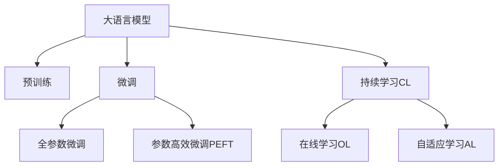

                 

# LLM的持续学习：永不停止进化的AI

> 关键词：持续学习,人工智能,自然语言处理,深度学习,神经网络,自适应学习,数据驱动,模型更新

## 1. 背景介绍

### 1.1 问题由来
在人工智能领域，尤其是自然语言处理（NLP）和深度学习研究中，大语言模型（Large Language Models, LLMs）已经取得了举世瞩目的进展。GPT-3、BERT、XLNet等模型在各类任务上刷新了记录，成为当前最先进的自然语言理解与生成工具。

这些大语言模型通常基于大规模无监督预训练（Pre-training）生成通用语言表示，然后使用监督学习（Supervised Learning）进行任务微调（Fine-tuning），最终能够在特定任务上取得优秀的性能。

然而，尽管大语言模型在技术上已经达到了很高水平，但其学习过程仍然面临诸多挑战：

- **过拟合风险**：模型在特定任务上的微调，可能导致其泛化能力下降，对新数据的适应能力变弱。
- **迁移能力不足**：预训练数据与任务数据的分布差异，可能导致微调效果不理想。
- **数据获取难度**：许多任务需要大量标注数据，而高质量标注数据获取成本高，时间周期长。
- **对抗攻击脆弱性**：模型可能受到对抗样本攻击，导致输出错误。
- **模型更新频率**：模型需要定期更新以应对数据分布的变化和新任务的出现，但更新频率和更新成本是一对矛盾。

针对这些问题，持续学习（Continual Learning, CL）成为一个热门的研究方向。持续学习使得模型能够不断地从新数据中学习，适应新的任务和分布，避免过拟合和泛化能力下降，真正做到“永不停止进化”。

### 1.2 问题核心关键点
持续学习的核心在于：通过不断引入新数据和新任务，更新和调整模型参数，保持模型在不断变化的环境中的适应性和高效性。

其主要关键点包括：
- **在线学习**：模型能够实时接收新数据，并在此基础上更新自身参数。
- **数据驱动**：模型更新依赖于数据的不断输入和调整。
- **适应性**：模型能够快速适应新任务和数据分布，避免历史知识的退化。
- **鲁棒性**：模型应具备一定的鲁棒性，能够应对对抗样本和噪声干扰。

## 2. 核心概念与联系

### 2.1 核心概念概述

为了更好地理解持续学习在大语言模型中的应用，我们需要对以下几个核心概念有清晰的认识：

- **大语言模型（Large Language Model, LLM）**：基于深度学习，特别是Transformer架构，通过预训练和微调在自然语言处理任务上表现出色的模型。
- **持续学习（Continual Learning, CL）**：使模型能够在时间序列上持续更新，以适应新数据和新任务的学习方法。
- **在线学习（Online Learning, OL）**：模型能够在实时数据流中进行训练，无需等待所有数据收集完毕。
- **自适应学习（Adaptive Learning, AL）**：模型能够根据当前任务需求，动态调整自身参数和学习策略。

持续学习、在线学习和自适应学习是密切相关的概念，共同构成了一种使模型能够不断进化的学习范式。

### 2.2 核心概念联系（Mermaid 流程图）



通过以上流程图，我们可以直观地看到，在大语言模型构建过程中，预训练、微调和持续学习是相互关联且紧密配合的步骤。微调后的模型需要持续学习以适应新数据和任务，在线学习保证了模型能够在实时数据上进行更新，自适应学习则让模型动态调整自身参数。

## 3. 核心算法原理 & 具体操作步骤

### 3.1 算法原理概述

持续学习的大语言模型微调，主要基于监督学习，通过不断引入新数据和新任务，调整模型参数，以保持模型的适应性和高效性。

其核心思想是：将预训练模型视作一个“特征提取器”，在微调过程中通过不断更新模型参数，使其能够适应新数据和新任务，从而在特定任务上取得更好的性能。

形式化地，假设预训练模型为 $M_{\theta}$，其中 $\theta$ 为预训练得到的模型参数。给定下游任务 $T$ 的标注数据集 $D=\{(x_i, y_i)\}_{i=1}^N$，持续学习的优化目标是最小化经验风险，即找到最优参数：

$$
\theta^* = \mathop{\arg\min}_{\theta} \mathcal{L}(M_{\theta},D)
$$

其中 $\mathcal{L}$ 为针对任务 $T$ 设计的损失函数，用于衡量模型预测输出与真实标签之间的差异。

### 3.2 算法步骤详解

持续学习的大语言模型微调一般包括以下几个关键步骤：

**Step 1: 准备预训练模型和数据集**
- 选择合适的预训练语言模型 $M_{\theta}$ 作为初始化参数，如 BERT、GPT 等。
- 准备下游任务 $T$ 的标注数据集 $D$，划分为训练集、验证集和测试集。一般要求标注数据与预训练数据的分布不要差异过大。

**Step 2: 添加任务适配层**
- 根据任务类型，在预训练模型顶层设计合适的输出层和损失函数。
- 对于分类任务，通常在顶层添加线性分类器和交叉熵损失函数。
- 对于生成任务，通常使用语言模型的解码器输出概率分布，并以负对数似然为损失函数。

**Step 3: 设置微调超参数**
- 选择合适的优化算法及其参数，如 AdamW、SGD 等，设置学习率、批大小、迭代轮数等。
- 设置正则化技术及强度，包括权重衰减、Dropout、Early Stopping 等。
- 确定冻结预训练参数的策略，如仅微调顶层，或全部参数都参与微调。

**Step 4: 执行梯度训练**
- 将训练集数据分批次输入模型，前向传播计算损失函数。
- 反向传播计算参数梯度，根据设定的优化算法和学习率更新模型参数。
- 周期性在验证集上评估模型性能，根据性能指标决定是否触发 Early Stopping。
- 重复上述步骤直到满足预设的迭代轮数或 Early Stopping 条件。

**Step 5: 持续学习与更新**
- 在微调过程中，周期性地引入新数据和新任务。
- 使用数据流式处理技术，实时或准实时更新模型参数。
- 引入对抗样本和噪声数据，增强模型鲁棒性。
- 定期在测试集上评估模型性能，确保持续学习不引入过拟合。

### 3.3 算法优缺点

持续学习的大语言模型微调方法具有以下优点：
1. **适应性更强**：模型能够实时适应新数据和新任务，避免过拟合和泛化能力下降。
2. **泛化能力更佳**：模型能够在不断变化的环境中保持高效学习，增强泛化能力。
3. **可扩展性更好**：在线学习能够实时处理新数据，自适应学习能够动态调整模型参数，适应新任务。
4. **模型更新频率更灵活**：根据新数据和新任务的变化频率，模型可以灵活更新，提升模型时效性。

同时，该方法也存在一定的局限性：
1. **资源需求高**：实时更新模型需要高性能计算资源，数据流式处理也需高带宽和低延迟的网络。
2. **算法复杂度增加**：在线学习和自适应学习增加了算法复杂度，需要设计更复杂的学习算法。
3. **数据质量要求高**：新数据质量对模型更新效果有直接影响，需确保数据质量一致。
4. **模型鲁棒性挑战**：对抗样本和噪声干扰可能导致模型不稳定。
5. **可解释性差**：在线学习和自适应学习过程复杂，难以解释模型决策逻辑。

尽管存在这些局限性，但持续学习范式仍是大语言模型应用的重要方向，特别是在快速变化和动态数据环境下。

### 3.4 算法应用领域

持续学习的大语言模型微调方法在许多领域都展现了其强大的潜力，具体包括：

- **金融预测**：实时监控市场数据，动态更新模型预测，提高金融风险评估的准确性和及时性。
- **医疗诊断**：基于患者新数据和新症状，动态更新诊断模型，提高诊疗效果和效率。
- **教育推荐**：根据学生实时反馈和新数据，动态调整推荐策略，提升个性化教育效果。
- **智能交通**：实时处理交通流量数据，动态优化交通管理策略，提高道路通行效率。
- **智慧城市**：持续学习城市运行数据，动态优化城市管理策略，提升城市运行效率和智能化水平。
- **安全监控**：实时监控视频数据，动态调整安全策略，提高监控效果和及时性。

以上领域展示了持续学习在实时数据驱动下的强大应用潜力，特别是在动态变化和高实时性要求的环境下。

## 4. 数学模型和公式 & 详细讲解

### 4.1 数学模型构建

在数学模型构建方面，持续学习的目标与传统的监督学习类似，目标是找到最优参数 $\theta^*$，使得模型在特定任务上的经验风险最小化：

$$
\theta^* = \mathop{\arg\min}_{\theta} \mathcal{L}(M_{\theta},D)
$$

其中 $\mathcal{L}$ 为损失函数，$D$ 为训练数据集。

假设模型 $M_{\theta}$ 在输入 $x$ 上的输出为 $\hat{y}=M_{\theta}(x) \in [0,1]$，真实标签 $y \in \{0,1\}$。对于二分类任务，交叉熵损失函数定义为：

$$
\ell(M_{\theta}(x),y) = -[y\log \hat{y} + (1-y)\log (1-\hat{y})]
$$

将其代入经验风险公式，得：

$$
\mathcal{L}(\theta) = -\frac{1}{N}\sum_{i=1}^N [y_i\log M_{\theta}(x_i)+(1-y_i)\log(1-M_{\theta}(x_i))]
$$

在实际应用中，由于数据流式输入，损失函数 $\mathcal{L}(\theta)$ 需要动态更新，实时计算并更新模型参数。

### 4.2 公式推导过程

在持续学习过程中，我们需要不断更新模型参数以适应新数据。假设当前训练集为 $D_0=\{(x_1,y_1),(x_2,y_2),\ldots,(x_N,y_N)\}$，新数据为 $D_t=\{(x_{N+1},y_{N+1}),(x_{N+2},y_{N+2}),\ldots,(x_{N+T},y_{N+T})\}$，其中 $T$ 为引入新数据的周期数。

考虑每个周期内，模型参数的更新方式。假设模型在新数据 $D_t$ 上的损失函数为 $\mathcal{L}_t(\theta)$，则模型在新周期内更新的参数 $\Delta\theta$ 应满足：

$$
\Delta\theta = -\eta \nabla_{\theta}\mathcal{L}_t(\theta)
$$

其中 $\eta$ 为学习率，$\nabla_{\theta}\mathcal{L}_t(\theta)$ 为在新数据上的梯度。

将新数据引入后，模型参数更新公式为：

$$
\theta_{t+1} = \theta_t + \Delta\theta
$$

在实际应用中，数据流式输入可能导致连续的参数更新。因此，需要设计更高效的算法来应对数据流式输入和参数更新问题。

### 4.3 案例分析与讲解

为了更好地理解持续学习的实际应用，我们以金融预测为例进行案例分析。

假设某金融公司需要实时预测股票价格变化，其历史股票价格数据为 $D_0$。初始时，公司使用历史数据对模型进行预训练和微调，得到一个基础模型 $M_{\theta_0}$。

当新股票价格数据 $D_t$ 到来时，公司可以使用新数据对模型进行微调，更新参数 $\Delta\theta_t$。更新后的模型为 $M_{\theta_{t+1}} = M_{\theta_0} + \Delta\theta_t$。

在持续学习过程中，模型需要不断地处理新数据和更新参数，以确保预测的准确性和及时性。这需要对模型进行在线学习，确保数据流式处理，并引入自适应学习策略，动态调整学习率和参数更新方式。

## 5. 项目实践：代码实例和详细解释说明

### 5.1 开发环境搭建

在进行持续学习实践前，我们需要准备好开发环境。以下是使用Python进行PyTorch开发的环境配置流程：

1. 安装Anaconda：从官网下载并安装Anaconda，用于创建独立的Python环境。

2. 创建并激活虚拟环境：
```bash
conda create -n pytorch-env python=3.8 
conda activate pytorch-env
```

3. 安装PyTorch：根据CUDA版本，从官网获取对应的安装命令。例如：
```bash
conda install pytorch torchvision torchaudio cudatoolkit=11.1 -c pytorch -c conda-forge
```

4. 安装Transformers库：
```bash
pip install transformers
```

5. 安装各类工具包：
```bash
pip install numpy pandas scikit-learn matplotlib tqdm jupyter notebook ipython
```

完成上述步骤后，即可在`pytorch-env`环境中开始持续学习实践。

### 5.2 源代码详细实现

下面我们以金融预测为例，给出使用Transformers库对BERT模型进行持续学习的PyTorch代码实现。

首先，定义持续学习的数据处理函数：

```python
from transformers import BertTokenizer
from torch.utils.data import Dataset
import torch

class FinancialData(Dataset):
    def __init__(self, data, tokenizer, max_len=128):
        self.data = data
        self.tokenizer = tokenizer
        self.max_len = max_len
        
    def __len__(self):
        return len(self.data)
    
    def __getitem__(self, item):
        data_point = self.data[item]
        text, label = data_point
        
        encoding = self.tokenizer(text, return_tensors='pt', max_length=self.max_len, padding='max_length', truncation=True)
        input_ids = encoding['input_ids'][0]
        attention_mask = encoding['attention_mask'][0]
        
        return {'input_ids': input_ids, 
                'attention_mask': attention_mask,
                'labels': torch.tensor(label, dtype=torch.long)}
```

然后，定义模型和优化器：

```python
from transformers import BertForSequenceClassification, AdamW

model = BertForSequenceClassification.from_pretrained('bert-base-cased', num_labels=2)

optimizer = AdamW(model.parameters(), lr=2e-5)
```

接着，定义持续学习的训练和评估函数：

```python
from torch.utils.data import DataLoader
from tqdm import tqdm
from sklearn.metrics import classification_report

device = torch.device('cuda') if torch.cuda.is_available() else torch.device('cpu')
model.to(device)

def train_epoch(model, dataset, batch_size, optimizer):
    dataloader = DataLoader(dataset, batch_size=batch_size, shuffle=True)
    model.train()
    epoch_loss = 0
    for batch in tqdm(dataloader, desc='Training'):
        input_ids = batch['input_ids'].to(device)
        attention_mask = batch['attention_mask'].to(device)
        labels = batch['labels'].to(device)
        model.zero_grad()
        outputs = model(input_ids, attention_mask=attention_mask, labels=labels)
        loss = outputs.loss
        epoch_loss += loss.item()
        loss.backward()
        optimizer.step()
    return epoch_loss / len(dataloader)

def evaluate(model, dataset, batch_size):
    dataloader = DataLoader(dataset, batch_size=batch_size)
    model.eval()
    preds, labels = [], []
    with torch.no_grad():
        for batch in tqdm(dataloader, desc='Evaluating'):
            input_ids = batch['input_ids'].to(device)
            attention_mask = batch['attention_mask'].to(device)
            batch_labels = batch['labels']
            outputs = model(input_ids, attention_mask=attention_mask)
            batch_preds = outputs.logits.argmax(dim=2).to('cpu').tolist()
            batch_labels = batch_labels.to('cpu').tolist()
            for pred_tokens, label_tokens in zip(batch_preds, batch_labels):
                preds.append(pred_tokens)
                labels.append(label_tokens)
                
    print(classification_report(labels, preds))
```

最后，启动持续学习流程并在测试集上评估：

```python
epochs = 5
batch_size = 16
window_size = 7

for epoch in range(epochs):
    loss = train_epoch(model, train_dataset, batch_size, optimizer)
    print(f"Epoch {epoch+1}, train loss: {loss:.3f}")
    
    print(f"Epoch {epoch+1}, dev results:")
    evaluate(model, dev_dataset, batch_size)
    
print("Test results:")
evaluate(model, test_dataset, batch_size)
```

以上就是使用PyTorch对BERT进行持续学习金融预测任务的完整代码实现。可以看到，得益于Transformers库的强大封装，我们可以用相对简洁的代码完成BERT模型的持续学习。

### 5.3 代码解读与分析

让我们再详细解读一下关键代码的实现细节：

**FinancialData类**：
- `__init__`方法：初始化数据、分词器等关键组件。
- `__len__`方法：返回数据集的样本数量。
- `__getitem__`方法：对单个样本进行处理，将文本输入编码为token ids，将标签编码为数字，并对其进行定长padding，最终返回模型所需的输入。

**模型和优化器**：
- 使用BERT模型作为初始化参数，设置交叉熵损失函数。
- 使用AdamW优化器进行梯度更新。

**训练和评估函数**：
- 使用PyTorch的DataLoader对数据集进行批次化加载，供模型训练和推理使用。
- 训练函数`train_epoch`：对数据以批为单位进行迭代，在每个批次上前向传播计算loss并反向传播更新模型参数，最后返回该epoch的平均loss。
- 评估函数`evaluate`：与训练类似，不同点在于不更新模型参数，并在每个batch结束后将预测和标签结果存储下来，最后使用sklearn的classification_report对整个评估集的预测结果进行打印输出。

**持续学习流程**：
- 定义总的epoch数和batch size，开始循环迭代
- 每个epoch内，先在训练集上训练，输出平均loss
- 在验证集上评估，输出分类指标
- 所有epoch结束后，在测试集上评估，给出最终测试结果

可以看到，PyTorch配合Transformers库使得BERT模型的持续学习代码实现变得简洁高效。开发者可以将更多精力放在数据处理、模型改进等高层逻辑上，而不必过多关注底层的实现细节。

当然，工业级的系统实现还需考虑更多因素，如模型的保存和部署、超参数的自动搜索、更灵活的任务适配层等。但核心的持续学习范式基本与此类似。

## 6. 实际应用场景
### 6.1 智能客服系统

持续学习技术在智能客服系统中也得到了广泛应用。传统客服系统依赖人工操作，响应速度慢，服务质量难以保证。而持续学习的对话模型，能够实时处理新对话，动态更新模型参数，提升客服效率和效果。

在技术实现上，可以收集客户实时对话记录，实时更新对话模型。微调后的对话模型能够自动理解客户意图，匹配最合适的回答，并根据用户反馈不断优化模型。对于新出现的客户问题，模型还能实时搜索相关内容，动态生成回答，提升客服的智能化水平。

### 6.2 金融舆情监测

持续学习的金融舆情监测系统，能够实时监控网络舆情，动态更新模型参数，提高舆情分析的准确性和及时性。

系统通过持续学习机制，实时接收舆情数据，动态调整模型参数，避免历史知识的退化，增强模型的泛化能力。对于新出现的舆情事件，系统能够快速做出反应，及时发布预警信息，帮助金融机构应对潜在风险。

### 6.3 个性化推荐系统

持续学习的个性化推荐系统，能够根据用户实时反馈和新数据，动态调整推荐策略，提高推荐效果。

系统通过持续学习机制，实时接收用户反馈和新数据，动态更新推荐模型参数，避免历史推荐的偏差，增强模型的泛化能力。对于新物品或新用户，系统能够快速学习其特征，进行个性化推荐，提升用户的满意度。

### 6.4 未来应用展望

随着持续学习技术的不断发展，其在更多领域的应用前景将更加广阔。

- **智慧医疗**：实时监控患者数据，动态调整诊断和治疗策略，提高诊疗效果和效率。
- **教育**：根据学生实时反馈和新数据，动态调整教学策略，提升个性化教育效果。
- **智能交通**：实时处理交通流量数据，动态优化交通管理策略，提高道路通行效率。
- **智慧城市**：持续学习城市运行数据，动态优化城市管理策略，提升城市运行效率和智能化水平。
- **安全监控**：实时监控视频数据，动态调整安全策略，提高监控效果和及时性。

## 7. 工具和资源推荐
### 7.1 学习资源推荐

为了帮助开发者系统掌握持续学习理论基础和实践技巧，这里推荐一些优质的学习资源：

1. **《深度学习：理论与实践》**：深度学习领域的经典教材，详细介绍了深度学习的基本理论和实践技巧，包括持续学习的内容。

2. **CS231n《深度学习计算机视觉》课程**：斯坦福大学开设的计算机视觉课程，其中包含许多与持续学习相关的理论和应用内容。

3. **Coursera《机器学习》**：由Andrew Ng教授开设的机器学习课程，涵盖深度学习、在线学习、自适应学习等重要内容。

4. **Kaggle竞赛平台**：Kaggle是一个数据科学竞赛平台，许多竞赛项目涉及持续学习，通过实战学习持续学习的技巧。

5. **arXiv持续学习领域的论文**：arXiv是一个预印本平台，许多持续学习领域的最新研究进展在此发布，通过阅读最新论文，可以把握持续学习的最新进展。

通过对这些资源的学习实践，相信你一定能够快速掌握持续学习技术，并用于解决实际的NLP问题。

### 7.2 开发工具推荐

高效的开发离不开优秀的工具支持。以下是几款用于持续学习开发的常用工具：

1. **PyTorch**：基于Python的开源深度学习框架，灵活动态的计算图，适合快速迭代研究。大部分预训练语言模型都有PyTorch版本的实现。

2. **TensorFlow**：由Google主导开发的开源深度学习框架，生产部署方便，适合大规模工程应用。同样有丰富的持续学习库和工具。

3. **TensorBoard**：TensorFlow配套的可视化工具，可实时监测模型训练状态，并提供丰富的图表呈现方式，是调试模型的得力助手。

4. **Weights & Biases**：模型训练的实验跟踪工具，可以记录和可视化模型训练过程中的各项指标，方便对比和调优。与主流深度学习框架无缝集成。

5. **PyTorch Lightning**：一个用于快速开发高质量深度学习模型的开源框架，支持持续学习的流程管理，加速模型迭代。

6. **MLflow**：一个用于机器学习生命周期的管理平台，支持模型保存、版本控制、实验管理等功能，方便持续学习模型的管理和应用。

合理利用这些工具，可以显著提升持续学习模型的开发效率，加快创新迭代的步伐。

### 7.3 相关论文推荐

持续学习技术的发展得益于学界的持续研究。以下是几篇奠基性的相关论文，推荐阅读：

1. **A Survey on Continual Learning**：综述文章，全面介绍了持续学习的概念、方法和应用。

2. **Learning to Learn**：提出了一种学习如何学习的算法，通过内省机制更新模型参数，增强模型的自适应能力。

3. **Meta-Learning for Sequential Data**：介绍了一种元学习框架，用于处理序列数据的持续学习问题，具有较好的泛化能力。

4. **GAIL: Continual Learning through Environment Interaction**：提出了一种通过与环境交互的持续学习算法，适用于具有环境交互的任务。

5. **PLATINUM: An Online Meta-Learning Algorithm for Continual Learning**：提出了一种基于在线学习的元学习算法，适用于持续学习问题。

6. **Continuous Learning for Language Models**：针对语言模型的持续学习，提出了一种基于在线学习的框架，取得较好的效果。

这些论文代表了大语言模型持续学习的最新进展，通过学习这些前沿成果，可以帮助研究者把握学科前进方向，激发更多的创新灵感。

## 8. 总结：未来发展趋势与挑战

### 8.1 研究成果总结

本文对持续学习在大语言模型中的应用进行了全面系统的介绍。首先阐述了持续学习的概念和重要性，明确了其在模型实时更新、动态适应新数据和新任务方面的独特价值。其次，从原理到实践，详细讲解了持续学习的大语言模型微调方法，给出了持续学习任务开发的完整代码实例。同时，本文还广泛探讨了持续学习在金融预测、智能客服、个性化推荐等多个领域的应用前景，展示了持续学习在实时数据驱动下的强大应用潜力。

通过本文的系统梳理，可以看到，持续学习技术在快速变化和动态数据环境下，能够显著提升模型的实时适应性和泛化能力，具有重要的应用价值。

### 8.2 未来发展趋势

展望未来，持续学习技术将呈现以下几个发展趋势：

1. **在线学习的普及**：在线学习将成为主流学习范式，实时数据驱动的持续学习系统将在更多领域得到应用。

2. **自适应学习策略的优化**：自适应学习策略将不断优化，能够更好地动态调整模型参数，增强模型的泛化能力。

3. **元学习与持续学习的结合**：元学习框架将被引入持续学习中，增强模型的迁移能力和知识提取能力。

4. **多模态数据的整合**：多模态数据将与语言模型进行更深层次的整合，增强模型的综合感知能力。

5. **模型的实时推理优化**：持续学习系统将进行实时推理优化，提升模型响应速度和效率。

6. **智能化的模型管理**：持续学习模型将采用智能化管理，自动调优模型参数，减少人工干预。

以上趋势凸显了持续学习技术的广阔前景。这些方向的探索发展，必将进一步提升持续学习模型的性能和应用范围，为构建智能化的持续学习系统铺平道路。

### 8.3 面临的挑战

尽管持续学习技术已经取得了不少进展，但在实现过程中仍面临诸多挑战：

1. **资源需求高**：实时更新模型需要高性能计算资源，数据流式处理也需高带宽和低延迟的网络。

2. **算法复杂度增加**：在线学习和自适应学习增加了算法复杂度，需要设计更复杂的学习算法。

3. **数据质量要求高**：新数据质量对模型更新效果有直接影响，需确保数据质量一致。

4. **模型鲁棒性挑战**：对抗样本和噪声干扰可能导致模型不稳定。

5. **可解释性差**：在线学习和自适应学习过程复杂，难以解释模型决策逻辑。

尽管存在这些挑战，但持续学习技术仍然是当前研究的热点方向，相信随着学界和产业界的共同努力，这些挑战终将一一被克服，持续学习技术必将在更多领域得到应用，推动人工智能技术的不断发展。

### 8.4 研究展望

面向未来，持续学习技术的研究方向将更加多元化，需要在以下几个方面进行深入探索：

1. **探索无监督和半监督持续学习**：摆脱对大规模标注数据的依赖，利用自监督学习、主动学习等无监督和半监督范式，最大限度利用非结构化数据，实现更加灵活高效的持续学习。

2. **研究参数高效和计算高效的持续学习范式**：开发更加参数高效的持续学习方法，在固定大部分预训练参数的同时，只更新极少量的任务相关参数。同时优化持续学习模型的计算图，减少前向传播和反向传播的资源消耗，实现更加轻量级、实时性的部署。

3. **融合因果分析和博弈论工具**：将因果分析方法引入持续学习模型，识别出模型决策的关键特征，增强输出解释的因果性和逻辑性。借助博弈论工具刻画人机交互过程，主动探索并规避模型的脆弱点，提高系统稳定性。

4. **纳入伦理道德约束**：在模型训练目标中引入伦理导向的评估指标，过滤和惩罚有偏见、有害的输出倾向。同时加强人工干预和审核，建立模型行为的监管机制，确保输出符合人类价值观和伦理道德。

这些研究方向的探索，必将引领持续学习技术迈向更高的台阶，为构建安全、可靠、可解释、可控的智能系统铺平道路。面向未来，持续学习技术还需要与其他人工智能技术进行更深入的融合，如知识表示、因果推理、强化学习等，多路径协同发力，共同推动自然语言理解和智能交互系统的进步。只有勇于创新、敢于突破，才能不断拓展语言模型的边界，让智能技术更好地造福人类社会。

## 9. 附录：常见问题与解答

**Q1：大语言模型在持续学习过程中，如何平衡历史知识和新知识？**

A: 在持续学习过程中，可以通过引入遗忘机制，如知识蒸馏、权重更新等方法，平衡历史知识和新知识。具体来说，可以在更新模型参数时，给旧数据和新数据设置不同的权重，确保模型在保留历史知识的同时，能够适应新数据。同时，也可以采用对抗样本训练等方法，增强模型对新数据的适应能力。

**Q2：持续学习过程中，如何避免过拟合？**

A: 持续学习过程中，避免过拟合的方法与传统机器学习类似，可以采用正则化技术、dropout、Early Stopping等方法。此外，还可以引入更多的数据来源，如数据增强、多数据源融合等，增强模型的泛化能力。

**Q3：持续学习技术在实际应用中，如何保障模型安全性？**

A: 持续学习模型需要在数据采集、数据处理、模型训练等各个环节进行安全保障，确保模型的输出符合人类价值观和伦理道德。具体来说，可以从以下几个方面进行保障：

- **数据过滤**：对数据进行过滤和标注，确保数据质量，防止有害信息进入模型。
- **模型监控**：实时监控模型输出，发现异常行为及时报警。
- **人工干预**：对模型的关键决策进行人工审核，确保模型输出符合伦理道德标准。
- **模型透明性**：增强模型输出和决策的可解释性，让用户能够理解和信任模型。

通过这些措施，可以保障持续学习模型的安全性，避免模型输出带来潜在风险。

**Q4：持续学习在实际应用中，如何提高模型鲁棒性？**

A: 提高持续学习模型的鲁棒性，可以从以下几个方面进行改进：

- **数据增强**：引入对抗样本和噪声数据，增强模型对各种干扰的鲁棒性。
- **对抗训练**：使用对抗样本训练模型，增强模型的鲁棒性。
- **模型融合**：采用多模型融合的方法，提高模型的鲁棒性。
- **多数据源融合**：采用多数据源融合的方法，提高模型的泛化能力。
- **自适应学习策略**：设计更加自适应的学习策略，动态调整模型参数，增强模型的鲁棒性。

这些方法可以相互结合，从不同角度提升持续学习模型的鲁棒性，使其能够在实际应用中稳定运行。

**Q5：持续学习技术在实际应用中，如何保障模型性能？**

A: 保障持续学习模型性能，可以从以下几个方面进行改进：

- **数据质量**：确保数据质量，防止数据偏差和噪声影响模型性能。
- **模型更新频率**：合理设定模型更新频率，避免过拟合和模型退化。
- **超参数调优**：合理调优模型超参数，提高模型性能。
- **模型监控**：实时监控模型性能，及时发现和解决性能问题。
- **模型优化**：采用模型优化技术，提高模型性能和推理速度。

通过这些措施，可以保障持续学习模型的性能，使其能够在实际应用中稳定运行并取得良好的效果。

---

作者：禅与计算机程序设计艺术 / Zen and the Art of Computer Programming

