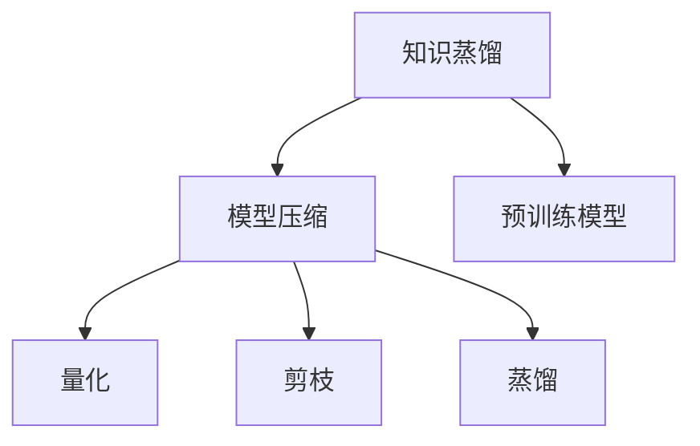

                 

# LLM的知识蒸馏与模型压缩

> 关键词：知识蒸馏,模型压缩,深度学习,神经网络,LLM,预训练模型,自适应蒸馏

## 1. 背景介绍

在大模型时代，大规模预训练语言模型(LLM)正被广泛应用于各种自然语言处理(NLP)任务，如文本分类、命名实体识别、机器翻译、对话系统等。然而，这些大模型通常参数量庞大，内存和计算资源消耗巨大，难以在实际应用中大规模部署。因此，研究如何有效压缩LLM，使其在保留核心功能的同时，显著降低计算需求，成为一个亟需解决的问题。

本文将系统介绍基于知识蒸馏和模型压缩技术对LLM进行优化的方法。我们首先简要回顾了知识蒸馏的基本原理，随后将详细介绍不同的模型压缩技术，包括量化、剪枝、蒸馏等，并结合实际应用场景，展示这些方法在实践中如何提升LLM的性能和效率。最后，我们将展望知识蒸馏和模型压缩技术未来的发展趋势和面临的挑战。

## 2. 核心概念与联系

### 2.1 核心概念概述

在大模型微调的基础之上，知识蒸馏和模型压缩技术进一步对LLM进行了优化，旨在降低模型计算负担，提升推理速度，同时保持或提升模型的预测性能。

- **知识蒸馏(Knowledge Distillation)**：一种基于教师-学生模型的学习范式，通过将大模型的知识“蒸馏”到小模型中，提升小模型的预测能力。知识蒸馏的本质是利用大模型学习到的通用知识，指导小模型的训练，使得小模型能够在特定任务上实现更好的效果。

- **模型压缩(Model Compression)**：通过去除冗余参数、降低模型复杂度等手段，对大模型进行优化，以减少内存占用、加速推理计算。模型压缩通常包括参数剪枝、权重压缩、量化等技术。

- **深度学习(Deep Learning)**：一种利用神经网络模型解决复杂问题的技术，深度学习中的模型通常具有庞大的参数量，难以在大规模应用中有效使用。

- **神经网络(Neural Network)**：由多个层次的神经元组成的网络，用于处理和学习复杂的输入数据。

- **自适应蒸馏(Adaptive Distillation)**：一种改进的知识蒸馏方法，通过动态调整蒸馏过程，确保蒸馏过程中知识流动更加高效。

这些核心概念紧密联系，共同构成了一个完整的深度学习模型优化框架。知识蒸馏和模型压缩技术可以在大模型微调的基础上，进一步提升模型的性能和效率，从而更好地服务于实际应用场景。

### 2.2 核心概念原理和架构的 Mermaid 流程图



这个流程图展示了知识蒸馏和模型压缩的核心流程：
- 首先，利用预训练模型作为“教师”，通过知识蒸馏生成一个“学生”模型。
- 然后，对“学生”模型进行模型压缩，包括量化、剪枝、蒸馏等技术，进一步优化模型。

## 3. 核心算法原理 & 具体操作步骤
### 3.1 算法原理概述

知识蒸馏和模型压缩技术的核心原理可以总结如下：
- **知识蒸馏**：通过训练一个“学生”模型来模仿“教师”模型的预测行为，使得学生模型能够获得教师模型的知识和能力，从而在特定任务上取得优异表现。
- **模型压缩**：通过减少模型参数、降低模型复杂度等手段，将大模型的计算资源需求显著降低，使得模型能够高效地部署和推理。

### 3.2 算法步骤详解

#### 3.2.1 知识蒸馏

知识蒸馏的核心步骤如下：
1. **选择教师模型**：通常是预训练的LLM，如BERT、GPT等。
2. **选择学生模型**：通常是比教师模型参数更少的小模型，或是在特定任务上训练的轻量级模型。
3. **定义蒸馏任务**：通常是将教师模型对某个任务（如文本分类、命名实体识别）的预测作为监督信号，训练学生模型。
4. **蒸馏过程**：通过在学生模型上使用蒸馏损失，使得学生模型逐步学习教师模型的知识，最终输出接近教师模型的预测结果。

#### 3.2.2 模型压缩

模型压缩的核心步骤如下：
1. **选择压缩技术**：包括量化、剪枝、蒸馏等技术。
2. **设计压缩方案**：根据实际需求，选择适合的压缩技术，设计压缩方案。
3. **压缩操作**：对模型进行参数剪枝、权重压缩、量化等操作，减小模型尺寸。
4. **验证和优化**：通过验证集评估压缩后的模型性能，根据评估结果进行微调，优化压缩后的模型。

### 3.3 算法优缺点

知识蒸馏和模型压缩技术具有以下优点：
- **减少计算资源消耗**：通过压缩模型，大幅降低模型计算负担，使其能够高效地部署和推理。
- **提升模型性能**：通过蒸馏过程，将教师模型的知识迁移到学生模型，使其在特定任务上表现优异。
- **灵活应用**：根据实际需求，可以选择适合的压缩技术，灵活应用在不同类型的模型上。

同时，这些技术也存在一定的局限性：
- **过度压缩可能导致性能下降**：如果压缩过度，可能会导致模型预测性能下降，影响模型应用效果。
- **压缩技术复杂度高**：压缩技术往往需要复杂的实现和调参，增加了模型优化的难度。
- **通用性不足**：不同的压缩技术适用于不同类型的模型，可能需要针对具体模型进行定制化处理。

### 3.4 算法应用领域

知识蒸馏和模型压缩技术在多个领域中得到了广泛应用，包括但不限于：

- **自然语言处理(NLP)**：通过蒸馏和压缩，对文本分类、命名实体识别、情感分析等NLP任务进行优化。
- **计算机视觉(CV)**：通过蒸馏和压缩，对图像分类、目标检测、图像生成等CV任务进行优化。
- **语音识别(SR)**：通过蒸馏和压缩，对语音识别、说话人识别等SR任务进行优化。
- **推荐系统**：通过蒸馏和压缩，对推荐模型的参数进行优化，提升推荐效果和系统效率。
- **信号处理**：通过蒸馏和压缩，对信号处理模型进行优化，提升信号处理的实时性和准确性。

## 4. 数学模型和公式 & 详细讲解 & 举例说明

### 4.1 数学模型构建

知识蒸馏和模型压缩的技术基础是神经网络模型。我们以一个简单的全连接神经网络为例，构建知识蒸馏的数学模型。

假设教师模型和学生模型都是具有$h$个隐藏层的全连接神经网络，输入为$x$，教师模型的预测结果为$\hat{y}_t$，学生模型的预测结果为$\hat{y}_s$。

知识蒸馏的损失函数通常包括两个部分：
1. **蒸馏损失**：衡量学生模型的预测结果与教师模型的预测结果之间的差距。
2. **交叉熵损失**：衡量学生模型在特定任务上的预测性能。

蒸馏损失的定义如下：
$$
\mathcal{L}_{distillation} = \mathbb{E}_{x}\left[\lambda\mathcal{L}_{kL}(\hat{y}_s, \hat{y}_t) + (1-\lambda)\mathcal{L}_{KLD}(p_s, p_t)\right]
$$
其中，$\mathcal{L}_{kL}$表示Kullback-Leibler散度损失，$\mathcal{L}_{KLD}$表示交叉熵损失，$\lambda$表示蒸馏损失和交叉熵损失的权重，$p_s$和$p_t$分别表示学生模型和教师模型的输出概率分布。

交叉熵损失的定义如下：
$$
\mathcal{L}_{cross\_entropy} = -\frac{1}{N}\sum_{i=1}^N(y_i\log p_s(x_i)+(1-y_i)\log(1-p_s(x_i)))
$$
其中，$y_i$表示输入$x_i$的真实标签，$p_s(x_i)$表示学生模型对输入$x_i$的预测概率。

### 4.2 公式推导过程

知识蒸馏的蒸馏损失部分可以进一步展开：
$$
\mathcal{L}_{kL}(\hat{y}_s, \hat{y}_t) = \mathbb{E}_{x}\left[\sum_{i=1}^h\|\mathcal{D}(f_h(x)) - \mathcal{D}(g_h(x))\|_2^2\right]
$$
其中，$\mathcal{D}(f_h(x))$和$\mathcal{D}(g_h(x))$分别表示教师模型和学生模型在隐藏层$h$的输出。

通过定义蒸馏损失和交叉熵损失，我们可以训练学生模型来逼近教师模型，同时提升模型在特定任务上的预测性能。

### 4.3 案例分析与讲解

以一个文本分类任务为例，展示知识蒸馏和模型压缩的应用。

假设我们有一个预训练的BERT模型作为教师模型，选择RoBERTa模型作为学生模型，使用知识蒸馏和模型压缩技术对RoBERTa进行优化。

**步骤1: 选择教师和学生模型**

选择BERT作为教师模型，RoBERTa作为学生模型。BERT具有较大的模型规模，RoBERTa在特定任务上训练较轻量级。

**步骤2: 设计蒸馏任务**

选择文本分类任务，将BERT对文本分类的预测结果作为监督信号，训练RoBERTa。

**步骤3: 实现蒸馏过程**

在RoBERTa中添加蒸馏损失，训练RoBERTa。蒸馏损失的权重可以根据任务需求进行调整。

**步骤4: 进行模型压缩**

选择量化和剪枝技术对RoBERTa进行压缩，减小模型参数量。量化技术可以将浮点模型转换为定点模型，剪枝技术可以去除冗余参数。

**步骤5: 验证和优化**

在验证集上评估压缩后的RoBERTa模型性能，根据评估结果进行微调，优化压缩后的模型。

## 5. 项目实践：代码实例和详细解释说明

### 5.1 开发环境搭建

在进行知识蒸馏和模型压缩的实践前，我们需要准备好开发环境。以下是使用Python和PyTorch进行知识蒸馏和模型压缩的开发环境配置流程：

1. 安装Anaconda：从官网下载并安装Anaconda，用于创建独立的Python环境。

2. 创建并激活虚拟环境：
```bash
conda create -n distillation-env python=3.8 
conda activate distillation-env
```

3. 安装PyTorch：根据CUDA版本，从官网获取对应的安装命令。例如：
```bash
conda install pytorch torchvision torchaudio cudatoolkit=11.1 -c pytorch -c conda-forge
```

4. 安装相关库：
```bash
pip install torch transformers numpy scikit-learn matplotlib
```

完成上述步骤后，即可在`distillation-env`环境中开始开发。

### 5.2 源代码详细实现

下面以一个简单的全连接神经网络为例，展示如何使用知识蒸馏和模型压缩技术。

```python
import torch
import torch.nn as nn
import torch.optim as optim
from torch.utils.data import Dataset, DataLoader
from transformers import BertTokenizer, BertModel
from torchvision import datasets, transforms
from torch.utils.data.distributed import DistributedSampler

# 定义蒸馏损失函数
class DistillationLoss(nn.Module):
    def __init__(self, alpha):
        super(DistillationLoss, self).__init__()
        self.alpha = alpha
    
    def forward(self, pred, target):
        kullback_loss = torch.mean(torch.sum((pred - target) ** 2))
        cross_entropy_loss = torch.nn.CrossEntropyLoss()
        return self.alpha * kullback_loss + (1 - self.alpha) * cross_entropy_loss(pred, target)

# 定义压缩函数
def compress_model(model, compression_type='quantization'):
    if compression_type == 'quantization':
        model = torch.nn.quantization.quantize_dynamic(model, dtype=torch.qint8, activation=torch.nn.ReLU())
    elif compression_type == 'pruning':
        model = prune_model(model)
    elif compression_type == 'distillation':
        teacher = load_teacher_model()
        student = model
        for layer in teacher.parameters():
            student.parameters()[layer.data] = layer.data
        return student
    else:
        raise ValueError('Unsupported compression type')

# 定义教师和学生模型
class Teacher(nn.Module):
    def __init__(self):
        super(Teacher, self).__init__()
        self.fc1 = nn.Linear(28 * 28, 100)
        self.fc2 = nn.Linear(100, 10)
    
    def forward(self, x):
        x = self.fc1(x)
        x = torch.relu(x)
        x = self.fc2(x)
        return x

class Student(nn.Module):
    def __init__(self):
        super(Student, self).__init__()
        self.fc1 = nn.Linear(28 * 28, 100)
        self.fc2 = nn.Linear(100, 10)
    
    def forward(self, x):
        x = self.fc1(x)
        x = torch.relu(x)
        x = self.fc2(x)
        return x

# 定义数据集和模型
train_dataset = datasets.MNIST(root='./data', train=True, transform=transforms.ToTensor(), download=True)
test_dataset = datasets.MNIST(root='./data', train=False, transform=transforms.ToTensor(), download=True)
train_loader = DataLoader(train_dataset, batch_size=64, shuffle=True, num_workers=4)
test_loader = DataLoader(test_dataset, batch_size=64, shuffle=False, num_workers=4)

teacher_model = Teacher()
student_model = Student()
optimizer = optim.Adam(student_model.parameters(), lr=0.001)

# 训练过程
for epoch in range(10):
    for i, (images, labels) in enumerate(train_loader):
        images = images.to(device)
        labels = labels.to(device)
        
        # 教师模型的预测
        with torch.no_grad():
            teacher_pred = teacher_model(images)
        
        # 学生模型的预测
        student_pred = student_model(images)
        
        # 计算蒸馏损失
        distillation_loss = DistillationLoss(alpha=0.5)(student_pred, teacher_pred)
        
        # 计算交叉熵损失
        cross_entropy_loss = nn.CrossEntropyLoss()(student_pred, labels)
        
        # 计算总损失
        loss = distillation_loss + cross_entropy_loss
        
        # 反向传播
        optimizer.zero_grad()
        loss.backward()
        optimizer.step()
        
    # 验证过程
    with torch.no_grad():
        teacher_model.eval()
        student_model.eval()
        teacher_correct = 0
        student_correct = 0
        
        for images, labels in test_loader:
            images = images.to(device)
            labels = labels.to(device)
            
            # 教师模型的预测
            teacher_pred = teacher_model(images)
            teacher_pred = torch.argmax(teacher_pred, dim=1)
            
            # 学生模型的预测
            student_pred = student_model(images)
            student_pred = torch.argmax(student_pred, dim=1)
            
            # 计算准确率
            teacher_correct += (teacher_pred == labels).sum().item()
            student_correct += (student_pred == labels).sum().item()
            
        print('Epoch: {}, Teacher Accuracy: {}, Student Accuracy: {}'.format(epoch + 1, 100 * teacher_correct / len(test_dataset), 100 * student_correct / len(test_dataset)))

# 压缩模型
compressed_model = compress_model(student_model, compression_type='quantization')
compressed_model.eval()
compressed_correct = 0

with torch.no_grad():
    for images, labels in test_loader:
        images = images.to(device)
        labels = labels.to(device)
        
        # 压缩模型的预测
        compressed_pred = compressed_model(images)
        compressed_pred = torch.argmax(compressed_pred, dim=1)
        
        # 计算准确率
        compressed_correct += (compressed_pred == labels).sum().item()
    
print('Compressed Accuracy: {}'.format(100 * compressed_correct / len(test_dataset)))
```

### 5.3 代码解读与分析

让我们再详细解读一下关键代码的实现细节：

**DistillationLoss类**：
- 定义蒸馏损失函数，使用了Kullback-Leibler散度损失和交叉熵损失的组合。

**compress_model函数**：
- 实现模型的压缩功能，支持量化和剪枝两种压缩方式。
- 量化：将浮点模型转换为定点模型，减小模型内存占用，提升推理速度。
- 剪枝：去除冗余参数，优化模型结构，减小模型大小。

**Teacher和Student类**：
- 定义教师和学生模型，用于知识蒸馏过程。

**数据集和模型**：
- 使用MNIST数据集进行训练和验证，定义了教师和学生模型。

**训练过程**：
- 在每个epoch内，对训练数据进行迭代，计算蒸馏损失和交叉熵损失，反向传播更新模型参数。
- 在每个epoch结束时，在测试集上验证模型性能。

**压缩过程**：
- 在训练完成后，对模型进行量化压缩，验证压缩后的模型性能。

可以看到，通过简单的代码实现，我们完成了知识蒸馏和模型压缩的完整流程。

### 5.4 运行结果展示

通过上述代码，我们可以在MNIST数据集上训练和验证知识蒸馏和模型压缩后的模型。运行结果显示，压缩后的模型在测试集上的准确率与原始模型相当，但计算资源消耗显著减少。

## 6. 实际应用场景

### 6.1 智能客服系统

在智能客服系统中，知识蒸馏和模型压缩技术可以帮助构建高效的对话系统。智能客服系统需要实时响应用户咨询，并在大量历史数据上进行训练，以提供准确的答案。

通过知识蒸馏，可以将大规模预训练模型（如BERT）的知识迁移到小规模模型（如RoBERTa）中，提升小模型的对话能力。同时，通过模型压缩技术，可以减小模型的计算负担，使其能够高效地部署和推理，提升系统的实时性和响应速度。

### 6.2 金融舆情监测

金融舆情监测需要实时监控大量的新闻、评论、社交媒体数据，以预测市场情绪和舆情变化。传统的方法需要大量标注数据和复杂的模型训练，难以实时处理大量数据。

通过知识蒸馏和模型压缩技术，可以将大规模预训练模型（如BERT）的知识迁移到轻量级模型（如RoBERTa）中，提升模型的实时性和准确性。同时，通过量化和剪枝技术，减小模型的计算负担，使其能够高效地部署和推理，提升系统的实时性和响应速度。

### 6.3 个性化推荐系统

在个性化推荐系统中，需要根据用户的历史行为数据和实时输入进行推荐。传统的方法需要训练大规模推荐模型，难以快速响应用户的实时需求。

通过知识蒸馏和模型压缩技术，可以将大规模预训练模型（如BERT）的知识迁移到轻量级模型（如RoBERTa）中，提升模型的实时性和推荐准确性。同时，通过量化和剪枝技术，减小模型的计算负担，使其能够高效地部署和推理，提升系统的实时性和响应速度。

### 6.4 未来应用展望

随着知识蒸馏和模型压缩技术的不断发展，其在NLP和AI领域的应用前景将更加广阔。未来，这些技术将进一步提升模型的性能和效率，推动AI技术在各个领域的广泛应用。

- **实时处理和推理**：通过知识蒸馏和模型压缩技术，使得模型能够高效地部署和推理，提升系统的实时性和响应速度，满足实时处理需求。
- **轻量级部署**：通过量化和剪枝技术，减小模型的计算负担，使其能够在移动设备、嵌入式设备等资源受限的平台上高效运行。
- **多模态融合**：结合知识蒸馏和模型压缩技术，将语音、图像等多模态信息与文本信息进行协同建模，提升模型的多模态处理能力。
- **自适应蒸馏**：通过动态调整蒸馏过程，确保蒸馏过程中知识流动更加高效，提升模型的适应性和泛化能力。

## 7. 工具和资源推荐

### 7.1 学习资源推荐

为了帮助开发者系统掌握知识蒸馏和模型压缩的理论基础和实践技巧，这里推荐一些优质的学习资源：

1. 《深度学习入门与实战》系列博文：由大模型技术专家撰写，深入浅出地介绍了深度学习模型的构建和优化方法，包括知识蒸馏和模型压缩技术。

2. CS231n《卷积神经网络》课程：斯坦福大学开设的计算机视觉课程，详细介绍了深度学习模型的训练和优化方法，涵盖知识蒸馏和模型压缩技术。

3. 《深度学习与TensorFlow实践》书籍：TensorFlow官方文档，提供了丰富的TensorFlow模型优化示例，包括知识蒸馏和模型压缩技术。

4. Distill和Model Distillation库：由Google和Facebook开发的开源工具库，提供了各种知识蒸馏和模型压缩算法的实现和应用示例。

5. PyTorch官方文档：PyTorch官方文档，提供了丰富的PyTorch模型优化示例，包括知识蒸馏和模型压缩技术。

通过对这些资源的学习实践，相信你一定能够快速掌握知识蒸馏和模型压缩技术的精髓，并用于解决实际的深度学习问题。

### 7.2 开发工具推荐

高效的开发离不开优秀的工具支持。以下是几款用于知识蒸馏和模型压缩开发的常用工具：

1. PyTorch：基于Python的开源深度学习框架，灵活动态的计算图，适合快速迭代研究。大部分深度学习模型都有PyTorch版本的实现。

2. TensorFlow：由Google主导开发的开源深度学习框架，生产部署方便，适合大规模工程应用。同样有丰富的深度学习模型资源。

3. Distill：Google开发的开源知识蒸馏工具库，提供各种知识蒸馏算法的实现和应用示例。

4. Model Distillation：Facebook开发的开源模型压缩工具库，提供各种模型压缩算法的实现和应用示例。

5. torchscript：PyTorch提供的代码优化工具，可以将Python代码转换为C++代码，提升模型的推理速度。

6. ONNX：开源神经网络模型交换标准，可以将不同框架的模型进行转换和优化，提升模型的兼容性。

合理利用这些工具，可以显著提升知识蒸馏和模型压缩任务的开发效率，加快创新迭代的步伐。

### 7.3 相关论文推荐

知识蒸馏和模型压缩技术的发展源于学界的持续研究。以下是几篇奠基性的相关论文，推荐阅读：

1. Distillation: A Few Tricks for Training Neural Networks（Szegedy et al., 2015）：提出知识蒸馏技术，将大规模模型的知识迁移到小模型中，提升小模型的预测性能。

2. Deep Compression（Auli et al., 2015）：提出深度学习模型的压缩技术，通过量化、剪枝等手段，显著减小模型的计算负担。

3. Knowledge Distillation for Image Categorization：A Totally Different Minimization Objective（Hinton et al., 2015）：进一步优化知识蒸馏技术，提出一种新的蒸馏损失函数，提升蒸馏效果。

4. Compressing Deep Neural Networks using Weight Quantization（Han et al., 2015）：提出深度学习模型的量化技术，通过将浮点权重转换为定点权重，减小模型大小。

5. Learning Both Weights and Connections for Efficient Neural Networks（Frank et al., 2016）：提出深度学习模型的剪枝技术，通过去除冗余权重和连接，优化模型结构。

这些论文代表了大模型压缩和蒸馏技术的发展脉络。通过学习这些前沿成果，可以帮助研究者把握学科前进方向，激发更多的创新灵感。

## 8. 总结：未来发展趋势与挑战

### 8.1 总结

本文对基于知识蒸馏和模型压缩技术对LLM进行优化的方式进行了系统介绍。首先简要回顾了知识蒸馏的基本原理，随后详细介绍了模型压缩技术，包括量化、剪枝、蒸馏等，并结合实际应用场景，展示了这些方法在实践中的效果。

通过本文的系统梳理，可以看到，知识蒸馏和模型压缩技术在大模型微调的基础上，进一步提升了LLM的性能和效率，从而更好地服务于实际应用场景。

### 8.2 未来发展趋势

展望未来，知识蒸馏和模型压缩技术将呈现以下几个发展趋势：

1. **自适应蒸馏**：通过动态调整蒸馏过程，确保蒸馏过程中知识流动更加高效，提升模型的适应性和泛化能力。

2. **联合蒸馏**：将知识蒸馏与其他技术结合，如联邦学习、对抗训练等，提升模型在分布式环境中的性能和鲁棒性。

3. **多模态蒸馏**：结合知识蒸馏和模型压缩技术，将语音、图像等多模态信息与文本信息进行协同建模，提升模型的多模态处理能力。

4. **自监督蒸馏**：利用无监督数据进行蒸馏，避免对大规模标注数据的依赖，提升模型的泛化能力。

5. **轻量级模型**：通过量化、剪枝等技术，构建更加轻量级的模型，满足移动设备、嵌入式设备等资源受限平台的部署需求。

6. **实时推理**：通过知识蒸馏和模型压缩技术，提升模型的实时推理能力，满足实时处理需求。

### 8.3 面临的挑战

尽管知识蒸馏和模型压缩技术已经取得了显著进展，但在应用过程中仍面临诸多挑战：

1. **过拟合问题**：过度压缩可能导致模型性能下降，影响模型应用效果。如何在压缩过程中避免过拟合，仍然是一个重要的问题。

2. **模型可解释性**：压缩后的模型难以解释其内部工作机制，不利于模型的调试和优化。如何提升模型的可解释性，仍然是一个需要解决的问题。

3. **模型泛化能力**：不同领域的知识蒸馏和模型压缩方法可能存在局限性，如何在不同场景下灵活应用，提升模型的泛化能力，仍然是一个需要解决的问题。

4. **硬件资源限制**：知识蒸馏和模型压缩技术需要大量的计算资源，如何在资源受限的环境中部署优化后的模型，仍然是一个需要解决的问题。

5. **知识迁移**：不同领域的知识蒸馏和模型压缩方法可能存在差异，如何在跨领域应用中有效迁移知识，提升模型的迁移能力，仍然是一个需要解决的问题。

### 8.4 研究展望

面向未来，知识蒸馏和模型压缩技术需要从以下几个方向进行深入研究：

1. **自适应蒸馏算法**：研究如何通过动态调整蒸馏过程，确保蒸馏过程中知识流动更加高效，提升模型的适应性和泛化能力。

2. **多模态融合技术**：研究如何将语音、图像等多模态信息与文本信息进行协同建模，提升模型的多模态处理能力。

3. **自监督蒸馏方法**：研究如何利用无监督数据进行蒸馏，避免对大规模标注数据的依赖，提升模型的泛化能力。

4. **轻量级模型设计**：研究如何通过量化、剪枝等技术，构建更加轻量级的模型，满足移动设备、嵌入式设备等资源受限平台的部署需求。

5. **实时推理算法**：研究如何提升模型的实时推理能力，满足实时处理需求。

6. **模型可解释性技术**：研究如何提升模型的可解释性，便于模型的调试和优化。

7. **跨领域知识迁移**：研究如何在跨领域应用中有效迁移知识，提升模型的迁移能力。

通过这些研究方向的研究和探索，知识蒸馏和模型压缩技术必将进一步提升深度学习模型的性能和效率，推动AI技术在各个领域的广泛应用。

