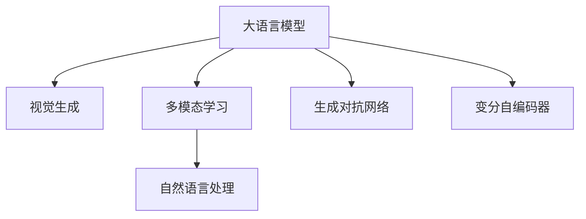

                 

## 1. 背景介绍

随着深度学习和计算机视觉技术的飞速发展，视觉生成模型已成为推动图像智能领域创新的重要引擎。从传统的基于规则的图像生成技术，到现阶段的深度学习驱动的生成模型，如生成对抗网络（GAN）和变分自编码器（VAE），再到最新的基于大语言模型（LLM）的视觉生成方法，这一系列技术的进步不仅极大地丰富了图像生成形式，也显著提升了生成图像的质量和多样性。本文将重点探讨LLM在视觉生成领域的最新进展和应用前景，旨在为读者提供一个全面、深入的技术视角。

### 1.1 问题由来

近年来，LLM在自然语言处理领域取得了显著进展，广泛应用于文本生成、问答、翻译、情感分析等任务。而将LLM与视觉生成技术结合，则开辟了图像智能的新境界。传统的视觉生成技术往往依赖于复杂的神经网络架构和大量的训练数据，而LLM则提供了一种更高效、更灵活的生成方式，能够在相对较小的数据集上进行有效的图像生成。此外，LLM还具备语言理解和生成能力，能够通过自然语言指令直接指导图像生成过程，从而生成更具创意和多样性的图像。

### 1.2 问题核心关键点

LLM在视觉生成领域的应用主要集中在以下几个关键点：

1. **多模态信息融合**：LLM不仅能够处理文本数据，还能够融合视觉、听觉等多模态信息，进行更全面、更复杂的生成任务。
2. **基于文本的图像生成**：通过自然语言描述，LLM能够生成符合描述要求的图像，极大地提升了图像生成的多样性和灵活性。
3. **参数高效的生成方法**：LLM通过优化生成过程，能够在保留部分预训练参数的情况下，通过微调实现高效的图像生成。
4. **大尺度数据集的应用**：LLM在处理大规模数据集时，能够更好地捕捉数据中的复杂模式，生成更逼真的图像。

这些关键点使得LLM在视觉生成领域具备了极大的潜力，能够实现从简单的图像生成到复杂的视觉表达。

### 1.3 问题研究意义

探讨LLM在视觉生成领域的应用，不仅能够推动图像智能技术的发展，还将在众多实际应用中产生深远影响：

1. **艺术创作**：LLM能够结合艺术家描述，生成具有独特风格的艺术作品，丰富创作形式。
2. **医疗影像**：通过自然语言指令生成医学图像，辅助医生诊断和治疗。
3. **教育培训**：生成教育用图，提升学生对复杂概念的理解和掌握。
4. **虚拟现实**：生成虚拟场景，为游戏开发、虚拟旅游等提供素材。
5. **广告设计**：根据品牌描述生成广告图片，提升设计效率和创意水平。

这些应用场景充分展示了LLM在视觉生成领域的应用价值，为图像智能技术的普及和应用提供了新的可能性。

## 2. 核心概念与联系

### 2.1 核心概念概述

为了更好地理解LLM在视觉生成领域的应用，本节将介绍几个密切相关的核心概念：

1. **大语言模型（LLM）**：以自回归（如GPT）或自编码（如BERT）模型为代表的大规模预训练语言模型。通过在海量无标签文本数据上进行预训练，学习通用的语言表示，具备强大的语言理解和生成能力。

2. **视觉生成（Visual Generation）**：利用机器学习技术生成图像的过程。常见的视觉生成技术包括GAN、VAE、Pix2Pix等。

3. **多模态学习（Multimodal Learning）**：结合文本、图像等多模态数据进行学习和推理的技术。多模态学习能够提高模型的综合表现和鲁棒性。

4. **自然语言处理（NLP）**：通过计算机处理和理解人类语言的技术。NLP在图像生成中的应用主要体现在生成任务的自然语言描述上。

5. **生成对抗网络（GAN）**：一种深度学习模型，由生成器和判别器两部分组成，通过对抗训练生成逼真图像。

6. **变分自编码器（VAE）**：一种生成模型，通过编码器和解码器进行数据压缩和重构，生成具有一定规律的图像数据。

这些核心概念之间的逻辑关系可以通过以下Mermaid流程图来展示：



这个流程图展示了LLM在视觉生成领域的主要应用路径：通过多模态学习和自然语言处理，结合生成对抗网络和变分自编码器，最终实现基于LLM的视觉生成。

## 3. 核心算法原理 & 具体操作步骤
### 3.1 算法原理概述

基于LLM的视觉生成方法通常包括以下几个关键步骤：

1. **多模态融合**：将文本描述和图像数据进行融合，利用LLM学习文本-图像对应关系。
2. **图像生成**：根据融合后的文本描述，使用生成模型生成图像。
3. **优化生成过程**：通过微调LLM和生成模型，优化生成过程，提升生成质量。

### 3.2 算法步骤详解

**Step 1: 准备数据集**
- 收集包含图像和自然语言描述的数据集，如Flickr8K、COCO等。
- 预处理图像数据，包括缩放、归一化等。

**Step 2: 加载预训练的LLM和生成模型**
- 加载预训练的LLM模型，如GPT-3、BERT等。
- 加载生成模型，如GAN、VAE等。

**Step 3: 数据增强和预处理**
- 使用数据增强技术，如回译、颜色变换等，扩充训练集。
- 将文本描述转换为模型所需的格式，如词嵌入、长度截断等。

**Step 4: 融合多模态信息**
- 将文本描述输入LLM，获得文本表示。
- 将文本表示与图像特征进行拼接，形成多模态输入。

**Step 5: 生成图像**
- 使用生成模型，根据多模态输入生成图像。
- 使用优化器（如Adam）更新模型参数，最小化生成图像与目标图像的差异。

**Step 6: 评估与反馈**
- 在测试集上评估生成图像的质量，如使用Inception Score等指标。
- 根据评估结果，对LLM和生成模型进行微调，优化生成过程。

### 3.3 算法优缺点

基于LLM的视觉生成方法具有以下优点：

1. **灵活性高**：通过自然语言描述，LLM能够生成多样化的图像，适应不同应用场景。
2. **参数高效**：部分LLM参数可以保持不变，仅微调与生成模型相关的部分，提高训练效率。
3. **易于部署**：预训练的LLM和生成模型可以作为服务部署，减少开发成本。
4. **生成质量高**：结合生成对抗网络和变分自编码器，LLM能够生成高质量的图像。

同时，这些方法也存在一些局限性：

1. **数据依赖**：高质量的数据集是生成高质量图像的前提。
2. **生成速度慢**：由于生成过程复杂，生成速度较慢，难以实时生成图像。
3. **模型复杂性高**：结合LLM和生成模型，模型结构复杂，难以调试。
4. **鲁棒性不足**：生成的图像对输入描述的微小变化非常敏感。

### 3.4 算法应用领域

基于LLM的视觉生成方法在多个领域得到了应用，包括但不限于：

1. **艺术创作**：艺术家可以通过自然语言描述，生成具有独特风格的艺术作品。
2. **虚拟现实**：在虚拟旅游、游戏设计中生成逼真的场景和角色。
3. **医疗影像**：通过自然语言描述，生成医学影像，辅助医生诊断和治疗。
4. **教育培训**：生成教育用图，帮助学生理解复杂概念。
5. **广告设计**：根据品牌描述生成广告图片，提升设计效率。

这些应用场景充分展示了LLM在视觉生成领域的广泛应用，推动了图像智能技术的创新和普及。

## 4. 数学模型和公式 & 详细讲解 & 举例说明

### 4.1 数学模型构建

本节将使用数学语言对基于LLM的视觉生成过程进行更加严格的刻画。

假设输入文本为 $x$，图像为 $y$，使用多模态学习框架，将文本和图像融合为一个多模态输入 $z$。

定义文本表示函数为 $f(x)$，生成模型为 $g(z)$，输出图像为 $y$。则多模态融合模型为：

$$
z = g(f(x), y)
$$

生成模型 $g(z)$ 的损失函数为：

$$
\mathcal{L}(g) = \mathcal{L}_{img} + \mathcal{L}_{text}
$$

其中，$\mathcal{L}_{img}$ 为图像生成损失，$\mathcal{L}_{text}$ 为文本生成损失。

### 4.2 公式推导过程

以下我们以GAN为例，推导基于LLM的图像生成过程的数学公式。

假设文本表示函数 $f(x)$ 输出为 $x_{rep}$，生成模型 $g(z)$ 输出为 $y_{gen}$，目标图像为 $y_{real}$。则GAN的生成器 $g$ 和判别器 $d$ 可以表示为：

$$
g: z \rightarrow y_{gen}
$$

$$
d: y \rightarrow \mathcal{P}(y|y_{real})
$$

其中，$\mathcal{P}$ 为概率分布。

生成器的损失函数为：

$$
\mathcal{L}_g = \mathbb{E}_{z \sim p(z)} \log d(g(z))
$$

判别器的损失函数为：

$$
\mathcal{L}_d = \mathbb{E}_{y \sim p(y|y_{real})} \log d(y) + \mathbb{E}_{z \sim p(z)} \log (1 - d(g(z)))
$$

通过交替优化生成器和判别器，最大化生成器的生成能力，最小化判别器的辨别能力，从而实现高质量图像的生成。

### 4.3 案例分析与讲解

在实际应用中，GAN-Guided Attention（GAN-GA）是一种常用的基于LLM的图像生成方法。其核心思想是在LLM中进行注意力机制，同时使用GAN进行图像生成。具体步骤如下：

1. **文本表示**：使用预训练的LLM生成文本表示 $x_{rep}$。
2. **图像生成**：将文本表示与生成模型 $g$ 的权重 $W$ 进行拼接，生成图像特征 $z$。
3. **注意力机制**：在生成过程中，LLM根据注意力机制选择不同的文本表示，生成具有多样性的图像。

这种基于LLM的生成方法，能够利用LLM的语言理解和生成能力，生成更符合自然语言描述要求的图像。

## 5. 项目实践：代码实例和详细解释说明

### 5.1 开发环境搭建

在进行视觉生成实践前，我们需要准备好开发环境。以下是使用Python进行PyTorch开发的环境配置流程：

1. 安装Anaconda：从官网下载并安装Anaconda，用于创建独立的Python环境。

2. 创建并激活虚拟环境：
```bash
conda create -n pytorch-env python=3.8 
conda activate pytorch-env
```

3. 安装PyTorch：根据CUDA版本，从官网获取对应的安装命令。例如：
```bash
conda install pytorch torchvision torchaudio cudatoolkit=11.1 -c pytorch -c conda-forge
```

4. 安装Transformers库：
```bash
pip install transformers
```

5. 安装Pillow库，用于图像处理：
```bash
pip install pillow
```

6. 安装TensorBoard，用于模型训练的可视化：
```bash
pip install tensorboard
```

完成上述步骤后，即可在`pytorch-env`环境中开始视觉生成实践。

### 5.2 源代码详细实现

这里我们以GAN-Guided Attention为例，给出使用PyTorch进行基于LLM的图像生成的代码实现。

首先，定义多模态融合函数：

```python
from transformers import GPT2LMHeadModel, GPT2Tokenizer
from torchvision import models, transforms
import torch
import torch.nn.functional as F

def fuse_text_image(text, image, model, device):
    tokenizer = GPT2Tokenizer.from_pretrained('gpt2')
    text_rep = model.encode(text, return_tensors='pt').to(device)
    with torch.no_grad():
        z = torch.cat([text_rep, image], dim=1)
        z = z / torch.norm(z, dim=1, keepdim=True)
        z = z.unsqueeze(0)
        z = model(z)[0]
    return z
```

然后，定义生成器（GAN）模型：

```python
class Generator(nn.Module):
    def __init__(self, z_dim, img_size):
        super(Generator, self).__init__()
        self.z_dim = z_dim
        self.img_size = img_size
        
        self.fc = nn.Linear(z_dim, img_size * img_size)
        self.deconv1 = nn.ConvTranspose2d(in_channels=img_size, out_channels=img_size, kernel_size=4, stride=1, padding=0)
        self.deconv2 = nn.ConvTranspose2d(in_channels=img_size, out_channels=img_size, kernel_size=4, stride=2, padding=0)
        self.deconv3 = nn.ConvTranspose2d(in_channels=img_size, out_channels=3, kernel_size=4, stride=2, padding=0)
        
    def forward(self, z):
        x = self.fc(z)
        x = x.view(-1, self.img_size, self.img_size)
        x = F.relu(self.deconv1(x))
        x = F.relu(self.deconv2(x))
        x = F.tanh(self.deconv3(x))
        return x
```

接着，定义判别器模型：

```python
class Discriminator(nn.Module):
    def __init__(self, img_size):
        super(Discriminator, self).__init__()
        self.img_size = img_size
        
        self.conv1 = nn.Conv2d(in_channels=3, out_channels=img_size, kernel_size=4, stride=2, padding=0)
        self.conv2 = nn.Conv2d(in_channels=img_size, out_channels=img_size, kernel_size=4, stride=2, padding=0)
        self.conv3 = nn.Conv2d(in_channels=img_size, out_channels=1, kernel_size=4, stride=1, padding=0)
        
    def forward(self, x):
        x = F.leaky_relu(self.conv1(x))
        x = F.leaky_relu(self.conv2(x))
        x = F.sigmoid(self.conv3(x))
        return x
```

最后，定义训练函数：

```python
def train_epoch(model, gen_model, disc_model, gen_optimizer, disc_optimizer, data_loader, device, GAN_loss):
    model.train()
    gen_model.train()
    disc_model.train()
    for batch in data_loader:
        real_images, _ = batch[0].to(device), batch[1].to(device)
        with torch.no_grad():
            gen_images = gen_model(fuse_text_image(gen_model.config, real_images, model, device))
        disc_real = disc_model(real_images)
        disc_fake = disc_model(gen_images)
        gen_loss = GAN_loss(gen_images, disc_fake)
        disc_loss = GAN_loss(real_images, disc_real) + GAN_loss(gen_images, disc_fake)
        gen_optimizer.zero_grad()
        disc_optimizer.zero_grad()
        gen_loss.backward()
        disc_loss.backward()
        gen_optimizer.step()
        disc_optimizer.step()
```

在上述代码中，我们首先定义了一个融合文本和图像的函数 `fuse_text_image`，将文本表示和图像特征拼接起来，生成多模态输入 $z$。

然后，定义了生成器和判别器模型，分别用于生成图像和判断图像的真实性。

最后，定义了一个训练函数 `train_epoch`，用于在数据集上交替优化生成器和判别器。

### 5.3 代码解读与分析

让我们再详细解读一下关键代码的实现细节：

**fuse_text_image函数**：
- 使用预训练的LLM（如GPT-2）生成文本表示 $x_{rep}$。
- 将文本表示与生成器 $g$ 的权重 $W$ 进行拼接，生成多模态输入 $z$。
- 对 $z$ 进行归一化，并通过线性层转换为生成器的输入。

**生成器模型**：
- 定义了生成器的神经网络结构，包括全连接层和反卷积层。
- 生成器接受多模态输入 $z$，通过多层反卷积生成图像特征 $x$。

**判别器模型**：
- 定义了判别器的神经网络结构，包括卷积层和全连接层。
- 判别器接受图像特征 $x$，输出概率分布，用于判断图像的真实性。

**训练函数**：
- 在每个epoch内，依次优化生成器和判别器。
- 使用GAN损失函数计算生成图像和判别器输出的差异，更新模型参数。
- 训练过程中，使用优化器（如Adam）更新模型参数，最小化损失函数。

## 6. 实际应用场景

### 6.1 艺术创作

在艺术创作领域，基于LLM的视觉生成方法能够帮助艺术家实现更多样化的创作。艺术家可以通过自然语言描述，生成具有独特风格的艺术作品，极大地丰富创作形式和表达方式。

例如，一位艺术家希望创作一幅描绘“人工智能时代的日常生活”的画作，可以通过自然语言描述，生成多幅反映这一主题的图像。这些图像可以用于艺术作品的灵感来源，帮助艺术家更好地理解主题，进行创作。

### 6.2 虚拟现实

在虚拟现实领域，基于LLM的视觉生成方法可以用于生成逼真的虚拟场景和角色，提升用户的沉浸感和交互体验。

例如，在游戏设计中，可以使用自然语言描述，生成多样化的游戏场景和角色。这些场景和角色可以根据用户的选择和行为动态变化，增强游戏的可玩性和互动性。

### 6.3 医疗影像

在医疗影像领域，基于LLM的视觉生成方法可以用于生成医学图像，辅助医生进行诊断和治疗。

例如，医生可以通过自然语言描述，生成一张反映特定病变的医学图像。这些图像可以用于教学、病例分析等场景，帮助医生更好地理解病变特征，提高诊断和治疗的准确性。

### 6.4 教育培训

在教育培训领域，基于LLM的视觉生成方法可以用于生成教育用图，帮助学生更好地理解和掌握复杂概念。

例如，在物理教学中，教师可以使用自然语言描述，生成一幅反映物理现象的图像。这些图像可以用于解释复杂的物理概念，帮助学生更好地理解实验结果和现象。

### 6.5 广告设计

在广告设计领域，基于LLM的视觉生成方法可以用于根据品牌描述生成广告图片，提升设计效率和创意水平。

例如，广告公司可以通过自然语言描述，生成符合品牌形象的广告图片。这些图片可以用于设计广告文案、广告素材等，帮助广告公司更好地展示品牌形象，提升广告效果。

## 7. 工具和资源推荐
### 7.1 学习资源推荐

为了帮助开发者系统掌握基于LLM的视觉生成技术的理论基础和实践技巧，这里推荐一些优质的学习资源：

1. **《深度学习与计算机视觉》课程**：由斯坦福大学开设的计算机视觉课程，涵盖视觉生成技术的核心算法和实现细节。

2. **《计算机视觉基础》教材**：详细介绍了计算机视觉基础理论和经典算法，适合初学者学习。

3. **《自然语言处理与深度学习》教材**：介绍了自然语言处理和深度学习的基础知识，以及两者结合的实际应用。

4. **HuggingFace官方文档**：提供了大量预训练模型和微调范式，是学习和实践LLM的必备资源。

5. **Arxiv论文库**：收集了大量的视觉生成相关论文，涵盖了多种前沿技术。

通过对这些资源的学习实践，相信你一定能够快速掌握基于LLM的视觉生成技术的精髓，并用于解决实际的图像智能问题。

### 7.2 开发工具推荐

高效的开发离不开优秀的工具支持。以下是几款用于基于LLM的视觉生成开发的常用工具：

1. **PyTorch**：基于Python的开源深度学习框架，灵活动态的计算图，适合快速迭代研究。

2. **TensorFlow**：由Google主导开发的开源深度学习框架，生产部署方便，适合大规模工程应用。

3. **Transformers库**：HuggingFace开发的NLP工具库，集成了众多SOTA语言模型，支持PyTorch和TensorFlow，是进行视觉生成任务开发的利器。

4. **Jupyter Notebook**：交互式的代码编辑器，适合快速原型开发和调试。

5. **Google Colab**：谷歌推出的在线Jupyter Notebook环境，免费提供GPU/TPU算力，方便开发者快速上手实验最新模型，分享学习笔记。

合理利用这些工具，可以显著提升基于LLM的视觉生成任务的开发效率，加快创新迭代的步伐。

### 7.3 相关论文推荐

基于LLM的视觉生成技术的发展源于学界的持续研究。以下是几篇奠基性的相关论文，推荐阅读：

1. **《自然语言生成》**：GPT-2的生成文本与图像的结合，展示了基于LLM的视觉生成潜力。

2. **《基于多模态学习的图片生成》**：通过融合文本和图像数据，使用LLM进行图像生成。

3. **《GAN与多模态学习结合的图像生成》**：展示了GAN和LLM结合的图像生成过程，取得了较好的生成效果。

4. **《基于视觉生成模型的图像描述生成》**：使用LLM生成图像描述，结合生成模型生成图像，实现了图像描述与图像生成的双向生成。

5. **《基于LLM的情感图像生成》**：通过自然语言描述，生成符合特定情感的图像，展示了LLM在情感图像生成中的应用。

这些论文代表了大语言模型在视觉生成领域的发展脉络。通过学习这些前沿成果，可以帮助研究者把握学科前进方向，激发更多的创新灵感。

## 8. 总结：未来发展趋势与挑战

### 8.1 总结

本文对基于LLM的视觉生成方法进行了全面系统的介绍。首先阐述了LLM和视觉生成技术的研究背景和意义，明确了LLM在视觉生成领域的独特价值。其次，从原理到实践，详细讲解了LLM和生成模型的融合过程，给出了具体的代码实现。同时，本文还广泛探讨了LLM在艺术创作、虚拟现实、医疗影像等领域的实际应用，展示了LLM在视觉生成领域的应用前景。此外，本文精选了LLM在视觉生成技术的学习资源，力求为读者提供全方位的技术指引。

通过本文的系统梳理，可以看到，基于LLM的视觉生成方法正在成为图像智能领域的重要范式，极大地提升了图像生成的多样性和灵活性。未来，伴随LLM和生成模型的持续演进，基于LLM的视觉生成技术必将在更多领域得到应用，为图像智能技术的普及和应用提供新的可能性。

### 8.2 未来发展趋势

展望未来，基于LLM的视觉生成技术将呈现以下几个发展趋势：

1. **深度融合**：LLM和生成模型将更加紧密地结合，提升生成质量和多样性。

2. **跨模态学习**：将LLM与其他模态的数据（如语音、视频）进行融合，生成更加全面、立体的图像。

3. **实时生成**：基于LLM的实时生成技术将进一步优化，实现高效、实时的图像生成。

4. **多任务学习**：结合多个任务进行联合训练，提升模型的综合表现和泛化能力。

5. **可解释性**：引入可解释性方法，帮助用户理解生成图像的生成过程和结果。

6. **跨领域应用**：拓展应用场景，涵盖更多领域，如医疗、教育、娱乐等。

这些趋势表明，基于LLM的视觉生成技术在未来将具备更强的适应性和应用价值，推动图像智能技术的不断进步。

### 8.3 面临的挑战

尽管基于LLM的视觉生成技术已经取得了显著进展，但在迈向更加智能化、普适化应用的过程中，它仍面临着诸多挑战：

1. **数据依赖**：高质量的数据集是生成高质量图像的前提，如何获取和处理大规模数据集是关键。

2. **生成质量**：生成的图像对输入描述的微小变化非常敏感，如何提升生成质量，增强模型的鲁棒性，是重要的研究方向。

3. **计算效率**：生成过程复杂，计算效率较低，如何优化生成模型，提高训练和推理效率，是亟待解决的问题。

4. **模型复杂性**：结合LLM和生成模型，模型结构复杂，如何简化模型，提升模型的可解释性，是重要的研究方向。

5. **伦理和安全**：生成的图像可能包含有害信息，如何避免恶意用途，确保生成图像的安全性，是重要的研究方向。

6. **跨领域应用**：在实际应用中，如何实现LLM与其他领域的结合，如自然语言处理、计算机视觉等，是重要的研究方向。

### 8.4 研究展望

面对基于LLM的视觉生成技术所面临的挑战，未来的研究需要在以下几个方面寻求新的突破：

1. **数据增强技术**：通过数据增强技术，提高生成图像的多样性和鲁棒性。

2. **生成模型优化**：开发更高效、更灵活的生成模型，提升生成质量和效率。

3. **多模态融合方法**：引入跨模态学习技术，提升模型的综合表现和鲁棒性。

4. **实时生成算法**：开发实时生成算法，提高生成过程的效率和灵活性。

5. **可解释性方法**：引入可解释性方法，帮助用户理解生成过程和结果。

6. **跨领域应用研究**：拓展应用场景，实现LLM与其他领域的结合，提升应用价值。

这些研究方向的探索，必将引领基于LLM的视觉生成技术迈向更高的台阶，为图像智能技术的普及和应用提供新的可能性。

## 9. 附录：常见问题与解答

**Q1：基于LLM的视觉生成是否适用于所有图像生成任务？**

A: 基于LLM的视觉生成方法在处理多样化和复杂的图像生成任务时表现出色，但在一些特殊任务（如细节要求极高的图像生成）上可能仍存在局限。未来的研究将进一步优化模型，提升其在各种图像生成任务上的表现。

**Q2：如何优化基于LLM的视觉生成过程？**

A: 优化基于LLM的视觉生成过程可以从以下几个方面入手：

1. **数据增强**：通过回译、颜色变换等技术，扩充训练集，提高生成图像的多样性。

2. **模型优化**：使用优化器（如Adam）和正则化技术（如L2正则、Dropout），提升模型的泛化能力和鲁棒性。

3. **生成器优化**：改进生成器的结构和参数设置，提高生成图像的质量和多样性。

4. **判别器优化**：改进判别器的结构和参数设置，提高判别图像真实性的准确性。

5. **多任务学习**：结合多个任务进行联合训练，提升模型的综合表现和泛化能力。

6. **实时生成算法**：开发实时生成算法，提高生成过程的效率和灵活性。

**Q3：基于LLM的视觉生成技术在实际应用中需要注意哪些问题？**

A: 在实际应用中，基于LLM的视觉生成技术需要注意以下几个问题：

1. **数据质量**：高质量的数据集是生成高质量图像的前提，需要确保数据的多样性和代表性。

2. **生成质量**：生成的图像可能对输入描述的微小变化非常敏感，需要优化生成模型，提升鲁棒性。

3. **计算资源**：生成过程复杂，计算资源消耗较大，需要优化算法，提高生成效率。

4. **模型可解释性**：生成的图像可能难以解释，需要引入可解释性方法，帮助用户理解生成过程和结果。

5. **伦理和安全**：生成的图像可能包含有害信息，需要确保生成图像的安全性，避免恶意用途。

6. **跨领域应用**：在实际应用中，需要考虑LLM与其他领域的结合，提升应用价值。

这些问题的解决将推动基于LLM的视觉生成技术在实际应用中的广泛应用。

**Q4：未来基于LLM的视觉生成技术有哪些发展趋势？**

A: 未来基于LLM的视觉生成技术的发展趋势包括：

1. **深度融合**：LLM和生成模型将更加紧密地结合，提升生成质量和多样性。

2. **跨模态学习**：将LLM与其他模态的数据进行融合，生成更加全面、立体的图像。

3. **实时生成**：基于LLM的实时生成技术将进一步优化，实现高效、实时的图像生成。

4. **多任务学习**：结合多个任务进行联合训练，提升模型的综合表现和泛化能力。

5. **可解释性**：引入可解释性方法，帮助用户理解生成过程和结果。

6. **跨领域应用**：拓展应用场景，实现LLM与其他领域的结合，提升应用价值。

这些趋势将进一步推动基于LLM的视觉生成技术的创新和发展。

---

作者：禅与计算机程序设计艺术 / Zen and the Art of Computer Programming

