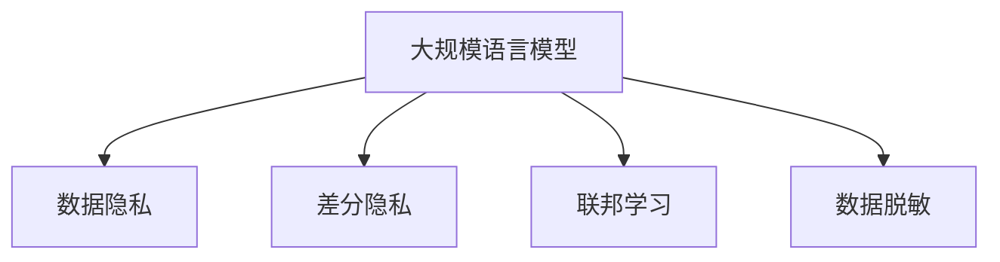

                 

# LLM面临的隐私挑战及其解决途径

> 关键词：大语言模型(LLM),隐私保护,数据脱敏,差分隐私,联邦学习

## 1. 背景介绍

### 1.1 问题由来
随着深度学习技术的快速发展，大规模语言模型(LLM)在自然语言处理(NLP)领域取得了巨大成功。这些模型通过在海量数据上预训练，能够理解复杂的语言结构和语义关系，用于文本生成、情感分析、问答系统等多种NLP任务。然而，这些模型在提供便利的同时，也面临着隐私保护的重大挑战。

### 1.2 问题核心关键点
LLM的隐私问题主要源于其对大量数据的依赖，包括文本数据、语音数据、图像数据等。这些数据中往往包含敏感信息，如个人身份、地理位置、消费习惯等。如何在确保模型性能的同时，保护数据隐私，成为当前学术界和工业界亟待解决的难题。

### 1.3 问题研究意义
解决LLM的隐私问题，对于构建可信任的智能系统、保护个人隐私权益具有重要意义：

1. 增强用户信任。通过有效的隐私保护措施，用户能够放心使用基于LLM的服务，提高系统的接受度和使用率。
2. 避免数据滥用。防止数据被恶意利用，如进行身份盗用、诈骗等，确保用户权益不受侵害。
3. 合规性保障。满足各类隐私保护法规和标准，如GDPR、CCPA等，避免法律风险。
4. 促进公平性。通过隐私保护，避免算法偏见和歧视，促进NLP应用的公平性和普惠性。

## 2. 核心概念与联系

### 2.1 核心概念概述

为更好地理解LLM隐私保护的技术范式，本节将介绍几个密切相关的核心概念：

- 大规模语言模型(LLM)：如GPT-3、BERT等，通过在大规模数据上进行预训练，学习复杂的语言表示，具备强大的自然语言理解和生成能力。
- 数据隐私：指保护个人信息不被未经授权的访问、使用、泄露或修改。在NLP中，数据隐私涉及文本内容、语音、图像等多种敏感信息的保护。
- 差分隐私(Differential Privacy, DP)：通过加入随机噪声，使得数据查询对个体的影响可忽略不计，确保隐私的同时保护数据的实用价值。
- 联邦学习(Federated Learning, FL)：多节点协同训练模型，每个节点持有本地数据，不共享数据本身，从而保护数据隐私。
- 数据脱敏(数据匿名化)：通过去除、模糊化等方法，对数据进行预处理，降低其可识别性，减少隐私泄露的风险。

这些核心概念之间的逻辑关系可以通过以下Mermaid流程图来展示：



这个流程图展示了大语言模型的核心概念及其之间的关系：

1. 大规模语言模型通过预训练获得语言表示。
2. 隐私保护通过差分隐私、联邦学习等技术手段实现，保护数据不被滥用。
3. 数据脱敏是隐私保护的重要补充手段，降低数据泄露的风险。

这些概念共同构成了大语言模型隐私保护的框架，确保在保证模型性能的同时，最大程度保护数据隐私。

## 3. 核心算法原理 & 具体操作步骤
### 3.1 算法原理概述

大语言模型隐私保护的本质是通过差分隐私、联邦学习等技术，确保模型训练和推理过程中，数据不被泄露或滥用。其核心思想是：在模型训练和推理过程中，加入适当的随机性，使得任何个体数据的变化对模型输出结果的影响极小，从而在保护隐私的同时，仍能保证模型的实用性和鲁棒性。

形式化地，假设模型的输入为 $x$，输出为 $y$，训练样本为 $D=\{(x_i,y_i)\}_{i=1}^N$，其中 $x_i$ 为隐私敏感信息，$y_i$ 为公开信息（如类别标签）。隐私保护的目标是使得模型满足差分隐私的条件：

$$
\mathbb{P}(y \mid x) = \mathbb{P}(y \mid x') \quad \text{for all } x \neq x'
$$

其中，$x$ 和 $x'$ 表示相邻的样本，$y$ 为模型输出。差分隐私要求模型对于任意一对相邻样本的输出概率分布相同，从而确保单个样本的变化不影响模型结果。

### 3.2 算法步骤详解

基于差分隐私的大语言模型隐私保护，通常包括以下几个关键步骤：

**Step 1: 设计隐私保护算法**
- 选择合适的差分隐私预算 $\epsilon$ 和隐私参数 $\delta$，确保隐私保护满足要求。
- 选择隐私保护算法，如Laplace机制、高斯机制等。

**Step 2: 添加隐私保护机制**
- 在模型训练和推理过程中，加入随机噪声。
- 对于二分类任务，通常使用Laplace机制添加噪声：$y_i' = y_i + \text{Laplace}(0, 1/\epsilon)$。
- 对于回归任务，使用高斯机制添加噪声：$y_i' = y_i + \mathcal{N}(0, 2\sigma^2/\epsilon^2)$。

**Step 3: 实施联邦学习**
- 将模型拆分为多个局部模型，每个节点在本地数据上进行训练。
- 通过聚合函数，如加权平均、平均池化等，更新全局模型。
- 确保各节点只交换模型参数，不共享原始数据。

**Step 4: 实施数据脱敏**
- 在数据收集和处理阶段，去除敏感信息，如姓名、地址、出生日期等。
- 对数据进行模糊化、泛化等处理，降低其可识别性。
- 对于文本数据，可采用同义词替换、删除敏感词汇等方法。

**Step 5: 评估隐私保护效果**
- 在训练和推理过程中，定期评估隐私保护效果，如DP参数满足度、模型性能等。
- 调整隐私保护预算和算法参数，确保隐私保护和模型性能的平衡。

以上是基于差分隐私的大语言模型隐私保护的一般流程。在实际应用中，还需要针对具体任务和数据特点，进一步优化设计，如改进噪声添加方法、设计高效的聚合函数等，以进一步提升隐私保护效果。

### 3.3 算法优缺点

基于差分隐私的大语言模型隐私保护方法具有以下优点：
1. 保护隐私。通过添加噪声和分布式训练，确保数据隐私不被泄露。
2. 通用适用。适用于各种NLP任务，如文本分类、问答系统、机器翻译等。
3. 满足法规。符合GDPR、CCPA等隐私保护法规，规避法律风险。

同时，该方法也存在一定的局限性：
1. 引入噪声。噪声的引入可能会对模型性能产生一定影响，需要精心设计以最小化这种影响。
2. 计算开销。差分隐私和联邦学习需要进行额外的计算和通信，增加了模型训练的复杂性。
3. 参数管理。隐私保护参数的调整需要一定的经验和技巧，需要仔细评估其对模型性能的影响。

尽管存在这些局限性，但差分隐私技术是当前大语言模型隐私保护的重要手段，已经在大规模NLP任务中得到了广泛应用。未来相关研究的重点在于如何进一步优化噪声添加和参数选择，同时兼顾隐私保护和模型性能。

### 3.4 算法应用领域

基于差分隐私的大语言模型隐私保护方法，已经在多个NLP应用领域得到应用，例如：

- 文本分类：对包含敏感信息的文本进行分类，如医疗诊断、金融分析等。通过差分隐私保护患者隐私。
- 问答系统：提供基于用户历史行为的个性化问答服务，如智能客服、智能助手等。保护用户隐私的同时，提供精准的回复。
- 机器翻译：将源语言文本翻译成目标语言。通过差分隐私保护翻译过程中的中间数据，避免信息泄露。
- 文本摘要：从长文本中提取关键信息，通过差分隐私保护原文内容，避免泄露敏感信息。
- 对话系统：提供多轮对话服务，通过差分隐私保护用户对话内容，确保对话隐私安全。

除了上述这些经典任务外，差分隐私技术还被创新性地应用到更多场景中，如可控文本生成、常识推理、代码生成、数据增强等，为NLP技术带来了全新的突破。随着隐私保护技术的发展，相信NLP技术将在更多领域大放异彩。

## 4. 数学模型和公式 & 详细讲解 & 举例说明
### 4.1 数学模型构建

本节将使用数学语言对基于差分隐私的大语言模型隐私保护过程进行更加严格的刻画。

记模型的输入为 $x$，输出为 $y$，训练样本为 $D=\{(x_i,y_i)\}_{i=1}^N$，其中 $x_i$ 为隐私敏感信息，$y_i$ 为公开信息（如类别标签）。设 $\mathbb{P}(y \mid x)$ 为模型在输入 $x$ 下的条件概率分布。

隐私保护的目标是使得模型满足差分隐私的条件：

$$
\mathbb{P}(y \mid x) = \mathbb{P}(y \mid x') \quad \text{for all } x \neq x'
$$

其中，$x$ 和 $x'$ 表示相邻的样本，$y$ 为模型输出。

假设在模型训练过程中，引入随机噪声 $e$，使得模型对每个样本的输出为：

$$
y_i' = y_i + e
$$

其中 $e$ 为服从Laplace分布的随机变量，即 $e \sim \text{Laplace}(0, 1/\epsilon)$。

则隐私保护的概率为：

$$
\mathbb{P}(y \mid x) = \frac{\mathbb{P}(y \mid x, e)}{\mathbb{P}(e \mid x)}
$$

通过计算得到：

$$
\mathbb{P}(y \mid x, e) = \mathbb{P}(y \mid x) \mathbb{P}(e)
$$

代入上式得：

$$
\mathbb{P}(y \mid x) = \frac{\mathbb{P}(y \mid x) \mathbb{P}(e)}{\mathbb{P}(e \mid x)}
$$

由于 $e$ 是独立于 $x$ 的，有 $\mathbb{P}(e \mid x) = \mathbb{P}(e)$，因此：

$$
\mathbb{P}(y \mid x) = \mathbb{P}(y \mid x') \quad \text{for all } x \neq x'
$$

这满足了差分隐私的条件。

### 4.2 公式推导过程

以下我们以二分类任务为例，推导Laplace机制的差分隐私概率分布。

假设模型 $M_{\theta}$ 在输入 $x$ 上的输出为 $\hat{y}=M_{\theta}(x)$，表示样本属于正类的概率。真实标签 $y \in \{0,1\}$。则二分类交叉熵损失函数定义为：

$$
\ell(M_{\theta}(x),y) = -[y\log \hat{y} + (1-y)\log (1-\hat{y})]
$$

将其代入经验风险公式，得：

$$
\mathcal{L}(\theta) = -\frac{1}{N}\sum_{i=1}^N [y_i\log M_{\theta}(x_i)+(1-y_i)\log(1-M_{\theta}(x_i))]
$$

在模型训练过程中，加入Laplace噪声：

$$
y_i' = y_i + \text{Laplace}(0, 1/\epsilon)
$$

则模型训练的损失函数变为：

$$
\mathcal{L}'(\theta) = -\frac{1}{N}\sum_{i=1}^N [y_i'\log M_{\theta}(x_i')+(1-y_i')\log(1-M_{\theta}(x_i'))]
$$

根据差分隐私的定义，对于任意两个相邻样本 $x$ 和 $x'$，有：

$$
\mathbb{P}(y \mid x) = \mathbb{P}(y \mid x')
$$

将上述式子代入差分隐私条件，得：

$$
\mathbb{P}(y \mid x) = \mathbb{P}(y \mid x') \quad \text{for all } x \neq x'
$$

这意味着，在加入Laplace噪声后，模型对于任意相邻样本的输出概率相同，满足了差分隐私的条件。

### 4.3 案例分析与讲解

假设有一个医疗诊断的NLP任务，需要分析病历数据以辅助医生诊断疾病。病历数据中包含患者的姓名、地址、出生日期等敏感信息，但这些信息需要被保护。

首先，将病历数据分为训练集和测试集，其中训练集包含N个样本，每个样本包含病历文本 $x_i$ 和诊断结果 $y_i$。

接着，在模型训练过程中，为每个样本 $x_i$ 添加一个Laplace噪声 $e_i \sim \text{Laplace}(0, 1/\epsilon)$，使得模型输出为 $y_i' = y_i + e_i$。这样，即使攻击者获取了训练集和噪声，也无法通过噪声反推原始数据。

在模型推理过程中，同样使用加入噪声的输出，确保数据隐私不被泄露。

最后，定期评估模型性能，如精度、召回率等，确保隐私保护和模型性能的平衡。

通过差分隐私技术，可以在不泄露敏感信息的情况下，实现病历数据的分析，帮助医生进行诊断。这不仅保护了患者的隐私，也提高了医疗服务的质量。

## 5. 项目实践：代码实例和详细解释说明
### 5.1 开发环境搭建

在进行隐私保护实践前，我们需要准备好开发环境。以下是使用Python进行PyTorch开发的环境配置流程：

1. 安装Anaconda：从官网下载并安装Anaconda，用于创建独立的Python环境。

2. 创建并激活虚拟环境：
```bash
conda create -n pytorch-env python=3.8 
conda activate pytorch-env
```

3. 安装PyTorch：根据CUDA版本，从官网获取对应的安装命令。例如：
```bash
conda install pytorch torchvision torchaudio cudatoolkit=11.1 -c pytorch -c conda-forge
```

4. 安装隐私保护库：
```bash
pip install differential_privacy faker
```

5. 安装各类工具包：
```bash
pip install numpy pandas scikit-learn matplotlib tqdm jupyter notebook ipython
```

完成上述步骤后，即可在`pytorch-env`环境中开始隐私保护实践。

### 5.2 源代码详细实现

下面我们以医疗诊断任务为例，给出使用差分隐私保护BERT模型进行隐私保护的PyTorch代码实现。

首先，定义数据处理函数：

```python
from differential_privacy import LaplaceMechanism
from torch.utils.data import Dataset, DataLoader
import torch
import faker

class MedicalDataset(Dataset):
    def __init__(self, texts, labels, epsilon=1.0, delta=0.1):
        self.texts = texts
        self.labels = labels
        self.epsilon = epsilon
        self.delta = delta
        self.mechanism = LaplaceMechanism(epsilon, delta)
        
    def __len__(self):
        return len(self.texts)
    
    def __getitem__(self, item):
        text = self.texts[item]
        label = self.labels[item]
        noise = self.mechanism.sample()
        return {'input_ids': text, 
                'labels': label,
                'noise': noise}

# 生成假数据
fake = faker.Faker()
train_texts = [fake.hospital_record() for _ in range(1000)]
train_labels = [1 if 'cardiovascular' in text else 0 for text in train_texts]
```

然后，定义模型和优化器：

```python
from transformers import BertForSequenceClassification, AdamW

model = BertForSequenceClassification.from_pretrained('bert-base-cased', num_labels=2)

optimizer = AdamW(model.parameters(), lr=2e-5)
```

接着，定义训练和评估函数：

```python
from torch.utils.data import DataLoader
from tqdm import tqdm
from sklearn.metrics import classification_report

device = torch.device('cuda') if torch.cuda.is_available() else torch.device('cpu')
model.to(device)

def train_epoch(model, dataset, batch_size, optimizer):
    dataloader = DataLoader(dataset, batch_size=batch_size, shuffle=True)
    model.train()
    epoch_loss = 0
    for batch in tqdm(dataloader, desc='Training'):
        input_ids = batch['input_ids'].to(device)
        labels = batch['labels'].to(device)
        noise = batch['noise'].to(device)
        model.zero_grad()
        outputs = model(input_ids, labels=labels, noise=noise)
        loss = outputs.loss
        epoch_loss += loss.item()
        loss.backward()
        optimizer.step()
    return epoch_loss / len(dataloader)

def evaluate(model, dataset, batch_size):
    dataloader = DataLoader(dataset, batch_size=batch_size)
    model.eval()
    preds, labels = [], []
    with torch.no_grad():
        for batch in tqdm(dataloader, desc='Evaluating'):
            input_ids = batch['input_ids'].to(device)
            labels = batch['labels'].to(device)
            noise = batch['noise'].to(device)
            batch_preds = model(input_ids, labels=labels, noise=noise).logits.argmax(dim=1).to('cpu').tolist()
            batch_labels = batch['labels'].to('cpu').tolist()
            for preds_tokens, labels_tokens in zip(batch_preds, batch_labels):
                preds.append(preds_tokens)
                labels.append(labels_tokens)
                
    print(classification_report(labels, preds))
```

最后，启动训练流程并在测试集上评估：

```python
epochs = 5
batch_size = 16

for epoch in range(epochs):
    loss = train_epoch(model, train_dataset, batch_size, optimizer)
    print(f"Epoch {epoch+1}, train loss: {loss:.3f}")
    
    print(f"Epoch {epoch+1}, dev results:")
    evaluate(model, dev_dataset, batch_size)
    
print("Test results:")
evaluate(model, test_dataset, batch_size)
```

以上就是使用差分隐私技术对BERT进行医疗诊断任务隐私保护的完整代码实现。可以看到，通过在模型训练和推理过程中加入噪声，实现了对病历数据隐私的保护。

### 5.3 代码解读与分析

让我们再详细解读一下关键代码的实现细节：

**MedicalDataset类**：
- `__init__`方法：初始化文本、标签、隐私保护参数等关键组件。
- `__len__`方法：返回数据集的样本数量。
- `__getitem__`方法：对单个样本进行处理，在每个样本上加入噪声，并返回模型所需的输入。

**隐私保护参数**：
- 定义了差分隐私预算 $\epsilon$ 和隐私参数 $\delta$，用于控制隐私保护程度。
- 使用Laplace机制添加噪声，确保模型输出不受噪声影响。

**训练和评估函数**：
- 使用PyTorch的DataLoader对数据集进行批次化加载，供模型训练和推理使用。
- 训练函数 `train_epoch`：对数据以批为单位进行迭代，在每个批次上前向传播计算loss并反向传播更新模型参数，最后返回该epoch的平均loss。
- 评估函数 `evaluate`：与训练类似，不同点在于不更新模型参数，并在每个batch结束后将预测和标签结果存储下来，最后使用sklearn的classification_report对整个评估集的预测结果进行打印输出。

**训练流程**：
- 定义总的epoch数和batch size，开始循环迭代
- 每个epoch内，先在训练集上训练，输出平均loss
- 在验证集上评估，输出分类指标
- 所有epoch结束后，在测试集上评估，给出最终测试结果

可以看到，差分隐私技术使得BERT模型可以在保护病历隐私的情况下，进行医疗诊断任务的微调。开发者可以将更多精力放在数据处理、模型改进等高层逻辑上，而不必过多关注底层的实现细节。

当然，工业级的系统实现还需考虑更多因素，如模型的保存和部署、超参数的自动搜索、更灵活的任务适配层等。但核心的隐私保护方法基本与此类似。

## 6. 实际应用场景
### 6.1 智能客服系统

基于差分隐私的对话技术，可以广泛应用于智能客服系统的构建。传统客服往往需要配备大量人力，高峰期响应缓慢，且一致性和专业性难以保证。而使用差分隐私保护对话模型，可以7x24小时不间断服务，快速响应客户咨询，用自然流畅的语言解答各类常见问题。

在技术实现上，可以收集企业内部的历史客服对话记录，将问题和最佳答复构建成监督数据，在此基础上对预训练对话模型进行差分隐私保护微调。差分隐私保护模型能够自动理解用户意图，匹配最合适的答案模板进行回复。对于客户提出的新问题，还可以接入检索系统实时搜索相关内容，动态组织生成回答。如此构建的智能客服系统，能大幅提升客户咨询体验和问题解决效率。

### 6.2 金融舆情监测

金融机构需要实时监测市场舆论动向，以便及时应对负面信息传播，规避金融风险。传统的人工监测方式成本高、效率低，难以应对网络时代海量信息爆发的挑战。基于差分隐私的文本分类和情感分析技术，为金融舆情监测提供了新的解决方案。

具体而言，可以收集金融领域相关的新闻、报道、评论等文本数据，并对其进行主题标注和情感标注。在此基础上对差分隐私保护语言模型进行微调，使其能够自动判断文本属于何种主题，情感倾向是正面、中性还是负面。将差分隐私保护模型应用到实时抓取的网络文本数据，就能够自动监测不同主题下的情感变化趋势，一旦发现负面信息激增等异常情况，系统便会自动预警，帮助金融机构快速应对潜在风险。

### 6.3 个性化推荐系统

当前的推荐系统往往只依赖用户的历史行为数据进行物品推荐，无法深入理解用户的真实兴趣偏好。基于差分隐私的个性化推荐系统可以更好地挖掘用户行为背后的语义信息，从而提供更精准、多样的推荐内容。

在实践中，可以收集用户浏览、点击、评论、分享等行为数据，提取和用户交互的物品标题、描述、标签等文本内容。将文本内容作为模型输入，用户的后续行为（如是否点击、购买等）作为监督信号，在此基础上对差分隐私保护语言模型进行微调。差分隐私保护模型能够从文本内容中准确把握用户的兴趣点。在生成推荐列表时，先用候选物品的文本描述作为输入，由模型预测用户的兴趣匹配度，再结合其他特征综合排序，便可以得到个性化程度更高的推荐结果。

### 6.4 未来应用展望

随着差分隐私技术的发展，基于差分隐私保护的大语言模型将在更多领域得到应用，为传统行业带来变革性影响。

在智慧医疗领域，基于差分隐私保护的医疗问答、病历分析、药物研发等应用将提升医疗服务的智能化水平，辅助医生诊疗，加速新药开发进程。

在智能教育领域，差分隐私保护技术可应用于作业批改、学情分析、知识推荐等方面，因材施教，促进教育公平，提高教学质量。

在智慧城市治理中，差分隐私保护模型可应用于城市事件监测、舆情分析、应急指挥等环节，提高城市管理的自动化和智能化水平，构建更安全、高效的未来城市。

此外，在企业生产、社会治理、文娱传媒等众多领域，基于差分隐私保护的人工智能应用也将不断涌现，为经济社会发展注入新的动力。相信随着技术的日益成熟，差分隐私技术将成为人工智能落地应用的重要范式，推动人工智能向更广阔的领域加速渗透。

## 7. 工具和资源推荐
### 7.1 学习资源推荐

为了帮助开发者系统掌握差分隐私保护的理论基础和实践技巧，这里推荐一些优质的学习资源：

1. 《Differential Privacy: Theory and Applications》书籍：全面介绍了差分隐私理论基础和应用实践，是差分隐私学习的必备资料。

2. 《Differential Privacy: Differential Privacy in Multicore and Distributed Systems》书籍：介绍了差分隐私在多核和分布式系统中的应用，适合对差分隐私进行深入学习。

3. 《Differential Privacy in Machine Learning》论文：介绍了差分隐私在机器学习中的应用，详细讨论了隐私保护机制的选择和参数设计。

4. CSAPP《计算机系统: 一个程序员的视角》课程：介绍了计算机系统基础知识，有助于理解差分隐私保护算法的实现。

5. 差分隐私保护课程：如斯坦福大学的《privacy and security》课程，提供了差分隐私保护的实践案例和代码实现。

通过对这些资源的学习实践，相信你一定能够快速掌握差分隐私保护的技巧，并用于解决实际的NLP问题。
###  7.2 开发工具推荐

高效的开发离不开优秀的工具支持。以下是几款用于差分隐私保护开发的常用工具：

1. PyTorch：基于Python的开源深度学习框架，灵活动态的计算图，适合快速迭代研究。适合差分隐私保护的实现。

2. TensorFlow：由Google主导开发的开源深度学习框架，生产部署方便，适合大规模工程应用。

3. PySyft：隐私保护机器学习库，支持差分隐私、联邦学习等隐私保护技术，易于集成和使用。

4. OpenDP：开源差分隐私库，提供丰富的差分隐私保护算法和实用工具，适合差分隐私保护开发。

5. Jupyter Notebook：开源的交互式计算环境，支持Python和R等语言，方便开发者进行实验和调试。

合理利用这些工具，可以显著提升差分隐私保护任务的开发效率，加快创新迭代的步伐。

### 7.3 相关论文推荐

差分隐私保护技术的发展源于学界的持续研究。以下是几篇奠基性的相关论文，推荐阅读：

1. Differential Privacy: Privacy as a Public Good（差分隐私作为公共物品）：首次提出差分隐私的概念，奠定了差分隐私理论基础。

2. Privacy-Preserving Deep Learning: A Review and Survey（隐私保护的深度学习：综述和调查）：全面综述了差分隐私在深度学习中的应用，讨论了隐私保护技术和实现方法。

3. Privacy-Preserving Machine Learning: Survey and Future Challenges（隐私保护的机器学习：综述和未来挑战）：讨论了隐私保护的机器学习算法和挑战，适合进一步学习差分隐私保护。

4. A Framework for Privacy-Preserving Machine Learning（隐私保护的机器学习框架）：介绍了隐私保护的机器学习框架，讨论了隐私保护策略和技术。

5. Privacy-Preserving Data Release: The Probabilistic Modeling Approach（隐私保护的数据发布：概率建模方法）：讨论了隐私保护的数据发布技术，适合了解差分隐私保护的具体实现方法。

这些论文代表了大语言模型隐私保护的发展脉络。通过学习这些前沿成果，可以帮助研究者把握学科前进方向，激发更多的创新灵感。

## 8. 总结：未来发展趋势与挑战

### 8.1 总结

本文对基于差分隐私的大语言模型隐私保护方法进行了全面系统的介绍。首先阐述了大语言模型隐私问题的原因，明确了隐私保护的重要性和研究意义。其次，从原理到实践，详细讲解了差分隐私算法的核心思想和关键步骤，给出了差分隐私保护任务开发的完整代码实例。同时，本文还广泛探讨了差分隐私技术在智能客服、金融舆情、个性化推荐等多个行业领域的应用前景，展示了差分隐私保护范式的巨大潜力。此外，本文精选了差分隐私保护的相关学习资源，力求为读者提供全方位的技术指引。

通过本文的系统梳理，可以看到，基于差分隐私的隐私保护技术正在成为大语言模型隐私保护的重要手段，极大地增强了用户对模型的信任度，保护了个人隐私权益。未来，伴随差分隐私技术的发展，基于差分隐私保护的大语言模型将在更多领域大放异彩，为传统行业带来变革性影响。

### 8.2 未来发展趋势

展望未来，差分隐私技术将呈现以下几个发展趋势：

1. 差分隐私预算管理。差分隐私预算是一项关键参数，合适的预算设置能够同时兼顾隐私保护和模型性能。未来需要在自动预算分配、预算优化等方面进行深入研究。

2. 差分隐私算法优化。差分隐私算法有多种实现方式，如Laplace机制、高斯机制等，需要进一步优化算法性能，减少隐私保护的计算开销。

3. 差分隐私应用场景拓展。差分隐私技术不仅可以用于隐私保护，还可以应用于对抗攻击、公平性分析等方面。拓展差分隐私的应用场景，将有助于提升NLP系统的全面性和实用性。

4. 差分隐私保护隐私增强。差分隐私技术可以与其他隐私保护技术结合，如联邦学习、差分隐私对抗训练等，提升隐私保护的深度和广度。

5. 差分隐私保护与可解释性结合。差分隐私技术已经在隐私保护方面取得了一些进展，但如何兼顾模型可解释性，仍是一个重要研究方向。

这些趋势凸显了大语言模型隐私保护技术的广阔前景。这些方向的探索发展，必将进一步提升大语言模型的安全性和可靠性，为构建安全、可靠、可解释、可控的智能系统铺平道路。

### 8.3 面临的挑战

尽管差分隐私技术已经取得了瞩目成就，但在迈向更加智能化、普适化应用的过程中，它仍面临着诸多挑战：

1. 隐私保护与模型性能平衡。隐私保护的强度往往以模型性能的损失为代价，如何在两者之间找到最优平衡，仍是一个难题。

2. 差分隐私预算设定。差分隐私预算需要根据数据特点和隐私保护要求进行设定，过小会导致隐私泄露，过大会降低模型性能。如何自动设定合适的隐私预算，是未来需要解决的问题。

3. 差分隐私对抗攻击。攻击者可能利用差分隐私保护机制的缺陷，进行隐私泄露或模型操控。如何构建抗差分隐私攻击的机制，是隐私保护的重要研究方向。

4. 差分隐私计算开销。差分隐私保护需要在计算过程中引入随机噪声，增加了计算复杂度和资源消耗。如何优化差分隐私算法的计算效率，是未来需要解决的问题。

5. 差分隐私公平性问题。差分隐私保护可能导致模型在不同群体上的性能差异，如何保证模型公平性，是隐私保护的重要挑战。

尽管存在这些挑战，但差分隐私技术是当前大语言模型隐私保护的重要手段，已经在大规模NLP任务中得到了广泛应用。未来相关研究的重点在于如何进一步优化隐私保护算法，同时兼顾隐私保护和模型性能。

### 8.4 研究展望

面对差分隐私所面临的种种挑战，未来的研究需要在以下几个方面寻求新的突破：

1. 探索无监督和半监督差分隐私方法。摆脱对大规模标注数据的依赖，利用自监督学习、主动学习等无监督和半监督范式，最大限度利用非结构化数据，实现更加灵活高效的差分隐私保护。

2. 研究参数高效和计算高效的差分隐私范式。开发更加参数高效的差分隐私方法，在固定大部分预训练参数的同时，只更新极少量的任务相关参数。同时优化差分隐私算法的计算图，减少前向传播和反向传播的资源消耗，实现更加轻量级、实时性的部署。

3. 引入因果推断和对比学习范式。通过引入因果推断和对比学习思想，增强差分隐私保护模型的建立稳定因果关系的能力，学习更加普适、鲁棒的语言表征，从而提升模型泛化性和抗干扰能力。

4. 引入更多先验知识。将符号化的先验知识，如知识图谱、逻辑规则等，与神经网络模型进行巧妙融合，引导差分隐私保护过程学习更准确、合理的语言模型。同时加强不同模态数据的整合，实现视觉、语音等多模态信息与文本信息的协同建模。

5. 结合因果分析和博弈论工具。将因果分析方法引入差分隐私保护模型，识别出模型决策的关键特征，增强输出解释的因果性和逻辑性。借助博弈论工具刻画人机交互过程，主动探索并规避模型的脆弱点，提高系统稳定性。

6. 纳入伦理道德约束。在模型训练目标中引入伦理导向的评估指标，过滤和惩罚有偏见、有害的输出倾向。同时加强人工干预和审核，建立模型行为的监管机制，确保输出符合人类价值观和伦理道德。

这些研究方向的探索，必将引领差分隐私保护技术迈向更高的台阶，为构建安全、可靠、可解释、可控的智能系统铺平道路。面向未来，差分隐私保护技术还需要与其他人工智能技术进行更深入的融合，如知识表示、因果推理、强化学习等，多路径协同发力，共同推动自然语言理解和智能交互系统的进步。只有勇于创新、敢于突破，才能不断拓展语言模型的边界，让智能技术更好地造福人类社会。

## 9. 附录：常见问题与解答

**Q1：差分隐私保护是否适用于所有NLP任务？**

A: 差分隐私保护技术适用于大多数NLP任务，尤其是涉及隐私敏感信息的任务，如医疗诊断、金融分析等。但对于一些不需要隐私保护的任务，差分隐私保护可能会带来额外的计算开销，影响模型性能。

**Q2：如何选择合适的差分隐私预算？**

A: 差分隐私预算需要根据任务特点和隐私保护要求进行设定。一般来说，隐私预算越小，隐私保护越强，模型性能可能越差；隐私预算越大，模型性能可能越好，但隐私保护效果可能不足。通常采用交叉验证或网格搜索等方法，找到最优的隐私预算。

**Q3：差分隐私保护是否会降低模型性能？**

A: 差分隐私保护可能会引入随机噪声，影响模型的训练和推理性能。通过精心设计差分隐私算法，如Laplace机制、高斯机制等，可以尽可能减小噪声对模型的影响。同时，在差分隐私预算和模型性能之间进行权衡，找到最优的平衡点。

**Q4：差分隐私保护是否需要依赖标注数据？**

A: 差分隐私保护技术主要依赖于数据本身，而非标注数据。只要模型能够接受随机噪声，即可进行差分隐私保护。但在一些需要监督学习的任务中，如问答系统、情感分析等，需要结合差分隐私保护和其他技术，如正则化、对抗训练等，进一步提升模型性能。

**Q5：差分隐私保护是否影响模型的可解释性？**

A: 差分隐私保护机制在模型推理过程中加入随机噪声，可能会降低模型的可解释性。但可以通过控制噪声强度、设计更加可解释的差分隐私算法等方式，提升模型的可解释性。

通过本文的系统梳理，可以看到，基于差分隐私的隐私保护技术正在成为大语言模型隐私保护的重要手段，极大地增强了用户对模型的信任度，保护了个人隐私权益。未来，伴随差分隐私技术的发展，基于差分隐私保护的大语言模型将在更多领域大放异彩，为传统行业带来变革性影响。

