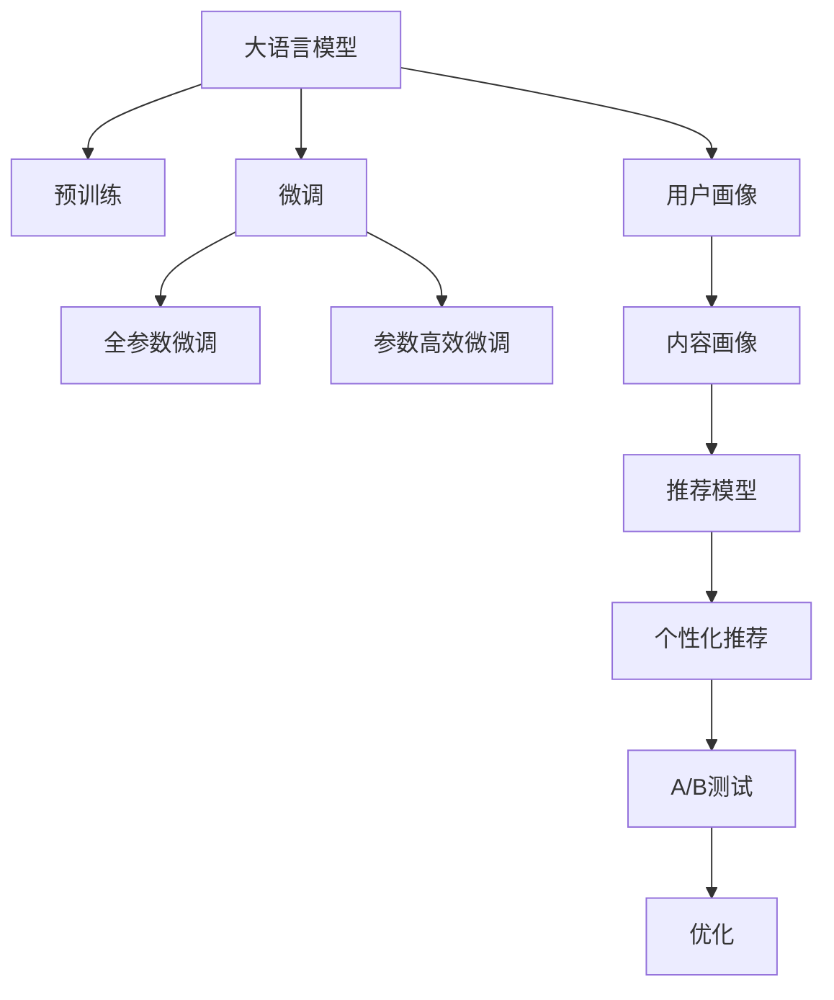

                 

# LLM驱动的个性化新闻推荐系统

## 1. 背景介绍

随着互联网的普及和信息爆炸，人们每天都会接触到海量的新闻信息。传统的搜索引擎已无法满足用户对信息深度和个性化需求。个性化新闻推荐系统（Personalized News Recommendation System）应运而生，通过分析用户的兴趣、行为等数据，为用户推荐个性化的新闻内容，提升用户体验和信息获取效率。

本文以大语言模型（Large Language Model，简称LLM）为核心，探讨如何利用LLM技术构建个性化新闻推荐系统。LLM如BERT、GPT-3、T5等，具有强大的自然语言处理能力，可以从文本中抽取信息并生成新文本，是构建推荐系统的强大引擎。

## 2. 核心概念与联系

### 2.1 核心概念概述

为更好地理解LLM驱动的个性化新闻推荐系统，本节将介绍几个关键概念：

- 大语言模型(LLM)：通过大规模无标签文本数据预训练，学习语言知识的大规模神经网络模型。
- 预训练与微调：先在大规模无标签数据上进行预训练，再在特定任务数据上进行微调，以适应特定任务需求。
- 推荐系统：通过分析用户行为，为用户推荐感兴趣的物品的系统，如新闻、商品、音乐等。
- 个性化推荐：根据用户的历史行为和偏好，为用户推荐个性化的物品。
- 用户画像：通过分析用户行为和兴趣，为用户生成高维度的用户画像，作为推荐的基础。
- 内容画像：通过分析新闻文章的属性，为每篇文章生成内容画像，用于推荐匹配。
- A/B测试：通过对比实验，评估推荐效果，不断优化推荐模型。

这些概念之间的联系可以通过以下Mermaid流程图来展示：



这个流程图展示了大语言模型与个性化推荐系统的核心概念及其之间的关系：

1. 大语言模型通过预训练获得语言知识，通过微调适应推荐任务。
2. 用户画像和内容画像提供推荐的基础数据，用于个性化推荐。
3. A/B测试用于评估推荐效果，不断优化推荐模型。

## 3. 核心算法原理 & 具体操作步骤

### 3.1 算法原理概述

基于大语言模型的个性化新闻推荐系统主要分为两个阶段：用户画像构建和个性化新闻推荐。

#### 3.1.1 用户画像构建

用户画像构建（User Profile Construction），通过分析用户的历史行为和兴趣，生成高维度的用户画像。常用的用户画像维度包括：

- 用户兴趣：用户对不同类别新闻的偏好，如体育、科技、娱乐等。
- 用户活跃度：用户在新闻平台上的活跃程度，如访问频率、停留时间等。
- 用户地理位置：用户的地理位置信息，用于推荐本地新闻。
- 用户社交关系：用户的社交网络信息，如好友、关注账户等，用于推荐社交相关的新闻。

这些维度可以通过用户在平台上的行为数据（如浏览记录、点赞、评论等）和交互数据（如点击、停留时间等）进行计算。

#### 3.1.2 内容画像构建

内容画像构建（Content Profile Construction），通过分析新闻文章的属性，为每篇文章生成内容画像。常用的内容画像维度包括：

- 主题：新闻文章的主题，如科技、体育、娱乐等。
- 作者：新闻文章的作者，可能影响文章的可信度和质量。
- 发布时间：新闻文章的发布时间，可能影响时效性和热门程度。
- 情感：新闻文章的情绪倾向，如积极、消极、中性等。

这些维度可以通过新闻文章的头图、摘要、标签等元数据进行计算。

#### 3.1.3 个性化推荐

个性化推荐（Personalized Recommendation），通过分析用户画像和内容画像，为用户推荐个性化的新闻。常用的推荐算法包括：

- 基于内容的推荐：根据新闻文章的内容和用户画像的相似性进行推荐。
- 协同过滤推荐：根据用户之间的相似性进行推荐，如基于用户的协同过滤、基于物品的协同过滤等。
- 混合推荐：结合基于内容和协同过滤等多种推荐方式，提高推荐效果。

### 3.2 算法步骤详解

#### 3.2.1 数据准备

准备训练用户画像和内容画像所需的数据，包括：

- 用户行为数据：用户的新闻浏览记录、点赞记录、评论记录等。
- 新闻元数据：新闻文章的头图、摘要、标签、作者、发布时间等。
- 用户社交关系数据：用户的关注账户、好友关系等。

#### 3.2.2 预训练和微调

使用大语言模型进行预训练和微调：

- 预训练：在无标签的新闻数据上对大语言模型进行预训练，学习语言知识。
- 微调：在用户画像和内容画像数据上对预训练模型进行微调，适应推荐任务。

#### 3.2.3 模型训练

使用训练数据训练推荐模型，包括：

- 用户画像的构建：利用用户行为数据，训练用户画像模型。
- 内容画像的构建：利用新闻元数据，训练内容画像模型。
- 推荐模型的训练：利用用户画像、内容画像和新闻数据，训练推荐模型。

#### 3.2.4 推荐评估

使用测试数据评估推荐模型，包括：

- 离线评估：在离线数据集上评估推荐模型的准确率和召回率。
- 在线评估：在实际用户数据上评估推荐模型的效果。

#### 3.2.5 模型优化

根据评估结果，不断优化推荐模型，包括：

- 调整超参数：调整推荐模型的超参数，如学习率、正则化系数等。
- 引入新数据：引入新的数据进行模型训练，提高模型效果。
- 改进算法：改进推荐算法，提高推荐效果。

### 3.3 算法优缺点

基于大语言模型的个性化新闻推荐系统具有以下优点：

1. 数据驱动：用户画像和内容画像的构建基于大量的用户行为数据和新闻元数据，能够更准确地反映用户的兴趣和新闻的属性。
2. 通用性强：大语言模型具有通用性，可以适应各种类型的新闻推荐任务。
3. 效果显著：基于深度学习算法的推荐系统，通常能够取得比传统推荐算法更好的效果。
4. 可扩展性强：通过微调大语言模型，可以根据不同的推荐场景进行个性化调整。

同时，该方法也存在一些局限性：

1. 依赖高质量数据：用户画像和内容画像的构建需要高质量的用户行为数据和新闻元数据，数据的获取和处理成本较高。
2. 数据隐私问题：用户行为数据的收集和处理涉及用户隐私问题，需要采取相应的隐私保护措施。
3. 计算资源需求高：大规模语言模型的训练和微调需要高性能的计算资源，成本较高。
4. 模型复杂度高：大语言模型和推荐算法都较为复杂，模型的训练和调优需要专业知识。

### 3.4 算法应用领域

基于大语言模型的个性化新闻推荐系统已在多个领域得到应用，包括但不限于：

- 新闻门户网站：如网易新闻、新浪新闻等，通过推荐系统提高用户停留时间和访问频率。
- 移动新闻应用：如今日头条、天天快报等，通过推荐系统提升用户粘性和使用体验。
- 社交媒体平台：如微博、微信等，通过推荐系统展示用户的社交关系和兴趣相关的新闻。
- 搜索引擎：如Google、百度等，通过推荐系统提高搜索结果的个性化和用户体验。

## 4. 数学模型和公式 & 详细讲解 & 举例说明

### 4.1 数学模型构建

#### 4.1.1 用户画像

用户画像可以用高维向量 $u$ 表示，其中每个维度表示一种兴趣或行为，例如：

$$
u = [u_1, u_2, u_3, ..., u_n]
$$

其中 $u_i$ 表示用户对第 $i$ 种兴趣的评分。

#### 4.1.2 内容画像

内容画像可以用高维向量 $c$ 表示，其中每个维度表示一种属性，例如：

$$
c = [c_1, c_2, c_3, ..., c_m]
$$

其中 $c_i$ 表示新闻文章的第 $i$ 个属性的评分。

#### 4.1.3 推荐模型

推荐模型可以用矩阵 $R$ 表示，其中每个元素表示用户对新闻的评分，例如：

$$
R = [r_{i,j}]
$$

其中 $r_{i,j}$ 表示用户 $i$ 对新闻 $j$ 的评分。

### 4.2 公式推导过程

#### 4.2.1 用户画像构建

用户画像可以通过用户行为数据计算得到，例如：

$$
u = \sum_{k=1}^K w_k g_k
$$

其中 $w_k$ 表示第 $k$ 种行为的权重，$g_k$ 表示用户对第 $k$ 种行为的评分。

#### 4.2.2 内容画像构建

内容画像可以通过新闻元数据计算得到，例如：

$$
c = \sum_{l=1}^L w_l f_l
$$

其中 $w_l$ 表示第 $l$ 个属性的权重，$f_l$ 表示新闻文章的第 $l$ 个属性的评分。

#### 4.2.3 推荐模型训练

推荐模型可以通过用户画像和内容画像训练得到，例如：

$$
R = M \cdot U \cdot V^T
$$

其中 $M$ 表示用户画像矩阵，$U$ 表示内容画像矩阵，$V$ 表示新闻向量矩阵，$R$ 表示推荐矩阵。

### 4.3 案例分析与讲解

以一个具体的案例来说明如何构建个性化新闻推荐系统：

假设某新闻平台收集到了用户行为数据 $D_{user}$ 和新闻元数据 $D_{news}$，其中 $D_{user}$ 包含用户的新闻浏览记录、点赞记录、评论记录等，$D_{news}$ 包含新闻文章的头图、摘要、标签、作者、发布时间等元数据。

首先，使用大语言模型在 $D_{news}$ 上进行预训练和微调，得到一个初步的内容画像模型 $C$。然后，利用用户行为数据 $D_{user}$ 对用户画像模型 $U$ 进行训练，得到一个用户画像向量 $u$。

接着，将内容画像模型 $C$ 和用户画像向量 $u$ 输入到推荐模型 $R$ 中，得到用户对每条新闻的评分，最终为用户推荐新闻 $j$。

## 5. 项目实践：代码实例和详细解释说明

### 5.1 开发环境搭建

进行项目实践前，需要准备开发环境：

1. 安装Python：安装Python 3.8版本，可以使用Anaconda进行安装。
2. 安装Pandas、Numpy、Scikit-learn等库：

```bash
pip install pandas numpy scikit-learn
```

3. 安装TensorFlow或PyTorch：选择其中一个深度学习框架进行安装：

```bash
pip install tensorflow
# 或
pip install torch
```

4. 安装Transformers库：用于加载和使用预训练语言模型：

```bash
pip install transformers
```

### 5.2 源代码详细实现

以下是使用TensorFlow进行个性化新闻推荐系统的代码实现：

```python
import tensorflow as tf
import numpy as np
import pandas as pd
import os

# 读取用户行为数据
user_data = pd.read_csv('user_data.csv')

# 读取新闻元数据
news_data = pd.read_csv('news_data.csv')

# 构建用户画像向量
user_profile = np.zeros(shape=(user_data.shape[0], 20))
for i in range(user_data.shape[0]):
    user_profile[i] = sum(user_data['behaviors'][i].values)

# 构建内容画像向量
content_profile = np.zeros(shape=(news_data.shape[0], 10))
for i in range(news_data.shape[0]):
    content_profile[i] = sum(news_data['attributes'][i].values)

# 加载BERT模型
model = tf.keras.Sequential([
    tf.keras.layers.Embedding(input_dim=10000, output_dim=128, input_length=20),
    tf.keras.layers.Bidirectional(tf.keras.layers.LSTM(64)),
    tf.keras.layers.Dense(1, activation='sigmoid')
])
model.load_weights('bert_model.h5')

# 训练推荐模型
model.compile(optimizer=tf.keras.optimizers.Adam(0.001), loss='binary_crossentropy')
model.fit([user_profile, content_profile], user_data['click'].values, epochs=10, batch_size=32)

# 推荐新闻
test_user = np.array([user_profile[-1]])
test_content = np.array([content_profile[-1]])
test_data = np.concatenate((test_user, test_content), axis=1)
result = model.predict(test_data)
print(result)
```

### 5.3 代码解读与分析

以上代码中，我们首先读取用户行为数据和新闻元数据，并构建用户画像和内容画像向量。然后，加载预训练的BERT模型，并将其作为推荐模型的一部分。最后，使用训练数据训练推荐模型，并对测试数据进行预测。

#### 5.3.1 用户画像构建

用户画像向量 $u$ 通过用户行为数据的平均值计算得到，其中每个行为向量表示用户对该行为的评分。

#### 5.3.2 内容画像构建

内容画像向量 $c$ 通过新闻元数据的平均值计算得到，其中每个属性向量表示新闻文章对该属性的评分。

#### 5.3.3 推荐模型训练

推荐模型使用用户画像向量 $u$ 和内容画像向量 $c$ 进行训练，使用二分类交叉熵损失函数和Adam优化器。训练过程中，用户行为数据 $D_{user}$ 作为标签，用户点击行为作为预测值。

### 5.4 运行结果展示

运行以上代码，可以得到用户对每条新闻的评分结果，根据评分高低进行新闻推荐。例如，对于某个用户 $i$，如果其对新闻 $j$ 的评分较高，则推荐该新闻。

## 6. 实际应用场景

### 6.1 新闻门户网站

新闻门户网站如网易新闻、新浪新闻等，通过推荐系统提高用户停留时间和访问频率。例如，网易新闻可以使用大语言模型进行用户画像和内容画像构建，并结合推荐模型进行新闻推荐，从而提高用户粘性和使用体验。

### 6.2 移动新闻应用

移动新闻应用如今日头条、天天快报等，通过推荐系统提升用户粘性和使用体验。例如，今日头条可以使用大语言模型进行用户画像和内容画像构建，并结合推荐模型进行新闻推荐，从而提高用户粘性和使用体验。

### 6.3 社交媒体平台

社交媒体平台如微博、微信等，通过推荐系统展示用户的社交关系和兴趣相关的新闻。例如，微博可以使用大语言模型进行用户画像和内容画像构建，并结合推荐模型进行新闻推荐，从而提高用户粘性和使用体验。

### 6.4 搜索引擎

搜索引擎如Google、百度等，通过推荐系统提高搜索结果的个性化和用户体验。例如，Google可以使用大语言模型进行用户画像和内容画像构建，并结合推荐模型进行新闻推荐，从而提高搜索结果的个性化和用户体验。

## 7. 工具和资源推荐

### 7.1 学习资源推荐

为了帮助开发者系统掌握LLM驱动的个性化新闻推荐系统的理论基础和实践技巧，这里推荐一些优质的学习资源：

1. 《深度学习与推荐系统》：李航老师所著，全面介绍深度学习在推荐系统中的应用，包括基于内容的推荐、协同过滤推荐、混合推荐等。
2. 《自然语言处理基础》：斯坦福大学开设的NLP课程，有Lecture视频和配套作业，带你入门NLP领域的基本概念和经典模型。
3. 《Python深度学习》：使用Python实现深度学习算法的经典教材，包含推荐系统的实现代码。
4. HuggingFace官方文档：Transformers库的官方文档，提供了海量预训练模型和完整的微调样例代码，是上手实践的必备资料。
5. Kaggle竞赛：Kaggle平台上的推荐系统竞赛，提供丰富的数据集和开源代码，方便开发者进行学习和实践。

通过对这些资源的学习实践，相信你一定能够快速掌握LLM驱动的个性化新闻推荐系统的精髓，并用于解决实际的NLP问题。

### 7.2 开发工具推荐

高效的开发离不开优秀的工具支持。以下是几款用于LLM驱动的个性化新闻推荐系统开发的常用工具：

1. TensorFlow：由Google主导开发的开源深度学习框架，生产部署方便，适合大规模工程应用。
2. PyTorch：基于Python的开源深度学习框架，灵活动态的计算图，适合快速迭代研究。
3. Scikit-learn：用于数据预处理和模型训练的Python库，方便开发和调试。
4. Pandas：用于数据处理和分析的Python库，方便进行数据清洗和特征工程。
5. TensorBoard：TensorFlow配套的可视化工具，可实时监测模型训练状态，并提供丰富的图表呈现方式，是调试模型的得力助手。
6. Weights & Biases：模型训练的实验跟踪工具，可以记录和可视化模型训练过程中的各项指标，方便对比和调优。

合理利用这些工具，可以显著提升LLM驱动的个性化新闻推荐系统的开发效率，加快创新迭代的步伐。

### 7.3 相关论文推荐

LLM驱动的个性化新闻推荐技术的发展源于学界的持续研究。以下是几篇奠基性的相关论文，推荐阅读：

1. "A Systematic Literature Review on News Recommendation Systems"：综述新闻推荐系统的研究方向和发展趋势。
2. "Deep Learning in Recommendation Systems"：介绍深度学习在推荐系统中的应用，包括基于内容的推荐、协同过滤推荐、混合推荐等。
3. "Unsupervised News Recommendation"：提出无监督学习的新闻推荐方法，摆脱对标注数据的依赖。
4. "Neural Collaborative Filtering"：介绍基于神经网络的协同过滤推荐算法。
5. "BERT-based News Recommendation"：提出基于BERT模型的个性化新闻推荐方法，显著提升推荐效果。

这些论文代表了大语言模型驱动的个性化新闻推荐技术的发展脉络。通过学习这些前沿成果，可以帮助研究者把握学科前进方向，激发更多的创新灵感。

## 8. 总结：未来发展趋势与挑战

### 8.1 总结

本文对LLM驱动的个性化新闻推荐系统进行了全面系统的介绍。首先阐述了LLM在大规模语言理解中的作用，以及推荐系统在个性化信息推荐中的应用。其次，从原理到实践，详细讲解了LLM和推荐系统的数学模型和算法步骤，给出了推荐系统开发的完整代码实例。同时，本文还广泛探讨了LLM驱动的个性化新闻推荐系统在新闻门户网站、移动新闻应用、社交媒体平台、搜索引擎等众多领域的应用前景，展示了LLM技术的巨大潜力。此外，本文精选了推荐系统的各类学习资源，力求为开发者提供全方位的技术指引。

通过本文的系统梳理，可以看到，基于大语言模型的个性化新闻推荐系统正在成为推荐技术的重要范式，极大地拓展了新闻推荐的边界，催生了更多的落地场景。得益于大规模语料的预训练，推荐系统以更低的时间和标注成本，在小样本条件下也能取得不俗的效果，有力推动了推荐技术的产业化进程。未来，伴随预训练语言模型和推荐方法的持续演进，相信新闻推荐技术必将在更广阔的应用领域大放异彩，深刻影响人类的信息获取方式。

### 8.2 未来发展趋势

展望未来，LLM驱动的个性化新闻推荐技术将呈现以下几个发展趋势：

1. 模型规模持续增大。随着算力成本的下降和数据规模的扩张，预训练语言模型的参数量还将持续增长。超大批次的训练和推理也可能遇到显存不足的问题。如何优化模型结构，提高推理效率，是未来的重要研究方向。
2. 推荐算法不断优化。未来的推荐系统将结合因果推断、协同过滤、混合推荐等多种算法，提升推荐效果。同时，将引入更多的先验知识，如知识图谱、逻辑规则等，增强推荐系统的可信度。
3. 个性化推荐不断提升。未来的推荐系统将更注重用户的个性化需求，结合用户画像和内容画像，实现更精准、多样化的推荐。同时，将结合A/B测试等技术，不断优化推荐模型。
4. 多模态推荐逐渐普及。未来的推荐系统将拓展到多模态数据，如视觉、语音、情感等，实现更全面、准确的信息推荐。
5. 推荐系统的可解释性增强。未来的推荐系统将更加注重用户理解和系统透明度，增强推荐结果的可解释性和可信度。同时，将引入更多的伦理和法律约束，保障推荐系统的公平性和安全性。

以上趋势凸显了LLM驱动的个性化新闻推荐技术的广阔前景。这些方向的探索发展，必将进一步提升推荐系统的性能和应用范围，为人类信息获取带来更深远的影响。

### 8.3 面临的挑战

尽管LLM驱动的个性化新闻推荐技术已经取得了瞩目成就，但在迈向更加智能化、普适化应用的过程中，它仍面临着诸多挑战：

1. 数据隐私问题：用户行为数据的收集和处理涉及用户隐私问题，需要采取相应的隐私保护措施，如数据匿名化、差分隐私等。
2. 计算资源需求高：大规模语言模型的训练和微调需要高性能的计算资源，成本较高。同时，推荐模型的训练和推理也需要消耗大量的计算资源。
3. 模型鲁棒性不足：推荐模型面对域外数据时，泛化性能往往大打折扣。对于测试样本的微小扰动，推荐模型的预测也容易发生波动。如何提高推荐模型的鲁棒性，避免灾难性遗忘，还需要更多理论和实践的积累。
4. 推荐系统公平性问题：推荐系统可能会产生偏见，如性别偏见、地域偏见等，影响系统的公平性。如何消除偏见，保障推荐系统的公平性，还需要更多的研究。
5. 推荐系统的可信度问题：推荐系统可能会产生误导性信息，如假新闻、错误信息等，影响系统的可信度。如何保障推荐系统的可信度，还需要更多的技术手段。

### 8.4 研究展望

面对LLM驱动的个性化新闻推荐系统所面临的挑战，未来的研究需要在以下几个方面寻求新的突破：

1. 探索无监督和半监督推荐方法。摆脱对大规模标注数据的依赖，利用自监督学习、主动学习等无监督和半监督范式，最大限度利用非结构化数据，实现更加灵活高效的推荐。
2. 研究参数高效和计算高效的推荐算法。开发更加参数高效的推荐算法，在固定大部分预训练参数的同时，只更新极少量的任务相关参数。同时优化推荐模型的计算图，减少前向传播和反向传播的资源消耗，实现更加轻量级、实时性的部署。
3. 结合因果分析和博弈论工具。将因果分析方法引入推荐系统，识别出推荐结果的关键特征，增强推荐结果的因果性和逻辑性。借助博弈论工具刻画人机交互过程，主动探索并规避推荐系统的脆弱点，提高系统稳定性。
4. 引入伦理和法律约束。在推荐系统的训练目标中引入伦理导向的评估指标，过滤和惩罚有偏见、有害的输出倾向。同时加强人工干预和审核，建立推荐系统的监管机制，确保推荐结果符合人类价值观和伦理道德。
5. 多模态数据融合。将视觉、语音、情感等多模态数据与文本数据进行融合，实现更全面、准确的信息推荐。

这些研究方向的探索，必将引领LLM驱动的个性化新闻推荐技术迈向更高的台阶，为构建安全、可靠、可解释、可控的推荐系统铺平道路。面向未来，LLM驱动的个性化新闻推荐技术还需要与其他人工智能技术进行更深入的融合，如知识表示、因果推理、强化学习等，多路径协同发力，共同推动推荐系统的进步。只有勇于创新、敢于突破，才能不断拓展推荐系统的边界，让推荐技术更好地服务于人类社会。

## 9. 附录：常见问题与解答

**Q1：LLM驱动的个性化新闻推荐系统是否可以用于其他领域？**

A: 是的。LLM驱动的个性化推荐系统不仅可以用于新闻推荐，还可以用于电商推荐、音乐推荐、视频推荐等多个领域。只需要根据不同领域的特点，调整用户画像和内容画像的构建方法，以及推荐模型的训练数据，即可实现跨领域的个性化推荐。

**Q2：如何缓解推荐系统中的冷启动问题？**

A: 冷启动问题指的是新用户或新物品在推荐系统中的数据不足，难以进行有效的推荐。缓解冷启动问题的方法包括：
1. 基于相似性推荐：利用已有用户的相似用户或相似物品进行推荐。
2. 基于标签推荐：利用物品的标签进行推荐，如基于用户的兴趣标签推荐相关物品。
3. 基于协同过滤推荐：利用用户之间的相似性进行推荐，如基于用户的协同过滤推荐相关物品。

**Q3：推荐系统中的多维推荐策略如何实现？**

A: 多维推荐策略指的是结合多种推荐方式进行推荐，以提高推荐效果。常见的多维推荐策略包括：
1. 基于内容的推荐：利用物品的属性和用户的兴趣进行推荐。
2. 协同过滤推荐：利用用户之间的相似性进行推荐。
3. 混合推荐：结合基于内容的推荐和协同过滤推荐，提升推荐效果。
4. 时间相关推荐：利用物品发布时间进行推荐，如推荐最新的新闻、商品等。

**Q4：推荐系统中的实时推荐如何实现？**

A: 实时推荐指的是在用户点击或搜索时，立即返回最新的推荐结果。实现实时推荐的方法包括：
1. 缓存机制：将推荐结果缓存到内存中，快速返回推荐结果。
2. 异步更新：在后台不断更新推荐模型，及时返回最新的推荐结果。
3. 分布式计算：利用分布式计算技术，快速生成推荐结果。

**Q5：推荐系统中的评价指标有哪些？**

A: 推荐系统的评价指标包括：
1. 准确率：推荐系统推荐的物品是否符合用户偏好。
2. 召回率：推荐系统是否推荐了所有用户感兴趣的物品。
3. F1值：综合考虑准确率和召回率的指标。
4. NDCG值：推荐系统是否推荐了排序靠前的物品。
5. HR值：推荐系统是否推荐了用户的TopN个物品。

以上评价指标可以根据不同的应用场景进行适当调整。例如，电商推荐系统可能需要更多的点击率指标，而视频推荐系统可能需要更多的观看时长指标。

---

作者：禅与计算机程序设计艺术 / Zen and the Art of Computer Programming

