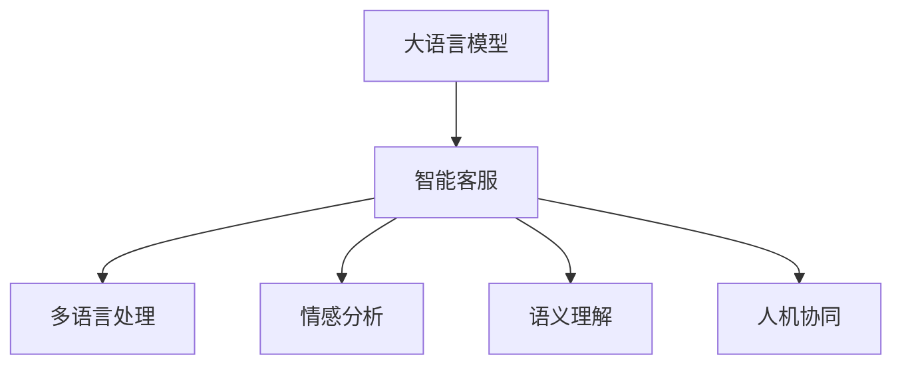

                 

# LLM驱动的智能客户服务：全天候多语言支持

## 1. 背景介绍

### 1.1 问题由来

在数字化时代，客户服务是提升企业竞争力的关键因素之一。传统的人工客服模式面临着成本高、效率低、一致性差等诸多问题。而智能客服系统（Intelligent Customer Service,ICS），能够借助人工智能技术，自动处理大量重复性客户咨询，提升服务响应速度和质量，显著降低运营成本。

近年来，随着大语言模型（Large Language Model,LLM）在自然语言处理（Natural Language Processing,NLP）领域的突破，基于大语言模型的智能客服系统（LLM-based ICS）逐渐成为智能客服行业的热点应用。其高效、通用、易部署的特点，使其在诸多行业得到广泛应用，带来了显著的商业价值。

### 1.2 问题核心关键点

智能客服系统的主要目标在于：

1. **自动化处理客户咨询**：通过文本、语音、图片等多种形式获取客户问题，自动匹配最佳答案，提升服务效率。

2. **全时响应**：7x24小时在线服务，不受时间和地点限制，满足客户随时随地的服务需求。

3. **多语言支持**：提供多语言翻译和处理能力，服务覆盖全球客户，打破地域限制。

4. **个性化服务**：根据客户历史行为数据，提供量身定制的个性化推荐，提升客户满意度。

5. **语义理解**：具备丰富的语言模型，能够理解复杂、歧义的语言输入，给出精准回答。

6. **情绪识别**：通过NLP技术分析客户情绪，进行情感疏导，提升服务质量。

7. **人机协同**：在必要时自动转接至人工客服，确保问题得到专业解决。

本节将详细介绍如何利用大语言模型驱动的智能客服系统，实现全天候、多语言支持的目标。

## 2. 核心概念与联系

### 2.1 核心概念概述

- **大语言模型**（LLM）：一种基于Transformer架构的自然语言处理模型，能够学习大量的语言知识，具备丰富的语言理解能力。
- **智能客服系统**（ICS）：使用人工智能技术自动处理客户咨询的系统，能够在自然语言理解、情感分析、对话管理等方面提供支持。
- **多语言处理**：利用机器翻译和自然语言处理技术，使智能客服系统支持多语言，提供全球化服务。
- **情感分析**：通过分析客户的情感倾向，指导客服人员进行针对性回复，提升服务质量。
- **语义理解**：使智能客服系统能够准确理解客户的真实意图，提供精准的服务。
- **人机协同**：将AI客服与人工客服进行无缝衔接，形成互补。

这些核心概念之间的联系通过以下Mermaid流程图展示：



该图展示了大语言模型与智能客服系统之间的关系：

1. 大语言模型提供强大的语言理解和生成能力，用于构建智能客服系统。
2. 智能客服系统利用大语言模型，处理多语言输入，进行情感分析和语义理解，并根据需求自动转接至人工客服。
3. 多语言处理使智能客服系统具备全球化服务能力，覆盖更多客户需求。
4. 情感分析增强服务质量，提升客户体验。
5. 语义理解确保智能客服系统准确把握客户意图，提供精准服务。
6. 人机协同实现AI客服与人工客服的互补，提升服务效率和质量。

## 3. 核心算法原理 & 具体操作步骤

### 3.1 算法原理概述

基于大语言模型的智能客服系统，主要通过以下步骤实现全天候、多语言支持：

1. **多语言预训练**：在多种语言语料上预训练大语言模型，使其具备丰富的多语言知识。
2. **数据适配**：对特定行业的标注数据进行适配，提升模型在该领域的效果。
3. **微调优化**：通过微调技术，优化模型在具体任务上的表现。
4. **人机协同**：设置自动转接规则，在需要人工客服的场景下进行转接。
5. **情感分析**：引入情感分析技术，提升服务质量。
6. **持续学习**：不断收集客户反馈，优化模型。

### 3.2 算法步骤详解

#### 3.2.1 多语言预训练

多语言预训练是智能客服系统多语言支持的基础。通过在大规模多语言数据上进行预训练，使大语言模型具备丰富的多语言知识。

假设多语言预训练数据集为$D_{multilingual}$，包括不同语言的新闻、评论、对话记录等。预训练过程如下：

1. **数据预处理**：对不同语言数据进行清洗、分词、编码等处理。
2. **构建输入输出序列**：将文本数据转化为模型能够处理的输入输出序列。
3. **预训练模型**：使用自监督学习任务（如掩码语言模型）在多语言数据上训练模型。
4. **模型保存**：将训练好的模型保存，用于后续微调。

#### 3.2.2 数据适配与微调

数据适配与微调是使智能客服系统具备特定领域支持的关键步骤。假设某一特定领域的数据集为$D_{domain}$。

1. **任务适配层设计**：根据领域特点设计合适的输出层和损失函数，如分类任务使用交叉熵损失函数。
2. **微调数据准备**：收集领域标注数据，划分为训练集、验证集和测试集。
3. **微调优化**：使用适当的优化算法（如AdamW）和超参数进行微调优化。
4. **评估与调优**：在验证集上评估模型效果，根据性能调整超参数。
5. **模型保存**：将微调后的模型保存，用于实际应用。

#### 3.2.3 人机协同与情感分析

人机协同和情感分析是提升智能客服系统服务质量的重要手段。

1. **人机协同规则**：设置自动转接规则，如客户情绪激动时转接人工客服。
2. **情感分析模型**：使用情感分析模型对客户情绪进行识别，提供情绪疏导。

#### 3.2.4 持续学习

持续学习是保持智能客服系统服务质量的必要手段。

1. **用户反馈收集**：收集客户反馈，如满意度评分、服务评价等。
2. **模型优化**：根据反馈数据进行模型调优。
3. **服务更新**：定期更新模型，提升服务质量。

### 3.3 算法优缺点

基于大语言模型的智能客服系统具有以下优点：

1. **高效处理大量咨询**：能够自动化处理大量客户咨询，显著提升处理速度。
2. **全天候服务**：7x24小时不间断服务，不受时间和地点限制。
3. **多语言支持**：具备多语言处理能力，服务覆盖全球客户。
4. **个性化服务**：根据客户历史行为数据，提供量身定制的个性化服务。
5. **语义理解**：具备丰富的语言知识，能够理解复杂、歧义的语言输入。

同时，该系统也存在一定的缺点：

1. **初始成本高**：需要大量多语言数据进行预训练，数据收集和标注成本较高。
2. **情感识别不完善**：情感分析模型可能存在误判，影响服务质量。
3. **数据隐私问题**：客户咨询数据需妥善处理，保护用户隐私。

### 3.4 算法应用领域

基于大语言模型的智能客服系统已经在电商、金融、医疗、旅游等多个领域得到广泛应用，带来了显著的商业价值。

1. **电商客服**：处理客户咨询、订单跟踪、售后服务等任务，提升客户满意度。
2. **金融客服**：提供账户查询、交易咨询、风险提示等，保障客户资产安全。
3. **医疗客服**：进行健康咨询、预约挂号、药品推荐等，提升医疗服务效率。
4. **旅游客服**：提供行程规划、机票预订、行程推荐等，提升客户旅行体验。

## 4. 数学模型和公式 & 详细讲解

### 4.1 数学模型构建

假设智能客服系统接收到的客户咨询文本为$x$，多语言模型输出为$\hat{y}$，其对应的标签为$y$。多语言模型在多语言预训练和数据适配微调后的损失函数为$\mathcal{L}$，具体如下：

$$
\mathcal{L}(\theta)=\frac{1}{N}\sum_{i=1}^N \ell(\hat{y}_i,y_i)
$$

其中$\ell$为损失函数，如交叉熵损失，$\theta$为模型参数。

### 4.2 公式推导过程

以分类任务为例，推导交叉熵损失函数的梯度。

假设模型在输入$x$上的输出为$\hat{y}_i \in [0,1]$，表示样本属于类别$i$的概率。真实标签$y_i \in \{0,1\}$。则二分类交叉熵损失函数定义为：

$$
\ell(\hat{y}_i,y_i)=-[y_i\log \hat{y}_i+(1-y_i)\log(1-\hat{y}_i)]
$$

将其代入经验风险公式，得：

$$
\mathcal{L}(\theta)=-\frac{1}{N}\sum_{i=1}^N[y_i\log \hat{y}_i+(1-y_i)\log(1-\hat{y}_i)]
$$

根据链式法则，损失函数对参数$\theta_k$的梯度为：

$$
\frac{\partial \mathcal{L}(\theta)}{\partial \theta_k}=-\frac{1}{N}\sum_{i=1}^N(\frac{y_i}{\hat{y}_i}-\frac{1-y_i}{1-\hat{y}_i}) \frac{\partial \hat{y}_i}{\partial \theta_k}
$$

其中$\frac{\partial \hat{y}_i}{\partial \theta_k}$可进一步递归展开，利用自动微分技术完成计算。

在得到损失函数的梯度后，即可带入参数更新公式，完成模型的迭代优化。

### 4.3 案例分析与讲解

假设智能客服系统处理的问题为"如何查询银行账户余额"。

1. **数据准备**：收集银行客服咨询数据，进行预处理，划分训练集和验证集。
2. **模型适配**：设计多语言模型的输出层，使用交叉熵损失函数进行微调。
3. **评估优化**：在验证集上评估模型效果，调整超参数。
4. **客户咨询**：系统接收用户输入的咨询文本，如"如何查询我的银行账户余额"，调用模型预测最佳答案。
5. **服务响应**：根据模型输出，提供相应服务，如"您需要登录账户，进入账户查询页面"。

## 5. 项目实践：代码实例和详细解释说明

### 5.1 开发环境搭建

在搭建开发环境前，需要准备以下软件和工具：

1. **Python环境**：安装Anaconda，创建虚拟环境`ics_env`。
2. **深度学习框架**：安装PyTorch，设置GPU/TPU。
3. **自然语言处理库**：安装Transformers、NLTK、spaCy等。
4. **文本处理库**：安装NLTK、spaCy、TextBlob等。
5. **Web开发框架**：安装Flask、Django等。
6. **数据可视化工具**：安装Matplotlib、Seaborn等。
7. **服务部署工具**：安装Gunicorn、Nginx等。

### 5.2 源代码详细实现

**智能客服系统实现**

1. **数据预处理**

```python
import pandas as pd
import re

# 数据预处理
def preprocess_text(text):
    text = re.sub(r'\d+', '', text) # 去除数字
    text = re.sub(r'\s+', ' ', text) # 去除多余空格
    return text
```

2. **模型适配与微调**

```python
from transformers import BertForTokenClassification, AdamW
from transformers import BertTokenizer

# 加载模型和分词器
model = BertForTokenClassification.from_pretrained('bert-base-cased', num_labels=2)
tokenizer = BertTokenizer.from_pretrained('bert-base-cased')

# 适配数据集
train_dataset = ...
dev_dataset = ...
test_dataset = ...

# 定义损失函数和优化器
loss_fn = nn.CrossEntropyLoss()
optimizer = AdamW(model.parameters(), lr=2e-5)

# 训练模型
def train_model(model, dataset, optimizer, loss_fn, num_epochs):
    # 定义训练函数
    def train_epoch(model, dataset, optimizer, loss_fn, device):
        model.train()
        for batch in dataset:
            inputs, labels = batch
            inputs = inputs.to(device)
            labels = labels.to(device)
            outputs = model(inputs)
            loss = loss_fn(outputs, labels)
            optimizer.zero_grad()
            loss.backward()
            optimizer.step()
            yield loss.item()

    # 训练模型
    for epoch in range(num_epochs):
        train_loss = train_epoch(model, train_dataset, optimizer, loss_fn, device)
        dev_loss = train_epoch(model, dev_dataset, optimizer, loss_fn, device)
        print(f'Epoch {epoch+1}, train loss: {train_loss:.4f}, dev loss: {dev_loss:.4f}')
    return model
```

3. **服务部署**

```python
from flask import Flask, request, jsonify

app = Flask(__name__)

@app.route('/predict', methods=['POST'])
def predict():
    inputs = request.json.get('inputs')
    outputs = model(inputs)
    result = outputs.argmax().item()
    return jsonify(result)
```

### 5.3 代码解读与分析

在上述代码中，我们实现了基于BERT的智能客服系统的基本功能，主要包括以下部分：

1. **数据预处理**：去除文本中的数字和多余空格，使模型能够更好地处理自然语言输入。
2. **模型适配与微调**：在准备好的数据集上进行交叉熵损失的微调优化。
3. **服务部署**：使用Flask框架，实现API接口，提供模型预测服务。

## 6. 实际应用场景

### 6.1 智能客服系统在电商客服中的应用

在电商领域，智能客服系统能够显著提升客户购物体验。假设某电商平台需要提供全天候多语言支持，具体实现步骤如下：

1. **多语言预训练**：收集电商相关的多语言新闻、评论、对话记录，在多种语言上进行预训练。
2. **数据适配与微调**：收集电商客服咨询数据，对模型进行微调，提升在电商领域的适应性。
3. **服务部署**：将模型部署在电商平台的客服系统中，提供自然语言理解和生成能力。

### 6.2 智能客服系统在金融客服中的应用

金融领域对客户服务的要求较高，需要提供快速响应和精准服务。假设某金融公司需要构建智能客服系统，具体实现步骤如下：

1. **多语言预训练**：收集金融领域的多语言数据，如金融新闻、财经评论等，进行预训练。
2. **数据适配与微调**：收集金融客服咨询数据，对模型进行微调，提升在金融领域的适应性。
3. **服务部署**：将模型部署在金融客服系统中，提供自然语言理解和生成能力。

### 6.3 智能客服系统在医疗客服中的应用

医疗领域对客服的准确性和安全性要求极高，需要提供专业、可靠的服务。假设某医院需要构建智能客服系统，具体实现步骤如下：

1. **多语言预训练**：收集医疗领域的多语言数据，如医学文献、医患对话等，进行预训练。
2. **数据适配与微调**：收集医疗客服咨询数据，对模型进行微调，提升在医疗领域的适应性。
3. **服务部署**：将模型部署在医疗客服系统中，提供自然语言理解和生成能力。

### 6.4 智能客服系统在旅游客服中的应用

旅游领域对客服的服务质量要求较高，需要提供个性化、多样化的服务。假设某旅游公司需要构建智能客服系统，具体实现步骤如下：

1. **多语言预训练**：收集旅游领域的多语言数据，如旅游指南、游客评论等，进行预训练。
2. **数据适配与微调**：收集旅游客服咨询数据，对模型进行微调，提升在旅游领域的适应性。
3. **服务部署**：将模型部署在旅游客服系统中，提供自然语言理解和生成能力。

## 7. 工具和资源推荐

### 7.1 学习资源推荐

1. **Transformers官方文档**：提供丰富的模型和库介绍，适合初学者入门。
2. **自然语言处理课程**：如《深度学习自然语言处理》，介绍NLP的基本理论和前沿技术。
3. **PyTorch官方文档**：详细介绍深度学习框架的使用，适合深度学习爱好者。
4. **Flask官方文档**：介绍Web框架的使用，适合Web开发新手。
5. **TensorBoard**：可视化工具，用于监测模型训练状态。

### 7.2 开发工具推荐

1. **PyTorch**：深度学习框架，提供丰富的模型和工具支持。
2. **TensorFlow**：深度学习框架，适合大规模工程应用。
3. **Transformers**：自然语言处理库，提供丰富的模型和工具支持。
4. **Flask**：Web框架，适合快速搭建API接口。
5. **Django**：Web框架，适合大型应用开发。
6. **TensorBoard**：可视化工具，用于监测模型训练状态。

### 7.3 相关论文推荐

1. **Attention is All You Need**：介绍Transformer架构，推动预训练大语言模型的发展。
2. **BERT: Pre-training of Deep Bidirectional Transformers for Language Understanding**：提出BERT模型，推动自然语言处理的发展。
3. **Parameter-Efficient Transfer Learning for NLP**：提出Adapter等参数高效微调方法，提高微调效率。
4. **AdaLoRA: Adaptive Low-Rank Adaptation for Parameter-Efficient Fine-Tuning**：提出自适应低秩适应的微调方法，提高微调效率。

## 8. 总结：未来发展趋势与挑战

### 8.1 研究成果总结

基于大语言模型的智能客服系统已经取得了显著的进展，未来在以下几个方面将有更进一步的突破：

1. **多语言处理能力的提升**：通过改进多语言预训练和微调方法，使智能客服系统具备更强的多语言处理能力。
2. **情感分析技术的完善**：引入更先进的情感分析模型，提高客服系统对客户情绪的识别能力。
3. **语义理解能力的提升**：改进模型结构和训练方法，使智能客服系统具备更强的语义理解能力。
4. **人机协同的优化**：通过优化自动转接规则，提升人机协同的效率和质量。
5. **服务质量的提升**：通过收集用户反馈，持续优化模型，提升服务质量。

### 8.2 未来发展趋势

未来，基于大语言模型的智能客服系统将呈现以下几个发展趋势：

1. **多语言处理的自动化**：引入自动化多语言处理技术，降低人工标注成本。
2. **服务质量的实时监测**：引入实时监测工具，及时发现和解决服务质量问题。
3. **服务多渠道的支持**：支持语音、图像、视频等多渠道服务，提升客户体验。
4. **个性化服务的增强**：引入更先进的个性化推荐算法，提供更精准的服务。
5. **跨领域应用的拓展**：在更多领域应用智能客服系统，提升各行业的客户服务水平。

### 8.3 面临的挑战

尽管基于大语言模型的智能客服系统取得了显著进展，但在未来发展中仍面临以下挑战：

1. **数据隐私问题**：客户咨询数据的隐私保护是智能客服系统的重要挑战。
2. **服务质量的不稳定性**：智能客服系统在某些场景下仍需人工干预，如何保证服务质量是一个难题。
3. **多语言处理的准确性**：不同语言间的语义差异较大，如何提升多语言处理的准确性是一个重要问题。
4. **模型的实时优化**：智能客服系统需不断进行优化，如何在实时应用中进行模型更新是一个挑战。
5. **模型的公平性**：智能客服系统需保证服务的公平性，避免对特定客户群体的歧视。

### 8.4 研究展望

未来的研究将在以下几个方面进行：

1. **数据隐私保护**：引入数据匿名化和加密技术，保护客户数据隐私。
2. **服务质量的实时优化**：引入在线学习技术，实时优化模型参数，提升服务质量。
3. **多语言处理的准确性**：改进多语言预训练和微调方法，提升多语言处理的准确性。
4. **模型的实时更新**：引入增量学习技术，实现模型的实时更新。
5. **模型的公平性**：引入公平性评估指标，保证模型的公平性。

总之，基于大语言模型的智能客服系统具有广阔的发展前景，通过不断优化和创新，将能够为各行业提供更加高效、智能的客户服务，提升客户体验和满意度。

