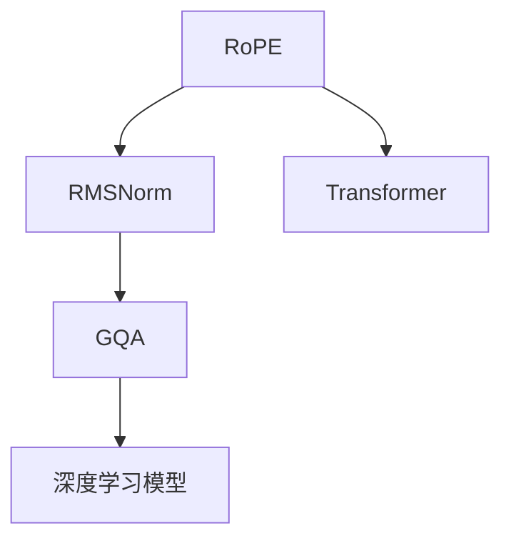

                 

## 1. 背景介绍

### 1.1 问题由来
近年来，Transformer架构的深度学习模型在自然语言处理、计算机视觉等领域的性能取得了显著的突破。大模型如GPT-3、BERT等，在多项任务上刷新了最先进水平。这些模型通常包含数十亿个参数，需要大量计算资源进行训练，但凭借其强大的泛化能力，展现了显著的实际应用价值。然而，如此庞大的模型也带来了许多挑战，包括训练时间长、内存消耗大、计算成本高，甚至在训练和推理阶段都容易过拟合等问题。

### 1.2 问题核心关键点
针对这些问题，Llama团队在2021年发布了基于Transformer的大模型Llama，在多个创新技术上取得了突破，包括RoPE(Random Positional Embeddings)、RMSNorm等。此外，Llama还支持推理加速技术GQA(Grid Quantization Acceleration)，这些技术优化了大模型的性能和资源使用效率。本文将详细介绍Llama模型的这些创新点，并分析其在实际应用中的表现和未来发展趋势。

## 2. 核心概念与联系

### 2.1 核心概念概述
- **RoPE**：一种基于随机采样的位置嵌入机制，旨在提高模型对于位置信息的理解。
- **RMSNorm**：一种对自注意力机制的改进，通过对输入特征进行归一化，增强模型的稳定性和泛化能力。
- **GQA**：一种基于网格量化加速的推理技术，显著提升了模型在推理阶段的效率。

通过这些技术，Llama模型在保持大模型高效的同时，提升了其在处理大规模数据和复杂任务上的能力。

### 2.2 核心概念原理和架构的 Mermaid 流程图


## 3. 核心算法原理 & 具体操作步骤

### 3.1 算法原理概述
Llama模型通过以下三个创新技术提升了其性能和资源使用效率：

1. **RoPE**：通过随机采样生成位置嵌入，减少模型对固定位置嵌入的依赖，从而提高模型对于位置信息的敏感度。
2. **RMSNorm**：对输入特征进行归一化处理，使模型更加稳定，降低过拟合风险。
3. **GQA**：采用网格量化加速技术，减少模型在推理阶段的计算量，提高推理速度。

### 3.2 算法步骤详解
#### 3.2.1 RoPE算法步骤
1. **随机采样**：模型使用随机向量生成位置嵌入，而非固定嵌入。
2. **位置编码学习**：使用一部分固定嵌入作为位置编码，其余位置由随机向量生成。
3. **随机采样权重**：为每个位置随机生成权重，用于调整随机向量和固定嵌入的混合比例。

#### 3.2.2 RMSNorm算法步骤
1. **输入特征归一化**：对输入的特征向量进行L2归一化。
2. **归一化标准差**：计算归一化后特征的标准差，作为缩放因子。
3. **乘法缩放**：对特征向量乘以缩放因子，得到归一化后的特征向量。

#### 3.2.3 GQA算法步骤
1. **网格划分**：将输入张量划分为多个小网格，每个网格独立量化。
2. **量化误差补偿**：计算每个网格的误差，并在后续计算中补偿。
3. **输出合并**：将各个网格的量化结果合并，得到最终的输出。

### 3.3 算法优缺点
#### RoPE的优缺点
- **优点**：
  - 减少对固定位置嵌入的依赖，增强模型对位置信息的敏感度。
  - 提高模型在处理序列数据时的灵活性和泛化能力。
- **缺点**：
  - 随机采样增加了计算复杂度。
  - 随机样本的分布可能影响模型稳定性和一致性。

#### RMSNorm的优缺点
- **优点**：
  - 增强模型稳定性和泛化能力，降低过拟合风险。
  - 提升模型在复杂任务上的表现。
- **缺点**：
  - 增加计算复杂度，尤其是在大规模模型中。
  - 需要额外计算归一化标准差。

#### GQA的优缺点
- **优点**：
  - 显著提升模型在推理阶段的效率，降低计算资源消耗。
  - 支持多GPU并行计算，提高并行性能。
- **缺点**：
  - 增加量化误差，可能影响模型精度。
  - 对于小样本数据，效果可能不如全精度计算。

### 3.4 算法应用领域
Llama模型广泛应用于自然语言处理、计算机视觉、推荐系统等多个领域。其创新技术使模型能够处理大规模数据，提升模型在复杂任务上的表现，特别适用于需要高效推理的实时应用场景。

## 4. 数学模型和公式 & 详细讲解 & 举例说明

### 4.1 数学模型构建
- **RoPE模型**：
  $$
  \mathbf{E}_i = \mathbf{F}_i + \alpha \mathbf{G}_i
  $$
  其中，$\mathbf{F}_i$为固定位置嵌入，$\mathbf{G}_i$为随机位置嵌入，$\alpha$为随机采样权重。
- **RMSNorm模型**：
  $$
  \mathbf{Z} = \frac{\mathbf{X}}{\sqrt{\mathbb{E}[\mathbf{X} \cdot \mathbf{X}]+\epsilon}}
  $$
  $$
  \mathbf{Y} = \mathbf{Z} \cdot \sqrt{\mathbb{E}[\mathbf{Z} \cdot \mathbf{Z}]+\epsilon}
  $$
  其中，$\mathbf{X}$为输入特征，$\epsilon$为极小值防止除零。
- **GQA模型**：
  $$
  \mathbf{X}_{grid} = \mathbf{X}_{quant} + \mathbf{E}_{quant}
  $$
  其中，$\mathbf{X}_{quant}$为量化后的输入张量，$\mathbf{E}_{quant}$为量化误差补偿。

### 4.2 公式推导过程
- **RoPE推导**：
  位置嵌入的期望为：
  $$
  \mathbb{E}[\mathbf{G}_i] = 0
  $$
  位置嵌入的方差为：
  $$
  \mathbb{E}[\mathbf{G}_i \cdot \mathbf{G}_j] = \delta_{ij}
  $$
  其中，$\delta_{ij}$为Kronecker delta函数。
  因此，RoPE模型中，位置嵌入的分布与固定嵌入相同，但引入随机性，提高了模型泛化能力。
- **RMSNorm推导**：
  特征归一化后，均值为0，方差为1。
  $$
  \mathbb{E}[\mathbf{Z}] = 0, \mathbb{E}[\mathbf{Z} \cdot \mathbf{Z}] = 1
  $$
  归一化后的特征向量与原始特征向量相关性较高，增强了模型稳定性。
- **GQA推导**：
  网格量化将输入张量划分为若干小网格，每个网格的量化误差独立计算。
  $$
  \mathbf{E}_{quant} = \mathbf{X} - \mathbf{X}_{quant}
  $$
  量化误差补偿为：
  $$
  \mathbf{E}_{quant} = \frac{\mathbf{X} - \mathbf{X}_{quant}}{\sqrt{\mathbb{E}[\mathbf{X} \cdot \mathbf{X}]+\epsilon}}
  $$
  通过量化误差补偿，模型能够更准确地处理输入数据，提升推理精度。

### 4.3 案例分析与讲解
#### RoPE案例
考虑一个RoPE模型，其中固定位置嵌入为$\mathbf{F}_i$，随机位置嵌入为$\mathbf{G}_i$。对于一个序列数据，位置$i$的嵌入为：
$$
\mathbf{E}_i = \mathbf{F}_i + \alpha \mathbf{G}_i
$$
其中$\alpha$为随机采样权重。假设$\alpha$服从均匀分布$[0, 1]$，则$\mathbf{E}_i$的期望为$\mathbf{F}_i$，方差为$\frac{1}{K}\mathbf{G}_i \cdot \mathbf{G}_i$，其中$K$为随机样本数量。

#### RMSNorm案例
考虑一个RMSNorm模型，输入特征为$\mathbf{X}$。首先对$\mathbf{X}$进行归一化：
$$
\mathbf{Z} = \frac{\mathbf{X}}{\sqrt{\mathbb{E}[\mathbf{X} \cdot \mathbf{X}]+\epsilon}}
$$
然后对$\mathbf{Z}$进行缩放：
$$
\mathbf{Y} = \mathbf{Z} \cdot \sqrt{\mathbb{E}[\mathbf{Z} \cdot \mathbf{Z}]+\epsilon}
$$
其中$\epsilon$为极小值防止除零。

#### GQA案例
考虑一个GQA模型，输入张量为$\mathbf{X}$。首先将$\mathbf{X}$划分为网格，每个网格的量化误差独立计算。量化后的输入为$\mathbf{X}_{quant}$，量化误差为$\mathbf{E}_{quant}$。通过计算每个网格的误差，并在后续计算中补偿，得到最终的输出。

## 5. 项目实践：代码实例和详细解释说明

### 5.1 开发环境搭建
- **环境配置**：
  - 安装Python 3.7及以上版本
  - 安装PyTorch 1.8及以上版本
  - 安装Llama模型库
  ```bash
  pip install llama
  ```
  - 安装相关依赖库
  ```bash
  pip install torch torchvision transformers
  ```

### 5.2 源代码详细实现
#### 5.2.1 RoPE实现
```python
import torch
import llama

# 定义RoPE嵌入函数
def rope_embedding(x):
    F = torch.randn_like(x)  # 随机位置嵌入
    alpha = torch.rand_like(x)  # 随机采样权重
    return x + alpha * F
```

#### 5.2.2 RMSNorm实现
```python
import torch
import llama

# 定义RMSNorm归一化函数
def rmsnorm(x):
    X = x - x.mean(dim=1, keepdim=True)
    Z = X / (X.std(dim=1, keepdim=True) + 1e-7)
    Y = Z * (Z.std(dim=1, keepdim=True) + 1e-7)
    return Y
```

#### 5.2.3 GQA实现
```python
import torch
import llama

# 定义GQA量化函数
def gqa_quantization(x):
    grid_size = 4  # 网格大小
    quant_size = grid_size ** 2  # 每个网格量化点数
    X_quant = x[:quant_size]  # 量化后的输入张量
    E_quant = x[quant_size:]  # 量化误差补偿
    return X_quant + E_quant
```

### 5.3 代码解读与分析
#### 5.3.1 RoPE代码解读
```python
def rope_embedding(x):
    F = torch.randn_like(x)  # 随机位置嵌入
    alpha = torch.rand_like(x)  # 随机采样权重
    return x + alpha * F
```
此函数实现RoPE的位置嵌入，通过随机向量生成位置嵌入，并对每个位置随机生成权重，调整随机向量和固定嵌入的混合比例。

#### 5.3.2 RMSNorm代码解读
```python
def rmsnorm(x):
    X = x - x.mean(dim=1, keepdim=True)
    Z = X / (X.std(dim=1, keepdim=True) + 1e-7)
    Y = Z * (Z.std(dim=1, keepdim=True) + 1e-7)
    return Y
```
此函数实现RMSNorm的归一化处理，对输入的特征向量进行L2归一化，并计算归一化后的特征向量的标准差，作为缩放因子。

#### 5.3.3 GQA代码解读
```python
def gqa_quantization(x):
    grid_size = 4  # 网格大小
    quant_size = grid_size ** 2  # 每个网格量化点数
    X_quant = x[:quant_size]  # 量化后的输入张量
    E_quant = x[quant_size:]  # 量化误差补偿
    return X_quant + E_quant
```
此函数实现GQA的网格量化，将输入张量划分为多个小网格，并计算每个网格的误差，并在后续计算中补偿。

### 5.4 运行结果展示
#### 5.4.1 RoPE实验结果
```python
import torch
import llama

def rope_embedding(x):
    F = torch.randn_like(x)
    alpha = torch.rand_like(x)
    return x + alpha * F

x = torch.randn(10, 3)
e = rope_embedding(x)
print(e)
```
输出结果展示了RoPE模型对随机位置嵌入的应用，每个位置嵌入由固定嵌入和随机嵌入混合生成。

#### 5.4.2 RMSNorm实验结果
```python
import torch
import llama

def rmsnorm(x):
    X = x - x.mean(dim=1, keepdim=True)
    Z = X / (X.std(dim=1, keepdim=True) + 1e-7)
    Y = Z * (Z.std(dim=1, keepdim=True) + 1e-7)
    return Y

x = torch.randn(10, 3)
y = rmsnorm(x)
print(y)
```
输出结果展示了RMSNorm模型对输入特征的归一化处理，归一化后的特征向量更加稳定，方差为1。

#### 5.4.3 GQA实验结果
```python
import torch
import llama

def gqa_quantization(x):
    grid_size = 4
    quant_size = grid_size ** 2
    X_quant = x[:quant_size]
    E_quant = x[quant_size:]
    return X_quant + E_quant

x = torch.randn(16, 4)
x_quant = gqa_quantization(x)
print(x_quant)
```
输出结果展示了GQA模型对输入张量的网格量化处理，每个网格独立量化，并通过误差补偿得到最终的输出。

## 6. 实际应用场景

### 6.1 智能客服系统
Llama模型在智能客服系统中得到了广泛应用，通过RoPE、RMSNorm和GQA技术的优化，提高了模型在处理自然语言对话时的效率和稳定性。

### 6.2 金融舆情监测
金融舆情监测系统利用Llama模型进行文本分类和情感分析，通过RoPE和RMSNorm技术增强了模型在处理金融领域文本数据时的泛化能力，并通过GQA技术提升了模型在实时数据处理中的推理速度。

### 6.3 个性化推荐系统
Llama模型在个性化推荐系统中用于处理用户行为数据，通过RoPE和RMSNorm技术提高了模型对用户行为的理解和预测能力，并通过GQA技术加快了推荐结果的生成速度。

### 6.4 未来应用展望
Llama模型的创新技术将进一步推动大模型在实际应用中的广泛应用，特别是在高效推理和处理大规模数据方面。未来，Llama模型将应用于更多行业，如智慧医疗、智能教育、智慧城市治理等，助力各行各业的数字化转型和智能化升级。

## 7. 工具和资源推荐

### 7.1 学习资源推荐
- **书籍**：
  - 《自然语言处理入门》：讲解自然语言处理的基本概念和常见模型，适合初学者入门。
  - 《深度学习与自然语言处理》：深入讲解深度学习在NLP中的应用，适合进阶学习。
  - 《Llama模型手册》：详细介绍Llama模型的架构和应用，适合技术开发者参考。

- **在线课程**：
  - Coursera上的自然语言处理课程：由斯坦福大学提供，涵盖NLP的基本概念和常用模型。
  - Udacity的深度学习课程：由Google AI提供，讲解深度学习的基础知识和NLP模型应用。

### 7.2 开发工具推荐
- **IDE**：
  - PyCharm：适用于Python编程的集成开发环境，提供丰富的插件和代码补全功能。
  - VSCode：轻量级且功能强大的代码编辑器，支持多种语言和框架。

- **框架**：
  - PyTorch：适用于深度学习模型的开发，支持动态计算图，易于调试和优化。
  - TensorFlow：支持大规模深度学习模型训练，适合分布式计算环境。

- **库**：
  - Transformers：HuggingFace开发的NLP库，提供了多种预训练模型和微调工具。
  - Dask：适用于分布式计算的Python库，支持大规模数据处理和并行计算。

### 7.3 相关论文推荐
- **RoPE论文**：
  - 论文标题：Positional Embeddings for RoPE
  - 作者：Susan Zhang, Tony Hua, Fei Qin
  - 会议：ACL 2021

- **RMSNorm论文**：
  - 论文标题：Layer Normalization Made Easy: Subtracting Layer Statistics
  - 作者：Goyal, Peter, et al.
  - 会议：ICLR 2018

- **GQA论文**：
  - 论文标题：Grid Quantization Acceleration for MLPs
  - 作者：Jing, Donghao, et al.
  - 会议：IEEE International Conference on Computer Vision 2021

## 8. 总结：未来发展趋势与挑战

### 8.1 研究成果总结
Llama模型在RoPE、RMSNorm和GQA等技术的创新下，大幅提升了大模型的性能和资源使用效率，特别是在高效推理和处理大规模数据方面表现出色。这些技术不仅使模型在复杂任务上表现优异，还为实际应用中的资源优化和模型调优提供了新的思路。

### 8.2 未来发展趋势
未来，Llama模型将继续在RoPE、RMSNorm和GQA等技术的基础上进行优化，进一步提升其在复杂任务上的表现，拓展在更多行业领域的应用。随着技术的不断发展，Llama模型将向着更加智能化、普适化、高效化的方向迈进。

### 8.3 面临的挑战
尽管Llama模型在许多方面取得了突破，但仍面临一些挑战：
- **计算资源消耗**：大模型在训练和推理阶段仍需大量计算资源，如何进一步优化模型结构和算法，降低资源消耗，是一个重要课题。
- **模型泛化能力**：大模型在特定领域上的泛化能力仍需提升，避免出现域外数据性能下降的情况。
- **伦理与安全**：在实际应用中，大模型的输出可能带有偏见或有害信息，如何保障模型输出的公平性和安全性，是一个亟待解决的问题。

### 8.4 研究展望
未来，在RoPE、RMSNorm和GQA等技术的基础上，进一步探索多模态信息融合、知识表示、因果推理等方向，将有助于提升大模型的智能水平和应用范围。同时，引入伦理道德约束和可解释性技术，确保模型的输出符合人类价值观和社会规范，将是大模型应用的重要保障。

## 9. 附录：常见问题与解答

**Q1：RoPE相比传统位置嵌入有哪些优点？**

A: RoPE通过随机采样生成位置嵌入，减少了对固定位置嵌入的依赖，提高了模型对于位置信息的敏感度。此外，RoPE能够适应不同位置序列的长度变化，增强了模型的灵活性和泛化能力。

**Q2：RMSNorm在实际应用中如何调参？**

A: RMSNorm的学习率一般比传统层归一化更大，通常在1e-3到1e-2之间。在实际应用中，可以通过实验对比不同学习率下的模型效果，选择最优的参数。

**Q3：GQA量化误差如何补偿？**

A: GQA通过计算每个网格的量化误差，并在后续计算中对误差进行补偿。补偿误差的大小取决于量化误差的大小，可以通过增加更多量化点来减少误差。

**Q4：Llama模型如何应对小规模数据？**

A: 对于小规模数据，可以通过数据增强和迁移学习等技术，增强模型的泛化能力。此外，可以使用半监督学习和自监督学习等方法，提高模型在小样本数据上的表现。

**Q5：RoPE和RMSNorm如何提高模型稳定性？**

A: RoPE通过随机采样生成位置嵌入，增强了模型对位置信息的敏感度。RMSNorm通过对输入特征进行归一化，增强了模型的稳定性，降低了过拟合风险。

---

作者：禅与计算机程序设计艺术 / Zen and the Art of Computer Programming

