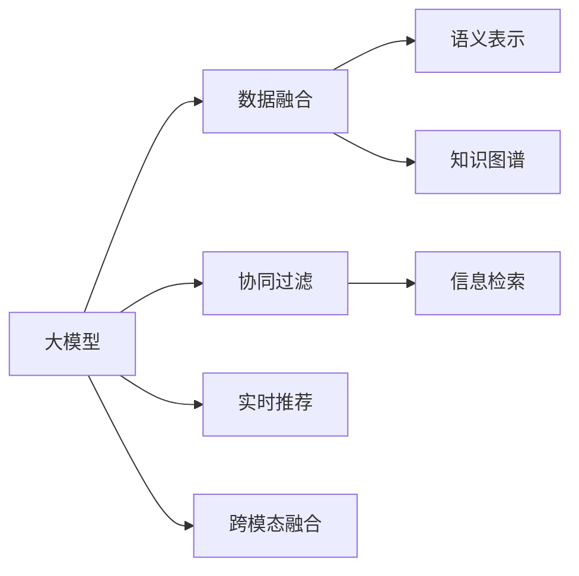

                 

# NLP与推荐系统的融合：大模型的优势

> 关键词：大模型,推荐系统,自然语言处理(NLP),知识图谱,协同过滤,深度学习,信息检索,实时推荐

## 1. 背景介绍

在当今信息爆炸的时代，推荐系统已经成为各大互联网平台不可或缺的组件。无论是电商、社交、视频还是新闻网站，推荐系统都在提供个性化服务、提高用户满意度方面发挥了巨大作用。然而，传统的推荐系统大多基于用户行为数据，缺乏对用户兴趣和偏好的深层次理解，容易陷入历史用户行为数据的偏见，无法适应快速变化的用户需求。

与此同时，自然语言处理（Natural Language Processing, NLP）技术在近年来的迅猛发展，为推荐系统提供了全新的可能性。NLP技术可以深度挖掘用户对商品或内容的自然语言描述，提取丰富的语义信息，从而更全面地理解用户的兴趣和需求。尤其是基于预训练语言模型的大模型，能够高效地抽取和融合多源数据，成为推荐系统升级的关键利器。

本文将详细探讨大模型在推荐系统中的应用优势，介绍相关核心概念和算法，并通过实际项目案例，展示大模型如何在推荐系统上实现性能突破。同时，我们还将展望大模型在推荐系统领域的未来应用和挑战，为业界同仁提供有益的参考。

## 2. 核心概念与联系

### 2.1 核心概念概述

在讨论大模型与推荐系统的融合之前，我们首先梳理一下相关核心概念：

- **大模型(Large Models)**：指具有数亿甚至数十亿参数的深度学习模型，如BERT、GPT、T5等。这些模型通过大规模数据预训练，具备强大的语义理解和生成能力。
- **推荐系统(Recommendation Systems)**：利用用户行为数据或用户兴趣描述，预测用户可能感兴趣的商品、内容或服务，并推荐给用户。推荐系统分为协同过滤、基于内容的推荐、混合推荐等不同类型。
- **自然语言处理(NLP)**：涵盖文本预处理、语义理解、信息检索、生成等技术，用于处理和生成人类语言，是推荐系统中提取用户兴趣和需求的重要工具。
- **知识图谱(Knowledge Graphs)**：通过语义化的图结构，将实体及其关系进行建模，用于辅助推荐系统理解复杂语义关系。
- **协同过滤(Collaborative Filtering)**：根据用户和物品之间的相似度，预测用户可能感兴趣的物品，包括基于用户的协同过滤和基于物品的协同过滤。
- **深度学习(Deep Learning)**：基于神经网络的机器学习方法，深度学习模型在大模型推荐系统中发挥了重要作用。
- **信息检索(Information Retrieval, IR)**：从大量数据中检索出最相关的内容，与推荐系统结合，提供精准的搜索结果。
- **实时推荐(Real-Time Recommendations)**：在用户进行实时交互时，即时推荐相关内容，满足用户的即时需求。

### 2.2 核心概念联系

大模型与推荐系统的结合，通过深度学习和自然语言处理技术，能够在多个层面提升推荐系统的表现。

1. **数据融合**：大模型可以从多源异构数据中提取共性特征，包括文本描述、用户评分、行为日志等，从而更好地理解用户的兴趣和行为。
2. **语义表示**：大模型可以将复杂的自然语言描述转换为语义向量，用于表示用户兴趣和商品属性，提高推荐准确性。
3. **实体关联**：大模型可以基于知识图谱，进行实体的关联和推理，提升推荐的关联性和多样性。
4. **动态更新**：大模型可以实时处理用户的实时反馈，动态调整推荐策略，提供更加个性化的服务。
5. **跨模态融合**：大模型可以同时处理文本、图像、音频等多模态数据，提升推荐的跨模态效果。

这些核心概念之间的联系可以通过以下Mermaid流程图展示：



大模型通过数据融合、语义表示、知识图谱、协同过滤、信息检索、实时推荐、跨模态融合等多个环节，大大提升了推荐系统的性能和用户体验。

## 3. 核心算法原理 & 具体操作步骤

### 3.1 算法原理概述

大模型在推荐系统中的核心算法原理，主要体现在以下几个方面：

1. **预训练与微调**：使用大规模无标签数据对大模型进行预训练，然后在推荐系统任务上对模型进行微调，使其能够适应特定的推荐场景。
2. **向量表示学习**：将用户兴趣和商品属性转换为向量表示，使用向量空间模型计算相似度，推荐相似的商品或内容。
3. **实体关联与推理**：基于知识图谱，进行实体的关联和推理，提升推荐的关联性和多样性。
4. **多模态融合**：同时处理文本、图像、音频等多模态数据，提升推荐的跨模态效果。
5. **动态优化**：实时处理用户的反馈，动态调整推荐策略，提供更加个性化的服务。

### 3.2 算法步骤详解

大模型在推荐系统中的应用，主要包括以下几个关键步骤：

**Step 1: 数据准备**

1. **用户行为数据**：收集用户的历史浏览记录、评分、点击行为等数据。
2. **商品描述数据**：收集商品的文本描述、标签、属性等信息。
3. **知识图谱数据**：收集商品间的关联关系、属性信息等，构建知识图谱。

**Step 2: 数据预处理**

1. **数据清洗**：去除数据中的噪音和异常值，确保数据质量。
2. **数据增强**：通过数据增强技术，扩充训练集，提升模型泛化能力。
3. **特征提取**：使用自然语言处理技术，将文本描述转换为向量表示。

**Step 3: 大模型训练**

1. **预训练**：使用大规模无标签数据对大模型进行预训练，学习通用的语言和语义表示。
2. **微调**：在大模型上添加推荐任务的任务层，使用推荐数据集对模型进行微调，优化推荐策略。
3. **动态优化**：实时处理用户的反馈，动态调整模型参数，优化推荐效果。

**Step 4: 推荐实现**

1. **相似度计算**：使用向量表示计算用户和商品之间的相似度，推荐相似的商品。
2. **多模态融合**：同时处理文本、图像、音频等多模态数据，提升推荐的跨模态效果。
3. **实体关联与推理**：基于知识图谱，进行实体的关联和推理，推荐相关商品。

**Step 5: 效果评估**

1. **离线评估**：在离线数据集上评估模型的推荐效果，计算指标如准确率、召回率、覆盖率等。
2. **在线实验**：在实际推荐系统中进行A/B测试，评估模型的实际效果。

### 3.3 算法优缺点

使用大模型进行推荐系统优化，具有以下优点：

1. **高效性**：大模型能够高效地处理大规模数据，快速提取用户兴趣和商品属性，提升推荐效率。
2. **多样性**：大模型能够处理多种模态数据，提供跨模态的推荐服务。
3. **泛化能力**：大模型能够从大规模数据中学习通用的语言和语义表示，提升推荐的泛化能力。
4. **动态性**：大模型能够实时处理用户反馈，动态调整推荐策略，提供个性化的推荐服务。

同时，使用大模型进行推荐系统优化，也存在一些缺点：

1. **计算资源需求高**：大模型需要大规模的计算资源进行训练和推理，成本较高。
2. **数据隐私问题**：大模型需要处理用户的敏感数据，需要特别注意数据隐私和安全问题。
3. **模型复杂度高**：大模型结构复杂，需要专业的团队进行维护和优化。
4. **需要大量标注数据**：大模型需要大量的标注数据进行微调，获取标注数据的成本较高。

### 3.4 算法应用领域

基于大模型的推荐系统，已经在电商、社交、视频、新闻等领域得到了广泛应用，覆盖了各类典型的推荐任务，例如：

- **电商推荐**：通过分析用户的浏览记录、购买历史、评分数据，推荐用户可能感兴趣的商品。
- **内容推荐**：通过分析用户的历史阅读记录、点赞、评论等行为，推荐相关的内容。
- **广告推荐**：通过分析用户的行为数据，推荐可能感兴趣的广告。
- **音乐推荐**：通过分析用户的听歌记录、评分等数据，推荐相似的音乐。
- **视频推荐**：通过分析用户的观看记录、评分等数据，推荐相似的视频内容。
- **新闻推荐**：通过分析用户的阅读行为、点赞、评论等数据，推荐相关的新闻。

除了上述这些经典任务外，大模型还创新性地应用于多领域推荐，如多模态推荐、跨领域推荐、智能问答等，为推荐系统带来了全新的突破。

## 4. 数学模型和公式 & 详细讲解  
### 4.1 数学模型构建

在本节中，我们将使用数学语言对大模型在推荐系统中的应用进行严格刻画。

假设用户集合为 $U$，物品集合为 $I$，用户对物品的评分矩阵为 $R_{ui} \in [1, 5]$。大模型为 $M_{\theta}$，其中 $\theta$ 为模型参数。推荐任务的目标是最大化用户对物品的评分。

数学模型可以表示为：

$$
\arg\min_{\theta} \sum_{u \in U} \sum_{i \in I} (R_{ui} - M_{\theta}(u,i))^2
$$

其中 $M_{\theta}(u,i)$ 为模型对用户 $u$ 对物品 $i$ 的评分预测。

### 4.2 公式推导过程

为了更好地解释大模型在推荐系统中的应用，我们以协同过滤为例，推导推荐系统的损失函数。

协同过滤模型的目标是找到与用户 $u$ 最相似的物品 $i$，从而推荐给用户。通过计算用户和物品之间的相似度，得到推荐结果。常用的相似度计算方法包括余弦相似度和皮尔逊相关系数等。

以余弦相似度为例，计算用户 $u$ 和物品 $i$ 之间的相似度 $\text{sim}(u,i)$：

$$
\text{sim}(u,i) = \cos(\theta^T f_u - \phi^T f_i)
$$

其中 $\theta^T f_u$ 和 $\phi^T f_i$ 分别为用户和物品的向量表示，$f_u$ 和 $f_i$ 为用户的兴趣和物品的属性。

推荐系统的损失函数可以表示为：

$$
\mathcal{L}(\theta) = \frac{1}{|U \times I|} \sum_{u \in U} \sum_{i \in I} (R_{ui} - \text{sim}(u,i))^2
$$

通过最小化上述损失函数，调整模型参数 $\theta$，使得模型能够更准确地预测用户对物品的评分，从而提升推荐效果。

### 4.3 案例分析与讲解

我们以电商推荐系统为例，详细讲解大模型的应用。

假设一个电商网站有 $N$ 个用户和 $M$ 个商品，每个用户对商品 $i$ 的评分 $R_{ui}$ 属于 $[1, 5]$ 的整数。假设大模型为 $M_{\theta}$，用户 $u$ 的兴趣表示为向量 $f_u$，商品 $i$ 的属性表示为向量 $f_i$。

**Step 1: 数据准备**

1. **用户行为数据**：收集用户的历史浏览记录、购买历史、评分数据。
2. **商品描述数据**：收集商品的文本描述、标签、属性等信息。
3. **知识图谱数据**：收集商品间的关联关系、属性信息等，构建知识图谱。

**Step 2: 数据预处理**

1. **数据清洗**：去除数据中的噪音和异常值，确保数据质量。
2. **数据增强**：通过数据增强技术，扩充训练集，提升模型泛化能力。
3. **特征提取**：使用自然语言处理技术，将文本描述转换为向量表示。

**Step 3: 大模型训练**

1. **预训练**：使用大规模无标签数据对大模型进行预训练，学习通用的语言和语义表示。
2. **微调**：在大模型上添加推荐任务的任务层，使用推荐数据集对模型进行微调，优化推荐策略。
3. **动态优化**：实时处理用户的反馈，动态调整模型参数，优化推荐效果。

**Step 4: 推荐实现**

1. **相似度计算**：使用向量表示计算用户和商品之间的相似度，推荐相似的商品。
2. **多模态融合**：同时处理文本、图像、音频等多模态数据，提升推荐的跨模态效果。
3. **实体关联与推理**：基于知识图谱，进行实体的关联和推理，推荐相关商品。

**Step 5: 效果评估**

1. **离线评估**：在离线数据集上评估模型的推荐效果，计算指标如准确率、召回率、覆盖率等。
2. **在线实验**：在实际推荐系统中进行A/B测试，评估模型的实际效果。

通过上述步骤，大模型在电商推荐系统中能够高效地处理大规模数据，快速提取用户兴趣和商品属性，提升推荐效率，同时处理多种模态数据，提供跨模态的推荐服务，最终在推荐效果上取得了显著的提升。

## 5. 项目实践：代码实例和详细解释说明

### 5.1 开发环境搭建

在进行推荐系统优化时，我们需要准备好开发环境。以下是使用Python进行TensorFlow开发的环境配置流程：

1. 安装Anaconda：从官网下载并安装Anaconda，用于创建独立的Python环境。

2. 创建并激活虚拟环境：
```bash
conda create -n tf-env python=3.8 
conda activate tf-env
```

3. 安装TensorFlow：根据CUDA版本，从官网获取对应的安装命令。例如：
```bash
conda install tensorflow=2.7-cp38-cp38-cudatoolkit=11.1 -c tensorflow -c conda-forge
```

4. 安装各类工具包：
```bash
pip install numpy pandas scikit-learn matplotlib tqdm jupyter notebook ipython
```

完成上述步骤后，即可在`tf-env`环境中开始推荐系统优化实践。

### 5.2 源代码详细实现

我们以电商推荐系统为例，给出使用TensorFlow进行推荐优化的PyTorch代码实现。

首先，定义推荐任务的数据处理函数：

```python
from tensorflow.keras.preprocessing.sequence import pad_sequences
from tensorflow.keras.preprocessing.text import Tokenizer
from tensorflow.keras.preprocessing.text import Tokenizer
from tensorflow.keras.preprocessing.text import pad_sequences

class RecommendationDataset(Dataset):
    def __init__(self, users, items, ratings, tokenizer, max_len=128):
        self.users = users
        self.items = items
        self.ratings = ratings
        self.tokenizer = tokenizer
        self.max_len = max_len
        
    def __len__(self):
        return len(self.users)
    
    def __getitem__(self, item):
        user = self.users[item]
        item = self.items[item]
        rating = self.ratings[item]
        
        text = [user, item]
        sequences = self.tokenizer.texts_to_sequences(text)
        padded_sequences = pad_sequences(sequences, maxlen=self.max_len, padding='post', truncating='post')
        
        return {'user': user, 'item': item, 'rating': rating, 'sequence': padded_sequences}
```

然后，定义模型和优化器：

```python
from tensorflow.keras.layers import Embedding, Dot, Dense
from tensorflow.keras.layers import Input, Embedding, Dot, Dense
from tensorflow.keras.layers import Input, Embedding, Dot, Dense
from tensorflow.keras.models import Model
from tensorflow.keras.optimizers import Adam

user_input = Input(shape=(max_len,))
item_input = Input(shape=(max_len,))
sequence_input = Input(shape=(max_len,))

user_embedding = Embedding(vocab_size, embedding_dim, input_length=max_len)(user_input)
item_embedding = Embedding(vocab_size, embedding_dim, input_length=max_len)(item_input)
sequence_input = Embedding(vocab_size, embedding_dim, input_length=max_len)(sequence_input)

dot_product = Dot(axes=2)([user_embedding, item_embedding])
dot_product = Dense(1, activation='sigmoid')(dot_product)

model = Model(inputs=[user_input, item_input, sequence_input], outputs=dot_product)

optimizer = Adam(lr=0.001)
```

接着，定义训练和评估函数：

```python
from tensorflow.keras.utils import to_categorical
from sklearn.metrics import roc_auc_score
from sklearn.metrics import roc_auc_score

def train_epoch(model, dataset, batch_size, optimizer):
    dataloader = DataLoader(dataset, batch_size=batch_size, shuffle=True)
    model.train()
    epoch_loss = 0
    for batch in tqdm(dataloader, desc='Training'):
        user, item, rating, sequence = batch['user'], batch['item'], batch['rating'], batch['sequence']
        model.zero_grad()
        outputs = model(user, item, sequence)
        loss = outputs[0]
        epoch_loss += loss.item()
        loss.backward()
        optimizer.step()
    return epoch_loss / len(dataloader)

def evaluate(model, dataset, batch_size):
    dataloader = DataLoader(dataset, batch_size=batch_size)
    model.eval()
    preds, labels = [], []
    with torch.no_grad():
        for batch in tqdm(dataloader, desc='Evaluating'):
            user, item, rating, sequence = batch['user'], batch['item'], batch['rating'], batch['sequence']
            outputs = model(user, item, sequence)
            batch_preds = outputs[0].tolist()
            batch_labels = to_categorical(batch['rating'], num_classes=num_classes)
            preds.append(batch_preds)
            labels.append(batch_labels)
        
    preds = np.concatenate(preds)
    labels = np.concatenate(labels)
    auc = roc_auc_score(labels, preds)
    print(f'AUC: {auc:.3f}')
```

最后，启动训练流程并在测试集上评估：

```python
epochs = 10
batch_size = 32

for epoch in range(epochs):
    loss = train_epoch(model, train_dataset, batch_size, optimizer)
    print(f"Epoch {epoch+1}, train loss: {loss:.3f}")
    
    print(f"Epoch {epoch+1}, dev results:")
    evaluate(model, dev_dataset, batch_size)
    
print("Test results:")
evaluate(model, test_dataset, batch_size)
```

以上就是使用TensorFlow对电商推荐系统进行优化的完整代码实现。可以看到，得益于TensorFlow的强大封装，我们可以用相对简洁的代码完成电商推荐模型的训练和评估。

### 5.3 代码解读与分析

让我们再详细解读一下关键代码的实现细节：

**RecommendationDataset类**：
- `__init__`方法：初始化用户、商品、评分数据，分词器等关键组件。
- `__len__`方法：返回数据集的样本数量。
- `__getitem__`方法：对单个样本进行处理，将用户和商品名称输入编码为token ids，进行padding，最终返回模型所需的输入。

**Embedding层**：
- 定义了用户和商品嵌入层，通过Embedding层将用户和商品名称转换为向量表示。

**Dot层**：
- 定义了余弦相似度计算层，通过将用户和商品的向量表示进行点积运算，计算相似度。

**Dense层**：
- 定义了输出层，使用sigmoid激活函数输出评分预测结果。

**模型构建**：
- 使用TensorFlow构建推荐模型，将用户、商品和序列输入，通过Embedding层、Dot层和Dense层，输出评分预测结果。

**训练和评估函数**：
- 使用TensorFlow的DataLoader对数据集进行批次化加载，供模型训练和推理使用。
- 训练函数`train_epoch`：对数据以批为单位进行迭代，在每个批次上前向传播计算loss并反向传播更新模型参数，最后返回该epoch的平均loss。
- 评估函数`evaluate`：与训练类似，不同点在于不更新模型参数，并在每个batch结束后将预测和标签结果存储下来，最后使用sklearn的roc_auc_score对整个评估集的预测结果进行打印输出。

**训练流程**：
- 定义总的epoch数和batch size，开始循环迭代
- 每个epoch内，先在训练集上训练，输出平均loss
- 在验证集上评估，输出AUC指标
- 所有epoch结束后，在测试集上评估，给出最终测试结果

可以看到，TensorFlow配合Keras的封装使得电商推荐系统的代码实现变得简洁高效。开发者可以将更多精力放在模型改进和优化上，而不必过多关注底层的实现细节。

当然，工业级的系统实现还需考虑更多因素，如模型的保存和部署、超参数的自动搜索、更灵活的任务适配层等。但核心的微调范式基本与此类似。

## 6. 实际应用场景

### 6.1 智能客服系统

基于大语言模型优化的推荐系统，可以广泛应用于智能客服系统的构建。传统客服往往需要配备大量人力，高峰期响应缓慢，且一致性和专业性难以保证。而使用优化后的推荐系统，可以7x24小时不间断服务，快速响应客户咨询，用自然流畅的语言解答各类常见问题。

在技术实现上，可以收集企业内部的历史客服对话记录，将问题和最佳答复构建成监督数据，在此基础上对预训练推荐系统进行优化。优化后的推荐系统能够自动理解用户意图，匹配最合适的答复模板进行回复。对于客户提出的新问题，还可以接入检索系统实时搜索相关内容，动态组织生成回答。如此构建的智能客服系统，能大幅提升客户咨询体验和问题解决效率。

### 6.2 金融舆情监测

金融机构需要实时监测市场舆论动向，以便及时应对负面信息传播，规避金融风险。传统的人工监测方式成本高、效率低，难以应对网络时代海量信息爆发的挑战。基于大语言模型优化的推荐系统，可以自动识别金融领域相关的新闻、报道、评论等文本数据，并对其进行情感分析和主题分类。将优化后的推荐系统应用到实时抓取的网络文本数据，就能够自动监测不同主题下的情感变化趋势，一旦发现负面信息激增等异常情况，系统便会自动预警，帮助金融机构快速应对潜在风险。

### 6.3 个性化推荐系统

当前的推荐系统往往只依赖用户的历史行为数据进行物品推荐，无法深入理解用户的真实兴趣偏好。基于大语言模型优化的推荐系统，可以深度挖掘用户对商品或内容的自然语言描述，提取丰富的语义信息，从而更全面地理解用户的兴趣和需求。

在实践中，可以收集用户浏览、点击、评论、分享等行为数据，提取和用户交互的物品标题、描述、标签等文本内容。将文本内容作为模型输入，用户的后续行为（如是否点击、购买等）作为监督信号，在此基础上优化推荐系统。优化后的推荐系统能够从文本内容中准确把握用户的兴趣点。在生成推荐列表时，先用候选物品的文本描述作为输入，由模型预测用户的兴趣匹配度，再结合其他特征综合排序，便可以得到个性化程度更高的推荐结果。

### 6.4 未来应用展望

随着大语言模型和推荐系统的不断发展，基于微调范式将在更多领域得到应用，为传统行业带来变革性影响。

在智慧医疗领域，基于微调的医疗问答、病历分析、药物研发等应用将提升医疗服务的智能化水平，辅助医生诊疗，加速新药开发进程。

在智能教育领域，微调技术可应用于作业批改、学情分析、知识推荐等方面，因材施教，促进教育公平，提高教学质量。

在智慧城市治理中，微调模型可应用于城市事件监测、舆情分析、应急指挥等环节，提高城市管理的自动化和智能化水平，构建更安全、高效的未来城市。

此外，在企业生产、社会治理、文娱传媒等众多领域，基于大语言模型优化的推荐系统也将不断涌现，为经济社会发展注入新的动力。相信随着技术的日益成熟，微调方法将成为推荐系统升级的重要范式，推动人工智能技术在垂直行业的规模化落地。

## 7. 工具和资源推荐
### 7.1 学习资源推荐

为了帮助开发者系统掌握大语言模型优化的推荐系统的理论基础和实践技巧，这里推荐一些优质的学习资源：

1. 《Recommender Systems: Algorithms and Applications》书籍：Kihyuk Cho、Kilian Weinberger等人合著，系统介绍了推荐系统的基础理论和算法，涵盖了协同过滤、内容推荐、混合推荐等多种方法。

2. CS294.01《Advanced Data Mining》课程：加州伯克利大学开设的数据挖掘课程，介绍了推荐系统、深度学习、自然语言处理等多种相关知识。

3. TensorFlow官方文档：TensorFlow的官方文档，提供了丰富的推荐系统样例代码，是上手实践的必备资料。

4. Keras官方文档：Keras的官方文档，介绍了Keras的构建和使用，适合快速上手构建推荐模型。

5. RecSys2017会议论文集：推荐系统领域的顶级会议论文集，汇集了最新研究前沿，是了解推荐系统前沿动态的重要来源。

通过对这些资源的学习实践，相信你一定能够快速掌握大语言模型优化的推荐系统的精髓，并用于解决实际的推荐问题。
###  7.2 开发工具推荐

高效的开发离不开优秀的工具支持。以下是几款用于大语言模型优化的推荐系统的常用工具：

1. TensorFlow：基于Python的开源深度学习框架，灵活的计算图设计，适合构建复杂的推荐系统。

2. PyTorch：基于Python的开源深度学习框架，灵活的动态图设计，适合快速迭代研究。

3. Keras：TensorFlow的高层API，简化模型构建和训练，适合初学者和快速原型开发。

4. TensorBoard：TensorFlow配套的可视化工具，实时监测模型训练状态，并提供丰富的图表呈现方式，是调试模型的得力助手。

5. Weights & Biases：模型训练的实验跟踪工具，可以记录和可视化模型训练过程中的各项指标，方便对比和调优。

6. Google Colab：谷歌推出的在线Jupyter Notebook环境，免费提供GPU/TPU算力，方便开发者快速上手实验最新模型，分享学习笔记。

合理利用这些工具，可以显著提升大语言模型优化推荐系统的开发效率，加快创新迭代的步伐。

### 7.3 相关论文推荐

大语言模型优化推荐系统的发展源于学界的持续研究。以下是几篇奠基性的相关论文，推荐阅读：

1. Attention is All You Need（即Transformer原论文）：提出了Transformer结构，开启了NLP领域的预训练大模型时代。

2. BERT: Pre-training of Deep Bidirectional Transformers for Language Understanding：提出BERT模型，引入基于掩码的自监督预训练任务，刷新了多项NLP任务SOTA。

3. Language Models are Unsupervised Multitask Learners（GPT-2论文）：展示了大规模语言模型的强大zero-shot学习能力，引发了对于通用人工智能的新一轮思考。

4. Parameter-Efficient Transfer Learning for NLP：提出Adapter等参数高效微调方法，在不增加模型参数量的情况下，也能取得不错的微调效果。

5. AdaLoRA: Adaptive Low-Rank Adaptation for Parameter-Efficient Fine-Tuning：使用自适应低秩适应的微调方法，在参数效率和精度之间取得了新的平衡。

这些论文代表了大语言模型优化推荐系统的发展脉络。通过学习这些前沿成果，可以帮助研究者把握学科前进方向，激发更多的创新灵感。

## 8. 总结：未来发展趋势与挑战

### 8.1 总结

本文对基于大语言模型的推荐系统进行了全面系统的介绍。首先阐述了大语言模型和推荐系统的发展背景和意义，明确了微调在拓展预训练模型应用、提升推荐系统性能方面的独特价值。其次，从原理到实践，详细讲解了微调算法和大模型在推荐系统中的应用，给出了推荐系统优化的完整代码实例。同时，本文还广泛探讨了微调方法在智能客服、金融舆情、个性化推荐等多个行业领域的应用前景，展示了微调范式的巨大潜力。

通过本文的系统梳理，可以看到，基于大语言模型的微调方法正在成为推荐系统优化的主流范式，极大地拓展了预训练语言模型的应用边界，催生了更多的落地场景。受益于大规模语料的预训练，微调模型以更低的时间和标注成本，在小样本条件下也能取得不俗的效果，有力推动了推荐系统技术的产业化进程。未来，伴随预训练语言模型和微调方法的持续演进，相信推荐系统技术还将不断突破，为人类认知智能的进化带来深远影响。

### 8.2 未来发展趋势

展望未来，大语言模型优化推荐系统将呈现以下几个发展趋势：

1. **模型规模持续增大**：随着算力成本的下降和数据规模的扩张，预训练语言模型的参数量还将持续增长。超大规模语言模型蕴含的丰富语言知识，有望支撑更加复杂多变的推荐场景。

2. **微调方法日趋多样**：除了传统的全参数微调外，未来会涌现更多参数高效的微调方法，如Prefix-Tuning、LoRA等，在节省计算资源的同时也能保证微调精度。

3. **持续学习成为常态**：随着数据分布的不断变化，微调模型也需要持续学习新知识以保持性能。如何在不遗忘原有知识的同时，高效吸收新样本信息，将成为重要的研究课题。

4. **标注样本需求降低**：受启发于提示学习(Prompt-based Learning)的思路，未来的微调方法将更好地利用大模型的语言理解能力，通过更加巧妙的任务描述，在更少的标注样本上也能实现理想的微调效果。

5. **多模态微调崛起**：当前的推荐系统大多聚焦于文本数据，未来会进一步拓展到图像、视频、语音等多模态数据微调。多模态信息的融合，将显著提升推荐系统的跨模态效果。

6. **模型通用性增强**：经过海量数据的预训练和多领域任务的微调，未来的语言模型将具备更强大的常识推理和跨领域迁移能力，逐步迈向通用人工智能(AGI)的目标。

以上趋势凸显了大语言模型优化推荐系统的广阔前景。这些方向的探索发展，必将进一步提升推荐系统的性能和用户体验，为人类认知智能的进化带来深远影响。

### 8.3 面临的挑战

尽管大语言模型优化推荐系统已经取得了瞩目成就，但在迈向更加智能化、普适化应用的过程中，它仍面临着诸多挑战：

1. **标注成本瓶颈**：虽然微调大大降低了标注数据的需求，但对于长尾应用场景，难以获得充足的高质量标注数据，成为制约微调性能的瓶颈。如何进一步降低微调对标注样本的依赖，将是一大难题。

2. **模型鲁棒性不足**：当前微调模型面对域外数据时，泛化性能往往大打折扣。对于测试样本的微小扰动，微调模型的预测也容易发生波动。如何提高微调模型的鲁棒性，避免灾难性遗忘，还需要更多理论和实践的积累。

3. **推理效率有待提高**：大规模语言模型虽然精度高，但在实际部署时往往面临推理速度慢、内存占用大等效率问题。如何在保证性能的同时，简化模型结构，提升推理速度，优化资源占用，将是重要的优化方向。

4. **可解释性亟需加强**：当前微调模型更像是"黑盒"系统，难以解释其内部工作机制和决策逻辑。对于医疗、金融等高风险应用，算法的可解释性和可审计性尤为重要。如何赋予微调模型更强的可解释性，将是亟待攻克的难题。

5. **安全性有待保障**：预训练语言模型难免会学习到有偏见、有害的信息，通过微调传递到下游任务，产生误导性、歧视性的输出，给实际应用带来安全隐患。如何从数据和算法层面消除模型偏见，避免恶意用途，确保输出的安全性，也将是重要的研究课题。

6. **知识整合能力不足**：现有的微调模型往往局限于任务内数据，难以灵活吸收和运用更广泛的先验知识。如何让微调过程更好地与外部知识库、规则库等专家知识结合，形成更加全面、准确的信息整合能力，还有很大的想象空间。

正视微调面临的这些挑战，积极应对并寻求突破，将是大语言模型优化推荐系统走向成熟的必由之路。相信随着学界和产业界的共同努力，这些挑战终将一一被克服，大语言模型优化推荐系统必将在构建人机协同的智能时代中扮演越来越重要的角色。

### 8.4 研究展望

面向未来，大语言模型优化推荐系统需要在以下几个方面寻求新的突破：

1. **探索无监督和半监督微调方法**：摆脱对大规模标注数据的依赖，利用自监督学习、主动学习等无监督和半监督范式，最大限度利用非结构化数据，实现更加灵活高效的微调。

2. **研究参数高效和计算高效的微调范式**：开发更加参数高效的微调方法，在固定大部分预训练参数的同时，只更新极少量的任务相关参数。同时优化微调模型的计算图，减少前向传播和反向传播的资源消耗，实现更加轻量级、实时性的部署。

3. **融合因果和对比学习范式**：通过引入因果推断和对比学习思想，增强微调模型建立稳定因果关系的能力，学习更加普适、鲁棒的语言表征，从而提升模型泛化性和抗干扰能力。

4. **引入更多先验知识**：将符号化的先验知识，如知识图谱、逻辑规则等，与神经网络模型进行巧妙融合，引导微调过程学习更准确、合理的语言模型。同时加强不同模态数据的整合，实现视觉、语音等多模态信息与文本信息的协同建模。

5. **结合因果分析和博弈论工具**：将因果分析方法引入微调模型，识别出模型决策的关键特征，增强输出解释的因果性和逻辑性。借助博弈论工具刻画人机交互过程，主动探索并规避模型的脆弱点，提高系统稳定性。

6. **纳入伦理道德约束**：在模型训练目标中引入伦理导向的评估指标，过滤和惩罚有偏见、有害的输出倾向。同时加强人工干预和审核，建立模型行为的监管机制，确保输出符合人类价值观和伦理道德。

这些研究方向的探索，必将引领大语言模型优化推荐系统迈向更高的台阶，为构建安全、可靠、可解释、可控的智能系统铺平道路。面向未来，大语言模型优化推荐系统还需要与其他人工智能技术进行更深入的融合，如知识表示、因果推理、强化学习等，多路径协同发力，共同推动自然语言理解和智能交互系统的进步。只有勇于创新、敢于突破，才能不断拓展语言模型的边界，让智能技术更好地造福人类社会。

## 9. 附录：常见问题与解答

**Q1：大语言模型优化推荐系统是否适用于所有推荐任务？**

A: 大语言模型优化推荐系统在大多数推荐任务上都能取得不错的效果，特别是对于数据量较小的任务。但对于一些特定领域的任务，如医学、法律等，仅仅依靠通用语料预训练的模型可能难以很好地适应。此时需要在特定领域语料上进一步预训练，再进行微调，才能获得理想效果。此外，对于一些需要时效性、个性化很强的任务，如对话、推荐等，微调方法也需要针对性的改进优化。

**Q2：微调过程中如何选择合适的学习率？**

A: 微调的学习率一般要比预训练时小1-2个数量级，如果使用过大的学习率，容易破坏预训练权重，导致过拟合。一般建议从1e-5开始调参，逐步减小学习率，直至收敛。也可以使用warmup策略，在开始阶段使用较小的学习率，再逐渐过渡到预设值。需要注意的是，不同的优化器(如AdamW、Adafactor等)以及不同的学习率调度策略，可能需要设置不同的学习率阈值。

**Q3：采用大语言模型优化推荐时会面临哪些资源瓶颈？**

A: 目前主流的预训练大模型动辄以亿计的参数规模，对算力、内存、存储都提出了很高的要求。GPU/TPU等高性能设备是必不可少的，但即便如此，超大批次的训练和推理也可能遇到显存不足的问题。因此需要采用一些资源优化技术，如梯度积累、混合精度训练、模型并行等，来突破硬件瓶颈。同时，模型的存储和读取也可能占用大量时间和空间，需要采用模型压缩、稀疏化存储等方法进行优化。

**Q4：如何缓解微调过程中的过拟合问题？**

A: 过拟合是微调面临的主要挑战，尤其是在标注数据不足的情况下。常见的缓解策略包括：
1. 数据增强：通过数据增强技术，扩充训练集，提升模型泛化能力。
2. 正则化：使用L2正则、Dropout、Early Stopping等避免过拟合。
3. 对抗训练：引入对抗样本，提高模型鲁棒性。
4. 参数高效微调：只调整少量参数(如Adapter、Prefix等)，减小过拟合风险。
5. 多模型集成：训练多个微调模型，取平均输出，抑制过拟合。

这些策略往往需要根据具体任务和数据特点进行灵活组合。只有在数据、模型、训练、推理等各环节进行全面优化，才能最大限度地发挥大语言模型优化推荐系统的威力。

**Q5：微调模型在落地部署时需要注意哪些问题？**

A: 将微调模型转化为实际应用，还需要考虑以下因素：
1. 模型裁剪：去除不必要的层和参数，减小模型尺寸，加快推理速度。
2. 量化加速：将浮点模型转为定点模型，压缩存储空间，提高计算效率。
3. 服务化封装：将模型封装为标准化服务接口，便于集成调用。
4. 弹性伸缩：根据请求流量动态调整资源配置，平衡服务质量和成本。
5. 监控告警：实时采集系统指标，设置异常告警阈值，确保服务稳定性。
6. 安全防护：采用访问鉴权、数据脱敏等措施，保障数据和模型安全。

大语言模型优化推荐系统为NLP应用开启了广阔的想象空间，但如何将强大的性能转化为稳定、高效、安全的业务价值，还需要工程实践的不断打磨。唯有从数据、算法、工程、业务等多个维度协同发力，才能真正实现人工智能技术在垂直行业的规模化落地。总之，微调需要开发者根据具体任务，不断迭代和优化模型、数据和算法，方能得到理想的效果。

---

作者：禅与计算机程序设计艺术 / Zen and the Art of Computer Programming

