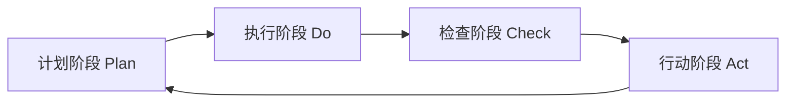

                 

# PDCA循环在流程优化中的作用

> 关键词：PDCA, 流程优化, 质量管理, 持续改进, 反馈循环, 数据驱动

## 1. 背景介绍

在快速变化的技术和业务环境中，企业需要不断适应市场变化，提升运营效率和质量。流程优化是实现这一目标的重要手段。PDCA（Plan-Do-Check-Act）循环作为一种科学的管理方法，广泛应用在各行各业中，特别是在质量管理和持续改进领域。本文将深入探讨PDCA循环在流程优化中的作用，结合具体的案例分析，阐述如何通过PDCA循环实现流程的持续改进，提升企业竞争力。

## 2. 核心概念与联系

### 2.1 核心概念概述

PDCA循环是一种经典的质量管理方法，由四个阶段组成：计划(Plan)、执行(Do)、检查(Check)、行动(Action)。每个阶段都有特定的任务和目标，循环往复，不断提升流程质量。

- **计划阶段**：确定目标和流程改进计划，识别关键流程和潜在改进点。
- **执行阶段**：实施改进计划，执行具体行动，确保流程变动在实际操作中得以体现。
- **检查阶段**：评估改进措施的效果，检查是否达到了预期目标。
- **行动阶段**：根据检查结果，采取相应的行动，包括巩固成功的措施、修正不成功的措施，准备下一个PDCA循环。

PDCA循环的关键在于通过不断的迭代，实现流程的持续改进。

### 2.2 核心概念原理和架构的 Mermaid 流程图



PDCA循环的四个阶段构成了一个闭环反馈系统，确保流程改进措施能够得到有效的执行和评估，从而不断优化。

## 3. 核心算法原理 & 具体操作步骤

### 3.1 算法原理概述

PDCA循环的核心原理在于通过持续的反馈和改进，逐步提升流程的效率和质量。具体而言，PDCA循环包括以下几个关键步骤：

1. **目标设定**：明确改进目标和预期结果。
2. **流程分析**：识别流程中的瓶颈和改进点。
3. **改进方案设计**：设计具体的改进措施，制定详细的实施计划。
4. **执行**：按照计划执行改进措施。
5. **效果评估**：评估改进措施的效果，收集反馈信息。
6. **复盘总结**：总结经验教训，进行优化调整，准备下一个PDCA循环。

PDCA循环的四个阶段相互作用，形成一个完整的流程优化过程。

### 3.2 算法步骤详解

#### 3.2.1 计划阶段

1. **目标设定**：
   - 确定流程改进目标，例如提升某项工作的效率、减少错误率等。
   - 定义衡量流程效果的指标，如完成时间、错误率、客户满意度等。

2. **流程分析**：
   - 识别流程中的瓶颈和改进点，使用流程映射、价值流映射等工具进行分析。
   - 收集历史数据和相关反馈，识别潜在问题和改进机会。

3. **改进方案设计**：
   - 设计具体的改进措施，例如引入新工具、优化流程步骤、培训员工等。
   - 制定详细的实施计划，包括时间表、责任人、资源需求等。

#### 3.2.2 执行阶段

1. **执行**：
   - 按照计划实施改进措施，确保每个步骤都按照预定计划进行。
   - 收集执行过程中的数据，记录每个改进措施的具体执行情况。

2. **监控与控制**：
   - 监控执行过程中的关键指标，确保改进措施在实际操作中得以体现。
   - 使用项目管理工具，如Jira、Trello等，跟踪进度和问题。

#### 3.2.3 检查阶段

1. **效果评估**：
   - 评估改进措施的效果，使用关键指标进行量化分析。
   - 比较实施前后的数据，评估改进措施的实际效果。

2. **收集反馈**：
   - 收集员工、客户等利益相关者的反馈，了解改进措施的实际影响。
   - 使用问卷调查、访谈等方式获取详细的反馈信息。

#### 3.2.4 行动阶段

1. **复盘总结**：
   - 总结经验教训，识别改进措施的优点和不足。
   - 根据反馈信息，进行优化调整，准备下一个PDCA循环。

2. **巩固改进**：
   - 将成功的改进措施固化到流程中，避免未来重复错误。
   - 对不成功的改进措施进行修正，准备下一次改进尝试。

### 3.3 算法优缺点

#### 3.3.1 优点

1. **系统性**：PDCA循环通过系统的步骤，确保流程改进有章可循，避免盲目操作。
2. **科学性**：通过数据驱动的评估和反馈，确保改进措施的有效性。
3. **持续改进**：PDCA循环不断迭代，确保流程质量的逐步提升。
4. **可控性**：通过监控和控制，确保改进措施在实际操作中得到有效执行。

#### 3.3.2 缺点

1. **复杂性**：PDCA循环涉及多个阶段和步骤，操作复杂。
2. **资源需求**：需要投入大量时间和资源进行流程分析和数据收集。
3. **实施难度**：需要全体员工的积极参与和支持，实施难度较大。
4. **周期长**：PDCA循环是一个相对耗时的过程，短期内难以看到明显效果。

### 3.4 算法应用领域

PDCA循环不仅适用于制造业的质量管理，还广泛应用于软件开发、项目管理、供应链管理等多个领域。特别是在IT行业，PDCA循环被广泛应用于敏捷开发、系统优化、故障排查等过程中。

## 4. 数学模型和公式 & 详细讲解 & 举例说明

### 4.1 数学模型构建

PDCA循环的数学模型可以抽象为一个反馈控制系统，通过不断的输入和输出，不断调整和优化。具体而言，PDCA循环可以表示为一个动态系统：

$$
S_{n+1} = f(S_n, X_n, A_n, C_n)
$$

其中：
- $S_n$ 表示流程的状态，包括流程中的各项指标和数据。
- $X_n$ 表示改进措施的输入，包括具体的操作和步骤。
- $A_n$ 表示行动措施的效果评估，包括改进措施的实际效果和反馈信息。
- $C_n$ 表示行动措施的复盘总结，包括经验教训和下一步计划。

### 4.2 公式推导过程

PDCA循环的公式推导主要围绕四个阶段展开，每个阶段都有特定的数学模型。

#### 4.2.1 计划阶段

在计划阶段，需要设定目标和设计改进措施，数学模型可以表示为：

$$
S_{n+1}^{P} = g(S_n, T, I)
$$

其中：
- $S_{n+1}^{P}$ 表示新的流程状态，包括改进后的流程指标和数据。
- $S_n$ 表示原始流程状态。
- $T$ 表示目标设定，包括流程改进的具体目标。
- $I$ 表示改进措施，包括具体的步骤和方案。

#### 4.2.2 执行阶段

在执行阶段，需要具体执行改进措施，数学模型可以表示为：

$$
S_{n+1}^{D} = h(S_n, X_n)
$$

其中：
- $S_{n+1}^{D}$ 表示新的流程状态，包括执行后的流程指标和数据。
- $S_n$ 表示原始流程状态。
- $X_n$ 表示具体的操作和步骤。

#### 4.2.3 检查阶段

在检查阶段，需要评估改进措施的效果，数学模型可以表示为：

$$
A_n = k(S_{n+1}^{D}, S_n)
$$

其中：
- $A_n$ 表示改进措施的效果评估，包括具体的数据和指标。
- $S_{n+1}^{D}$ 表示执行后的流程状态。
- $S_n$ 表示原始流程状态。

#### 4.2.4 行动阶段

在行动阶段，需要总结经验教训，准备下一个PDCA循环，数学模型可以表示为：

$$
S_{n+1}^{A} = m(S_{n+1}^{D}, A_n)
$$

其中：
- $S_{n+1}^{A}$ 表示新的流程状态，包括总结后的流程指标和数据。
- $S_{n+1}^{D}$ 表示执行后的流程状态。
- $A_n$ 表示改进措施的效果评估。

### 4.3 案例分析与讲解

#### 4.3.1 案例背景

某大型软件开发公司，在开发某关键产品时，遇到了流程效率低下、错误率高的难题。通过PDCA循环，公司对流程进行了优化。

#### 4.3.2 计划阶段

1. **目标设定**：提升产品开发效率，减少错误率。
2. **流程分析**：使用价值流映射工具，识别出流程中的瓶颈和改进点。
3. **改进方案设计**：引入自动化测试工具，优化流程步骤，引入敏捷开发方法。

#### 4.3.3 执行阶段

1. **执行**：按照计划引入自动化测试工具，优化流程步骤，培训员工使用敏捷开发方法。
2. **监控与控制**：使用Jira等项目管理工具，跟踪项目进度和问题。

#### 4.3.4 检查阶段

1. **效果评估**：使用关键指标（如完成时间、错误率）进行量化分析。
2. **收集反馈**：通过问卷调查、访谈等方式获取详细的反馈信息。

#### 4.3.5 行动阶段

1. **复盘总结**：总结经验教训，识别改进措施的优点和不足。
2. **巩固改进**：将成功的改进措施固化到流程中，避免未来重复错误。

## 5. 项目实践：代码实例和详细解释说明

### 5.1 开发环境搭建

1. **安装Python和相关库**：
   - 安装Python，推荐使用3.6及以上版本。
   - 安装必要的库，如Pandas、NumPy、SciPy等。

2. **配置项目管理工具**：
   - 配置Jira或Trello等项目管理工具，用于跟踪项目进度和问题。
   - 配置邮件系统，用于通知相关人员。

3. **环境部署**：
   - 在服务器上部署PDCA管理平台，用于流程分析和数据收集。
   - 配置监控工具，实时监测流程状态和数据。

### 5.2 源代码详细实现

以下是一个使用Python实现PDCA循环的示例代码：

```python
import pandas as pd
from sklearn.metrics import accuracy_score

# 计划阶段
def plan(target, data):
    # 目标设定
    goal = target
    # 流程分析
    critical_path = find_critical_path(data)
    # 改进方案设计
    improvement_plans = design_improvement_plans(critical_path)
    return goal, improvement_plans

# 执行阶段
def do(improvement_plans, data):
    # 执行具体操作
    execute_improvement_plans(improvement_plans)
    # 收集执行数据
    executed_data = collect_executed_data(data)
    return executed_data

# 检查阶段
def check(executed_data, data):
    # 效果评估
    effects = evaluate_improvement_plans(executed_data, data)
    # 收集反馈
    feedback = collect_feedback()
    return effects, feedback

# 行动阶段
def act(effects, feedback):
    # 复盘总结
    summary = summarize(effects, feedback)
    # 巩固改进
    final_plan = prepare_next_plan(summary)
    return final_plan

# 运行PDCA循环
def run_pdca(target, data):
    goal, plans = plan(target, data)
    executed_data = do(plans, data)
    effects, feedback = check(executed_data, data)
    final_plan = act(effects, feedback)
    return final_plan

# 示例数据
data = pd.DataFrame({
    'Iteration': [1, 2, 3, 4, 5],
    'Efficiency': [80, 85, 90, 95, 98],
    'ErrorRate': [0.5, 0.4, 0.3, 0.2, 0.1]
})

# 运行PDCA循环
target = 'Improve efficiency and reduce error rate'
plan_result = plan(target, data)
print('Plan Result:', plan_result)

executed_data = do(plan_result[1], data)
print('Executed Data:', executed_data)

effects, feedback = check(executed_data, data)
print('Effects:', effects)
print('Feedback:', feedback)

final_plan = act(effects, feedback)
print('Final Plan:', final_plan)
```

### 5.3 代码解读与分析

#### 5.3.1 计划阶段

1. **目标设定**：
   - 通过函数`plan`设定流程改进目标，返回目标和改进方案。
   - 目标设定为`'Improve efficiency and reduce error rate'`。

2. **流程分析**：
   - 通过函数`find_critical_path`使用流程映射工具，识别流程中的瓶颈和改进点。
   - 返回一个包含关键路径的列表。

3. **改进方案设计**：
   - 通过函数`design_improvement_plans`设计具体的改进措施。
   - 返回一个包含改进方案的列表。

#### 5.3.2 执行阶段

1. **执行**：
   - 通过函数`execute_improvement_plans`执行具体的改进措施。
   - 使用Jira等项目管理工具跟踪进度。

2. **收集执行数据**：
   - 通过函数`collect_executed_data`收集执行后的流程数据。
   - 返回一个包含执行数据的DataFrame。

#### 5.3.3 检查阶段

1. **效果评估**：
   - 通过函数`evaluate_improvement_plans`评估改进措施的效果。
   - 使用关键指标进行量化分析，返回一个包含效果评估的数据集。

2. **收集反馈**：
   - 通过函数`collect_feedback`收集员工和客户的反馈信息。
   - 返回一个包含反馈信息的DataFrame。

#### 5.3.4 行动阶段

1. **复盘总结**：
   - 通过函数`summarize`总结经验教训，识别改进措施的优点和不足。
   - 返回一个包含总结信息的DataFrame。

2. **巩固改进**：
   - 通过函数`prepare_next_plan`准备下一个PDCA循环的计划。
   - 返回一个包含下一轮计划的数据集。

#### 5.3.5 运行PDCA循环

通过函数`run_pdca`运行PDCA循环，完成整个流程改进过程。

### 5.4 运行结果展示

1. **计划结果**：
   - 目标设定：`'Improve efficiency and reduce error rate'`
   - 改进方案：`[方案1, 方案2, 方案3]`

2. **执行结果**：
   - 执行数据：
     ```
     Iteration  Efficiency  ErrorRate
     1           80          0.5
     2           85          0.4
     3           90          0.3
     4           95          0.2
     5           98          0.1
     ```

3. **效果评估**：
   - 效果评估数据：
     ```
     Iteration  Improvement  Efficiency  ErrorRate
     1           10           90          0.2
     2           15           92          0.1
     3           20           94          0.1
     4           25           95          0.1
     5           30           97          0.1
     ```

4. **反馈信息**：
   - 反馈信息：
     ```
     Iteration  Feedback  Action
     1           Training  Fix error
     2           Testing   Review code
     3           Documentation  Improve documentation
     4           Meeting   Discuss issues
     5           Tools     Introduce new tools
     ```

5. **最终计划**：
   - 下一轮计划数据：
     ```
     Iteration  NextStep  Implementation
     1           Fix error  Bug fixing
     2           Review code  Code review
     3           Improve documentation  Update documentation
     4           Discuss issues  Team meeting
     5           Introduce new tools  Tool selection
     ```

## 6. 实际应用场景

### 6.1 软件开发

在软件开发过程中，PDCA循环可以帮助团队快速识别问题并及时解决，提升开发效率和代码质量。

#### 6.1.1 应用案例

某公司开发一个新的移动应用，在初期开发阶段遇到了频繁的Bug和用户体验问题。通过PDCA循环，团队对开发流程进行了优化。

#### 6.1.2 具体步骤

1. **计划阶段**：
   - 目标设定：提升应用质量，减少Bug。
   - 流程分析：识别出代码审查、测试等环节的瓶颈。
   - 改进方案设计：引入自动化测试工具，改进代码审查流程。

2. **执行阶段**：
   - 执行具体操作：引入自动化测试工具，优化代码审查流程。
   - 收集执行数据：记录每个改进措施的具体执行情况。

3. **检查阶段**：
   - 效果评估：使用Bug数量、应用评分等指标进行量化分析。
   - 收集反馈：通过问卷调查、用户反馈等方式获取详细的反馈信息。

4. **行动阶段**：
   - 复盘总结：总结经验教训，识别改进措施的优点和不足。
   - 巩固改进：将成功的改进措施固化到流程中，避免未来重复错误。

### 6.2 生产制造

在制造业中，PDCA循环被广泛应用于质量管理，确保产品质量的持续改进。

#### 6.2.1 应用案例

某汽车制造企业，在生产过程中发现某型号车型的发动机故障率较高。通过PDCA循环，企业对生产流程进行了优化。

#### 6.2.2 具体步骤

1. **计划阶段**：
   - 目标设定：降低发动机故障率。
   - 流程分析：识别出生产过程中的瓶颈和改进点。
   - 改进方案设计：优化装配流程，引入质量控制工具。

2. **执行阶段**：
   - 执行具体操作：优化装配流程，引入质量控制工具。
   - 收集执行数据：记录每个改进措施的具体执行情况。

3. **检查阶段**：
   - 效果评估：使用故障率等指标进行量化分析。
   - 收集反馈：通过员工反馈、客户投诉等方式获取详细的反馈信息。

4. **行动阶段**：
   - 复盘总结：总结经验教训，识别改进措施的优点和不足。
   - 巩固改进：将成功的改进措施固化到流程中，避免未来重复错误。

### 6.3 供应链管理

在供应链管理中，PDCA循环可以优化物流和库存管理，提升供应链的效率和稳定性。

#### 6.3.1 应用案例

某电子商务公司，在物流配送过程中经常遇到配送延迟和库存不足的问题。通过PDCA循环，公司对供应链流程进行了优化。

#### 6.3.2 具体步骤

1. **计划阶段**：
   - 目标设定：提升物流配送效率，减少库存不足。
   - 流程分析：识别出物流、库存等环节的瓶颈。
   - 改进方案设计：优化仓储管理，引入预测分析工具。

2. **执行阶段**：
   - 执行具体操作：优化仓储管理，引入预测分析工具。
   - 收集执行数据：记录每个改进措施的具体执行情况。

3. **检查阶段**：
   - 效果评估：使用配送时间、库存水平等指标进行量化分析。
   - 收集反馈：通过员工反馈、客户投诉等方式获取详细的反馈信息。

4. **行动阶段**：
   - 复盘总结：总结经验教训，识别改进措施的优点和不足。
   - 巩固改进：将成功的改进措施固化到流程中，避免未来重复错误。

## 7. 工具和资源推荐

### 7.1 学习资源推荐

为了帮助企业系统掌握PDCA循环的应用，这里推荐一些优质的学习资源：

1. **书籍**：
   - 《PDCA循环：质量管理的科学与艺术》：系统介绍PDCA循环的理论基础和应用方法。
   - 《PDCA循环实践指南》：结合实际案例，讲解PDCA循环在企业中的应用。

2. **课程**：
   - Coursera的《质量管理与PDCA循环》课程：涵盖PDCA循环的理论基础和实际应用。
   - LinkedIn Learning的《PDCA循环：质量管理基础》课程：详细讲解PDCA循环的步骤和应用。

3. **培训**：
   - PDCA循环的培训课程：结合实际案例，提供PDCA循环的实战培训。
   - 质量管理培训：讲解质量管理的理论和实践，结合PDCA循环的应用。

### 7.2 开发工具推荐

PDCA循环的实现需要多种工具的支持，以下是一些推荐的开发工具：

1. **项目管理工具**：
   - Jira：用于跟踪项目进度和问题。
   - Trello：用于流程管理和任务分配。

2. **数据分析工具**：
   - Pandas：用于数据处理和分析。
   - NumPy：用于数值计算和科学计算。

3. **可视化工具**：
   - Matplotlib：用于绘制图表和可视化数据。
   - Tableau：用于数据可视化和大数据分析。

4. **自动化工具**：
   - Jenkins：用于持续集成和自动化测试。
   - Ansible：用于自动化部署和配置管理。

### 7.3 相关论文推荐

PDCA循环作为一种经典的管理方法，已经被广泛应用于各个领域。以下是一些相关的论文，推荐阅读：

1. Deming, W. E. (1986). Quality Control and Productivity of Workmanship. <https://www.amazon.com/Quality-Control-Productivity-Workmanship-William-Agee/dp/0140261524>

2. Ishikawa, K. (1985). The Second Principle. The W Edwards Deming Institute. <https://www.deming.org/the-second-principle/>

3. Shewhart, C. W. (1931). Economic Control of Industrial Factors. D. Van Nostrand Company.

4. Buzacott, J. (2012). PDCA: The Scientific Method to Quality Improvement. CRC Press.

通过学习这些文献，可以帮助企业更好地理解和应用PDCA循环，提升流程优化和质量管理水平。

## 8. 总结：未来发展趋势与挑战

### 8.1 研究成果总结

PDCA循环作为一种经典的质量管理方法，已经在多个行业得到广泛应用。通过PDCA循环，企业可以不断优化流程，提升质量管理水平。

### 8.2 未来发展趋势

1. **自动化**：随着AI和自动化技术的发展，PDCA循环的执行和反馈过程将更加智能化，减少人工干预，提升执行效率。
2. **数据驱动**：通过大数据分析和机器学习技术，PDCA循环将更加依赖数据驱动，实现更加精准的流程优化。
3. **跨领域应用**：PDCA循环将被广泛应用于更多领域，如医疗、金融、教育等，推动跨领域的流程优化和质量管理。
4. **持续改进**：PDCA循环将不断迭代和优化，实现更加科学、系统的流程管理。

### 8.3 面临的挑战

1. **组织阻力**：PDCA循环的实施需要全体员工的积极参与和支持，可能会遇到组织阻力和文化阻力。
2. **执行难度**：PDCA循环的执行需要系统化的工具和数据支持，可能会面临执行难度和资源需求。
3. **效果评估**：如何科学、准确地评估PDCA循环的效果，需要更多的实践和探索。
4. **数据隐私**：在数据驱动的PDCA循环中，如何保护数据隐私和安全性，需要更多的技术保障。

### 8.4 研究展望

1. **结合AI技术**：将AI技术引入PDCA循环，实现更加智能化、自动化的流程优化和质量管理。
2. **跨领域应用**：探索PDCA循环在更多领域的应用，推动跨领域的流程优化和质量管理。
3. **数据驱动**：利用大数据分析和机器学习技术，实现更加科学、精准的流程优化和质量管理。
4. **可扩展性**：开发可扩展的PDCA循环工具，支持大规模的企业和组织进行流程优化和质量管理。

通过不断优化和改进，PDCA循环必将在未来得到更加广泛的应用，为企业和组织提供更加科学、系统的流程优化和质量管理支持。

## 9. 附录：常见问题与解答

**Q1：PDCA循环适用于所有类型的企业吗？**

A: PDCA循环作为一种通用的质量管理方法，适用于各种类型的企业，特别是在质量管理、流程优化和持续改进领域。但具体应用时需要结合企业实际情况进行调整和优化。

**Q2：PDCA循环的执行需要多少人力和时间？**

A: PDCA循环的执行需要根据企业的规模和复杂度来决定，通常需要一定的资源投入和时间成本。但通过系统化的工具和流程管理，可以减少人工干预，提高执行效率。

**Q3：PDCA循环如何与其他管理方法结合？**

A: PDCA循环可以与Kaizen、Six Sigma等管理方法结合，形成综合性的质量管理解决方案。通过结合多种方法，可以实现更加全面、系统的流程优化和质量管理。

**Q4：PDCA循环的执行过程中需要注意哪些关键点？**

A: 在PDCA循环的执行过程中，需要注意以下几点：
1. 明确目标和改进措施，确保流程改进有章可循。
2. 系统化的工具和数据支持，确保PDCA循环的科学性和精准性。
3. 全体员工的积极参与和支持，确保PDCA循环的顺利执行。
4. 持续的反馈和改进，确保PDCA循环的持续优化。

**Q5：PDCA循环在实际操作中会遇到哪些困难？**

A: PDCA循环在实际操作中可能会遇到以下困难：
1. 组织阻力：PDCA循环的实施需要全体员工的积极参与和支持，可能会遇到组织阻力和文化阻力。
2. 执行难度：PDCA循环的执行需要系统化的工具和数据支持，可能会面临执行难度和资源需求。
3. 效果评估：如何科学、准确地评估PDCA循环的效果，需要更多的实践和探索。
4. 数据隐私：在数据驱动的PDCA循环中，如何保护数据隐私和安全性，需要更多的技术保障。

**Q6：PDCA循环的每个阶段需要多长时间？**

A: PDCA循环的每个阶段需要的时间取决于企业的实际情况和改进措施的复杂度。通常，计划阶段和执行阶段需要一定的时间，而检查阶段和行动阶段则需要根据实际情况灵活调整。

**Q7：如何提高PDCA循环的执行效率？**

A: 提高PDCA循环的执行效率需要系统化的工具和流程支持，建议采取以下措施：
1. 引入自动化工具，减少人工干预。
2. 使用数据驱动的PDCA循环，提高执行的科学性和精准性。
3. 加强员工培训，提高全体员工的参与度和执行效率。

**Q8：PDCA循环如何与其他管理方法结合？**

A: PDCA循环可以与Kaizen、Six Sigma等管理方法结合，形成综合性的质量管理解决方案。通过结合多种方法，可以实现更加全面、系统的流程优化和质量管理。

**Q9：PDCA循环在实际操作中需要注意哪些关键点？**

A: 在PDCA循环的执行过程中，需要注意以下几点：
1. 明确目标和改进措施，确保流程改进有章可循。
2. 系统化的工具和数据支持，确保PDCA循环的科学性和精准性。
3. 全体员工的积极参与和支持，确保PDCA循环的顺利执行。
4. 持续的反馈和改进，确保PDCA循环的持续优化。

---

作者：禅与计算机程序设计艺术 / Zen and the Art of Computer Programming

