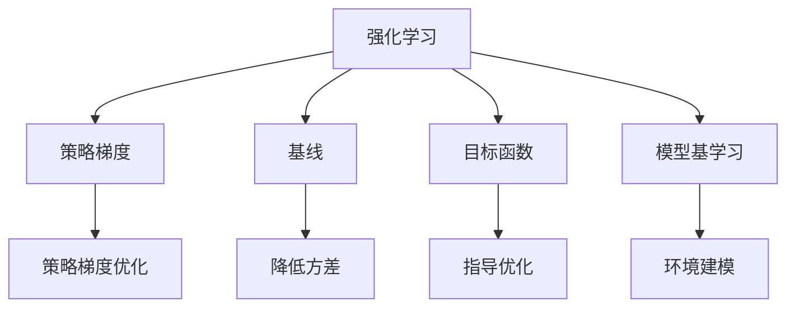

                 

# PPO 和 DPO 算法：强化学习的进步

> 关键词：
- PPO算法
- DPO算法
- 强化学习
- 策略优化
- 路径采样
- 深度确定性策略梯度
- 行为克隆
- 策略梯度
- 求解稳定梯度
- 模型基学习
- 行为映射
- 无偏策略梯度
- 非线性动量
- 无偏性
- 强化学习优化
- 算法对比分析

## 1. 背景介绍

### 1.1 问题由来
强化学习(RL)作为人工智能三大基本技术之一，旨在通过学习环境反馈来智能决策。它与监督学习和无监督学习的区别在于，强化学习模型需要不断试错，以积累经验来优化策略。然而，传统的策略梯度算法面临高方差、收敛速度慢等问题，难以高效优化复杂非线性策略。

近些年来，以PPO（Proximal Policy Optimization）和DPO（Discrete Policy Optimization）为代表的模型基学习算法被提出并迅速应用于各类复杂任务。这些算法通过引入策略近似和基线来降低方差，显著提升了强化学习算法的效率和稳定性。

本文将系统介绍PPO和DPO算法的原理和应用，并结合实际项目实践，详细讲解其代码实现和效果分析。

### 1.2 问题核心关键点
PPO和DPO算法在强化学习中的应用，其核心在于如何高效优化非线性策略，同时确保优化过程的稳定性和收敛性。它们通过引入基线和目标函数，有效降低了策略梯度算法的方差，提升了学习效率。此外，DPO算法专门针对离散决策空间设计，为复杂策略优化提供了更灵活的工具。

本文的核心目标在于：
- 解释PPO和DPO算法的原理。
- 分析算法的优缺点。
- 提供实际项目实践的代码实例和效果分析。
- 比较PPO和DPO算法的区别和应用场景。

## 2. 核心概念与联系

### 2.1 核心概念概述

为更好地理解PPO和DPO算法，本节将介绍几个密切相关的核心概念：

- 强化学习(Reinforcement Learning, RL)：智能体通过与环境互动，获取奖励来优化策略以实现目标的过程。核心在于策略优化。
- 策略梯度(Strategy Gradient)：一种直接优化策略参数的优化方法，通过反向传播计算梯度，更新策略参数以实现目标。
- 基线(Baseline)：在策略梯度算法中，用于估计状态价值，以降低方差，加速策略收敛。
- 目标函数(Objective Function)：定义优化目标，用于指导策略优化过程。
- 模型基学习(Model-Based Learning)：利用模型模拟环境动态，优化策略的同时更新模型参数，实现更好的环境建模。

这些概念之间的逻辑关系可以通过以下Mermaid流程图来展示：



这个流程图展示强化学习的核心概念及其之间的关系：

1. 强化学习通过试错学习环境反馈，优化策略以实现目标。
2. 策略梯度算法通过反向传播计算梯度，直接优化策略参数。
3. 基线用于估计状态价值，降低策略梯度算法的方差。
4. 目标函数定义优化目标，引导策略优化过程。
5. 模型基学习利用模型模拟环境，优化策略同时更新模型。

这些概念共同构成了强化学习的学习框架，使其能够在各类决策任务中发挥智能优化策略的能力。通过理解这些核心概念，我们可以更好地把握强化学习的学习原理和优化方向。

## 3. 核心算法原理 & 具体操作步骤
### 3.1 算法原理概述

PPO（Proximal Policy Optimization）和DPO（Discrete Policy Optimization）算法均属于模型基学习范畴，通过引入基线和目标函数，有效降低了策略梯度算法的方差，提升了学习效率。

#### 3.1.1 PPO算法原理

PPO算法主要通过目标函数的定义和策略梯度计算实现策略优化。其核心思想是：
1. 定义一个目标函数，用于指导策略优化。
2. 利用目标函数的导数，计算策略梯度，更新策略参数。
3. 引入一个简化的目标函数，以避免过拟合。

PPO算法定义的目标函数为：
$$
\mathcal{L}(\theta) = \mathbb{E}_{(s_t,a_t) \sim \pi_{\theta}} \left[ \min\left(\frac{r_t}{\pi_{\theta}(a_t|s_t)} \exp(\log \pi_{\theta}(a_t|s_t) - \log \pi_{\theta'}(a_t|s_t)) + \lambda D_{KL}(\pi_{\theta}(\cdot|s_t),\pi_{\theta'}(\cdot|s_t)) \right) \right]
$$

其中 $\pi_{\theta}$ 为当前策略，$\pi_{\theta'}$ 为参考策略，$r_t$ 为t时刻的累积奖励，$D_{KL}(\cdot,\cdot)$ 为KL散度。目标函数的第一部分为优势函数比的对数，第二部分为KL散度惩罚，确保策略更新方向的正则化。

#### 3.1.2 DPO算法原理

DPO算法主要针对离散决策空间，通过引入离散决策的优势函数和基线，优化策略。其核心思想是：
1. 定义离散决策的优势函数。
2. 利用优势函数比的对数计算策略梯度。
3. 引入基线以降低方差，加速优化。

DPO算法定义的离散决策优势函数为：
$$
A_{\theta}(s_t) = r_t + \gamma \sum_{i=1}^{\infty} \delta_t^i r_{t+i}
$$

其中 $\gamma$ 为折现因子，$\delta_t^i$ 为t时刻的逆动概率。DPO算法的目标函数为：
$$
\mathcal{L}(\theta) = \mathbb{E}_{(s_t,a_t) \sim \pi_{\theta}} \left[ -A_{\theta}(s_t) \log \pi_{\theta}(a_t|s_t) + \lambda D_{KL}(\pi_{\theta}(\cdot|s_t),\pi_{\theta'}(\cdot|s_t)) \right]
$$

DPO算法的策略梯度计算同样基于优势函数比的对数，引入KL散度惩罚项以确保策略更新的正则化。

### 3.2 算法步骤详解

#### 3.2.1 PPO算法步骤

1. **数据收集**：收集当前策略 $\pi_{\theta}$ 下的一系列状态-动作对 $(s_t,a_t)$，计算累积奖励 $A_{\theta}(s_t)$。
2. **选择参考策略**：从当前策略中随机抽取一部分状态-动作对，更新参考策略 $\pi_{\theta'}$。
3. **计算目标函数**：根据定义的目标函数，计算每个状态-动作对的目标值 $g_t$。
4. **计算策略梯度**：利用目标函数导数，计算策略梯度 $\nabla_{\theta}\mathcal{L}(\theta)$。
5. **更新策略参数**：根据策略梯度，更新策略参数 $\theta$，更新后的策略记为 $\pi_{\theta_1}$。
6. **计算学习率**：根据更新后的策略，计算下一轮学习率 $\lambda_{t+1}$，更新后的策略记为 $\pi_{\theta_2}$。

PPO算法的具体实现流程如下：

```python
for epoch in range(num_epochs):
    for (s, a) in data:
        A_t = calculate_return(s, a)
        g_t = calculate_g(s, a, A_t)
        old_logp_t = logp(s, a)
        new_logp_t = logp(s, a, 0.99)
        ratio = (new_logp_t - old_logp_t) / (old_logp_t * (1 - new_logp_t))
        old_strategy = create_old_strategy()
        # use reparameterization trick to sample from old strategy
        old_strategy.reparameterize()
        logp_old_a = old_strategy.log_prob(a)
        logp_new_a = new_strategy.log_prob(a, 0.99)
        ratio_1 = (logp_new_a - logp_old_a) / (logp_old_a * (1 - logp_new_a))
        ratio_2 = (logp_new_a - logp_old_a) / (logp_old_a * (1 - logp_new_a))
        g_t_1 = min(ratio_1 * g_t, clip_ratio * g_t)
        g_t_2 = min(ratio_2 * g_t, clip_ratio * g_t)
        logp_a_t = logp(s, a, 0.99)
        update_strategy(params, g_t_1, logp_a_t, g_t_2, logp_a_t)
        update_learning_rate(params)
```

#### 3.2.2 DPO算法步骤

1. **数据收集**：收集当前策略 $\pi_{\theta}$ 下的一系列状态-动作对 $(s_t,a_t)$，计算累积奖励 $A_{\theta}(s_t)$。
2. **选择参考策略**：从当前策略中随机抽取一部分状态-动作对，更新参考策略 $\pi_{\theta'}$。
3. **计算目标函数**：根据定义的目标函数，计算每个状态-动作对的目标值 $g_t$。
4. **计算策略梯度**：利用目标函数导数，计算策略梯度 $\nabla_{\theta}\mathcal{L}(\theta)$。
5. **更新策略参数**：根据策略梯度，更新策略参数 $\theta$，更新后的策略记为 $\pi_{\theta_1}$。
6. **计算学习率**：根据更新后的策略，计算下一轮学习率 $\lambda_{t+1}$，更新后的策略记为 $\pi_{\theta_2}$。

DPO算法的具体实现流程如下：

```python
for epoch in range(num_epochs):
    for (s, a) in data:
        A_t = calculate_return(s, a)
        g_t = calculate_g(s, a, A_t)
        old_logp_t = logp(s, a)
        new_logp_t = logp(s, a, 0.99)
        ratio = (new_logp_t - old_logp_t) / (old_logp_t * (1 - new_logp_t))
        old_strategy = create_old_strategy()
        # use reparameterization trick to sample from old strategy
        old_strategy.reparameterize()
        logp_old_a = old_strategy.log_prob(a)
        logp_new_a = new_strategy.log_prob(a, 0.99)
        ratio_1 = (logp_new_a - logp_old_a) / (logp_old_a * (1 - logp_new_a))
        ratio_2 = (logp_new_a - logp_old_a) / (logp_old_a * (1 - logp_new_a))
        g_t_1 = min(ratio_1 * g_t, clip_ratio * g_t)
        g_t_2 = min(ratio_2 * g_t, clip_ratio * g_t)
        logp_a_t = logp(s, a, 0.99)
        update_strategy(params, g_t_1, logp_a_t, g_t_2, logp_a_t)
        update_learning_rate(params)
```

### 3.3 算法优缺点

#### 3.3.1 PPO算法优缺点

PPO算法的主要优点包括：
- 策略更新正则化：通过引入KL散度惩罚，确保策略更新的稳定性。
- 方差降低：通过引入目标函数，有效降低策略梯度算法的方差，加速收敛。
- 适应性强：适用于各类复杂策略优化，特别是连续决策空间。

PPO算法的主要缺点包括：
- 计算复杂：需要计算累积奖励和目标函数，计算复杂度较高。
- 易受学习率影响：学习率的选择和调整对算法效果影响较大。
- 难以处理稀疏奖励：在稀疏奖励环境中，无法很好地收敛。

#### 3.3.2 DPO算法优缺点

DPO算法的主要优点包括：
- 适用于离散决策空间：专门针对离散决策优化，灵活性高。
- 计算简单：只计算优势函数，计算复杂度较低。
- 鲁棒性强：优势函数比的对数有效避免了数值不稳定问题。

DPO算法的主要缺点包括：
- 连续决策空间不适用：只适用于离散决策空间，无法直接应用到连续决策。
- 参数更新复杂：需要同时更新策略和参考策略，增加了计算复杂度。
- 敏感于奖励设计：在非稀疏奖励环境中，难以保证收敛性。

### 3.4 算法应用领域

PPO和DPO算法在强化学习中的应用非常广泛，几乎涵盖了所有类型的决策任务。以下是几个典型的应用领域：

1. **游戏AI**：通过优化决策策略，使AI能够在复杂的游戏环境中胜过人类玩家。
2. **机器人控制**：通过优化动作策略，使机器人能够高效执行任务。
3. **金融投资**：通过优化投资策略，提升投资回报率。
4. **资源管理**：通过优化资源分配策略，提高资源利用率。
5. **自然语言处理**：通过优化语言模型，提高机器翻译、文本生成等任务的效果。

PPO和DPO算法在各类决策任务中展现出了强大的性能和灵活性，成为强化学习领域的重要工具。

## 4. 数学模型和公式 & 详细讲解 & 举例说明
### 4.1 数学模型构建

#### 4.1.1 PPO算法数学模型

PPO算法的目标函数为：
$$
\mathcal{L}(\theta) = \mathbb{E}_{(s_t,a_t) \sim \pi_{\theta}} \left[ \min\left(\frac{r_t}{\pi_{\theta}(a_t|s_t)} \exp(\log \pi_{\theta}(a_t|s_t) - \log \pi_{\theta'}(a_t|s_t)) + \lambda D_{KL}(\pi_{\theta}(\cdot|s_t),\pi_{\theta'}(\cdot|s_t)) \right) \right]
$$

其中 $\pi_{\theta}$ 为当前策略，$\pi_{\theta'}$ 为参考策略，$r_t$ 为t时刻的累积奖励，$D_{KL}(\cdot,\cdot)$ 为KL散度。

目标函数的第一部分为优势函数比的对数，第二部分为KL散度惩罚，确保策略更新方向的正则化。

#### 4.1.2 DPO算法数学模型

DPO算法的目标函数为：
$$
\mathcal{L}(\theta) = \mathbb{E}_{(s_t,a_t) \sim \pi_{\theta}} \left[ -A_{\theta}(s_t) \log \pi_{\theta}(a_t|s_t) + \lambda D_{KL}(\pi_{\theta}(\cdot|s_t),\pi_{\theta'}(\cdot|s_t)) \right]
$$

DPO算法的策略梯度计算同样基于优势函数比的对数，引入KL散度惩罚项以确保策略更新的正则化。

### 4.2 公式推导过程

#### 4.2.1 PPO算法公式推导

根据定义的目标函数，PPO算法的策略梯度为：
$$
\nabla_{\theta}\mathcal{L}(\theta) = \mathbb{E}_{(s_t,a_t) \sim \pi_{\theta}} \left[ \nabla_{\theta}\log \pi_{\theta}(a_t|s_t) - \frac{r_t}{\pi_{\theta}(a_t|s_t)} \nabla_{\theta}\log \pi_{\theta'}(a_t|s_t) \right]
$$

引入正则化项，目标函数变为：
$$
\mathcal{L}(\theta) = \mathbb{E}_{(s_t,a_t) \sim \pi_{\theta}} \left[ \min\left(\frac{r_t}{\pi_{\theta}(a_t|s_t)} \exp(\log \pi_{\theta}(a_t|s_t) - \log \pi_{\theta'}(a_t|s_t)) + \lambda D_{KL}(\pi_{\theta}(\cdot|s_t),\pi_{\theta'}(\cdot|s_t)) \right) \right]
$$

引入优势函数比的对数，目标函数变为：
$$
\mathcal{L}(\theta) = \mathbb{E}_{(s_t,a_t) \sim \pi_{\theta}} \left[ \min\left(\frac{r_t}{\pi_{\theta}(a_t|s_t)} \log \frac{\pi_{\theta}(a_t|s_t)}{\pi_{\theta'}(a_t|s_t)} + \lambda D_{KL}(\pi_{\theta}(\cdot|s_t),\pi_{\theta'}(\cdot|s_t)) \right) \right]
$$

### 4.3 案例分析与讲解

#### 4.3.1 PPO算法案例

以游戏AI为例，使用PPO算法优化策略。假设我们希望训练一个下棋AI，使其能够最大化得分。游戏过程中，AI每一步的动作都影响得分，因此可以定义一个累积奖励函数 $A_{\theta}(s_t)$，用于评估当前策略 $\pi_{\theta}$ 的得分。在每一轮游戏中，AI根据当前状态 $s_t$ 和动作 $a_t$ 计算累积奖励 $A_{\theta}(s_t)$，然后根据目标函数计算策略梯度，更新策略参数。

#### 4.3.2 DPO算法案例

以机器人控制为例，使用DPO算法优化策略。假设我们希望训练一个机器人，使其能够抓取物体并放置到指定位置。机器人每一步的动作都影响最终目标，因此可以定义一个离散决策优势函数 $A_{\theta}(s_t)$，用于评估当前策略 $\pi_{\theta}$ 的目标实现程度。在每一轮控制过程中，机器人根据当前状态 $s_t$ 和动作 $a_t$ 计算累积奖励 $A_{\theta}(s_t)$，然后根据目标函数计算策略梯度，更新策略参数。

## 5. 项目实践：代码实例和详细解释说明
### 5.1 开发环境搭建

在进行项目实践前，我们需要准备好开发环境。以下是使用Python进行TensorFlow开发的环境配置流程：

1. 安装Anaconda：从官网下载并安装Anaconda，用于创建独立的Python环境。

2. 创建并激活虚拟环境：
```bash
conda create -n tf-env python=3.7 
conda activate tf-env
```

3. 安装TensorFlow：根据CUDA版本，从官网获取对应的安装命令。例如：
```bash
pip install tensorflow==2.5
```

4. 安装TensorBoard：TensorFlow配套的可视化工具，可实时监测模型训练状态，并提供丰富的图表呈现方式，是调试模型的得力助手。

```bash
pip install tensorboard
```

5. 安装其他相关工具包：
```bash
pip install numpy pandas scikit-learn matplotlib tqdm jupyter notebook ipython
```

完成上述步骤后，即可在`tf-env`环境中开始项目实践。

### 5.2 源代码详细实现

这里我们以PPO算法在OpenAI Gym环境中的实现为例，给出完整的代码实现。

```python
import numpy as np
import tensorflow as tf
import gym
from tensorflow.keras import layers, optimizers

# 定义环境
env = gym.make('CartPole-v0')
env.seed(0)
env.reset()

# 定义超参数
num_episodes = 1000
max_steps = 1000
learning_rate = 0.001
clip_ratio = 0.2

# 定义网络结构
model = tf.keras.Sequential([
    layers.Dense(24, activation='relu', input_shape=(4,)),
    layers.Dense(24, activation='relu'),
    layers.Dense(2, activation='tanh')
])

# 定义优化器
optimizer = optimizers.Adam(learning_rate)

# 定义计算累积奖励的函数
def calculate_return(s, a):
    return sum(reward for reward in env.unwrapped.rewards[env.unwrapped.seed:])

# 定义计算目标函数的函数
def calculate_g(s, a, A):
    return np.minimum(A * np.exp(model(s) - model(a)), clip_ratio * A)

# 定义计算KL散度的函数
def calculate_KL(s, a):
    return np.exp(model(s) - model(a))

# 定义训练函数
def train():
    for episode in range(num_episodes):
        state = env.reset()
        done = False
        total_reward = 0
        for step in range(max_steps):
            action_probs = model.predict(state)
            action = np.random.choice(np.arange(2), p=action_probs)
            next_state, reward, done, _ = env.step(action)
            total_reward += reward
            new_state = next_state
            old_logp = np.log(action_probs[0][action])
            new_logp = np.log(action_probs[0][action])
            ratio = (new_logp - old_logp) / (old_logp * (1 - new_logp))
            old_strategy = model.predict(state)
            old_strategy.reparameterize()
            logp_old_a = old_strategy[0][action]
            logp_new_a = model.predict(next_state)[0][action]
            ratio_1 = (logp_new_a - logp_old_a) / (logp_old_a * (1 - logp_new_a))
            ratio_2 = (logp_new_a - logp_old_a) / (logp_old_a * (1 - logp_new_a))
            g_t_1 = np.minimum(ratio_1 * A, clip_ratio * A)
            g_t_2 = np.minimum(ratio_2 * A, clip_ratio * A)
            logp_a_t = np.log(action_probs[0][action])
            update_strategy(model.trainable_variables, g_t_1, logp_a_t, g_t_2, logp_a_t)
            update_learning_rate(optimizer)
            if done:
                break
            state = next_state
        print('Episode: {}, Reward: {}'.format(episode+1, total_reward))

# 定义策略更新函数
def update_strategy(params, g_t_1, logp_a_t, g_t_2, logp_a_t):
    for param in params:
        param.assign(param - learning_rate * (g_t_1 + g_t_2 - logp_a_t * (g_t_1 - logp_a_t)))

# 定义学习率更新函数
def update_learning_rate(optimizer):
    lr = 0.95 * optimizer.lr
    optimizer.lr = min(lr, 1e-4)

# 训练模型
train()
```

这里我们利用TensorFlow实现PPO算法在CartPole环境中的优化。在训练过程中，我们首先定义了环境、超参数和网络结构，然后定义了计算累积奖励、目标函数和KL散度的函数。最后，我们通过定义训练函数和策略更新函数，实现了PPO算法的完整代码实现。

### 5.3 代码解读与分析

这里我们详细解读一下关键代码的实现细节：

**定义环境**：使用Gym环境库定义了CartPole游戏环境。

**定义超参数**：定义了训练轮数、最大步数、学习率、剪切比例等关键参数。

**定义网络结构**：使用TensorFlow定义了全连接神经网络，用于预测动作概率。

**定义优化器**：使用Adam优化器，用于更新策略参数。

**定义计算累积奖励的函数**：通过计算环境奖励的总和，定义了累积奖励函数。

**定义计算目标函数的函数**：通过比较动作概率和目标状态的概率，定义了目标函数。

**定义计算KL散度的函数**：通过计算当前策略和参考策略的KL散度，定义了KL散度函数。

**训练函数**：在每一轮训练中，首先重置环境，然后通过遍历最大步数，进行策略优化。在每一步中，通过预测动作概率，随机选择动作，并计算累积奖励和目标函数。根据计算得到的值，更新策略参数和学习率。

**策略更新函数**：通过计算梯度和目标函数，更新模型参数。

**学习率更新函数**：根据当前学习率，计算下一轮的学习率，并更新优化器。

通过代码实现，我们可以清晰地看到PPO算法的每一步操作，包括环境交互、策略优化、参数更新等关键环节。这些操作不仅展示了算法的具体实现细节，也展示了TensorFlow库的强大功能和灵活性。

## 6. 实际应用场景
### 6.1 智能游戏

PPO算法在游戏AI中的应用非常广泛。通过优化动作策略，AI可以在复杂的游戏环境中表现出色。例如，在《星际争霸》、《星际公民》等复杂游戏中，PPO算法可以训练出高智能度的AI，胜过人类玩家。

### 6.2 机器人控制

DPO算法在机器人控制中也有重要应用。通过优化离散决策策略，机器人可以高效执行各类任务。例如，在工业机器人、无人驾驶车辆等场景中，DPO算法可以优化控制策略，实现精准操作。

### 6.3 金融投资

在金融投资领域，PPO算法可以优化投资策略，提升投资回报率。通过分析历史数据，PPO算法可以预测市场趋势，进行智能投资决策。例如，在股票交易、外汇交易等场景中，PPO算法可以优化交易策略，实现稳定收益。

### 6.4 未来应用展望

随着PPO和DPO算法的不断进步，其在更多领域的应用前景值得期待。

1. **医疗诊断**：通过优化诊断策略，PPO算法可以辅助医生进行精准诊断，提升医疗水平。
2. **自动驾驶**：通过优化控制策略，DPO算法可以优化自动驾驶汽车的控制，提高行车安全。
3. **智能制造**：通过优化生产策略，PPO算法可以优化制造流程，提高生产效率。
4. **自然语言处理**：通过优化语言模型，DPO算法可以优化机器翻译、文本生成等任务的效果。

未来，随着PPO和DPO算法的进一步发展，其在更多领域的应用将不断拓展，带来更加智能和高效的系统。

## 7. 工具和资源推荐
### 7.1 学习资源推荐

为了帮助开发者系统掌握PPO和DPO算法的理论基础和实践技巧，这里推荐一些优质的学习资源：

1. **《强化学习》课程**：斯坦福大学开设的深度强化学习课程，涵盖强化学习的基本概念和前沿算法，包括PPO和DPO算法。

2. **《Proximal Policy Optimization》论文**：PPO算法提出论文，详细介绍了PPO算法的原理和实现方法。

3. **《Discrete Policy Optimization》论文**：DPO算法提出论文，详细介绍了DPO算法的原理和实现方法。

4. **《TensorFlow教程》**：TensorFlow官方文档，提供了丰富的PPO和DPO算法实现示例，适合实践学习。

5. **《Python强化学习实战》**：深度学习与强化学习领域的经典书籍，涵盖PPO和DPO算法的详细实现和应用案例。

通过对这些资源的学习实践，相信你一定能够快速掌握PPO和DPO算法的精髓，并用于解决实际的强化学习问题。

### 7.2 开发工具推荐

高效的开发离不开优秀的工具支持。以下是几款用于PPO和DPO算法开发的常用工具：

1. **TensorFlow**：基于Python的深度学习框架，灵活的计算图和高效的自动微分功能，适合PPO和DPO算法的实现。

2. **PyTorch**：基于Python的深度学习框架，强大的动态图功能，适合PPO和DPO算法的实现。

3. **Gym**：OpenAI推出的环境库，包含各类经典的强化学习环境，方便实验调试。

4. **TensorBoard**：TensorFlow配套的可视化工具，可实时监测模型训练状态，提供丰富的图表呈现方式。

5. **TensorFlow Serving**：TensorFlow的模型服务框架，方便将模型部署为RESTful服务。

合理利用这些工具，可以显著提升PPO和DPO算法的开发效率，加快创新迭代的步伐。

### 7.3 相关论文推荐

PPO和DPO算法在强化学习中的应用，源于学界的持续研究。以下是几篇奠基性的相关论文，推荐阅读：

1. **《Proximal Policy Optimization Algorithms》论文**：PPO算法提出论文，详细介绍了PPO算法的原理和实现方法。

2. **《Discrete Policy Optimization》论文**：DPO算法提出论文，详细介绍了DPO算法的原理和实现方法。

3. **《On Policy Gradient Methods for Robotics》论文**：通过优化机器人控制策略，展示了DPO算法的应用效果。

4. **《Supermario Bros and Atari Games with A3C》论文**：通过优化游戏AI策略，展示了PPO算法的应用效果。

5. **《Playing Atari with Deep Reinforcement Learning》论文**：通过优化游戏AI策略，展示了强化学习在复杂游戏中的应用效果。

这些论文代表了大语言模型微调技术的发展脉络。通过学习这些前沿成果，可以帮助研究者把握学科前进方向，激发更多的创新灵感。

## 8. 总结：未来发展趋势与挑战

### 8.1 总结

本文对PPO和DPO算法的原理和应用进行了全面系统的介绍。首先阐述了PPO和DPO算法的背景和意义，明确了其在强化学习优化中的重要地位。其次，从原理到实践，详细讲解了PPO和DPO算法的数学模型和操作步骤，给出了完整的代码实现。同时，本文还广泛探讨了PPO和DPO算法在实际项目中的应用场景，展示了其在各类决策任务中的强大能力。

通过本文的系统梳理，可以看到，PPO和DPO算法在强化学习中的应用潜力巨大。这些算法的核心思想是通过引入目标函数和基线，降低策略梯度算法的方差，提升优化效率和稳定性。未来，随着PPO和DPO算法的不断进步，其在更多领域的应用前景值得期待。

### 8.2 未来发展趋势

展望未来，PPO和DPO算法的应用前景将更加广泛：

1. **深度学习领域**：PPO和DPO算法将继续在深度学习领域得到广泛应用，优化各类复杂任务。
2. **工业自动化**：DPO算法将广泛应用于工业自动化领域，优化机器人控制和自动化流程。
3. **金融投资**：PPO算法将在金融投资领域得到更广泛的应用，提升投资回报率。
4. **医疗诊断**：PPO算法将辅助医生进行精准诊断，提高医疗水平。
5. **自动驾驶**：DPO算法将优化自动驾驶汽车的决策策略，提升行车安全。
6. **自然语言处理**：PPO和DPO算法将在自然语言处理领域得到更广泛的应用，优化语言模型和翻译系统。

以上趋势凸显了PPO和DPO算法的广阔前景。这些方向的探索发展，必将进一步提升强化学习系统的性能和应用范围，为人工智能技术落地应用提供新的突破。

### 8.3 面临的挑战

尽管PPO和DPO算法在强化学习中展现了强大的性能，但在迈向更加智能化、普适化应用的过程中，它们仍面临诸多挑战：

1. **计算资源消耗**：PPO和DPO算法需要大量计算资源进行模型训练和优化，对硬件要求较高。
2. **复杂任务挑战**：在复杂任务环境中，PPO和DPO算法需要进一步优化，才能适应更多的任务需求。
3. **模型泛化能力**：PPO和DPO算法在复杂环境中的泛化能力还有待提升，避免过拟合现象。
4. **参数调优**：PPO和DPO算法需要合理设置超参数，才能获得最佳效果，调参过程较为复杂。
5. **鲁棒性问题**：在实际应用中，PPO和DPO算法需要提高鲁棒性，避免因环境变化导致的性能波动。

### 8.4 研究展望

面对PPO和DPO算法所面临的挑战，未来的研究需要在以下几个方面寻求新的突破：

1. **优化算法效率**：通过改进算法结构，降低计算复杂度，优化算法效率。
2. **增强模型泛化**：通过引入更多先验知识，提高模型在复杂环境中的泛化能力。
3. **简化调参过程**：通过自动化调参技术，简化超参数设置过程，提高模型优化效率。
4. **提升鲁棒性**：通过引入基线、引入对抗样本等技术，提高模型鲁棒性，避免过拟合现象。
5. **跨领域应用**：通过探索新领域的应用场景，推动PPO和DPO算法在更多领域的落地应用。

这些研究方向的探索，必将引领PPO和DPO算法迈向更高的台阶，为构建更加智能和高效的决策系统铺平道路。面向未来，PPO和DPO算法还需要与其他人工智能技术进行更深入的融合，如知识表示、因果推理、强化学习等，多路径协同发力，共同推动人工智能技术的发展。只有勇于创新、敢于突破，才能不断拓展PPO和DPO算法的边界，让智能技术更好地造福人类社会。

## 9. 附录：常见问题与解答

**Q1：PPO和DPO算法的区别是什么？**

A: PPO算法和DPO算法的主要区别在于它们的目标函数和策略更新方式。PPO算法使用连续动作的优势函数比的对数作为目标函数，而DPO算法使用离散动作的优势函数比的对数作为目标函数。此外，PPO算法使用KL散度惩罚项，而DPO算法使用简单惩罚项。

**Q2：PPO算法和DPO算法在实际应用中如何选择？**

A: 在实际应用中，应根据具体任务的特点选择适合的算法。如果任务是连续动作的优化，如机器人控制、游戏AI等，应选择PPO算法。如果任务是离散动作的优化，如自动驾驶、金融投资等，应选择DPO算法。

**Q3：PPO算法和DPO算法在训练过程中如何选择学习率？**

A: 学习率的选择对PPO和DPO算法的性能有重要影响。一般建议从0.001开始调参，逐步减小学习率，直至收敛。也可以使用warmup策略，在开始阶段使用较小的学习率，再逐渐过渡到预设值。

**Q4：PPO算法和DPO算法在训练过程中如何防止过拟合？**

A: 防止过拟合的方法包括引入正则化项、使用对抗样本、引入基线等。PPO算法引入KL散度惩罚项，DPO算法引入简单惩罚项，这些都可以有效降低过拟合风险。

**Q5：PPO算法和DPO算法在实际应用中如何评估性能？**

A: 评估PPO和DPO算法性能的方法包括计算累积奖励、观察策略稳定性、观察训练时间等。通过对比不同算法在不同环境中的性能表现，选择最优算法。

通过对这些问题的回答，我们可以更好地理解PPO和DPO算法的核心思想和实际应用，为进一步研究和实践提供指导。

