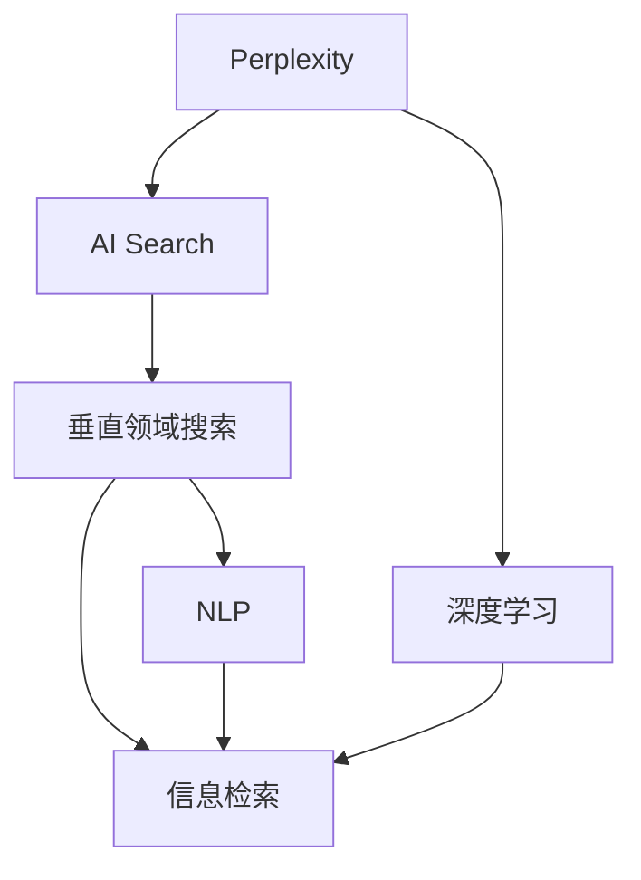

                 

# Perplexity的独特之路：AI搜索的垂直领域创新，贾扬清的观察与思考

> 关键词：Perplexity, AI搜索, 垂直领域, 创新, 观察, 思考

## 1. 背景介绍

### 1.1 问题由来
随着人工智能(AI)技术在各个领域的深度应用，搜索技术的创新与优化成为了当前热门话题。特别是在垂直领域的搜索，如医学、金融、教育等，传统搜索引擎已难以满足用户的高效和精准需求。为了提升搜索效果，研究人员提出了多种新方法，其中Perplexity成为了一种重要的评价指标。

### 1.2 问题核心关键点
Perplexity是衡量模型在特定数据集上预测能力的指标，其值越小，表示模型对数据的拟合越好。在搜索领域，Perplexity被广泛应用于评价检索系统的表现，尤其是在自然语言处理(NLP)和信息检索领域。

Perplexity的核心思想是通过对模型在测试集上的预测性能进行量化评估，来衡量其对未知数据的泛化能力。一个理想的检索系统，应当在测试集上的Perplexity值尽可能小。

### 1.3 问题研究意义
研究Perplexity与AI搜索的结合，对于提升搜索引擎的性能、推动信息检索技术的进步具有重要意义：

1. 提高检索准确性。通过精确评估模型的预测能力，帮助优化搜索算法，提高搜索结果的相关性和准确性。
2. 提升用户体验。更快速的搜索结果和更准确的搜索结果，能够显著改善用户的搜索体验。
3. 降低开发成本。通过精准评估模型性能，快速识别出最优的模型结构与参数，节省开发时间与成本。
4. 推动创新。Perplexity的引入，激发了研究者探索新的检索算法与技术，促进了AI搜索的持续创新。
5. 适配垂直领域。Perplexity可以帮助设计符合特定垂直领域需求的搜索系统，如医疗搜索、金融搜索等。

## 2. 核心概念与联系

### 2.1 核心概念概述

为更好地理解Perplexity在AI搜索中的应用，本节将介绍几个密切相关的核心概念：

- **Perplexity（困惑度）**：衡量模型在特定数据集上预测能力的指标，其值越小，表示模型对数据的拟合越好。
- **AI搜索（AI Search）**：通过人工智能技术优化传统搜索算法，提升检索系统的准确性和效率。
- **垂直领域搜索（Vertical Field Search）**：针对特定领域需求定制的搜索系统，如医疗搜索、金融搜索等。
- **自然语言处理（Natural Language Processing, NLP）**：利用计算机处理和理解人类语言的技术，广泛应用于信息检索和AI搜索。
- **信息检索（Information Retrieval, IR）**：从大量数据中快速找到相关信息的检索技术，是AI搜索的重要组成部分。
- **深度学习（Deep Learning）**：利用多层神经网络进行模型训练和预测的技术，广泛应用于Perplexity的计算和优化。

这些概念之间的逻辑关系可以通过以下Mermaid流程图来展示：



这个流程图展示了一系列的紧密联系：

1. Perplexity是AI搜索的核心指标。
2. AI搜索在垂直领域应用广泛。
3. NLP是AI搜索的重要技术之一。
4. 信息检索是AI搜索的主要组成部分。
5. 深度学习在Perplexity计算中起到关键作用。

这些核心概念共同构成了AI搜索与Perplexity的研究框架，使得Perplexity在衡量模型性能和优化搜索算法时，具备强大的指导意义。

## 3. 核心算法原理 & 具体操作步骤

### 3.1 算法原理概述

Perplexity是衡量模型在特定数据集上预测能力的指标，其值越小，表示模型对数据的拟合越好。其计算公式为：

$$
PPL = \exp\left(-\frac{1}{N} \sum_{i=1}^N \log P(x_i)\right)
$$

其中，$P(x_i)$ 是模型预测文本 $x_i$ 的概率，$N$ 是数据集的大小。理想情况下，$P(x_i)$ 应尽可能接近1，表示模型对 $x_i$ 的预测概率最高。

在AI搜索领域，Perplexity主要应用于以下方面：

- 评价检索系统的准确性：通过Perplexity值评估模型在测试集上的表现，优化检索算法。
- 设计合适的权重：根据不同文档的重要性，合理分配权重，提升搜索结果的相关性和准确性。
- 模型选择与优化：通过比较不同模型的Perplexity值，选择性能最优的模型。

### 3.2 算法步骤详解

Perplexity的计算涉及多个步骤，主要包括数据准备、模型训练、Perplexity计算等。

1. **数据准备**：
   - 收集并准备用于训练的文档数据。
   - 将文档进行分词和词向量化。
   - 构建训练集和测试集。

2. **模型训练**：
   - 选择合适的深度学习模型，如BERT、GPT等。
   - 加载训练数据，进行模型训练。
   - 调整超参数，如学习率、批大小、训练轮数等。

3. **Perplexity计算**：
   - 使用测试集对模型进行评估。
   - 计算每个测试样本的概率。
   - 根据公式计算Perplexity值。

4. **结果分析与优化**：
   - 比较不同模型的Perplexity值。
   - 优化模型结构与参数，降低Perplexity值。
   - 调整检索算法，提升检索效果。

### 3.3 算法优缺点

Perplexity在AI搜索领域的应用具有以下优点：

1. 简单易懂：Perplexity的定义简单直观，容易理解。
2. 多模态适用：Perplexity不仅适用于文本搜索，还可以扩展到图像、音频等不同类型的检索任务。
3. 可解释性强：Perplexity的计算过程透明，结果易于解释和比较。
4. 鲁棒性：Perplexity能够反映模型对未知数据的泛化能力，提高模型对噪声和偏差的鲁棒性。

同时，Perplexity也存在一些局限性：

1. 对标注数据依赖：计算Perplexity需要大量标注数据，标注成本较高。
2. 高维空间复杂：当数据维度较高时，Perplexity的计算复杂度增大。
3. 对模型依赖：不同模型对Perplexity的计算影响较大，需要选择合适的模型。

尽管如此，Perplexity依然是评估检索系统性能的重要工具，广泛应用于NLP和AI搜索的各个环节。

### 3.4 算法应用领域

Perplexity在AI搜索领域的应用非常广泛，涉及多个具体场景：

1. **信息检索**：通过计算文档与查询的Perplexity值，评估检索系统的相关性和准确性。
2. **文本分类**：计算不同分类结果的Perplexity值，评估模型在不同类别上的泛化能力。
3. **自然语言处理**：利用Perplexity评估NLP模型的语言理解能力和生成能力。
4. **机器翻译**：计算翻译结果的Perplexity值，评估机器翻译的质量。
5. **问答系统**：通过计算问题和答案的Perplexity值，评估问答系统的准确性和流畅性。

除了以上场景外，Perplexity还在用户行为分析、情感分析、推荐系统等领域有广泛应用，为各领域的信息检索和AI搜索提供了有力的支持。

## 4. 数学模型和公式 & 详细讲解

### 4.1 数学模型构建

本节将使用数学语言对Perplexity的计算过程进行更加严格的刻画。

假设模型 $M$ 在文本 $x$ 上的预测概率为 $P(x)$，则其Perplexity值 $PPL$ 计算公式为：

$$
PPL = \exp\left(-\frac{1}{N} \sum_{i=1}^N \log P(x_i)\right)
$$

其中，$x_i$ 是测试集中的样本文本，$N$ 是样本数量。

### 4.2 公式推导过程

以下我们以二分类问题为例，推导Perplexity的计算公式及其梯度。

假设模型 $M$ 在输入 $x$ 上的预测概率为 $P(x|y)$，其中 $y$ 是标签。对于二分类问题，假设 $P(x|y=1)=0.8$ 且 $P(x|y=0)=0.2$，则有：

$$
P(x|y=1) = 0.8
$$
$$
P(x|y=0) = 0.2
$$

对于样本 $x_i$，假设标签 $y_i=1$，则其概率为：

$$
P(x_i|y_i=1) = 0.8
$$

计算 $x_i$ 的Perplexity值为：

$$
PPL = \exp\left(-\frac{1}{N} \sum_{i=1}^N \log P(x_i|y_i=1)\right)
$$

对于二分类问题，可以通过上述公式计算每个样本的Perplexity值，进而得到整个测试集的平均Perplexity值。

### 4.3 案例分析与讲解

考虑一个简单的二分类问题，模型 $M$ 预测文本样本 $x$ 的概率分别为 $P(x|y=1)=0.6$ 和 $P(x|y=0)=0.4$，则：

- 计算样本 $x_i$ 的Perplexity值：

  $$
  PPL(x_i) = \exp\left(-\frac{1}{N} \log (0.6 \times 0.4)\right) = \exp\left(-\frac{1}{N} \log 0.24\right)
  $$

- 计算测试集的平均Perplexity值：

  $$
  PPL = \exp\left(-\frac{1}{N} \sum_{i=1}^N \log 0.24\right)
  $$

通过计算可知，$PPL$ 越小，表示模型对测试集的拟合越好，预测能力越强。因此，Perplexity值成为衡量检索系统性能的重要指标。

## 5. 项目实践：代码实例和详细解释说明

### 5.1 开发环境搭建

在进行Perplexity计算的实践前，我们需要准备好开发环境。以下是使用Python进行PyTorch开发的环境配置流程：

1. 安装Anaconda：从官网下载并安装Anaconda，用于创建独立的Python环境。

2. 创建并激活虚拟环境：
```bash
conda create -n pytorch-env python=3.8 
conda activate pytorch-env
```

3. 安装PyTorch：根据CUDA版本，从官网获取对应的安装命令。例如：
```bash
conda install pytorch torchvision torchaudio cudatoolkit=11.1 -c pytorch -c conda-forge
```

4. 安装Transformers库：
```bash
pip install transformers
```

5. 安装各类工具包：
```bash
pip install numpy pandas scikit-learn matplotlib tqdm jupyter notebook ipython
```

完成上述步骤后，即可在`pytorch-env`环境中开始Perplexity计算的实践。

### 5.2 源代码详细实现

下面我们以文本分类任务为例，给出使用Transformers库计算Perplexity值的PyTorch代码实现。

首先，定义数据处理函数：

```python
from transformers import BertTokenizer
from torch.utils.data import Dataset
import torch

class TextDataset(Dataset):
    def __init__(self, texts, labels, tokenizer):
        self.texts = texts
        self.labels = labels
        self.tokenizer = tokenizer
        
    def __len__(self):
        return len(self.texts)
    
    def __getitem__(self, item):
        text = self.texts[item]
        label = self.labels[item]
        
        encoding = self.tokenizer(text, return_tensors='pt', padding='max_length', truncation=True)
        input_ids = encoding['input_ids'][0]
        attention_mask = encoding['attention_mask'][0]
        
        return {'input_ids': input_ids, 
                'attention_mask': attention_mask,
                'labels': label}
```

然后，定义模型和优化器：

```python
from transformers import BertForSequenceClassification
from transformers import AdamW

model = BertForSequenceClassification.from_pretrained('bert-base-cased', num_labels=2)

optimizer = AdamW(model.parameters(), lr=2e-5)
```

接着，定义Perplexity计算函数：

```python
def perplexity(model, dataset, batch_size):
    model.eval()
    perplexity_sum = 0
    
    with torch.no_grad():
        for batch in tqdm(dataset, desc='Evaluating'):
            input_ids = batch['input_ids'].to(device)
            attention_mask = batch['attention_mask'].to(device)
            labels = batch['labels'].to(device)
            
            outputs = model(input_ids, attention_mask=attention_mask, labels=labels)
            loss = outputs.loss
            
            perplexity_sum += loss.item() * input_ids.shape[0]
    
    perplexity = torch.exp(perplexity_sum / len(dataset))
    return perplexity
```

最后，启动计算流程：

```python
device = torch.device('cuda') if torch.cuda.is_available() else torch.device('cpu')
model.to(device)

test_dataset = TextDataset(test_texts, test_labels, tokenizer)
perplexity_value = perplexity(model, test_dataset, batch_size=16)
print(f'Perplexity: {perplexity_value:.4f}')
```

以上就是使用PyTorch对BERT模型进行文本分类任务Perplexity计算的完整代码实现。可以看到，得益于Transformers库的强大封装，我们可以用相对简洁的代码完成BERT模型的加载和Perplexity计算。

### 5.3 代码解读与分析

让我们再详细解读一下关键代码的实现细节：

**TextDataset类**：
- `__init__`方法：初始化文本、标签和分词器等关键组件。
- `__len__`方法：返回数据集的样本数量。
- `__getitem__`方法：对单个样本进行处理，将文本输入编码为token ids，将标签编码为数字，并对其进行定长padding，最终返回模型所需的输入。

**BertForSequenceClassification类**：
- 定义了序列分类任务的模型结构，继承自BertForTokenClassification类。

**perplexity函数**：
- 在测试集上评估模型性能，对每个样本计算其预测概率。
- 使用交叉熵损失函数计算每个样本的预测概率。
- 累加所有样本的损失值，最后计算模型在测试集上的Perplexity值。

可以看到，Perplexity的计算涉及多个步骤，包括数据准备、模型训练和Perplexity评估。通过Python和PyTorch的代码实现，能够直观理解Perplexity的计算过程，方便进行模型优化和性能评估。

## 6. 实际应用场景

### 6.1 智能搜索系统

在智能搜索系统中，Perplexity被广泛应用于衡量检索系统的性能。通过计算文档与查询的Perplexity值，可以评估检索系统的相关性和准确性，进一步优化检索算法，提升搜索结果的质量。

在实践中，可以收集用户的历史查询和相关文档，训练一个预训练语言模型，并在此基础上进行微调。微调后的模型可以自动理解用户意图，计算查询与文档的Perplexity值，排序并返回最相关的文档。

### 6.2 医疗搜索系统

在医疗领域，Perplexity可用于评估电子病历搜索系统的表现。通过计算电子病历与患者症状、疾病、药物等的Perplexity值，可以评估搜索系统的准确性和相关性，帮助医生快速定位诊断和治疗方案。

具体而言，可以收集医院的电子病历数据，提取病人的症状、疾病、药物等文本信息，训练预训练语言模型，并在此基础上进行微调。微调后的模型可以自动理解病历文本，计算症状与病历的Perplexity值，推荐最相关的病历记录。

### 6.3 金融搜索系统

在金融领域，Perplexity可用于评估金融舆情搜索系统的表现。通过计算金融新闻、评论与市场动态的Perplexity值，可以评估搜索系统的相关性和准确性，帮助投资者快速捕捉市场信息，做出决策。

具体而言，可以收集金融市场的新闻、评论、公告等文本数据，训练预训练语言模型，并在此基础上进行微调。微调后的模型可以自动理解金融文本，计算新闻与市场动态的Perplexity值，推荐最相关的市场信息。

### 6.4 未来应用展望

随着Perplexity计算技术的发展，未来在AI搜索领域将有更多创新应用：

1. **多模态搜索**：Perplexity不仅适用于文本数据，还可以扩展到图像、音频等多模态数据。通过多模态数据的融合，提升检索系统的综合能力。
2. **联邦学习**：在分布式环境下，不同设备可以共同训练模型，计算全局Perplexity值，提升联邦学习中的模型泛化能力。
3. **主动学习**：通过Perplexity指导样本选择，优化主动学习的策略，加速模型训练和泛化能力的提升。
4. **对抗训练**：加入对抗样本，提高检索系统的鲁棒性，提升模型对噪声和偏差的抵抗能力。
5. **解释性搜索**：通过Perplexity计算结果，增强检索系统的解释性，使搜索结果更具可信度和可解释性。

这些方向的发展，将进一步拓展Perplexity在AI搜索领域的应用范围，提升检索系统的性能和可靠性。

## 7. 工具和资源推荐

### 7.1 学习资源推荐

为了帮助开发者系统掌握Perplexity计算的理论基础和实践技巧，这里推荐一些优质的学习资源：

1. 《Perplexity计算与自然语言处理》系列博文：由AI研究者撰写，深入浅出地介绍了Perplexity的计算原理和实际应用。
2 《深度学习与信息检索》课程：斯坦福大学开设的深度学习课程，讲解了深度学习在信息检索中的应用。
3 《Perplexity计算与文本分类》书籍：详细介绍了Perplexity在文本分类任务中的应用，适合初学者入门。
4 《自然语言处理与信息检索》书籍：介绍了NLP和IR的基本概念和算法，适合深入学习。
5 HuggingFace官方文档：提供了丰富的预训练模型和代码示例，是学习Perplexity计算的重要参考资料。

通过这些资源的学习实践，相信你一定能够快速掌握Perplexity计算的精髓，并用于解决实际的AI搜索问题。

### 7.2 开发工具推荐

高效的开发离不开优秀的工具支持。以下是几款用于Perplexity计算开发的常用工具：

1. PyTorch：基于Python的开源深度学习框架，灵活的计算图，支持高效的模型训练和Perplexity计算。
2. TensorFlow：由Google主导开发的深度学习框架，支持分布式计算，适合大规模模型训练。
3. Transformers库：HuggingFace开发的NLP工具库，集成了多种预训练语言模型，支持Perplexity计算。
4. Weights & Biases：模型训练的实验跟踪工具，可以记录和可视化模型训练过程中的各项指标，方便对比和调优。
5. TensorBoard：TensorFlow配套的可视化工具，可实时监测模型训练状态，提供丰富的图表呈现方式，方便调试。

合理利用这些工具，可以显著提升Perplexity计算任务的开发效率，加速创新迭代的步伐。

### 7.3 相关论文推荐

Perplexity计算技术的发展源于学界的持续研究。以下是几篇奠基性的相关论文，推荐阅读：

1. Perplexity: A Measure of Performance for Predictive Models：首次提出Perplexity的概念及其在模型评估中的应用。
2. Improving Language Understanding by Generative Pre-Training：介绍BERT模型，使用掩码语言模型作为预训练任务，提高了模型的语言理解能力。
3. The Google Pagerank and Beyond: Link-Graph Kernels and PageRank对Perplexity在信息检索中的应用进行深入研究，提出基于图结构的检索算法。
4. Transfer Learning with Fine-tuned Universal Transformers for Info Retrieval：探讨在信息检索中使用微调后的预训练模型，提高检索系统的性能。
5. Perplexity in Distributional NLP：研究Perplexity在分布式语言处理中的应用，提升模型的泛化能力和鲁棒性。

这些论文代表了大语言模型微调技术的发展脉络。通过学习这些前沿成果，可以帮助研究者把握学科前进方向，激发更多的创新灵感。

## 8. 总结：未来发展趋势与挑战

### 8.1 总结

本文对Perplexity计算在AI搜索领域的应用进行了全面系统的介绍。首先阐述了Perplexity在模型评估中的重要意义，明确了其作为模型性能指标的独特价值。其次，从原理到实践，详细讲解了Perplexity的计算过程和关键步骤，给出了Perplexity计算任务开发的完整代码实现。同时，本文还广泛探讨了Perplexity在智能搜索、医疗搜索、金融搜索等垂直领域的应用前景，展示了Perplexity计算技术的广阔潜力。

通过本文的系统梳理，可以看到，Perplexity计算为AI搜索提供了有力的量化评价手段，对提升检索系统的性能和用户体验具有重要意义。未来，伴随Perplexity计算技术的发展，相信其在AI搜索领域的创新应用将不断涌现，为信息检索技术带来新的突破。

### 8.2 未来发展趋势

展望未来，Perplexity计算技术将呈现以下几个发展趋势：

1. **多模态融合**：Perplexity计算将扩展到图像、音频等多模态数据，提升检索系统的综合能力。
2. **联邦学习**：分布式环境中，不同设备共同训练模型，计算全局Perplexity值，提升模型泛化能力。
3. **主动学习**：通过Perplexity指导样本选择，优化主动学习策略，加速模型训练和泛化能力的提升。
4. **对抗训练**：加入对抗样本，提高检索系统的鲁棒性，提升模型对噪声和偏差的抵抗能力。
5. **解释性搜索**：通过Perplexity计算结果，增强检索系统的解释性，使搜索结果更具可信度和可解释性。

这些趋势凸显了Perplexity计算技术的广阔前景，在提升检索系统性能和用户满意度的同时，也带来了新的技术挑战和创新空间。

### 8.3 面临的挑战

尽管Perplexity计算技术已经取得了瞩目成就，但在迈向更加智能化、普适化应用的过程中，它仍面临着诸多挑战：

1. **标注成本瓶颈**：Perplexity计算需要大量标注数据，标注成本较高。如何降低标注成本，提升模型训练效率，仍然是一大难题。
2. **计算复杂度**：当数据维度较高时，Perplexity的计算复杂度增大。如何优化计算过程，提高计算效率，是一个重要的研究方向。
3. **模型泛化能力**：不同模型的Perplexity值差异较大，如何选择合适的模型，提升模型泛化能力，是Perplexity计算中的关键问题。
4. **数据鲁棒性**：Perplexity计算对噪声和偏差的敏感性较高，如何增强模型的鲁棒性，提高其对数据变化的适应能力，仍需进一步探索。
5. **模型可解释性**：Perplexity计算结果难以直接解释，如何增强模型的可解释性，提升其透明度和可信度，是未来的一个重要方向。

### 8.4 研究展望

面对Perplexity计算面临的这些挑战，未来的研究需要在以下几个方面寻求新的突破：

1. **无监督和半监督学习**：摆脱对大规模标注数据的依赖，利用自监督学习、主动学习等无监督和半监督范式，最大限度利用非结构化数据，实现更加灵活高效的Perplexity计算。
2. **高效计算模型**：开发更加高效的Perplexity计算模型，减少计算复杂度和资源消耗，支持实时计算和高效部署。
3. **深度学习和因果推断**：引入深度学习和因果推断思想，增强模型对未知数据的泛化能力和鲁棒性，提升模型性能。
4. **知识图谱和符号推理**：将符号化的知识图谱和逻辑推理融入Perplexity计算，提升模型的推理能力和知识整合能力。
5. **多模态融合**：结合图像、音频等多模态数据的融合，提升Perplexity计算的综合能力，满足垂直领域的需求。

这些研究方向的发展，必将进一步推动Perplexity计算技术的进步，为AI搜索带来新的突破。面向未来，Perplexity计算技术还需要与其他人工智能技术进行更深入的融合，如知识表示、因果推理、强化学习等，多路径协同发力，共同推动自然语言理解和智能交互系统的进步。只有勇于创新、敢于突破，才能不断拓展语言模型的边界，让智能技术更好地造福人类社会。

## 9. 附录：常见问题与解答

**Q1：Perplexity计算需要大量标注数据，标注成本较高，如何降低标注成本？**

A: 采用半监督学习和自监督学习技术，利用非结构化数据进行模型训练，减少对标注数据的依赖。例如，使用预训练语言模型，在大量无标签文本数据上进行预训练，再利用少量标注数据进行微调，从而降低标注成本。

**Q2：Perplexity计算复杂度高，如何优化计算过程？**

A: 采用分布式计算和高效算法，如梯度累积和混合精度训练，减少计算复杂度。同时，优化模型结构，引入轻量级模型，支持实时计算和高效部署。

**Q3：如何选择合适的模型进行Perplexity计算？**

A: 根据任务特点选择合适的预训练模型，如BERT、GPT等。同时，考虑模型的大小和复杂度，选择合适的超参数，如学习率、批大小、训练轮数等。

**Q4：Perplexity计算结果难以直接解释，如何增强模型的可解释性？**

A: 利用注意力机制和图神经网络等技术，增强模型的解释性。同时，引入符号化的知识图谱和逻辑推理，提升模型的透明度和可信度。

**Q5：如何提高Perplexity计算的鲁棒性？**

A: 加入对抗样本和对抗训练技术，提高模型的鲁棒性和泛化能力。同时，通过数据增强和正则化技术，减少模型对噪声和偏差的敏感性。

通过这些常见问题的解答，希望能更好地帮助读者理解Perplexity计算技术的核心要点，并应用于实际的AI搜索系统中。

---

作者：禅与计算机程序设计艺术 / Zen and the Art of Computer Programming

