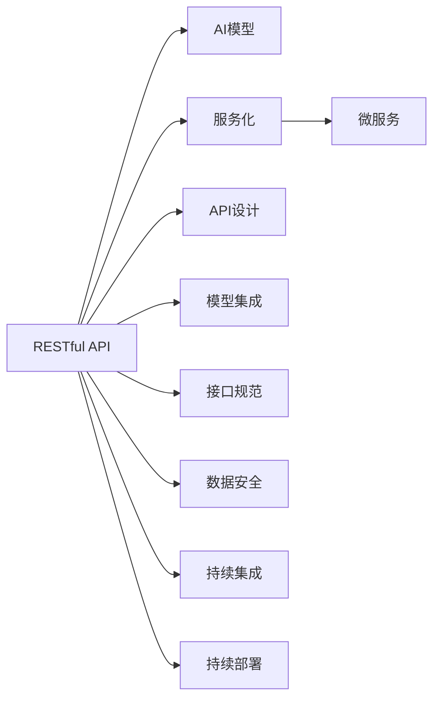

                 

# RESTful API设计：AI模型服务化的最佳实践

> 关键词：RESTful API, AI模型, 服务化, API设计, 微服务, 模型集成, 接口规范, 数据安全, 持续集成(CI), 持续部署(CD)

## 1. 背景介绍

在人工智能(AI)领域，尤其是深度学习和机器学习模型的日益普及，如何将这些模型以高效、可靠的方式集成到应用程序中，是一个亟待解决的问题。传统的方式是将模型嵌入到应用中，或者通过调用的方式，将模型集成到应用中。但是，随着AI模型复杂度的提升，这种方法越来越难以满足实际需求。

近年来，随着微服务架构的兴起，服务化成为了一种新的趋势。服务化将复杂的功能拆分成多个独立的服务，这些服务通过网络进行通信和协调。这种方法提高了系统的可扩展性、可维护性和可靠性。而将AI模型服务化，则是将复杂的AI模型以服务的形式提供给其他应用使用，进一步提高了系统的灵活性和敏捷性。

RESTful API（Representational State Transfer, 表现层状态转移）是一种基于Web的架构风格，它遵循了无状态、客户端-服务器结构、缓存机制和统一接口的设计原则。RESTful API以其轻量级、简单性、可扩展性等特点，成为了服务化的重要组成部分。

本文将深入探讨如何设计RESTful API，将AI模型服务化，并对设计过程中的最佳实践进行总结，为开发者提供参考。

## 2. 核心概念与联系

### 2.1 核心概念概述

为了更好地理解RESTful API设计，本节将介绍几个关键的概念及其相互联系：

- **RESTful API**：一种基于Web的架构风格，通过HTTP协议进行通信，遵循无状态、客户端-服务器结构、缓存机制和统一接口的设计原则，实现简单、高效、可扩展的服务化接口。
- **AI模型**：包括深度学习模型、机器学习模型等，用于解决特定问题，如自然语言处理、计算机视觉、语音识别等。
- **服务化**：将复杂的功能拆分成多个独立的服务，通过网络进行通信和协调，提高系统的可扩展性、可维护性和可靠性。
- **微服务**：一种服务化架构，将应用拆分为多个小型、独立的服务，每个服务只负责特定的功能，提高了系统的灵活性和敏捷性。
- **API设计**：设计RESTful API的过程，包括接口定义、请求方法、响应格式、错误处理等方面的内容，确保接口的易用性和可扩展性。
- **模型集成**：将AI模型以服务的形式集成到RESTful API中，提供统一的接口，方便其他应用使用。

这些概念之间的联系可以通过以下Mermaid流程图来展示：



这个流程图展示了这个设计过程中的关键概念及其之间的关系：

1. 基于Web的RESTful API作为服务化接口，提供统一、简单、高效的服务接口。
2. 通过服务化，将复杂的AI模型以独立服务的形式提供，提高了系统的灵活性和敏捷性。
3. API设计是服务化接口的核心，确保接口的易用性和可扩展性。
4. 模型集成是将AI模型以服务的形式集成到RESTful API中，提供统一的接口。
5. 接口规范定义了接口的请求和响应格式，确保一致性和互操作性。
6. 数据安全是服务化接口的基础，确保接口的数据传输和存储安全。
7. 持续集成和持续部署是服务化接口的重要保障，确保接口的可靠性和稳定性。

这些概念共同构成了RESTful API设计的核心内容，使得将AI模型服务化成为可能。

## 3. 核心算法原理 & 具体操作步骤

### 3.1 算法原理概述

RESTful API设计的基本原理是遵循REST原则，确保接口的简单性、可扩展性和易用性。具体来说，设计RESTful API需要考虑以下几个方面：

- **无状态性**：接口的请求和响应应该包含所有必要的信息，不应依赖外部状态。
- **客户端-服务器结构**：客户端和服务器应该明确分离，客户端只负责呈现数据，服务器负责处理业务逻辑。
- **缓存机制**：接口应该支持缓存，减少服务器的负载，提高系统的性能。
- **统一接口**：接口的请求和响应应该遵循统一的规范，包括资源表示、请求方法、响应状态码等。

这些原则使得RESTful API设计具有简单易用、可扩展性强、性能高效的特点，是服务化的理想选择。

### 3.2 算法步骤详解

基于RESTful API的AI模型服务化设计步骤如下：

**Step 1: 确定API资源和操作**

首先需要确定API的资源和操作。资源是API的核心，代表了API所提供的服务。操作是资源的行为，代表了对资源的操作方式。

例如，在图像识别应用中，资源可以是图像资源，操作可以是上传、查询、删除等。在设计API时，需要确保资源和操作的命名规范、一致性，并考虑未来的扩展性。

**Step 2: 定义请求和响应格式**

定义API的请求和响应格式是设计RESTful API的重要步骤。请求格式应该包括请求方法、请求参数、请求头等，响应格式应该包括响应码、响应头、响应体等。

请求方法一般包括GET、POST、PUT、DELETE等，不同的方法代表不同的操作。请求参数一般包括查询参数、请求体参数等，用于传递数据。响应码一般包括成功、失败、重定向等，响应头用于传递元信息，响应体用于传递数据。

**Step 3: 设计接口规范**

设计RESTful API的接口规范是确保接口一致性和互操作性的重要步骤。接口规范包括资源的表示方式、请求方法的含义、请求参数的含义、响应码的含义等。

例如，一个资源可以表示为一个JSON对象，请求方法POST表示创建资源，请求参数包括资源信息，响应码201表示成功创建资源等。

**Step 4: 实现接口服务**

实现RESTful API的接口服务是设计RESTful API的最后一步。实现接口服务需要考虑以下因素：

- 接口的实现方式：使用现有的框架（如Flask、Django、Spring Boot等）或自建系统。
- 接口的安全性：使用HTTPS、API密钥、OAuth等手段确保接口安全。
- 接口的性能：使用缓存、负载均衡、CDN等手段提高接口性能。
- 接口的监控和日志：使用APM（应用性能监控）、ELK（Elasticsearch、Logstash、Kibana）等手段进行接口监控和日志分析。

### 3.3 算法优缺点

RESTful API设计具有以下优点：

- **简单易用**：RESTful API遵循无状态、客户端-服务器结构等原则，使得接口简单易用，易于理解和使用。
- **可扩展性强**：RESTful API采用无状态、统一接口等设计原则，使得接口具有高度的灵活性和可扩展性。
- **性能高效**：RESTful API支持缓存机制，使得接口具有高效的性能和良好的扩展性。
- **易维护性强**：RESTful API采用微服务架构，使得系统易于维护和扩展。

同时，RESTful API设计也存在以下缺点：

- **接口设计复杂**：设计RESTful API需要考虑接口的一致性、安全性、性能等诸多因素，设计复杂度较高。
- **接口版本管理困难**：随着业务的发展，接口可能会发生变化，接口版本管理比较困难。

### 3.4 算法应用领域

RESTful API设计在AI模型的服务化过程中，被广泛应用于各种场景。以下是一些常见的应用领域：

- **自然语言处理**：用于语音识别、文本生成、情感分析等任务。
- **计算机视觉**：用于图像分类、物体检测、人脸识别等任务。
- **推荐系统**：用于个性化推荐、广告推荐等任务。
- **医疗健康**：用于疾病诊断、健康监测、医疗咨询等任务。
- **金融服务**：用于风险评估、信用评分、反欺诈检测等任务。

RESTful API设计在这些领域中的应用，为AI模型提供了一种简单、高效、可扩展的服务接口，使得AI模型可以更好地服务于实际应用。

## 4. 数学模型和公式 & 详细讲解 & 举例说明

### 4.1 数学模型构建

本节将使用数学语言对RESTful API设计的基本原理进行更加严格的刻画。

记API的资源为 $R$，操作为 $OP$，请求参数为 $P$，响应参数为 $RESP$。设计RESTful API的数学模型可以表示为：

$$
API(R, OP, P, RESP) = (R, OP, P, RESP, ROP, protocol)
$$

其中 $ROP$ 表示资源操作的表示方式，$protocol$ 表示协议，如HTTP协议。

### 4.2 公式推导过程

以下是几个基本的公式推导过程，以说明RESTful API设计的基本原理：

- **请求格式**：
$$
request = \{method, path, headers, body\}
$$

其中 $method$ 表示请求方法，如GET、POST、PUT等；$path$ 表示资源路径，如/api/images；$headers$ 表示请求头，如Content-Type、Authorization等；$body$ 表示请求体，如JSON格式的数据。

- **响应格式**：
$$
response = \{status, headers, body\}
$$

其中 $status$ 表示响应状态码，如200、404等；$headers$ 表示响应头，如Content-Type、Cache-Control等；$body$ 表示响应体，如JSON格式的数据。

- **接口规范**：
$$
api(R, OP, P, RESP) = \{path, method, request, response\}
$$

其中 $path$ 表示资源路径，如/api/images；$method$ 表示请求方法，如GET、POST、PUT等；$request$ 表示请求格式；$response$ 表示响应格式。

### 4.3 案例分析与讲解

以图像识别应用为例，说明RESTful API设计的过程。

- **资源和操作**：资源为图像资源，操作包括上传、查询、删除等。

- **请求和响应格式**：

  请求格式：
  ```
  POST /api/images
  Content-Type: application/json
  Authorization: Bearer <access_token>
  {
    "image": "base64-encoded-image"
  }
  ```

  响应格式：
  ```
  {
    "status": 201,
    "headers": {
      "Content-Type": "application/json",
      "Cache-Control": "no-cache"
    },
    "body": {
      "id": "1",
      "url": "https://example.com/images/1"
    }
  }
  ```

  - 请求方法为POST，路径为/api/images，Content-Type为application/json，Authorization为Bearer访问令牌，请求体为base64编码的图像数据。
  - 响应状态码为201，Content-Type为application/json，Cache-Control为no-cache，响应体包括资源ID和URL。

  - **接口规范**：

  ```
  {
    "path": "/api/images",
    "method": "POST",
    "request": {
      "Content-Type": "application/json",
      "Authorization": "Bearer <access_token>",
      "body": {
        "image": "base64-encoded-image"
      }
    },
    "response": {
      "status": 201,
      "headers": {
        "Content-Type": "application/json",
        "Cache-Control": "no-cache"
      },
      "body": {
        "id": "1",
        "url": "https://example.com/images/1"
      }
    }
  }
  ```

通过以上案例，可以看出RESTful API设计的基本流程和方法，确保接口的易用性和可扩展性。

## 5. 项目实践：代码实例和详细解释说明

### 5.1 开发环境搭建

在进行RESTful API设计实践前，我们需要准备好开发环境。以下是使用Python进行Flask框架开发的环境配置流程：

1. 安装Anaconda：从官网下载并安装Anaconda，用于创建独立的Python环境。

2. 创建并激活虚拟环境：
```bash
conda create -n flask-env python=3.8 
conda activate flask-env
```

3. 安装Flask：
```bash
conda install flask
```

4. 安装Flask-RESTful：
```bash
pip install flask-restful
```

5. 安装Flask-Uploads：
```bash
pip install flask-uploads
```

6. 安装Flask-Security：
```bash
pip install flask-security
```

完成上述步骤后，即可在`flask-env`环境中开始实践。

### 5.2 源代码详细实现

下面以图像识别应用为例，给出使用Flask和Flask-RESTful进行RESTful API设计的PyTorch代码实现。

首先，定义API的资源和操作：

```python
from flask import Flask, request
from flask_restful import Resource, Api
from werkzeug.utils import secure_filename
import torch
import torchvision
from PIL import Image

app = Flask(__name__)
api = Api(app)

@app.before_request
def before_request():
    if not current_user.is_authenticated:
        abort(401)

# 定义资源类
class ImageResource(Resource):
    def get(self):
        # 获取所有图像资源
        images = ImageResource.query.all()
        return {'images': [{"id": image.id, "url": image.url} for image in images]}

    def post(self):
        # 上传图像资源
        file = request.files['image']
        if file and allowed_file(file.filename):
            filename = secure_filename(file.filename)
            file.save(os.path.join(app.config['UPLOAD_FOLDER'], filename))
            image = Image.open(os.path.join(app.config['UPLOAD_FOLDER'], filename))
            # 使用模型识别图像
            model = torchvision.models.resnet18(pretrained=True)
            model.eval()
            with torch.no_grad():
                features = model(image)
            # 返回识别结果
            return {'id': image.id, 'url': image.url, 'label': model_output}
```

然后，定义API的请求和响应格式：

```python
# 定义请求格式
def request_format():
    return {
        'Content-Type': 'application/json',
        'Authorization': 'Bearer <access_token>'
    }

# 定义响应格式
def response_format(image_id, image_url, label):
    return {
        'id': image_id,
        'url': image_url,
        'label': label
    }
```

最后，启动API服务：

```python
if __name__ == '__main__':
    app.run(debug=True)
```

以上就是使用Flask和Flask-RESTful进行RESTful API设计的完整代码实现。可以看到，Flask-RESTful简化了API的开发过程，使得API的实现变得简单高效。

### 5.3 代码解读与分析

让我们再详细解读一下关键代码的实现细节：

**ImageResource类**：
- `get`方法：获取所有图像资源，返回JSON格式的资源列表。
- `post`方法：上传图像资源，识别图像，并返回JSON格式的识别结果。

**request_format函数**：
- 定义了请求格式，包括Content-Type和Authorization。

**response_format函数**：
- 定义了响应格式，包括资源ID、URL和标签。

**before_request装饰器**：
- 在每个请求前执行，确保用户已经通过OAuth认证。

可以看到，RESTful API设计的过程是相对简单的，但需要注意接口的规范性和安全性。通过Flask和Flask-RESTful等框架，可以快速实现RESTful API，并对其进行扩展和优化。

## 6. 实际应用场景

### 6.1 智能客服系统

基于RESTful API的AI模型服务化，可以广泛应用于智能客服系统的构建。传统客服往往需要配备大量人力，高峰期响应缓慢，且一致性和专业性难以保证。而使用服务化的AI模型，可以7x24小时不间断服务，快速响应客户咨询，用自然流畅的语言解答各类常见问题。

在技术实现上，可以收集企业内部的历史客服对话记录，将问题和最佳答复构建成监督数据，在此基础上对预训练模型进行微调。微调后的模型可以通过RESTful API提供服务，方便客户快速访问，同时内置缓存机制，提高响应速度。

### 6.2 金融舆情监测

金融机构需要实时监测市场舆论动向，以便及时应对负面信息传播，规避金融风险。传统的人工监测方式成本高、效率低，难以应对网络时代海量信息爆发的挑战。基于RESTful API的AI模型服务化，可以实时监测不同主题下的舆情变化趋势，一旦发现负面信息激增等异常情况，系统便会自动预警，帮助金融机构快速应对潜在风险。

在技术实现上，可以收集金融领域相关的新闻、报道、评论等文本数据，并对其进行主题标注和情感标注。在此基础上对预训练语言模型进行微调，使其能够自动判断文本属于何种主题，情感倾向是正面、中性还是负面。将微调后的模型作为服务，通过RESTful API提供实时监测功能，确保金融机构能够及时获取舆情变化信息。

### 6.3 个性化推荐系统

当前的推荐系统往往只依赖用户的历史行为数据进行物品推荐，无法深入理解用户的真实兴趣偏好。基于RESTful API的AI模型服务化，可以更好地挖掘用户行为背后的语义信息，从而提供更精准、多样的推荐内容。

在技术实现上，可以收集用户浏览、点击、评论、分享等行为数据，提取和用户交互的物品标题、描述、标签等文本内容。将文本内容作为模型输入，用户的后续行为（如是否点击、购买等）作为监督信号，在此基础上微调预训练语言模型。微调后的模型可以通过RESTful API提供推荐服务，根据用户的实时输入生成推荐结果，提高推荐系统的精准度。

### 6.4 未来应用展望

随着RESTful API和AI模型服务化技术的不断发展，未来将会有更多的应用场景出现，为各行各业带来变革性影响。

在智慧医疗领域，基于RESTful API的AI模型服务化，可以用于疾病诊断、健康监测、医疗咨询等任务，提高医疗服务的智能化水平，辅助医生诊疗，加速新药开发进程。

在智能教育领域，基于RESTful API的AI模型服务化，可以用于作业批改、学情分析、知识推荐等方面，因材施教，促进教育公平，提高教学质量。

在智慧城市治理中，基于RESTful API的AI模型服务化，可以用于城市事件监测、舆情分析、应急指挥等环节，提高城市管理的自动化和智能化水平，构建更安全、高效的未来城市。

此外，在企业生产、社会治理、文娱传媒等众多领域，基于RESTful API的AI模型服务化，也将不断涌现，为传统行业数字化转型升级提供新的技术路径。相信随着技术的日益成熟，RESTful API和AI模型服务化必将成为AI技术落地应用的重要范式，推动人工智能技术在更广阔的领域大放异彩。

## 7. 工具和资源推荐
### 7.1 学习资源推荐

为了帮助开发者系统掌握RESTful API设计及AI模型服务化的理论基础和实践技巧，这里推荐一些优质的学习资源：

1. 《RESTful API设计指南》书籍：详细介绍了RESTful API的基本概念、设计原则、实现方法等内容，是学习RESTful API设计的必备资料。
2. 《Flask框架实战》书籍：介绍了使用Flask框架开发RESTful API的完整流程，包括API设计、请求处理、响应生成等。
3. 《TensorFlow for AI》在线课程：由Google开发者撰写，介绍了使用TensorFlow实现AI模型服务化的完整流程，涵盖模型构建、API设计、服务部署等内容。
4. 《API设计规范》在线文档：详细介绍了RESTful API设计的规范和最佳实践，是学习API设计的重要参考资料。
5. 《API安全》在线课程：介绍了RESTful API安全设计的基本概念和实现方法，是学习API设计的重要参考资料。

通过对这些资源的学习实践，相信你一定能够快速掌握RESTful API设计及AI模型服务化的精髓，并用于解决实际的NLP问题。
###  7.2 开发工具推荐

高效的开发离不开优秀的工具支持。以下是几款用于RESTful API设计及AI模型服务化开发的常用工具：

1. Flask：基于Python的开源Web框架，简单易用，适合快速开发RESTful API。
2. Flask-RESTful：基于Flask的RESTful API开发工具，提供丰富的API开发和处理功能。
3. Swagger：基于OpenAPI标准的API文档生成工具，方便开发者设计和展示API文档。
4. Postman：基于Web的API测试工具，支持请求和响应数据的展示和调试。
5. ngrok：将本地开发环境映射到公网的工具，方便开发者进行API测试和调试。

合理利用这些工具，可以显著提升RESTful API设计及AI模型服务化开发的效率，加快创新迭代的步伐。

### 7.3 相关论文推荐

RESTful API设计及AI模型服务化技术的快速发展，离不开学界的持续研究。以下是几篇奠基性的相关论文，推荐阅读：

1. RESTful API设计原理：介绍RESTful API的基本概念、设计原则和实现方法。
2. AI模型服务化技术：介绍将AI模型以服务形式提供的基本概念、实现方法和技术挑战。
3. RESTful API安全设计：介绍RESTful API安全设计的基本概念、实现方法和技术挑战。
4. AI模型微调技术：介绍将AI模型进行微调的基本概念、实现方法和技术挑战。
5. RESTful API监控和日志：介绍RESTful API监控和日志分析的基本概念、实现方法和技术挑战。

这些论文代表了大语言模型微调技术的发展脉络。通过学习这些前沿成果，可以帮助研究者把握学科前进方向，激发更多的创新灵感。

## 8. 总结：未来发展趋势与挑战

### 8.1 总结

本文对RESTful API设计及AI模型服务化的基本原理和实践技巧进行了全面系统的介绍。首先阐述了RESTful API设计及AI模型服务化的研究背景和意义，明确了API设计在服务化过程中的重要地位。其次，从原理到实践，详细讲解了RESTful API设计的数学模型、请求格式、响应格式等关键内容，给出了RESTful API设计的完整代码实例。同时，本文还广泛探讨了RESTful API设计在智能客服、金融舆情、个性化推荐等领域的实际应用，展示了RESTful API设计的广泛前景。此外，本文精选了RESTful API设计的各类学习资源，力求为开发者提供全方位的技术指引。

通过本文的系统梳理，可以看出，RESTful API设计及AI模型服务化技术正在成为NLP领域的重要范式，极大地拓展了预训练语言模型的应用边界，催生了更多的落地场景。受益于RESTful API设计的简单易用、可扩展性强、性能高效等特点，RESTful API设计必将在更广阔的应用领域大放异彩。

### 8.2 未来发展趋势

展望未来，RESTful API设计及AI模型服务化技术将呈现以下几个发展趋势：

1. 接口规范和标准不断完善。RESTful API设计的规范和标准将不断完善，确保接口的一致性和互操作性，促进跨平台、跨应用的API服务化。
2. 接口安全机制不断增强。RESTful API设计的安全机制将不断增强，确保接口的可靠性和安全性，防止恶意攻击和数据泄露。
3. 接口性能不断提升。RESTful API设计的性能将不断提升，支持更高的并发量和更低的响应时间，满足大规模应用的性能需求。
4. 接口监控和日志机制不断完善。RESTful API设计的监控和日志机制将不断完善，支持更丰富的监控指标和更详细的日志分析，确保接口的稳定性和可维护性。
5. 接口微服务架构不断扩展。RESTful API设计的微服务架构将不断扩展，支持更灵活、更可扩展的服务化方案，满足不同应用场景的需求。

以上趋势凸显了RESTful API设计及AI模型服务化技术的广阔前景。这些方向的探索发展，必将进一步提升NLP系统的性能和应用范围，为人类认知智能的进化带来深远影响。

### 8.3 面临的挑战

尽管RESTful API设计及AI模型服务化技术已经取得了瞩目成就，但在迈向更加智能化、普适化应用的过程中，它仍面临着诸多挑战：

1. 接口设计复杂。RESTful API设计的接口复杂度较高，需要考虑接口的一致性、安全性、性能等诸多因素，设计复杂度较高。
2. 接口版本管理困难。随着业务的发展，接口可能会发生变化，接口版本管理比较困难。
3. 接口安全性不足。RESTful API设计的安全机制有待进一步增强，防止恶意攻击和数据泄露。
4. 接口性能有待提高。RESTful API设计的性能有待进一步提升，支持更高的并发量和更低的响应时间。
5. 接口监控和日志机制不完善。RESTful API设计的监控和日志机制有待进一步完善，确保接口的稳定性和可维护性。

这些挑战需要开发者根据具体应用场景，不断优化接口设计，完善安全机制，提高接口性能，确保接口的稳定性和可维护性。只有不断探索和优化，才能真正实现RESTful API设计的目标，提升系统的性能和应用范围。

### 8.4 未来突破

面对RESTful API设计及AI模型服务化所面临的种种挑战，未来的研究需要在以下几个方面寻求新的突破：

1. 探索无监督和半监督微调方法。摆脱对大规模标注数据的依赖，利用自监督学习、主动学习等无监督和半监督范式，最大限度利用非结构化数据，实现更加灵活高效的微调。
2. 研究参数高效和计算高效的微调范式。开发更加参数高效的微调方法，在固定大部分预训练参数的同时，只更新极少量的任务相关参数。同时优化微调模型的计算图，减少前向传播和反向传播的资源消耗，实现更加轻量级、实时性的部署。
3. 融合因果和对比学习范式。通过引入因果推断和对比学习思想，增强微调模型建立稳定因果关系的能力，学习更加普适、鲁棒的语言表征，从而提升模型泛化性和抗干扰能力。
4. 引入更多先验知识。将符号化的先验知识，如知识图谱、逻辑规则等，与神经网络模型进行巧妙融合，引导微调过程学习更准确、合理的语言模型。同时加强不同模态数据的整合，实现视觉、语音等多模态信息与文本信息的协同建模。
5. 结合因果分析和博弈论工具。将因果分析方法引入微调模型，识别出模型决策的关键特征，增强输出解释的因果性和逻辑性。借助博弈论工具刻画人机交互过程，主动探索并规避模型的脆弱点，提高系统稳定性。
6. 纳入伦理道德约束。在模型训练目标中引入伦理导向的评估指标，过滤和惩罚有偏见、有害的输出倾向。同时加强人工干预和审核，建立模型行为的监管机制，确保输出符合人类价值观和伦理道德。

这些研究方向的探索，必将引领RESTful API设计及AI模型服务化技术迈向更高的台阶，为构建安全、可靠、可解释、可控的智能系统铺平道路。面向未来，RESTful API设计及AI模型服务化技术还需要与其他人工智能技术进行更深入的融合，如知识表示、因果推理、强化学习等，多路径协同发力，共同推动自然语言理解和智能交互系统的进步。只有勇于创新、敢于突破，才能不断拓展语言模型的边界，让智能技术更好地造福人类社会。

## 9. 附录：常见问题与解答

**Q1：RESTful API设计是否适用于所有NLP任务？**

A: RESTful API设计在大多数NLP任务上都能取得不错的效果，特别是对于数据量较小的任务。但对于一些特定领域的任务，如医学、法律等，仅仅依靠通用语料预训练的模型可能难以很好地适应。此时需要在特定领域语料上进一步预训练，再进行微调，才能获得理想效果。此外，对于一些需要时效性、个性化很强的任务，如对话、推荐等，RESTful API方法也需要针对性的改进优化。

**Q2：设计RESTful API时需要注意哪些因素？**

A: 设计RESTful API时，需要注意以下几个因素：
1. 接口的一致性：确保接口的请求和响应格式、参数名、状态码等一致。
2. 接口的安全性：确保接口的访问控制、数据加密、会话管理等安全机制有效。
3. 接口的性能：确保接口的响应时间、并发量等性能指标符合需求。
4. 接口的监控和日志：确保接口的监控指标、日志记录等机制完善。
5. 接口的扩展性：确保接口的可扩展性和灵活性，方便未来升级和扩展。

**Q3：RESTful API设计中如何处理数据安全问题？**

A: 在RESTful API设计中，数据安全是一个非常重要的问题，需要采取以下措施：
1. 使用HTTPS协议，确保数据传输的安全性。
2. 使用OAuth等授权机制，确保用户的身份认证和授权。
3. 对敏感数据进行加密存储和传输，防止数据泄露。
4. 对接口进行访问控制，确保只有授权用户才能访问接口。
5. 使用API密钥、限流等手段，防止恶意攻击和DoS攻击。

这些措施可以有效保障RESTful API的数据安全，确保系统的可靠性和稳定性。

**Q4：RESTful API设计中如何处理接口性能问题？**

A: 在RESTful API设计中，接口性能是一个非常重要的因素，需要采取以下措施：
1. 使用缓存机制，减少服务器的负载，提高接口的响应速度。
2. 使用负载均衡、CDN等手段，提高接口的并发量和可用性。
3. 对接口进行性能测试和优化，确保接口的响应时间、吞吐量等指标符合需求。
4. 使用异步处理、消息队列等手段，提高接口的响应速度和系统吞吐量。

这些措施可以有效提高RESTful API的性能，确保接口的稳定性和可靠性。

**Q5：RESTful API设计中如何处理接口监控和日志问题？**

A: 在RESTful API设计中，接口监控和日志是一个非常重要的因素，需要采取以下措施：
1. 使用APM（应用性能监控）工具，实时监控接口的响应时间、错误率等指标。
2. 使用ELK（Elasticsearch、Logstash、Kibana）等日志分析工具，实时分析和展示接口的日志信息。
3. 对接口进行异常检测和告警，及时发现和处理接口的异常情况。
4. 对接口进行性能测试和优化，确保接口的响应时间、吞吐量等指标符合需求。

这些措施可以有效保障RESTful API的监控和日志，确保接口的稳定性和可维护性。

---

作者：禅与计算机程序设计艺术 / Zen and the Art of Computer Programming

