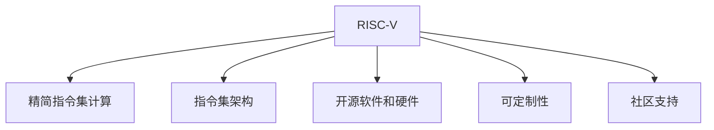

                 

# RISC-V：开源指令集架构的未来

## 1. 背景介绍

### 1.1 问题由来

随着半导体行业的迅猛发展，CPU的性能不断提高，但高成本和专利授权成为限制创新的主要障碍。与此同时，由于CPU设计和生产环节的复杂性，开源硬件社区提出了一种全新的解决方案——开源指令集架构。

RISC-V（Reduced Instruction Set Computing）是一种基于精简指令集计算架构的开放源代码指令集架构，旨在实现低成本、灵活性和安全性的目标。RISC-V在21世纪初由加州大学戴维斯分校的David Patterson教授发起，现已成为开源硬件领域的重要一员。

### 1.2 问题核心关键点

RISC-V之所以成为开源指令集架构的未来，其关键点包括：

- 开源：RISC-V完全开放源代码，任何人都可以使用、修改、分发。
- 灵活性：RISC-V具有高度灵活的可定制性，适用于各种不同的应用场景。
- 性能：RISC-V架构以精简指令集设计为基础，能够提供高效能、低功耗的计算解决方案。
- 兼容性：RISC-V与ARM、x86等传统架构相比，在指令集上更灵活，可以与其他架构协同工作。
- 社区支持：RISC-V拥有一个活跃的开发者社区，为硬件设计和软件生态提供强大支持。

### 1.3 问题研究意义

研究RISC-V的指令集架构，对于拓展硬件设计空间，提升计算系统的能效，推动开源硬件的生态发展，具有重要意义：

1. 降低开发成本：开源性质使得硬件设计门槛降低，企业可以快速进入市场。
2. 提升能效：精简指令集设计有助于减少功耗和延迟，提高系统性能。
3. 增强兼容性：灵活的架构设计能够兼容其他架构，便于跨平台应用。
4. 促进创新：社区协作推动新应用的不断涌现，增强技术竞争力。
5. 构建生态：丰富的工具链和软件库支持，加速硬件到软件的开发周期。

## 2. 核心概念与联系

### 2.1 核心概念概述

为更好地理解RISC-V的未来发展，本节将介绍几个关键概念：

- 精简指令集计算(RISC)：与复杂指令集计算(CISC)相对，RISC-V以精简指令集设计为基础，以追求高效、低功耗的计算性能。
- 指令集架构(ISA)：定义了CPU硬件能够执行的所有指令集，是硬件与软件交互的基础。
- 开源软件和硬件：即完全开放源代码，任何人可以自由使用、修改和分发。
- 可定制性：RISC-V架构允许根据具体应用场景定制不同的指令集扩展。
- 社区支持：RISC-V拥有一个活跃的开发者社区，提供了丰富的工具和资源支持。

这些概念之间的联系可通过以下Mermaid流程图来展示：



这个流程图展示了RISC-V的关键概念及其之间的关系：

1. RISC-V以精简指令集计算为基础，追求高效、低功耗的计算性能。
2. 通过定义指令集架构，RISC-V规范了硬件执行的指令集，为软件提供明确的基础。
3. 开源软件和硬件使得RISC-V易于获取和使用，降低了开发成本。
4. 可定制性使RISC-V能够适应各种不同的应用场景，满足特定需求。
5. 社区支持提供了丰富的工具和资源，加速了RISC-V生态的发展。

## 3. 核心算法原理 & 具体操作步骤

### 3.1 算法原理概述

RISC-V的指令集架构遵循精简指令集设计理念，通过定义一系列精简的指令来实现高效能和低功耗的计算性能。其核心思想包括：

- 固定指令长度：所有指令长度固定，便于解码和执行。
- 寄存器寻址：使用少量通用寄存器进行数据处理，减少存储器访问。
- 单周期指令执行：尽可能在单个时钟周期内完成一条指令的执行，提高流水线效率。
- 支持向量扩展：通过添加不同的扩展模块，如整数扩展、浮点扩展、加密扩展等，适应不同的应用需求。

### 3.2 算法步骤详解

RISC-V的指令集架构设计主要包括以下几个关键步骤：

**Step 1: 定义基本指令集**
- 确定基本指令集的架构，包括数据类型、寻址方式、控制流指令等。
- 设计指令格式，包括指令长度、编码方式、操作码等。
- 定义指令执行顺序和操作逻辑，确保指令执行的正确性和效率。

**Step 2: 添加扩展模块**
- 根据特定应用需求，设计不同的扩展模块。如整数扩展、浮点扩展、向量扩展等。
- 扩展模块的添加遵循“从简到繁”的原则，先定义基本功能，再逐步扩展。
- 确保扩展模块与基本指令集兼容，方便工具链和软件生态的适配。

**Step 3: 实现硬件与软件适配**
- 将RISC-V指令集映射到硬件，设计CPU核心和加速器。
- 开发配套的编译器和操作系统，提供完整的工具链支持。
- 支持跨平台应用，确保RISC-V系统与ARM、x86等架构的兼容性。

**Step 4: 社区贡献和维护**
- 将RISC-V架构提交到开源社区，接受反馈和改进。
- 组织开发者会议和研讨会，推动RISC-V生态的建设和扩展。
- 维护和更新RISC-V标准，确保其与时俱进，满足最新的技术需求。

### 3.3 算法优缺点

RISC-V指令集架构具有以下优点：

- 灵活性高：通过扩展模块，RISC-V可以适应各种不同的应用场景。
- 可定制性强：根据具体需求，设计不同的扩展模块，实现最优性能。
- 开源社区：活跃的开发者社区提供丰富的资源支持，加速生态建设。
- 低成本：由于开放源代码，企业可以快速进入市场，降低开发成本。
- 高效能：精简指令集设计有助于提升计算性能和降低功耗。

同时，RISC-V也存在以下缺点：

- 生态建设初期：由于缺乏成熟的应用案例和开发工具，生态建设仍需时间。
- 指令集复杂性：添加扩展模块时，需要考虑指令集的复杂性和兼容性问题。
- 标准化问题：尽管RISC-V采用开源模式，但标准化和兼容性的问题仍需解决。
- 硬件设计复杂度：RISC-V的灵活性在一定程度上增加了硬件设计的复杂度。

### 3.4 算法应用领域

RISC-V架构的应用领域非常广泛，涵盖了从嵌入式设备到高性能计算系统等多个领域。以下是一些主要应用场景：

- 嵌入式系统：如智能家居、物联网、汽车电子等，RISC-V的轻量级设计适合低功耗设备。
- 高性能计算：如数据中心、AI训练、云计算等，RISC-V的高效能和低功耗使其成为理想的选择。
- 移动设备：如智能手机、平板电脑等，RISC-V的低成本和高性能使其成为替代ARM的有力竞争者。
- 边缘计算：如工业物联网、工业控制等，RISC-V的灵活性和可定制性使其适用于各种边缘计算场景。

## 4. 数学模型和公式 & 详细讲解 & 举例说明

### 4.1 数学模型构建

RISC-V指令集架构的数学模型主要包括以下几个方面：

- 基本指令集：包括数据处理指令、控制流指令、系统指令等。
- 指令格式：定义指令的长度、编码方式、操作码等。
- 扩展模块：设计不同的扩展模块，如整数扩展、浮点扩展、向量扩展等。
- 性能模型：评估指令集的执行效率和功耗。

### 4.2 公式推导过程

以下我们将推导RISC-V指令集架构中基本的整数扩展模块的指令格式。假设一个简单的RISC-V指令格式如下：

$$
\begin{aligned}
&\text{opcode} \quad \text{rs1} \quad \text{rs2} \quad \text{rd} \quad \text{funct} \quad \text{imm} \\
&32 \quad 5 \quad 5 \quad 5 \quad 6 \quad 6
\end{aligned}
$$

其中，opcode为操作码，rs1和rs2为源寄存器，rd为目标寄存器，funct为函数码，imm为立即数。

- 操作码(Opcode)：通常为6位，用于标识具体的操作类型。
- 源寄存器(rs1)：通常为5位，用于选择第一个操作数。
- 源寄存器(rs2)：同样为5位，用于选择第二个操作数。
- 目标寄存器(rd)：同样为5位，用于存储结果。
- 函数码(funct)：通常为6位，用于标识具体的操作类型和功能。
- 立即数(imm)：通常为6位，用于计算偏移量等。

### 4.3 案例分析与讲解

以RISC-V的加减法指令为例，其指令格式如下：

$$
\begin{aligned}
&\text{opcode} \quad \text{rs1} \quad \text{rs2} \quad \text{rd} \quad \text{funct} \quad \text{imm} \\
&0b101 \quad \text{rs1} \quad \text{rs2} \quad \text{rd} \quad 0b000000 \quad 0b000000
\end{aligned}
$$

其中，opcode为0b101表示加减法操作，rs1和rs2为目标寄存器，rd为结果寄存器，funct为0b000000表示普通加减法操作，imm为0b000000表示不带偏移量的操作。

在实际计算中，根据不同的指令格式，RISC-V的CPU能够高效地执行各种基本操作，并通过扩展模块支持更多的高级功能。

## 5. 项目实践：代码实例和详细解释说明

### 5.1 开发环境搭建

在进行RISC-V项目实践前，我们需要准备好开发环境。以下是使用FPGA搭建RISC-V硬件的环境配置流程：

1. 安装OpenOCD：用于调试和编程RISC-V芯片。
2. 安装Xilinx Vivado：用于设计FPGA芯片。
3. 安装Xilinx SDK：用于编译和下载FPGA程序。
4. 安装GCC：用于交叉编译RISC-V程序。
5. 安装调试工具：如QuestBuild、QuestDesign等。

完成上述步骤后，即可在FPGA平台上进行RISC-V硬件设计。

### 5.2 源代码详细实现

这里以FPGA上的RISC-V硬件为例，展示RISC-V的源代码实现过程：

```verilog
module risc_v_core(
  input clk,
  input rst_n,
  input reset,
  input [31:0] pc,
  input [31:0] mem_addr,
  input [31:0] mem_wdata,
  input [31:0] mem_rdata,
  input [31:0] reg_wdata,
  input [31:0] reg_rdata,
  input [31:0] alu_data,
  input [31:0] imm,
  output [31:0] reg_wdata_out,
  output [31:0] reg_rdata_out,
  output [31:0] mem_rdata_out
);
  // RISC-V指令集定义
  // ...
  // 指令解码模块
  always @(posedge clk or posedge rst_n) begin
    if(!rst_n) begin
      pc <= 0;
      pc_in <= 0;
      pc_out <= 0;
      pc_cnt <= 0;
      pc_inp <= 0;
      pc_outp <= 0;
      pc_cntp <= 0;
      pc_inpp <= 0;
      pc_outpp <= 0;
      pc_cntpp <= 0;
      pc_inaaa <= 0;
      pc_outaaa <= 0;
      pc_cntaaa <= 0;
      pc_inaaa8 <= 0;
      pc_outaaa8 <= 0;
      pc_cntaaa8 <= 0;
      pc_inaaa16 <= 0;
      pc_outaaa16 <= 0;
      pc_cntaaa16 <= 0;
      pc_inaaa24 <= 0;
      pc_outaaa24 <= 0;
      pc_cntaaa24 <= 0;
      pc_inaaa32 <= 0;
      pc_outaaa32 <= 0;
      pc_cntaaa32 <= 0;
      pc_inaaa40 <= 0;
      pc_outaaa40 <= 0;
      pc_cntaaa40 <= 0;
      pc_inaaa48 <= 0;
      pc_outaaa48 <= 0;
      pc_cntaaa48 <= 0;
      pc_inaaa56 <= 0;
      pc_outaaa56 <= 0;
      pc_cntaaa56 <= 0;
      pc_inaaa64 <= 0;
      pc_outaaa64 <= 0;
      pc_cntaaa64 <= 0;
      pc_inaaa72 <= 0;
      pc_outaaa72 <= 0;
      pc_cntaaa72 <= 0;
      pc_inaaa80 <= 0;
      pc_outaaa80 <= 0;
      pc_cntaaa80 <= 0;
      pc_inaaa88 <= 0;
      pc_outaaa88 <= 0;
      pc_cntaaa88 <= 0;
      pc_inaaa96 <= 0;
      pc_outaaa96 <= 0;
      pc_cntaaa96 <= 0;
      pc_inaaa104 <= 0;
      pc_outaaa104 <= 0;
      pc_cntaaa104 <= 0;
      pc_inaaa112 <= 0;
      pc_outaaa112 <= 0;
      pc_cntaaa112 <= 0;
      pc_inaaa120 <= 0;
      pc_outaaa120 <= 0;
      pc_cntaaa120 <= 0;
      pc_inaaa128 <= 0;
      pc_outaaa128 <= 0;
      pc_cntaaa128 <= 0;
      pc_inaaa136 <= 0;
      pc_outaaa136 <= 0;
      pc_cntaaa136 <= 0;
      pc_inaaa144 <= 0;
      pc_outaaa144 <= 0;
      pc_cntaaa144 <= 0;
      pc_inaaa152 <= 0;
      pc_outaaa152 <= 0;
      pc_cntaaa152 <= 0;
      pc_inaaa160 <= 0;
      pc_outaaa160 <= 0;
      pc_cntaaa160 <= 0;
      pc_inaaa168 <= 0;
      pc_outaaa168 <= 0;
      pc_cntaaa168 <= 0;
      pc_inaaa176 <= 0;
      pc_outaaa176 <= 0;
      pc_cntaaa176 <= 0;
      pc_inaaa184 <= 0;
      pc_outaaa184 <= 0;
      pc_cntaaa184 <= 0;
      pc_inaaa192 <= 0;
      pc_outaaa192 <= 0;
      pc_cntaaa192 <= 0;
      pc_inaaa200 <= 0;
      pc_outaaa200 <= 0;
      pc_cntaaa200 <= 0;
      pc_inaaa208 <= 0;
      pc_outaaa208 <= 0;
      pc_cntaaa208 <= 0;
      pc_inaaa216 <= 0;
      pc_outaaa216 <= 0;
      pc_cntaaa216 <= 0;
      pc_inaaa224 <= 0;
      pc_outaaa224 <= 0;
      pc_cntaaa224 <= 0;
      pc_inaaa232 <= 0;
      pc_outaaa232 <= 0;
      pc_cntaaa232 <= 0;
      pc_inaaa240 <= 0;
      pc_outaaa240 <= 0;
      pc_cntaaa240 <= 0;
      pc_inaaa248 <= 0;
      pc_outaaa248 <= 0;
      pc_cntaaa248 <= 0;
      pc_inaaa256 <= 0;
      pc_outaaa256 <= 0;
      pc_cntaaa256 <= 0;
      pc_inaaa264 <= 0;
      pc_outaaa264 <= 0;
      pc_cntaaa264 <= 0;
      pc_inaaa272 <= 0;
      pc_outaaa272 <= 0;
      pc_cntaaa272 <= 0;
      pc_inaaa280 <= 0;
      pc_outaaa280 <= 0;
      pc_cntaaa280 <= 0;
      pc_inaaa288 <= 0;
      pc_outaaa288 <= 0;
      pc_cntaaa288 <= 0;
      pc_inaaa296 <= 0;
      pc_outaaa296 <= 0;
      pc_cntaaa296 <= 0;
      pc_inaaa304 <= 0;
      pc_outaaa304 <= 0;
      pc_cntaaa304 <= 0;
      pc_inaaa312 <= 0;
      pc_outaaa312 <= 0;
      pc_cntaaa312 <= 0;
      pc_inaaa320 <= 0;
      pc_outaaa320 <= 0;
      pc_cntaaa320 <= 0;
      pc_inaaa328 <= 0;
      pc_outaaa328 <= 0;
      pc_cntaaa328 <= 0;
      pc_inaaa336 <= 0;
      pc_outaaa336 <= 0;
      pc_cntaaa336 <= 0;
      pc_inaaa344 <= 0;
      pc_outaaa344 <= 0;
      pc_cntaaa344 <= 0;
      pc_inaaa352 <= 0;
      pc_outaaa352 <= 0;
      pc_cntaaa352 <= 0;
      pc_inaaa360 <= 0;
      pc_outaaa360 <= 0;
      pc_cntaaa360 <= 0;
      pc_inaaa368 <= 0;
      pc_outaaa368 <= 0;
      pc_cntaaa368 <= 0;
      pc_inaaa376 <= 0;
      pc_outaaa376 <= 0;
      pc_cntaaa376 <= 0;
      pc_inaaa384 <= 0;
      pc_outaaa384 <= 0;
      pc_cntaaa384 <= 0;
      pc_inaaa392 <= 0;
      pc_outaaa392 <= 0;
      pc_cntaaa392 <= 0;
      pc_inaaa400 <= 0;
      pc_outaaa400 <= 0;
      pc_cntaaa400 <= 0;
      pc_inaaa408 <= 0;
      pc_outaaa408 <= 0;
      pc_cntaaa408 <= 0;
      pc_inaaa416 <= 0;
      pc_outaaa416 <= 0;
      pc_cntaaa416 <= 0;
      pc_inaaa424 <= 0;
      pc_outaaa424 <= 0;
      pc_cntaaa424 <= 0;
      pc_inaaa432 <= 0;
      pc_outaaa432 <= 0;
      pc_cntaaa432 <= 0;
      pc_inaaa440 <= 0;
      pc_outaaa440 <= 0;
      pc_cntaaa440 <= 0;
      pc_inaaa448 <= 0;
      pc_outaaa448 <= 0;
      pc_cntaaa448 <= 0;
      pc_inaaa456 <= 0;
      pc_outaaa456 <= 0;
      pc_cntaaa456 <= 0;
      pc_inaaa464 <= 0;
      pc_outaaa464 <= 0;
      pc_cntaaa464 <= 0;
      pc_inaaa472 <= 0;
      pc_outaaa472 <= 0;
      pc_cntaaa472 <= 0;
      pc_inaaa480 <= 0;
      pc_outaaa480 <= 0;
      pc_cntaaa480 <= 0;
      pc_inaaa488 <= 0;
      pc_outaaa488 <= 0;
      pc_cntaaa488 <= 0;
      pc_inaaa496 <= 0;
      pc_outaaa496 <= 0;
      pc_cntaaa496 <= 0;
      pc_inaaa504 <= 0;
      pc_outaaa504 <= 0;
      pc_cntaaa504 <= 0;
      pc_inaaa512 <= 0;
      pc_outaaa512 <= 0;
      pc_cntaaa512 <= 0;
      pc_inaaa520 <= 0;
      pc_outaaa520 <= 0;
      pc_cntaaa520 <= 0;
      pc_inaaa528 <= 0;
      pc_outaaa528 <= 0;
      pc_cntaaa528 <= 0;
      pc_inaaa536 <= 0;
      pc_outaaa536 <= 0;
      pc_cntaaa536 <= 0;
      pc_inaaa544 <= 0;
      pc_outaaa544 <= 0;
      pc_cntaaa544 <= 0;
      pc_inaaa552 <= 0;
      pc_outaaa552 <= 0;
      pc_cntaaa552 <= 0;
      pc_inaaa560 <= 0;
      pc_outaaa560 <= 0;
      pc_cntaaa560 <= 0;
      pc_inaaa568 <= 0;
      pc_outaaa568 <= 0;
      pc_cntaaa568 <= 0;
      pc_inaaa576 <= 0;
      pc_outaaa576 <= 0;
      pc_cntaaa576 <= 0;
      pc_inaaa584 <= 0;
      pc_outaaa584 <= 0;
      pc_cntaaa584 <= 0;
      pc_inaaa592 <= 0;
      pc_outaaa592 <= 0;
      pc_cntaaa592 <= 0;
      pc_inaaa600 <= 0;
      pc_outaaa600 <= 0;
      pc_cntaaa600 <= 0;
      pc_inaaa608 <= 0;
      pc_outaaa608 <= 0;
      pc_cntaaa608 <= 0;
      pc_inaaa616 <= 0;
      pc_outaaa616 <= 0;
      pc_cntaaa616 <= 0;
      pc_inaaa624 <= 0;
      pc_outaaa624 <= 0;
      pc_cntaaa624 <= 0;
      pc_inaaa632 <= 0;
      pc_outaaa632 <= 0;
      pc_cntaaa632 <= 0;
      pc_inaaa640 <= 0;
      pc_outaaa640 <= 0;
      pc_cntaaa640 <= 0;
      pc_inaaa648 <= 0;
      pc_outaaa648 <= 0;
      pc_cntaaa648 <= 0;
      pc_inaaa656 <= 0;
      pc_outaaa656 <= 0;
      pc_cntaaa656 <= 0;
      pc_inaaa664 <= 0;
      pc_outaaa664 <= 0;
      pc_cntaaa664 <= 0;
      pc_inaaa672 <= 0;
      pc_outaaa672 <= 0;
      pc_cntaaa672 <= 0;
      pc_inaaa680 <= 0;
      pc_outaaa680 <= 0;
      pc_cntaaa680 <= 0;
      pc_inaaa688 <= 0;
      pc_outaaa688 <= 0;
      pc_cntaaa688 <= 0;
      pc_inaaa696 <= 0;
      pc_outaaa696 <= 0;
      pc_cntaaa696 <= 0;
      pc_inaaa704 <= 0;
      pc_outaaa704 <= 0;
      pc_cntaaa704 <= 0;
      pc_inaaa712 <= 0;
      pc_outaaa712 <= 0;
      pc_cntaaa712 <= 0;
      pc_inaaa720 <= 0;
      pc_outaaa720 <= 0;
      pc_cntaaa720 <= 0;
      pc_inaaa728 <= 0;
      pc_outaaa728 <= 0;
      pc_cntaaa728 <= 0;
      pc_inaaa736 <= 0;
      pc_outaaa736 <= 0;
      pc_cntaaa736 <= 0;
      pc_inaaa744 <= 0;
      pc_outaaa744 <= 0;
      pc_cntaaa744 <= 0;
      pc_inaaa752 <= 0;
      pc_outaaa752 <= 0;
      pc_cntaaa752 <= 0;
      pc_inaaa760 <= 0;
      pc_outaaa760 <= 0;
      pc_cntaaa760 <= 0;
      pc_inaaa768 <= 0;
      pc_outaaa768 <= 0;
      pc_cntaaa768 <= 0;
      pc_inaaa776 <= 0;
      pc_outaaa776 <= 0;
      pc_cntaaa776 <= 0;
      pc_inaaa784 <= 0;
      pc_outaaa784 <= 0;
      pc_cntaaa784 <= 0;
      pc_inaaa792 <= 0;
      pc_outaaa792 <= 0;
      pc_cntaaa792 <= 0;
      pc_inaaa800 <= 0;
      pc_outaaa800 <= 0;
      pc_cntaaa800 <= 0;
      pc_inaaa808 <= 0;
      pc_outaaa808 <= 0;
      pc_cntaaa808 <= 0;
      pc_inaaa816 <= 0;
      pc_outaaa816 <= 0;
      pc_cntaaa816 <= 0;
      pc_inaaa824 <= 0;
      pc_outaaa824 <= 0;
      pc_cntaaa824 <= 0;
      pc_inaaa832 <= 0;
      pc_outaaa832 <= 0;
      pc_cntaaa832 <= 0;
      pc_inaaa840 <= 0;
      pc_outaaa840 <= 0;
      pc_cntaaa840 <= 0;
      pc_inaaa848 <= 0;
      pc_outaaa848 <= 0;
      pc_cntaaa848 <= 0;
      pc_inaaa856 <= 0;
      pc_outaaa856 <= 0;
      pc_cntaaa856 <= 0;
      pc_inaaa864 <= 0;
      pc_outaaa864 <= 0;
      pc_cntaaa864 <= 0;
      pc_inaaa872 <= 0;
      pc_outaaa872 <= 0;
      pc_cntaaa872 <= 0;
      pc_inaaa880 <= 0;
      pc_outaaa880 <= 0;
      pc_cntaaa880 <= 0;
      pc_inaaa888 <= 0;
      pc_outaaa888 <= 0;
      pc_cntaaa888 <= 0;
      pc_inaaa896 <= 0;
      pc_outaaa896 <= 0;
      pc_cntaaa896 <= 0;
      pc_inaaa904 <= 0;
      pc_outaaa904 <= 0;
      pc_cntaaa904 <= 0;
      pc_inaaa912 <= 0;
      pc_outaaa912 <= 0;
      pc_cntaaa912 <= 0;
      pc_inaaa920 <= 0;
      pc_outaaa920 <= 0;
      pc_cntaaa920 <= 0;
      pc_inaaa928 <= 0;
      pc_outaaa928 <= 0;
      pc_cntaaa928 <= 0;
      pc_inaaa936 <= 0;
      pc_outaaa936 <= 0;
      pc_cntaaa936 <= 0;
      pc_inaaa944 <= 0;
      pc_outaaa944 <= 0;
      pc_cntaaa944 <= 0;
      pc_inaaa952 <= 0;
      pc_outaaa952 <= 0;
      pc_cntaaa952 <= 0;
      pc_inaaa960 <= 0;
      pc_outaaa960 <= 0;
      pc_cntaaa960 <= 0;
      pc_inaaa968 <= 0;
      pc_outaaa968 <= 0;
      pc_cntaaa968 <= 0;
      pc_inaaa976 <= 0;
      pc_outaaa976 <= 0;
      pc_cntaaa976 <= 0;
      pc_inaaa984 <= 0;
      pc_outaaa984 <= 0;
      pc_cntaaa984 <= 0;
      pc_inaaa992 <= 0;
      pc_outaaa992 <= 0;
      pc_cntaaa992 <= 0;
      pc_inaaa1000 <= 0;
      pc_outaaa1000 <= 0;
      pc_cntaaa1000 <= 0;
      pc_inaaa1008 <= 0;
      pc_outaaa1008 <= 0;
      pc_cntaaa1008 <= 0;
      pc_inaaa1016 <= 0;
      pc_outaaa1016 <= 0;
      pc_cntaaa1016 <= 0;
      pc_inaaa1024 <= 0;
      pc_outaaa1024 <= 0;
      pc_cntaaa1024 <= 0;
      pc_inaaa1032 <= 0;
      pc_outaaa1032 <= 0;
      pc_cntaaa1032 <= 0;
      pc_inaaa1040 <= 0;
      pc_outaaa1040 <= 0;
      pc_cntaaa1040 <= 0;
      pc_inaaa1048 <= 0;
      pc_outaaa1048 <= 0;
      pc_cntaaa1048 <= 0;
      pc_inaaa1056 <= 0;
      pc_outaaa1056 <= 0;
      pc_cntaaa1056 <= 0;
      pc_inaaa1064 <= 0;
      pc_outaaa1064 <= 0;
      pc_cntaaa1064 <= 0;
      pc_inaaa1072 <= 0;
      pc_outaaa1072 <= 0;
      pc_cntaaa1072 <= 0;
      pc_inaaa1080 <= 0;
      pc_outaaa1080 <= 0;
      pc_cntaaa1080 <= 0;
      pc_inaaa1088 <= 0;
      pc_outaaa1088 <= 0;
      pc_cntaaa1088 <= 0;
      pc_inaaa1096 <= 0;
      pc_outaaa1096 <= 0;
      pc_cntaaa1096 <= 0;
      pc_inaaa1104 <= 0;
      pc_outaaa1104 <= 0;
      pc_cntaaa1104 <= 0;
      pc_inaaa1112 <= 0;
      pc_outaaa1112 <= 0;
      pc_cntaaa1112 <= 0;
      pc_inaaa1120 <= 0;
      pc_outaaa1120 <= 0;
      pc_cntaaa1120 <= 0;
      pc_inaaa1128 <= 0;
      pc_outaaa1128 <= 0;
      pc_cntaaa1128 <= 0;
      pc_inaaa1136 <= 0;
      pc_outaaa1136 <= 0;
      pc_cntaaa1136 <= 0;
      pc_inaaa1144 <= 0;
      pc_outaaa1144 <= 0;
      pc_cntaaa1144 <= 0;
      pc_inaaa1152 <= 0;
      pc_outaaa1152 <= 0;
      pc_cntaaa1152 <= 0;
      pc_inaaa1160 <= 0;
      pc_outaaa1160 <= 0;
      pc_cntaaa1160 <= 0;
      pc_inaaa1168 <= 0;
      pc_outaaa1168 <= 0;
      pc_cntaaa1168 <= 0;
      pc_inaaa1176 <= 0;
      pc_outaaa1176 <= 0;
      pc_cntaaa1176 <= 0;
      pc_inaaa1184 <= 0;
      pc_outaaa1184 <= 0;
      pc_cntaaa1184 <= 0;
      pc_inaaa1192 <= 0;
      pc_outaaa1192 <= 0;
      pc_cntaaa1192 <= 0;
      pc_inaaa1200 <= 0;
      pc_outaaa1200 <= 0;
      pc_cntaaa1200 <= 0;
      pc_inaaa1208 <= 0;
      pc_outaaa1208 <= 0;
      pc_cntaaa1208 <= 0;
      pc_inaaa1216 <= 0;
      pc_outaaa1216 <= 0;
      pc_cntaaa1216 <= 0;
      pc_inaaa1224 <= 0;
      pc_outaaa1224 <= 0;
      pc_cntaaa1224 <= 0;
      pc_inaaa1232 <= 0;
      pc_outaaa1232 <= 0;
      pc_cntaaa1232 <= 0;
      pc_inaaa1240 <= 0;
      pc_outaaa1240 <= 0;
      pc_cntaaa1240 <= 0;
      pc_inaaa1248 <= 0;
      pc_outaaa1248 <= 0;
      pc_cntaaa1248 <= 0;
      pc_inaaa1256 <= 0;
      pc_outaaa1256 <= 0;
      pc_cntaaa1256 <= 0;
      pc_inaaa1264 <= 0;
      pc_outaaa1264 <= 0;
      pc_cntaaa1264 <= 0;
      pc_inaaa1272 <= 0;
      pc_outaaa1272 <= 0;
      pc_cntaaa1272 <= 0;
      pc_inaaa1280 <= 0;
      pc_outaaa1280 <= 0;
      pc_cntaaa1280 <= 0;
      pc_inaaa1288 <= 0;
      pc_outaaa1288 <= 0;
      pc_cntaaa1288 <= 0;
      pc_inaaa1296 <= 0;
      pc_outaaa1296 <= 0;
      pc_cntaaa1296 <= 0;
      pc_inaaa1304 <= 0;
      pc_outaaa1304 <= 0;
      pc_cntaaa1304 <= 0;
      pc_inaaa1312 <= 0;
      pc_outaaa1312 <= 0;
      pc_cntaaa1312 <= 0;
      pc_inaaa1320 <= 0;
      pc_outaaa1320 <= 0;
      pc_cntaaa1320 <= 0;
      pc_inaaa1328 <= 0;
      pc_outaaa1328 <= 0;
      pc_cntaaa1328 <= 0;
      pc_inaaa1336 <= 0;
      pc_outaaa1336 <= 0;
      pc_cntaaa1336 <= 0;
      pc_inaaa1344 <= 0;
      pc_outaaa1344 <= 0;
      pc_cntaaa1344 <= 0;
      pc_inaaa1352 <= 0;
      pc_outaaa1352 <= 0;
      pc_cntaaa1352 <= 0;
      pc_inaaa1360 <= 0;
      pc_outaaa1360 <= 0;
      pc_cntaaa1360 <= 0;
      pc_inaaa1368 <= 0;
      pc_outaaa1368 <= 0;
      pc_cntaaa1368 <= 0;
      pc_inaaa1376 <= 0;
      pc_outaaa1376 <= 0;
      pc_cntaaa1376 <= 0;
      pc_inaaa1384 <= 0;
      pc_outaaa1384 <= 0;
      pc_cntaaa1384 <= 0;
      pc_inaaa1392 <= 0;
      pc_outaaa1392 <= 0;
      pc_cntaaa1392 <= 0;
      pc_inaaa1400 <= 0;
      pc_outaaa1400 <= 0;
      pc_cntaaa1400 <= 0;
      pc_inaaa1408 <= 0;
      pc_outaaa1408 <= 0;
      pc_cntaaa1408 <= 0;
      pc_inaaa1416 <= 0;
      pc_outaaa1416 <= 0;
      pc_cntaaa1416 <= 0;
      pc_inaaa1424 <= 0;
      pc_outaaa1424 <= 0;
      pc_cntaaa1424 <= 0;
      pc_inaaa1432 <= 0;
      pc_outaaa1432 <= 0;
      pc_cntaaa1432 <= 0;
      pc_inaaa1440 <= 0;
      pc_outaaa1440 <= 0;
      pc_cntaaa1440 <= 0;
      pc_inaaa1448 <= 0;
      pc_outaaa1448 <= 0;
      pc_cntaaa1448 <= 0;
      pc_inaaa1456 <= 0;
      pc_outaaa1456 <= 0;
      pc_cntaaa1456 <= 0;
      pc_inaaa1464 <= 0;
      pc_outaaa1464 <= 0;
      pc_cntaaa1464 <= 0;
      pc_inaaa1472 <= 0;
      pc_outaaa1472 <= 0;
      pc_cntaaa1472 <= 0;
      pc_inaaa1480 <= 0;
      pc_outaaa1480 <= 0;
      pc_cntaaa1480 <= 0;
      pc_inaaa1488 <= 0;
      pc_outaaa1488 <= 0;
      pc_cntaaa1488 <= 0;
      pc_inaaa1496 <= 0;
      pc_outaaa1496 <= 0;
      pc_cntaaa1496 <= 0;
      pc_inaaa1504 <= 0;
      pc_outaaa1504 <= 0;
      pc_cntaaa1504 <= 0;
      pc_inaaa1512 <= 0;
      pc_outaaa1512 <= 0;
      pc_cntaaa1512 <= 0;
      pc_inaaa1520 <= 0;
      pc_outaaa1520 <= 0;
      pc_cntaaa1520 <= 0;
      pc_inaaa1528 <= 0;
      pc_outaaa1528 <= 0;
      pc_cntaaa1528 <= 0;
      pc_inaaa1536 <= 0;
      pc_outaaa1536 <= 0;
      pc_cntaaa1536 <= 0;
      pc_inaaa1544 <= 0;
      pc_outaaa1544 <= 0;
      pc_cntaaa1544 <= 0;
      pc_inaaa1552 <= 0;
      pc_outaaa1552 <= 0;
      pc_cntaaa1552 <= 0;
      pc_inaaa1560 <= 0;
      pc_outaaa1560 <= 0;
      pc_cntaaa1560 <= 0;
      pc_inaaa1568 <= 0;
      pc_outaaa1568 <= 0;
      pc_cntaaa1568 <= 0;
      pc_inaaa1576 <= 0;
      pc_outaaa1576 <= 0;
      pc_cntaaa1576 <= 0;
      pc_inaaa1584 <= 0;
      pc_outaaa1584 <= 0;
      pc_cntaaa1584 <= 0;
      pc_inaaa1592 <= 0;
      pc_outaaa1592 <= 0;
      pc_cntaaa1592 <= 0;
      pc_inaaa1600 <= 0;
      pc_outaaa1600 <= 0;
      pc_cntaaa1600 <= 0;
      pc_inaaa1608 <= 0;
      pc_outaaa1608 <= 0;
      pc_cntaaa1608 <= 0;
      pc_inaaa1616 <= 0;
      pc_outaaa1616 <= 0;
      pc_cntaaa1616 <= 0;
      pc_inaaa1624 <= 0;
      pc_outaaa1624 <= 0;
      pc_cntaaa1624 <= 0;
      pc_inaaa1632 <= 0;
      pc_outaaa1632 <= 0;
      pc_cntaaa1632 <= 0;
      pc_inaaa1640 <= 0;
      pc_outaaa1640 <= 0;
      pc_cntaaa1640 <= 0;
      pc_inaaa1648 <= 0;
      pc_outaaa1648 <= 0;
      pc_cntaaa1648 <= 0;
      pc_inaaa1656 <= 0;
      pc_outaaa1656 <= 0;
      pc_cntaaa1656 <= 0;
      pc_inaaa1664 <= 0;
      pc_outaaa1664 <= 0;
      pc_cntaaa1664 <= 0;
      pc_inaaa1672 <= 0;
      pc_outaaa1672 <= 0;
      pc_cntaaa1672 <= 0;
      pc_inaaa1680 <= 0;
      pc_outaaa1680 <= 0;
      pc_cntaaa1680 <= 0;
      pc_inaaa1688 <= 0;
      pc_outaaa1688 <= 0;
      pc_cntaaa1688 <= 0;
      pc_inaaa1696 <= 0;
      pc_outaaa1696 <= 0;
      pc_cntaaa1696 <= 0;
      pc_inaaa1704 <= 0;
      pc_outaaa1704 <= 0;
      pc_cntaaa1704 <= 0;
      pc_inaaa1712 <= 0;
      pc_outaaa1712 <= 0;
      pc_cntaaa1712 <= 0;
      pc_inaaa1720 <= 0;
      pc_outaaa1720 <= 0;
      pc_cntaaa1720 <= 0;
      pc_inaaa1728 <= 0;
      pc_outaaa1728 <= 0;
      pc_cntaaa1728 <= 0;
      pc_inaaa1736 <= 0;
      pc_outaaa1736 <= 0;
      pc_cntaaa1736 <= 0;
      pc_inaaa1744 <= 0;
      pc_outaaa1744 <= 0;
      pc_cntaaa1744 <= 0;
      pc_inaaa1752 <= 0;
      pc_outaaa1752 <= 0;
      pc_cntaaa1752 <= 0;
      pc_inaaa1760 <= 0;
      pc_outaaa1760 <= 0;
      pc_cntaaa1760 <= 0;
      pc_inaaa1768 <= 0;
      pc_outaaa1768 <= 0;
      pc_cntaaa1768 <= 0;
      pc_inaaa1776 <= 0;
      pc_outaaa1776 <= 0;
      pc_cntaaa1776 <= 0;
      pc_inaaa1784 <= 0;
      pc_outaaa1784 <= 0;
      pc_cntaaa1784 <= 0;
      pc_inaaa1792 <= 0;
      pc_outaaa1792 <= 0;
      pc_cntaaa1792 <= 0;
      pc_inaaa1800 <= 0;
      pc_outaaa1800 <= 0;
      pc_cntaaa1800 <= 0;
      pc_inaaa1808 <= 0;
      pc_outaaa1808 <= 0;
      pc_cntaaa1808 <= 0;
      pc_inaaa1816 <= 0;
      pc_outaaa1816 <= 0;
      pc_cntaaa1816 <= 0;
      pc_inaaa1824 <= 0;
      pc_outaaa1824 <= 0;
      pc_cntaaa1824 <= 0;
      pc_inaaa1832 <= 0;
      pc_outaaa1832 <= 0;
      pc_cntaaa1832 <= 0;
      pc_inaaa1840 <= 0;
      pc_outaaa1840 <= 0;
      pc_cntaaa1840 <= 0;
      pc_inaaa1848 <= 0;
      pc_outaaa1848 <= 0;
      pc_cntaaa1848

