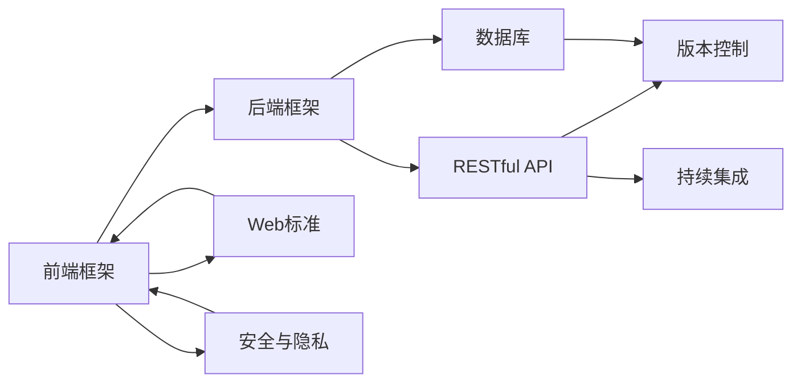

                 

# Web全栈开发：从前端到后端的全面指南

> 关键词：全栈开发, 前端框架, 后端框架, 数据库, RESTful API, 版本控制, 持续集成, Web标准, 用户体验, 安全与隐私

## 1. 背景介绍

### 1.1 问题由来

随着互联网和移动互联网的迅猛发展，Web应用的复杂度和需求日益增加。为了应对这些挑战，开发者需要具备跨前后端技术的能力，理解并掌握多种工具和框架。全栈开发由此应运而生，它要求开发者在多个技术层面进行学习和实践，以构建高可用性、高性能、易维护的Web应用。

然而，由于Web开发技术迭代迅速，新技术和新框架层出不穷，新手常常感到无从下手。本文将全面介绍Web全栈开发的核心概念和技术栈，涵盖前端、后端、数据库、版本控制、持续集成等方面，为读者提供一个全面的指南。

### 1.2 问题核心关键点

- 前端框架：如React、Vue、Angular，用于构建用户界面。
- 后端框架：如Express、Spring Boot、Django，用于处理业务逻辑和数据存储。
- 数据库：如MySQL、PostgreSQL、MongoDB，用于存储和管理数据。
- RESTful API：用于前后端通信的标准接口。
- 版本控制：如Git，用于代码版本管理和协作开发。
- 持续集成：如Jenkins、Travis CI，用于自动化构建和测试。
- Web标准：如HTML5、CSS3、JavaScript，用于提升Web应用的用户体验和性能。
- 安全与隐私：如HTTPS、JWT、OAuth，用于保障Web应用的安全性和用户隐私。

本文将围绕这些核心概念展开，深入探讨Web全栈开发的原理、技术栈和最佳实践，帮助读者构建高效、安全、易维护的Web应用。

## 2. 核心概念与联系

### 2.1 核心概念概述

Web全栈开发涉及多个技术层面，包括前端开发、后端开发、数据库、版本控制、持续集成等。这些技术之间相互关联，共同构建了一个完整的Web应用系统。

以下是对这些核心概念的简要介绍：

- **前端框架**：用于构建用户界面，通过交互操作接收用户输入，并渲染动态内容。
- **后端框架**：用于处理业务逻辑和数据存储，负责接收前端请求、处理数据和生成响应。
- **数据库**：用于存储和管理数据，支持数据的查询、插入、更新和删除等操作。
- **RESTful API**：一种基于HTTP协议的接口设计风格，支持前后端通信。
- **版本控制**：用于代码版本管理和协作开发，记录代码的变化历史，方便回溯和协作。
- **持续集成**：用于自动化构建和测试，提高代码质量和开发效率。
- **Web标准**：用于提升Web应用的用户体验和性能，确保跨浏览器和设备的兼容性。
- **安全与隐私**：用于保障Web应用的安全性和用户隐私，防止数据泄露和攻击。

这些概念之间相互依赖和支持，共同构成了Web全栈开发的技术框架。

### 2.2 核心概念原理和架构的 Mermaid 流程图



这个流程图展示了Web全栈开发的核心概念及其相互关系：

1. 前端框架通过RESTful API与后端框架交互，处理用户输入和输出。
2. 后端框架通过RESTful API与数据库交互，进行数据存储和处理。
3. 数据库通过版本控制记录数据的变化历史，支持数据的增删改查。
4. 持续集成通过版本控制自动化构建和测试，提高代码质量和开发效率。
5. Web标准提升前端应用的用户体验和性能，确保跨浏览器和设备的兼容性。
6. 安全与隐私保护Web应用的安全性和用户隐私，防止数据泄露和攻击。

这些概念共同构成了Web全栈开发的技术体系，开发者需要熟练掌握并灵活应用。

## 3. 核心算法原理 & 具体操作步骤

### 3.1 算法原理概述

Web全栈开发的核心在于构建一个前后端协同工作的系统。前端负责用户界面和交互操作，后端负责业务逻辑和数据处理。前后端通过RESTful API进行通信，实现数据的传递和交互。

具体来说，前端通过AJAX、Fetch、WebSocket等技术发送HTTP请求，后端则通过Express、Spring Boot、Django等框架处理请求，返回JSON、XML等格式的数据。数据库存储和管理数据，支持数据的增删改查。版本控制记录代码的变化历史，持续集成自动化构建和测试，保障代码质量。Web标准提升用户体验和性能，安全与隐私保障数据安全和用户隐私。

### 3.2 算法步骤详解

以下是Web全栈开发的核心算法步骤：

1. **需求分析**：明确应用的需求和功能，制定开发计划和任务。
2. **技术选型**：选择合适的技术栈和框架，考虑性能、可维护性、可扩展性等因素。
3. **环境搭建**：搭建开发环境，安装依赖库和工具。
4. **设计架构**：设计前后端架构，明确数据流和接口定义。
5. **编码实现**：实现前后端功能，编写代码和接口。
6. **测试部署**：进行单元测试、集成测试和性能测试，部署应用到生产环境。
7. **运维监控**：监控应用性能和用户反馈，进行优化和维护。

### 3.3 算法优缺点

全栈开发具有以下优点：

- **高效协作**：开发者可以全面理解项目需求和技术栈，减少沟通成本和误解。
- **无缝集成**：前后端可以无缝集成，实现流畅的用户体验和高效的数据处理。
- **技术全栈**：掌握多种技术栈和工具，提高开发效率和代码质量。

但全栈开发也存在以下缺点：

- **技术门槛高**：需要掌握多种技术和框架，学习曲线较陡。
- **工作量大**：涉及前后端多个技术层面，开发和维护工作量大。
- **时间成本高**：不同技术栈的切换和整合需要更多时间，延长项目周期。

### 3.4 算法应用领域

Web全栈开发可以应用于各种类型的Web应用，如社交网络、电子商务、在线教育、医疗健康等。具体应用场景包括：

- **社交网络**：构建社区论坛、朋友圈、私信等功能，实现用户互动和内容分享。
- **电子商务**：搭建在线商店、购物车、支付系统等功能，提供便捷的购物体验。
- **在线教育**：开发在线课程、视频直播、互动问答等功能，提升教育质量和效率。
- **医疗健康**：构建预约挂号、在线问诊、健康管理等功能，改善医疗服务质量。

## 4. 数学模型和公式 & 详细讲解 & 举例说明

### 4.1 数学模型构建

Web全栈开发涉及多个技术层面，其中以RESTful API的设计和实现最为关键。RESTful API是一种基于HTTP协议的接口设计风格，支持前后端通信。

RESTful API的数学模型可以表示为：

$$
R = \{r_1, r_2, \cdots, r_n\}
$$

其中 $r_i = (u_i, v_i, p_i)$，分别表示请求方法 $u_i$、请求路径 $v_i$ 和请求参数 $p_i$。

### 4.2 公式推导过程

RESTful API的设计需要遵循一些基本原则，包括：

1. **资源定位**：每个资源都应该有唯一的URL地址。
2. **无状态**：每个请求应该包含足够的信息，服务器不需要存储请求上下文。
3. **缓存机制**：服务器可以缓存响应，提高访问效率。
4. **统一接口**：使用标准的HTTP方法（GET、POST、PUT、DELETE等）和HTTP状态码。

根据这些原则，我们可以推导出一些常见的RESTful API设计规则：

- **GET方法**：用于获取资源，请求参数放在URL中。
- **POST方法**：用于创建资源，请求参数放在请求体中。
- **PUT方法**：用于更新资源，请求参数放在请求体中。
- **DELETE方法**：用于删除资源，请求参数放在URL中。

### 4.3 案例分析与讲解

以下是一个使用Spring Boot实现RESTful API的示例：

1. **控制器**：定义请求方法和路径，处理请求参数。
```java
@RestController
@RequestMapping("/api/users")
public class UserController {
    @GetMapping("/{id}")
    public User getUser(@PathVariable Long id) {
        // 查询数据库，返回指定ID的用户信息
    }
    
    @PostMapping
    public void addUser(@RequestBody User user) {
        // 添加新用户到数据库
    }
    
    @PutMapping("/{id}")
    public void updateUser(@PathVariable Long id, @RequestBody User user) {
        // 更新指定ID的用户信息
    }
    
    @DeleteMapping("/{id}")
    public void deleteUser(@PathVariable Long id) {
        // 删除指定ID的用户信息
    }
}
```

2. **服务层**：处理业务逻辑，调用数据库操作。
```java
@Service
public class UserService {
    @Autowired
    private UserRepository userRepository;
    
    public User getUser(Long id) {
        return userRepository.findById(id).orElse(null);
    }
    
    public void addUser(User user) {
        userRepository.save(user);
    }
    
    public void updateUser(Long id, User user) {
        User existingUser = userRepository.findById(id).orElse(null);
        if (existingUser != null) {
            existingUser.setName(user.getName());
            existingUser.setEmail(user.getEmail());
            userRepository.save(existingUser);
        }
    }
    
    public void deleteUser(Long id) {
        userRepository.deleteById(id);
    }
}
```

3. **数据库**：存储和管理用户数据。
```java
@Entity
@Table(name = "users")
public class User {
    @Id
    @GeneratedValue(strategy = GenerationType.IDENTITY)
    private Long id;
    private String name;
    private String email;
    // getter and setter
}
```

通过这些代码实现，我们能够构建一个完整的RESTful API，实现用户管理的CRUD操作。

## 5. 项目实践：代码实例和详细解释说明

### 5.1 开发环境搭建

以下是使用Python和Django框架进行Web全栈开发的环境搭建流程：

1. 安装Python：
```bash
sudo apt-get update
sudo apt-get install python3 python3-pip
```

2. 安装Django：
```bash
pip install django
```

3. 创建Django项目和应用：
```bash
django-admin startproject myproject
cd myproject
python manage.py startapp myapp
```

4. 安装依赖库：
```bash
pip install django-rest-framework djangorestframework-cors-permissions
```

完成上述步骤后，即可在Django环境中进行全栈开发。

### 5.2 源代码详细实现

以下是使用Django和RESTful API进行用户管理的代码实现：

1. **配置文件**：配置RESTful API的URL路由。
```python
from django.urls import path
from rest_framework import routers
from myapp.views import UserViewSet

router = routers.DefaultRouter()
router.register(r'users', UserViewSet)

urlpatterns = [
    path('', include(router.urls)),
]
```

2. **视图类**：定义RESTful API的接口和方法。
```python
from rest_framework.views import APIView
from rest_framework.response import Response
from .models import User
from .serializers import UserSerializer

class UserViewSet(APIView):
    def get(self, request, id=None):
        if id:
            user = User.objects.get(id=id)
            serializer = UserSerializer(user)
            return Response(serializer.data)
        else:
            users = User.objects.all()
            serializer = UserSerializer(users, many=True)
            return Response(serializer.data)
    
    def post(self, request):
        user = User.objects.create(
            name=request.data.get('name'),
            email=request.data.get('email'),
        )
        serializer = UserSerializer(user)
        return Response(serializer.data)
    
    def put(self, request, id=None):
        if id:
            user = User.objects.get(id=id)
            user.name = request.data.get('name')
            user.email = request.data.get('email')
            user.save()
            serializer = UserSerializer(user)
            return Response(serializer.data)
        else:
            raise Exception("User ID required")
    
    def delete(self, request, id=None):
        if id:
            user = User.objects.get(id=id)
            user.delete()
            return Response({"message": "User deleted"})
        else:
            raise Exception("User ID required")
```

3. **模型类**：定义数据库中的数据表结构。
```python
from django.db import models

class User(models.Model):
    name = models.CharField(max_length=100)
    email = models.EmailField()
    
    def __str__(self):
        return self.name
```

4. **序列化类**：将模型数据转换为JSON格式。
```python
from rest_framework import serializers
from .models import User

class UserSerializer(serializers.ModelSerializer):
    class Meta:
        model = User
        fields = ['id', 'name', 'email']
```

通过这些代码实现，我们能够构建一个完整的RESTful API，实现用户管理的CRUD操作。

### 5.3 代码解读与分析

让我们再详细解读一下关键代码的实现细节：

**视图类**：
- `get`方法：根据ID获取用户信息。
- `post`方法：创建新用户。
- `put`方法：更新用户信息。
- `delete`方法：删除用户。

**模型类**：
- `User`类：定义用户表结构，包含`name`和`email`字段。

**序列化类**：
- `UserSerializer`类：将`User`模型转换为JSON格式。

通过这些代码，我们能够实现RESTful API的CRUD操作，满足用户管理的各种需求。

### 5.4 运行结果展示

运行上述代码后，在浏览器中访问`http://127.0.0.1:8000/api/users`，可以看到所有用户信息。使用`POST`请求添加新用户，使用`PUT`请求更新用户信息，使用`DELETE`请求删除用户。

## 6. 实际应用场景

### 6.1 社交网络应用

社交网络应用是Web全栈开发的重要应用场景之一。以下是一些常见的社交网络应用功能：

- **用户管理**：用户注册、登录、个人信息管理。
- **动态发布**：发布状态、图片、视频等动态内容。
- **好友管理**：添加好友、查看好友动态、私信交流。
- **群组管理**：创建群组、邀请好友加入、群组动态。

使用全栈开发技术，可以构建一个完整、稳定、高效的社交网络应用，满足用户的各种需求。

### 6.2 电子商务平台

电子商务平台是Web全栈开发的另一个重要应用场景。以下是一些常见的电子商务功能：

- **商品管理**：商品分类、商品详情、商品搜索。
- **购物车管理**：添加商品、查看购物车、结算支付。
- **用户管理**：用户注册、登录、订单管理。
- **数据分析**：用户行为分析、商品销售分析、营销活动分析。

使用全栈开发技术，可以构建一个完整、稳定、高效的电子商务平台，提升用户体验和销售业绩。

### 6.3 在线教育平台

在线教育平台也是Web全栈开发的重要应用场景之一。以下是一些常见的在线教育功能：

- **课程管理**：课程发布、课程详情、课程搜索。
- **学习管理**：学习进度、学习记录、学习测试。
- **教师管理**：教师注册、教师登录、教师课程管理。
- **数据分析**：学生学习行为分析、课程效果分析、教师教学效果分析。

使用全栈开发技术，可以构建一个完整、稳定、高效的在线教育平台，提升教育质量和效率。

## 7. 工具和资源推荐

### 7.1 学习资源推荐

为了帮助开发者掌握全栈开发技术，这里推荐一些优质的学习资源：

1. **《Web全栈开发实战》系列书籍**：深入浅出地介绍了前端、后端、数据库、版本控制、持续集成等方面的内容。
2. **CS50《Web Programming with Python》课程**：哈佛大学开设的Web开发入门课程，涵盖了前端、后端、数据库等关键技术。
3. **Django官方文档**：Django框架的官方文档，提供了丰富的样例和教程，帮助开发者快速上手。
4. **《RESTful API设计指南》书籍**：详细介绍了RESTful API的设计和实现，为开发者提供设计指导。
5. **《Web标准实战》书籍**：介绍了Web标准和最佳实践，提升Web应用的性能和用户体验。

通过对这些资源的学习实践，相信你一定能够掌握全栈开发的核心技术，并应用于实际项目中。

### 7.2 开发工具推荐

以下是几款常用的全栈开发工具，可以帮助开发者提高开发效率和代码质量：

1. **Visual Studio Code**：轻量级代码编辑器，支持多种编程语言和扩展。
2. **Git**：版本控制系统，用于代码版本管理和协作开发。
3. **Docker**：容器化技术，用于构建和部署应用。
4. **Jenkins**：持续集成工具，用于自动化构建和测试。
5. **Postman**：API测试工具，用于测试RESTful API。

合理利用这些工具，可以显著提升全栈开发的工作效率，加快创新迭代的步伐。

### 7.3 相关论文推荐

全栈开发涉及多个技术层面，相关的研究论文涉及多个领域。以下是几篇经典的研究论文，推荐阅读：

1. **《Web应用程序的构建与测试》书籍**：介绍了Web应用的构建和测试方法，为全栈开发提供指导。
2. **《RESTful API的设计与实现》论文**：详细介绍了RESTful API的设计和实现，为开发者提供设计指导。
3. **《Web标准与技术演进》论文**：探讨了Web标准的演进和技术趋势，为开发者提供参考。
4. **《全栈开发的最佳实践》论文**：介绍了全栈开发的最佳实践和技术栈选择，为开发者提供参考。

这些论文代表了大规模Web开发技术的发展脉络，帮助开发者了解前沿技术和发展趋势。

## 8. 总结：未来发展趋势与挑战

### 8.1 研究成果总结

本文全面介绍了Web全栈开发的核心概念和技术栈，涵盖前端、后端、数据库、版本控制、持续集成等方面。通过理论分析和实践案例，帮助读者深入理解Web全栈开发的原理和实现方法。

### 8.2 未来发展趋势

未来，Web全栈开发将呈现以下几个发展趋势：

1. **技术融合**：前端和后端的融合将更加紧密，提升开发效率和代码质量。
2. **微服务架构**：微服务架构将更加流行，提升系统的可扩展性和维护性。
3. **低代码平台**：低代码平台将助力开发者快速构建应用，降低技术门槛。
4. **云原生技术**：云原生技术将推动Web应用向云平台迁移，提升应用的可扩展性和弹性。
5. **人工智能**：人工智能技术将深度融入Web应用，提升用户体验和自动化水平。

### 8.3 面临的挑战

尽管全栈开发技术已经取得了一定进展，但在迈向更高效、更智能、更安全的应用过程中，仍面临以下挑战：

1. **技术门槛高**：全栈开发需要掌握多种技术和工具，学习曲线较陡。
2. **开发周期长**：涉及前后端多个技术层面，开发和维护工作量大。
3. **性能瓶颈**：复杂的业务逻辑和数据处理可能带来性能瓶颈。
4. **安全风险**：Web应用面临的攻击和漏洞风险依然存在，需要持续防范和应对。
5. **用户体验**：复杂的交互操作和页面设计可能影响用户体验，需要不断优化。

### 8.4 研究展望

未来，Web全栈开发技术需要进一步发展，以应对上述挑战：

1. **简化技术栈**：开发工具和框架应进一步简化，降低技术门槛。
2. **优化性能**：优化前后端接口设计，提高数据处理效率和系统响应速度。
3. **加强安全**：引入更多安全技术和工具，防范和应对安全威胁。
4. **提升用户体验**：优化UI设计，提升页面加载速度和交互体验。
5. **融合人工智能**：将人工智能技术融入Web应用，提升自动化水平和用户体验。

这些研究方向的探索和发展，必将推动Web全栈开发技术的进步，为构建高效、安全、易维护的Web应用奠定坚实基础。

## 9. 附录：常见问题与解答

**Q1: 全栈开发需要掌握哪些关键技术？**

A: 全栈开发需要掌握以下关键技术：

- **前端开发**：如HTML、CSS、JavaScript、React、Vue、Angular等。
- **后端开发**：如Node.js、Python、Java、Express、Spring Boot、Django等。
- **数据库**：如MySQL、PostgreSQL、MongoDB等。
- **版本控制**：如Git等。
- **持续集成**：如Jenkins、Travis CI等。
- **Web标准**：如HTML5、CSS3、JavaScript等。
- **安全与隐私**：如HTTPS、JWT、OAuth等。

**Q2: 全栈开发需要哪些工具和资源？**

A: 全栈开发需要以下工具和资源：

- **开发工具**：如Visual Studio Code、Git、Docker等。
- **框架和库**：如React、Vue、Angular、Express、Spring Boot、Django等。
- **版本控制**：如Git等。
- **持续集成**：如Jenkins、Travis CI等。
- **文档和书籍**：如《Web全栈开发实战》系列书籍、Django官方文档、《RESTful API设计指南》书籍等。

**Q3: 全栈开发的工作流程是怎样的？**

A: 全栈开发的工作流程包括：

1. **需求分析**：明确应用的需求和功能，制定开发计划和任务。
2. **技术选型**：选择合适的技术栈和框架，考虑性能、可维护性、可扩展性等因素。
3. **环境搭建**：搭建开发环境，安装依赖库和工具。
4. **设计架构**：设计前后端架构，明确数据流和接口定义。
5. **编码实现**：实现前后端功能，编写代码和接口。
6. **测试部署**：进行单元测试、集成测试和性能测试，部署应用到生产环境。
7. **运维监控**：监控应用性能和用户反馈，进行优化和维护。

这些步骤相互依赖，需要协同完成，才能构建高效、安全、易维护的Web应用。

通过本文的系统梳理，可以看到，Web全栈开发技术涉及多个技术层面，需要开发者全面掌握并灵活应用。未来，随着技术的不断演进，全栈开发将更加高效、智能和可维护，为Web应用开发带来新的机遇和挑战。

---

作者：禅与计算机程序设计艺术 / Zen and the Art of Computer Programming

