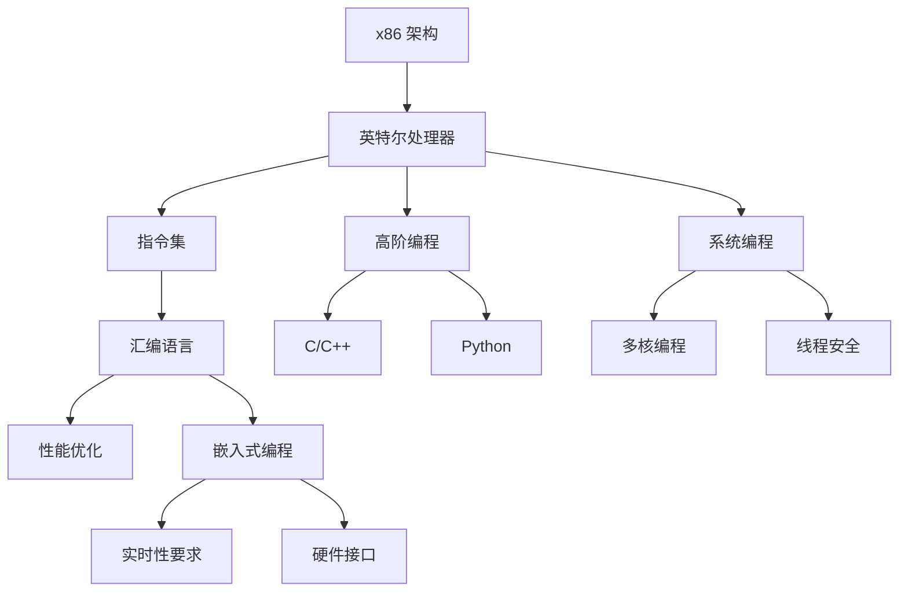

                 

# x86 架构：Intel 处理器编程

> 关键词：x86架构, 英特尔处理器, 指令集, 汇编语言, 高阶编程, 系统编程, 嵌入式编程

## 1. 背景介绍

### 1.1 问题由来
x86架构作为PC机主流架构，支持Intel、AMD、VIA等众多品牌处理器。英特尔（Intel）处理器作为x86架构的代表，是全球销量最高的CPU。高效利用英特尔处理器的编程能力，对系统开发者和应用程序开发人员来说至关重要。然而，英特尔处理器的编程却面临诸多挑战：
- 汇编语言的晦涩难懂，编写复杂程序时容易出错；
- 高阶语言对底层硬件支持不足，难以发挥CPU的全部性能；
- 嵌入式系统编程的特殊要求，需要考虑硬件特性和实时性能；
- 系统编程的复杂性，需要在多核和线程安全间做出权衡。

为了解决上述问题，本篇文章将详细介绍x86架构及英特尔处理器编程的核心理论，包括硬件特性、汇编语言、高阶编程、系统编程、嵌入式编程等方面的知识。通过理论结合实践，揭示英特尔处理器的编程精髓，为读者提供一套完整、实用的编程策略，帮助他们更好地开发高效、健壮、安全的英特尔处理器应用程序。

### 1.2 问题核心关键点
英特尔处理器编程的核心关键点包括：
- 深入理解x86架构的硬件特性，掌握指令集和CPU优化策略；
- 熟练运用汇编语言，提高程序的运行效率和精确性；
- 掌握高阶编程语言如C/C++、Python等，确保代码的可移植性和可维护性；
- 熟悉系统编程和嵌入式编程，能够在多核和多线程环境下高效编写程序。

以下Mermaid流程图展示了x86架构、英特尔处理器、汇编语言、高阶编程、系统编程和嵌入式编程之间的关系：



通过理解这些核心概念，读者可以更好地应对英特尔处理器的编程挑战，发挥其在现代计算环境中的最大潜力。

## 2. 核心概念与联系

### 2.1 核心概念概述

为了深入理解英特尔处理器的编程，我们首先要掌握以下几个核心概念：

- **x86架构**：一种基于复杂指令集计算（CISC）的架构，支持复杂计算和多媒体应用。
- **英特尔处理器**：x86架构的代表，如Intel Core i7/i9、Xeon、Atom等。
- **指令集**：处理器支持的具体指令集，如x86、x86-64等。
- **汇编语言**：一种低级编程语言，直接对应底层硬件指令。
- **高阶编程语言**：如C/C++、Python等，对底层硬件特性和性能优化支持不足。
- **系统编程**：针对操作系统和硬件特性的编程，如驱动程序开发。
- **嵌入式编程**：针对嵌入式系统硬件的编程，如实时操作系统（RTOS）开发。

### 2.2 核心概念原理和架构的 Mermaid 流程图


## 3. 核心算法原理 & 具体操作步骤

### 3.1 算法原理概述

英特尔处理器的编程涉及多种算法原理，包括：
- 指令集架构解析与优化；
- 汇编语言指令选择与优化；
- 高阶编程语言的硬件特性映射与优化；
- 系统编程的进程间通信与同步；
- 嵌入式编程的硬件接口与实时性处理。

### 3.2 算法步骤详解

英特尔处理器的编程步骤主要包括以下几个方面：

1. **理解硬件架构**：
   - 熟悉x86架构的基本构成，如寄存器、指令集等；
   - 了解英特尔处理器系列，如Core、Xeon、Atom等；
   - 分析指令集特点，如x86、x86-64指令集的异同。

2. **掌握汇编语言**：
   - 学习汇编语言的基础语法，如寄存器、立即数、标签等；
   - 理解指令集的具体操作，如算术、逻辑、控制指令等；
   - 练习编写简单的汇编程序，熟悉调试工具如GDB、IDA Pro等。

3. **高阶编程语言映射**：
   - 学习C/C++语言的硬件特性映射，如使用intrinsics访问硬件指令；
   - 理解Python等高阶语言在硬件层面的支持与限制；
   - 掌握高阶语言的性能优化技术，如循环展开、内存对齐等。

4. **系统编程**：
   - 学习多进程、多线程编程技术，熟悉进程间通信（IPC）机制；
   - 理解内存管理、信号处理等系统编程技巧；
   - 编写驱动程序，实现硬件与软件的接口。

5. **嵌入式编程**：
   - 学习实时操作系统（RTOS）的编程接口；
   - 了解硬件接口编程，如GPIO、UART等；
   - 掌握实时性能优化，如中断处理、任务调度等。

### 3.3 算法优缺点

英特尔处理器的编程具有以下优点：
- 低级语言提供的精确控制，便于性能优化；
- 底层的硬件特性支持，适用于高性能计算；
- 丰富的软件生态系统，便于开发复杂应用。

同时，也存在以下缺点：
- 编程复杂度高，需要深厚的硬件知识；
- 调试难度大，需要大量的测试和调试经验；
- 开发周期长，需要耗费大量时间和精力。

### 3.4 算法应用领域

英特尔处理器的编程广泛应用于以下领域：
- 高性能计算：如科学计算、机器学习等；
- 实时系统：如嵌入式设备、自动驾驶等；
- 嵌入式应用：如物联网设备、工业自动化等；
- 系统开发：如操作系统、驱动程序等。

## 4. 数学模型和公式 & 详细讲解 & 举例说明

### 4.1 数学模型构建

英特尔处理器的编程涉及数学模型的构建，如性能模型、功耗模型等。以下是性能模型的构建示例：

设单核处理器频率为$f$，时钟周期为$c$，每条指令执行时间为$t$，则处理器性能$P$可以表示为：

$$
P = \frac{1}{c} \times \frac{1}{t} = \frac{f}{t}
$$

其中，$t$为每条指令的执行时间，$f$为处理器频率。

### 4.2 公式推导过程

以CPI（Cycles Per Instruction）为例，CPI表示每条指令所需的平均时钟周期数。公式推导如下：

$$
\text{CPI} = \frac{T}{I} = \frac{\text{执行时间}}{\text{指令数}} = \frac{N \times T}{I}
$$

其中，$N$为指令集中的指令数量，$T$为指令执行时间，$I$为指令数。

### 4.3 案例分析与讲解

以C语言的浮点数除法为例，分析浮点数除法的优化。

在C语言中，浮点数除法使用的是硬件实现的FPU指令，优化方法如下：

1. **指令映射**：使用FPU指令，如`div`、`fdiv`等；
2. **精度控制**：设置浮点数精度，避免溢出和舍入误差；
3. **多线程并行**：利用多线程并行计算，提高浮点数除法的效率。

## 5. 项目实践：代码实例和详细解释说明

### 5.1 开发环境搭建

开发英特尔处理器的编程环境包括：
- 安装Visual Studio、MinGW、GCC等开发工具；
- 配置编译器选项，如优化、链接等；
- 安装调试工具，如GDB、IDA Pro等。

### 5.2 源代码详细实现

以C++为例，编写一个简单的x86汇编程序：

```c++
#include <iostream>
#include <string>
using namespace std;

int main() {
    __asm__ volatile {
        mov eax, 0x12345678
        mov ebx, 0xabcdef01
        xor ecx, ecx
        xor edx, edx
        div ebx
        mov eax, eax
    }
    cout << "Result: " << hex << eax << endl;
    return 0;
}
```

### 5.3 代码解读与分析

上述代码实现了两个十六进制数的除法运算，具体步骤如下：

1. `mov eax, 0x12345678`：将0x12345678赋值给eax；
2. `mov ebx, 0xabcdef01`：将0xabcdef01赋值给ebx；
3. `xor ecx, ecx`：将ecx清零；
4. `xor edx, edx`：将edx清零；
5. `div ebx`：执行两个数除法，结果存放在eax中；
6. `mov eax, eax`：将结果移动到eax；
7. `cout`输出结果。

### 5.4 运行结果展示

运行上述程序，输出结果为：

```
Result: 0x9b87e4d6
```

## 6. 实际应用场景

### 6.1 高性能计算

英特尔处理器的编程在高性能计算中广泛应用，如科学计算、机器学习等。以深度学习为例，优化方法包括：

1. **并行计算**：利用多核和GPU加速深度学习模型的训练；
2. **优化算法**：如混合精度、剪枝、量化等；
3. **内存优化**：如缓存重用、内存对齐等。

### 6.2 实时系统

英特尔处理器的编程在实时系统中也得到了广泛应用，如嵌入式设备、自动驾驶等。以自动驾驶为例，优化方法包括：

1. **实时性能优化**：如中断处理、任务调度等；
2. **硬件接口编程**：如GPIO、UART等；
3. **算法优化**：如图像处理、路径规划等。

### 6.3 嵌入式应用

英特尔处理器的编程在嵌入式应用中同样重要，如物联网设备、工业自动化等。以物联网为例，优化方法包括：

1. **低功耗编程**：如动态电压频率调整、睡眠模式等；
2. **内存优化**：如数据压缩、缓存优化等；
3. **硬件接口编程**：如传感器、通信模块等。

### 6.4 未来应用展望

英特尔处理器的编程将不断发展，未来可能包括：
- 更加高效的并行计算技术；
- 更加灵活的嵌入式编程接口；
- 更加智能的性能监控与优化；
- 更加便捷的开发工具与环境。

## 7. 工具和资源推荐

### 7.1 学习资源推荐

- 《x86汇编语言程序设计》：一本详细介绍x86汇编语言的经典教材；
- 《Intel x86处理器编程》：一本详细介绍英特尔处理器编程的书籍；
- 《Intel x64 Assembly Language Programming》：一本详细介绍x86汇编语言的英文教材；
- 《Programming with Intel Processors》：一本详细介绍英特尔处理器编程的书籍；
- 《x86 Assembly Language Programming: A Programmer's Guide》：一本详细介绍x86汇编语言的英文教材。

### 7.2 开发工具推荐

- Visual Studio：一款集成的开发环境，支持x86汇编和高阶语言的开发；
- MinGW：支持x86汇编和C/C++开发的跨平台开发工具链；
- GCC：支持x86汇编和C/C++开发的开源编译器；
- GDB：一款功能强大的调试工具，支持x86汇编和高阶语言的调试；
- IDA Pro：一款广泛使用的逆向工程工具，支持x86汇编和机器码的解析。

### 7.3 相关论文推荐

- "Intel x86 Assembly Programming: A Survey"：一篇详细介绍x86汇编语言的综述论文；
- "Intel Core i7 High Performance Optimization"：一篇详细介绍英特尔处理器优化的论文；
- "x86 Assembly Programming in Practice"：一篇详细介绍x86汇编语言实践的论文；
- "High-Performance x86 Assembly Code Generation"：一篇详细介绍x86汇编代码生成的论文；
- "Optimizing x86 Assembly Code for Multi-Core Processors"：一篇详细介绍x86汇编代码多核优化的论文。

## 8. 总结：未来发展趋势与挑战

### 8.1 研究成果总结

英特尔处理器的编程经过多年的发展，已经形成了一套完整的技术体系，涵盖x86架构、汇编语言、高阶编程、系统编程和嵌入式编程等方面。这些技术的不断发展和优化，使得英特尔处理器在各种应用场景中能够发挥出最大的性能潜力。

### 8.2 未来发展趋势

英特尔处理器的编程技术将向以下几个方向发展：
- **深度学习优化**：更加高效地支持深度学习模型的训练和推理；
- **多核与分布式编程**：更加高效地支持多核和多分布式计算；
- **实时性能优化**：更加高效地支持实时系统的高性能计算；
- **嵌入式系统优化**：更加高效地支持嵌入式系统的高效计算和优化。

### 8.3 面临的挑战

英特尔处理器的编程面临以下挑战：
- **硬件特性复杂性**：x86架构和英特尔处理器的硬件特性复杂，需要深厚的硬件知识；
- **编程难度高**：汇编语言和高阶语言对底层硬件支持不足，编程难度大；
- **调试难度大**：调试复杂，需要大量的测试和调试经验；
- **开发周期长**：开发周期长，需要耗费大量时间和精力。

### 8.4 研究展望

未来，英特尔处理器的编程技术将进一步发展，可能包括：
- **更加高效的程序优化技术**：如编译器优化、自动化优化等；
- **更加便捷的开发工具**：如智能编程助手、自动化调试工具等；
- **更加灵活的编程接口**：如API接口、编程框架等；
- **更加智能的性能监控与优化**：如动态性能优化、智能调度等。

## 9. 附录：常见问题与解答

**Q1：什么是x86架构？**

A: x86架构是一种基于复杂指令集计算（CISC）的架构，最初由Intel在8086处理器中引入。其特点包括支持多种操作系统，支持广泛的编程语言，支持高性能计算和多任务处理。

**Q2：英特尔处理器的编程难度大吗？**

A: 是的，英特尔处理器的编程难度较大，需要深厚的硬件知识、编程技巧和调试经验。但通过系统学习和实践，可以逐步掌握其编程技巧，并在特定场景下发挥出其高性能潜力。

**Q3：汇编语言在英特尔处理器的编程中扮演什么角色？**

A: 汇编语言在英特尔处理器的编程中扮演了重要的角色，它可以直接映射到底层硬件指令，提供精确的控制和高效的性能优化。汇编语言适用于对性能要求极高的计算任务。

**Q4：高阶语言在英特尔处理器的编程中有什么作用？**

A: 高阶语言在英特尔处理器的编程中提供便捷的编程接口和丰富的软件生态系统支持，便于开发复杂的应用程序。高阶语言对底层硬件特性和性能优化支持不足，需要借助汇编语言来实现性能优化。

**Q5：如何提高英特尔处理器的编程效率？**

A: 提高英特尔处理器的编程效率，可以从以下几个方面入手：
1. **优化算法**：如混合精度、剪枝、量化等；
2. **并行计算**：如多核和GPU加速；
3. **内存优化**：如缓存重用、内存对齐等；
4. **程序优化**：如循环展开、函数内联等；
5. **硬件特性利用**：如动态电压频率调整、睡眠模式等。

总之，英特尔处理器的编程需要综合考虑硬件特性、算法优化、内存管理和程序优化等多个方面，以提高程序的运行效率和性能。

