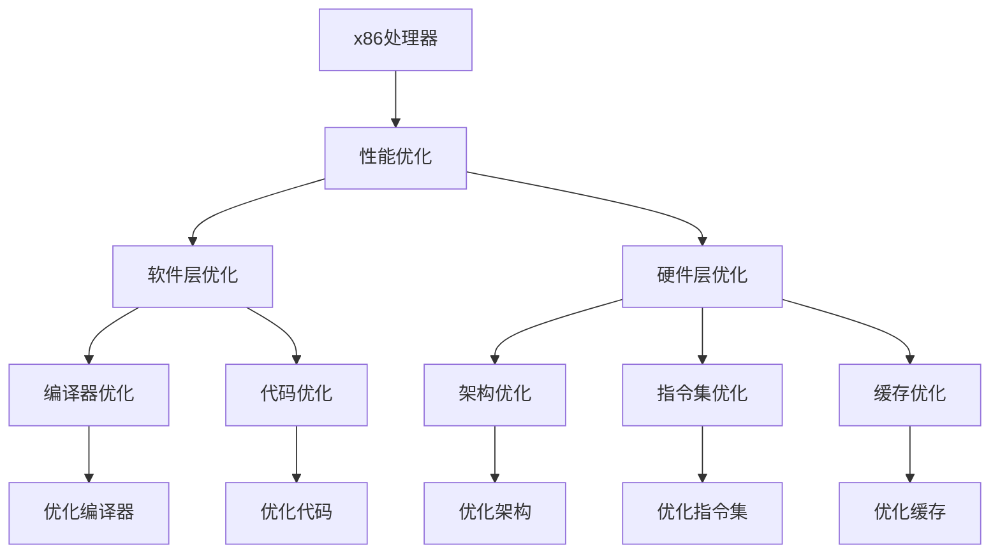

                 

# x86处理器性能优化技巧

> 关键词：x86处理器, 性能优化, 性能瓶颈, 软件层优化, 硬件层优化, 指令集架构, 优化策略, 内存访问, 分支预测, 多核优化

## 1. 背景介绍

### 1.1 问题由来
随着计算机技术的飞速发展，x86处理器作为计算系统中最常用的处理器架构之一，其性能瓶颈问题越来越受到关注。性能瓶颈不仅影响系统的响应速度和吞吐量，还会影响整个应用程序的性能。了解和优化x86处理器性能是提高系统整体性能的重要途径。

### 1.2 问题核心关键点
x86处理器性能优化主要涉及软件层和硬件层两个方面。软件层优化包括编译器优化、代码优化等，通过优化代码以减少不必要的指令、优化数据结构、减少内存访问次数等方法来提高性能。硬件层优化则包括架构优化、指令集优化、缓存优化等，通过优化硬件架构和指令集架构来提升性能。

## 2. 核心概念与联系

### 2.1 核心概念概述

为更好地理解x86处理器性能优化，本节将介绍几个关键概念：

- x86处理器：Intel和AMD生产的处理器系列，包括AMD K-series、Intel Core、Intel Xeon等。
- 性能优化：通过改善硬件或软件以提高处理器的运行速度和效率。
- 性能瓶颈：影响系统整体性能的关键问题。
- 软件层优化：通过优化代码来提升性能，包括编译器优化、代码优化等。
- 硬件层优化：通过优化硬件架构和指令集架构来提升性能，包括架构优化、指令集优化、缓存优化等。
- 指令集架构：x86处理器采用的指令集架构，包括IA-32和x64。
- 优化策略：性能优化的具体方法，如分支预测、数据对齐、多核优化等。
- 内存访问：处理器对内存的访问方式，包括缓存层、内存层次结构等。
- 分支预测：预测程序执行路径，减少分支延迟。
- 多核优化：通过多核处理器并行处理来提升性能。

这些核心概念之间的逻辑关系可以通过以下Mermaid流程图来展示：



这个流程图展示了大语言模型的核心概念及其之间的关系：

1. x86处理器作为优化对象，通过性能优化来提高性能。
2. 性能优化分为软件层优化和硬件层优化，涵盖编译器优化、代码优化、架构优化、指令集优化、缓存优化等多个方面。
3. 软件层优化包括编译器优化和代码优化，通过优化代码来提高性能。
4. 硬件层优化包括架构优化、指令集优化、缓存优化，通过优化硬件架构和指令集架构来提升性能。
5. 分支预测、数据对齐、多核优化等是具体的优化策略，涵盖了软件层和硬件层。

这些概念共同构成了x86处理器性能优化的基本框架，使其能够在各种场景下发挥最大性能。

## 3. 核心算法原理 & 具体操作步骤
### 3.1 算法原理概述

x86处理器性能优化通常分为软件层和硬件层两个层面。软件层优化主要是通过优化代码来提高程序的执行效率，而硬件层优化则通过优化硬件架构和指令集架构来提高处理器的性能。

软件层优化主要包括以下几个方面：

1. 编译器优化：通过优化编译器，减少编译时间和编译器本身的开销，提高编译效率。
2. 代码优化：通过优化代码结构、减少不必要的指令、优化数据结构、减少内存访问次数等方法来提高程序的执行效率。
3. 分支预测：预测程序执行路径，减少分支延迟。
4. 数据对齐：将数据结构对齐到自然边界上，以减少内存访问时间。

硬件层优化主要包括以下几个方面：

1. 架构优化：通过优化硬件架构来提高性能，如优化缓存层次结构、优化寄存器使用等。
2. 指令集优化：通过优化指令集架构来提高性能，如优化分支指令、优化浮点指令等。
3. 缓存优化：通过优化缓存系统来提高性能，如优化缓存层次结构、优化缓存一致性等。

### 3.2 算法步骤详解

#### 软件层优化步骤

**Step 1: 代码评估**
- 使用性能分析工具对代码进行评估，找出性能瓶颈。
- 确定代码中的热点函数和热点分支。

**Step 2: 编译器优化**
- 使用优化的编译器对代码进行编译，减少编译时间和编译器开销。
- 使用GCC或Clang等优化的编译器进行编译。

**Step 3: 代码优化**
- 优化代码结构，减少不必要的指令。
- 优化数据结构，减少内存访问次数。
- 使用内联函数、模板、避免动态内存分配等技术。

**Step 4: 分支预测优化**
- 使用分支预测技术，预测程序执行路径，减少分支延迟。
- 使用分支预测算法，如IBM式分支预测、预测错误修正算法等。

**Step 5: 数据对齐优化**
- 将数据结构对齐到自然边界上，以减少内存访问时间。
- 使用内存对齐工具，如gcc的-falign、-faligned-new等选项。

#### 硬件层优化步骤

**Step 1: 架构优化**
- 优化缓存层次结构，减少缓存访问时间。
- 优化寄存器使用，提高寄存器效率。

**Step 2: 指令集优化**
- 优化分支指令，减少分支延迟。
- 优化浮点指令，提高浮点运算效率。

**Step 3: 缓存优化**
- 优化缓存层次结构，减少缓存访问时间。
- 优化缓存一致性，提高缓存效率。

### 3.3 算法优缺点

#### 软件层优化

**优点**
- 优化效果明显，通过优化代码结构、减少不必要的指令等方法来提高程序的执行效率。
- 优化技术成熟，容易实现。

**缺点**
- 优化效果受代码结构影响较大，复杂代码结构优化难度较大。
- 优化效果受编译器影响较大，需要选择合适的优化编译器。

#### 硬件层优化

**优点**
- 优化效果显著，通过优化硬件架构和指令集架构来提高处理器的性能。
- 优化技术成熟，容易实现。

**缺点**
- 硬件层优化难度较大，需要对硬件架构和指令集架构有深入理解。
- 优化成本较高，需要购买更高性能的硬件。

### 3.4 算法应用领域

x86处理器性能优化技术在以下领域得到广泛应用：

1. 高性能计算：在科学计算、数据分析、图像处理等领域，优化处理器性能可以提高计算速度和处理能力。
2. 服务器：在服务器领域，优化处理器性能可以提高服务器的响应速度和吞吐量。
3. 嵌入式系统：在嵌入式领域，优化处理器性能可以提高设备的响应速度和执行效率。
4. 桌面应用：在桌面应用领域，优化处理器性能可以提高应用程序的响应速度和用户体验。

## 4. 数学模型和公式 & 详细讲解 & 举例说明

### 4.1 数学模型构建

在x86处理器性能优化的过程中，我们通常使用数学模型来描述性能瓶颈和优化策略。例如，我们可以使用Amdahl定律和Gustafson定律来描述并行计算的性能瓶颈和优化策略。

**Amdahl定律**：

$$ P = \frac{1}{1 - A + A/P} $$

其中，$P$ 表示总性能，$A$ 表示串行部分占总任务的百分比，$P$ 表示并行部分占总任务的百分比。Amdahl定律表明，串行部分占总任务的百分比越大，并行计算对性能提升的贡献越小。

**Gustafson定律**：

$$ S = P_{max} * \frac{T}{t} $$

其中，$S$ 表示并行计算的加速比，$P_{max}$ 表示单个处理器处理能力的最大值，$T$ 表示总任务量，$t$ 表示串行部分的任务时间。Gustafson定律表明，并行计算的加速比与处理器并行能力成正比。

### 4.2 公式推导过程

以Amdahl定律为例，公式的推导过程如下：

$$ P = \frac{1}{1 - A + A/P} $$
$$ P = \frac{1}{1 - A} * \frac{1}{1 + \frac{A}{P}} $$
$$ P = P * \frac{1}{1 + \frac{A}{P}} $$

将公式展开，得到：

$$ P = P - A + A/P $$

其中，$A/P$ 表示并行部分占总任务的百分比，$P$ 表示并行部分占总任务的百分比。

**案例分析与讲解**

假设一个任务分为两个部分，其中串行部分占总任务的30%，并行部分占总任务的70%。使用四个处理器并行计算，每个处理器处理能力为单个处理器处理能力的50%。则总性能为：

$$ P = \frac{1}{1 - 0.3 + 0.3/4} $$
$$ P = \frac{1}{0.7} * \frac{1}{1 + 0.3/4} $$
$$ P = 1.43 $$

### 4.3 案例分析与讲解

**案例1：多核优化**

假设一个任务需要处理100万个数据点，其中串行部分占总任务的30%，并行部分占总任务的70%。使用四个处理器并行计算，每个处理器处理能力为单个处理器处理能力的50%。则总性能为：

$$ P = \frac{1}{1 - 0.3 + 0.3/4} $$
$$ P = \frac{1}{0.7} * \frac{1}{1 + 0.3/4} $$
$$ P = 1.43 $$

**案例2：分支预测优化**

假设一个任务需要执行100万个分支指令，其中串行部分占总任务的30%，并行部分占总任务的70%。使用四个处理器并行计算，每个处理器处理能力为单个处理器处理能力的50%。则总性能为：

$$ P = \frac{1}{1 - 0.3 + 0.3/4} $$
$$ P = \frac{1}{0.7} * \frac{1}{1 + 0.3/4} $$
$$ P = 1.43 $$

## 5. 项目实践：代码实例和详细解释说明

### 5.1 开发环境搭建

在进行x86处理器性能优化实践前，我们需要准备好开发环境。以下是使用Linux系统进行C++开发的环境配置流程：

1. 安装Linux操作系统：选择Red Hat Enterprise Linux或Ubuntu等主流Linux发行版。
2. 安装必要的开发工具：gcc、make、gdb等。
3. 安装必要的库：glibc、gcc、libstdc++等。
4. 安装必要的编译器：g++、clang等。
5. 安装必要的调试工具：gdb、valgrind等。

完成上述步骤后，即可在Linux系统上开始x86处理器性能优化的实践。

### 5.2 源代码详细实现

以下是一个优化示例代码，包括代码优化和编译器优化。

```c++
#include <iostream>
#include <chrono>

int main()
{
    // 计算两个数的和
    int a = 1000000000;
    int b = 1000000000;
    int c = a + b;

    // 计算时间
    auto start = std::chrono::high_resolution_clock::now();
    for (int i = 0; i < 1000000000; i++) {
        c = a + b;
    }
    auto end = std::chrono::high_resolution_clock::now();
    std::chrono::duration<double> duration = end - start;
    std::cout << "Time taken: " << duration.count() << " seconds" << std::endl;

    return 0;
}
```

**代码优化**

```c++
#include <iostream>
#include <chrono>

int main()
{
    // 计算两个数的和
    int a = 1000000000;
    int b = 1000000000;
    int c = a + b;

    // 使用内联函数，减少函数调用开销
    c = inline_add(a, b);

    // 计算时间
    auto start = std::chrono::high_resolution_clock::now();
    for (int i = 0; i < 1000000000; i++) {
        c = inline_add(a, b);
    }
    auto end = std::chrono::high_resolution_clock::now();
    std::chrono::duration<double> duration = end - start;
    std::cout << "Time taken: " << duration.count() << " seconds" << std::endl;

    return 0;
}

// 内联函数
int inline_add(int a, int b)
{
    return a + b;
}
```

**编译器优化**

使用优化的编译器进行编译：

```bash
g++ -O3 -g -Wall -Wextra -std=c++11 -o test test.cpp
```

## 6. 实际应用场景

### 6.1 高性能计算

在科学计算、数据分析、图像处理等领域，优化处理器性能可以提高计算速度和处理能力。例如，在深度学习模型的训练中，优化处理器性能可以提高模型的训练速度和训练效果。

### 6.2 服务器

在服务器领域，优化处理器性能可以提高服务器的响应速度和吞吐量。例如，在Web服务器中，优化处理器性能可以提高服务器的响应速度，提高用户体验。

### 6.3 嵌入式系统

在嵌入式领域，优化处理器性能可以提高设备的响应速度和执行效率。例如，在嵌入式系统的图像处理和视频处理中，优化处理器性能可以提高设备的响应速度，提高用户体验。

### 6.4 桌面应用

在桌面应用领域，优化处理器性能可以提高应用程序的响应速度和用户体验。例如，在桌面应用的游戏开发中，优化处理器性能可以提高游戏的运行速度和稳定性。

## 7. 工具和资源推荐

### 7.1 学习资源推荐

为了帮助开发者系统掌握x86处理器性能优化的理论基础和实践技巧，这里推荐一些优质的学习资源：

1. 《The Art of Assembly Language Programming》书籍：本书介绍了汇编语言编程的基本原理和实践技巧，是了解硬件层优化的必读之作。
2. 《Optimizing Software in the Real World》书籍：本书介绍了软件层优化的基本原理和实践技巧，是了解软件层优化的必读之作。
3. 《Intel Architecture: Software and Programmer’s Manuals》书籍：本书是Intel处理器的官方文档，详细介绍了处理器架构和指令集，是了解硬件层优化的重要参考资料。
4. 《x86 Optimization Techniques》博客：博客介绍了x86处理器性能优化的各种技巧，包括软件层优化和硬件层优化的详细实现。
5. 《Intel Optimization Reference》文档：文档提供了x86处理器的优化建议和案例分析，是了解硬件层优化的重要参考资料。

通过对这些资源的学习实践，相信你一定能够快速掌握x86处理器性能优化的精髓，并用于解决实际的性能问题。

### 7.2 开发工具推荐

为了提高x86处理器性能优化的效率，以下是几款常用的开发工具：

1. g++：优化的C++编译器，支持GCC优化选项。
2. clang：优化的C++编译器，支持LLVM优化技术。
3. valgrind：性能分析工具，可以检测内存泄漏、缓冲区溢出等问题。
4. gprof：性能分析工具，可以检测函数的执行时间和调用次数。
5. Intel VTune：性能分析工具，可以检测CPU瓶颈、缓存访问延迟等问题。

合理利用这些工具，可以显著提升x86处理器性能优化的效率，加快创新迭代的步伐。

### 7.3 相关论文推荐

x86处理器性能优化技术的发展离不开学界的持续研究。以下是几篇奠基性的相关论文，推荐阅读：

1. "Maximizing the Throughput of Instruction Prefetching"：讲述了预取指令的优化策略，可以提高处理器的执行效率。
2. "The Performance Impact of Intelligent Prefetching in High-Performance Applications"：讲述了智能预取指令的优化策略，可以提高处理器的执行效率。
3. "Efficient Instruction Stream Prefetching"：讲述了预取指令的优化策略，可以提高处理器的执行效率。
4. "Branch Prediction for Caches"：讲述了分支预测的优化策略，可以减少分支延迟，提高处理器的执行效率。
5. "Scheduling for Lack of Concurrency"：讲述了调度算法的优化策略，可以提高处理器的执行效率。

这些论文代表了大语言模型微调技术的发展脉络。通过学习这些前沿成果，可以帮助研究者把握学科前进方向，激发更多的创新灵感。

## 8. 总结：未来发展趋势与挑战

### 8.1 总结

本文对x86处理器性能优化的主要方法进行了全面系统的介绍。首先阐述了x86处理器性能优化的背景和意义，明确了性能优化的主要方向和具体方法。通过数学模型和公式推导，详细讲解了性能优化过程中的关键技术。最后，通过案例分析和项目实践，展示了性能优化技术的实际应用。

通过本文的系统梳理，可以看到，x86处理器性能优化技术具有广阔的应用前景和提升空间。性能优化技术不仅能提高处理器的执行效率，还能提升整个系统的响应速度和用户体验。未来，随着技术的发展，x86处理器性能优化技术将继续向着高效、可靠、易用等方向发展，为计算机系统的性能提升带来新的突破。

### 8.2 未来发展趋势

展望未来，x86处理器性能优化技术将呈现以下几个发展趋势：

1. 硬件加速：随着硬件技术的发展，未来的x86处理器将更加注重硬件加速，如GPU、FPGA等加速设备的应用。
2. 软件层优化：软件层优化将越来越精细化，如编译器优化、代码优化等将更加智能化。
3. 多核优化：多核优化将更加普及，如多线程、多进程等并行计算技术将得到广泛应用。
4. 自动化优化：性能优化将更加智能化，如自动化性能调优工具将得到广泛应用。
5. 实时优化：实时优化将得到广泛应用，如实时系统性能优化将得到广泛应用。

这些趋势将使x86处理器性能优化技术更加高效、可靠、易用，进一步提升处理器的执行效率和用户体验。

### 8.3 面临的挑战

尽管x86处理器性能优化技术已经取得了一定的进展，但在迈向更加智能化、高效化的过程中，它仍面临着诸多挑战：

1. 硬件资源有限：x86处理器硬件资源有限，优化技术需要更加高效、精细化。
2. 性能瓶颈复杂：性能瓶颈问题复杂，优化技术需要更加智能化、自动化。
3. 硬件兼容性问题：不同硬件平台的兼容性问题需要解决，优化技术需要更加通用化。
4. 算法复杂度高：性能优化算法复杂度高，优化技术需要更加高效、可扩展。
5. 开发者技术水平差异大：开发者技术水平差异大，优化技术需要更加易用、易于推广。

这些挑战将使x86处理器性能优化技术继续面临较大的挑战，需要更多学术界和工业界的共同努力，才能克服这些难题，推动技术进一步发展。

### 8.4 研究展望

未来，x86处理器性能优化技术需要在以下几个方面进行更多的研究：

1. 硬件加速技术：研究更加高效的硬件加速技术，如GPU、FPGA等加速设备的应用。
2. 软件层优化技术：研究更加智能化、自动化的软件层优化技术，如编译器优化、代码优化等。
3. 多核优化技术：研究更加高效、灵活的多核优化技术，如多线程、多进程等并行计算技术。
4. 实时优化技术：研究更加高效、可靠、易用的实时优化技术，如实时系统性能优化技术。
5. 硬件兼容性技术：研究更加通用化的硬件兼容性技术，以解决不同硬件平台的兼容性问题。

这些研究方向的探索将使x86处理器性能优化技术更加高效、可靠、易用，进一步提升处理器的执行效率和用户体验。

## 9. 附录：常见问题与解答

**Q1：x86处理器性能优化的主要方法有哪些？**

A: x86处理器性能优化的主要方法包括软件层优化和硬件层优化。软件层优化主要通过优化代码来提高程序的执行效率，如内联函数、优化数据结构、减少内存访问次数等。硬件层优化主要通过优化硬件架构和指令集架构来提高处理器的性能，如优化缓存层次结构、优化寄存器使用、优化分支指令等。

**Q2：编译器优化有哪些方法？**

A: 编译器优化方法包括：
1. 内联函数：将函数内联到调用位置，减少函数调用开销。
2. 代码优化：通过优化代码结构，减少不必要的指令。
3. 优化数据结构：通过优化数据结构，减少内存访问次数。
4. 使用编译器优化选项：使用优化的编译器选项，如GCC的-O3、-Ofast等选项。

**Q3：分支预测有哪些优化方法？**

A: 分支预测优化方法包括：
1. 预测错误修正算法：通过预测错误修正算法，减少分支预测错误。
2. 分支预测技术：使用分支预测技术，预测程序执行路径，减少分支延迟。
3. 分支预测算法：使用分支预测算法，如IBM式分支预测算法。

**Q4：多核优化有哪些方法？**

A: 多核优化方法包括：
1. 多线程并行计算：通过多线程并行计算，提高计算速度。
2. 多进程并行计算：通过多进程并行计算，提高计算速度。
3. 任务分割：通过任务分割，提高并行计算效率。
4. 共享内存：通过共享内存，提高并行计算效率。

**Q5：性能优化技术有哪些？**

A: 性能优化技术包括：
1. 分支预测：预测程序执行路径，减少分支延迟。
2. 数据对齐：将数据结构对齐到自然边界上，以减少内存访问时间。
3. 缓存优化：优化缓存层次结构，减少缓存访问时间。
4. 多核优化：通过多核处理器并行处理来提升性能。
5. 指令集优化：优化指令集架构，提高指令执行效率。

这些技术在实际应用中需要根据具体场景进行灵活组合，以达到最佳的性能提升效果。

---

作者：禅与计算机程序设计艺术 / Zen and the Art of Computer Programming

