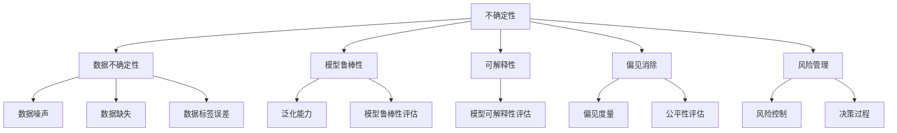

                 

# 不确定性:机器学习面临的普遍挑战

> 关键词：不确定性，机器学习，机器学习算法，数据驱动决策，可解释性，模型鲁棒性，偏见消除，风险管理，人工智能

## 1. 背景介绍

### 1.1 问题由来
在当今快速发展的科技时代，机器学习（Machine Learning, ML）已经成为解决复杂问题、驱动经济和社会进步的重要工具。然而，随着ML应用的日益广泛，人们逐渐发现机器学习系统在处理不确定性和复杂性问题上仍然存在诸多挑战。如何在不确定性和复杂性的环境中做出可靠、公正、透明的决策，是机器学习面临的一个普遍问题。

### 1.2 问题核心关键点
在机器学习中，不确定性通常来源于两个方面：一是数据的不确定性，即训练数据可能存在噪声、不完整、不平衡等；二是模型的鲁棒性，即模型可能对输入数据的微小扰动或不同分布的数据泛化能力不足。

- **数据不确定性**：数据的噪声、缺失、标签误差等问题都会导致模型的预测结果不稳定。
- **模型鲁棒性**：模型在面临不同分布的测试数据时，可能出现泛化性能下降的情况。
- **偏见和公平性**：模型可能继承训练数据中的偏见，导致决策不公平。

这些问题不仅影响模型的预测效果，还可能导致严重的社会和经济后果。例如，医疗诊断中的误诊可能导致患者受到伤害，金融决策中的错误可能导致巨大的经济损失，而公平性问题则可能导致社会不公，损害弱势群体的利益。

### 1.3 问题研究意义
研究机器学习在不确定性和复杂性环境下的表现，对于构建安全、可靠、公正的人工智能系统具有重要意义：

1. **提高预测准确性**：通过理解不确定性和鲁棒性问题，可以设计更准确、稳定的机器学习模型，减少预测误差。
2. **增强模型可解释性**：通过可解释性技术，可以揭示模型决策的逻辑和依据，提高公众对AI系统的信任度。
3. **消除偏见和促进公平**：通过消除数据中的偏见，可以构建更加公平、公正的机器学习系统，防止算法歧视。
4. **优化决策过程**：通过风险管理技术，可以为机器学习系统引入风险控制机制，确保决策过程符合伦理道德。

理解这些关键点，有助于我们在机器学习研究与开发中更好地应对挑战，提升AI系统的性能和公信力。

## 2. 核心概念与联系

### 2.1 核心概念概述

为更好地理解机器学习中的不确定性问题，本节将介绍几个核心概念：

- **不确定性**：指对某些无法确定其真实状态的事件的认知和处理。在机器学习中，不确定性通常源于数据和模型的不确定性。
- **鲁棒性**：指模型对输入数据和模型参数的微小变化具有一定的稳定性和抗干扰能力。
- **可解释性**：指机器学习模型能够清晰地解释其预测结果背后的逻辑和依据，便于用户理解和信任。
- **偏见**：指模型在训练过程中学习到的数据中的社会和文化偏见，可能导致不公平或歧视性的决策。
- **风险管理**：指通过各种手段控制和降低机器学习系统的风险，确保决策过程的稳健性和安全性。

这些核心概念之间的逻辑关系可以通过以下Mermaid流程图来展示：



这个流程图展示了大语言模型的核心概念及其之间的关系：

1. 不确定性贯穿数据和模型各个环节。
2. 数据不确定性包括噪声、缺失和标签误差等。
3. 模型鲁棒性涉及泛化能力和抗干扰能力。
4. 可解释性关注模型决策的逻辑和依据。
5. 偏见消除涉及消除数据中的社会和文化偏见。
6. 风险管理通过控制风险确保决策的稳健性。

这些概念共同构成了机器学习系统的完整框架，使其能够在各种不确定性环境下提供可靠、公正、透明的决策支持。

## 3. 核心算法原理 & 具体操作步骤
### 3.1 算法原理概述

机器学习中的不确定性处理，本质上是一个通过数据驱动决策的方法，旨在减少不确定性带来的影响，提高模型的鲁棒性和可解释性。其核心思想是：通过设计和优化模型结构，引入概率模型、可解释性技术、鲁棒性评估等手段，增强模型的稳定性和透明度。

形式化地，假设给定数据集 $D=\{(x_i,y_i)\}_{i=1}^N$，其中 $x_i$ 为输入，$y_i$ 为标签。机器学习模型的目标是通过学习数据分布，最大化模型在测试集上的表现。然而，由于数据和模型的复杂性，模型的预测结果可能存在不确定性。

为了处理这种不确定性，常见的方法包括：

- 引入概率模型：通过贝叶斯方法、蒙特卡罗方法等引入概率框架，处理数据和模型的随机性。
- 使用可解释性技术：如LIME、SHAP等，揭示模型决策的逻辑和依据，提高模型透明度。
- 引入鲁棒性评估：通过对抗样本、分布外测试等手段，评估模型的抗干扰能力和泛化性能。
- 消除偏见和公平性：通过数据预处理、模型约束等手段，消除模型中的社会和文化偏见，促进公平性。
- 风险管理：通过模型集成、不确定性量化等方法，控制和降低系统的风险，确保决策过程的稳健性。

### 3.2 算法步骤详解

基于以上思想，机器学习中的不确定性处理一般包括以下几个关键步骤：

**Step 1: 数据准备**
- 收集和清洗数据集，去除噪声、缺失值，标注正确的标签。
- 将数据集划分为训练集、验证集和测试集，确保模型在未知数据上的泛化性能。

**Step 2: 模型设计**
- 选择适当的模型架构，如线性回归、决策树、神经网络等。
- 引入概率模型，如贝叶斯网络、高斯过程等，处理数据和模型的随机性。
- 设计可解释性技术，如LIME、SHAP等，揭示模型决策的逻辑和依据。

**Step 3: 模型训练**
- 使用训练集数据，通过优化算法（如梯度下降、Adam等）训练模型参数。
- 在验证集上评估模型性能，调整模型参数或架构，避免过拟合。

**Step 4: 模型评估**
- 在测试集上评估模型泛化性能，使用鲁棒性评估技术（如对抗样本、分布外测试等）测试模型的抗干扰能力和泛化性能。
- 使用公平性评估技术（如偏见度量、公平性指标等）确保模型决策的公平性。

**Step 5: 风险管理**
- 通过模型集成、不确定性量化等方法，控制和降低系统的风险。
- 引入决策支持系统，对模型输出进行二次审查和风险控制。

### 3.3 算法优缺点

基于数据驱动决策的机器学习方法，在处理不确定性问题上有以下优点：

1. **数据驱动**：通过大量的数据驱动模型训练，能够捕捉数据中的复杂模式，提高预测准确性。
2. **自动化**：模型训练和评估过程可以自动化进行，节省大量人力成本。
3. **适应性**：模型能够适应新的数据和环境，具有一定的灵活性。

但同时也存在一些缺点：

1. **数据依赖性强**：模型性能高度依赖于训练数据的质量和数量，数据质量问题可能导致模型失效。
2. **模型复杂性**：复杂模型虽然预测准确性高，但难以解释，增加了模型的可解释性难度。
3. **鲁棒性差**：模型可能对输入数据的微小扰动或不同分布的数据泛化能力不足，容易出现鲁棒性问题。
4. **偏见风险**：模型可能继承训练数据中的偏见，导致决策不公平。

在实际应用中，需要根据具体问题选择合适的方法，平衡模型的预测准确性和鲁棒性、可解释性等指标。

### 3.4 算法应用领域

基于数据驱动决策的机器学习方法，已经在多个领域得到广泛应用，例如：

- 金融风险管理：通过机器学习模型评估贷款风险、预测股票价格等。
- 医疗诊断：利用机器学习模型进行疾病诊断、预测病人风险等。
- 自动驾驶：使用机器学习模型进行环境感知、路径规划等。
- 推荐系统：通过机器学习模型进行个性化推荐、广告投放等。
- 智能客服：利用机器学习模型进行自然语言处理、情感分析等。

这些领域中，机器学习模型在处理不确定性和复杂性问题上已经取得了显著的进展，并在实际应用中取得了良好的效果。

## 4. 数学模型和公式 & 详细讲解 & 举例说明
### 4.1 数学模型构建

本节将使用数学语言对机器学习中的不确定性处理进行更加严格的刻画。

假设给定数据集 $D=\{(x_i,y_i)\}_{i=1}^N$，其中 $x_i$ 为输入，$y_i$ 为标签。机器学习模型的目标是找到一个函数 $f(x)$，使得 $f(x)$ 在 $D$ 上的平均损失最小化。

定义模型 $f(x)$ 在输入 $x$ 上的损失函数为 $\ell(f(x),y)$，则在数据集 $D$ 上的经验风险为：

$$
\mathcal{L}(f) = \frac{1}{N}\sum_{i=1}^N \ell(f(x_i),y_i)
$$

为了处理不确定性，我们可以引入概率模型，如贝叶斯网络、高斯过程等。通过定义模型 $f(x)$ 的概率分布 $p(f|D)$，可以在不确定性和鲁棒性方面进行更深入的建模。

### 4.2 公式推导过程

以下我们以高斯过程为例，推导其在处理不确定性问题中的应用。

假设模型 $f(x)$ 为高斯过程，其先验概率分布为：

$$
p(f|D) = \mathcal{N}(f|F_{GP},\sigma^2_R)
$$

其中 $F_{GP}$ 为先验均值函数，$\sigma^2_R$ 为先验方差。对于给定的输入 $x$，模型输出 $f(x)$ 的条件概率分布为：

$$
p(f(x)|x,D) = \mathcal{N}(f(x)|f_{GP}(x),\sigma^2_{GP}(x))
$$

其中 $f_{GP}(x)$ 为先验均值函数的预测，$\sigma^2_{GP}(x)$ 为先验方差的预测。通过贝叶斯推断，可以更新先验分布，得到后验分布：

$$
p(f|x,D) = \mathcal{N}(f|f_{GP}(x),\sigma^2_{GP}(x))
$$

通过后验分布，可以计算模型在给定输入 $x$ 下的不确定性和鲁棒性。

### 4.3 案例分析与讲解

假设我们有一个房价预测模型，使用数据集 $D$ 进行训练。在模型训练过程中，我们发现模型对输入数据的微小扰动非常敏感，泛化性能差。这说明模型存在一定的鲁棒性问题。

为了解决这一问题，我们可以引入高斯过程模型，对模型的预测进行不确定性量化。具体做法如下：

1. **数据准备**：收集和清洗房价数据，标注正确的标签。
2. **模型设计**：选择高斯过程模型作为预测模型，定义先验概率分布。
3. **模型训练**：使用训练集数据，通过优化算法训练模型参数。
4. **模型评估**：在测试集上评估模型泛化性能，使用对抗样本测试模型的鲁棒性。
5. **风险管理**：通过模型集成、不确定性量化等方法，控制和降低系统的风险。

通过引入高斯过程模型，我们可以更好地量化模型的预测不确定性，提高模型的鲁棒性和可解释性，确保模型在实际应用中的可靠性。

## 5. 项目实践：代码实例和详细解释说明
### 5.1 开发环境搭建

在进行不确定性处理实践前，我们需要准备好开发环境。以下是使用Python进行Scikit-learn开发的环境配置流程：

1. 安装Anaconda：从官网下载并安装Anaconda，用于创建独立的Python环境。

2. 创建并激活虚拟环境：
```bash
conda create -n sklearn-env python=3.8 
conda activate sklearn-env
```

3. 安装Scikit-learn：
```bash
conda install scikit-learn
```

4. 安装各类工具包：
```bash
pip install numpy pandas scikit-learn matplotlib tqdm jupyter notebook ipython
```

完成上述步骤后，即可在`sklearn-env`环境中开始不确定性处理实践。

### 5.2 源代码详细实现

下面我们以房价预测为例，给出使用Scikit-learn对高斯过程模型进行不确定性量化的PyTorch代码实现。

首先，定义高斯过程模型：

```python
from sklearn.gaussian_process import GaussianProcessRegressor
from sklearn.gaussian_process.kernels import RBF, WhiteKernel

kernel = RBF(length_scale=1.0, gamma=0.1) + WhiteKernel(noise_level=1.0, noise_level_bounds=(1e-9, 1e-6))

gpr = GaussianProcessRegressor(kernel=kernel, alpha=0.0)
```

然后，定义训练和评估函数：

```python
from sklearn.metrics import mean_squared_error
from sklearn.model_selection import train_test_split

def train_gpr(data):
    X = data[:, 0]
    y = data[:, 1]
    X_train, X_test, y_train, y_test = train_test_split(X, y, test_size=0.2, random_state=42)
    gpr.fit(X_train[:, None], y_train[:, None])
    return gpr, X_test, y_test

def evaluate_gpr(gpr, X_test, y_test):
    y_pred, y_std = gpr.predict(X_test[:, None], return_std=True)
    mse = mean_squared_error(y_test, y_pred)
    print(f"Mean Squared Error: {mse:.3f}")
    print(f"Standard Deviation: {y_std:.3f}")
```

最后，启动训练流程并在测试集上评估：

```python
import numpy as np

# 生成模拟数据
np.random.seed(42)
X = np.linspace(0, 10, 100)
y = np.sin(X) + np.random.normal(0, 0.2, size=100)

# 训练模型
gpr, X_test, y_test = train_gpr(np.column_stack((X, y)))

# 评估模型
evaluate_gpr(gpr, X_test, y_test)
```

以上就是使用Scikit-learn对高斯过程模型进行不确定性量化的完整代码实现。可以看到，通过引入高斯过程模型，我们能够更好地量化模型的预测不确定性，提高模型的鲁棒性和可解释性，确保模型在实际应用中的可靠性。

### 5.3 代码解读与分析

让我们再详细解读一下关键代码的实现细节：

**GaussianProcessRegressor类**：
- `kernel`参数：定义高斯过程模型的内核函数，通常包括径向基函数（RBF）、白噪声核等。
- `alpha`参数：先验方差，控制模型的灵活性。

**train_gpr函数**：
- 将数据集分为训练集和测试集，使用训练集数据拟合高斯过程模型，返回模型和测试集数据。

**evaluate_gpr函数**：
- 使用模型预测测试集数据，计算预测值与真实值之间的均方误差和标准差，评估模型性能。

**训练流程**：
- 生成模拟数据，将数据分为训练集和测试集。
- 使用训练集数据拟合高斯过程模型。
- 在测试集上评估模型性能，输出均方误差和预测标准差。

通过这些代码实现，我们可以清晰地看到高斯过程模型在处理不确定性问题中的具体应用。

## 6. 实际应用场景
### 6.1 智能推荐系统

基于不确定性处理的推荐系统，可以显著提升推荐的准确性和可靠性。传统推荐系统往往只依赖用户历史行为数据，难以捕捉用户的动态偏好和复杂需求。通过引入不确定性和鲁棒性技术，推荐系统可以更好地理解用户的行为和需求，提供更个性化、可靠的推荐。

在实践中，可以收集用户的历史行为数据，使用不确定性处理方法（如高斯过程、贝叶斯网络等）对模型进行优化。优化后的模型能够更好地量化用户偏好和需求的不确定性，提高推荐的鲁棒性和可解释性。同时，通过引入公平性评估技术，确保推荐系统不会对特定用户群体产生偏见，促进公平性。

### 6.2 风险管理与金融预测

金融风险管理是机器学习在不确定性处理中的重要应用场景。通过引入不确定性和鲁棒性技术，金融预测模型可以更好地评估贷款风险、预测股票价格等。

在实践中，可以使用贝叶斯网络、高斯过程等概率模型对金融数据进行建模，处理数据的不确定性和鲁棒性问题。同时，通过引入公平性评估技术，确保模型决策的公平性。通过风险管理技术，可以对模型输出进行二次审查和风险控制，确保决策过程的稳健性。

### 6.3 医疗诊断与疾病预测

医疗诊断是机器学习在不确定性处理中的另一个重要应用场景。通过引入不确定性和鲁棒性技术，医疗诊断模型可以更好地评估病人的风险、预测疾病的发生等。

在实践中，可以使用贝叶斯网络、高斯过程等概率模型对医疗数据进行建模，处理数据的不确定性和鲁棒性问题。同时，通过引入公平性评估技术，确保模型决策的公平性。通过风险管理技术，可以对模型输出进行二次审查和风险控制，确保诊断过程的稳健性。

### 6.4 未来应用展望

随着不确定性处理技术的不断进步，其在机器学习中的应用将越来越广泛，带来更多的创新和突破。

在智慧城市治理中，基于不确定性处理的机器学习模型可以用于城市事件监测、舆情分析、应急指挥等环节，提高城市管理的自动化和智能化水平，构建更安全、高效的未来城市。

在教育领域，基于不确定性处理的机器学习模型可以用于个性化推荐、作业批改、学情分析等环节，因材施教，促进教育公平，提高教学质量。

在交通领域，基于不确定性处理的机器学习模型可以用于路径规划、交通流量预测等环节，提高交通管理的效率和安全性。

此外，在自动驾驶、智能制造、智能客服等众多领域，基于不确定性处理的机器学习模型也将不断涌现，为各行各业带来新的技术突破和应用前景。

## 7. 工具和资源推荐
### 7.1 学习资源推荐

为了帮助开发者系统掌握不确定性处理的技术基础和实践技巧，这里推荐一些优质的学习资源：

1. 《机器学习实战》：介绍机器学习的基本概念和常见算法，涵盖不确定性处理的基本方法。
2. 《深度学习》（Ian Goodfellow等）：全面介绍深度学习的基本原理和应用，涉及不确定性处理的前沿技术。
3. 《贝叶斯网络与数据挖掘》（Michael Ghosh）：详细介绍贝叶斯网络的应用，包括不确定性和鲁棒性处理。
4. 《高斯过程入门》（Raul Morales）：全面介绍高斯过程的应用，包括不确定性和鲁棒性处理。
5. 《机器学习导论》（Tom Mitchell）：介绍机器学习的基本概念和算法，涵盖不确定性和鲁棒性处理。

通过对这些资源的学习实践，相信你一定能够快速掌握不确定性处理的核心技术，并用于解决实际的机器学习问题。

### 7.2 开发工具推荐

高效的开发离不开优秀的工具支持。以下是几款用于不确定性处理开发的常用工具：

1. Scikit-learn：Python数据科学库，提供了丰富的机器学习算法和工具，支持不确定性处理技术。
2. TensorFlow：Google开发的开源深度学习框架，支持复杂的模型结构和不确定性处理技术。
3. PyTorch：Facebook开发的开源深度学习框架，支持复杂模型和不确定性处理技术。
4. Keras：高层深度学习库，支持多种不确定性处理方法，易于上手。
5. Weights & Biases：模型训练的实验跟踪工具，可以记录和可视化模型训练过程中的各项指标，方便调试和优化。

合理利用这些工具，可以显著提升不确定性处理任务的开发效率，加快创新迭代的步伐。

### 7.3 相关论文推荐

不确定性处理技术的发展源于学界的持续研究。以下是几篇奠基性的相关论文，推荐阅读：

1. "Bayesian Nonparametrics for Big Data"（Jitendra Mallick等）：提出贝叶斯非参数方法处理大数据中的不确定性问题。
2. "Gaussian Processes for Machine Learning"（Carl E. Rasmussen等）：全面介绍高斯过程的应用，包括不确定性和鲁棒性处理。
3. "Bayesian networks and decision trees"（Judea Pearl等）：详细介绍贝叶斯网络的应用，包括不确定性和鲁棒性处理。
4. "Robust statistical methods for data assimilation and their computational implementation"（Charles J. van der Merwe等）：介绍鲁棒统计方法在数据同化中的应用，处理不确定性和鲁棒性问题。
5. "A probabilistic outlook on deep learning"（Yann LeCun等）：从概率的角度介绍深度学习的基本原理，涉及不确定性和鲁棒性处理。

这些论文代表了大语言模型不确定性处理技术的发展脉络。通过学习这些前沿成果，可以帮助研究者把握学科前进方向，激发更多的创新灵感。

## 8. 总结：未来发展趋势与挑战
### 8.1 总结

本文对机器学习中的不确定性处理进行了全面系统的介绍。首先阐述了机器学习在处理不确定性和复杂性问题上存在的挑战，明确了不确定性处理在提升模型稳定性和可解释性方面的重要性。其次，从原理到实践，详细讲解了不确定性处理的数学模型和关键步骤，给出了不确定性处理任务开发的完整代码实例。同时，本文还广泛探讨了不确定性处理在智能推荐、金融预测、医疗诊断等众多领域的应用前景，展示了不确定性处理技术的巨大潜力。此外，本文精选了不确定性处理技术的各类学习资源，力求为读者提供全方位的技术指引。

通过本文的系统梳理，可以看到，基于数据驱动决策的机器学习方法在不确定性和复杂性环境下的处理能力，已经取得显著进展。未来，伴随不确定性处理技术的不断演进，机器学习系统将在更广阔的应用领域大放异彩，深刻影响人类的生产生活方式。

### 8.2 未来发展趋势

展望未来，不确定性处理技术将呈现以下几个发展趋势：

1. **概率模型和鲁棒性评估**：随着深度学习和大数据技术的发展，概率模型（如贝叶斯网络、高斯过程等）和鲁棒性评估技术将得到更广泛的应用，提升机器学习系统的稳定性和鲁棒性。
2. **可解释性和公平性**：可解释性技术（如LIME、SHAP等）和公平性评估技术（如偏见度量、公平性指标等）将得到进一步发展和应用，增强机器学习系统的透明度和公平性。
3. **多模态数据整合**：将符号化的先验知识（如知识图谱、逻辑规则等）与神经网络模型进行融合，实现多模态信息与文本信息的协同建模，提升机器学习系统的决策能力。
4. **分布外泛化**：通过对抗样本、分布外测试等手段，评估模型在未知数据和环境下的泛化性能，确保机器学习系统的稳健性和安全性。
5. **模型集成与不确定性量化**：通过模型集成、不确定性量化等方法，控制和降低系统的风险，确保决策过程的稳健性。

以上趋势凸显了机器学习系统在处理不确定性和复杂性问题上的重要性和可能性。这些方向的探索发展，必将进一步提升机器学习系统的性能和公信力，为构建安全、可靠、公正的人工智能系统铺平道路。

### 8.3 面临的挑战

尽管不确定性处理技术已经取得显著进展，但在迈向更加智能化、普适化应用的过程中，仍然面临诸多挑战：

1. **数据依赖性强**：模型性能高度依赖于训练数据的质量和数量，数据质量问题可能导致模型失效。
2. **模型复杂性高**：复杂模型虽然预测准确性高，但难以解释，增加了模型的可解释性难度。
3. **鲁棒性差**：模型可能对输入数据的微小扰动或不同分布的数据泛化能力不足，容易出现鲁棒性问题。
4. **偏见风险**：模型可能继承训练数据中的偏见，导致决策不公平。
5. **资源消耗大**：不确定性处理技术涉及复杂的概率模型和鲁棒性评估，计算复杂度高，资源消耗大。

在实际应用中，需要根据具体问题选择合适的方法，平衡模型的预测准确性和鲁棒性、可解释性等指标。

### 8.4 研究展望

面对不确定性处理所面临的挑战，未来的研究需要在以下几个方面寻求新的突破：

1. **概率模型与深度学习的融合**：将概率模型与深度学习技术进行融合，提升模型的稳定性和鲁棒性，同时保持预测准确性。
2. **可解释性技术的发展**：开发更高效、更全面的可解释性技术，揭示模型决策的逻辑和依据，提高模型透明度。
3. **公平性评估技术**：引入更多公平性评估技术，确保模型决策的公平性，避免算法歧视。
4. **分布外泛化技术**：研究分布外泛化技术，确保模型在未知数据和环境下的稳健性。
5. **模型集成与优化**：通过模型集成、不确定性量化等方法，控制和降低系统的风险，确保决策过程的稳健性。

这些研究方向的探索，必将引领机器学习技术在不确定性处理领域迈向更高的台阶，为构建安全、可靠、公正的人工智能系统铺平道路。面向未来，机器学习技术还需要与其他人工智能技术进行更深入的融合，如知识表示、因果推理、强化学习等，多路径协同发力，共同推动自然语言理解和智能交互系统的进步。只有勇于创新、敢于突破，才能不断拓展机器学习系统的边界，让智能技术更好地造福人类社会。

## 9. 附录：常见问题与解答
### 9.1 常见问题与解答

**Q1：什么是机器学习中的不确定性？**

A: 机器学习中的不确定性指的是在模型训练和预测过程中，由于数据和模型的不确定性，导致模型输出结果的不确定性。这种不确定性可能来源于数据的不完整、噪声、标签误差等，也可能来源于模型的泛化能力和鲁棒性不足。

**Q2：如何处理数据的不确定性？**

A: 处理数据不确定性常用的方法包括数据清洗、数据增强、数据标注等。通过清洗数据，去除噪声和异常值；通过数据增强，生成更多的训练数据；通过数据标注，确保标签的正确性。

**Q3：如何提高模型的鲁棒性？**

A: 提高模型的鲁棒性通常包括引入对抗样本、分布外测试等方法。通过引入对抗样本，训练模型对输入数据的微小扰动具有抗干扰能力；通过分布外测试，评估模型在未知数据和环境下的泛化性能。

**Q4：什么是机器学习的可解释性？**

A: 机器学习的可解释性指的是模型能够清晰地解释其预测结果背后的逻辑和依据，便于用户理解和信任。通过可解释性技术（如LIME、SHAP等），可以揭示模型决策的逻辑和依据，提高模型透明度。

**Q5：如何消除模型的偏见？**

A: 消除模型中的偏见通常包括数据预处理、模型约束等手段。通过数据预处理，去除数据中的社会和文化偏见；通过模型约束，限制模型在特定领域的表现，确保模型的公平性。

**Q6：如何控制和降低系统的风险？**

A: 控制和降低系统的风险通常包括模型集成、不确定性量化等方法。通过模型集成，将多个模型的输出进行组合，减少单个模型的风险；通过不确定性量化，评估模型在未知数据和环境下的不确定性，控制模型的风险。

通过对这些常见问题的解答，可以帮助读者更好地理解机器学习中的不确定性处理，为实际应用提供参考。

---

作者：禅与计算机程序设计艺术 / Zen and the Art of Computer Programming

