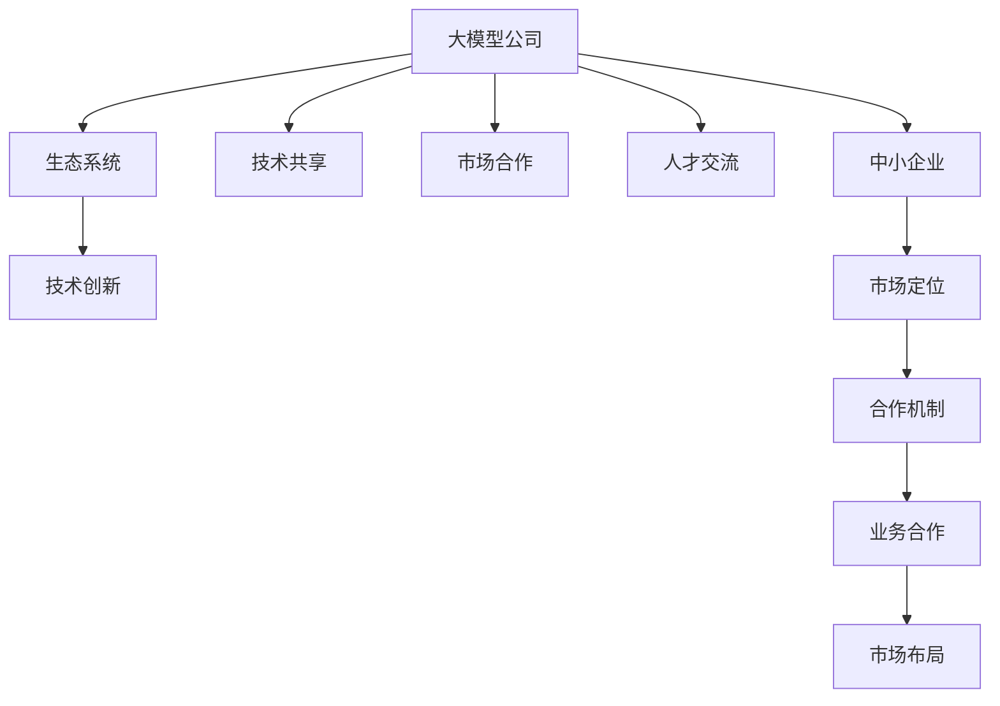

                 

# 与大模型公司的共生：Lepton AI的市场定位

## 1. 背景介绍

### 1.1 问题由来
当前，人工智能(AI)技术迅猛发展，尤其是深度学习和大模型技术的突破，带来了许多新的市场机会和挑战。大模型公司，如OpenAI、Google、华为等，通过构建大规模、高性能的预训练模型，在自然语言处理(NLP)、计算机视觉(CV)、语音识别(SR)等众多领域取得了显著成果。与此同时，众多中小型企业和小型创业团队也在尝试寻找在大模型基础上的应用和发展机会，以期在激烈的市场竞争中占据一席之地。

### 1.2 问题核心关键点
在大模型市场环境下，如何定位自身，制定有效的市场策略，成为了中小型企业和小型创业团队亟待解决的问题。本文将探讨Lepton AI的市场定位策略，基于大模型公司与中小型企业的合作共生模式，通过共同打造生态系统和提升市场竞争力，构建未来的成功之路。

### 1.3 问题研究意义
研究Lepton AI的市场定位问题，对中小企业在AI领域的成长具有重要的指导意义：

1. **降低市场准入门槛**：通过与大模型公司的合作，中小企业可以借助大模型的强大能力，快速提升自己的技术实力，降低市场准入门槛。
2. **聚焦核心竞争力**：通过与大模型公司共生，企业可以专注于自身擅长的领域，提升产品性能和用户体验。
3. **加速市场布局**：借助大模型的技术优势，中小企业可以迅速占领市场，赢得更多客户和市场份额。
4. **构建创新生态**：通过与大模型的深度合作，形成良性的技术创新生态，持续推出新技术和产品。

## 2. 核心概念与联系

### 2.1 核心概念概述

为更好地理解Lepton AI的市场定位，本节将介绍几个密切相关的核心概念：

- **大模型公司**：指拥有自研或基于开源预训练模型，能够在特定领域实现高效推理和生成的大型AI公司。
- **中小企业**：指在AI领域具有一定技术实力，但规模和资金实力相对较小，需要寻找合作机会以提升竞争力的企业。
- **共生模式**：指大模型公司与中小企业通过技术、市场、人才等方面的合作，共同提升彼此竞争力的模式。
- **市场定位**：指企业基于自身能力和市场需求，确定在AI市场的具体位置，制定相应的策略。
- **生态系统**：指由大模型公司、中小企业、学术研究机构等组成的，能够实现技术、产品、服务、市场等多方面合作的AI生态。
- **合作机制**：指大模型公司与中小企业在合作中建立的规则、流程、激励等机制，保障合作的顺利进行。

这些核心概念之间的逻辑关系可以通过以下Mermaid流程图来展示：



这个流程图展示了大模型公司与中小企业的核心概念及其之间的关系：

1. 大模型公司通过技术、市场、人才等方面的资源输出，帮助中小企业提升竞争力。
2. 中小企业根据自身优势，在大模型公司的支持下，进行市场定位，制定合作策略。
3. 双方在合作机制的保障下，共同打造AI生态，推动技术创新和市场布局。

## 3. 核心算法原理 & 具体操作步骤
### 3.1 算法原理概述

Lepton AI的市场定位策略，核心在于利用大模型公司与中小企业之间的共生模式，通过技术合作、市场对接、人才交流等手段，实现双方的共同成长。

从技术角度来看，Lepton AI需要选择合适的预训练模型，并在此基础上进行微调，以适应特定领域的应用需求。同时，需要构建高效的任务适配层，并制定合适的训练策略，确保模型在有限数据上快速收敛。

从市场角度来看，Lepton AI需要明确自身市场定位，聚焦于特定的细分市场，并在此基础上进行市场细分和目标客户分析。

### 3.2 算法步骤详解

基于上述算法原理，Lepton AI的市场定位策略可以包括以下几个关键步骤：

**Step 1: 选择合适的预训练模型**
- 根据自身业务需求和数据特点，选择合适的预训练模型。常见的大模型如BERT、GPT、RoBERTa等，各自具有不同的优势和应用场景。

**Step 2: 构建任务适配层**
- 设计合适的输出层和损失函数，适配特定任务。例如，对于命名实体识别任务，可以构建线性分类器；对于机器翻译任务，可以设计解码器并采用交叉熵损失。

**Step 3: 制定训练策略**
- 确定合适的学习率、批大小、迭代轮数等超参数。
- 应用正则化技术，如L2正则、Dropout、Early Stopping等，防止过拟合。
- 根据任务特点，决定是否冻结预训练模型部分层。

**Step 4: 市场定位与分析**
- 收集目标市场的需求和竞争情况，进行市场细分和客户分析。
- 明确自身产品或服务的优势和差异化策略。
- 制定市场进入和推广计划。

**Step 5: 构建生态系统**
- 与大模型公司建立合作关系，共享技术、市场、人才等资源。
- 联合其他中小企业，形成技术创新生态，推动产业联盟和市场共享。

**Step 6: 持续优化和提升**
- 根据市场反馈和用户需求，不断优化模型和产品。
- 定期进行市场分析和调整，保持竞争优势。

### 3.3 算法优缺点

Lepton AI的市场定位策略具有以下优点：
1. **快速提升技术实力**：通过与大模型公司的合作，可以快速获取先进的技术和资源，降低技术研发成本。
2. **聚焦核心竞争力**：专注于自身擅长的领域，提升产品和服务的竞争力。
3. **构建广泛合作生态**：与大模型公司和其他中小企业合作，形成良性的技术创新生态，共同推动产业发展。
4. **快速占领市场**：借助大模型的技术优势，迅速进入市场，赢得更多客户和市场份额。

同时，该策略也存在以下缺点：
1. **依赖大模型公司**：中小企业在技术上高度依赖大模型公司，可能导致自身技术独立性不足。
2. **市场定位风险**：过度依赖大模型公司，可能导致自身市场定位不够明确，容易在竞争中迷失方向。
3. **资源投入风险**：合作初期需要大量资源投入，特别是在人才和技术上，可能面临较大风险。

### 3.4 算法应用领域

Lepton AI的市场定位策略适用于各种AI技术应用场景，例如：

- **自然语言处理(NLP)**：包括文本分类、命名实体识别、情感分析、机器翻译等任务。通过微调大模型，提升NLP系统的准确性和效率。
- **计算机视觉(CV)**：如目标检测、图像分类、图像生成等任务。利用大模型的图像处理能力，提升CV系统的性能。
- **语音识别(SR)**：包括语音转文字、语音合成、语音情感分析等任务。通过微调大模型，提升SR系统的自然度和准确度。
- **智能推荐系统**：通过微调大模型，提供个性化的商品、内容推荐，提升用户体验。
- **智能客服系统**：利用微调大模型，实现自然语言交互，提高客服系统的智能化水平。
- **智能安防系统**：通过微调大模型，实现面部识别、行为分析等安全监控功能，提升安防系统的智能化水平。

此外，Lepton AI的市场定位策略还适用于更多场景中，如医疗健康、金融风控、智能制造、智慧城市等，为各行各业带来新的技术突破和应用创新。

## 4. 数学模型和公式 & 详细讲解 & 举例说明

### 4.1 数学模型构建

Lepton AI的市场定位策略涉及数学模型构建和优化。

假设Lepton AI选择的预训练模型为 $M_{\theta}$，其中 $\theta$ 为模型参数。对于某个特定任务 $T$，训练集为 $D=\{(x_i,y_i)\}_{i=1}^N$，其中 $x_i$ 为输入，$y_i$ 为输出。微调的目标是找到最优的参数 $\theta^*$，使得模型在任务 $T$ 上表现最优。

### 4.2 公式推导过程

微调的优化目标为：

$$
\theta^* = \mathop{\arg\min}_{\theta} \mathcal{L}(M_{\theta},D)
$$

其中 $\mathcal{L}(M_{\theta},D)$ 为损失函数，通常为交叉熵损失、均方误差损失等。

以二分类任务为例，微调的损失函数为：

$$
\mathcal{L}(M_{\theta},D) = -\frac{1}{N}\sum_{i=1}^N [y_i\log M_{\theta}(x_i)+(1-y_i)\log(1-M_{\theta}(x_i))]
$$

微调过程使用梯度下降等优化算法，如AdamW，更新模型参数：

$$
\theta \leftarrow \theta - \eta \nabla_{\theta}\mathcal{L}(\theta) - \eta\lambda\theta
$$

其中 $\eta$ 为学习率，$\lambda$ 为正则化系数。

### 4.3 案例分析与讲解

以医疗健康领域为例，Lepton AI可以通过微调大模型，构建智能健康咨询系统。系统接收患者描述，通过微调后的模型，输出可能的健康问题及其建议。

具体实现步骤如下：
1. 收集医疗领域的相关文本数据，如病历、症状描述等，进行标注和处理。
2. 选择BERT等预训练模型，构建输出层和损失函数。
3. 使用医疗数据集进行微调，优化模型在特定任务上的表现。
4. 部署模型到生产环境，实时接收患者描述，并输出诊断建议。

通过微调大模型，Lepton AI可以显著提升医疗咨询系统的准确性和效率，帮助医生快速诊断，改善患者体验。

## 5. 项目实践：代码实例和详细解释说明

### 5.1 开发环境搭建

在实践Lepton AI的市场定位策略前，需要进行开发环境搭建。以下是使用Python和PyTorch进行环境配置的流程：

1. 安装Anaconda：从官网下载并安装Anaconda，用于创建独立的Python环境。
2. 创建并激活虚拟环境：
```bash
conda create -n pytorch-env python=3.8 
conda activate pytorch-env
```

3. 安装PyTorch：根据CUDA版本，从官网获取对应的安装命令。例如：
```bash
conda install pytorch torchvision torchaudio cudatoolkit=11.1 -c pytorch -c conda-forge
```

4. 安装Transformers库：
```bash
pip install transformers
```

5. 安装各类工具包：
```bash
pip install numpy pandas scikit-learn matplotlib tqdm jupyter notebook ipython
```

完成上述步骤后，即可在`pytorch-env`环境中开始实践。

### 5.2 源代码详细实现

以下是以命名实体识别(NER)任务为例，使用Transformers库对BERT模型进行微调的PyTorch代码实现。

```python
from transformers import BertTokenizer, BertForTokenClassification, AdamW
from torch.utils.data import Dataset, DataLoader
from torch import nn, optim
import torch
import numpy as np

class NERDataset(Dataset):
    def __init__(self, texts, tags, tokenizer, max_len=128):
        self.texts = texts
        self.tags = tags
        self.tokenizer = tokenizer
        self.max_len = max_len

    def __len__(self):
        return len(self.texts)

    def __getitem__(self, item):
        text = self.texts[item]
        tags = self.tags[item]

        encoding = self.tokenizer(text, return_tensors='pt', max_length=self.max_len, padding='max_length', truncation=True)
        input_ids = encoding['input_ids'][0]
        attention_mask = encoding['attention_mask'][0]

        # 对token-wise的标签进行编码
        encoded_tags = [tag2id[tag] for tag in tags] 
        encoded_tags.extend([tag2id['O']] * (self.max_len - len(encoded_tags)))
        labels = torch.tensor(encoded_tags, dtype=torch.long)

        return {
            'input_ids': input_ids,
            'attention_mask': attention_mask,
            'labels': labels
        }

# 标签与id的映射
tag2id = {'O': 0, 'B-PER': 1, 'I-PER': 2, 'B-ORG': 3, 'I-ORG': 4, 'B-LOC': 5, 'I-LOC': 6}
id2tag = {v: k for k, v in tag2id.items()}

# 创建dataset
tokenizer = BertTokenizer.from_pretrained('bert-base-cased')

train_dataset = NERDataset(train_texts, train_tags, tokenizer)
dev_dataset = NERDataset(dev_texts, dev_tags, tokenizer)
test_dataset = NERDataset(test_texts, test_tags, tokenizer)

# 定义模型
model = BertForTokenClassification.from_pretrained('bert-base-cased', num_labels=len(tag2id))

# 定义优化器
optimizer = AdamW(model.parameters(), lr=2e-5)

# 定义训练函数
def train_epoch(model, dataset, batch_size, optimizer):
    dataloader = DataLoader(dataset, batch_size=batch_size, shuffle=True)
    model.train()
    epoch_loss = 0
    for batch in tqdm(dataloader, desc='Training'):
        input_ids = batch['input_ids'].to(device)
        attention_mask = batch['attention_mask'].to(device)
        labels = batch['labels'].to(device)
        model.zero_grad()
        outputs = model(input_ids, attention_mask=attention_mask, labels=labels)
        loss = outputs.loss
        epoch_loss += loss.item()
        loss.backward()
        optimizer.step()
    return epoch_loss / len(dataloader)

# 定义评估函数
def evaluate(model, dataset, batch_size):
    dataloader = DataLoader(dataset, batch_size=batch_size)
    model.eval()
    preds, labels = [], []
    with torch.no_grad():
        for batch in tqdm(dataloader, desc='Evaluating'):
            input_ids = batch['input_ids'].to(device)
            attention_mask = batch['attention_mask'].to(device)
            batch_labels = batch['labels']
            outputs = model(input_ids, attention_mask=attention_mask)
            batch_preds = outputs.logits.argmax(dim=2).to('cpu').tolist()
            batch_labels = batch_labels.to('cpu').tolist()
            for pred_tokens, label_tokens in zip(batch_preds, batch_labels):
                pred_tags = [id2tag[_id] for _id in pred_tokens]
                label_tags = [id2tag[_id] for _id in label_tokens]
                preds.append(pred_tags[:len(label_tags)])
                labels.append(label_tags)

    print(classification_report(labels, preds))

# 训练和评估
epochs = 5
batch_size = 16

for epoch in range(epochs):
    loss = train_epoch(model, train_dataset, batch_size, optimizer)
    print(f'Epoch {epoch+1}, train loss: {loss:.3f}')

    print(f'Epoch {epoch+1}, dev results:')
    evaluate(model, dev_dataset, batch_size)

print('Test results:')
evaluate(model, test_dataset, batch_size)
```

### 5.3 代码解读与分析

以下是关键代码的实现细节：

**NERDataset类**：
- `__init__`方法：初始化文本、标签、分词器等关键组件。
- `__len__`方法：返回数据集的样本数量。
- `__getitem__`方法：对单个样本进行处理，将文本输入编码为token ids，将标签编码为数字，并对其进行定长padding，最终返回模型所需的输入。

**tag2id和id2tag字典**：
- 定义了标签与数字id之间的映射关系，用于将token-wise的预测结果解码回真实的标签。

**训练和评估函数**：
- 使用PyTorch的DataLoader对数据集进行批次化加载，供模型训练和推理使用。
- 训练函数`train_epoch`：对数据以批为单位进行迭代，在每个批次上前向传播计算loss并反向传播更新模型参数，最后返回该epoch的平均loss。
- 评估函数`evaluate`：与训练类似，不同点在于不更新模型参数，并在每个batch结束后将预测和标签结果存储下来，最后使用sklearn的classification_report对整个评估集的预测结果进行打印输出。

**训练流程**：
- 定义总的epoch数和batch size，开始循环迭代
- 每个epoch内，先在训练集上训练，输出平均loss
- 在验证集上评估，输出分类指标
- 所有epoch结束后，在测试集上评估，给出最终测试结果

可以看到，PyTorch配合Transformers库使得BERT微调的代码实现变得简洁高效。开发者可以将更多精力放在数据处理、模型改进等高层逻辑上，而不必过多关注底层的实现细节。

当然，工业级的系统实现还需考虑更多因素，如模型的保存和部署、超参数的自动搜索、更灵活的任务适配层等。但核心的微调范式基本与此类似。

## 6. 实际应用场景
### 6.1 智能客服系统

基于大语言模型微调的对话技术，可以广泛应用于智能客服系统的构建。传统客服往往需要配备大量人力，高峰期响应缓慢，且一致性和专业性难以保证。而使用微调后的对话模型，可以7x24小时不间断服务，快速响应客户咨询，用自然流畅的语言解答各类常见问题。

在技术实现上，可以收集企业内部的历史客服对话记录，将问题和最佳答复构建成监督数据，在此基础上对预训练对话模型进行微调。微调后的对话模型能够自动理解用户意图，匹配最合适的答案模板进行回复。对于客户提出的新问题，还可以接入检索系统实时搜索相关内容，动态组织生成回答。如此构建的智能客服系统，能大幅提升客户咨询体验和问题解决效率。

### 6.2 金融舆情监测

金融机构需要实时监测市场舆论动向，以便及时应对负面信息传播，规避金融风险。传统的人工监测方式成本高、效率低，难以应对网络时代海量信息爆发的挑战。基于大语言模型微调的文本分类和情感分析技术，为金融舆情监测提供了新的解决方案。

具体而言，可以收集金融领域相关的新闻、报道、评论等文本数据，并对其进行主题标注和情感标注。在此基础上对预训练语言模型进行微调，使其能够自动判断文本属于何种主题，情感倾向是正面、中性还是负面。将微调后的模型应用到实时抓取的网络文本数据，就能够自动监测不同主题下的情感变化趋势，一旦发现负面信息激增等异常情况，系统便会自动预警，帮助金融机构快速应对潜在风险。

### 6.3 个性化推荐系统

当前的推荐系统往往只依赖用户的历史行为数据进行物品推荐，无法深入理解用户的真实兴趣偏好。基于大语言模型微调技术，个性化推荐系统可以更好地挖掘用户行为背后的语义信息，从而提供更精准、多样的推荐内容。

在实践中，可以收集用户浏览、点击、评论、分享等行为数据，提取和用户交互的物品标题、描述、标签等文本内容。将文本内容作为模型输入，用户的后续行为（如是否点击、购买等）作为监督信号，在此基础上微调预训练语言模型。微调后的模型能够从文本内容中准确把握用户的兴趣点。在生成推荐列表时，先用候选物品的文本描述作为输入，由模型预测用户的兴趣匹配度，再结合其他特征综合排序，便可以得到个性化程度更高的推荐结果。

### 6.4 未来应用展望

随着大语言模型微调技术的发展，基于微调范式将在更多领域得到应用，为传统行业带来变革性影响。

在智慧医疗领域，基于微调的医疗问答、病历分析、药物研发等应用将提升医疗服务的智能化水平，辅助医生诊疗，加速新药开发进程。

在智能教育领域，微调技术可应用于作业批改、学情分析、知识推荐等方面，因材施教，促进教育公平，提高教学质量。

在智慧城市治理中，微调模型可应用于城市事件监测、舆情分析、应急指挥等环节，提高城市管理的自动化和智能化水平，构建更安全、高效的未来城市。

此外，在企业生产、社会治理、文娱传媒等众多领域，基于大模型微调的人工智能应用也将不断涌现，为NLP技术带来新的突破。相信随着预训练语言模型和微调方法的持续演进，大语言模型微调必将在构建人机协同的智能时代中扮演越来越重要的角色。

## 7. 工具和资源推荐
### 7.1 学习资源推荐

为了帮助开发者系统掌握大语言模型微调的理论基础和实践技巧，这里推荐一些优质的学习资源：

1. 《Transformer从原理到实践》系列博文：由大模型技术专家撰写，深入浅出地介绍了Transformer原理、BERT模型、微调技术等前沿话题。

2. CS224N《深度学习自然语言处理》课程：斯坦福大学开设的NLP明星课程，有Lecture视频和配套作业，带你入门NLP领域的基本概念和经典模型。

3. 《Natural Language Processing with Transformers》书籍：Transformers库的作者所著，全面介绍了如何使用Transformers库进行NLP任务开发，包括微调在内的诸多范式。

4. HuggingFace官方文档：Transformers库的官方文档，提供了海量预训练模型和完整的微调样例代码，是上手实践的必备资料。

5. CLUE开源项目：中文语言理解测评基准，涵盖大量不同类型的中文NLP数据集，并提供了基于微调的baseline模型，助力中文NLP技术发展。

通过对这些资源的学习实践，相信你一定能够快速掌握大语言模型微调的精髓，并用于解决实际的NLP问题。
###  7.2 开发工具推荐

高效的开发离不开优秀的工具支持。以下是几款用于大语言模型微调开发的常用工具：

1. PyTorch：基于Python的开源深度学习框架，灵活动态的计算图，适合快速迭代研究。大部分预训练语言模型都有PyTorch版本的实现。

2. TensorFlow：由Google主导开发的开源深度学习框架，生产部署方便，适合大规模工程应用。同样有丰富的预训练语言模型资源。

3. Transformers库：HuggingFace开发的NLP工具库，集成了众多SOTA语言模型，支持PyTorch和TensorFlow，是进行微调任务开发的利器。

4. Weights & Biases：模型训练的实验跟踪工具，可以记录和可视化模型训练过程中的各项指标，方便对比和调优。与主流深度学习框架无缝集成。

5. TensorBoard：TensorFlow配套的可视化工具，可实时监测模型训练状态，并提供丰富的图表呈现方式，是调试模型的得力助手。

6. Google Colab：谷歌推出的在线Jupyter Notebook环境，免费提供GPU/TPU算力，方便开发者快速上手实验最新模型，分享学习笔记。

合理利用这些工具，可以显著提升大语言模型微调任务的开发效率，加快创新迭代的步伐。

### 7.3 相关论文推荐

大语言模型和微调技术的发展源于学界的持续研究。以下是几篇奠基性的相关论文，推荐阅读：

1. Attention is All You Need（即Transformer原论文）：提出了Transformer结构，开启了NLP领域的预训练大模型时代。

2. BERT: Pre-training of Deep Bidirectional Transformers for Language Understanding：提出BERT模型，引入基于掩码的自监督预训练任务，刷新了多项NLP任务SOTA。

3. Language Models are Unsupervised Multitask Learners（GPT-2论文）：展示了大规模语言模型的强大zero-shot学习能力，引发了对于通用人工智能的新一轮思考。

4. Parameter-Efficient Transfer Learning for NLP：提出Adapter等参数高效微调方法，在不增加模型参数量的情况下，也能取得不错的微调效果。

5. Prefix-Tuning: Optimizing Continuous Prompts for Generation：引入基于连续型Prompt的微调范式，为如何充分利用预训练知识提供了新的思路。

6. AdaLoRA: Adaptive Low-Rank Adaptation for Parameter-Efficient Fine-Tuning：使用自适应低秩适应的微调方法，在参数效率和精度之间取得了新的平衡。

这些论文代表了大语言模型微调技术的发展脉络。通过学习这些前沿成果，可以帮助研究者把握学科前进方向，激发更多的创新灵感。

## 8. 总结：未来发展趋势与挑战
### 8.1 研究成果总结

本文对大语言模型微调的市场定位问题进行了全面系统的介绍。首先阐述了大模型公司与中小企业的共生模式，明确了Lepton AI的市场定位策略。其次，从技术角度详细讲解了微调过程的算法原理和操作步骤，给出了完整的代码实例。同时，从市场角度探讨了Lepton AI的市场定位与分析、生态系统构建等关键点。

通过本文的系统梳理，可以看到，Lepton AI的市场定位策略在大模型公司与中小企业的合作共生模式下，通过技术合作、市场对接、人才交流等手段，实现了双方的共同成长。这一策略不仅帮助中小企业快速提升技术实力，聚焦核心竞争力，还通过构建广泛的合作生态，推动产业联盟和市场共享。

### 8.2 未来发展趋势

展望未来，Lepton AI的市场定位策略将呈现以下几个发展趋势：

1. **技术实力提升**：通过与大模型公司的深度合作，Lepton AI将迅速提升自身的技术实力，缩小与大公司的技术差距。
2. **产品线丰富化**：借助大模型的技术优势，Lepton AI将不断推出新的产品和服务，丰富市场定位策略。
3. **市场份额扩大**：借助大模型的强大能力和市场影响力，Lepton AI将快速占领市场，赢得更多客户和市场份额。
4. **创新生态构建**：通过与大模型公司和其他中小企业的合作，Lepton AI将构建更加完善的技术创新生态，推动AI技术的广泛应用。

### 8.3 面临的挑战

尽管Lepton AI的市场定位策略在大模型公司的支持下具有显著优势，但在实际应用中仍面临以下挑战：

1. **技术独立性不足**：过度依赖大模型公司，可能导致Lepton AI在技术上缺乏独立性，难以形成核心竞争力。
2. **市场定位风险**：在大模型公司的帮助下，Lepton AI的市场定位可能过于依赖外部资源，容易在竞争中迷失方向。
3. **资源投入风险**：合作初期需要大量资源投入，特别是在人才和技术上，可能面临较大风险。
4. **市场响应速度**：在大模型公司与中小企业的合作模式中，Lepton AI的市场响应速度可能受限于合作伙伴的决策周期，难以快速适应市场变化。

### 8.4 研究展望

面对Lepton AI市场定位策略面临的挑战，未来的研究需要在以下几个方面寻求新的突破：

1. **增强技术独立性**：通过自主研发关键技术，逐步减少对大模型公司的依赖，提升技术独立性。
2. **明确市场定位**：结合自身优势和市场需求，明确市场定位，制定更加科学的市场策略。
3. **降低资源投入**：通过合理分配资源，优化人员和技术配置，降低合作初期的资源投入风险。
4. **提升市场响应速度**：建立快速决策机制，提高市场响应速度，适应市场变化。
5. **构建创新生态**：通过与大模型公司和其他中小企业的深度合作，构建更加完善的技术创新生态，推动AI技术的广泛应用。

这些研究方向的探索，必将引领Lepton AI的市场定位策略迈向更高的台阶，为公司的发展带来新的动力。未来，通过不断创新和优化，Lepton AI必将在AI领域中占据重要地位，推动AI技术的普及和应用。

## 9. 附录：常见问题与解答

**Q1：Lepton AI的市场定位策略如何与大模型公司合作？**

A: Lepton AI的市场定位策略依赖于与大模型公司的深度合作。具体来说，Lepton AI可以通过以下方式与大模型公司合作：
1. 技术共享：Lepton AI可以选择使用大模型公司提供的预训练模型，并在此基础上进行微调。
2. 市场对接：Lepton AI可以将自身的市场需求和大模型公司的技术优势进行对接，共同开发市场。
3. 人才交流：Lepton AI可以与大模型公司进行人才交流，共同提升技术水平。
4. 生态系统构建：Lepton AI可以与大模型公司和其他中小企业共同构建AI生态系统，推动技术创新和市场布局。

**Q2：微调过程中如何避免过拟合？**

A: 微调过程中避免过拟合的方法包括：
1. 数据增强：通过回译、近义替换等方式扩充训练集。
2. 正则化：使用L2正则、Dropout、Early Stopping等防止过拟合。
3. 对抗训练：引入对抗样本，提高模型鲁棒性。
4. 参数高效微调：只调整少量参数，减小过拟合风险。
5. 多模型集成：训练多个微调模型，取平均输出，抑制过拟合。

这些策略往往需要根据具体任务和数据特点进行灵活组合。只有在数据、模型、训练、推理等各环节进行全面优化，才能最大限度地发挥大模型微调的威力。

**Q3：Lepton AI的市场定位策略有哪些优势？**

A: Lepton AI的市场定位策略具有以下优势：
1. 快速提升技术实力：通过与大模型公司的合作，可以快速获取先进的技术和资源，降低技术研发成本。
2. 聚焦核心竞争力：专注于自身擅长的领域，提升产品和服务的竞争力。
3. 构建广泛合作生态：与大模型公司和其他中小企业合作，形成良性的技术创新生态，共同推动产业发展。
4. 快速占领市场：借助大模型的技术优势，迅速进入市场，赢得更多客户和市场份额。

**Q4：如何评估Lepton AI的市场定位策略的效果？**

A: 评估Lepton AI的市场定位策略效果需要考虑以下几个方面：
1. 技术指标：如模型精度、召回率、F1分数等。
2. 市场表现：如市场份额、用户数量、收入增长等。
3. 客户满意度：通过客户反馈和评价，评估产品和服务质量。
4. 竞争优势：通过与同行业其他企业的比较，评估自身的市场定位和竞争力。

通过综合考虑这些因素，可以全面评估Lepton AI的市场定位策略效果，并进行相应的调整和优化。

---

作者：禅与计算机程序设计艺术 / Zen and the Art of Computer Programming

