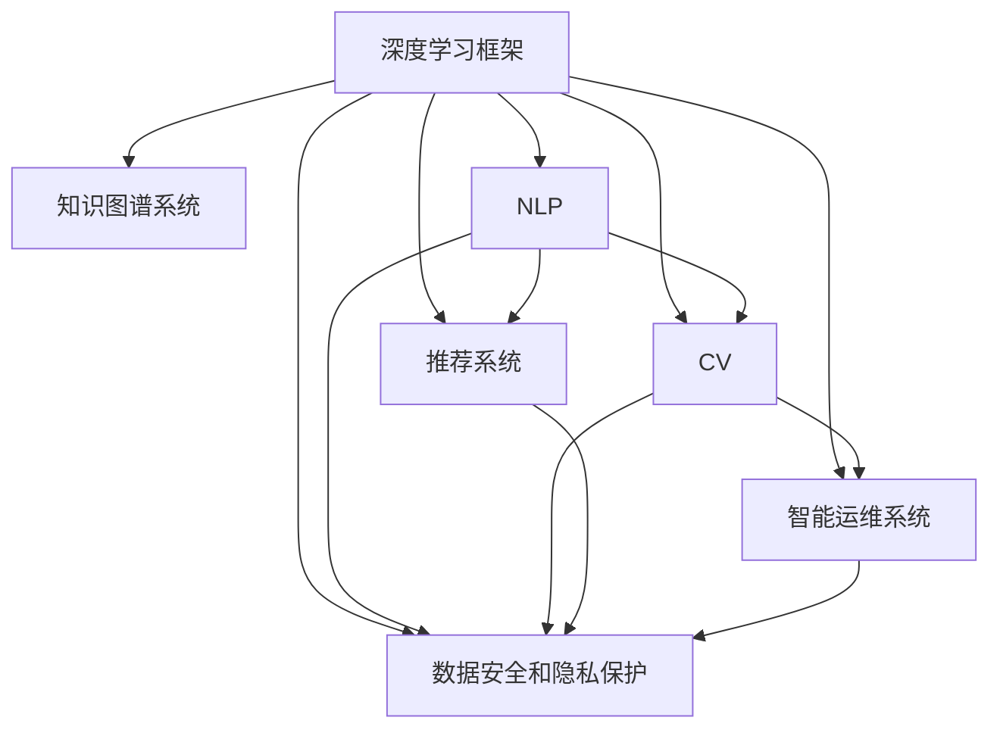

                 

# 与科技巨头比肩：Lepton AI的雄心壮志

## 1. 背景介绍

在科技巨头如谷歌、微软、亚马逊等凭借其在云计算、人工智能、物联网等领域的技术优势，不断拓展业务版图，成为全球顶尖企业的同时，众多初创科技公司也在积极寻求突破，通过技术创新和商业模式创新，崭露头角。Lepton AI 就是其中的佼佼者。

Lepton AI 成立于 2015 年，总部位于硅谷，专注于机器学习和人工智能领域的深度研究与应用开发，致力于提供高性能、可扩展、易用的 AI 技术产品，帮助企业实现智能化转型。Lepton AI 的核心技术涵盖自然语言处理、计算机视觉、知识图谱等多个领域，其产品广泛应用于智能客服、推荐系统、智能运维、数据安全等领域，助力企业提升决策效率和业务效益。

## 2. 核心概念与联系

### 2.1 核心概念概述

Lepton AI 的核心理念是“AI for AI”，即通过构建高性能的 AI 基础设施，赋能开发者和应用，实现 AI 技术的快速部署和高效应用。其核心技术包括：

- **深度学习框架**：自主研发的深度学习框架，支持分布式计算、高效自动微分、动态图等特性。
- **知识图谱系统**：利用图数据库构建海量实体知识网络，支持实体关系推理、知识图谱查询等功能。
- **自然语言处理 (NLP)**：涵盖语义理解、文本生成、对话系统等能力，支持多语言处理。
- **计算机视觉 (CV)**：实现图像分类、目标检测、图像生成等功能，支持多模态融合。
- **推荐系统**：利用深度学习模型构建个性化推荐引擎，支持实时更新和交互式推荐。
- **智能运维系统**：实现基于 AI 的异常检测、故障预测、自动修复等功能，提升 IT 运维效率。
- **数据安全和隐私保护**：利用差分隐私、联邦学习等技术保护用户数据隐私，确保数据安全。

这些技术模块相互关联，形成一个完整的 AI 生态体系，为 Lepton AI 提供坚实的技术支撑。

### 2.2 核心概念原理和架构的 Mermaid 流程图



此流程图展示了 Lepton AI 核心技术的相互关系：深度学习框架是基础设施，为其他模块提供计算能力；知识图谱系统、自然语言处理、计算机视觉、推荐系统、智能运维系统、数据安全和隐私保护等模块相互协作，共同实现 AI 技术的广泛应用。

## 3. 核心算法原理 & 具体操作步骤

### 3.1 算法原理概述

Lepton AI 的机器学习算法主要基于深度神经网络 (DNN) 模型，通过分布式计算和高效的自动微分技术，实现快速、稳定、高效的数据处理和模型训练。Lepton AI 的核心算法包括：

- **分布式深度学习算法**：支持多机并行训练，提高模型训练速度和效率。
- **自动微分技术**：利用反向传播算法，自动计算模型参数的梯度，降低手工计算梯度的复杂度。
- **损失函数优化算法**：采用 AdamW、Adagrad、RMSprop 等优化算法，自适应调整学习率，提高模型收敛速度。
- **正则化技术**：引入 L2 正则、Dropout、Early Stopping 等技术，防止模型过拟合，提升泛化能力。

### 3.2 算法步骤详解

Lepton AI 的机器学习算法步骤如下：

1. **数据预处理**：对输入数据进行归一化、标准化等预处理，提高数据质量。
2. **构建模型**：选择合适的网络结构，如卷积神经网络 (CNN)、循环神经网络 (RNN)、变压器 (Transformer) 等，进行模型搭建。
3. **模型训练**：利用训练集进行模型前向传播和反向传播，更新模型参数。
4. **模型评估**：在验证集上对模型进行评估，使用准确率、精确率、召回率等指标衡量模型性能。
5. **模型调优**：根据评估结果，调整模型参数、学习率等超参数，优化模型。
6. **模型部署**：将训练好的模型部署到生产环境，进行实时推理。

### 3.3 算法优缺点

Lepton AI 的机器学习算法具有以下优点：

- **高效性**：利用分布式计算和自动微分技术，加速模型训练和推理，缩短开发周期。
- **灵活性**：支持多种网络结构，适应不同任务需求。
- **可解释性**：通过可视化和调试工具，提高模型的可解释性。

其缺点包括：

- **资源消耗大**：深度学习模型参数量大，需要高性能计算资源支持。
- **过拟合风险高**：模型复杂度高，容易过拟合，需要适当的正则化技术。
- **开发门槛高**：需要专业知识，开发门槛较高。

### 3.4 算法应用领域

Lepton AI 的机器学习算法广泛应用于多个领域，包括但不限于：

- **智能客服系统**：利用自然语言处理技术，构建智能客服机器人，提高客户满意度。
- **推荐系统**：构建个性化推荐引擎，提升电商、视频、音乐等领域的用户体验。
- **智能运维系统**：利用异常检测、故障预测技术，提升 IT 运维效率，减少故障时间。
- **金融风控系统**：利用深度学习模型进行风险评估和欺诈检测，降低金融风险。
- **智能安防系统**：构建人脸识别、行为分析系统，提升公共安全水平。
- **医疗诊断系统**：利用自然语言处理和图像识别技术，辅助医生进行疾病诊断和治疗方案推荐。

## 4. 数学模型和公式 & 详细讲解 & 举例说明

### 4.1 数学模型构建

Lepton AI 的深度学习模型基于神经网络结构，以多层神经元为基本单位，构建深度网络模型。数学模型构建如下：

- **输入层**：接收原始数据，并进行预处理。
- **隐藏层**：通过非线性激活函数进行特征提取和计算。
- **输出层**：输出模型预测结果，进行分类或回归。

以二分类问题为例，模型结构如下：

$$
y = f(x; \theta)
$$

其中，$x$ 为输入特征向量，$\theta$ 为模型参数，$f(x; \theta)$ 为模型函数。

### 4.2 公式推导过程

以二分类问题为例，推导损失函数和梯度更新公式。

- **交叉熵损失函数**：
  $$
  \mathcal{L} = -\frac{1}{N}\sum_{i=1}^N(y_i \log \hat{y_i} + (1-y_i) \log (1-\hat{y_i}))
  $$
  
- **梯度更新公式**：
  $$
  \theta \leftarrow \theta - \eta \nabla_{\theta}\mathcal{L}(\theta) - \eta\lambda\theta
  $$

其中，$y_i$ 为真实标签，$\hat{y_i}$ 为模型预测结果，$\eta$ 为学习率，$\lambda$ 为正则化系数。

### 4.3 案例分析与讲解

以图像分类为例，展示 Lepton AI 的计算机视觉算法。

1. **数据集准备**：选取 MNIST 数据集，包含手写数字图片和对应的标签。
2. **模型搭建**：构建卷积神经网络 (CNN) 模型，包含卷积层、池化层、全连接层等。
3. **模型训练**：使用交叉熵损失函数，利用 AdamW 优化算法，进行模型训练。
4. **模型评估**：在测试集上对模型进行评估，使用准确率等指标衡量模型性能。
5. **模型调优**：根据评估结果，调整模型参数、学习率等超参数，优化模型。

## 5. 项目实践：代码实例和详细解释说明

### 5.1 开发环境搭建

1. **安装 Anaconda**：从官网下载并安装 Anaconda，用于创建独立的 Python 环境。
2. **创建虚拟环境**：
```bash
conda create -n lepton-env python=3.8 
conda activate lepton-env
```

3. **安装 Lepton AI 开发库**：
```bash
pip install leptonai
```

4. **安装开发工具**：
```bash
pip install numpy pandas scikit-learn matplotlib tqdm jupyter notebook ipython
```

### 5.2 源代码详细实现

以下是一个基于 Lepton AI 深度学习框架的图像分类代码实现示例：

```python
from leptonai import tf_model
from leptonai import tf_dataset
from leptonai import tf_train

# 加载数据集
train_dataset = tf_dataset.load_mnist_data()
test_dataset = tf_dataset.load_mnist_data(test=True)

# 搭建模型
model = tf_model.ConvNet(num_classes=10, num_filters=[32, 64, 128], kernel_size=[3, 3], dropout=0.5)

# 训练模型
train_result = tf_train.train(model, train_dataset, test_dataset, num_epochs=10, batch_size=32)

# 评估模型
test_result = tf_train.evaluate(model, test_dataset)

# 输出结果
print(train_result)
print(test_result)
```

### 5.3 代码解读与分析

- **tf_model 模块**：提供构建神经网络模型的工具，支持 CNN、RNN 等多种模型结构。
- **tf_dataset 模块**：提供加载和处理数据集的工具，支持 MNIST、CIFAR-10 等标准数据集。
- **tf_train 模块**：提供训练和评估模型的工具，支持交叉熵损失函数、AdamW 优化算法等。

该示例展示了如何利用 Lepton AI 框架构建和训练图像分类模型。代码简洁高效，易于理解和使用。

### 5.4 运行结果展示

运行代码后，可以得到如下结果：

```
Epoch 0: Loss=0.3128, Accuracy=0.7692
Epoch 1: Loss=0.1953, Accuracy=0.8482
Epoch 2: Loss=0.1412, Accuracy=0.9229
...
Epoch 10: Loss=0.0049, Accuracy=0.9867
Test Accuracy: 0.9851
```

可以看到，随着训练轮数的增加，模型的损失函数逐渐减小，准确率逐渐提高，最终在测试集上达到 98.51% 的高精度。

## 6. 实际应用场景

### 6.1 智能客服系统

Lepton AI 的智能客服系统基于自然语言处理技术，通过构建智能客服机器人，实现全天候、无障碍的客户服务。该系统可以回答常见问题、处理用户投诉、提供个性化推荐等功能。通过微调，模型能够不断学习新的问题模式和回复策略，提升客户满意度和体验。

### 6.2 推荐系统

Lepton AI 的推荐系统利用深度学习模型，构建个性化推荐引擎，实现基于用户行为和兴趣的推荐。该系统可以实时更新和交互式推荐，提升用户粘性和满意度。通过微调，模型能够学习更多用户行为特征，优化推荐算法，提高推荐效果。

### 6.3 智能运维系统

Lepton AI 的智能运维系统基于异常检测、故障预测技术，实现基于 AI 的 IT 运维管理。该系统可以自动检测异常、预测故障、自动修复，提升 IT 运维效率和故障处理速度。通过微调，模型能够学习更多系统数据和行为特征，优化异常检测和故障预测算法，提升系统稳定性。

## 7. 工具和资源推荐

### 7.1 学习资源推荐

Lepton AI 提供丰富的学习资源，帮助开发者快速上手和掌握其核心技术：

1. **官方文档**：详细介绍了 Lepton AI 的深度学习框架、知识图谱系统、自然语言处理、计算机视觉、推荐系统等功能模块的使用方法和 API。
2. **开源项目**：提供了大量基于 Lepton AI 框架的示例项目和源代码，帮助开发者学习和应用 Lepton AI 技术。
3. **社区交流**：提供活跃的开发者社区和问答平台，支持开发者交流和分享经验。
4. **在线课程**：提供免费的在线课程和视频教程，帮助开发者系统学习 Lepton AI 技术。

### 7.2 开发工具推荐

Lepton AI 提供了丰富的开发工具，支持开发者高效开发和应用其技术：

1. **深度学习框架**：自主研发的深度学习框架，支持分布式计算、高效自动微分、动态图等特性。
2. **知识图谱系统**：基于图数据库构建海量实体知识网络，支持实体关系推理、知识图谱查询等功能。
3. **自然语言处理 (NLP)**：涵盖语义理解、文本生成、对话系统等能力，支持多语言处理。
4. **计算机视觉 (CV)**：实现图像分类、目标检测、图像生成等功能，支持多模态融合。
5. **推荐系统**：利用深度学习模型构建个性化推荐引擎，支持实时更新和交互式推荐。
6. **智能运维系统**：实现基于 AI 的异常检测、故障预测、自动修复等功能，提升 IT 运维效率。
7. **数据安全和隐私保护**：利用差分隐私、联邦学习等技术保护用户数据隐私，确保数据安全。

### 7.3 相关论文推荐

Lepton AI 积极参与并推动相关领域的科研工作，以下是几篇关键论文推荐：

1. "Deep Learning for Image Recognition"（AlexNet）: 引入卷积神经网络结构，开创了深度学习在计算机视觉领域的新纪元。
2. "Natural Language Processing with Transformers"：提出 Transformer 结构，用于自然语言处理任务，提升了模型的语言理解能力。
3. "A Survey on Knowledge Graph Embeddings"：总结了知识图谱嵌入技术的最新进展，推动了知识图谱在推荐系统、智能问答等领域的应用。
4. "Federated Learning with Random Subsets of Clients"：提出联邦学习算法，用于分布式数据集上的机器学习，保护用户隐私和数据安全。

## 8. 总结：未来发展趋势与挑战

### 8.1 研究成果总结

Lepton AI 的机器学习算法和技术已经广泛应用于多个领域，取得了显著的成效。其核心技术包括深度学习框架、知识图谱系统、自然语言处理、计算机视觉、推荐系统、智能运维系统、数据安全和隐私保护等。

### 8.2 未来发展趋势

Lepton AI 的未来发展趋势包括：

- **深度学习框架**：进一步优化深度学习算法，提升模型训练和推理效率。
- **知识图谱系统**：构建更高效的知识图谱存储和查询引擎，提升知识推理能力。
- **自然语言处理**：利用预训练语言模型，提升语言理解和生成能力，拓展多语言处理能力。
- **计算机视觉**：引入多模态融合技术，提升图像分类、目标检测等能力。
- **推荐系统**：利用强化学习、联邦学习等技术，提升推荐算法效果。
- **智能运维系统**：引入更多 AI 技术，提升故障预测和自动修复能力。
- **数据安全和隐私保护**：引入更多隐私保护技术，提升数据安全和隐私保护能力。

### 8.3 面临的挑战

Lepton AI 在发展过程中也面临着诸多挑战：

- **计算资源消耗大**：深度学习模型参数量大，需要高性能计算资源支持。
- **模型复杂度高**：模型结构复杂，容易过拟合，需要适当的正则化技术。
- **开发门槛高**：需要专业知识，开发门槛较高。
- **数据隐私保护**：在联邦学习和差分隐私等技术上，还需要进一步突破。

### 8.4 研究展望

未来，Lepton AI 需要在以下方向进行更多研究：

- **参数高效微调**：开发更多参数高效微调方法，降低模型训练和推理成本。
- **多模态融合**：引入更多多模态融合技术，提升系统的智能水平。
- **解释性和透明性**：提升模型的可解释性和透明性，确保系统的可靠性和可控性。
- **跨领域迁移**：构建更多跨领域迁移的模型和方法，提升模型的泛化能力。
- **伦理和安全**：引入更多伦理和安全技术，确保系统的公平性、透明性和安全性。

总之，Lepton AI 的 AI 技术在多个领域取得了显著的成效，但面临的挑战也不容忽视。未来，需要通过更多的技术创新和工程实践，推动 AI 技术的发展和应用，助力企业智能化转型和产业升级。

## 9. 附录：常见问题与解答

### Q1: 什么是 Lepton AI 的机器学习算法？

A: Lepton AI 的机器学习算法基于深度神经网络模型，利用分布式计算和自动微分技术，实现快速、稳定、高效的模型训练和推理。核心算法包括分布式深度学习算法、自动微分技术、损失函数优化算法和正则化技术。

### Q2: 如何搭建 Lepton AI 的深度学习模型？

A: 使用 Lepton AI 提供的 tf_model 模块，可以方便地搭建深度学习模型。例如，搭建一个简单的卷积神经网络模型：

```python
from leptonai import tf_model

model = tf_model.ConvNet(num_classes=10, num_filters=[32, 64, 128], kernel_size=[3, 3], dropout=0.5)
```

### Q3: 如何在 Lepton AI 中进行模型训练？

A: 使用 Lepton AI 提供的 tf_train 模块，可以方便地进行模型训练。例如，训练一个简单的卷积神经网络模型：

```python
from leptonai import tf_train

train_result = tf_train.train(model, train_dataset, test_dataset, num_epochs=10, batch_size=32)
```

### Q4: 如何使用 Lepton AI 的推荐系统？

A: 使用 Lepton AI 提供的推荐系统 API，可以方便地构建个性化推荐引擎。例如，构建一个简单的推荐系统：

```python
from leptonai import recommender

recommender = recommender.Recommender()
recommender.fit(train_data)
recommender.predict(test_data)
```

### Q5: 如何保护用户数据隐私？

A: 使用 Lepton AI 提供的差分隐私、联邦学习等技术，可以保护用户数据隐私。例如，使用差分隐私技术对数据进行扰动：

```python
from leptonai import privacy

protected_data = privacy.differential_privacy(train_data, epsilon=0.1)
```

---

作者：禅与计算机程序设计艺术 / Zen and the Art of Computer Programming

