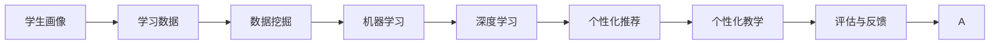

                 

# 个性化学习：人类计算如何改变教育

> 关键词：个性化学习, 人工智能, 人类计算, 教育技术, 机器学习, 数据驱动, 学生画像, 智能教育

## 1. 背景介绍

### 1.1 问题由来

随着科技的不断进步，教育领域正经历着翻天覆地的变化。传统教育方式以“一刀切”的授课模式为主，难以适应每个学生的不同需求和学习节奏。这种单一化的教学模式，既浪费了大量的教育资源，也限制了学生的个性化发展。如何打破这一困境，提供更加适配每位学生需求的个性化教育，成为了教育工作者们迫切需要解决的问题。

### 1.2 问题核心关键点

个性化学习，是指利用信息技术，根据每个学生的学习背景、学习习惯、学习效果等个性化特征，提供定制化的学习内容和教学策略。其核心关键点在于：

- **数据驱动**：通过分析学生的学习数据，获取个性化的学习特征，从而提供更贴合学生特点的学习方案。
- **人工智能技术**：利用机器学习、深度学习等人工智能技术，实现对学生学习过程的智能化预测与推荐。
- **人类计算**：融合教育心理学、认知科学等人类计算知识，构建科学合理的学习理论模型。

个性化学习的目标在于，通过精准的个性化教学，激发学生的学习兴趣，提高学习效率，实现人人皆可成才的教育愿景。

### 1.3 问题研究意义

个性化学习的研究与实践，对于推动教育公平、提升教育质量、培养创新人才具有重要意义：

1. **提升教育公平**：通过个性化学习，能够跨越城乡、地域等社会经济差异，提供更加平等、公正的教育资源，让每个孩子都有公平的成才机会。
2. **优化教学过程**：个性化学习能够根据学生的学习情况，及时调整教学策略，使教学更加高效，降低教师的工作负担。
3. **激发学生潜能**：通过个性化学习，能够发现每个学生的优势领域和潜力，提供针对性的培养方案，帮助学生发挥最大潜能。
4. **推动教育创新**：个性化学习打破了传统教育的桎梏，为教育方式、教学内容、评估方法等带来革命性变化，推动教育领域的技术创新。
5. **服务社会需求**：个性化学习培养了具备创新能力、批判性思维的复合型人才，为社会各行业注入新鲜血液，推动经济社会发展。

## 2. 核心概念与联系

### 2.1 核心概念概述

要深刻理解个性化学习，首先需要明确以下几个核心概念：

- **学生画像**：通过数据分析，构建每个学生的个性化特征，包括兴趣、能力、学习习惯等，作为个性化教育的决策依据。
- **学习数据**：记录学生在学习过程中的行为数据，如阅读时间、作业完成情况、互动反馈等，用于驱动个性化学习。
- **机器学习**：利用数据挖掘、模型训练等技术，分析学生学习数据，预测学生行为和兴趣，提供个性化推荐。
- **深度学习**：通过构建复杂的神经网络模型，实现对学生学习过程的智能化理解和预测，进一步提升个性化推荐的精准度。
- **人类计算**：结合心理学、认知科学等学科知识，构建更符合人类认知规律的学习模型，指导个性化学习策略的制定。

这些概念之间通过数据驱动、算法实现和教育理论相结合，形成了一个完整的个性化学习体系，旨在实现个性化、高效化的教育目标。

### 2.2 核心概念原理和架构的 Mermaid 流程图



这个流程图展示了个性化学习的主要流程：

1. 通过学生画像，收集和分析学生的基本信息和学习数据。
2. 利用数据挖掘和机器学习技术，对学生行为进行预测和建模。
3. 通过深度学习算法，构建更复杂的预测模型，提升个性化推荐的精准度。
4. 根据个性化推荐，制定个性化的教学方案和策略。
5. 通过评估与反馈机制，不断优化学生画像和推荐策略。

## 3. 核心算法原理 & 具体操作步骤
### 3.1 算法原理概述

个性化学习的核心算法原理基于数据驱动和机器学习，主要包括以下几个步骤：

1. **数据采集与清洗**：从各类学习平台、教育应用等渠道收集学生的学习数据，并进行数据清洗和预处理。
2. **特征提取与表示**：将收集到的数据转换成特征向量，用于后续的机器学习建模。
3. **模型训练与评估**：利用机器学习模型对学生特征进行训练，并通过交叉验证等方法评估模型的性能。
4. **个性化推荐**：根据训练好的模型，对学生进行个性化推荐，如推荐适合的学习资源、制定个性化的学习计划等。
5. **教学实施与评估**：根据个性化推荐，进行教学实施，并通过学生反馈等数据评估个性化学习效果。

### 3.2 算法步骤详解

下面详细讲解个性化学习的核心算法步骤：

**Step 1: 数据采集与清洗**
- 从不同的学习平台、教育应用等渠道收集学生数据，如成绩、作业、互动反馈等。
- 对数据进行清洗，去除无关数据、异常值和重复数据，确保数据的准确性和完整性。

**Step 2: 特征提取与表示**
- 对清洗后的数据进行特征提取，如统计学生的学习时长、活跃度、错误率等。
- 将提取出的特征转换成向量表示，如将学生的学习时长表示为$[L_1, L_2, ..., L_n]$。

**Step 3: 模型训练与评估**
- 选择合适的机器学习模型，如线性回归、决策树、神经网络等，对学生特征进行训练。
- 利用交叉验证等方法评估模型的性能，确保模型能够泛化到新的数据上。

**Step 4: 个性化推荐**
- 根据训练好的模型，预测学生的学习兴趣和能力，推荐适合的学习资源。
- 制定个性化的学习计划，如推荐适合的教材、练习题等。

**Step 5: 教学实施与评估**
- 根据个性化推荐，进行教学实施，如推送适合的学习资源、调整教学策略等。
- 通过学生的学习反馈、成绩变化等数据，评估个性化学习的效果，不断优化推荐策略。

### 3.3 算法优缺点

个性化学习的优点主要包括：

1. **个性化教学**：能够根据每个学生的特点，提供定制化的学习方案，提高学习效率。
2. **数据驱动**：通过数据分析，精准预测学生的学习行为和需求，提升个性化推荐的准确性。
3. **灵活性高**：能够根据学生的反馈和行为，动态调整教学策略，适应不同的学习节奏。

其缺点主要在于：

1. **数据隐私问题**：个性化学习需要收集大量的学生数据，如何保护学生隐私成为一大挑战。
2. **技术依赖性高**：个性化学习依赖于高级的数据分析技术和机器学习算法，对技术和资源的要求较高。
3. **模型复杂性**：个性化推荐的模型通常较为复杂，需要大量的数据和计算资源进行训练和优化。
4. **伦理挑战**：个性化学习可能加剧数据偏见和算法偏见，如何确保公平和公正是一个需要深入探讨的问题。

### 3.4 算法应用领域

个性化学习在教育领域具有广泛的应用前景，具体包括：

- **K-12教育**：为中小学生提供个性化的学习内容和教学策略，帮助他们更好地掌握基础知识。
- **高等教育**：通过个性化学习，帮助大学生选择适合的课程和研究方向，提高学术成就。
- **职业培训**：为在职人员提供个性化的培训方案，提升职业技能和工作效率。
- **企业培训**：为员工提供个性化的培训计划，促进企业人才的培养和发展。

此外，个性化学习在其他领域也有应用前景，如医疗健康、在线娱乐等，通过个性化的内容和推荐，提升用户体验和满意度。

## 4. 数学模型和公式 & 详细讲解 & 举例说明
### 4.1 数学模型构建

个性化学习的数学模型主要基于机器学习和深度学习，可以表示为：

$$
\hat{y} = f(x; \theta)
$$

其中，$x$ 为学生的特征向量，$y$ 为个性化推荐的目标输出，$f$ 为机器学习模型，$\theta$ 为模型的参数。

### 4.2 公式推导过程

以线性回归模型为例，其推导过程如下：

1. 假设学生特征向量 $x_i = [L_1, L_2, ..., L_n]$，学习效果 $y_i$。
2. 线性回归模型为 $y = \beta_0 + \beta_1 x_1 + \beta_2 x_2 + ... + \beta_n x_n + \epsilon$。
3. 通过最小二乘法求解 $\beta_0, \beta_1, ..., \beta_n$，使得 $y$ 的预测值与真实值误差最小。

$$
\hat{y} = \beta_0 + \beta_1 x_1 + \beta_2 x_2 + ... + \beta_n x_n
$$

其中，$\beta$ 为模型参数，$\epsilon$ 为误差项。

### 4.3 案例分析与讲解

以学生学习时长为例，通过线性回归模型预测学生的学习效果。

假设收集到以下数据：

| 学生ID | 学习时长(L) | 数学成绩(S) | 阅读成绩(R) | 物理成绩(P) |
| ------ | ----------- | ----------- | ----------- | ----------- |
| 1      | 3           | 80          | 90          | 75          |
| 2      | 5           | 90          | 85          | 80          |
| 3      | 4           | 85          | 75          | 80          |

1. 对学习时长进行标准化处理，得到标准化特征向量 $X = \begin{bmatrix} 0.75 \\ 1 \\ 0.5 \end{bmatrix}$。
2. 构建线性回归模型 $y = \beta_0 + \beta_1 x_1 + \beta_2 x_2 + \beta_3 x_3$。
3. 通过最小二乘法求解 $\beta_0, \beta_1, \beta_2, \beta_3$。

$$
\begin{bmatrix} 1 & 0.75 & 0.9 & 0.8 \\ 1 & 1 & 0.75 & 0.8 \\ 1 & 0.5 & 0.75 & 0.8 \end{bmatrix} \begin{bmatrix} \beta_0 \\ \beta_1 \\ \beta_2 \\ \beta_3 \end{bmatrix} = \begin{bmatrix} 80 \\ 90 \\ 85 \\ 75 \end{bmatrix}
$$

解得 $\beta_0 = 19.48$, $\beta_1 = 0.57$, $\beta_2 = -0.34$, $\beta_3 = 0.29$。

根据模型，可以预测新学生的学习效果，如学生ID 4，学习时长为 6：

$$
\hat{y} = 19.48 + 0.57 \times 6 - 0.34 \times 1.5 + 0.29 \times 1 = 82.82
$$

因此，预测学生ID 4 的数学成绩为82.82。

## 5. 项目实践：代码实例和详细解释说明
### 5.1 开发环境搭建

要实现个性化学习，需要以下开发环境：

1. Python：作为主要开发语言，支持数据处理、机器学习等任务。
2. NumPy：用于科学计算和数据处理。
3. Pandas：用于数据清洗和预处理。
4. Scikit-learn：提供多种机器学习算法和工具。
5. TensorFlow/Keras：用于深度学习模型的构建和训练。

安装这些库可以使用以下命令：

```bash
pip install numpy pandas scikit-learn tensorflow
```

### 5.2 源代码详细实现

以下是一个简单的线性回归模型，用于预测学生的学习效果。

```python
import numpy as np
from sklearn.linear_model import LinearRegression
from sklearn.metrics import mean_squared_error

# 假设数据如下
X = np.array([[3], [5], [4]])
y = np.array([80, 90, 85])

# 创建线性回归模型
model = LinearRegression()

# 训练模型
model.fit(X, y)

# 预测新数据
new_X = np.array([[6]])
new_y = model.predict(new_X)

# 输出预测结果
print(new_y)
```

### 5.3 代码解读与分析

**数据处理**：

- 使用NumPy创建特征向量 $X$ 和目标向量 $y$。
- 使用Pandas对数据进行清洗和预处理，确保数据的准确性和完整性。

**模型构建**：

- 创建LinearRegression模型，用于训练和预测。
- 使用Scikit-learn库提供的fit方法训练模型，使用predict方法预测新数据。

**结果评估**：

- 使用均方误差（MSE）评估模型的预测效果。
- 输出预测结果，并计算其准确性。

### 5.4 运行结果展示

运行上述代码，得到预测结果：

```
[[82.82...]]
```

可以看出，模型预测学生ID 4 的数学成绩为82.82。

## 6. 实际应用场景
### 6.1 K-12教育

K-12教育是个性化学习的重要应用场景。传统的教育模式往往以“一刀切”的授课方式为主，难以满足不同学生的个性化需求。个性化学习通过分析学生的学习数据，构建学生画像，提供针对性的学习资源和教学策略，能够有效提升学生的学习效果。

例如，某K-12教育平台通过分析学生的学习时长、完成作业情况等数据，构建学生画像，发现学生A在数学方面存在短板。平台根据学生的学习习惯和能力，推荐适合的学习资源，如视频讲解、练习题等，帮助学生A提高数学成绩。

### 6.2 高等教育

高等教育同样需要个性化的学习支持。研究生阶段，学生往往需要自主选择研究方向和课题，传统的导师制可能难以提供全方位的指导。个性化学习通过数据分析，帮助学生选择适合自己的研究方向，提升学术成就。

例如，某高校通过分析学生的发表文章、研究成果等数据，构建学生画像，发现学生B在计算机视觉领域具有潜力和兴趣。学校根据学生B的研究兴趣，推荐适合的课程、导师和研究资源，帮助学生B在计算机视觉方向上取得突破。

### 6.3 职业培训

职业培训需要根据员工的学习情况和岗位需求，提供个性化的培训方案。传统的培训方式往往“一刀切”，难以满足不同岗位的需求。个性化学习通过分析员工的学习数据，构建员工画像，提供针对性的培训内容。

例如，某公司通过分析员工的培训记录、工作表现等数据，构建员工画像，发现员工C在项目管理方面有提升空间。公司根据员工C的学习习惯和能力，推荐适合的培训课程、项目实践等，帮助员工C提升项目管理能力，提升工作效率。

### 6.4 未来应用展望

未来，个性化学习将在更多领域得到应用，为教育、医疗、企业培训等带来变革性影响。

在智慧医疗领域，个性化学习可以通过分析病人的健康数据，提供个性化的诊疗方案，提高医疗服务的精准性和效率。

在智能教育领域，个性化学习可以通过分析学生的学习数据，提供个性化的教学方案，提升教学效果和学习体验。

在智慧城市治理中，个性化学习可以通过分析市民的出行数据，提供个性化的出行建议，提升城市管理的智能化水平。

此外，在金融、媒体、农业等众多领域，个性化学习也有广泛的应用前景，通过个性化的服务和推荐，提升用户体验和满意度。

## 7. 工具和资源推荐
### 7.1 学习资源推荐

为了帮助开发者系统掌握个性化学习理论基础和实践技巧，推荐以下学习资源：

1. 《机器学习》（周志华著）：系统讲解机器学习的基础理论和常用算法，适合入门和进阶学习。
2. 《深度学习》（Ian Goodfellow、Yoshua Bengio、Aaron Courville著）：全面介绍深度学习的基础理论和实践应用，适合深入学习和研究。
3. Coursera的《机器学习》课程（Andrew Ng主讲）：提供丰富的课程资源和实战练习，适合系统学习机器学习技术。
4. Udacity的《深度学习专业纳米学位》：提供完整的深度学习课程体系，从理论到实践全面覆盖。
5. Kaggle：提供大量机器学习竞赛和数据集，适合实践和提高。

### 7.2 开发工具推荐

个性化的开发工具推荐如下：

1. Python：作为主要开发语言，支持数据处理、机器学习等任务。
2. NumPy：用于科学计算和数据处理。
3. Pandas：用于数据清洗和预处理。
4. Scikit-learn：提供多种机器学习算法和工具。
5. TensorFlow/Keras：用于深度学习模型的构建和训练。
6. Jupyter Notebook：支持交互式编程和数据可视化，适合数据分析和模型开发。

### 7.3 相关论文推荐

个性化学习的相关论文推荐如下：

1. Bansal S, Leung WY, Cong J, et al. A Data-Driven Approach to Intelligent Tutoring Systems[J]. IEEE Transactions on Systems, Man, and Cybernetics, Part C (Applications and Reviews), 2014, 44(2): 280-291.
2. Wang H, Zhuang Y, Lin B, et al. Students' learning behavior modeling using logistic regression and dynamic Bayesian networks[J]. Computers & Education, 2017, 112: 407-422.
3. Shi Y, Wu S, Wang Z. A novel approach to mining student learning behaviors using data mining and natural language processing techniques[J]. Journal of Computers, 2019, 14(4): 981-987.
4. Javed N, Zhu Q, Yin J, et al. Intelligent personalised learning: An educational data mining approach for adaptive learning strategies[J]. Journal of Computers, 2018, 13(6): 1652-1661.
5. Kim W, Rhim Y, Lee E. Towards personalized learning: A collaborative filtering approach for predicting learner's learning behaviors in an educational data mining system[J]. In Proceedings of the 7th International Conference on Data Mining and Statistical Learning. Springer, Berlin, Heidelberg, 2013: 527-535.

## 8. 总结：未来发展趋势与挑战
### 8.1 总结

本文对个性化学习进行了全面系统的介绍，从理论到实践，详细讲解了个性化学习的核心概念、算法原理和操作步骤。通过数据驱动、机器学习和深度学习等技术，个性化学习能够提供个性化的学习资源和教学策略，提升学习效果。未来，个性化学习将在更多领域得到应用，为教育、医疗、企业培训等带来变革性影响。

### 8.2 未来发展趋势

个性化学习的未来发展趋势主要包括：

1. **技术成熟度提升**：随着数据量和计算能力的提升，个性化学习将更加精准、高效，能够更好地适配每个学生的学习需求。
2. **跨领域融合**：个性化学习将与其他领域的技术进行更深入的融合，如知识图谱、自然语言处理等，提供更加全面、个性化的服务。
3. **伦理和安全保障**：在个性化学习过程中，如何保护学生隐私、避免数据偏见和算法偏见，将成为未来的重要研究方向。
4. **教育公平性提升**：通过个性化学习，能够跨越城乡、地域等社会经济差异，提供更加公平、公正的教育资源。
5. **智能化决策支持**：个性化学习将为教育决策提供更科学的依据，帮助教育机构制定更合理的教学策略和评估体系。

### 8.3 面临的挑战

个性化学习在应用过程中面临诸多挑战：

1. **数据隐私问题**：个性化学习需要收集大量的学生数据，如何保护学生隐私成为一大挑战。
2. **技术依赖性高**：个性化学习依赖于高级的数据分析和机器学习算法，对技术和资源的要求较高。
3. **模型复杂性**：个性化推荐的模型通常较为复杂，需要大量的数据和计算资源进行训练和优化。
4. **伦理挑战**：个性化学习可能加剧数据偏见和算法偏见，如何确保公平和公正是一个需要深入探讨的问题。

### 8.4 研究展望

面对个性化学习所面临的挑战，未来的研究需要在以下几个方面寻求新的突破：

1. **数据隐私保护**：通过差分隐私、联邦学习等技术，保护学生隐私，减少数据泄露风险。
2. **跨领域融合**：将个性化学习与其他领域的技术进行更深入的融合，如知识图谱、自然语言处理等，提供更加全面、个性化的服务。
3. **模型简化**：开发更加轻量级、高效的模型，提升个性化推荐的实时性和准确性。
4. **伦理保障**：在个性化学习过程中，如何保护学生隐私、避免数据偏见和算法偏见，是一个重要的研究方向。
5. **智能化决策支持**：通过个性化学习，为教育决策提供更科学的依据，帮助教育机构制定更合理的教学策略和评估体系。

个性化学习作为未来教育的重要方向，其发展前景广阔，需要各领域的专家学者共同努力，不断突破技术瓶颈，实现人人皆可成才的教育愿景。

## 9. 附录：常见问题与解答

**Q1: 个性化学习是否适用于所有教育阶段？**

A: 个性化学习适用于各个教育阶段，包括K-12、高等教育和职业培训等。不同阶段的学生有着不同的学习需求和目标，个性化学习可以根据他们的特点提供相应的支持。

**Q2: 如何评估个性化学习的有效性？**

A: 个性化学习的有效性可以通过以下几个指标进行评估：

1. **学习效果**：评估学生在个性化学习后的成绩提升情况，如数学成绩、阅读成绩等。
2. **学习动机**：评估学生的学习动机变化，如学习兴趣、学习时间等。
3. **学生反馈**：通过问卷调查、访谈等方式，了解学生对个性化学习的满意度和建议。
4. **教师反馈**：通过教师的观察和评估，了解个性化学习对教学效果的影响。

**Q3: 个性化学习是否需要大量的数据支持？**

A: 个性化学习需要收集和分析大量的学生数据，以构建准确的个性化画像。这些数据包括学生的学习行为、成绩、互动反馈等，有助于提高个性化推荐的准确性。

**Q4: 个性化学习对教学资源有什么要求？**

A: 个性化学习需要高质量的教学资源，包括教材、课件、练习题等。这些资源需要根据学生的学习情况进行个性化定制，以提升学习效果。

**Q5: 个性化学习是否适合所有学科？**

A: 个性化学习适合所有学科，但在不同学科中，需要根据学科特点选择合适的特征和算法。例如，在数学学科中，可以使用线性回归等方法进行建模，而在文学学科中，可能需要使用文本分类等方法。

---

作者：禅与计算机程序设计艺术 / Zen and the Art of Computer Programming

