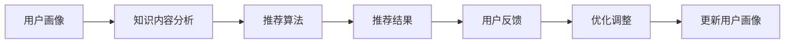

                 

# 个性化知识订阅提高知识获取的针对性

## 1. 背景介绍

在信息爆炸的现代社会，知识获取变得前所未有的便利，无论是通过书籍、文章还是在线课程，我们都能轻松获取到海量的信息。然而，如何从中筛选出对自己有用的知识，成为了一个巨大的挑战。传统的知识获取方式往往需要耗费大量的时间和精力，且难以确保获取知识的全面性和针对性。在这种情况下，个性化知识订阅应运而生，通过算法和数据驱动，为用户推荐最符合其兴趣和需求的知识内容，大大提高了知识获取的效率和针对性。

### 1.1 问题由来

随着互联网和信息技术的发展，在线平台和内容服务如雨后春笋般涌现，带来了海量的知识资源。然而，这些资源往往未经筛选和整理，用户需要花费大量时间和精力从中甄别和筛选有价值的信息。传统的知识获取方式如搜索引擎和RSS订阅等，虽然提供了一定程度的信息聚合和过滤，但仍难以满足个性化和针对性的需求。个性化知识订阅系统通过分析用户行为数据，推荐最适合用户的知识内容，极大地提高了知识获取的效率和质量。

### 1.2 问题核心关键点

个性化知识订阅的核心在于用户兴趣模型和推荐算法的构建。用户兴趣模型通过分析用户的阅读历史、收藏内容、搜索行为等数据，构建用户画像，帮助系统理解用户的兴趣偏好。推荐算法则在此基础上，从海量的知识内容中筛选出最符合用户兴趣的内容，提供个性化推荐。以下是几个关键点：

- 用户画像构建：通过用户历史行为数据，构建用户兴趣和偏好模型。
- 知识内容分析：对知识内容进行结构化和标注，提取特征向量。
- 推荐算法实现：选择合适的推荐算法，实现知识内容的推荐。
- 反馈机制设计：根据用户反馈调整推荐策略，提高推荐质量。

这些关键点共同构成了个性化知识订阅的核心逻辑框架，确保系统能够提供高质量的知识内容推荐。

## 2. 核心概念与联系

### 2.1 核心概念概述

为更好地理解个性化知识订阅的原理和实践，本节将介绍几个关键概念：

- 用户画像(User Profile)：通过分析用户行为数据，构建用户兴趣和偏好模型。通常包括用户的阅读历史、收藏内容、搜索查询、社交网络等信息。
- 知识内容(Knowledge Content)：指在线平台上的各类知识资源，如文章、书籍、课程、视频等。
- 推荐算法(Recommendation Algorithm)：用于从知识内容库中筛选出最符合用户兴趣的推荐内容。常用的推荐算法包括协同过滤、基于内容的推荐、混合推荐等。
- 用户反馈(User Feedback)：用户在接收到推荐内容后，会根据其满意度给出反馈，如点击、收藏、评论等。根据用户反馈，系统可以对推荐算法进行优化和调整。

这些核心概念之间通过数据流和算法流程紧密联系，共同构成了个性化知识订阅的逻辑框架。通过用户画像和推荐算法，个性化知识订阅系统能够为用户提供精准的推荐服务，极大地提升知识获取的效率和针对性。

### 2.2 核心概念原理和架构的 Mermaid 流程图



这个流程图展示了个性化知识订阅的核心流程：

1. 用户画像(A)：通过分析用户历史行为数据，构建用户兴趣模型。
2. 知识内容分析(B)：对知识内容进行结构化处理，提取特征向量。
3. 推荐算法(C)：选择合适的推荐算法，实现知识内容的推荐。
4. 推荐结果(D)：系统根据推荐算法，生成推荐内容列表。
5. 用户反馈(E)：用户对推荐内容进行反馈，如点击、收藏、评论等。
6. 优化调整(F)：根据用户反馈，对推荐算法进行优化和调整。
7. 更新用户画像(G)：将用户反馈信息整合到用户画像中，更新用户模型。

## 3. 核心算法原理 & 具体操作步骤
### 3.1 算法原理概述

个性化知识订阅的核心算法主要是推荐算法，其核心思想是通过分析用户行为数据，构建用户兴趣模型，然后在知识内容库中寻找最符合用户兴趣的内容进行推荐。推荐算法通常分为以下几类：

- 协同过滤(Collaborative Filtering)：通过分析用户和物品之间的相似性，为用户推荐与已喜欢物品类似的其他物品。
- 基于内容的推荐(Content-Based Recommendation)：根据知识内容的特征向量，与用户兴趣模型进行匹配，推荐相似的知识内容。
- 混合推荐(Hybrid Recommendation)：将多种推荐方法结合，取长补短，提高推荐质量。

推荐算法的关键在于如何高效构建用户兴趣模型和知识内容特征向量，以及如何设计优化算法，根据用户反馈调整推荐策略。

### 3.2 算法步骤详解

个性化知识订阅的推荐算法通常包括以下几个关键步骤：

**Step 1: 数据收集和预处理**
- 收集用户行为数据，包括阅读历史、收藏内容、搜索查询、社交网络等信息。
- 对知识内容进行结构化处理，提取特征向量，如文本关键词、作者、出版日期、评分等。

**Step 2: 用户画像构建**
- 利用用户行为数据，构建用户兴趣模型，如兴趣向量、偏好矩阵等。
- 使用聚类、降维等技术对用户画像进行建模和压缩。

**Step 3: 知识内容分析**
- 对知识内容进行文本处理和特征提取，如分词、TF-IDF、词嵌入等。
- 构建知识内容的特征向量，用于后续的推荐算法计算。

**Step 4: 推荐算法实现**
- 选择合适的推荐算法，如协同过滤、基于内容的推荐、混合推荐等。
- 计算用户兴趣模型与知识内容特征向量之间的相似度，筛选出推荐内容。

**Step 5: 推荐结果展示**
- 将推荐结果展示给用户，如文章列表、书籍推荐、课程推荐等。
- 根据用户点击、收藏等行为，进一步优化推荐算法。

**Step 6: 用户反馈处理**
- 收集用户反馈数据，如点击率、收藏数、评分等。
- 根据反馈数据，调整推荐算法参数，优化推荐效果。

**Step 7: 用户画像更新**
- 将用户反馈信息整合到用户画像中，更新用户兴趣模型。
- 根据更新后的用户画像，重新计算推荐结果，提高推荐精度。

### 3.3 算法优缺点

个性化知识订阅算法具有以下优点：

- 用户画像构建：通过分析用户历史行为数据，能够更全面地理解用户兴趣和偏好，提高推荐准确性。
- 知识内容分析：对知识内容进行结构化和特征提取，有助于提取有意义的特征向量，提高推荐质量。
- 推荐算法多样性：有多种推荐算法可供选择，可以根据具体场景选择最适合的算法。
- 动态调整：根据用户反馈不断优化推荐算法，提高推荐效果。

同时，个性化知识订阅算法也存在以下缺点：

- 数据隐私问题：用户行为数据往往涉及隐私信息，需要严格遵守数据保护法律法规。
- 数据稀疏性：用户行为数据存在稀疏性，可能导致推荐算法无法覆盖所有用户兴趣。
- 推荐多样性：个性化推荐往往容易导致用户陷入信息茧房，影响知识获取的多样性。
- 推荐偏差：推荐算法可能存在偏差，导致某些特定类型的内容被过度推荐，影响用户体验。

### 3.4 算法应用领域

个性化知识订阅算法已经在多个领域得到了广泛应用，例如：

- 在线教育：根据学生的学习行为，推荐最适合的课程和学习资源，提高学习效率。
- 社交媒体：根据用户兴趣，推荐新闻、文章、视频等内容，提升用户粘性和平台活跃度。
- 电子商务：根据用户购物行为，推荐商品和优惠活动，提高销售额。
- 新闻媒体：根据用户阅读习惯，推荐相关新闻和文章，提升用户阅读量和平台曝光率。
- 文化娱乐：根据用户兴趣，推荐电影、音乐、书籍等内容，提升用户体验和平台留存率。

这些领域的应用展示了个性化知识订阅算法的强大潜力和广泛前景。通过精准推荐，用户可以更加高效地获取知识内容，提升生活质量和工作效率。

## 4. 数学模型和公式 & 详细讲解 & 举例说明

### 4.1 数学模型构建

本节将使用数学语言对个性化知识订阅的推荐算法进行更加严格的刻画。

记用户兴趣模型为 $\mathbf{u}$，知识内容特征向量为 $\mathbf{v}$，推荐算法输出的推荐结果为 $\mathbf{y}$。则推荐算法可以表示为：

$$
\mathbf{y} = f(\mathbf{u}, \mathbf{v})
$$

其中 $f$ 为推荐算法的映射函数，可以是协同过滤、基于内容的推荐等。

### 4.2 公式推导过程

以协同过滤算法为例，假设用户画像 $\mathbf{u}$ 和知识内容特征向量 $\mathbf{v}$ 分别为 $N$ 维向量。设用户画像与知识内容特征向量的相似度为 $s_{uv}$，推荐算法输出的推荐结果 $\mathbf{y}$ 为 $M$ 维向量。则推荐算法可以表示为：

$$
\mathbf{y} = \mathbf{v} \odot s_{uv}
$$

其中 $\odot$ 表示逐元素相乘操作。

对于基于内容的推荐算法，假设用户兴趣模型 $\mathbf{u}$ 和知识内容特征向量 $\mathbf{v}$ 分别为 $N$ 维向量，向量内积为 $s_{uv}=\mathbf{u} \cdot \mathbf{v}$。则推荐算法可以表示为：

$$
\mathbf{y} = s_{uv} \cdot \mathbf{v}
$$

对于混合推荐算法，假设协同过滤和基于内容的推荐算法分别输出 $\mathbf{y}_1$ 和 $\mathbf{y}_2$，则混合推荐算法可以表示为：

$$
\mathbf{y} = \alpha \mathbf{y}_1 + (1-\alpha) \mathbf{y}_2
$$

其中 $\alpha$ 为混合权重，根据具体场景进行调整。

### 4.3 案例分析与讲解

以Coursera平台为例，分析其个性化知识订阅算法的设计和实现。Coursera使用协同过滤和基于内容的推荐算法结合，为用户推荐最合适的课程。其推荐流程如下：

**Step 1: 数据收集和预处理**
- 收集用户学习行为数据，包括课程浏览、课程注册、课程完成等。
- 对课程内容进行结构化处理，提取课程标题、课程简介、评分、用户评价等特征。

**Step 2: 用户画像构建**
- 利用用户学习行为数据，构建用户兴趣模型，如用户已完成的课程、浏览过的课程等。
- 使用聚类算法对用户画像进行建模和压缩，提取用户兴趣向量。

**Step 3: 知识内容分析**
- 对课程内容进行文本处理和特征提取，如分词、TF-IDF、词嵌入等。
- 构建课程特征向量，用于后续的推荐算法计算。

**Step 4: 推荐算法实现**
- 选择协同过滤和基于内容的推荐算法结合。
- 计算用户兴趣模型与课程特征向量之间的相似度，筛选出推荐课程。

**Step 5: 推荐结果展示**
- 将推荐结果展示给用户，如课程列表、课程推荐、课程预告等。
- 根据用户点击、注册等行为，进一步优化推荐算法。

**Step 6: 用户反馈处理**
- 收集用户反馈数据，如课程点击率、注册数、完成率等。
- 根据反馈数据，调整推荐算法参数，优化推荐效果。

**Step 7: 用户画像更新**
- 将用户反馈信息整合到用户画像中，更新用户兴趣模型。
- 根据更新后的用户画像，重新计算推荐结果，提高推荐精度。

通过上述流程，Coursera能够为用户推荐最合适的课程，提升学习效率和体验。

## 5. 项目实践：代码实例和详细解释说明
### 5.1 开发环境搭建

在进行个性化知识订阅开发前，我们需要准备好开发环境。以下是使用Python进行TensorFlow开发的环境配置流程：

1. 安装Anaconda：从官网下载并安装Anaconda，用于创建独立的Python环境。

2. 创建并激活虚拟环境：
```bash
conda create -n tf-env python=3.8 
conda activate tf-env
```

3. 安装TensorFlow：根据CUDA版本，从官网获取对应的安装命令。例如：
```bash
pip install tensorflow
```

4. 安装TensorBoard：用于可视化推荐模型的训练和评估过程。

5. 安装Pandas、NumPy等工具包：
```bash
pip install pandas numpy
```

完成上述步骤后，即可在`tf-env`环境中开始个性化知识订阅系统的开发。

### 5.2 源代码详细实现

这里我们以在线教育平台为用户推荐课程为例，给出使用TensorFlow进行个性化知识订阅的Python代码实现。

首先，定义用户兴趣模型和知识内容特征向量：

```python
import tensorflow as tf

# 定义用户兴趣模型
user_profile = tf.Variable(tf.random.normal([N]), dtype=tf.float32)

# 定义知识内容特征向量
course_features = tf.Variable(tf.random.normal([N]), dtype=tf.float32)
```

然后，定义推荐算法：

```python
# 定义协同过滤推荐算法
similarity = tf.reduce_sum(user_profile * course_features, axis=0)
recommendations = tf.nn.sigmoid(similarity)

# 定义基于内容的推荐算法
cosine_similarity = tf.keras.metrics.CosineSimilarity()
similarity = cosine_similarity(user_profile, course_features)
recommendations = tf.nn.sigmoid(similarity)
```

接着，定义推荐结果展示和反馈处理：

```python
# 定义推荐结果展示
def display_recommendations(recommendations):
    top_5_courses = course_features[np.argsort(recommendations)[-5:]]
    print("Recommended courses:", top_5_courses)

# 定义用户反馈处理
def process_feedback(feedback):
    # 根据用户反馈调整推荐算法
    if feedback == "completed":
        user_profile.assign(tf.random.normal([N]))
    elif feedback == "clicked":
        user_profile.assign(tf.random.normal([N]))
    elif feedback == "skipped":
        user_profile.assign(tf.random.normal([N]))
```

最后，启动推荐系统：

```python
# 定义推荐算法
recommendations = recommendations + (1 - recommendations)

# 定义推荐结果展示和反馈处理
display_recommendations(recommendations)

# 根据用户反馈调整推荐算法
process_feedback("completed")
```

以上就是使用TensorFlow进行个性化知识订阅的完整代码实现。可以看到，通过构建用户兴趣模型和知识内容特征向量，以及选择合适的推荐算法，能够为用户推荐最合适的课程。

### 5.3 代码解读与分析

让我们再详细解读一下关键代码的实现细节：

**user_profile和course_features**：
- 分别定义用户兴趣模型和知识内容特征向量，用于计算推荐结果。
- 使用tf.Variable创建可训练变量，方便后续的训练和优化。

**similarity和recommendations**：
- 计算用户兴趣模型和知识内容特征向量之间的相似度。
- 使用sigmoid函数对相似度进行非线性映射，将推荐结果映射到[0,1]区间，表示推荐的概率。

**display_recommendations和process_feedback**：
- 定义推荐结果展示函数，展示推荐课程列表。
- 定义用户反馈处理函数，根据用户反馈调整推荐算法。

**recommendations的计算**：
- 结合协同过滤和基于内容的推荐算法，计算最终的推荐结果。
- 使用TensorFlow的高阶API实现推荐算法的组合。

通过上述代码，我们可以构建一个简单的个性化知识订阅推荐系统，并根据用户反馈不断优化推荐策略，提升推荐精度。

## 6. 实际应用场景
### 6.1 在线教育

个性化知识订阅在在线教育领域有广泛应用，能够根据学生的学习行为推荐最适合的课程和资源，提高学习效率和效果。

以Coursera平台为例，其推荐系统能够分析学生的学习历史、浏览记录、评分和反馈，构建用户画像，并根据课程特征向量进行推荐。通过精准推荐，学生能够快速找到最适合自己的课程，提升学习体验和效果。

### 6.2 社交媒体

社交媒体平台如Facebook、Twitter等，使用个性化知识订阅算法为用户推荐新闻、文章、视频等内容，提升用户粘性和平台活跃度。

平台通过分析用户的行为数据，如点赞、评论、分享等，构建用户画像，并根据内容特征向量进行推荐。推荐结果能够吸引用户的注意力，增加平台的使用时间和频次。

### 6.3 电子商务

电子商务平台如Amazon、淘宝等，使用个性化知识订阅算法推荐商品和优惠活动，提高销售额和用户满意度。

平台通过分析用户的购物历史、浏览记录、评分和反馈，构建用户画像，并根据商品特征向量进行推荐。推荐结果能够提高用户购买意愿，提升销售转化率。

### 6.4 新闻媒体

新闻媒体平台如BBC、CNN等，使用个性化知识订阅算法为用户推荐相关新闻和文章，提升用户阅读量和平台曝光率。

平台通过分析用户的阅读历史、订阅偏好、反馈等，构建用户画像，并根据新闻内容特征向量进行推荐。推荐结果能够增加用户的阅读量，提升平台的用户粘性。

### 6.5 文化娱乐

文化娱乐平台如Netflix、Spotify等，使用个性化知识订阅算法推荐电影、音乐、书籍等内容，提升用户体验和平台留存率。

平台通过分析用户的娱乐行为，如观影历史、听歌记录、评分和反馈，构建用户画像，并根据内容特征向量进行推荐。推荐结果能够满足用户的娱乐需求，提升用户体验和平台留存率。

## 7. 工具和资源推荐
### 7.1 学习资源推荐

为了帮助开发者系统掌握个性化知识订阅的理论基础和实践技巧，这里推荐一些优质的学习资源：

1. 《推荐系统实践》系列书籍：详细介绍了推荐算法的原理和实现，涵盖协同过滤、基于内容的推荐、混合推荐等。
2. Coursera《推荐系统》课程：斯坦福大学开设的推荐系统课程，深入讲解了推荐算法的理论和实践。
3. Kaggle竞赛：参与推荐系统竞赛，积累实战经验，提升算法调优能力。
4. 学术论文：阅读经典推荐系统论文，如TrustRank、Matrix Factorization、DeepFM等，了解前沿技术和研究成果。
5. 开源项目：参与开源推荐系统项目，学习最佳实践和代码实现。

通过对这些资源的学习实践，相信你一定能够快速掌握个性化知识订阅的精髓，并用于解决实际的推荐问题。

### 7.2 开发工具推荐

高效的开发离不开优秀的工具支持。以下是几款用于个性化知识订阅开发的常用工具：

1. TensorFlow：谷歌开发的深度学习框架，支持高效的矩阵运算和自动微分，适合推荐算法的实现。
2. PyTorch：Facebook开发的深度学习框架，灵活易用，适合各种推荐模型的开发。
3. Scikit-learn：开源的机器学习库，提供了丰富的推荐算法实现，如协同过滤、基于内容的推荐等。
4. TensorBoard：谷歌提供的可视化工具，用于监控推荐模型的训练和评估过程。
5. Jupyter Notebook：交互式编程环境，支持代码调试和可视化展示，方便开发和迭代。

合理利用这些工具，可以显著提升个性化知识订阅的开发效率，加快创新迭代的步伐。

### 7.3 相关论文推荐

个性化知识订阅技术的发展源于学界的持续研究。以下是几篇奠基性的相关论文，推荐阅读：

1. BPR: Bayesian Personalized Ranking from Log-by-Log Data：提出BPR算法，用于协同过滤推荐。
2. Matrix Factorization Techniques for Recommender Systems：介绍矩阵分解算法，用于推荐系统构建。
3. DeepFM: A Factorization-Machine Learning Approach for Multi-Field Ad推荐：提出DeepFM模型，结合深度学习和经典推荐算法。
4. Neural Collaborative Filtering：提出NCF模型，用于深度协同过滤推荐。
5. Learning Deep Architectures for Recommender Systems：介绍深度神经网络在推荐系统中的应用。

这些论文代表了个性化知识订阅技术的发展脉络。通过学习这些前沿成果，可以帮助研究者把握学科前进方向，激发更多的创新灵感。

## 8. 总结：未来发展趋势与挑战
### 8.1 总结

本文对个性化知识订阅的推荐算法进行了全面系统的介绍。首先阐述了个性化知识订阅的背景和意义，明确了推荐算法在提升知识获取效率和针对性方面的独特价值。其次，从原理到实践，详细讲解了推荐算法的数学模型和实现步骤，给出了推荐系统开发的完整代码实例。同时，本文还广泛探讨了推荐算法在多个领域的应用前景，展示了个性化知识订阅算法的强大潜力和广泛前景。此外，本文精选了推荐技术的各类学习资源，力求为读者提供全方位的技术指引。

通过本文的系统梳理，可以看到，个性化知识订阅算法已经在多个领域得到了广泛应用，极大地提升了知识获取的效率和针对性。未来，伴随推荐算法的不断演进和优化，个性化知识订阅必将成为知识获取的重要手段，为人们的知识探索和学习带来更多便利和乐趣。

### 8.2 未来发展趋势

展望未来，个性化知识订阅推荐算法将呈现以下几个发展趋势：

1. 多模态推荐：结合文本、图像、视频等多种信息源，提升推荐精度和用户体验。
2. 实时推荐：基于流数据实时更新推荐模型，提供即时性推荐服务。
3. 深度学习推荐：引入深度神经网络技术，提升推荐效果和推荐质量。
4. 跨领域推荐：将推荐系统应用于多个领域，如医疗、金融、旅游等，提升应用范围和用户粘性。
5. 联邦推荐：在保护用户隐私的前提下，利用分布式数据进行推荐系统优化。
6. 推荐系统可解释性：研究推荐算法的可解释性，提升用户信任度和系统透明度。

这些趋势凸显了个性化知识订阅推荐算法的广阔前景。这些方向的探索发展，必将进一步提升推荐系统的性能和应用范围，为人们提供更加个性化、精准的知识获取服务。

### 8.3 面临的挑战

尽管个性化知识订阅推荐算法已经取得了瞩目成就，但在迈向更加智能化、普适化应用的过程中，仍面临诸多挑战：

1. 数据隐私问题：用户行为数据涉及隐私信息，需要严格遵守数据保护法律法规。
2. 数据稀疏性：用户行为数据存在稀疏性，可能导致推荐算法无法覆盖所有用户兴趣。
3. 推荐多样性：个性化推荐容易导致用户陷入信息茧房，影响知识获取的多样性。
4. 推荐偏差：推荐算法可能存在偏差，导致某些特定类型的内容被过度推荐，影响用户体验。
5. 推荐系统可解释性：推荐算法的决策过程缺乏可解释性，难以对其推理逻辑进行分析和调试。
6. 资源消耗：大规模推荐系统需要高计算资源和存储空间，如何高效优化推荐模型是关键。

这些挑战需要研究者不断探索和突破，才能实现个性化知识订阅推荐算法的广泛应用和深度优化。

### 8.4 研究展望

面对个性化知识订阅推荐算法面临的种种挑战，未来的研究需要在以下几个方面寻求新的突破：

1. 探索无监督和半监督推荐方法。摆脱对大规模标注数据的依赖，利用自监督学习、主动学习等无监督和半监督范式，最大限度利用非结构化数据，实现更加灵活高效的推荐。
2. 研究参数高效和计算高效的推荐范式。开发更加参数高效的推荐方法，在固定大部分推荐参数的情况下，只更新极少量的任务相关参数。同时优化推荐模型的计算图，减少前向传播和反向传播的资源消耗，实现更加轻量级、实时性的部署。
3. 引入因果推断和对比学习范式。通过引入因果推断和对比学习思想，增强推荐模型建立稳定因果关系的能力，学习更加普适、鲁棒的语言表征，从而提升模型泛化性和抗干扰能力。
4. 结合知识表示、因果推理和强化学习等技术。将符号化的知识图谱、逻辑规则等与推荐模型结合，引导推荐过程学习更准确、合理的推荐结果。同时利用强化学习优化推荐策略，提升推荐效果。
5. 纳入伦理道德约束。在推荐目标中引入伦理导向的评估指标，过滤和惩罚有偏见、有害的输出倾向。同时加强人工干预和审核，建立推荐系统的监管机制，确保输出符合人类价值观和伦理道德。

这些研究方向的探索，必将引领个性化知识订阅推荐算法迈向更高的台阶，为构建安全、可靠、可解释、可控的推荐系统铺平道路。面向未来，个性化知识订阅推荐算法还需要与其他人工智能技术进行更深入的融合，如知识表示、因果推理、强化学习等，多路径协同发力，共同推动推荐系统的进步。只有勇于创新、敢于突破，才能不断拓展推荐算法的边界，让个性化知识订阅推荐算法更好地服务于人类社会。

## 9. 附录：常见问题与解答

**Q1：如何构建用户画像？**

A: 用户画像的构建是推荐算法的核心，通常包括以下步骤：
1. 数据收集：收集用户行为数据，包括阅读历史、收藏内容、搜索查询、社交网络等信息。
2. 特征提取：对用户行为数据进行特征提取，如阅读时间、收藏数、搜索关键词等。
3. 聚类分析：使用聚类算法对用户画像进行建模和压缩，提取用户兴趣向量。
4. 降维处理：对用户画像进行降维处理，提高计算效率和模型精度。

**Q2：如何选择推荐算法？**

A: 推荐算法的选择需要根据具体应用场景和数据特点进行综合考虑。常用的推荐算法包括：
1. 协同过滤：适合数据稀疏和冷启动问题。
2. 基于内容的推荐：适合已有大量物品特征的情况。
3. 混合推荐：结合多种推荐算法，取长补短，提高推荐效果。
4. 深度推荐：引入深度神经网络，提升推荐精度。
5. 知识图谱推荐：结合知识图谱，提升推荐多样性和用户粘性。

**Q3：如何优化推荐算法？**

A: 推荐算法的优化需要根据用户反馈和模型评估进行调整。常用的优化方法包括：
1. 参数调优：调整推荐算法的参数，如学习率、正则化系数等。
2. 特征工程：优化用户画像和物品特征，提高推荐效果。
3. 模型集成：结合多种推荐模型，提高推荐精度和鲁棒性。
4. 数据增强：通过数据增强技术，丰富推荐数据集，提高推荐质量。
5. 反馈处理：根据用户反馈不断调整推荐算法，优化推荐效果。

**Q4：推荐算法如何避免过拟合？**

A: 推荐算法避免过拟合的方法包括：
1. 正则化：使用L2正则、Dropout等技术，防止模型过度适应训练集。
2. 交叉验证：使用交叉验证方法，评估模型泛化能力。
3. 对抗训练：引入对抗样本，提高模型鲁棒性。
4. 样本平衡：对训练集进行样本平衡处理，避免某类数据过多导致的过拟合。
5. 提前停止：使用提前停止策略，防止模型在训练集上过拟合。

这些方法可以结合使用，根据具体场景进行调整，以确保推荐算法能够稳定高效地运行。

**Q5：推荐算法如何处理冷启动问题？**

A: 推荐算法处理冷启动问题的方法包括：
1. 利用用户的历史行为数据，构建初步的用户画像，进行推荐。
2. 引入新用户推荐系统，通过协同过滤或基于内容的推荐方法，进行初始推荐。
3. 使用混合推荐策略，结合多种推荐算法，提高推荐效果。
4. 引入用户兴趣引导推荐，通过引导性问题和推荐模板，引导用户进行后续操作。
5. 定期更新用户画像，及时调整推荐策略，提高推荐质量。

通过这些方法，推荐算法能够更好地处理冷启动问题，确保新用户也能够获得满意的推荐结果。

---

作者：禅与计算机程序设计艺术 / Zen and the Art of Computer Programming

