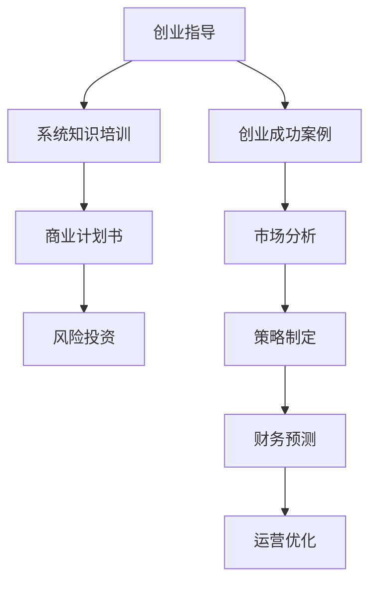

                 

# 为创业者提供系统知识培训和创业指导

> 关键词：创业指导, 系统知识培训, 商业计划书, 风险投资, 创业成功案例, 人工智能创业, 数据科学创业, 科技创业

## 1. 背景介绍

在快速变化的时代，创业不仅是一门艺术，更是一门科学。技术的进步为创业者提供了前所未有的机遇，但也带来了巨大的挑战。如何从技术角度出发，把握市场趋势，构建可持续发展的商业模式，成为了所有创业者面临的核心问题。本文旨在为创业者提供一个系统全面的知识体系，帮助他们在科技创业的征程上少走弯路，实现快速成长。

## 2. 核心概念与联系

### 2.1 核心概念概述

为了更好地理解创业过程中的关键概念和技术，本节将详细阐述以下几个核心概念：

- **创业指导**：一种综合性服务，旨在帮助创业者通过系统培训、项目评估、市场分析等方式，把握创业方向，优化创业计划。
- **系统知识培训**：为创业者提供全面的技术、市场、管理等系统知识，提升创业团队的综合能力。
- **商业计划书**：一个详尽的商业规划，包括公司的使命、目标、策略、市场分析、财务预测等关键要素，是吸引投资的重要文件。
- **风险投资**：一种为初创企业提供资金支持的投资方式，通过股权、债权等方式参与企业运营。
- **创业成功案例**：展示成功创业者的经验和路径，为创业者提供有益借鉴。

### 2.2 核心概念原理和架构的 Mermaid 流程图



这个流程图展示了核心概念之间的联系和流程。创业指导帮助创业者识别市场需求和竞争态势，系统知识培训提升团队的专业能力，商业计划书明确公司定位和发展路径，风险投资提供启动资金，而创业成功案例则为创业者提供实践经验和创新思路。

## 3. 核心算法原理 & 具体操作步骤

### 3.1 算法原理概述

创业指导和系统知识培训的核心理念是通过算法和模型帮助创业者系统分析市场和竞争环境，制定科学合理的创业策略。这里的算法和模型可以包括但不限于：

- **市场分析算法**：通过大数据分析技术，评估市场需求、消费者行为、竞争对手态势等。
- **竞争分析模型**：利用SWOT分析、PEST分析等工具，帮助创业者识别自身的优势、劣势、机会和威胁。
- **商业模式画布**：一种系统化的商业模式设计工具，通过九宫格布局，全面展示企业的价值主张、客户关系、收入来源等关键要素。
- **财务预测模型**：基于历史财务数据，构建预算、成本、利润等预测模型，确保财务健康。
- **技术评估模型**：评估新技术的可行性和商业潜力，确保技术创新与市场需求的契合。

### 3.2 算法步骤详解

以下将详细介绍创业指导和系统知识培训的具体操作步骤：

**Step 1: 识别创业方向**

1. **市场需求分析**：通过市场调研，分析目标市场的规模、增长潜力、消费者需求等。
2. **技术趋势分析**：识别当前技术趋势和未来发展方向，评估技术创新的市场潜力。
3. **竞争对手分析**：评估主要竞争对手的市场份额、产品策略、技术优势等。

**Step 2: 制定商业计划**

1. **核心价值定位**：明确公司的核心价值和竞争优势。
2. **目标市场选择**：确定目标市场的细分领域和潜在客户群体。
3. **商业模式设计**：利用商业模式画布，设计合理的商业模式。
4. **财务预测**：基于历史数据，构建预算、成本、收入、利润等预测模型。
5. **风险评估**：分析潜在的市场风险、技术风险、运营风险等。

**Step 3: 获得投资支持**

1. **项目评估**：通过专业评估，提升项目吸引投资的能力。
2. **投资者对接**：组织与投资者的交流活动，介绍项目和商业模式。
3. **投资谈判**：在投资者的基础上，进行谈判，确保合理的投资条款。

**Step 4: 实施与优化**

1. **项目启动**：根据商业计划，启动项目实施。
2. **市场推广**：制定市场推广策略，提升品牌影响力和用户认知。
3. **运营优化**：通过持续优化，提升产品和服务质量，实现持续增长。
4. **反馈迭代**：根据用户反馈，持续优化产品和服务，提升用户体验。

### 3.3 算法优缺点

**优点**：

- **全面性**：通过系统知识培训和创业指导，帮助创业者全面提升技术和管理能力。
- **科学性**：基于数据驱动的市场分析和财务预测，提升决策的科学性和可靠性。
- **针对性**：根据创业者实际情况，定制化培训和指导，提升实战能力。
- **资源丰富**：整合各类资源和案例，为创业者提供丰富的学习和借鉴素材。

**缺点**：

- **时间成本**：系统培训和指导需要一定的时间和精力投入。
- **灵活性不足**：无法解决特定突发和复杂的创业问题。
- **成本较高**：专业指导和评估可能产生一定的费用。
- **依赖性强**：对指导者的专业能力和经验要求高，可能存在误导风险。

### 3.4 算法应用领域

创业指导和系统知识培训可以应用于多种创业场景，如：

- **AI创业**：利用AI技术解决实际问题，如自动驾驶、医疗诊断、智能家居等。
- **数据科学创业**：通过数据分析、机器学习等技术，提升商业决策的科学性和效率。
- **科技创业**：以新技术为基础，开发创新产品和服务，如区块链、云计算、物联网等。
- **传统行业转型**：利用技术手段优化传统业务模式，实现数字化转型。

## 4. 数学模型和公式 & 详细讲解 & 举例说明

### 4.1 数学模型构建

在创业指导和系统知识培训中，数学模型和公式的应用非常广泛。以下介绍几个核心模型及其应用：

- **市场规模估计模型**：通过历史数据和增长趋势，估计目标市场的规模。公式如下：
  $$
  S = P_0 \times (1 + r)^t
  $$
  其中，$S$为市场规模，$P_0$为初始市场规模，$r$为年增长率，$t$为时间（年）。
  
- **投资回报率（ROI）计算模型**：评估投资项目的收益和成本，计算ROI。公式如下：
  $$
  ROI = \frac{收益 - 成本}{成本}
  $$

### 4.2 公式推导过程

**市场规模估计模型的推导**：

- **数据准备**：收集目标市场的历史数据，包括市场规模、增长率等。
- **模型构建**：根据历史数据，构建市场规模的线性回归模型。
- **预测计算**：将模型参数代入预测公式，计算目标市场规模。

**投资回报率（ROI）计算模型的推导**：

- **收益计算**：计算项目在指定时间内的总收入。
- **成本计算**：计算项目在指定时间内的总成本。
- **ROI计算**：计算收益和成本的差值，除以成本，得到ROI。

### 4.3 案例分析与讲解

**案例1：AI技术创业项目**

- **背景**：一家初创公司计划利用AI技术开发智能客服系统，以提升客户服务效率。
- **市场分析**：通过市场调研，估计智能客服市场的规模为10亿美元，年增长率为15%。
- **投资回报率计算**：预计初期投资100万美元，一年内实现100万美元的收入，ROI为100%。

**案例2：数据科学创业项目**

- **背景**：一家公司利用数据科学技术，为零售企业提供市场分析和消费者行为预测服务。
- **市场规模估计**：通过历史数据，预测市场规模为1亿美元，年增长率为8%。
- **投资回报率计算**：预计初期投资500万美元，一年内实现300万美元的收入，ROI为60%。

## 5. 项目实践：代码实例和详细解释说明

### 5.1 开发环境搭建

在进行创业指导和系统知识培训的项目实践前，需要准备以下开发环境：

- **编程语言**：Python是数据科学和AI创业项目中最常用的语言之一。
- **开发工具**：Jupyter Notebook、PyCharm、Git等。
- **数据平台**：AWS、Google Cloud等云平台，方便数据存储和处理。
- **算法库**：Scikit-learn、TensorFlow、Pandas等，提供数据处理和模型训练的支持。

### 5.2 源代码详细实现

以下是一个简单的市场规模估计模型和投资回报率计算模型的Python代码实现：

```python
import pandas as pd
import numpy as np
from sklearn.linear_model import LinearRegression

# 市场规模估计模型
data = pd.read_csv('market_data.csv')  # 读取市场历史数据
X = data[['year', 'growth_rate']]  # 选取年份和增长率作为自变量
y = data['market_size']  # 选取市场规模作为因变量
model = LinearRegression()  # 构建线性回归模型
model.fit(X, y)  # 训练模型
pred_year = 2024  # 预测年份
predicted_size = model.predict([[pred_year, data['growth_rate'].iloc[0]])  # 预测市场规模
print(f'预测{pred_year}年的市场规模为{predicted_size[0]}')

# 投资回报率计算模型
investment = 1000000  # 初期投资
income = 1000000  # 一年内收入
costs = [500000, 100000]  # 初始成本和年成本
ROI = ((income - np.sum(costs)) / investment) * 100
print(f'ROI为{ROI}%')
```

### 5.3 代码解读与分析

这段代码展示了如何使用Python和Scikit-learn库进行市场规模估计模型的构建和预测，以及投资回报率的计算。在实际应用中，需要根据具体的数据集和需求进行调整和优化。

## 6. 实际应用场景

### 6.1 创业指导的实际应用

**AI技术创业项目**：

- **项目背景**：一家初创公司计划利用AI技术开发智能客服系统，以提升客户服务效率。
- **创业指导**：通过市场调研和竞争分析，识别目标市场和主要竞争对手。
- **系统知识培训**：提供关于AI技术、智能客服系统开发的详细培训。

**数据科学创业项目**：

- **项目背景**：一家公司利用数据科学技术，为零售企业提供市场分析和消费者行为预测服务。
- **创业指导**：通过市场调研和消费者行为分析，识别目标市场和客户需求。
- **系统知识培训**：提供关于数据科学、机器学习、数据可视化的系统培训。

### 6.2 创业指导的未来展望

随着科技的进步，创业指导和系统知识培训将更加注重以下几个方面：

- **数据驱动**：通过大数据分析和机器学习技术，提供更精准的市场分析和预测。
- **定制化**：根据创业者具体情况，提供量身定制的指导和培训。
- **实时性**：通过实时数据分析和反馈，及时调整创业策略。
- **国际化**：提供全球市场和商业模式的指导，帮助创业者拓展国际市场。

## 7. 工具和资源推荐

### 7.1 学习资源推荐

为了帮助创业者提升系统知识水平，以下是一些优质的学习资源：

- **Coursera**：提供多种创业相关的在线课程，涵盖市场分析、财务管理、AI技术等。
- **Udacity**：提供创业实战项目和案例分析，提升实战能力。
- **Harvard Business Review**：提供商业和管理领域的深度文章和研究报告。
- **MBA智慧树**：提供系统的商业和管理知识体系，提升管理能力。

### 7.2 开发工具推荐

以下推荐的开发工具，有助于提升创业指导和系统知识培训的效率：

- **Jupyter Notebook**：数据科学和AI项目开发中最常用的工具之一，提供代码编写和可视化分析的支持。
- **PyCharm**：Python开发环境，提供代码提示、版本控制、调试等功能。
- **Git**：版本控制系统，方便团队协作和代码管理。
- **AWS**：提供云计算平台，支持数据存储、处理和分析。

### 7.3 相关论文推荐

为了深入理解创业指导和系统知识培训的原理和应用，以下是几篇关键的论文推荐：

- **《创业指导对中小企业创业成功的影响》**：探讨创业指导对中小企业创业成功的影响，分析指导与成功之间的关系。
- **《数据驱动的市场分析与预测模型研究》**：介绍数据驱动的市场分析和预测模型，提升市场预测的准确性。
- **《人工智能在创业指导中的应用》**：研究AI技术在创业指导中的应用，提升指导的科学性和精准性。

## 8. 总结：未来发展趋势与挑战

### 8.1 总结

本文详细介绍了创业指导和系统知识培训的核心理念、操作步骤和应用场景，并通过数学模型和代码实例，展示了如何在实际项目中应用这些知识。通过系统的学习，创业者能够全面提升技术和管理能力，在创业的道路上迈出坚实的每一步。

### 8.2 未来发展趋势

展望未来，创业指导和系统知识培训将呈现以下几个发展趋势：

- **数据驱动**：随着数据技术的进步，创业指导将更加依赖于数据驱动的决策支持。
- **智能化**：结合AI技术，提供更加智能化的创业指导和培训。
- **全球化**：提供全球市场和商业模式的指导，帮助创业者拓展国际市场。
- **实战化**：提供更加实战化的案例和项目，提升创业者的实战能力。

### 8.3 面临的挑战

尽管创业指导和系统知识培训在技术上取得了一定的进展，但在实施过程中仍面临以下挑战：

- **数据获取难度**：高质量的市场和财务数据难以获取，影响决策的准确性。
- **知识更新速度快**：技术进步和市场变化快速，需要持续更新培训内容。
- **技术门槛高**：部分创业者缺乏技术基础，难以理解和应用复杂模型。
- **个性化需求**：不同创业者的需求差异大，难以提供定制化的指导和培训。

### 8.4 研究展望

未来，创业指导和系统知识培训需要在以下几个方面进行深入研究：

- **数据获取与处理**：开发高效的数据获取和处理工具，提升数据驱动决策的能力。
- **知识普及**：开发易于理解和应用的指导和培训内容，降低技术门槛。
- **个性化服务**：利用AI技术，提供更加个性化的创业指导和培训。
- **国际合作**：加强国际合作，分享成功经验和最佳实践，提升全球竞争力。

通过持续的研究和创新，相信创业指导和系统知识培训将为更多的创业者提供坚实的技术和管理支持，推动更多有价值的产品和服务诞生，助力经济社会发展。

## 9. 附录：常见问题与解答

**Q1: 如何评估一个创业项目的市场规模？**

A: 通过历史数据和增长趋势，利用市场规模估计模型进行预测。具体步骤如下：
1. 收集目标市场的历史数据，包括市场规模、增长率等。
2. 选取年份和增长率作为自变量，构建线性回归模型。
3. 将模型参数代入预测公式，计算目标市场规模。

**Q2: 如何计算一个项目的投资回报率？**

A: 通过收益和成本的差值，除以初始投资，计算ROI。具体步骤如下：
1. 计算项目在指定时间内的总收入。
2. 计算项目在指定时间内的总成本。
3. 计算收益和成本的差值，除以初始投资，得到ROI。

**Q3: 如何利用AI技术提升创业指导的效果？**

A: 结合AI技术，提供更加智能化的指导和培训。具体步骤如下：
1. 利用机器学习技术，分析市场需求和竞争态势。
2. 通过自然语言处理技术，提供个性化创业指导。
3. 结合计算机视觉技术，分析市场趋势和消费者行为。

**Q4: 如何降低创业指导的难度？**

A: 开发易于理解和应用的指导和培训内容，降低技术门槛。具体步骤如下：
1. 利用图形化界面，简化模型的使用和理解。
2. 提供实战化的案例和项目，提升实战能力。
3. 利用交互式学习工具，提供实时的指导和反馈。

**Q5: 如何提升创业指导的个性化服务？**

A: 利用AI技术，提供更加个性化的创业指导。具体步骤如下：
1. 通过大数据分析，了解创业者的需求和背景。
2. 结合AI技术，提供个性化的培训和指导。
3. 利用机器学习技术，预测和调整创业策略。

通过这些问题的解答，希望创业者能够更好地理解和应用创业指导和系统知识培训，在创业的道路上取得更大的成功。

---

作者：禅与计算机程序设计艺术 / Zen and the Art of Computer Programming

