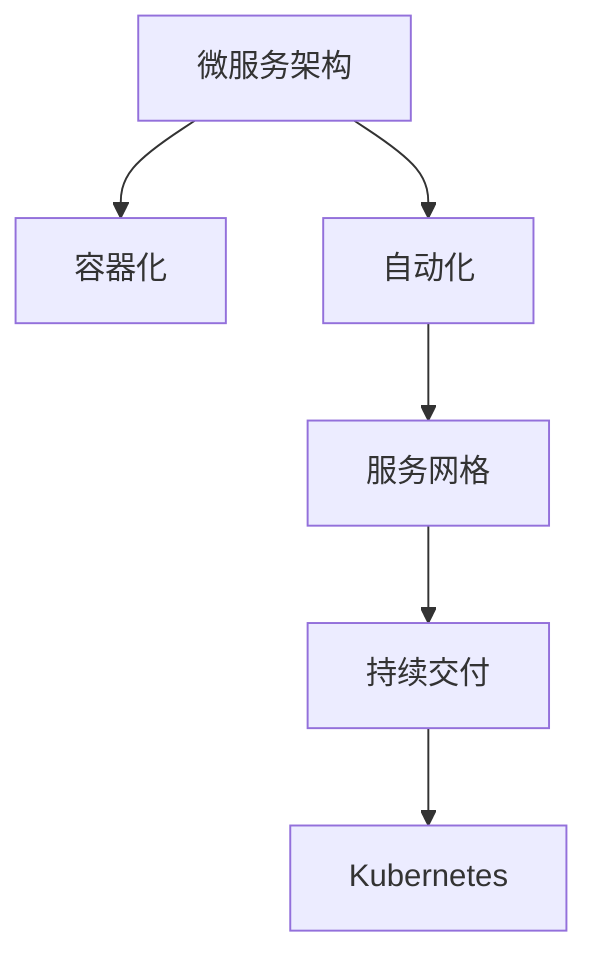

                 

# 云原生AI平台：从开发到部署的全流程

## 1. 背景介绍

### 1.1 问题由来

近年来，人工智能(AI)技术的快速发展，尤其是深度学习模型的广泛应用，为各行各业带来了巨大的变革。然而，传统的AI开发和部署流程面临诸多挑战：

- **开发效率低**：传统AI开发依赖于分布式集群、高性能计算资源，开发周期长、迭代慢。
- **部署复杂**：AI模型需要考虑大规模数据存储、高性能计算资源、模型压缩、版本管理等复杂因素，部署困难。
- **资源浪费**：由于资源调度和利用效率不高，AI系统往往面临资源浪费的问题。

随着云原生技术的兴起，AI开发和部署方式发生了深刻变革。云原生技术以其弹性、高效、自服务等特点，成为了AI系统的重要技术基石。本文章将系统介绍云原生AI平台从开发到部署的全流程，深入探讨其核心概念、实现原理和应用场景，并提出未来发展的方向和挑战。

### 1.2 问题核心关键点

云原生AI平台的核心目标是通过云原生技术，构建高效、弹性、自服务的AI开发和部署环境，提升AI开发的效率和质量，降低AI应用的成本和风险。

其关键点包括：
- **高效开发**：通过云原生技术，实现快速迭代和弹性扩展，支持大规模数据处理和模型训练。
- **弹性部署**：基于云原生架构，构建弹性的资源管理机制，支持动态伸缩和高可用性。
- **自服务化**：通过API、UI等手段，将AI系统封装为标准服务，方便外部系统集成和使用。
- **资源优化**：优化AI系统的计算、存储资源使用效率，提升整体资源利用率。
- **安全与合规**：确保AI系统的数据安全、模型隐私、业务合规，构建可信任的AI应用环境。

## 2. 核心概念与联系

### 2.1 核心概念概述

云原生AI平台的核心概念包括：

- **微服务架构**：将AI系统拆分为多个微服务，每个服务独立部署、升级和管理，实现高内聚、低耦合。
- **容器化**：将AI系统打包为容器镜像，方便统一管理和调度。
- **自动化**：通过CI/CD管道，实现自动化的构建、测试和部署。
- **服务网格**：通过Istio等服务网格，实现微服务的通信、流量管理、安全、监控等。
- **持续交付**：通过DevOps实践，实现快速、可靠、安全的持续交付。
- **Kubernetes**：作为容器编排系统，实现高效、弹性的资源管理。

这些概念之间的逻辑关系可以通过以下Mermaid流程图来展示：



这个流程图展示了几大核心概念之间的关系：

1. 微服务架构：将AI系统拆分为多个独立服务，提高系统的可扩展性和可靠性。
2. 容器化：通过Docker等容器技术，将服务打包为镜像，方便部署和调度。
3. 自动化：通过CI/CD管道，实现快速、高效的构建、测试和部署。
4. 服务网格：通过Istio等服务网格，管理微服务间的通信、流量和监控。
5. 持续交付：通过DevOps实践，实现快速、可靠、安全的软件交付。
6. Kubernetes：作为容器编排系统，管理资源的动态分配和调度。

## 3. 核心算法原理 & 具体操作步骤
### 3.1 算法原理概述

云原生AI平台的核心算法原理主要包括以下几个方面：

- **模型训练**：基于云原生架构，实现大规模分布式训练，加速模型收敛。
- **资源调度**：通过Kubernetes等容器编排系统，动态调整计算、存储资源，优化资源使用效率。
- **持续集成**：通过CI/CD管道，实现代码、测试、构建的自动化，提升开发效率。
- **持续交付**：通过DevOps实践，实现快速、可靠、安全的软件交付。
- **监控与运维**：通过日志、监控、告警等手段，确保系统稳定运行。

### 3.2 算法步骤详解

云原生AI平台从开发到部署的全流程包括以下几个关键步骤：

**Step 1: 微服务拆分与设计**
- 将AI系统划分为多个独立微服务，每个微服务负责特定功能。
- 设计服务接口和数据协议，确保服务间的通信流畅。
- 设计服务发现和负载均衡策略，提高系统的可扩展性和容错性。

**Step 2: 容器化和部署**
- 将微服务打包为容器镜像，并部署到Kubernetes等容器编排平台。
- 配置容器资源限制和调度策略，确保资源高效利用。
- 实现服务发现和负载均衡，确保服务可用性和性能。

**Step 3: 自动化构建和测试**
- 搭建CI/CD管道，自动执行代码构建、测试、部署等任务。
- 设置自动化测试流程，确保代码质量和稳定性。
- 实现自动化持续集成，加速开发迭代。

**Step 4: 服务网格与网络管理**
- 配置Istio等服务网格，管理微服务间的流量、安全、监控等。
- 实现微服务的自动发现和负载均衡。
- 配置基于政策的流量管理策略，提高系统的可靠性和安全性。

**Step 5: 持续交付与部署**
- 搭建持续交付管道，实现快速、可靠的软件交付。
- 实现自动化测试和部署，提升交付效率和质量。
- 配置滚动更新策略，最小化系统停机时间和影响范围。

**Step 6: 监控与运维**
- 配置日志、监控和告警系统，实时监控系统状态。
- 实现健康检查和自动恢复，确保系统稳定运行。
- 分析系统性能瓶颈和故障原因，持续优化系统性能。

### 3.3 算法优缺点

云原生AI平台具有以下优点：

1. **高效开发**：通过微服务架构和容器化技术，支持快速迭代和弹性扩展，提高开发效率。
2. **弹性部署**：基于Kubernetes等容器编排系统，实现动态资源管理，支持动态伸缩和高可用性。
3. **自服务化**：通过API和UI，将AI系统封装为标准服务，方便外部系统集成和使用。
4. **资源优化**：通过自动化和持续交付，优化资源使用效率，提升整体资源利用率。
5. **安全与合规**：通过服务网格和DevOps实践，确保数据安全、模型隐私、业务合规，构建可信任的AI应用环境。

同时，该方法也存在以下局限性：

1. **复杂性增加**：微服务拆分和容器化带来了一定的系统复杂性，需要设计和维护服务间的通信和数据协议。
2. **成本增加**：云原生平台依赖于云计算资源，初期部署和维护成本较高。
3. **学习曲线陡峭**：云原生技术涉及多个领域的知识，需要较高的技术积累和实践经验。
4. **安全挑战**：云原生环境增加了系统的安全复杂性，需要更严格的安全管理措施。
5. **监控复杂**：云原生系统的监控和运维需要更多的工具和技术支持，增加了系统管理的复杂度。

尽管存在这些局限性，但就目前而言，云原生AI平台仍是最主流和先进的开发和部署方式。未来相关研究的重点在于如何进一步降低云原生技术的复杂性，提升开发和部署的便捷性，同时兼顾可扩展性和安全性等因素。

### 3.4 算法应用领域

云原生AI平台已经在多个领域得到了广泛的应用，涵盖了从科学研究到商业应用的各种场景，例如：

- **科学研究**：支持大规模分布式训练，加速模型迭代和验证，提高科研效率。
- **金融科技**：实现自动化、快速、安全的模型部署和交付，提升金融服务的智能化水平。
- **医疗健康**：提供高效、弹性、自服务的AI开发环境，支持医疗影像分析、疾病预测等应用。
- **智能制造**：通过AI模型优化生产流程，实现智能制造和质量控制。
- **智慧城市**：构建AI系统，支持城市管理、交通监控、安全防范等应用。

除了这些传统领域，云原生AI平台还在不断拓展应用场景，如智慧农业、智能家居、智能客服等，为各行各业带来新的技术革新。

## 4. 数学模型和公式 & 详细讲解 & 举例说明

### 4.1 数学模型构建

本节将使用数学语言对云原生AI平台从开发到部署的全流程进行更严格的刻画。

假设一个AI系统被拆分为多个微服务，每个微服务提供特定功能，如图像识别、自然语言处理等。在微服务构建完成后，需要对其进行容器化和部署。设每个微服务的计算资源为 $C_i$，存储资源为 $S_i$，其中 $i$ 表示微服务编号。

定义每个微服务的资源需求函数为 $f_i(C_i, S_i)$，资源限制函数为 $g_i(C_i, S_i)$。资源调度目标是最小化系统总成本，即：

$$
\min_{C_i, S_i} \sum_{i=1}^n f_i(C_i, S_i) \quad \text{subject to} \quad g_i(C_i, S_i) \leq 1 \quad \forall i
$$

其中 $n$ 表示微服务数量，约束 $g_i(C_i, S_i) \leq 1$ 表示每个微服务的计算和存储资源不能超过1个单位。

### 4.2 公式推导过程

以下我们以资源调度为例，推导资源调度问题的优化公式。

假设每个微服务的计算和存储资源需求分别为 $C_i$ 和 $S_i$，总资源限制为 $R_C$ 和 $R_S$。则资源调度的优化问题可以表示为：

$$
\min_{C_i, S_i} \sum_{i=1}^n C_i + \lambda \sum_{i=1}^n S_i
$$

其中 $\lambda$ 为存储资源的价格系数。

通过线性规划等优化方法，可以找到最优的资源分配方案。在实际应用中，可以使用Kubernetes等容器编排系统来实现资源调度和优化。

### 4.3 案例分析与讲解

假设一个AI系统包含两个微服务：图像识别和自然语言处理。每个微服务的计算资源需求分别为 $C_1 = 1.2$ 和 $C_2 = 0.8$，存储资源需求分别为 $S_1 = 0.5$ 和 $S_2 = 0.3$。系统的总计算资源限制为 $R_C = 2$，总存储资源限制为 $R_S = 1$。

通过资源调度模型，可以求解出最优的资源分配方案，如图：

```
+-----------+---------+---------+---------+
| Micro     | C       | S       | f(C,S)  |
| Service   | (1.2, 0.5)| (0.8, 0.3)|(1.2, 0.5)|(0.8, 0.3)|
+-----------+---------+---------+---------+
```

通过求解线性规划，得到最优的资源分配方案为：

- 微服务1分配计算资源 $C_1 = 1$，存储资源 $S_1 = 0.5$，总成本 $f(C_1, S_1) = 1.5$。
- 微服务2分配计算资源 $C_2 = 0.8$，存储资源 $S_2 = 0.3$，总成本 $f(C_2, S_2) = 0.9$。

## 5. 项目实践：代码实例和详细解释说明
### 5.1 开发环境搭建

在进行云原生AI平台开发之前，需要先搭建好开发环境。以下是使用Docker和Kubernetes搭建云原生AI平台的流程：

1. 安装Docker：从官网下载并安装Docker，搭建Docker容器运行环境。
2. 安装Kubernetes：选择合适的操作系统和架构，从官网下载并安装Kubernetes，搭建Kubernetes集群。
3. 配置Kubernetes：根据需求配置Kubernetes的资源管理、存储、网络、安全等参数。
4. 安装CI/CD管道：选择常用的CI/CD工具，如Jenkins、GitLab CI等，配置构建、测试、部署流程。
5. 配置服务网格：选择Istio等服务网格，配置流量管理、安全、监控等策略。

完成上述步骤后，即可在Kubernetes集群上启动云原生AI平台的各个组件。

### 5.2 源代码详细实现

这里以构建一个简单的图像识别微服务为例，展示云原生AI平台的开发过程。

首先，构建Docker镜像：

```Dockerfile
# 使用Python 3.7作为运行环境
FROM python:3.7-slim
# 安装依赖
RUN apt-get update && apt-get install -y wget
RUN pip install torch torchvision
# 构建图像识别模型
ADD classifier.py /app/
WORKDIR /app
# 设置运行命令
CMD ["python", "classifier.py"]
```

然后，将代码提交到Git仓库，并通过Jenkins CI进行自动化构建和测试：

```yaml
# Jenkinsfile
pipeline {
    agent any
    stages {
        stage('构建') {
            steps {
                sh 'docker build -t classifier:v1 .'
                sh 'docker push classifier:v1'
            }
        }
        stage('测试') {
            steps {
                sh 'docker run --rm classifier:v1 wget http://example.com/test.jpg'
            }
        }
    }
}
```

接着，将构建好的Docker镜像部署到Kubernetes集群上，并进行容器编排：

```yaml
# Kubernetes Deployment
apiVersion: apps/v1
kind: Deployment
metadata:
  name: classifier
spec:
  replicas: 3
  selector:
    matchLabels:
      app: classifier
  template:
    metadata:
      labels:
        app: classifier
    spec:
      containers:
      - name: classifier
        image: classifier:v1
        ports:
        - containerPort: 8080
        resources:
          limits:
            cpu: "1"
            memory: "512Mi"
          requests:
            cpu: "0.5"
            memory: "256Mi"
```

最后，通过Istio等服务网格，配置流量管理、安全、监控等策略：

```yaml
# Istio Gateway
apiVersion: networking.istio.io/v1alpha3
kind: Gateway
metadata:
  name: classifier-gateway
spec:
  selector:
    istio: ingressgateway
  servers:
  - port:
      number: 80
      name: http
      protocol: HTTP
    hosts:
    - "*"
  - port:
      number: 443
      name: https
      protocol: HTTPS
    hosts:
    - "*"

# Istio VirtualService
apiVersion: networking.istio.io/v1alpha3
kind: VirtualService
metadata:
  name: classifier-vs
spec:
  hosts:
  - "*"
  http:
  - route:
    - destination:
        host: classifier
        port:
          number: 8080
```

通过以上代码，可以构建并部署一个简单的图像识别微服务，并实现自动化的构建、测试和部署。

### 5.3 代码解读与分析

让我们再详细解读一下关键代码的实现细节：

**Dockerfile**：
- 定义了微服务的运行环境，包括Python版本和依赖库。
- 构建了图像识别模型，将其打包为Docker镜像。
- 设置了微服务的运行命令，确保容器能够正确启动。

**Jenkinsfile**：
- 定义了CI/CD管道的构建流程，包括构建、测试和部署任务。
- 通过sh命令，使用Docker进行镜像构建和推送。
- 通过wget命令，测试构建好的Docker镜像是否能够正确运行。

**Kubernetes Deployment**：
- 定义了微服务的副本数量、标签和容器配置。
- 配置了计算和存储资源限制，确保资源高效利用。
- 定义了容器端口和资源请求和限制，确保服务正常运行。

**Istio Gateway和VirtualService**：
- 定义了服务网格的路由规则，将流量路由到正确的微服务。
- 通过Gateway和VirtualService，实现了微服务的流量管理和监控。

这些代码展示了大规模分布式系统的构建和部署过程，通过云原生技术实现了高效、弹性的资源管理，提升了开发和部署效率。

## 6. 实际应用场景
### 6.1 智能客服系统

基于云原生AI平台的智能客服系统，能够实现7x24小时不间断服务，快速响应客户咨询，用自然流畅的语言解答各类常见问题。通过微服务架构和容器化技术，智能客服系统具备高度的弹性和扩展性，能够应对高峰期的服务压力。

在技术实现上，可以收集企业内部的历史客服对话记录，将问题和最佳答复构建成监督数据，在此基础上对预训练模型进行微调。微调后的模型能够自动理解用户意图，匹配最合适的答案模板进行回复。对于客户提出的新问题，还可以接入检索系统实时搜索相关内容，动态组织生成回答。如此构建的智能客服系统，能大幅提升客户咨询体验和问题解决效率。

### 6.2 金融舆情监测

金融机构需要实时监测市场舆论动向，以便及时应对负面信息传播，规避金融风险。云原生AI平台可以实现自动化、快速、安全的模型部署和交付，帮助金融机构实时获取和分析市场舆情数据，提高风险预警和决策的效率和准确性。

具体而言，可以收集金融领域相关的新闻、报道、评论等文本数据，并对其进行主题标注和情感标注。在此基础上对预训练语言模型进行微调，使其能够自动判断文本属于何种主题，情感倾向是正面、中性还是负面。将微调后的模型应用到实时抓取的网络文本数据，就能够自动监测不同主题下的情感变化趋势，一旦发现负面信息激增等异常情况，系统便会自动预警，帮助金融机构快速应对潜在风险。

### 6.3 个性化推荐系统

当前的推荐系统往往只依赖用户的历史行为数据进行物品推荐，无法深入理解用户的真实兴趣偏好。云原生AI平台可以实现高效、弹性、自服务的AI开发环境，支持大规模分布式训练和微调，从而深入挖掘用户的兴趣和需求，提供更精准、多样的推荐内容。

在实践中，可以收集用户浏览、点击、评论、分享等行为数据，提取和用户交互的物品标题、描述、标签等文本内容。将文本内容作为模型输入，用户的后续行为（如是否点击、购买等）作为监督信号，在此基础上微调预训练语言模型。微调后的模型能够从文本内容中准确把握用户的兴趣点。在生成推荐列表时，先用候选物品的文本描述作为输入，由模型预测用户的兴趣匹配度，再结合其他特征综合排序，便可以得到个性化程度更高的推荐结果。

### 6.4 未来应用展望

随着云原生AI平台的发展，其应用场景将不断拓展，为各行各业带来新的变革。

在智慧医疗领域，云原生AI平台可以构建高效的AI开发和部署环境，支持大规模分布式训练和微调，加速医疗影像分析、疾病预测等AI应用的研究和开发。

在智能教育领域，云原生AI平台可以实现自动化的持续交付和部署，支持快速迭代和模型优化，提升教育智能化的水平。

在智慧城市治理中，云原生AI平台可以构建AI系统，支持城市管理、交通监控、安全防范等应用，提升城市治理的智能化水平。

此外，在企业生产、社会治理、文娱传媒等众多领域，云原生AI平台也将不断涌现，为传统行业带来新的技术突破，赋能各行各业数字化转型升级。

## 7. 工具和资源推荐
### 7.1 学习资源推荐

为了帮助开发者系统掌握云原生AI平台的核心概念和实践技巧，这里推荐一些优质的学习资源：

1. **《Kubernetes官方文档》**：提供Kubernetes的全面介绍和操作指南，是云原生开发的基础。
2. **《Istio官方文档》**：详细介绍了Istio服务网格的配置和使用方法，是云原生网络管理的重要工具。
3. **《TensorFlow官方文档》**：介绍了TensorFlow的分布式训练和模型优化技巧，是云原生AI开发的重要框架。
4. **《Docker官方文档》**：提供了Docker容器技术的详细介绍和操作指南，是云原生开发的基础设施。
5. **《DevOps实践指南》**：介绍了DevOps的持续交付和持续集成实践，是云原生开发的必备知识。

通过这些学习资源，可以帮助开发者全面掌握云原生AI平台的开发和部署技巧，提升开发效率和系统稳定性。

### 7.2 开发工具推荐

高效的开发离不开优秀的工具支持。以下是几款用于云原生AI平台开发的常用工具：

1. **Jenkins**：一个流行的CI/CD工具，支持构建、测试、部署等自动化任务，是云原生开发的重要管道。
2. **GitLab**：一个全面的DevOps平台，集成了代码管理、持续集成、持续交付等功能，是云原生开发的重要工具。
3. **Kubernetes**：一个容器编排系统，支持动态资源管理和调度，是云原生开发的基础设施。
4. **Istio**：一个服务网格，支持微服务间的流量管理、安全、监控等，是云原生网络管理的重要工具。
5. **Prometheus**：一个开源的监控系统，支持实时监控和告警，是云原生系统的重要组成部分。
6. **Grafana**：一个开源的数据可视化工具，支持实时监控数据的展示和分析，是云原生监控的重要工具。

合理利用这些工具，可以显著提升云原生AI平台的开发效率和系统稳定性，加速AI应用的落地和迭代。

### 7.3 相关论文推荐

云原生AI平台的发展离不开学界的持续研究。以下是几篇奠基性的相关论文，推荐阅读：

1. **《Microservices: A Platform for Distributed Systems Development》**：介绍微服务架构的基本概念和设计原则，是微服务开发的经典文献。
2. **《Containerization: A Brief Introduction》**：介绍Docker容器化的基本概念和实现方法，是容器技术的入门指南。
3. **《Kubernetes: Deploying, Managing, and Scaling Open Applications on Open Platforms》**：介绍Kubernetes的架构和使用方法，是云原生开发的重要参考。
4. **《Istio: Open Platform for Connecting Microservices》**：介绍Istio服务网格的基本概念和使用方法，是云原生网络管理的重要文献。
5. **《CI/CD Best Practices: The Top 10 Practices for Continuous Integration and Continuous Delivery》**：介绍CI/CD的最佳实践和实现方法，是云原生开发的必备知识。

这些论文代表了大规模分布式系统开发和部署的前沿成果，通过学习这些前沿成果，可以帮助研究者把握云原生AI平台的发展方向，激发更多的创新灵感。

## 8. 总结：未来发展趋势与挑战

### 8.1 总结

本文对云原生AI平台从开发到部署的全流程进行了系统介绍。首先阐述了云原生AI平台的研究背景和意义，明确了云原生开发对AI系统高效、弹性、自服务的独特价值。其次，从原理到实践，详细讲解了云原生AI平台的核心概念和实现方法，给出了云原生AI平台的完整代码实例。同时，本文还广泛探讨了云原生AI平台在智能客服、金融舆情、个性化推荐等多个行业领域的应用前景，展示了云原生AI平台在构建AI应用中的巨大潜力。最后，本文精选了云原生AI平台的各类学习资源，力求为读者提供全方位的技术指引。

通过本文的系统梳理，可以看到，云原生AI平台正在成为AI系统开发和部署的主流范式，极大地拓展了AI系统的应用边界，推动了AI技术的产业化进程。未来，伴随云原生技术的发展，云原生AI平台必将在构建更加智能、高效、自服务的AI系统方面发挥更大的作用。

### 8.2 未来发展趋势

展望未来，云原生AI平台的发展将呈现以下几个趋势：

1. **更强的自动化和智能化**：未来的云原生AI平台将进一步提升自动化和智能化水平，实现更快速、更可靠的持续交付和持续部署。
2. **更灵活的微服务设计**：未来的云原生AI平台将支持更灵活、更高效的服务设计，支持微服务的快速迭代和动态扩展。
3. **更丰富的服务网格功能**：未来的云原生AI平台将提供更丰富的服务网格功能，支持更复杂、更灵活的流量管理、安全、监控等需求。
4. **更广泛的场景应用**：未来的云原生AI平台将不断拓展应用场景，覆盖更多领域和行业，推动AI技术的广泛应用。
5. **更高效的资源管理和优化**：未来的云原生AI平台将提供更高效的资源管理和优化机制，实现更细粒度、更动态的资源调度。
6. **更强大的安全与合规保障**：未来的云原生AI平台将提供更强大的安全与合规保障机制，确保数据安全、模型隐私、业务合规。

以上趋势凸显了云原生AI平台的广阔前景。这些方向的探索发展，必将进一步提升云原生AI平台的性能和应用范围，为AI技术的发展提供更强大的技术支撑。

### 8.3 面临的挑战

尽管云原生AI平台已经取得了瞩目成就，但在迈向更加智能化、普适化应用的过程中，它仍面临着诸多挑战：

1. **复杂性增加**：云原生技术涉及多个领域的知识，系统设计和开发复杂度较高。
2. **学习曲线陡峭**：云原生技术需要较高的技术积累和实践经验，开发者需不断学习和掌握新技术。
3. **资源成本高**：云原生平台依赖于云计算资源，初期部署和维护成本较高。
4. **系统安全问题**：云原生环境增加了系统的安全复杂性，需要更严格的安全管理措施。
5. **运维难度大**：云原生系统的监控和运维需要更多的工具和技术支持，增加了系统管理的复杂度。
6. **性能瓶颈**：云原生系统在处理大规模数据和高并发场景时，可能面临性能瓶颈。

尽管存在这些挑战，但通过不断优化云原生技术，提升开发和部署的便捷性，同时注重系统安全与性能，云原生AI平台必将在未来的发展中取得更大的成功。

### 8.4 研究展望

面对云原生AI平台所面临的种种挑战，未来的研究需要在以下几个方面寻求新的突破：

1. **更高效的数据处理和存储**：探索更高效、更灵活的数据处理和存储技术，支持大规模数据分布式处理和存储。
2. **更智能的模型训练和优化**：研究更智能、更高效的模型训练和优化方法，加速模型收敛，提升模型性能。
3. **更灵活的微服务架构**：探索更灵活、更高效的微服务设计，支持微服务的快速迭代和动态扩展。
4. **更广泛的服务网格功能**：研究更广泛、更灵活的服务网格功能，支持更复杂、更灵活的流量管理、安全、监控等需求。
5. **更强大的自动化和智能化**：研究更强大、更可靠的自动化和智能化机制，实现更快速、更可靠的持续交付和持续部署。
6. **更安全、更合规的系统架构**：研究更安全、更合规的系统架构和机制，确保数据安全、模型隐私、业务合规。

这些研究方向将进一步推动云原生AI平台的发展，提升AI系统的性能和应用范围，为构建智能、高效、自服务的AI系统铺平道路。

## 9. 附录：常见问题与解答

**Q1：云原生AI平台与传统AI平台有何不同？**

A: 云原生AI平台与传统AI平台的主要区别在于其架构和部署方式：

- **架构**：云原生AI平台采用微服务架构，将AI系统拆分为多个独立服务，每个服务独立部署、升级和管理，支持更灵活、更高效的系统设计。
- **部署**：云原生AI平台采用容器化技术，将AI系统打包为容器镜像，方便统一管理和调度，支持弹性、动态的资源管理。
- **开发**：云原生AI平台采用自动化、持续交付的DevOps实践，实现快速、可靠的软件交付，提升开发效率。

这些差异使得云原生AI平台在性能、效率、弹性等方面具备显著优势，能够更好地支持大规模、复杂、动态的AI应用场景。

**Q2：云原生AI平台如何优化资源使用效率？**

A: 云原生AI平台通过多种方式优化资源使用效率，主要包括以下几点：

1. **容器化**：将AI系统打包为容器镜像，方便统一管理和调度，提高资源利用率。
2. **自动伸缩**：根据负载情况动态调整计算和存储资源，避免资源浪费，支持弹性伸缩。
3. **资源限制**：配置计算和存储资源的请求和限制，避免资源争抢和过度消耗。
4. **优化算法**：使用更高效的算法和模型结构，提升资源利用率和模型性能。
5. **负载均衡**：通过服务网格等技术，实现微服务的负载均衡和流量管理，提高系统性能和可靠性。

通过这些措施，云原生AI平台能够最大限度地优化资源使用效率，提升系统的整体性能和稳定性。

**Q3：如何保障云原生AI平台的安全性？**

A: 保障云原生AI平台的安全性需要从多个方面入手：

1. **数据安全**：采用数据加密、访问控制等措施，保护数据的安全性和隐私性。
2. **模型安全**：对模型进行安全审计和监测，避免模型被篡改或攻击。
3. **系统安全**：采用防火墙、入侵检测等技术，保护系统的安全性和稳定性。
4. **合规性**：确保系统符合相关法律法规和行业标准，保护业务的合规性。
5. **自动化监控**：实时监控系统状态和性能指标，及时发现和应对安全威胁。

通过这些措施，云原生AI平台能够构建一个安全、可靠、可控的AI应用环境，保障系统的稳定运行和数据安全。

**Q4：云原生AI平台如何实现快速迭代？**

A: 云原生AI平台通过自动化、持续交付的DevOps实践，实现快速迭代：

1. **自动化构建**：通过CI/CD管道，自动执行代码构建、测试和部署任务，缩短开发周期。
2. **自动化测试**：通过自动化测试工具，快速发现和修复代码缺陷，提高开发质量。
3. **持续交付**：通过持续交付管道，实现快速、可靠的软件交付，提升开发效率。
4. **版本管理**：通过版本控制工具，管理代码和模型的版本，支持快速迭代和回滚。

通过这些措施，云原生AI平台能够实现快速、可靠的持续交付和迭代，提升开发效率和系统性能。

**Q5：云原生AI平台如何应对大数据和复杂任务？**

A: 云原生AI平台通过多种技术手段应对大数据和复杂任务：

1. **分布式计算**：通过Hadoop、Spark等分布式计算框架，处理大规模数据，加速模型训练和数据处理。
2. **高性能计算**：通过GPU、TPU等高性能计算资源，加速模型训练和推理，提升系统性能。
3. **自动优化**：通过自动调参、自动模型优化等技术，提升模型性能和资源利用率。
4. **服务网格**：通过Istio等服务网格，管理微服务间的流量和负载均衡，支持复杂任务的微服务部署。
5. **容器编排**：通过Kubernetes等容器编排系统，实现动态资源管理，支持大规模、复杂任务的部署。

通过这些措施，云原生AI平台能够应对大数据和复杂任务，提供高效、可靠的AI服务。

---

作者：禅与计算机程序设计艺术 / Zen and the Art of Computer Programming

