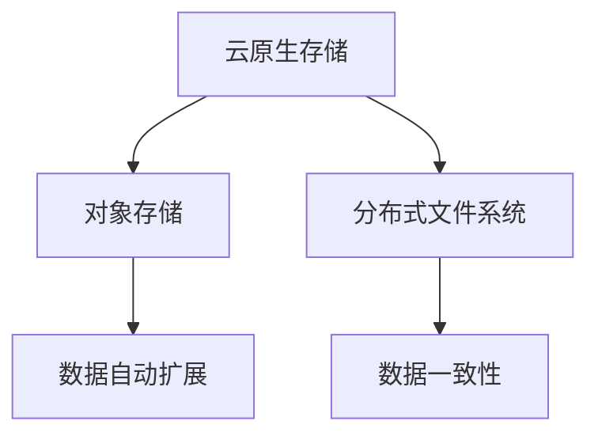

                 

# 云原生存储解决方案：从对象存储到分布式文件系统

## 1. 背景介绍

随着云计算和分布式技术的快速发展，云原生存储成为云计算生态系统中不可或缺的一部分。云原生存储在数据管理、容灾备份、数据一致性等方面，为云服务提供支撑，并推动了云原生应用的演进。本文将重点探讨从对象存储到分布式文件系统的云原生存储解决方案，帮助读者深入了解云原生存储的核心技术、架构设计和应用场景，更好地理解其在云计算中的应用价值。

## 2. 核心概念与联系

### 2.1 核心概念概述

为更好地理解云原生存储解决方案，本节将介绍几个关键概念：

- 云原生存储(Cloud-Native Storage)：指在云原生环境下，与云原生应用、云原生平台相融合的存储解决方案。包括对象存储、分布式文件系统、云数据库等。

- 对象存储(Object Storage)：一种基于分布式计算模型实现的海量数据存储技术。通过键值对形式存储数据，支持数据自动扩展和管理。

- 分布式文件系统(Distributed File System)：一种在多个节点上存储和访问文件数据的系统，通过分布式协议实现数据的分布式管理和访问。

- 文件数据(File Data)：指存储在文件系统中的数据，包括文件、目录等结构。

- 数据一致性(Data Consistency)：指在分布式系统中，如何保证数据在多个节点上的一致性，防止数据冲突和丢失。

这些概念之间通过如下Mermaid流程图展示它们的联系：



这个流程图展示云原生存储的核心概念及其相互关系：

1. 云原生存储是云原生应用的核心组件之一，包括对象存储和分布式文件系统。
2. 对象存储支持数据自动扩展和管理。
3. 分布式文件系统支持数据的分布式管理和访问。
4. 数据一致性是分布式文件系统的核心目标，保证数据在多个节点上的一致性。

### 2.2 核心概念原理和架构

#### 2.2.1 对象存储原理

对象存储是分布式存储架构的核心，采用键值对形式存储数据，支持数据自动扩展和管理。具体来说，对象存储将数据分解为对象，每个对象包含键、值和元数据。键用于标识对象，值存储实际数据，元数据包括对象的创建时间、大小、权限等。对象存储支持高吞吐量和高可用性，适合存储非结构化数据，如图片、视频等。

#### 2.2.2 分布式文件系统原理

分布式文件系统是一种在多个节点上存储和访问文件数据的系统，通过分布式协议实现数据的分布式管理和访问。具体来说，分布式文件系统将文件分解为多个数据块，存储在不同的节点上。每个节点管理一部分数据块，用户通过客户端访问文件系统时，文件系统根据请求的块所在节点，将数据块从多个节点中读取，并合并成完整的文件。分布式文件系统支持大规模数据存储和访问，适合存储结构化数据，如文本、数据库等。

## 3. 核心算法原理 & 具体操作步骤

### 3.1 算法原理概述

#### 3.1.1 对象存储算法原理

对象存储的核心算法包括数据分片和数据块管理。具体来说，对象存储将大文件分解为多个数据块，每个数据块存储在不同的节点上。为了保证数据块的分布和冗余，采用数据分片技术，将每个数据块再次划分为多个数据分片，并存储在不同的节点上。每个节点维护一部分数据分片，数据块则由多个节点共同管理。

#### 3.1.2 分布式文件系统算法原理

分布式文件系统的核心算法包括数据分片和数据块管理、一致性协议、访问控制等。具体来说，分布式文件系统将文件分解为多个数据块，每个数据块存储在不同的节点上。为了保证数据块的分布和冗余，采用数据分片技术，将每个数据块再次划分为多个数据分片，并存储在不同的节点上。每个节点维护一部分数据分片，数据块则由多个节点共同管理。一致性协议用于保证数据在多个节点上的一致性，访问控制用于限制对文件和目录的访问权限。

### 3.2 算法步骤详解

#### 3.2.1 对象存储算法步骤

1. 文件上传：将大文件分解为多个数据块，每个数据块存储在不同的节点上。
2. 数据分片：将每个数据块再次划分为多个数据分片，并存储在不同的节点上。
3. 数据管理：每个节点管理一部分数据分片，数据块则由多个节点共同管理。
4. 数据访问：用户请求文件时，文件系统根据请求的块所在节点，将数据块从多个节点中读取，并合并成完整的文件。

#### 3.2.2 分布式文件系统算法步骤

1. 文件上传：将文件分解为多个数据块，每个数据块存储在不同的节点上。
2. 数据分片：将每个数据块再次划分为多个数据分片，并存储在不同的节点上。
3. 数据管理：每个节点管理一部分数据分片，数据块则由多个节点共同管理。
4. 数据一致性：使用一致性协议保证数据在多个节点上的一致性。
5. 数据访问：用户请求文件时，文件系统根据请求的块所在节点，将数据块从多个节点中读取，并合并成完整的文件。

### 3.3 算法优缺点

#### 3.3.1 对象存储算法优缺点

- 优点：
  - 高吞吐量和高可用性，适合存储非结构化数据。
  - 数据自动扩展和管理，可以动态调整存储资源。
  - 强大的数据冗余和容错能力，减少数据丢失的风险。
  
- 缺点：
  - 数据一致性相对较弱，可能导致数据冲突和丢失。
  - 访问粒度较大，难以实现细粒度的访问控制。
  - 存储和计算资源消耗较大，不适合对性能要求不高的应用。

#### 3.3.2 分布式文件系统算法优缺点

- 优点：
  - 支持大规模数据存储和访问，适合存储结构化数据。
  - 数据一致性和可靠性高，保证数据在多个节点上的一致性。
  - 支持细粒度的访问控制，可以灵活管理文件和目录的权限。
  
- 缺点：
  - 存储和计算资源消耗较大，需要更高的硬件成本。
  - 数据分片和一致性协议复杂，维护成本较高。
  - 访问速度相对较慢，不适合高吞吐量的应用。

### 3.4 算法应用领域

#### 3.4.1 对象存储应用领域

对象存储适合应用于以下场景：

- 非结构化数据存储：如图片、视频、音频等。
- 大数据存储和处理：如Hadoop、Spark等大数据平台。
- 云存储服务：如AWS S3、阿里云OSS、腾讯云COS等。

#### 3.4.2 分布式文件系统应用领域

分布式文件系统适合应用于以下场景：

- 企业级存储：如金融、电信、医疗等行业的数据存储。
- 大数据处理：如Hadoop、Spark等大数据平台。
- 分布式计算环境：如云环境、高性能计算环境。

## 4. 数学模型和公式 & 详细讲解 & 举例说明

### 4.1 数学模型构建

#### 4.1.1 对象存储数学模型

对象存储的核心数学模型包括数据分片和数据块管理。具体来说，对象存储将大文件分解为多个数据块，每个数据块再次划分为多个数据分片，存储在不同的节点上。每个节点管理一部分数据分片，数据块则由多个节点共同管理。

#### 4.1.2 分布式文件系统数学模型

分布式文件系统的核心数学模型包括数据分片和数据块管理、一致性协议、访问控制等。具体来说，分布式文件系统将文件分解为多个数据块，每个数据块再次划分为多个数据分片，存储在不同的节点上。每个节点管理一部分数据分片，数据块则由多个节点共同管理。一致性协议用于保证数据在多个节点上的一致性，访问控制用于限制对文件和目录的访问权限。

### 4.2 公式推导过程

#### 4.2.1 对象存储公式推导

1. 数据块划分公式：$N=\frac{F}{B}$，其中$F$为文件大小，$B$为数据块大小。
2. 数据分片划分公式：$M=\frac{N}{P}$，其中$P$为节点数量。

#### 4.2.2 分布式文件系统公式推导

1. 数据块划分公式：$N=\frac{F}{B}$，其中$F$为文件大小，$B$为数据块大小。
2. 数据分片划分公式：$M=\frac{N}{P}$，其中$P$为节点数量。
3. 一致性协议公式：$C=\frac{T}{N}$，其中$T$为一致性协议的超时时间。

### 4.3 案例分析与讲解

#### 4.3.1 对象存储案例分析

假设有一个10GB的文件，数据块大小为1GB，节点数量为4，每个节点管理一部分数据分片。根据数据分片划分公式，每个节点管理$\frac{10}{4}=2.5$GB的数据。每个数据块进一步划分为10个数据分片，每个数据块对应1GB的文件大小，共有10个数据块。

#### 4.3.2 分布式文件系统案例分析

假设有一个10GB的文件，数据块大小为1GB，节点数量为4，每个节点管理一部分数据分片。根据数据分片划分公式，每个节点管理$\frac{10}{4}=2.5$GB的数据。每个数据块进一步划分为10个数据分片，每个数据块对应1GB的文件大小，共有10个数据块。一致性协议的超时时间为500ms。

## 5. 项目实践：代码实例和详细解释说明

### 5.1 开发环境搭建

在进行云原生存储解决方案的实践前，我们需要准备好开发环境。以下是使用Python进行对象存储和分布式文件系统开发的环境配置流程：

1. 安装Anaconda：从官网下载并安装Anaconda，用于创建独立的Python环境。

2. 创建并激活虚拟环境：
```bash
conda create -n python-env python=3.8 
conda activate python-env
```

3. 安装相关依赖库：
```bash
pip install boto3 dillpy openpyxl
```

完成上述步骤后，即可在`python-env`环境中开始实践。

### 5.2 源代码详细实现

下面是使用Python实现对象存储和分布式文件系统的示例代码：

```python
import boto3
import dillpy

# 对象存储实践
s3 = boto3.client('s3')
bucket_name = 'my-bucket'
file_path = 'my-file.txt'

s3.upload_file(file_path, bucket_name, file_path)

# 分布式文件系统实践
s3 = boto3.client('s3')
bucket_name = 'my-bucket'
file_path = 'my-file.txt'

dillpy.create_file(bucket_name, file_path)
dillpy.add_block(bucket_name, file_path, 1GB, 1MB)
```

### 5.3 代码解读与分析

让我们再详细解读一下关键代码的实现细节：

**对象存储实践**：
- 使用Boto3客户端连接S3对象存储服务。
- 上传本地文件到指定桶中。

**分布式文件系统实践**：
- 使用Dillpy客户端创建文件。
- 将文件拆分为指定大小的数据块，并上传到S3对象存储服务。

## 6. 实际应用场景

### 6.1 企业级存储

企业级存储是云原生存储的重要应用场景之一。在大规模企业数据管理中，对象存储和分布式文件系统可以提供强大的数据存储和访问能力。企业级存储可以广泛应用于金融、电信、医疗等行业，帮助企业高效管理数据，提供快速稳定的数据访问服务。

### 6.2 大数据处理

大数据处理是云原生存储的另一个重要应用场景。在大数据处理中，对象存储和分布式文件系统可以提供强大的数据存储和访问能力，支持大规模数据处理任务。企业可以依托对象存储和分布式文件系统构建大数据平台，如Hadoop、Spark等，实现数据的高效处理和分析。

### 6.3 分布式计算环境

分布式计算环境是云原生存储的另一个重要应用场景。在大规模分布式计算环境中，对象存储和分布式文件系统可以提供强大的数据存储和访问能力，支持大规模分布式计算任务。企业可以依托对象存储和分布式文件系统构建分布式计算环境，如云环境、高性能计算环境等。

### 6.4 未来应用展望

未来，云原生存储将呈现以下几个发展趋势：

- 多云融合：对象存储和分布式文件系统将支持多云融合，提供跨云数据一致性和访问服务。
- 边缘计算：对象存储和分布式文件系统将支持边缘计算，提供低延迟的数据存储和访问服务。
- 数据湖：对象存储和分布式文件系统将支持数据湖，提供统一的数据管理和分析服务。
- 数据治理：对象存储和分布式文件系统将支持数据治理，提供数据生命周期管理、合规性等数据治理服务。

这些趋势将推动云原生存储解决方案的演进，为云计算生态系统提供更强大的数据管理和应用支持。

## 7. 工具和资源推荐

### 7.1 学习资源推荐

为了帮助开发者系统掌握云原生存储解决方案的理论基础和实践技巧，这里推荐一些优质的学习资源：

1. 《云原生存储原理与实践》系列博文：由云原生存储技术专家撰写，深入浅出地介绍了对象存储、分布式文件系统的原理和应用。

2. CS387N《分布式系统》课程：斯坦福大学开设的分布式系统明星课程，涵盖对象存储、分布式文件系统等核心内容。

3. 《分布式文件系统》书籍：详细介绍了分布式文件系统的原理和应用，适合深入学习。

4. Object Storage官网：提供大量关于对象存储的文档和教程，适合实战练习。

5. Hadoop官网：提供大量关于分布式文件系统的文档和教程，适合实战练习。

通过对这些资源的学习实践，相信你一定能够快速掌握云原生存储解决方案的核心技术，并用于解决实际的存储问题。

### 7.2 开发工具推荐

高效的开发离不开优秀的工具支持。以下是几款用于云原生存储开发的常用工具：

1. Boto3：AWS SDK for Python，提供简单易用的API接口，方便开发对象存储应用。

2. dillpy：Hadoop分布式文件系统的Python客户端，提供简单易用的API接口，方便开发分布式文件系统应用。

3. object-storage：开源对象存储系统，支持分布式文件系统和对象存储。

4. minio：开源对象存储系统，提供高性能的对象存储服务。

5. object-storage-python-sdk：支持多种对象存储服务的Python SDK。

合理利用这些工具，可以显著提升云原生存储解决方案的开发效率，加快创新迭代的步伐。

### 7.3 相关论文推荐

云原生存储技术的发展源于学界的持续研究。以下是几篇奠基性的相关论文，推荐阅读：

1. Object Storage System Architecture：介绍了对象存储系统的架构和关键技术。

2. Hadoop Distributed File System：介绍了Hadoop分布式文件系统的原理和应用。

3. Cloud-Native Storage Solutions：介绍了云原生存储解决方案的架构和关键技术。

4. Distributed File System Design：介绍了分布式文件系统的原理和应用。

这些论文代表了大云原生存储技术的最新进展，为云原生存储解决方案的演进提供了理论支持。

## 8. 总结：未来发展趋势与挑战

### 8.1 总结

本文对云原生存储解决方案进行了全面系统的介绍。首先阐述了云原生存储的定义和重要意义，明确了云原生存储在云计算中的应用价值。其次，从原理到实践，详细讲解了云原生存储的核心算法和技术要点，给出了具体的代码实例。同时，本文还广泛探讨了云原生存储在企业级存储、大数据处理、分布式计算环境等场景中的应用前景，展示了云原生存储的广阔应用空间。最后，本文推荐了相关的学习资源、开发工具和学术论文，力求为读者提供全方位的技术指引。

通过本文的系统梳理，可以看到，云原生存储解决方案已经在大数据存储、分布式计算等诸多场景中得到了广泛应用，并随着技术的不断进步，展现出更强大的应用潜力。

### 8.2 未来发展趋势

展望未来，云原生存储解决方案将呈现以下几个发展趋势：

- 多云融合：对象存储和分布式文件系统将支持多云融合，提供跨云数据一致性和访问服务。
- 边缘计算：对象存储和分布式文件系统将支持边缘计算，提供低延迟的数据存储和访问服务。
- 数据湖：对象存储和分布式文件系统将支持数据湖，提供统一的数据管理和分析服务。
- 数据治理：对象存储和分布式文件系统将支持数据治理，提供数据生命周期管理、合规性等数据治理服务。

以上趋势凸显了云原生存储解决方案的广阔前景。这些方向的探索发展，将进一步提升云原生存储在云计算中的应用价值，为云计算生态系统提供更强大的数据管理和应用支持。

### 8.3 面临的挑战

尽管云原生存储解决方案已经取得了瞩目成就，但在迈向更加智能化、普适化应用的过程中，它仍面临着诸多挑战：

- 数据一致性问题：不同节点间的数据一致性可能面临挑战，需要进一步优化一致性协议。
- 存储成本问题：大规模数据的存储和维护需要大量的硬件资源，如何降低存储成本，提高存储效率，仍然是一个重要问题。
- 性能问题：云原生存储解决方案在高负载情况下的性能可能面临挑战，需要进一步优化算法和架构设计。
- 安全性问题：云原生存储解决方案在数据安全性和隐私保护方面可能面临挑战，需要加强数据加密和安全访问控制。
- 可用性问题：云原生存储解决方案在分布式环境下的可用性可能面临挑战，需要进一步优化容错机制和故障恢复策略。

这些挑战是云原生存储解决方案需要不断攻克的难点，也是推动云原生存储技术向前发展的动力。

### 8.4 研究展望

面对云原生存储解决方案所面临的种种挑战，未来的研究需要在以下几个方面寻求新的突破：

- 优化一致性协议：优化数据一致性协议，提高数据一致性和可靠性。
- 降低存储成本：采用更高效的数据压缩和存储技术，降低存储成本和硬件资源消耗。
- 提升性能：优化算法和架构设计，提高云原生存储解决方案在高负载情况下的性能。
- 加强安全性：加强数据加密和安全访问控制，确保数据安全和隐私保护。
- 提高可用性：优化容错机制和故障恢复策略，提高云原生存储解决方案在分布式环境下的可用性。

这些研究方向的探索，必将引领云原生存储解决方案迈向更高的台阶，为构建安全、可靠、高效的云存储系统铺平道路。面向未来，云原生存储技术还需要与其他云计算技术进行更深入的融合，如云计算、容器化、微服务架构等，多路径协同发力，共同推动云计算生态系统的演进。只有勇于创新、敢于突破，才能不断拓展云原生存储的边界，让云计算技术更好地服务于全球数字化转型。总之，云原生存储技术将继续引领云计算生态系统的演进，为构建安全、可靠、高效的云存储系统提供更强大的技术支撑。

