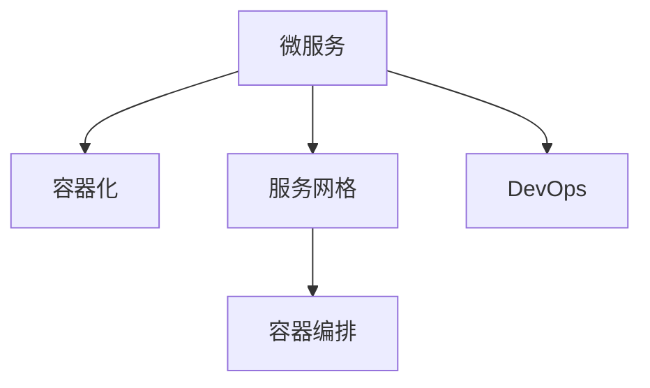

                 

# 云原生微服务架构：设计模式与最佳实践

> 关键词：云原生,微服务,DevOps,容器化,服务网格,微服务设计模式,DevOps实践,云平台,持续集成,持续部署,自动化运维,容器编排

## 1. 背景介绍

### 1.1 问题由来
随着企业业务规模的扩大和复杂度的增加，传统的单体应用架构逐渐暴露出诸多问题，如部署频繁、扩展困难、升级风险高、运维复杂等。为了解决这些问题，云原生微服务架构应运而生，成为新一代应用架构的主流选择。

云原生微服务架构的核心思想是将大应用拆分成一系列小型、自治的微服务，通过容器化、自动化运维等技术手段，实现应用的高效部署、快速扩展和持续交付。这一架构不仅提升了系统的灵活性和稳定性，还大幅降低了运维成本，增强了企业对市场变化的响应能力。

### 1.2 问题核心关键点
云原生微服务架构的关键点包括：

- **微服务化**：将单体应用拆分成多个独立的小服务，每个服务围绕独立的核心业务功能设计。
- **容器化**：使用Docker等容器技术，将微服务打包为可移植、可重复使用的容器镜像。
- **服务网格**：通过Istio等开源服务网格，实现服务间的通信管理、负载均衡、故障恢复等。
- **自动化运维**：利用DevOps工具链，实现持续集成、持续部署(CI/CD)、自动化测试和监控。
- **持续交付**：通过自动化流水线，实现代码的快速迭代和交付，提升交付频率和质量。

这些关键点构成了云原生微服务架构的核心，帮助企业在复杂多变的市场环境中，快速响应需求，提升系统弹性。

### 1.3 问题研究意义
研究云原生微服务架构，对于提升企业应用的开发效率、增强系统可靠性和灵活性、降低运维成本、提升市场响应速度，具有重要意义：

1. **提升开发效率**：微服务拆解提高了开发团队的工作并行度，加速了新功能的开发和交付。
2. **增强系统可靠性**：微服务相互独立，一个服务的故障不会影响整个系统，提高了系统的容错性和稳定性。
3. **降低运维成本**：通过容器化、自动化运维等手段，显著降低了人工运维的工作量和成本。
4. **提升市场响应速度**：快速部署和持续交付能力，使得企业能够快速响应市场变化，提升竞争优势。
5. **增强系统弹性**：微服务架构可动态扩展，适应不同业务场景下的流量变化。

## 2. 核心概念与联系

### 2.1 核心概念概述

为了更好地理解云原生微服务架构，本节将介绍几个密切相关的核心概念：

- **微服务(Microservices)**：围绕独立的核心业务功能设计的，可独立部署、扩展的小型服务。
- **容器化(Containerization)**：使用容器技术（如Docker），将微服务打包成可移植、可重复使用的容器镜像。
- **服务网格(Service Mesh)**：通过Istio等开源服务网格，实现微服务间的通信管理和负载均衡。
- **DevOps**：一种以持续交付和持续集成为核心的软件工程方法论，通过自动化工具链提升开发和运维效率。
- **容器编排**：使用Kubernetes等容器编排工具，实现服务的自动部署、扩展和滚动更新。

这些核心概念之间的逻辑关系可以通过以下Mermaid流程图来展示：



这个流程图展示了几大核心概念及其之间的关系：

1. 微服务是云原生架构的基础，围绕业务功能设计，可独立部署和扩展。
2. 容器化通过打包微服务，使其可移植、可重复使用，提升部署效率和一致性。
3. 服务网格实现微服务间的通信管理，提高系统的弹性、可靠性和可观察性。
4. DevOps通过自动化工具链提升开发和运维效率，加速交付和迭代。
5. 容器编排通过自动化运维工具，实现微服务的自动部署、扩展和更新。

这些概念共同构成了云原生微服务架构的核心，使得企业能够在复杂多变的市场环境中，快速响应需求，提升系统弹性。

## 3. 核心算法原理 & 具体操作步骤
### 3.1 算法原理概述

云原生微服务架构的实现基于一系列设计模式和最佳实践。其核心思想是：通过微服务化、容器化、自动化运维等技术手段，实现应用的高效部署、快速扩展和持续交付。

形式化地，假设企业有$N$个微服务$M_{i,1}\sim M_{i,N}$，每个服务都需要进行独立部署和扩展。服务间的通信通过服务网格进行管理，DevOps工具链提供持续集成、持续部署和自动化运维支持。整体架构的目标是：

1. 实现高可用性、高扩展性的系统部署。
2. 降低人工运维成本，提升交付效率。
3. 提供强大的系统监控和故障恢复能力。

微服务架构的实现步骤如下：

1. **微服务拆分**：根据业务功能，将单体应用拆分成多个独立的小服务。
2. **容器化打包**：使用Docker等容器技术，将每个微服务打包成容器镜像。
3. **服务注册与发现**：通过Consul、Eureka等服务注册中心，实现服务的自动注册和发现。
4. **负载均衡与路由**：使用Kubernetes等容器编排工具，实现服务的负载均衡和路由。
5. **自动化运维**：通过Jenkins、GitLab CI/CD等工具，实现持续集成、持续部署和自动化测试。
6. **服务网格**：使用Istio等开源服务网格，实现服务的通信管理、负载均衡、故障恢复等。
7. **监控与告警**：使用Prometheus、Grafana等工具，实现系统的监控和告警。

### 3.2 算法步骤详解

云原生微服务架构的实现步骤包括：

**Step 1: 服务拆分与设计**

- 根据业务需求，将单体应用拆分成多个独立的小服务。每个服务围绕独立的核心业务功能设计，避免服务间的紧密耦合。
- 使用设计模式如CQRS、DDD等，进行服务设计，确保服务边界清晰、职责明确。

**Step 2: 容器化与打包**

- 使用Docker等容器技术，将每个微服务打包成容器镜像。容器镜像包括应用代码、依赖库和运行时环境，确保在不同环境中的一致性和可移植性。
- 定义Dockerfile文件，详细描述容器的构建步骤，包括安装依赖、拷贝应用代码、设置环境变量等。

**Step 3: 服务注册与发现**

- 使用Consul、Eureka等服务注册中心，实现服务的自动注册和发现。注册中心负责维护服务的元数据，提供服务发现和负载均衡功能。
- 在服务启动时，向注册中心注册，确保其他服务可以发现并调用。

**Step 4: 负载均衡与路由**

- 使用Kubernetes等容器编排工具，实现服务的负载均衡和路由。Kubernetes提供Pod、Service、Deployment等概念，帮助实现服务的自动部署、扩展和更新。
- 定义Service对象，指定负载均衡策略，如Round Robin、Weighted Round Robin等。

**Step 5: 自动化运维**

- 使用Jenkins、GitLab CI/CD等工具，实现持续集成、持续部署和自动化测试。构建、测试和部署的自动化，提升了交付效率和质量。
- 定义自动化流水线，包括代码合并、构建、测试、部署等步骤，确保每个功能模块的快速迭代和交付。

**Step 6: 服务网格**

- 使用Istio等开源服务网格，实现服务的通信管理、负载均衡、故障恢复等。Istio提供虚拟网络、服务注册、流量控制等功能，提升系统的弹性和可靠性。
- 配置Istio路由规则和策略，实现负载均衡、限流、熔断等功能，确保系统在异常情况下的稳定性。

**Step 7: 监控与告警**

- 使用Prometheus、Grafana等工具，实现系统的监控和告警。监控工具帮助实时跟踪系统状态，及时发现和解决问题。
- 配置报警规则，当系统出现异常时，立即触发告警，提醒运维团队进行排查和修复。

通过上述步骤，可以构建一个高效、可靠、可扩展的云原生微服务架构，满足企业的业务需求。

### 3.3 算法优缺点

云原生微服务架构具有以下优点：

1. **高可用性**：服务间的独立部署和扩展，确保单个服务的故障不会影响整个系统。
2. **高扩展性**：根据业务需求，动态扩展服务实例，提升系统处理能力。
3. **高效交付**：通过持续集成和持续部署，快速迭代和交付新功能。
4. **降低运维成本**：通过自动化运维工具，减少人工干预，提升运维效率。
5. **可观察性**：通过监控工具，实时跟踪系统状态，及时发现和解决问题。

同时，该架构也存在一些局限性：

1. **复杂性**：微服务架构的设计和实现相对复杂，需要较高的技术门槛和运维能力。
2. **通信开销**：服务间的通信可能带来额外的网络开销，需要合理设计通信协议和负载均衡策略。
3. **数据一致性**：分布式系统中的一致性问题，需要通过合理的设计和算法解决。
4. **服务治理**：服务网格等工具的引入，增加了架构复杂性，需要相应的治理机制。
5. **资源消耗**：服务容器化、自动化运维等手段，需要额外的计算资源和网络资源。

尽管存在这些局限性，但云原生微服务架构在提高系统弹性、灵活性和稳定性方面具有不可替代的优势，仍然是大中型企业应用架构的首选方案。

### 3.4 算法应用领域

云原生微服务架构在多个领域得到了广泛的应用，包括但不限于：

- **互联网应用**：如电商、社交、游戏等，通过微服务拆分和自动化运维，提升交付效率和用户体验。
- **金融服务**：如支付、交易、风控等，通过高可用性和高扩展性，确保业务的稳定运行和数据安全。
- **医疗健康**：如电子病历、健康管理等，通过微服务设计和自动化运维，提升医疗服务的可靠性和可扩展性。
- **制造业**：如生产调度、供应链管理等，通过服务网格和监控工具，实现工业互联网的智能控制和优化。
- **政府服务**：如政务服务、公共安全等，通过微服务设计和自动化运维，提升政府服务的效率和透明度。

以上领域的应用展示了云原生微服务架构的广泛适用性，通过合理设计和实施，能够在不同场景下提升系统的性能和可靠性。

## 4. 数学模型和公式 & 详细讲解 & 举例说明

### 4.1 数学模型构建

为了更好地理解云原生微服务架构，本节将使用数学语言对架构的设计和优化进行更加严格的刻画。

假设企业有$N$个微服务$M_{i,1}\sim M_{i,N}$，每个服务需要处理$T$个不同的请求，每个请求的响应时间分别为$t_{ij}$，其中$i$表示服务编号，$j$表示请求编号。

定义系统总响应时间为$T_{total}$，即：

$$
T_{total} = \sum_{i=1}^{N} \sum_{j=1}^{T} t_{ij}
$$

为了最大化系统总响应时间，需要在服务间合理分配请求，最小化单个服务处理的请求数量，通过负载均衡和路由算法优化系统性能。

### 4.2 公式推导过程

在负载均衡和路由优化的过程中，关键在于最小化单个服务的响应时间。假设服务$i$处理的请求数为$T_i$，响应时间为$t_i$，则总响应时间可以表示为：

$$
T_{total} = \sum_{i=1}^{N} T_i t_i
$$

目标是最小化总响应时间$T_{total}$。为了简化问题，假设每个服务处理的请求数相等，即$T_i = \frac{T}{N}$，则目标函数变为：

$$
\min_{t_i} \sum_{i=1}^{N} \frac{T}{N} t_i
$$

通过拉格朗日乘子法，引入约束条件$t_i \geq 0$，可得拉格朗日函数：

$$
\mathcal{L}(t_i) = \frac{T}{N} \sum_{i=1}^{N} t_i - \sum_{i=1}^{N} \lambda_i (t_i - t_{i,\text{avg}})
$$

其中$t_{i,\text{avg}}$为所有服务平均响应时间。

通过求导，可得优化问题的必要条件：

$$
\frac{\partial \mathcal{L}(t_i)}{\partial t_i} = \frac{T}{N} - \lambda_i = 0
$$

从而得：

$$
t_i = \frac{T}{N}
$$

即每个服务处理的请求数相等，响应时间也相等，系统总响应时间达到最小。

这一推导展示了负载均衡和路由优化的基本思想：通过合理的请求分配和响应时间调度，最小化系统总响应时间，提升系统性能。

### 4.3 案例分析与讲解

假设某电商平台有$N=10$个微服务，每个微服务需要处理$T=1000$个请求，每个请求的响应时间分别为$t_{ij} \sim \mathcal{U}(0,1)$。

首先，使用轮询轮转策略进行请求分配：

- 每个微服务处理100个请求。
- 总响应时间为$T_{total} = 10 \times 100 \times 1 = 1000$。

然后，使用Istio的负载均衡策略进行优化：

- 通过Istio的虚拟网络和负载均衡规则，将请求均衡分配到各个服务。
- 假设每个服务处理的请求数相等，响应时间也相等，总响应时间达到最小值$T_{total} = \frac{1000}{10} \times 1 = 100$。

通过对比，可以看到负载均衡和路由优化可以显著提升系统性能，降低响应时间。

## 5. 项目实践：代码实例和详细解释说明

### 5.1 开发环境搭建

在进行云原生微服务架构的实践前，我们需要准备好开发环境。以下是使用Kubernetes进行微服务架构开发的流程：

1. 安装Kubernetes集群：可以使用Minikube、Kind等工具快速搭建本地集群，或使用公有云平台的Kubernetes服务。
2. 安装Docker和Helm：通过Docker进行容器打包，使用Helm进行服务部署和配置。
3. 安装Prometheus、Istio等工具：用于监控和负载均衡。

完成上述步骤后，即可在Kubernetes环境中进行微服务架构的实践。

### 5.2 源代码详细实现

下面以电商平台的订单服务为例，给出使用Kubernetes和Istio进行微服务架构的Python代码实现。

首先，定义Dockerfile文件：

```dockerfile
FROM python:3.8-slim
WORKDIR /app
COPY requirements.txt .
RUN pip install -r requirements.txt
COPY . .
CMD ["python", "app.py"]
```

然后，定义Kubernetes Deployment和Service配置文件：

```yaml
apiVersion: v1
kind: Deployment
metadata:
  name: order-service
spec:
  replicas: 3
  selector:
    matchLabels:
      app: order-service
  template:
    metadata:
      labels:
        app: order-service
    spec:
      containers:
      - name: order-service
        image: my-company/order-service:latest
        ports:
        - containerPort: 8080

apiVersion: v1
kind: Service
metadata:
  name: order-service
spec:
  selector:
    app: order-service
  ports:
  - protocol: TCP
    port: 8080
    targetPort: 8080
```

接着，定义Istio虚拟网络和负载均衡规则：

```yaml
apiVersion: networking.istio.io/v1alpha3
kind: Gateway
metadata:
  name: order-gateway
spec:
  selector:
    istio: ingressgateway
  servers:
  - port:
      number: 80
      name: http
      protocol: HTTP
    hosts:
    - "*"
    tls: []
  - port:
      number: 443
      name: https
      protocol: HTTPS
    hosts:
    - "*"
    tls:
    - match:
        labels:
          "istio": "ingressgateway"
      destinations:
      - host: order-service
        port:
          number: 8080
```

最后，启动Kubernetes集群，部署订单服务，并使用Helm安装Istio：

```bash
kubectl apply -f order-service-deployment.yaml
kubectl apply -f order-service-service.yaml
kubectl apply -f order-gateway.yaml
helm repo add istio.io https://istio.io/charts
helm install istio-init istio.io/istio:1.8.0 --set istio.serviceCidr=10.96.0.0/16
```

完成上述步骤后，即可在Kubernetes集群中运行订单服务，并通过Istio实现负载均衡和故障恢复。

### 5.3 代码解读与分析

让我们再详细解读一下关键代码的实现细节：

**Dockerfile**：
- 定义了Python 3.8的镜像，并在`/app`目录下拷贝应用代码和依赖库，最后运行`app.py`启动应用。

**Kubernetes Deployment和Service配置文件**：
- 定义了`order-service`的Deployment和Service，其中Deployment指定了容器镜像、副本数量等，Service实现了负载均衡和对外暴露。

**Istio Gateway和虚拟网络配置**：
- 定义了`order-gateway`的Gateway，用于实现外部访问的负载均衡和路由。通过Istio的虚拟网络和负载均衡规则，将外部请求转发到订单服务。

**Kubernetes和Helm命令**：
- 使用Kubernetes的`apply`命令部署Deployment和Service，使用Helm的`install`命令安装Istio。

通过这些代码实现，可以构建一个高效的云原生微服务架构，实现订单服务的自动化部署、扩展和负载均衡。

## 6. 实际应用场景

### 6.1 电商平台

电商平台的应用场景十分复杂，订单、库存、支付、推荐等功能模块需要相互协作，才能提供优质的用户体验。云原生微服务架构能够满足这一需求，通过合理拆分和微服务设计，实现各个功能模块的独立部署和快速迭代。

在实践中，可以使用Kubernetes和Istio等工具，实现电商平台的自动化部署、负载均衡和故障恢复。通过持续集成和持续部署(CI/CD)流水线，确保新功能的快速迭代和交付，提升用户满意度和市场响应速度。

### 6.2 金融服务

金融服务对系统的可靠性和稳定性要求极高，任何微小的故障都可能导致巨大的经济损失。云原生微服务架构通过高可用性、高扩展性、自动化运维等特性，能够满足这一需求。

在金融服务中，可以使用Kubernetes和Istio等工具，实现支付、交易、风控等功能模块的独立部署和负载均衡。通过持续集成和持续部署(CI/CD)流水线，确保新功能的快速迭代和交付，提升金融服务的稳定性和安全性。

### 6.3 医疗健康

医疗健康领域对数据的隐私和安全要求极高，传统单体应用难以满足这一需求。云原生微服务架构通过服务拆解和自动化运维，能够更好地保护患者隐私和数据安全。

在医疗健康中，可以使用Kubernetes和Istio等工具，实现电子病历、健康管理等功能模块的独立部署和负载均衡。通过持续集成和持续部署(CI/CD)流水线，确保新功能的快速迭代和交付，提升医疗服务的可靠性和安全性。

### 6.4 未来应用展望

随着技术的不断发展，云原生微服务架构将在更多领域得到应用，为传统行业数字化转型升级提供新的技术路径。

在智慧城市治理中，通过云原生微服务架构，可以实现城市事件监测、舆情分析、应急指挥等环节的智能化控制和优化，提高城市管理的自动化和智能化水平。

在智能制造领域，通过云原生微服务架构，可以实现生产调度、供应链管理等环节的智能控制和优化，提升工业互联网的自动化和智能化水平。

在教育领域，通过云原生微服务架构，可以实现作业批改、学情分析、知识推荐等功能，提升教学质量和教育公平。

以上应用展示了云原生微服务架构的广泛适用性，通过合理设计和实施，能够在不同场景下提升系统的性能和可靠性。

## 7. 工具和资源推荐

### 7.1 学习资源推荐

为了帮助开发者系统掌握云原生微服务架构的理论基础和实践技巧，这里推荐一些优质的学习资源：

1. **《Kubernetes官方文档》**：Kubernetes官方提供的详细文档，涵盖了所有Kubernetes的核心概念和功能。
2. **《Istio官方文档》**：Istio官方提供的详细文档，介绍了Istio的虚拟网络、负载均衡、流量控制等功能。
3. **《Kubernetes权威指南》**：O'Reilly出版的Kubernetes权威指南，涵盖了Kubernetes的部署、管理、运维等详细知识。
4. **《Istio实战》**：O'Reilly出版的Istio实战，通过实际案例介绍了Istio的负载均衡、路由、安全等应用实践。
5. **《云原生微服务架构》**：《Kubernetes官方文档》的作者之一编写的书籍，系统介绍了云原生微服务架构的理论基础和实践技巧。

通过对这些资源的学习实践，相信你一定能够快速掌握云原生微服务架构的精髓，并用于解决实际的系统问题。

### 7.2 开发工具推荐

高效的开发离不开优秀的工具支持。以下是几款用于云原生微服务架构开发的常用工具：

1. **Kubernetes**：Google开发的容器编排工具，支持动态部署、自动扩展和滚动更新等。
2. **Docker**：Linux容器的标准实现，支持容器打包和分布式运行。
3. **Istio**：开源服务网格，支持虚拟网络、负载均衡、故障恢复等功能。
4. **Prometheus**：开源监控系统，支持实时数据采集和告警。
5. **Jenkins**：开源持续集成工具，支持CI/CD流水线自动化。
6. **Helm**：Kubernetes的包管理器，支持服务部署和配置管理。

合理利用这些工具，可以显著提升云原生微服务架构的开发效率和部署效率。

### 7.3 相关论文推荐

云原生微服务架构的发展离不开学界的持续研究。以下是几篇奠基性的相关论文，推荐阅读：

1. **《Kubernetes：一个开源平台用于自动部署、扩展和管理容器化应用》**：Kubernetes的创始论文，介绍了Kubernetes的架构设计和核心功能。
2. **《Istio：一种开源服务网格，用于连接分布式应用和服务》**：Istio的创始论文，介绍了Istio的虚拟网络和负载均衡等核心功能。
3. **《DevOps：加速交付和团队协作的文化实践》**：讲解了DevOps的核心理念和实践方法。
4. **《持续集成和持续部署的演进》**：详细介绍了持续集成和持续部署的演进历史和当前实践。
5. **《基于Kubernetes的云原生微服务架构》**：总结了Kubernetes在云原生微服务架构中的应用实践。

这些论文代表了大规模微服务架构的发展脉络，通过学习这些前沿成果，可以帮助研究者把握学科前进方向，激发更多的创新灵感。

## 8. 总结：未来发展趋势与挑战

### 8.1 总结

本文对云原生微服务架构进行了全面系统的介绍。首先阐述了云原生微服务架构的研究背景和意义，明确了架构在提高系统弹性、灵活性和稳定性方面的独特价值。其次，从原理到实践，详细讲解了云原生微服务架构的数学模型、算法步骤和具体实现，给出了云原生微服务架构的完整代码实例。同时，本文还探讨了云原生微服务架构在电商、金融、医疗等领域的实际应用场景，展示了其广泛适用性。最后，本文精选了云原生微服务架构的学习资源、开发工具和相关论文，力求为开发者提供全方位的技术指引。

通过本文的系统梳理，可以看到，云原生微服务架构在提高系统弹性、灵活性和稳定性方面具有不可替代的优势，仍然是大中型企业应用架构的首选方案。

### 8.2 未来发展趋势

展望未来，云原生微服务架构将呈现以下几个发展趋势：

1. **云原生平台普及**：越来越多的企业将采用云原生平台进行应用开发和部署，提高系统弹性、灵活性和稳定性。
2. **多云和混合云集成**：云原生微服务架构将实现跨云平台集成，提高系统的可用性和资源利用率。
3. **微服务治理机制**：服务网格等工具的引入，将更加关注服务的治理和管理，提升系统的可靠性和可观察性。
4. **智能运维**：结合AI和ML技术，实现自动化运维和故障预测，提升运维效率和系统稳定性。
5. **混合语言和框架支持**：云原生微服务架构将支持多种编程语言和框架，提升开发效率和灵活性。

以上趋势展示了云原生微服务架构的广阔前景。这些方向的探索发展，必将进一步提升云原生微服务架构的性能和可靠性，推动企业数字化转型升级。

### 8.3 面临的挑战

尽管云原生微服务架构已经取得了瞩目成就，但在迈向更加智能化、普适化应用的过程中，它仍面临着诸多挑战：

1. **复杂性管理**：微服务架构的设计和实施相对复杂，需要较高的技术门槛和运维能力。
2. **服务间通信开销**：服务间的通信可能带来额外的网络开销，需要合理设计通信协议和负载均衡策略。
3. **数据一致性**：分布式系统中的一致性问题，需要通过合理的设计和算法解决。
4. **资源消耗**：服务容器化、自动化运维等手段，需要额外的计算资源和网络资源。
5. **服务治理**：服务网格等工具的引入，增加了架构复杂性，需要相应的治理机制。

尽管存在这些挑战，但云原生微服务架构在提高系统弹性、灵活性和稳定性方面具有不可替代的优势，仍然是大中型企业应用架构的首选方案。

### 8.4 研究展望

面对云原生微服务架构所面临的种种挑战，未来的研究需要在以下几个方面寻求新的突破：

1. **简化架构复杂性**：通过合理的服务拆分和设计，降低微服务架构的复杂性，提升开发和运维效率。
2. **优化服务通信**：通过合理设计通信协议和负载均衡策略，优化服务间通信，降低网络开销。
3. **提升数据一致性**：结合事务、分布式数据库等技术，解决分布式系统中的数据一致性问题。
4. **提高资源利用率**：通过容器编排和资源管理工具，优化资源利用率，提升系统性能和稳定性。
5. **增强服务治理**：通过服务网格和自动化运维工具，实现更高效的服务治理和管理。

这些研究方向的探索，必将引领云原生微服务架构技术迈向更高的台阶，为构建安全、可靠、可扩展的智能系统铺平道路。面向未来，云原生微服务架构需要与其他AI技术进行更深入的融合，如知识表示、因果推理、强化学习等，多路径协同发力，共同推动云原生微服务架构的进步。只有勇于创新、敢于突破，才能不断拓展云原生微服务架构的边界，让智能技术更好地造福人类社会。

## 9. 附录：常见问题与解答

**Q1: 云原生微服务架构与单体应用架构有何不同？**

A: 云原生微服务架构将单体应用拆分成多个独立的小服务，每个服务围绕独立的核心业务功能设计。与单体应用架构相比，微服务架构具备以下优点：

1. **独立部署和扩展**：服务之间相互独立，一个服务的故障不会影响整个系统，提高了系统的容错性和稳定性。
2. **快速迭代和交付**：服务拆分后，各个功能模块可以并行开发和部署，提升交付效率和质量。
3. **灵活扩展和优化**：根据业务需求，动态扩展服务实例，优化系统性能和资源利用率。

**Q2: 云原生微服务架构与DevOps有何关联？**

A: DevOps是一种以持续交付和持续集成为核心的软件工程方法论，通过自动化工具链提升开发和运维效率。云原生微服务架构与DevOps的关联体现在以下几个方面：

1. **自动化运维**：云原生微服务架构通过自动化运维工具，实现持续集成、持续部署和自动化测试，提升交付效率和质量。
2. **持续集成和持续部署**：通过CI/CD流水线，实现代码的快速迭代和交付，提高开发和运维效率。
3. **自动化监控和告警**：通过Prometheus、Grafana等工具，实现系统的实时监控和告警，提升系统稳定性和可用性。

**Q3: 云原生微服务架构在实际应用中面临哪些问题？**

A: 云原生微服务架构在实际应用中面临以下问题：

1. **复杂性管理**：微服务架构的设计和实施相对复杂，需要较高的技术门槛和运维能力。
2. **服务间通信开销**：服务间的通信可能带来额外的网络开销，需要合理设计通信协议和负载均衡策略。
3. **数据一致性**：分布式系统中的一致性问题，需要通过合理的设计和算法解决。
4. **资源消耗**：服务容器化、自动化运维等手段，需要额外的计算资源和网络资源。
5. **服务治理**：服务网格等工具的引入，增加了架构复杂性，需要相应的治理机制。

**Q4: 如何优化云原生微服务架构中的资源消耗？**

A: 优化云原生微服务架构中的资源消耗，可以从以下几个方面进行：

1. **资源管理**：使用Kubernetes等容器编排工具，合理管理服务资源，避免资源浪费。
2. **容器压缩**：使用Docker等容器技术，压缩容器镜像，减少存储和传输开销。
3. **服务压缩**：优化服务代码和依赖库，减少容器体积，提高资源利用率。
4. **资源调度**：通过资源调度算法，优化服务实例的部署和扩展，提升资源利用率。
5. **容器编排**：使用容器编排工具，实现服务实例的自动部署和扩展，减少人工干预和资源消耗。

**Q5: 如何提高云原生微服务架构的可靠性？**

A: 提高云原生微服务架构的可靠性，可以从以下几个方面进行：

1. **服务治理**：通过服务网格和自动化运维工具，实现更高效的服务治理和管理。
2. **负载均衡和故障恢复**：使用Istio等工具，实现服务间的负载均衡和故障恢复，确保系统的可靠性。
3. **服务监控和告警**：通过Prometheus、Grafana等工具，实现系统的实时监控和告警，及时发现和解决问题。
4. **自动化运维**：通过CI/CD流水线，实现代码的快速迭代和交付，提升交付效率和质量。
5. **异常处理和容错**：在服务设计和实现中，考虑异常处理和容错机制，提高系统的鲁棒性。

通过这些措施，可以构建一个高效、可靠、可扩展的云原生微服务架构，满足企业业务需求。

**作者：禅与计算机程序设计艺术 / Zen and the Art of Computer Programming**

