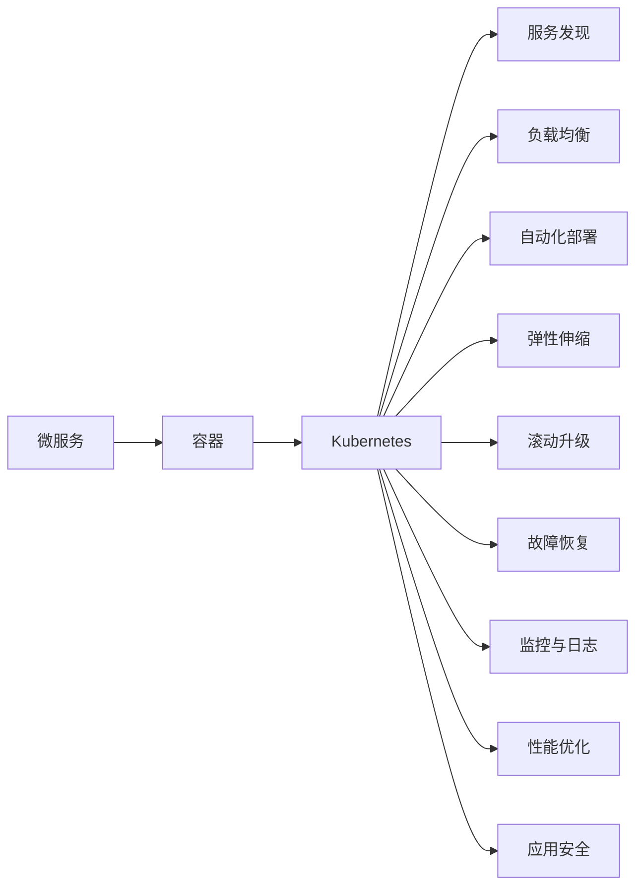

                 

# 云原生架构：微服务、容器与Kubernetes

> 关键词：云原生, 微服务, 容器, Kubernetes, DevOps, 分布式系统, 持续集成, 弹性计算

## 1. 背景介绍

在互联网技术的驱动下，企业的业务模式不断创新和演进，从单体应用向微服务架构转变，为应对快速变化的市场需求，企业需要构建灵活、弹性、自动化的系统架构。云计算的崛起为这种转变提供了强有力的技术支撑，其中云原生技术成为了构建现代应用体系架构的关键。云原生架构将传统单体应用解耦为一系列细粒度、独立运行的服务，并通过容器化和编排技术实现自动化管理和部署，极大地提高了系统的可扩展性、可维护性和可靠性。

本文将深入探讨云原生架构中的微服务、容器与Kubernetes技术，全面解析其核心概念、原理、实现和应用，帮助读者理解和应用这些先进的技术理念，构建高效、可靠、可持续的云原生应用。

## 2. 核心概念与联系

### 2.1 核心概念概述

云原生架构的核心组件包括微服务、容器和Kubernetes，它们之间通过彼此的协同工作，共同构建了一个高效的分布式系统框架。

- **微服务**：微服务架构是一种将应用程序拆分成一系列小而独立的、可维护的模块化服务的设计模式。每个服务独立运行、自治更新，通过接口通信实现协作，提升了系统的可扩展性、弹性与开发效率。

- **容器**：容器是一种轻量级的、可移植、可扩展的执行环境，它将应用及其依赖打包在一个统一的隔离单元中，确保了应用的独立运行和跨平台兼容性。

- **Kubernetes**：Kubernetes是一种开源的容器编排平台，提供自动化部署、扩展、管理、监控等功能，支持容器化的应用以高可用性、弹性伸缩的方式运行在集群中。

### 2.2 核心概念原理和架构的 Mermaid 流程图



这个图表展示了微服务、容器与Kubernetes之间的联系和协同作用。微服务通过容器化部署和Kubernetes的编排管理，实现了服务的独立运行和自动化部署、扩展。Kubernetes进一步通过服务发现、负载均衡、弹性伸缩、滚动升级、故障恢复、监控与日志、性能优化和应用安全等功能，确保了微服务架构的健壮性和可靠性。

## 3. 核心算法原理 & 具体操作步骤

### 3.1 算法原理概述

云原生架构的关键在于通过微服务、容器和Kubernetes等技术实现应用的模块化、自动化和弹性化。其核心思想是将大系统拆分为小服务，通过容器化封装，结合Kubernetes进行自动化部署、扩展和管理，从而实现系统的高度可扩展性、高可用性和高效运维。

### 3.2 算法步骤详解

#### 3.2.1 微服务架构设计

1. **服务拆分**：根据业务功能和数据独立性，将大系统拆分为多个小服务。每个服务负责特定的业务功能或数据，服务间通过接口通信协作。

2. **服务治理**：设计服务注册、发现和路由机制，确保服务的动态更新和故障恢复。使用API Gateway实现统一的接口管理和负载均衡。

3. **数据管理**：针对不同服务的数据需求，设计数据分层、分区、备份和恢复策略，确保数据的一致性和可靠性。

#### 3.2.2 容器化部署

1. **构建镜像**：使用Docker等工具构建应用及其依赖的容器镜像，确保应用在任意环境中的一致性和可移植性。

2. **编排管理**：使用Kubernetes等容器编排平台，定义应用的部署、扩展和回收策略，实现容器化的应用自动化管理和调度。

3. **服务集成**：通过Kubernetes的Service和Ingress资源实现服务发现和负载均衡，确保服务的稳定性和高可用性。

#### 3.2.3 Kubernetes编排管理

1. **集群搭建**：在公有云或私有云上搭建Kubernetes集群，配置节点、存储和网络资源，确保集群的高可用性和安全性。

2. **部署配置**：定义应用的Deployment和Service资源，设置应用的副本数、资源限制、健康检查和滚动升级策略，确保应用的稳定性和扩展性。

3. **监控与报警**：配置监控和报警机制，使用Prometheus和Grafana等工具实时监控集群的运行状态和应用性能，及时发现和解决问题。

### 3.3 算法优缺点

#### 3.3.1 优点

- **高可用性和容错性**：通过容器化部署和Kubernetes的自动化管理，确保应用的高可用性和容错性，避免单点故障。

- **弹性伸缩**：Kubernetes的动态扩展机制可以根据负载自动调整服务的副本数，确保系统的可扩展性和资源利用率。

- **自动化运维**：通过Kubernetes的自动化部署、扩展和回收机制，大大简化了应用的运维工作，提高了开发效率和系统稳定性。

- **跨平台兼容性**：容器化技术实现了应用的跨平台兼容性，可以在各种环境中部署和运行，提高了应用的适应性和可移植性。

#### 3.3.2 缺点

- **学习成本高**：微服务、容器和Kubernetes等技术较新，需要投入大量时间和精力进行学习和实践。

- **复杂性高**：微服务架构的拆分和集成增加了系统的复杂性，需要团队具备丰富的经验和专业知识。

- **开发成本高**：微服务架构需要投入大量精力进行设计和实现，初期开发成本较高。

## 4. 数学模型和公式 & 详细讲解

### 4.1 数学模型构建

在云原生架构中，微服务、容器和Kubernetes的运行和调度需要依赖于数学模型和算法，例如资源分配算法、负载均衡算法、滚动升级算法等。这些模型和算法通过数学公式描述和优化，以确保系统的性能和可靠性。

### 4.2 公式推导过程

以Kubernetes中的滚动升级算法为例，假设系统中有N个相同的服务实例，每个实例的运行时间不超过T，升级前的服务可用时间为U，升级期间的服务不可用时间为D，则升级后的总可用时间C可以通过以下公式计算：

$$
C = N \times T + U - N \times D
$$

### 4.3 案例分析与讲解

假设系统中有3个服务实例，每个实例的运行时间不超过4小时，升级前的服务可用时间为24小时，升级期间的服务不可用时间为1小时。则升级后的总可用时间为：

$$
C = 3 \times 4 + 24 - 3 \times 1 = 39 \text{小时}
$$

这个案例展示了Kubernetes滚动升级算法如何通过数学公式计算升级后的总可用时间，优化系统的高可用性和用户体验。

## 5. 项目实践：代码实例和详细解释说明

### 5.1 开发环境搭建

1. **安装Docker**：在所有需要运行容器的机器上安装Docker，并配置网络插件。

```bash
sudo apt update
sudo apt install -y \
    apt-transport-https \
    ca-certificates \
    curl \
    software-properties-common
curl -fsSL https://download.docker.com/linux/debian/gpg | sudo apt-key add -
sudo add-apt-repository \
    "deb [arch=amd64] https://download.docker.com/linux/debian \
    $(lsb_release -cs) \
    stable"
sudo apt update
sudo apt install -y docker-ce docker-ce-cli containerd.io
sudo systemctl enable docker
sudo systemctl start docker
```

2. **安装Kubernetes**：在Kubernetes集群的所有节点上安装kubectl和kubelet。

```bash
sudo apt install -y kubectl
```

3. **安装Kubernetes集群**：使用Minikube或kubeadm等工具在本地搭建Kubernetes集群。

```bash
minikube start --cpus 4 --memory 8g
kubectl get nodes
kubectl get pods --all-namespaces
```

### 5.2 源代码详细实现

下面以使用Docker和Kubernetes部署Nginx为例，展示微服务架构的实践。

1. **构建Docker镜像**：编写Dockerfile，构建Nginx镜像。

```dockerfile
FROM nginx:1.22
COPY www/ /usr/share/nginx/html
EXPOSE 80
```

2. **发布Nginx服务**：使用Kubernetes的Deployment和Service资源发布Nginx服务。

```yaml
apiVersion: apps/v1
kind: Deployment
metadata:
  name: nginx
spec:
  replicas: 3
  selector:
    matchLabels:
      app: nginx
  template:
    metadata:
      labels:
        app: nginx
    spec:
      containers:
      - name: nginx
        image: nginx:1.22
        ports:
        - containerPort: 80
---

apiVersion: v1
kind: Service
metadata:
  name: nginx
spec:
  selector:
    app: nginx
  ports:
    - protocol: TCP
      port: 80
      targetPort: 80
```

3. **测试Nginx服务**：使用kubectl命令测试Nginx服务。

```bash
kubectl apply -f deployment.yaml
kubectl apply -f service.yaml
kubectl get deploy
kubectl get pods
kubectl get svc
kubectl get endpoints
kubectl logs $(pod_name)
```

### 5.3 代码解读与分析

1. **Dockerfile**：定义了Nginx的镜像构建步骤，包括基础镜像选择、文件拷贝、暴露端口等。

2. **Deployment**：定义了Nginx服务的部署策略，指定副本数、标签选择器、模板等。

3. **Service**：定义了Nginx服务的访问策略，指定选择器、端口映射等。

4. **kubectl命令**：通过kubectl命令部署、查看和管理Nginx服务，包括Deployment、Pod、Service和Endpoints等资源。

### 5.4 运行结果展示

通过上述步骤，Nginx服务被成功部署到Kubernetes集群中，并通过Service资源暴露到集群外部，可以使用浏览器访问。

```bash
kubectl get svc nginx
curl http://127.0.0.1
```

## 6. 实际应用场景

### 6.1 电商网站

电商网站通常面临大量的并发访问和高可用性要求，通过微服务架构和Kubernetes集群，可以轻松实现服务的快速部署、弹性伸缩和故障恢复。例如，可以使用微服务实现用户管理、商品管理、订单管理等模块，通过Kubernetes实现服务的自动部署、负载均衡和监控告警。

### 6.2 金融交易平台

金融交易平台需要高可用性、低延迟和高吞吐量的系统架构。通过微服务架构和Kubernetes集群，可以实现服务的细粒度拆分和自动化管理，确保交易系统的稳定性和可靠性。例如，可以使用微服务实现交易引擎、数据处理、风控审核等模块，通过Kubernetes实现服务的自动扩展、负载均衡和故障转移。

### 6.3 物联网应用

物联网应用通常具有异构、分布式和动态变化的特点。通过微服务架构和Kubernetes集群，可以实现服务的模块化和自动化管理，提高系统的灵活性和可维护性。例如，可以使用微服务实现设备管理、数据采集、数据存储和应用服务，通过Kubernetes实现服务的自动部署、扩展和回收。

## 7. 工具和资源推荐

### 7.1 学习资源推荐

1. **《微服务架构》**：郑健著，详细讲解微服务架构的设计和实践，涵盖分布式系统、容错性、可扩展性等方面。

2. **《Kubernetes实战》**：王帅著，通过实践案例详细讲解Kubernetes的部署、扩展和管理，适合实战应用。

3. **《Docker实战》**：周志华著，详细讲解Docker的部署、管理、优化和安全，适合初学者入门。

4. **Kubernetes官网文档**：Kubernetes官方文档，包含详细的API、配置和使用指南，是学习Kubernetes的权威资源。

5. **Docker官方文档**：Docker官方文档，包含Docker的安装、使用和配置指南，是学习Docker的权威资源。

### 7.2 开发工具推荐

1. **Docker**：轻量级、高效、可移植的容器化解决方案，广泛应用于云原生架构的实践。

2. **Kubernetes**：开源的容器编排平台，提供自动化部署、扩展、管理、监控等功能，支持容器化的应用以高可用性、弹性伸缩的方式运行在集群中。

3. **Prometheus**：开源的监控系统，支持实时监控和告警，是Kubernetes监控和报警的常用工具。

4. **Grafana**：开源的仪表盘工具，支持可视化展示和告警配置，是Kubernetes监控和报警的常用工具。

### 7.3 相关论文推荐

1. **《微服务架构的挑战与未来》**：张铖著，详细讨论了微服务架构的设计、实现和未来发展趋势。

2. **《Kubernetes的分布式系统架构》**：顾志刚著，详细讲解了Kubernetes的分布式系统架构和关键技术。

3. **《Docker容器化技术的应用》**：刘东著，详细讲解了Docker容器化技术的应用和最佳实践。

## 8. 总结：未来发展趋势与挑战

### 8.1 研究成果总结

云原生架构已经从概念走向了实践，成为现代应用体系架构的主流选择。通过微服务、容器和Kubernetes等技术，实现了系统的模块化、自动化和弹性化，提升了系统的可扩展性、可维护性和可靠性。然而，云原生架构的实际应用还面临一些挑战，如学习成本高、复杂性高、开发成本高等。

### 8.2 未来发展趋势

未来云原生架构将向更高效、更智能、更可靠的方向发展。

1. **自动化的全面普及**：随着自动化工具和技术的成熟，更多的业务逻辑将自动化处理，减少人工干预，提升系统的效率和稳定性。

2. **微服务编排的自动化**：通过智能编排工具，自动优化服务的部署、扩展和故障恢复策略，实现更高效的服务管理。

3. **边缘计算的应用**：在物联网和移动应用场景中，边缘计算将实现更快速的数据处理和响应，提升系统的实时性和可靠性。

4. **AI与云原生的融合**：AI技术将与云原生架构深度融合，实现更智能化的系统设计和运维。

### 8.3 面临的挑战

尽管云原生架构带来了诸多优势，但在实际应用中仍面临一些挑战。

1. **学习成本高**：云原生架构涉及众多新技术，需要团队具备丰富的经验和专业知识。

2. **复杂性高**：微服务架构的拆分和集成增加了系统的复杂性，需要团队具备更高的设计能力和维护能力。

3. **开发成本高**：微服务架构需要投入大量精力进行设计和实现，初期开发成本较高。

### 8.4 研究展望

未来的研究将在以下几个方面寻求新的突破。

1. **自动化工具的优化**：进一步优化自动化工具的功能和性能，减少人工干预，提升系统的效率和稳定性。

2. **微服务编排的智能化**：通过智能编排工具，自动优化服务的部署、扩展和故障恢复策略，实现更高效的服务管理。

3. **边缘计算的深度应用**：在物联网和移动应用场景中，深入研究边缘计算技术，实现更快速的数据处理和响应。

4. **AI与云原生的深度融合**：进一步研究AI技术与云原生架构的深度融合，实现更智能化的系统设计和运维。

## 9. 附录：常见问题与解答

### Q1：云原生架构的优势有哪些？

A：云原生架构的优势包括：

- **高可用性和容错性**：通过容器化部署和Kubernetes的自动化管理，确保应用的高可用性和容错性，避免单点故障。

- **弹性伸缩**：Kubernetes的动态扩展机制可以根据负载自动调整服务的副本数，确保系统的可扩展性和资源利用率。

- **自动化运维**：通过Kubernetes的自动化部署、扩展和回收机制，大大简化了应用的运维工作，提高了开发效率和系统稳定性。

- **跨平台兼容性**：容器化技术实现了应用的跨平台兼容性，可以在各种环境中部署和运行，提高了应用的适应性和可移植性。

### Q2：微服务架构的拆分和集成有哪些原则？

A：微服务架构的拆分和集成有以下原则：

- **单一职责原则**：每个微服务应该只负责单一的业务功能或数据。

- **高内聚低耦合原则**：每个微服务内部逻辑应该紧密耦合，不同服务之间尽可能解耦。

- **自包含原则**：每个微服务应该包含所有实现逻辑和依赖，无需依赖外部服务。

- **轻量级通信原则**：服务之间通过轻量级通信协议（如HTTP/REST、gRPC等）进行通信，避免使用重服务。

### Q3：Kubernetes的自动扩展机制如何实现？

A：Kubernetes的自动扩展机制通过Horizontal Pod Autoscaler（HPA）实现。HPA根据CPU或内存的使用情况自动调整Pod的数量，确保应用在高负载下仍能保持稳定的性能。例如，配置HPA如下：

```yaml
apiVersion: v1
kind: HorizontalPodAutoscaler
metadata:
  name: nginx-hpa
spec:
  scaleTargetRef:
    apiVersion: apps/v1
    kind: Deployment
    name: nginx
  minReplicas: 1
  maxReplicas: 10
  targetCPUUtilizationPercentage: 0.5
```

### Q4：Docker镜像的构建和部署流程有哪些？

A：Docker镜像的构建和部署流程包括：

- **构建镜像**：编写Dockerfile，使用docker build命令构建镜像。

- **发布镜像**：将构建好的镜像推送到Docker Hub或私有镜像仓库。

- **部署镜像**：使用kubectl命令部署镜像，配置Deployment和Service资源。

- **测试镜像**：使用kubectl命令测试Deployment和Service资源，确保镜像正常运行。

例如：

```bash
docker build -t nginx .
docker push nginx:1.22
kubectl apply -f deployment.yaml
kubectl get deploy
kubectl get pod
```

### Q5：云原生架构有哪些最佳实践？

A：云原生架构的最佳实践包括：

- **容器化开发**：在开发过程中使用Docker进行容器化打包，确保应用在任意环境中的一致性和可移植性。

- **微服务设计**：合理拆分业务逻辑，设计轻量级、自治、高内聚的服务，避免服务间的紧密耦合。

- **Kubernetes部署**：使用Kubernetes进行服务的自动化部署、扩展和管理，确保服务的稳定性和高可用性。

- **监控与报警**：配置Prometheus和Grafana进行监控和报警，实时监控系统的运行状态和性能指标，及时发现和解决问题。

- **自动化流水线**：构建CI/CD流水线，实现代码的自动化构建、测试和部署，提升开发效率和系统稳定性。

以上是云原生架构的全面解析，相信通过深入学习和实践，您能够理解和应用这些先进的技术理念，构建高效、可靠、可持续的云原生应用。

