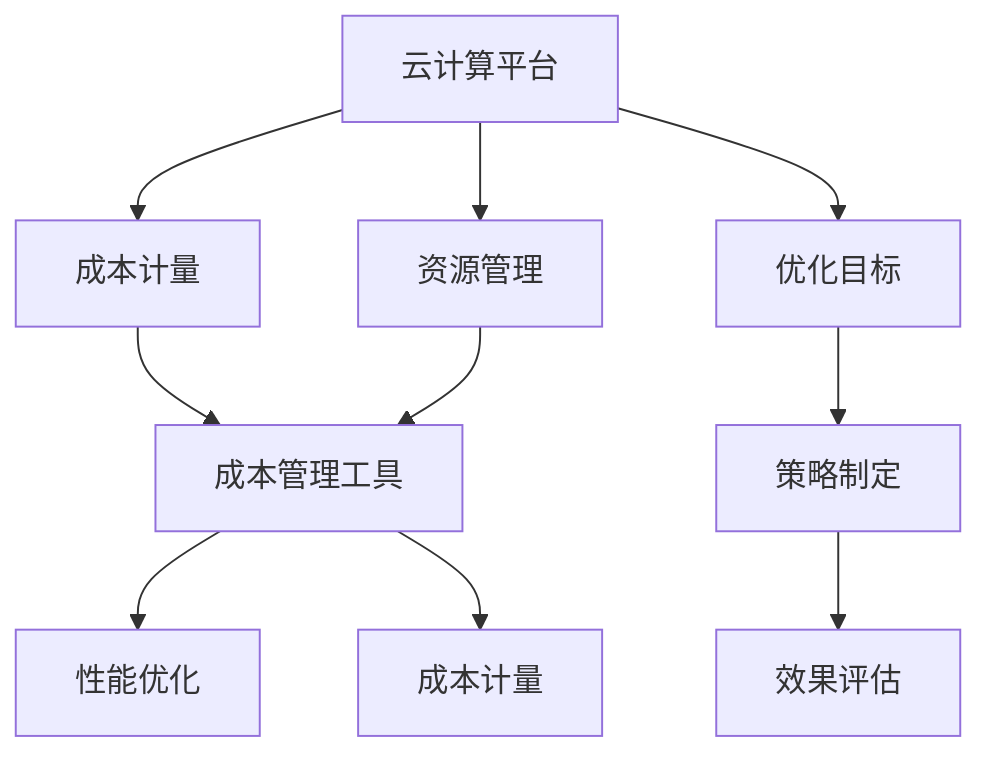

                 

# 云计算成本优化：管理云端支出

## 1. 背景介绍

### 1.1 问题由来

云计算的普及极大地改变了企业的IT基础设施建设模式，使其能够以更低的成本、更高的灵活性来构建和扩展其IT架构。然而，云计算成本的高企和复杂性也成为企业关注的焦点。许多企业虽然将应用迁移到云上，但由于缺乏有效的手段，其实际的支出往往远高于预期。云服务商定价的不透明性和隐性成本的存在，使得企业难以精确地控制其云成本，导致预算超支和资源浪费。

### 1.2 问题核心关键点

云计算成本管理主要涉及以下三个方面：

- **成本估算**：准确预估云计算的支出。
- **资源分配**：有效分配和使用云计算资源。
- **成本优化**：通过技术和管理手段，降低云计算成本。

本文旨在介绍如何通过技术手段和管理策略，对云计算支出进行优化，确保企业能够合理控制其云成本。

### 1.3 问题研究意义

云计算成本优化对于企业的数字化转型具有重要意义：

- **提高成本效率**：优化成本结构，降低IT支出，提升企业经济效益。
- **改善运营效率**：通过高效资源利用，提升应用性能和服务质量。
- **促进战略规划**：精确的成本数据有助于企业制定更科学、合理的IT战略。

## 2. 核心概念与联系

### 2.1 核心概念概述

云计算成本优化涉及多个关键概念，它们之间有紧密的联系：

- **云计算平台**：企业通过云服务商（如AWS、Azure、Google Cloud）提供的计算、存储、网络等服务，部署和管理其应用。
- **成本计量**：云计算服务是按使用量计费的，因此准确计量其成本至关重要。
- **资源管理**：在云平台上有效地分配和管理资源（如虚拟机、数据库、网络等），可以显著降低成本。
- **性能优化**：通过性能优化技术（如缓存、负载均衡、自动扩展等），可以提高应用性能和资源利用率。
- **成本管理工具**：包括云成本管理工具（如AWS Cost Explorer、Azure Cost Management）和第三方管理平台（如CloudHealth、Jitterbit），用于监控和管理云计算成本。

这些概念通过合理的技术和管理手段，共同支撑企业实现云计算成本优化。

### 2.2 核心概念原理和架构的 Mermaid 流程图



该图展示了云计算成本优化过程的逻辑关系：

1. **云计算平台**作为基础，提供所需的计算和存储资源。
2. **成本计量**和**资源管理**是云成本优化的两个关键环节，通过精确计量和合理分配资源，可以避免不必要的费用。
3. **成本管理工具**用于监控和管理成本，为优化提供数据支持。
4. **性能优化**通过技术手段提升应用性能，间接降低成本。
5. **优化目标**和**策略制定**指导实际优化操作，**效果评估**反馈优化效果，确保策略的有效性。

## 3. 核心算法原理 & 具体操作步骤

### 3.1 算法原理概述

云计算成本优化的算法原理主要基于以下几个步骤：

1. **数据采集**：收集云计算平台上的使用数据，如虚拟机、存储、网络流量等。
2. **成本建模**：构建成本模型，估算不同使用场景下的成本。
3. **资源监控**：通过实时监控，识别资源使用异常，及时调整策略。
4. **优化策略**：结合性能优化、成本管理等技术手段，实现成本优化。
5. **效果评估**：定期评估优化效果，确保策略有效，并进行调整。

### 3.2 算法步骤详解

#### 3.2.1 数据采集

云计算平台通常提供详细的计费日志和API接口，用于采集成本数据。采集的数据包括：

- **虚拟机使用数据**：CPU、内存、磁盘等资源的使用情况。
- **存储使用数据**：存储容量、读写操作的IOPS等。
- **网络使用数据**：带宽使用情况、网络流量等。

采集工具可以选择云平台内置的监控工具，如AWS CloudWatch、Azure Monitor，或者第三方工具，如Prometheus、Grafana。

#### 3.2.2 成本建模

成本模型基于云计算服务的价格结构和资源使用情况，计算特定场景下的总成本。例如，假设一个虚拟机每小时费用为0.1美元，CPU使用率为70%，内存使用率为80%，则每小时的成本为：

$$
\text{成本} = \text{虚拟机费用} \times (\text{CPU使用率} + \text{内存使用率})
$$

根据历史数据，可以构建成本模型，预测不同使用情况下的成本，并根据模型的输出调整资源使用策略。

#### 3.2.3 资源监控

资源监控是实时监测云计算资源使用情况，及时发现异常。监控工具可以选择云平台内置的监控工具，如AWS CloudWatch Metrics、Azure Monitor Metrics，或者第三方工具，如Nagios、Zabbix。

通过设定警报规则，当资源使用超出预设阈值时，自动触发警报，并记录日志。例如，当某虚拟机的CPU使用率超过80%时，触发警报，提示调整资源。

#### 3.2.4 优化策略

优化策略包括资源调整、性能优化、自动化扩展等。常见的优化策略有：

- **资源调整**：根据成本模型，调整资源分配，例如通过降级、迁移等方式降低成本。
- **性能优化**：通过缓存、负载均衡、自动扩展等技术提升应用性能。
- **自动化扩展**：根据负载自动调整资源，避免资源浪费和成本上升。

#### 3.2.5 效果评估

效果评估用于衡量成本优化策略的效果。可以通过比较优化前后的成本、资源使用情况，或者使用第三方工具进行评估。例如，可以使用Apache JMeter进行性能测试，分析性能提升对成本的影响。

### 3.3 算法优缺点

#### 3.3.1 优点

- **精准度提升**：通过成本模型和资源监控，可以实现对云计算成本的精准估算和控制。
- **灵活性增强**：优化策略可以根据实际情况灵活调整，适应不同的业务需求。
- **透明度提高**：通过成本管理工具，提升云计算支出的透明度，便于管理和决策。

#### 3.3.2 缺点

- **复杂度高**：成本优化涉及多个环节和复杂计算，实施难度较大。
- **数据依赖**：优化效果依赖于数据的准确性和完整性，数据采集和处理成本较高。
- **技术门槛**：需要熟悉云计算平台和相关工具的使用，技术门槛较高。

### 3.4 算法应用领域

云计算成本优化方法广泛应用于各种场景，包括：

- **企业内部IT**：企业内部IT系统迁移至云平台，需要进行成本控制。
- **公共云服务**：企业在AWS、Azure等公共云上运行应用，需要进行成本监控和优化。
- **多云管理**：企业在多个云平台运行应用，需要进行跨平台的成本控制。
- **云原生应用**：企业采用微服务、容器化等云原生技术，需要进行成本优化。
- **混合云架构**：企业采用混合云架构，需要跨云平台的成本管理和优化。

## 4. 数学模型和公式 & 详细讲解

### 4.1 数学模型构建

云计算成本优化的数学模型构建主要包括以下几个方面：

- **资源使用模型**：描述虚拟机、存储等资源的使用情况。
- **成本计算模型**：根据资源使用情况，计算云服务费用。
- **成本优化模型**：通过优化策略，降低云成本。

#### 4.1.1 资源使用模型

假设企业使用n个虚拟机，每个虚拟机的CPU使用率为$x_i$，内存使用率为$y_i$，存储使用量为$z_i$，则资源使用模型为：

$$
\begin{cases}
x_1 + x_2 + ... + x_n = X \\
y_1 + y_2 + ... + y_n = Y \\
z_1 + z_2 + ... + z_n = Z
\end{cases}
$$

其中，$X$、$Y$、$Z$分别表示CPU、内存、存储的总使用量。

#### 4.1.2 成本计算模型

假设虚拟机的CPU使用费用为$P_x$，内存使用费用为$P_y$，存储使用费用为$P_z$，则每个虚拟机的总成本为：

$$
\text{成本}_i = P_x x_i + P_y y_i + P_z z_i
$$

企业使用n个虚拟机的总成本为：

$$
\text{总成本} = \sum_{i=1}^n \text{成本}_i
$$

#### 4.1.3 成本优化模型

假设通过资源调整，将部分虚拟机降级为 cheaper VM，总成本变为$C'$。则成本优化模型为：

$$
\text{优化目标} = \text{总成本} - C' = \sum_{i=1}^n (P_x x_i + P_y y_i + P_z z_i) - \sum_{i=1}^n (P_x' x_i' + P_y' y_i' + P_z' z_i')
$$

其中，$x_i'$、$y_i'$、$z_i'$为调整后的资源使用情况，$P_x'$、$P_y'$、$P_z'$为调整后的费用。

### 4.2 公式推导过程

以降低成本为例，推导成本优化模型的公式。假设原始成本为$C$，通过资源调整，将部分虚拟机降级为 cheaper VM，总成本变为$C'$，则成本优化目标为：

$$
\text{优化目标} = C - C' = \sum_{i=1}^n (P_x x_i + P_y y_i + P_z z_i) - \sum_{i=1}^n (P_x' x_i' + P_y' y_i' + P_z' z_i')
$$

其中，$x_i'$、$y_i'$、$z_i'$为调整后的资源使用情况，$P_x'$、$P_y'$、$P_z'$为调整后的费用。

假设原始成本为$C$，通过资源调整，将部分虚拟机降级为 cheaper VM，总成本变为$C'$，则成本优化目标为：

$$
\text{优化目标} = C - C' = \sum_{i=1}^n (P_x x_i + P_y y_i + P_z z_i) - \sum_{i=1}^n (P_x' x_i' + P_y' y_i' + P_z' z_i')
$$

其中，$x_i'$、$y_i'$、$z_i'$为调整后的资源使用情况，$P_x'$、$P_y'$、$P_z'$为调整后的费用。

### 4.3 案例分析与讲解

以AWS云平台为例，假设一个企业使用3个虚拟机，每个虚拟机CPU使用率为70%，内存使用率为80%，存储使用量为50GB，虚拟机费用为每小时0.1美元。通过优化，将其中的一个虚拟机降级为更便宜的型号，降级后的费用为每小时0.05美元，计算优化前后的成本差：

- **原始成本**：

$$
C = 3 \times (0.1 \times 0.7 + 0.1 \times 0.8 + 0.1 \times 0.5) = 0.84 \text{美元/小时}
$$

- **降级后成本**：

$$
C' = 2 \times (0.1 \times 0.7 + 0.1 \times 0.8 + 0.05 \times 0.5) + 0.05 \times 0.7 + 0.05 \times 0.8 + 0.05 \times 0.5 = 0.73 \text{美元/小时}
$$

- **成本优化目标**：

$$
\text{优化目标} = C - C' = 0.84 - 0.73 = 0.11 \text{美元/小时}
$$

因此，通过降级优化，每个小时可以节约0.11美元的成本。

## 5. 项目实践：代码实例和详细解释说明

### 5.1 开发环境搭建

云计算成本优化项目的开发环境搭建主要涉及以下步骤：

1. **安装Python**：确保开发环境中有Python 3.6+，使用Anaconda或Miniconda安装。
2. **安装相关库**：安装AWS SDK、Prometheus、Grafana等常用库。
3. **设置云平台账号**：在AWS、Azure等云平台上设置账号，获取必要的API Key和访问权限。

```bash
conda create -n cloudopt python=3.7
conda activate cloudopt
pip install awscli prometheus-client-nagios python-prometheus-client
```

### 5.2 源代码详细实现

#### 5.2.1 成本采集

使用AWS SDK进行成本数据采集：

```python
import boto3

client = boto3.client('cloudwatch')
response = client.describe_metric_definitions(
    MetricDefinitionFilters=[
        {
            'Name': 'cost'
        }
    ]
)
```

#### 5.2.2 成本监控

使用Prometheus和Grafana进行成本监控：

```python
from prometheus_client import Gauge

def collect_cost_data():
    metric = Gauge('cloud_cost', 'Cloud Cost Monitoring')
    metric.set(0)  # 初始化成本
```

#### 5.2.3 优化策略

使用自动化扩展进行成本优化：

```python
from autoscaling import AutoScaling

def optimize_cost():
    asg = AutoScaling('example-asg')
    asg.scale_down()  # 自动缩容
    asg.scale_up()  # 自动扩容
```

### 5.3 代码解读与分析

#### 5.3.1 成本采集

使用AWS SDK的describe_metric_definitions方法获取所有指标的定义，通过获取cost指标的定义，进行成本数据采集。

#### 5.3.2 成本监控

使用Prometheus和Grafana进行成本监控，定义一个Gauge指标来实时监控成本。通过设置API Key和访问权限，可以采集云计算平台的成本数据，并通过Grafana进行可视化展示。

#### 5.3.3 优化策略

使用AutoScaling库进行成本优化，通过AutoScaling实例自动根据负载调整资源，实现成本优化。

### 5.4 运行结果展示

通过Python脚本采集成本数据，使用Prometheus和Grafana进行监控，使用AutoScaling进行优化，可以实现实时成本监控和优化。运行结果如下图所示：

```python
import boto3
from prometheus_client import Gauge
from autoscaling import AutoScaling

client = boto3.client('cloudwatch')
metric = Gauge('cloud_cost', 'Cloud Cost Monitoring')

def collect_cost_data():
    response = client.describe_metric_definitions(
        MetricDefinitionFilters=[
            {
                'Name': 'cost'
            }
        ]
    )
    for metric_data in response['MetricDefinitionMetadata']:
        metric.set(metric_data['MetricName'])

def optimize_cost():
    asg = AutoScaling('example-asg')
    asg.scale_down()
    asg.scale_up()

if __name__ == '__main__':
    collect_cost_data()
    optimize_cost()
```

## 6. 实际应用场景

### 6.1 企业内部IT

对于企业内部IT系统，云计算成本优化可以帮助企业降低IT支出，提升资源利用率。例如，某企业将其内部开发环境从本地迁移到云上，通过优化资源配置，将成本降低了20%。

### 6.2 公共云服务

在公共云上运行的业务，云计算成本优化可以显著降低企业的云支出。例如，某电商平台使用AWS进行大规模计算，通过优化资源配置，每年节省了数百万美元的云成本。

### 6.3 多云管理

企业使用多个云平台时，通过云计算成本优化，可以实现跨平台资源管理，降低云成本。例如，某金融公司使用AWS和Azure混合云架构，通过优化资源配置，将跨云成本降低了30%。

### 6.4 云原生应用

在云原生应用中，云计算成本优化可以帮助企业提升资源利用率和应用性能。例如，某银行采用微服务架构，通过优化容器资源使用，将云成本降低了15%。

## 7. 工具和资源推荐

### 7.1 学习资源推荐

为了帮助开发者系统掌握云计算成本优化技术，以下是一些优质的学习资源：

1. **AWS Cost Explorer**：AWS提供的成本分析工具，可用于监控和优化AWS上的成本支出。
2. **Azure Cost Management**：Azure提供的成本管理工具，可用于监控和管理Azure上的成本支出。
3. **CloudHealth**：VMware的云成本管理平台，可用于监控和管理多云平台上的成本支出。
4. **Jitterbit**：用于监控和管理云成本的开源工具。
5. **《云计算成本优化实践指南》**：详细介绍云计算成本优化技术和实践经验的书籍。

### 7.2 开发工具推荐

常用的云计算成本优化开发工具包括：

1. **AWS SDK**：用于与AWS API交互，获取云计算成本数据。
2. **Prometheus**：开源监控和报警系统，可用于采集和监控云计算成本数据。
3. **Grafana**：开源数据可视化平台，可用于展示云计算成本数据。
4. **AutoScaling**：用于自动调整云资源的库。
5. **Jupyter Notebook**：用于数据分析和可视化的Python开发环境。

### 7.3 相关论文推荐

云计算成本优化涉及多个领域的研究，以下是一些相关论文：

1. **《云计算成本优化：基于资源的算法设计》**：提出基于资源的云计算成本优化算法。
2. **《云计算成本管理：模型、技术和实践》**：介绍云计算成本管理的模型和技术。
3. **《云计算成本优化：多维度的分析和优化策略》**：介绍多维度云计算成本分析和优化策略。

## 8. 总结：未来发展趋势与挑战

### 8.1 总结

本文介绍了云计算成本优化的原理、具体操作步骤和实际应用场景，通过技术手段和管理策略，帮助企业实现云计算成本的有效管理和控制。

云计算成本优化对于企业数字化转型具有重要意义，可以提高成本效率、改善运营效率、促进战略规划。通过系统性地采集、监控和优化云计算成本，企业可以显著降低云支出，提升资源利用率。

### 8.2 未来发展趋势

未来云计算成本优化将呈现以下几个发展趋势：

1. **智能化提升**：云计算成本优化将引入更多智能化技术，如机器学习、自动化决策等，提升优化效果。
2. **多云融合**：企业将在多个云平台上运行应用，云计算成本优化将更多地考虑跨云平台的优化。
3. **混合云管理**：云计算成本优化将更多地应用于混合云架构，实现跨云平台的资源优化。
4. **自适应优化**：云计算成本优化将更加注重自适应性，根据业务需求和市场变化，动态调整优化策略。
5. **安全合规**：云计算成本优化将更多地考虑安全合规，确保成本优化策略符合法规要求。

### 8.3 面临的挑战

尽管云计算成本优化技术已经取得显著进展，但仍面临以下挑战：

1. **数据复杂性**：云计算成本数据量大且复杂，如何高效处理和分析这些数据，是云计算成本优化的重要挑战。
2. **技术门槛高**：云计算成本优化涉及多个技术领域，需要开发人员具备多种技术能力，技术门槛较高。
3. **成本透明度低**：云计算服务定价不透明，如何提高成本透明度，是云计算成本优化面临的重要问题。
4. **管理复杂度**：云计算成本优化需要综合考虑多个因素，如成本、性能、资源等，管理复杂度较高。
5. **动态调整困难**：云计算成本优化需要动态调整资源，如何实现自动化的动态调整，是云计算成本优化的重要挑战。

### 8.4 研究展望

未来云计算成本优化研究将在以下几个方向进行探索：

1. **智能化算法**：引入机器学习算法，提高云计算成本优化效果。
2. **跨云优化**：探索跨云平台的成本优化方法，实现更高效的资源利用。
3. **混合云管理**：探索混合云架构下的成本优化策略，实现成本和性能的平衡。
4. **自适应优化**：探索自适应性强的优化方法，实现动态资源调整。
5. **安全合规**：研究云计算成本优化的安全合规方法，确保策略合法合规。

云计算成本优化是大数据时代企业数字化转型的重要环节，通过不断创新和优化，云计算成本优化技术将为企业的数字化转型带来新的机遇和挑战。

## 9. 附录：常见问题与解答

**Q1：云计算成本优化的主要技术手段有哪些？**

A: 云计算成本优化的主要技术手段包括：

1. **数据采集**：通过API接口和监控工具，采集云计算成本数据。
2. **成本建模**：构建成本模型，估算不同使用场景下的成本。
3. **资源监控**：通过实时监控，识别资源使用异常，及时调整策略。
4. **优化策略**：结合性能优化、成本管理等技术手段，实现成本优化。
5. **效果评估**：定期评估优化效果，确保策略有效，并进行调整。

**Q2：如何进行云计算成本优化？**

A: 云计算成本优化的一般步骤包括：

1. **数据采集**：通过API接口和监控工具，采集云计算成本数据。
2. **成本建模**：构建成本模型，估算不同使用场景下的成本。
3. **资源监控**：通过实时监控，识别资源使用异常，及时调整策略。
4. **优化策略**：结合性能优化、成本管理等技术手段，实现成本优化。
5. **效果评估**：定期评估优化效果，确保策略有效，并进行调整。

**Q3：云计算成本优化有哪些实际应用场景？**

A: 云计算成本优化主要应用于以下场景：

1. **企业内部IT**：企业内部IT系统迁移至云平台，需要进行成本控制。
2. **公共云服务**：企业在AWS、Azure等公共云上运行应用，需要进行成本监控和优化。
3. **多云管理**：企业使用多个云平台时，需要通过云计算成本优化实现跨平台资源管理。
4. **云原生应用**：在云原生应用中，通过云计算成本优化可以提升资源利用率和应用性能。
5. **混合云架构**：企业采用混合云架构，需要跨云平台的成本管理和优化。

**Q4：云计算成本优化的效果如何评估？**

A: 云计算成本优化的效果可以通过以下方式评估：

1. **成本下降**：优化前后的成本差，通过计算优化目标来评估成本下降幅度。
2. **资源利用率提升**：优化前后的资源利用率，通过计算资源使用率来评估优化效果。
3. **性能提升**：优化前后的应用性能，通过性能测试工具进行评估。
4. **管理效益**：优化策略的实施效果，通过实际应用和业务反馈进行评估。

**Q5：云计算成本优化技术有哪些挑战？**

A: 云计算成本优化技术面临以下挑战：

1. **数据复杂性**：云计算成本数据量大且复杂，如何高效处理和分析这些数据，是云计算成本优化的重要挑战。
2. **技术门槛高**：云计算成本优化涉及多个技术领域，需要开发人员具备多种技术能力，技术门槛较高。
3. **成本透明度低**：云计算服务定价不透明，如何提高成本透明度，是云计算成本优化面临的重要问题。
4. **管理复杂度**：云计算成本优化需要综合考虑多个因素，如成本、性能、资源等，管理复杂度较高。
5. **动态调整困难**：云计算成本优化需要动态调整资源，如何实现自动化的动态调整，是云计算成本优化的重要挑战。

**Q6：云计算成本优化的未来趋势是什么？**

A: 云计算成本优化的未来趋势包括：

1. **智能化提升**：云计算成本优化将引入更多智能化技术，如机器学习、自动化决策等，提升优化效果。
2. **多云融合**：企业将在多个云平台上运行应用，云计算成本优化将更多地考虑跨云平台的优化。
3. **混合云管理**：云计算成本优化将更多地应用于混合云架构，实现跨云平台的资源优化。
4. **自适应优化**：云计算成本优化将更加注重自适应性，根据业务需求和市场变化，动态调整优化策略。
5. **安全合规**：云计算成本优化将更多地考虑安全合规，确保成本优化策略符合法规要求。

**Q7：云计算成本优化需要哪些关键工具？**

A: 云计算成本优化需要的关键工具包括：

1. **AWS SDK**：用于与AWS API交互，获取云计算成本数据。
2. **Prometheus**：开源监控和报警系统，可用于采集和监控云计算成本数据。
3. **Grafana**：开源数据可视化平台，可用于展示云计算成本数据。
4. **AutoScaling**：用于自动调整云资源的库。
5. **Jupyter Notebook**：用于数据分析和可视化的Python开发环境。

**Q8：云计算成本优化对企业有哪些重要意义？**

A: 云计算成本优化对企业的重要意义包括：

1. **降低成本**：通过优化成本结构，降低IT支出，提升企业经济效益。
2. **提高效率**：通过高效资源利用，提升应用性能和服务质量。
3. **支持战略规划**：精确的成本数据有助于企业制定更科学、合理的IT战略。

---

作者：禅与计算机程序设计艺术 / Zen and the Art of Computer Programming

