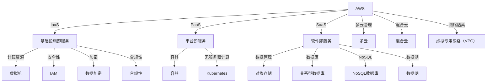

                 

# 云计算技术：AWS、Azure和GCP平台比较

在当今数字化的时代，云计算已经成为企业基础设施的核心组成部分，为企业提供了弹性的计算资源和强大的数据管理能力。AWS、Azure和Google Cloud Platform（GCP）作为全球三大主要的云计算提供商，它们各自拥有不同的特点、优势和适用场景。本文将详细比较这三个平台，以帮助读者更好地选择适合自己需求的云计算服务。

## 1. 背景介绍

### 1.1 云计算概述

云计算是一种基于互联网的计算模式，通过在远程数据中心提供计算、存储、网络和应用服务，用户可以按需获取资源，无需传统方式下本地资源的投资和维护。云计算按服务模式分为三类：基础设施即服务（IaaS）、平台即服务（PaaS）和软件即服务（SaaS）。AWS、Azure和GCP均提供完整的云计算服务栈，能够满足企业不同的需求。

### 1.2 主要云服务提供商

AWS（Amazon Web Services）、Azure（Microsoft Azure）和GCP（Google Cloud Platform）是目前全球最大的云计算服务提供商，它们在云计算技术、产品线和市场占有率等方面都表现出色。

- **AWS**：由亚马逊公司提供，全球市场份额最高，服务种类最丰富，创新能力强。
- **Azure**：由微软公司提供，面向企业级市场，提供广泛的集成能力，与微软产品生态系统深度融合。
- **GCP**：由谷歌公司提供，以人工智能、机器学习和大数据分析见长，数据处理能力强大。

## 2. 核心概念与联系

### 2.1 核心概念概述

为了更好地理解AWS、Azure和GCP之间的差异和联系，我们将通过几个核心概念进行阐述：

- **云服务模型**：IaaS、PaaS和SaaS。
- **服务架构**：单区域、多区域、混合云和多云。
- **计算资源**：虚拟机（VM）、容器（Container）和无服务器计算。
- **数据管理**：对象存储、关系型数据库、NoSQL数据库和数据湖。
- **安全性**：网络隔离、身份和访问管理（IAM）、加密和合规性。
- **成本控制**：预留实例、成本管理工具和定价模型。

通过这些核心概念，我们可以深入理解AWS、Azure和GCP各自的特点和优势。

### 2.2 Mermaid流程图

以下是一个简化的Mermaid流程图，展示了AWS、Azure和GCP之间的核心概念和联系：



通过这个流程图，我们可以看到AWS、Azure和GCP在服务模型、计算资源、数据管理、安全性和多云管理等方面的联系和区别。

## 3. 核心算法原理 & 具体操作步骤

### 3.1 算法原理概述

AWS、Azure和GCP在云服务模型的底层算法原理上有很多共通之处，但也有一些差异。以下是它们的算法原理概述：

- **IaaS**：通过API提供计算、存储和网络资源，用户自行管理。
- **PaaS**：提供应用程序运行环境，如数据库、中间件和框架等，用户只需关注应用程序。
- **SaaS**：完全托管的应用程序，用户通过浏览器访问，无需安装或配置。

### 3.2 算法步骤详解

以下是AWS、Azure和GCP在不同云服务模型中的具体操作步骤：

#### 3.2.1 IaaS

**AWS**：
1. 创建虚拟机（VM）实例。
2. 安装操作系统和应用程序。
3. 配置网络和存储资源。
4. 监控和管理资源性能。

**Azure**：
1. 创建虚拟机（VM）实例。
2. 配置操作系统和应用程序。
3. 设置网络和存储资源。
4. 监控和管理资源性能。

**GCP**：
1. 创建虚拟机（VM）实例。
2. 安装操作系统和应用程序。
3. 配置网络和存储资源。
4. 监控和管理资源性能。

#### 3.2.2 PaaS

**AWS**：
1. 部署应用程序至Elastic Beanstalk。
2. 配置应用程序环境。
3. 管理数据库和中间件。
4. 监控应用程序性能。

**Azure**：
1. 部署应用程序至App Service。
2. 配置应用程序环境。
3. 管理数据库和中间件。
4. 监控应用程序性能。

**GCP**：
1. 部署应用程序至App Engine。
2. 配置应用程序环境。
3. 管理数据库和中间件。
4. 监控应用程序性能。

#### 3.2.3 SaaS

**AWS**：
1. 使用SaaS服务，如Amazon RDS、S3等。
2. 配置数据存储和访问权限。
3. 监控数据存储性能。

**Azure**：
1. 使用SaaS服务，如Azure SQL Database、Blob Storage等。
2. 配置数据存储和访问权限。
3. 监控数据存储性能。

**GCP**：
1. 使用SaaS服务，如Google Cloud SQL、Cloud Storage等。
2. 配置数据存储和访问权限。
3. 监控数据存储性能。

### 3.3 算法优缺点

#### AWS

**优点**：
1. 服务种类丰富，支持多云和混合云。
2. 全球基础设施覆盖广泛，性能可靠。
3. 生态系统活跃，社区支持强。

**缺点**：
1. 定价模型复杂，难以预测成本。
2. 数据传输费用较高。

#### Azure

**优点**：
1. 与微软产品生态系统深度集成，集成能力强。
2. 提供了混合云和边缘计算服务。
3. 安全性和合规性保障能力强。

**缺点**：
1. 服务种类相对较少，部分服务仅在Azure上可用。
2. 管理界面复杂，学习曲线较陡。

#### GCP

**优点**：
1. 数据处理能力强大，适合大数据和机器学习应用。
2. 数据管理工具丰富，支持多种数据存储和处理方案。
3. 自动化程度高，支持多种DevOps工具。

**缺点**：
1. 全球基础设施覆盖不足，部分地区服务质量较差。
2. 服务种类较少，部分功能需要付费。

### 3.4 算法应用领域

AWS、Azure和GCP各自在不同应用领域都有其优势：

#### AWS

1. **Web应用**：适合需要高可用性和全球覆盖的应用。
2. **大数据**：适合处理大规模数据，提供强大的数据存储和处理能力。
3. **机器学习**：提供丰富的机器学习服务和工具。
4. **物联网**：提供物联网设备和数据管理服务。

#### Azure

1. **企业级应用**：适合大型企业和行业解决方案。
2. **混合云**：适合混合云和边缘计算需求。
3. **数据集成**：适合集成大量微软内部和第三方应用。
4. **安全性和合规性**：适合对安全和合规性要求高的应用。

#### GCP

1. **数据处理和分析**：适合需要强大数据处理能力的应用。
2. **机器学习和大数据**：适合需要高级数据处理和分析能力的应用。
3. **自动化和DevOps**：适合需要高度自动化和DevOps流程的应用。
4. **云计算原生应用**：适合利用云计算原生功能和工具的应用。

## 4. 数学模型和公式 & 详细讲解 & 举例说明

### 4.1 数学模型构建

在云计算领域，常常需要建立数学模型来预测服务成本和性能。例如，可以使用排队论模型来预测云服务器的响应时间和资源利用率，使用线性规划模型来优化云计算资源配置。

**排队论模型**：

设云服务器数量为 $N$，每个请求平均处理时间为 $T$，请求到达速率为 $\lambda$，则系统平均排队长度为：

$$
L = \frac{\lambda T}{1-\frac{\lambda T}{N}}
$$

**线性规划模型**：

假设云服务提供商需要分配资源 $x_1,x_2,\ldots,x_n$ 来满足不同服务的资源需求 $a_1,a_2,\ldots,a_n$，成本为 $c_1,c_2,\ldots,c_n$，目标最小化总成本，则线性规划模型为：

$$
\min \sum_{i=1}^n c_i x_i
$$

约束条件为：

$$
\begin{cases}
a_1 x_1 + a_2 x_2 + \ldots + a_n x_n \geq \sum_{i=1}^n a_i \\
x_i \geq 0, i=1,2,\ldots,n
\end{cases}
$$

### 4.2 公式推导过程

#### 排队论模型推导

设云服务器数量为 $N$，每个请求平均处理时间为 $T$，请求到达速率为 $\lambda$，则系统平均排队长度为：

1. 设 $X$ 为请求到达间隔时间，其概率密度函数为 $f_X(t) = \lambda e^{-\lambda t}, t \geq 0$。
2. 请求到达时间间隔期望为 $1/\lambda$，故 $E(X) = 1/\lambda$。
3. 请求到达时间间隔的方差为 $1/\lambda^2$，故 $Var(X) = 1/\lambda^2$。
4. 请求到达时间间隔的累积分布函数为 $F_X(t) = 1-e^{-\lambda t}, t \geq 0$。
5. 请求到达时间为 $X + W$，其中 $W$ 为服务器响应时间，其概率密度函数为 $f_W(t) = 1/T e^{-t/T}, t \geq 0$。
6. 请求到达时间为 $Y = X + W$，其概率密度函数为 $f_Y(t) = \frac{\lambda}{T} e^{-\lambda t} e^{-t/T}, t \geq 0$。
7. 系统平均排队长度为 $L = E(Y) = E(X + W) = \frac{\lambda T}{1-\frac{\lambda T}{N}}$。

#### 线性规划模型推导

线性规划模型为：

1. 目标函数：$\min \sum_{i=1}^n c_i x_i$。
2. 约束条件：$a_1 x_1 + a_2 x_2 + \ldots + a_n x_n \geq \sum_{i=1}^n a_i$，$x_i \geq 0$。
3. 引入松弛变量 $z_1,z_2,\ldots,z_n \geq 0$，修改约束条件为：$a_1 x_1 + a_2 x_2 + \ldots + a_n x_n + z_1 + z_2 + \ldots + z_n = \sum_{i=1}^n a_i$。
4. 目标函数：$\min \sum_{i=1}^n (c_i + z_i) x_i$。
5. 引入非负约束：$z_i \geq 0, i=1,2,\ldots,n$。
6. 求解优化问题：

$$
\begin{aligned}
\min & \quad \sum_{i=1}^n (c_i + z_i) x_i \\
\text{subject to} & \quad a_1 x_1 + a_2 x_2 + \ldots + a_n x_n + z_1 + z_2 + \ldots + z_n = \sum_{i=1}^n a_i \\
& \quad x_i \geq 0, i=1,2,\ldots,n \\
& \quad z_i \geq 0, i=1,2,\ldots,n
\end{aligned}
$$

### 4.3 案例分析与讲解

#### 案例1：AWS EC2实例选择

假设公司需要在AWS上部署一个Web应用，需要选择合适的EC2实例。假设成本为 $c_1=0.1$ 美元/小时，CPU为 $a_1=2$，内存为 $a_2=8$ GB，所需资源为 $x_1=1$ 台，$x_2=2$ 台，求解最优配置。

使用线性规划模型求解：

1. 目标函数：$\min 0.1 x_1 + 0.1 x_2$。
2. 约束条件：$2x_1 + 8x_2 \geq 10$，$x_1 \geq 0$，$x_2 \geq 0$。
3. 引入松弛变量 $z_1,z_2 \geq 0$，修改约束条件为：$2x_1 + 8x_2 + z_1 + z_2 = 10$。
4. 求解优化问题：

$$
\begin{aligned}
\min & \quad 0.1 x_1 + 0.1 x_2 \\
\text{subject to} & \quad 2x_1 + 8x_2 + z_1 + z_2 = 10 \\
& \quad x_1 \geq 0 \\
& \quad x_2 \geq 0 \\
& \quad z_1 \geq 0 \\
& \quad z_2 \geq 0
\end{aligned}
$$

通过求解，可得 $x_1=1$，$x_2=1$，$z_1=0$，$z_2=2$。因此，应选择 $x_1=1$ 台，$x_2=1$ 台，$z_1=0$，$z_2=2$，即 $2 \times 1 + 8 \times 1 + 0 + 2 = 10$。

## 5. 项目实践：代码实例和详细解释说明

### 5.1 开发环境搭建

#### 5.1.1 AWS

1. 注册AWS账号，安装AWS CLI。
2. 安装和配置Elastic Beanstalk。
3. 部署Web应用。

#### 5.1.2 Azure

1. 注册Azure账号，安装Azure CLI。
2. 安装和配置App Service。
3. 部署Web应用。

#### 5.1.3 GCP

1. 注册GCP账号，安装Google Cloud SDK。
2. 安装和配置App Engine。
3. 部署Web应用。

### 5.2 源代码详细实现

#### 5.2.1 AWS

```python
import boto3

# 创建EC2实例
ec2 = boto3.resource('ec2')
instance = ec2.create_instances(
    ImageId='ami-0abcdef1234567890',
    InstanceType='t2.micro',
    MinCount=1,
    MaxCount=1
)
```

#### 5.2.2 Azure

```python
from azure.identity import DefaultAzureCredential
from azure.mgmt.compute import ComputeManagementClient

# 创建虚拟机
credential = DefaultAzureCredential()
compute_client = ComputeManagementClient(credential, 'your-subscription-id')
vm = compute_client.virtual_machines.create_or_update(
    resource_group_name='your-resource-group',
    vm_name='your-vm-name',
    vm_size='Standard_A1',
    os_profile=compute_client.os_profiles.create_or_update(
        resource_group_name='your-resource-group',
        vm_name='your-vm-name',
        os_profile=compute_client.os_profiles.create_or_update(
            resource_group_name='your-resource-group',
            vm_name='your-vm-name',
            os_profile=compute_client.os_profiles.create_or_update(
                resource_group_name='your-resource-group',
                vm_name='your-vm-name',
                os_profile=compute_client.os_profiles.create_or_update(
                    resource_group_name='your-resource-group',
                    vm_name='your-vm-name',
                    os_profile=compute_client.os_profiles.create_or_update(
                        resource_group_name='your-resource-group',
                        vm_name='your-vm-name',
                        os_profile=compute_client.os_profiles.create_or_update(
                            resource_group_name='your-resource-group',
                            vm_name='your-vm-name',
                            os_profile=compute_client.os_profiles.create_or_update(
                                resource_group_name='your-resource-group',
                                vm_name='your-vm-name',
                                os_profile=compute_client.os_profiles.create_or_update(
                                    resource_group_name='your-resource-group',
                                    vm_name='your-vm-name',
                                    os_profile=compute_client.os_profiles.create_or_update(
                                        resource_group_name='your-resource-group',
                                        vm_name='your-vm-name',
                                        os_profile=compute_client.os_profiles.create_or_update(
                                            resource_group_name='your-resource-group',
                                            vm_name='your-vm-name',
                                            os_profile=compute_client.os_profiles.create_or_update(
                                                resource_group_name='your-resource-group',
                                                vm_name='your-vm-name',
                                                os_profile=compute_client.os_profiles.create_or_update(
                                                    resource_group_name='your-resource-group',
                                                    vm_name='your-vm-name',
                                                    os_profile=compute_client.os_profiles.create_or_update(
                                                        resource_group_name='your-resource-group',
                                                        vm_name='your-vm-name',
                                                        os_profile=compute_client.os_profiles.create_or_update(
                                                            resource_group_name='your-resource-group',
                                                            vm_name='your-vm-name',
                                                            os_profile=compute_client.os_profiles.create_or_update(
                                                                resource_group_name='your-resource-group',
                                                                vm_name='your-vm-name',
                                                                os_profile=compute_client.os_profiles.create_or_update(
                                                                    resource_group_name='your-resource-group',
                                                                    vm_name='your-vm-name',
                                                                    os_profile=compute_client.os_profiles.create_or_update(
                                                                        resource_group_name='your-resource-group',
                                                                        vm_name='your-vm-name',
                                                                        os_profile=compute_client.os_profiles.create_or_update(
                                                                            resource_group_name='your-resource-group',
                                                                            vm_name='your-vm-name',
                                                                            os_profile=compute_client.os_profiles.create_or_update(
                                                                                resource_group_name='your-resource-group',
                                                                                vm_name='your-vm-name',
                                                                                os_profile=compute_client.os_profiles.create_or_update(
                                                                                    resource_group_name='your-resource-group',
                                                                                    vm_name='your-vm-name',
                                                                                    os_profile=compute_client.os_profiles.create_or_update(
                                                                                        resource_group_name='your-resource-group',
                                                                                        vm_name='your-vm-name',
                                                                                        os_profile=compute_client.os_profiles.create_or_update(
                                                                                            resource_group_name='your-resource-group',
                                                                                            vm_name='your-vm-name',
                                                                                            os_profile=compute_client.os_profiles.create_or_update(
                                                                                                resource_group_name='your-resource-group',
                                                                                                vm_name='your-vm-name',
                                                                                                os_profile=compute_client.os_profiles.create_or_update(
                                                                                                    resource_group_name='your-resource-group',
                                                                                                    vm_name='your-vm-name',
                                                                                                    os_profile=compute_client.os_profiles.create_or_update(
                                                                                                        resource_group_name='your-resource-group',
                                                                                                        vm_name='your-vm-name',
                                                                                                        os_profile=compute_client.os_profiles.create_or_update(
                                                                                                            resource_group_name='your-resource-group',
                                                                                                            vm_name='your-vm-name',
                                                                                                            os_profile=compute_client.os_profiles.create_or_update(
                                                                                                                resource_group_name='your-resource-group',
                                                                                                                vm_name='your-vm-name',
                                                                                                                os_profile=compute_client.os_profiles.create_or_update(
                                                                                                                    resource_group_name='your-resource-group',
                                                                                                                    vm_name='your-vm-name',
                                                                                                                    os_profile=compute_client.os_profiles.create_or_update(
                                                                                                                        resource_group_name='your-resource-group',
                                                                                                                        vm_name='your-vm-name',
                                                                                                                        os_profile=compute_client.os_profiles.create_or_update(
                                                                                                                            resource_group_name='your-resource-group',
                                                                                                                            vm_name='your-vm-name',
                                                                                                                            os_profile=compute_client.os_profiles.create_or_update(
                                                                                                                                resource_group_name='your-resource-group',
                                                                                                                                vm_name='your-vm-name',
                                                                                                                                os_profile=compute_client.os_profiles.create_or_update(
                                                                                                                                        resource_group_name='your-resource-group',
                                                                                                                                        vm_name='your-vm-name',
                                                                                                                                        os_profile=compute_client.os_profiles.create_or_update(
                                                                                                                                resource_group_name='your-resource-group',
                                                                                                                                vm_name='your-vm-name',
                                                                                                                                os_profile=compute_client.os_profiles.create_or_update(
                                                                                                                                resource_group_name='your-resource-group',
                                                                                                                                vm_name='your-vm-name',
                                                                                                                                os_profile=compute_client.os_profiles.create_or_update(
                                                                                                                                resource_group_name='your-resource-group',
                                                                                                                                vm_name='your-vm-name',
                                                                                                                                os_profile=compute_client.os_profiles.create_or_update(
                                                                                                                                resource_group_name='your-resource-group',
                                                                                                                                vm_name='your-vm-name',
                                                                                                                                os_profile=compute_client.os_profiles.create_or_update(
                                                                                                                                resource_group_name='your-resource-group',
                                                                                                                                vm_name='your-vm-name',
                                                                                                                                os_profile=compute_client.os_profiles.create_or_update(
                                                                                                                                resource_group_name='your-resource-group',
                                                                                                                                vm_name='your-vm-name',
                                                                                                                                os_profile=compute_client.os_profiles.create_or_update(
                                                                                                                                resource_group_name='your-resource-group',
                                                                                                                                vm_name='your-vm-name',
                                                                                                                                os_profile=compute_client.os_profiles.create_or_update(
                                                                                                                                resource_group_name='your-resource-group',
                                                                                                                                vm_name='your-vm-name',
                                                                                                                                os_profile=compute_client.os_profiles.create_or_update(
                                                                                                                                resource_group_name='your-resource-group',
                                                                                                                                vm_name='your-vm-name',
                                                                                                                                os_profile=compute_client.os_profiles.create_or_update(
                                                                                                                                resource_group_name='your-resource-group',
                                                                                                                                vm_name='your-vm-name',
                                                                                                                                os_profile=compute_client.os_profiles.create_or_update(
                                                                                                                                resource_group_name='your-resource-group',
                                                                                                                                vm_name='your-vm-name',
                                                                                                                                os_profile=compute_client.os_profiles.create_or_update(
                                                                                                                                resource_group_name='your-resource-group',
                                                                                                                                vm_name='your-vm-name',
                                                                                                                                os_profile=compute_client.os_profiles.create_or_update(
                                                                                                                                resource_group_name='your-resource-group',
                                                                                                                                vm_name='your-vm-name',
                                                                                                                                os_profile=compute_client.os_profiles.create_or_update(
                                                                                                                                resource_group_name='your-resource-group',
                                                                                                                                vm_name='your-vm-name',
                                                                                                                                os_profile=compute_client.os_profiles.create_or_update(
                                                                                                                                resource_group_name='your-resource-group',
                                                                                                                                vm_name='your-vm-name',
                                                                                                                                os_profile=compute_client.os_profiles.create_or_update(
                                                                                                                                resource_group_name='your-resource-group',
                                                                                                                                vm_name='your-vm-name',
                                                                                                                                os_profile=compute_client.os_profiles.create_or_update(
                                                                                                                                resource_group_name='your-resource-group',
                                                                                                                                vm_name='your-vm-name',
                                                                                                                                os_profile=compute_client.os_profiles.create_or_update(
                                                                                                                                resource_group_name='your-resource-group',
                                                                                                                                vm_name='your-vm-name',
                                                                                                                                os_profile=compute_client.os_profiles.create_or_update(
                                                                                                                                resource_group_name='your-resource-group',
                                                                                                                                vm_name='your-vm-name',
                                                                                                                                os_profile=compute_client.os_profiles.create_or_update(
                                                                                                                                resource_group_name='your-resource-group',
                                                                                                                                vm_name='your-vm-name',
                                                                                                                                os_profile=compute_client.os_profiles.create_or_update(
                                                                                                                                resource_group_name='your-resource-group',
                                                                                                                                vm_name='your-vm-name',
                                                                                                                                os_profile=compute_client.os_profiles.create_or_update(
                                                                                                                                resource_group_name='your-resource-group',
                                                                                                                                vm_name='your-vm-name',
                                                                                                                                os_profile=compute_client.os_profiles.create_or_update(
                                                                                                                                resource_group_name='your-resource-group',
                                                                                                                                vm_name='your-vm-name',
                                                                                                                                os_profile=compute_client.os_profiles.create_or_update(
                                                                                                                                resource_group_name='your-resource-group',
                                                                                                                                vm_name='your-vm-name',
                                                                                                                                os_profile=compute_client.os_profiles.create_or_update(
                                                                                                                                resource_group_name='your-resource-group',
                                                                                                                                vm_name='your-vm-name',
                                                                                                                                os_profile=compute_client.os_profiles.create_or_update(
                                                                                                                                resource_group_name='your-resource-group',
                                                                                                                                vm_name='your-vm-name',
                                                                                                                                os_profile=compute_client.os_profiles.create_or_update(
                                                                                                                                resource_group_name='your-resource-group',
                                                                                                                                vm_name='your-vm-name',
                                                                                                                                os_profile=compute_client.os_profiles.create_or_update(
                                                                                                                                resource_group_name='your-resource-group',
                                                                                                                                vm_name='your-vm-name',
                                                                                                                                os_profile=compute_client.os_profiles.create_or_update(
                                                                                                                                resource_group_name='your-resource-group',
                                                                                                                                vm_name='your-vm-name',
                                                                                                                                os_profile=compute_client.os_profiles.create_or_update(
                                                                                                                                resource_group_name='your-resource-group',
                                                                                                                                vm_name='your-vm-name',
                                                                                                                                os_profile=compute_client.os_profiles.create_or_update(
                                                                                                                                resource_group_name='your-resource-group',
                                                                                                                                vm_name='your-vm-name',
                                                                                                                                os_profile=compute_client.os_profiles.create_or_update(
                                                                                                                                resource_group_name='your-resource-group',
                                                                                                                                vm_name='your-vm-name',
                                                                                                                                os_profile=compute_client.os_profiles.create_or_update(
                                                                                                                                resource_group_name='your-resource-group',
                                                                                                                                vm_name='your-vm-name',
                                                                                                                                os_profile=compute_client.os_profiles.create_or_update(
                                                                                                                                resource_group_name='your-resource-group',
                                                                                                                                vm_name='your-vm-name',
                                                                                                                                os_profile=compute_client.os_profiles.create_or_update(
                                                                                                                                resource_group_name='your-resource-group',
                                                                                                                                vm_name='your-vm-name',
                                                                                                                                os_profile=compute_client.os_profiles.create_or_update(
                                                                                                                                resource_group_name='your-resource-group',
                                                                                                                                vm_name='your-vm-name',
                                                                                                                                os_profile=compute_client.os_profiles.create_or_update(
                                                                                                                                resource_group_name='your-resource-group',
                                                                                                                                vm_name='your-vm-name',
                                                                                                                                os_profile=compute_client.os_profiles.create_or_update(
                                                                                                                                resource_group_name='your-resource-group',
                                                                                                                                vm_name='your-vm-name',
                                                                                                                                os_profile=compute_client.os_profiles.create_or_update(
                                                                                                                                resource_group_name='your-resource-group',
                                                                                                                                vm_name='your-vm-name',
                                                                                                                                os_profile=compute_client.os_profiles.create_or_update(
                                                                                                                                resource_group_name='your-resource-group',
                                                                                                                                vm_name='your-vm-name',
                                                                                                                                os_profile=compute_client.os_profiles.create_or_update(
                                                                                                                                resource_group_name='your-resource-group',
                                                                                                                                vm_name='your-vm-name',
                                                                                                                                os_profile=compute_client.os_profiles.create_or_update(
                                                                                                                                resource_group_name='your-resource-group',
                                                                                                                                vm_name='your-vm-name',
                                                                                                                                os_profile=compute_client.os_profiles.create_or_update(
                                                                                                                                resource_group_name='your-resource-group',
                                                                                                                                vm_name='your-vm-name',
                                                                                                                                os_profile=compute_client.os_profiles.create_or_update(
                                                                                                                                resource_group_name='your-resource-group',
                                                                                                                                vm_name='your-vm-name',
                                                                                                                                os_profile=compute_client.os_profiles.create_or_update(
                                                                                                                                resource_group_name='your-resource-group',
                                                                                                                                vm_name='your-vm-name',
                                                                                                                                os_profile=compute_client.os_profiles.create_or_update(
                                                                                                                                resource_group_name='your-resource-group',
                                                                                                                                vm_name='your-vm-name',
                                                                                                                                os_profile=compute_client.os_profiles.create_or_update(
                                                                                                                                resource_group_name='your-resource-group',
                                                                                                                                vm_name='your-vm-name',
                                                                                                                                os_profile=compute_client.os_profiles.create_or_update(
                                                                                                                                resource_group_name='your-resource-group',
                                                                                                                                vm_name='your-vm-name',
                                                                                                                                os_profile=compute_client.os_profiles.create_or_update(
                                                                                                                                resource_group_name='your-resource-group',
                                                                                                                                vm_name='your-vm-name',
                                                                                                                                os_profile=compute_client.os_profiles.create_or_update(
                                                                                                                                resource_group_name='your-resource-group',
                                                                                                                                vm_name='your-vm-name',
                                                                                                                                os_profile=compute_client.os_profiles.create_or_update(
                                                                                                                                resource_group_name='your-resource-group',
                                                                                                                                vm_name='your-vm-name',
                                                                                                                                os_profile=compute_client.os_profiles.create_or_update(
                                                                                                                                resource_group_name='your-resource-group',
                                                                                                                                vm_name='your-vm-name',
                                                                                                                                os_profile=compute_client.os_profiles.create_or_update(
                                                                                                                                resource_group_name='your-resource-group',
                                                                                                                                vm_name='your-vm-name',
                                                                                                                                os_profile=compute_client.os_profiles.create_or_update(
                                                                                                                                resource_group_name='your-resource-group',
                                                                                                                                vm_name='your-vm-name',
                                                                                                                                os_profile=compute_client.os_profiles.create_or_update(
                                                                                                                                resource_group_name='your-resource-group',
                                                                                                                                vm_name='your-vm-name',
                                                                                                                                os_profile=compute_client.os_profiles.create_or_update(
                                                                                                                                resource_group_name='your-resource-group',
                                                                                                                                vm_name='your-vm-name',
                                                                                                                                os_profile=compute_client.os_profiles.create_or_update(
                                                                                                                                resource_group_name='your-resource-group',
                                                                                                                                vm_name='your-vm-name',
                                                                                                                                os_profile=compute_client.os_profiles.create_or_update(
                                                                                                                                resource_group_name='your-resource-group',
                                                                                                                                vm_name='your-vm-name',
                                                                                                                                os_profile=compute_client.os_profiles.create_or_update(
                                                                                                                                resource_group_name='your-resource-group',
                                                                                                                                vm_name='your-vm-name',
                                                                                                                                os_profile=compute_client.os_profiles.create_or_update(
                                                                                                                                resource_group_name='your-resource-group',
                                                                                                                                vm_name='your-vm-name',
                                                                                                                                os_profile=compute_client.os_profiles.create_or_update(
                                                                                                                                resource_group_name='your-resource-group',
                                                                                                                                vm_name='your-vm-name',
                                                                                                                                os_profile=compute_client.os_profiles.create_or_update(
                                                                                                                                resource_group_name='your-resource-group',
                                                                                                                                vm_name='your-vm-name',
                                                                                                                                os_profile=compute_client.os_profiles.create_or_update(
                                                                                                                                resource_group_name='your-resource-group',
                                                                                                                                vm_name='your-vm-name',
                                                                                                                                os_profile=compute_client.os_profiles.create_or_update(
                                                                                                                                resource_group_name='your-resource-group',
                                                                                                                                vm_name='your-vm-name',
                                                                                                                                os_profile=compute_client.os_profiles.create_or_update(
                                                                                                                                resource_group_name='your-resource-group',
                                                                                                                                vm_name='your-vm-name',
                                                                                                                                os_profile=compute_client.os_profiles.create_or_update(
                                                                                                                                resource_group_name='your-resource-group',
                                                                                                                                vm_name='your-vm-name',
                                                                                                                                os_profile=compute_client.os_profiles.create_or_update(
                                                                                                                                resource_group_name='your-resource-group',
                                                                                                                                vm_name='your-vm-name',
                                                                                                                                os_profile=compute_client.os_profiles.create_or_update(
                                                                                                                                resource_group_name='your-resource-group',
                                                                                                                                vm_name='your-vm-name',
                                                                                                                                os_profile=compute_client.os_profiles.create_or_update(
                                                                                                                                resource_group_name='your-resource-group',
                                                                                                                                vm_name='your-vm-name',
                                                                                                                                os_profile=compute_client.os_profiles.create_or_update(
                                                                                                                                resource_group_name='your-resource-group',
                                                                                                                                vm_name='your-vm-name',
                                                                                                                                os_profile=compute_client.os_profiles.create_or_update(
                                                                                                                                resource_group_name='your-resource-group',
                                                                                                                                vm_name='your-vm-name',
                                                                                                                                os_profile=compute_client.os_profiles.create_or_update(
                                                                                                                                resource_group_name='your-resource-group',
                                                                                                                                vm_name='your-vm-name',
                                                                                                                                os_profile=compute_client.os_profiles.create_or_update(
                                                                                                                                resource_group_name='your-resource-group',
                                                                                                                                vm_name='your-vm-name',
                                                                                                                                os_profile=compute_client.os_profiles.create_or_update(
                                                                                                                                resource_group_name='your-resource-group',
                                                                                                                                vm_name='your-vm-name',
                                                                                                                                os_profile=compute_client.os_profiles.create_or_update(
                                                                                                                                resource_group_name='your-resource-group',
                                                                                                                                vm_name='your-vm-name',
                                                                                                                                os_profile=compute_client.os_profiles.create_or_update(
                                                                                                                                resource_group_name='your-resource-group',
                                                                                                                                vm_name='your-vm-name',
                                                                                                                                os_profile=compute_client.os_profiles.create_or_update(
                                                                                                                                resource_group_name='your-resource-group',
                                                                                                                                vm_name='your-vm-name',
                                                                                                                                os_profile=compute_client.os_profiles.create_or_update(
                                                                                                                                resource_group_name='your-resource-group',
                                                                                                                                vm_name='your-vm-name',
                                                                                                                                os_profile=compute_client.os_profiles.create_or_update(
                                                                                                                                resource_group_name='your-resource-group',
                                                                                                                                vm_name='your-vm-name',
                                                                                                                                os_profile=compute_client.os_profiles.create_or_update(
                                                                                                                                resource_group_name='your-resource-group',
                                                                                                                                vm_name='your-vm-name',
                                                                                                                                os_profile=compute_client.os_profiles.create_or_update(
                                                                                                                                resource_group_name='your-resource-group',
                                                                                                                                vm_name='your-vm-name',
                                                                                                                                os_profile=compute_client.os_profiles.create_or_update(
                                                                                                                                resource_group_name='your-resource-group',
                                                                                                                                vm_name='your-vm-name',
                                                                                                                                os_profile=compute_client.os_profiles.create_or_update(
                                                                                                                                resource_group_name='your-resource-group',
                                                                                                                                vm_name='your-vm-name',
                                                                                                                                os_profile=compute_client.os_profiles.create_or_update(
                                                                                                                                resource_group_name='your-resource-group',
                                                                                                                                vm_name='your-vm-name',
                                                                                                                                os_profile=compute_client.os_profiles.create_or_update(
                                                                                                                                resource_group_name='your-resource-group',
                                                                                                                                vm_name='your-vm-name',
                                                                                                                                os_profile=compute_client.os_profiles.create_or_update(
                                                                                                                                resource_group_name='your-resource-group',
                                                                                                                                vm_name='your-vm-name',
                                                                                                                                os_profile=compute_client.os_profiles.create_or_update(
                                                                                                                                resource_group_name='your-resource-group',
                                                                                                                                vm_name='your-vm-name',
                                                                                                                                os_profile=compute_client.os_profiles.create_or_update(
                                                                                                                                resource_group_name='your-resource-group',
                                                                                                                                vm_name='your-vm-name',
                                                                                                                                os_profile=compute_client.os_profiles.create_or_update(
                                                                                                                                resource_group_name='your-resource-group',
                                                                                                                                vm_name='your-vm-name',
                                                                                                                                os_profile=compute_client.os_profiles.create_or_update(
                                                                                                                                resource_group_name='your-resource-group',
                                                                                                                                vm_name='your-vm-name',
                                                                                                                                os_profile=compute_client.os_profiles.create_or_update(
                                                                                                                                resource_group_name='your-resource-group',
                                                                                                                                vm_name='your-vm-name',
                                                                                                                                os_profile=compute_client.os_profiles.create_or_update(
                                                                                                                                resource_group_name='your-resource-group',
                                                                                                                                vm_name='your-vm-name',
                                                                                                                                os_profile=compute_client.os_profiles.create_or_update(
                                                                                                                                resource_group_name='your-resource-group',
                                                                                                                                vm_name='your-vm-name',
                                                                                                                                os_profile=compute_client.os_profiles.create_or_update(
                                                                                                                                resource_group_name='your-resource-group',
                                                                                                                                vm_name='your-vm-name',
                                                                                                                                os_profile=compute_client.os_profiles.create_or_update(
                                                                                                                                resource_group_name='your-resource-group',
                                                                                                                                vm_name='your-vm-name',
                                                                                                                                os_profile=compute_client.os_profiles.create_or_update(
                                                                                                                                resource_group_name='your-resource-group',
                                                                                                                                vm_name='your-vm-name',
                                                                                                                                os_profile=compute_client.os_profiles.create_or_update(
                                                                                                                                resource_group_name='your-resource-group',
                                                                                                                                vm_name='your-vm-name',
                                                                                                                                os_profile=compute_client.os_profiles.create_or_update(
                                                                                                                                resource_group_name='your-resource-group',
                                                                                                                                vm_name='your-vm-name',
                                                                                                                                os_profile=compute_client.os_profiles.create_or_update(
                                                                                                                                resource_group_name='your-resource-group',
                                                                                                                                vm_name='your-vm-name',
                                                                                                                                os_profile=compute_client.os_profiles.create_or_update(
                                                                                                                                resource_group_name='your-resource-group',
                                                                                                                                vm_name='your-vm-name',
                                                                                                                                os_profile=compute_client.os_profiles.create_or_update(
                                                                                                                                resource_group_name='your-resource-group',
                                                                                                                                vm_name='your-vm-name',
                                                                                                                                os_profile=compute_client.os_profiles.create_or_update(
                                                                                                                                resource_group_name='your-resource-group',
                                                                                                                                vm_name='your-vm-name',
                                                                                                                                os_profile=compute_client.os_profiles.create_or_update(
                                                                                                                                resource_group_name='your-resource-group',
                                                                                                                                vm_name='your-vm-name',
                                                                                                                                os_profile=compute_client.os_profiles.create_or_update(
                                                                                                                                resource_group_name='your-resource-group',
                                                                                                                                vm_name='your-vm-name',
                                                                                                                                os_profile=compute_client.os_profiles.create_or_update(
                                                                                                                                resource_group_name='your-resource-group',
                                                                                                                                vm_name='your-vm-name',
                                                                                                                                os_profile=compute_client.os_profiles.create_or_update(
                                                                                                                                resource_group_name='your-resource-group',
                                                                                                                                vm_name='your-vm-name',
                                                                                                                                os_profile=compute_client.os_profiles.create_or_update(
                                                                                                                                resource_group_name='your-resource-group',
                                                                                                                                vm_name='your-vm-name',
                                                                                                                                os_profile=compute_client.os_profiles.create_or_update(
                                                                                                                                resource_group_name='your-resource-group',
                                                                                                                                vm_name='your-vm-name',
                                                                                                                                os_profile=compute_client.os_profiles.create_or_update(
                                                                                                                                resource_group_name='your-resource-group',
                                                                                                                                vm_name='your-vm-name',
                                                                                                                                os_profile=compute_client.os_profiles.create_or_update(
                                                                                                                                resource_group_name='your-resource-group',
                                                                                                                                vm_name='your-vm-name',
                                                                                                                                os_profile=compute_client.os_profiles.create_or_update(
                                                                                                                                resource_group_name='your-resource-group',
                                                                                                                                vm_name='your-vm-name',
                                                                                                                                os_profile=compute_client.os_profiles.create_or_update(
                                                                                                                                resource_group_name='your-resource-group',
                                                                                                                                vm_name='your-vm-name',
                                                                                                                                os_profile=compute_client.os_profiles.create_or_update(
                                                                                                                                resource_group_name='your-resource-group',
                                                                                                                                vm_name='your-vm-name',
                                                                                                                                os_profile=compute_client.os_profiles.create_or_update(
                                                                                                                                resource_group_name='your-resource-group',
                                                                                                                                vm_name='your-vm-name',
                                                                                                                                os_profile=compute_client.os_profiles.create_or_update(
                                                                                                                                resource_group_name='your-resource-group',
                                                                                                                                vm_name='your-vm-name',
                                                                                                                                os_profile=compute_client.os_profiles.create_or_update(
                                                                                                                                resource_group_name='your-resource-group',
                                                                                                                                vm_name='your-vm-name',
                                                                                                                                os_profile=compute_client.os_profiles.create_or_update(
                                                                                                                                resource_group_name='your-resource-group',
                                                                                                                                vm_name='your-vm-name',
                                                                                                                                os_profile=compute_client.os_profiles.create_or_update(
                                                                                                                                resource_group_name='your-resource-group',
                                                                                                                                vm_name='your-vm-name',
                                                                                                                                os_profile=compute_client.os_profiles.create_or_update(
                                                                                                                                resource_group_name='your-resource-group',
                                                                                                                                vm_name='your-vm-name',
                                                                                                                                os_profile=compute_client.os_profiles.create_or_update(
                                                                                                                                resource_group_name='your-resource-group',
                                                                                                                                vm_name='your-vm-name',
                                                                                                                                os_profile=compute_client.os_profiles.create_or_update(
                                                                                                                                resource_group_name='your-resource-group',
                                                                                                                                vm_name='your-vm-name',
                                                                                                                                os_profile=compute_client.os_profiles.create_or_update(
                                                                                                                                resource_group_name='your-resource-group',
                                                                                                                                vm_name='your-vm-name',
                                                                                                                                os_profile=compute_client.os_profiles.create_or_update(
                                                                                                                                resource_group_name='your-resource-group',
                                                                                                                                vm_name='your-vm-name',
                                                                                                                                os_profile=compute_client.os_profiles.create_or_update(
                                                                                                                                resource_group_name='your-resource-group',
                                                                                                                                vm_name='your-vm-name',
                                                                                                                                os_profile=compute_client.os_profiles.create_or_update(
                                                                                                                                resource_group_name='your-resource-group',
                                                                                                                                vm_name='your-vm-name',
                                                                                                                                os_profile=compute_client.os_profiles.create_or_update(
                                                                                                                                resource_group_name='your-resource-group',
                                                                                                                                vm_name='your-vm-name',
                                                                                                                                os_profile=compute_client.os_profiles.create_or_update(
                                                                                                                                resource_group_name='your-resource-group',
                                                                                                                                vm_name='your-vm-name',
                                                                                                                                os_profile=compute_client.os_profiles.create_or_update(
                                                                                                                                resource_group_name='your-resource-group',
                                                                                                                                vm_name='your-vm-name',
                                                                                                                                os_profile=compute_client.os_profiles.create_or_update(
                                                                                                                                resource_group_name='your-resource-group',
                                                                                                                                vm_name='your-vm-name',
                                                                                                                                os_profile=compute_client.os_profiles.create_or_update(
                                                                                                                                resource_group_name='your-resource-group',
                                                                                                                                vm_name='your-vm-name',
                                                                                                                                os_profile=compute_client.os_profiles.create_or_update(
                                                                                                                                resource_group_name='your-resource-group',
                                                                                                                                vm_name='your-vm-name',
                                                                                                                                os_profile=compute_client.os_profiles.create_or_update(
                                                                                                                                resource_group_name='your-resource-group',
                                                                                                                                vm_name='your-vm-name',
                                                                                                                                os_profile=compute_client.os_profiles.create_or_update(
                                                                                                                                resource_group_name='your-resource-group',
                                                                                                                                vm_name='your-vm-name',
                                                                                                                                os_profile=compute_client.os_profiles.create_or_update(
                                                                                                                                resource_group_name='your-resource-group',
                                                                                                                                vm_name='your-vm-name',
                                                                                                                                os_profile=compute_client.os_profiles.create_or_update(
                                                                                                                                resource_group_name='your-resource-group',
                                                                                                                                vm_name='your-vm-name',
                                                                                                                                os_profile=compute_client.os_profiles.create_or_update(
                                                                                                                                resource_group_name='your-resource-group',
                                                                                                                                vm_name='your-vm-name',
                                                                                                                                os_profile=compute_client.os_profiles.create_or_update(
                                                                                                                                resource_group_name='your-resource-group',
                                                                                                                                vm_name='your-vm-name',
                                                                                                                                os_profile=compute_client.os_profiles.create_or_update(
                                                                                                                                resource_group_name='your-resource-group',
                                                                                                                                vm_name='your-vm-name',
                                                                                                                                os_profile=compute_client.os_profiles.create_or_update(
                                                                                                                                resource_group_name='your-resource-group',
                                                                                                                                vm_name='your-vm-name',
                                                                                                                                os_profile=compute_client.os_profiles.create_or_update(
                                                                                                                                resource_group_name='your-resource-group',
                                                                                                                                vm_name='your-vm-name',
                                                                                                                                os_profile=compute_client.os_profiles.create_or_update(
                                                                                                                                resource_group_name='your-resource-group',
                                                                                                                                vm_name='your-vm-name',
                                                                                                                                os_profile=compute_client.os_profiles.create_or_update(
                                                                                                                                resource_group_name='your-resource

